<h1>第一章  阅读前的准备工作</h1>
本章主要内容
<ul><li>本章简单介绍Android系统架构、编译环境的搭建以及一些工具的使用。</li></ul><h2>1.1  系统架构</h2><h3>1.1.1  Android系统架构</h3>
Android是Google公司推出的一款手机开发平台。该平台本身是基于Linux内核的，图1-1展示了这个系统的架构：

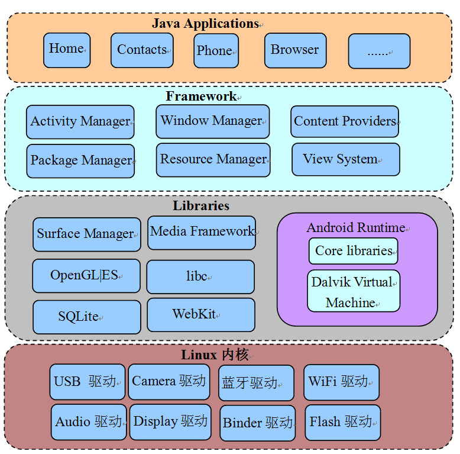 

图1-1  Android系统架构

从上图中可以看出，Android系统大体可分为四层，从下往上依次是：
<ul><li>Linux内核层，目前Android2.2（代号为Froyo）基于Linux内核2.6版本。</li><li>Libraries层，这一层提供动态库（也叫共享库）、Android运行时库、Dalvik虚拟机等。从编程语言上来说，这一层大部分都是用C或C++写的，所以也可以简单地把它看成是Native层。</li><li>Libraries层之上是Framework层，这一层大部分用Java语言编写。它是Android平台上Java世界的基石。</li><li>Framework层之上就是Applications层了，和用户直接交互的就是这些应用程序，它们都是用Java开发的。</li></ul>
从上面的介绍可看出，Android最大的特点之一，恐怕就是搭建了一个被广大Java开发者热捧的Java世界了。但该世界并不是空中楼阁，它的运转依赖另一个被Google极力隐藏的Native世界。两个世界的交互关系可用图1-2来表示：

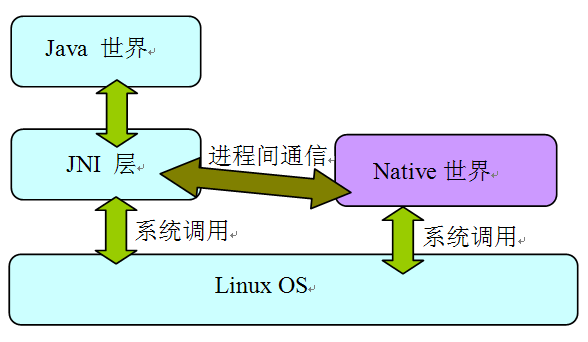 

图1-2  Java世界和Native世界交互

从上图可知：
<ul><li>Java虽具有和平台无关的特性，但Java和具体平台之间的隔离却是由JNI层来做到的。Java是通过JNI层调用Linux OS中的系统调用来完成对应的功能的。例如创建一个文件、创建一个Socket等。</li><li>除了Java世界外，还有一个核心的Native世界，它为整个系统高效和平稳的运行提供了强有力的支持。一般而言，Java世界经由JNI层通过IPC方式和Native世界交互。而Android平台上最为神秘的IPC方法就是Binder了。在第六章将详细介绍Binder。除此之外，Socket也是常用的IPC方式。这些内容在后面的代码分析中都会见到。</li></ul><h3>1.1.2  本书的架构</h3>
本书所分析的模块也将遵循Android系统架构，如图1-3所示：

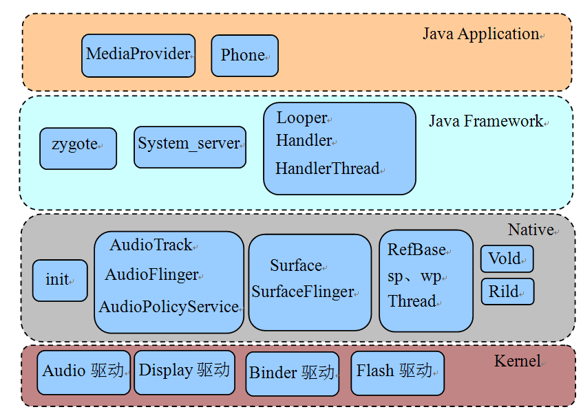

图1-3  本书的架构图

从上图可知，本书所分析的各个模块除未涉及Kernel外，其他三层均有所涉足，它们分别是：
<ul><li>Native层包括init、Audio系统（包括AudioTrack、AudioFlinger和AudioPolicyService）、Surface系统（包括Surface和SurfaceFlinger）、常用类（包括RefBase、sp、wp等）、Vold和Rild。</li><li>Java Framework层包括Zygote、System_server以及Java中的常用类（包括Handler、Looper等）。</li><li>Java Application层，包括MediaProvider和Phone。</li></ul>
 
<h2>1.2  搭建开发环境</h2>
本节，将介绍如何搭建Android源码开发环境。

首先，需要一个Linux系统，我本人推荐安装Ubuntu10.04（32位版本）。读者可从网上下载该版本的系统。Windows用户可使用VMWare或VirtualBox作为虚拟机，来安装Ubuntu10.04。我本人推荐VMWare，因为它的功能太强大了！

如果要使用VMWare，那么在安装完Ubuntu之后，一定要把VMWare Tools也安装上，因为这个工具会提供很多非常实用的功能。这里还有一个小建议，如果Linux系统只是个人使用，则建议用root账户登录系统。在工作中，曾发现很多用非root账户登录的同事整天都在sudo，输入密码，这样做就浪费了不少零碎的时间片。

假设读者已经安装好了Ubuntu 10.04（32位版本），并且以root账户登录到系统上了，接下来的工作是：
<h3>1.2.1 下载源码</h3>
Android源码采用Git<a>①</a>做版本管理工具，这个工具由Linux之父LinusTorvalds采用纯C开发。关于Git为什么使用C语言开发的问题，还引发了一场关于C和C++孰好孰坏的大讨论，不过Linus Torvalds显然没树起“居庙堂之高，则忧其民”的形象。对于普通码农而言，用最合适的工具、最实用的办法来完成好工作才是最重要的。所以C、C++、Java、Python等都仅仅是工具而已。

下面介绍如何下载源码。
<h4>1. 设置软件源</h4>
下载Android源码前，有些下载工具需要从Ubuntu软件源上下载。可以为Ubuntu系统指定一个软件源。有些软件源上有这些工具，有些却没有，而且各个软件源的下载速度也不同，所以应首先找到一个合适的软件源。Ubuntu软件源的设置界面如图1-4所示：

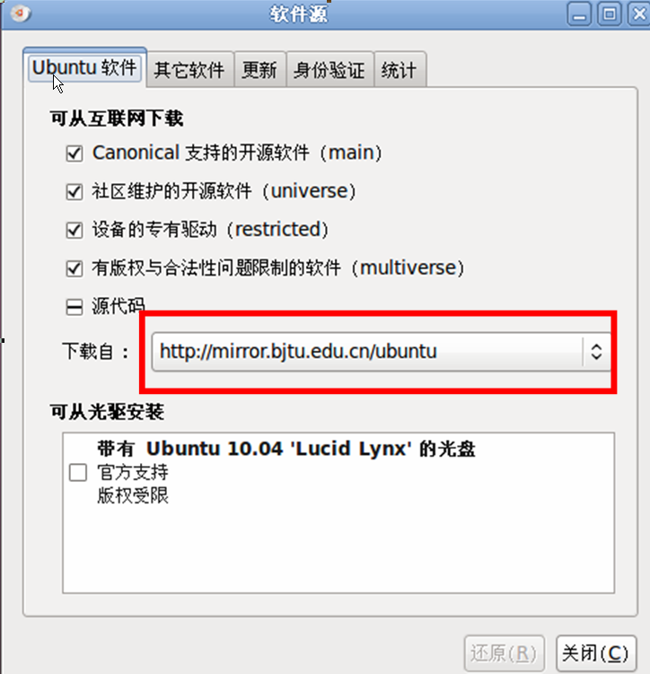 

图1-4  Ubuntu软件源设置

从上图中可发现，将软件源地址设置成了<a>http://mirror.bjtu.edu.cn/ubuntu</a>。每个人可根据自己的情况选择合适的软件源。
<h4>2. 下载Android源码</h4>
下面开始下载Android源码，工序比较简单，可一气呵成。
<ul><li>apt-get install git-core curl   #先下载这两个工具</li><li>mkdir –p ~/android/froyo            #在登录用户的目录下新建android和froyo两个目录</li><li>cd ~/android/froyo               #进入这个目录</li><li>curl http://Android.git.kernel.org/repo &gt; ./repo  #从源码网站下载repo脚本，该脚本是Google为了方便源码下载而提供的。通过该脚本可下载整套源码。</li><li>chmod a+x repo     #设置该脚本为可执行</li><li> ./repo init -u git://Android.git.kernel.org/platform/manifest.git –bfroyo       #初始化git库</li><li> ./repo sync      #下载源码，大小为2个多GB，网速快估计得要2个多小时。</li></ul>
下载完后，该目录中的内容如图1-5所示：

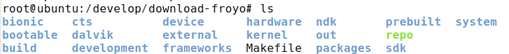 

图1-5  源码下载结果

注意，Kernel的代码必须要单独下载，下载方法如下：

git clone git://android.git.kernel.org/kernel/common.gitkernel
<h3>1.2.2  编译源码</h3><h4>1. 部署JDK</h4>
Froyo的编译依赖JDK1.5，所以首先要做的就是下载JDK1.5。下载网址是<a>http://www.oracle.com/technetwork/java/javase/downloads/index-jdk5-jsp-142662.html</a>。下载得到的文件为jdk-1_5_0_22-linux-i586.bin。把它放到一个目录中，比如我本人，就将它放在了/develop中，然后在这个目录中执行：

./jdk-1_5_0_22-linux-i586.bin  #执行这个文件

这个命令其实就是解压，解压后的结果在/develop/jdk1.5.0_22目录中。现有了JDK，再按照下面的步骤部署它即可：
<ul><li>在~/.bashrc文件的末尾添加以下几句话：</li></ul>
exportJAVA_HOME=/develop/jdk1.5.0_22 #设置为刚才解压的目录

exportJRE_HOME=JAVA_HOME/jre

exportCLASSPATH=$JAVA_HOME/lib:$JRE_HOME/lib:$CLASSPATH

exportPATH=$JAVA_HOME/bin:$JRE_HOME/bin:$PATH
<ul><li>重新登录系统，这样，JDK资源就能被正确找到了。</li></ul><h4>2. 编译源码</h4>
Android的编译有自己的一套规则，主要利用的就是mk文件。网上有太多关于它的解说了，这里不再赘述，只简单介绍其编译工序：

进入源码目录（以我的开发环境为例），也就是 cd /develop/download_froyo
<ul><li>执行 . build/envsetup.sh，这个脚本用来设置Android的编译环境。</li><li>执行choosecombo命令，这个命令用来选择编译目标（如目标硬件平台、eng还是user等）。一般而言，手机厂商会设置自己特有的编译选项。</li></ul>
执行完上面几个步骤后，就可以编译系统了。Android平台提供了三个命令用于编译，它们分别是make、mmm和mm，这三个命令的使用方法及其优劣如下：
<ul><li>make：不带任何参数，它用于编译整个系统，时间较长，我本人不推荐这种做法，除非读者想编译整个系统。</li><li>make MediaProvider ：下面几个例子都以编译MediaProvider为例。这种方式对应于单个模块编译。它的优点是，会把该模块依赖的其他模块也一起编译。例如 make libmedia，就会把libmedia依赖的库全编译好。其缺点也很明显，它需要搜索整个源码来定义MediaProvider模块所使用的Android.mk文件，并且还要判断该模块所依赖的其他模块是否有修改。整体编译时间较长。</li><li>mmm packages/providers/MediaProvider ：该命令将编译指定目录下的目标模块，而不编译它所依赖的模块。所以如果读者是初次编译，采用这种方式编译一个模块往往会报错。错误的原因是因为它依赖的模块没有被编译。</li><li>mm ：这种方式需要先cdpackages/providers/MediaProvider目录，然后mm。该命令会编译当前目录下的模块。它和mmm一样，只编译目标模块。mm和mmm命令编译的速度都很快。</li></ul>
从使用的角度来看，我本人有如下建议：
<ul><li>如果只知道目标模块名，则应使用make 模块名的方式来编译目标模块。例如编译libmedia，则直接使用make libmedia即可。另外，初次编译时也要采用这种方法。</li><li>如果不知道目标模块名，而知道目标模块所处的目录，则可使用mmm或mm命令来编译。当然，初次编译还必须使用make命令。而以后的编译就可使用mmm或mm了，这样会节约不少时间。</li></ul>

一般的编译方式都使用增量编译，即只编译发生变化的目标文件。但有时则需重新编译所有目标文件，那么就可使用make命令的-B选项。例如 make –B 模块名，或者mm –B、mmm –B 。mm和mmm内部，也是调用make命令的，而make的-B选项将强制编译所有目标文件。

Android的编译工序比较简单，难点主要在Android.mk文件的编写。读者可上网搜索与此相关的学习资料。
<h4>3．本书各模块的编译目标</h4>
本书各模块的编译目标如表1-1所示，这里仅列出几个有代表性的模块：

表1-1  本书各模块编译目标
<table><tbody><tr><td>
目标模块
</td> <td>
make命令
</td> <td>
mmm命令
</td> </tr><tr><td>
init
</td> <td>
make init
</td> <td>
mmm system/core/init
</td> </tr><tr><td>
zygote
</td> <td>
make app_process
</td> <td>
mmm frameworks/base/cmds/app_process
</td> </tr><tr><td>
system_server
</td> <td>
make services
</td> <td>
mmm frameworks/base/services/java
</td> </tr><tr><td>
RefBase等
</td> <td>
make libutils
</td> <td>
mmm frameworks/base/libs/utils
</td> </tr><tr><td>
Looper等
</td> <td>
make framework
</td> <td>
mmm frameworks/base
</td> </tr><tr><td>
AudioTrack
</td> <td>
make libmedia
</td> <td>
mmm frameworks/base/media/libmedia
</td> </tr><tr><td>
AudioFlinger
</td> <td>
make libaudioflinger
</td> <td>
mmm frameworks/base/libs/audioflinger
</td> </tr><tr><td>
AudioPolicyService
</td> <td>
make libaudiopolicy
</td> <td>
mmm hardware/msm7k/libaudio-qsd8k (示例)
</td> </tr><tr><td>
SurfaceFlinger
</td> <td>
make libsurfaceflinger
</td> <td>
mmm frameworks/base/libs/surfaceflinger
</td> </tr><tr><td>
Vold
</td> <td>
make vold
</td> <td>
mmm system/vold/
</td> </tr><tr><td>
Rild
</td> <td>
make rild
</td> <td>
mmm hardware/ril/rild/
</td> </tr><tr><td>
MediaProvider
</td> <td>
make MediaProvider
</td> <td>
mmm packages/providers/MediaProvider
</td> </tr><tr><td>
Phone
</td> <td>
make Phone
</td> <td>
mmm packages/apps/Phone/
</td> </tr></tbody></table>
假设make framework，那么编译完的结果则如图1-6所示：

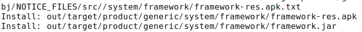 

图1-6  make framework的结果

从上图可看出，make命令编译了framework-res.apk以及framework.jar两个模块。它们编译的结果在out/target/product/generic/system/framework下。读者利用adb 命令把这两个文件push到手机的system/framework目录，即可替换旧的文件。如想测试这个新模块，则需要先杀掉所有使用该模块的进程，进程重启后会重新加载模块，这时就能使用新的文件了。例如，想测试刚修改的libaudioflinger模块，adb push上去后，先杀掉mediaserver进程，因为libaudioflinger库目前只有该进程使用。当mediaserver重启后，就会加载新push上来的libaudioflinger库了。

系统服务被杀掉后一般都会自动重启（由init控制，在第三章中可见到）。

<h2>1.3  工具介绍</h2>
本节介绍Android开发和源码研究过程中两件比较实用的工具。
<h3>1.3.1  Source Insight介绍</h3>
Source Insight是阅读源码的必备工具，是一个Windows下的软件，在Linux平台上可通过wine安装。这里，就不讲述如何安装Source Insight了，相信读者都会。下面介绍一下在Source Insight使用上的小技巧。
<h4>1. Source Insight工作减负</h4>
使用Source Insight时，需要新建一个源码工程，通过菜单项Project→New Project，可指定源码的目录。在工作中发现，很多同事常一股脑把Android所有源代码都加到工程中，从而导致了Source Insight运行速度非常慢。实际上，只需要将当前分析的源码目录加到工程即可。例如，新建一个Source Insight工程后，只把源码/framework/base目录加进去了。另外，当一个目录下的源码分析完后，可以通过Project→Add and Remove Project Files选项把无须再分析的目录从工程中去掉。如图1-7所示：

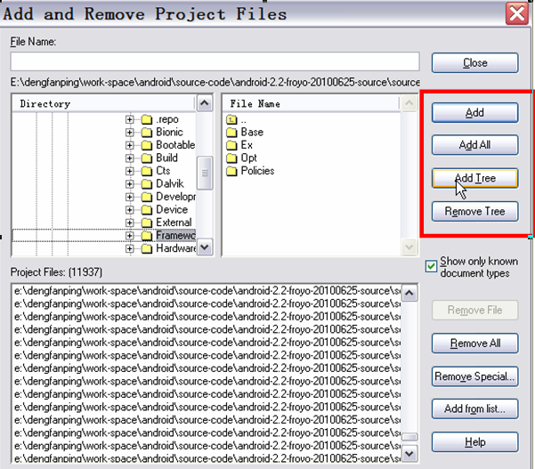 

图1-7  添加或删除工程中的目录

从图中的框线我们可以发现：
<ul><li>Source Insight支持动态添加或删除目录。通过这种方式可极大减少Source Insight的工作负担。</li></ul>

一般首先把framework/base下的目录加到工程，以后如有需要，再把其他目录加进来。

<h4>2. 调节字体</h4>
Source Insight默认的字体比较小，看着很费眼。怎么办？

选择工具栏上Options→Document options菜单，弹出Document Options对话框，其中左上部分有个Screen Fonts，然后会弹出一个字体对话框，在那里可选择大字体，例如四号，五号字体等。如图1-8所示：

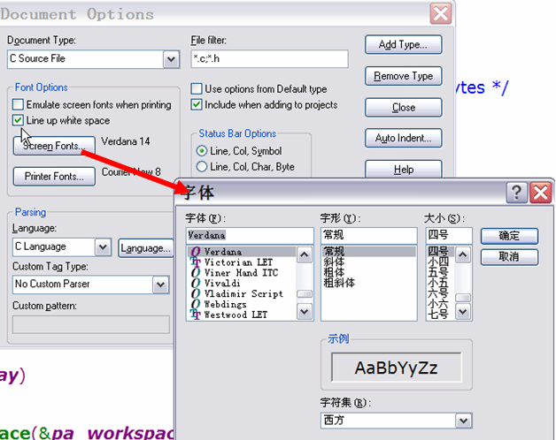 

图1-8  字体调节
<h4>3. 快速定位文件</h4>
工程建立好后，须通过Project→Rebuild Project选项来解析源码。另外，在研究源码时常常会只记得源码文件名，而不记得是在哪个目录下。没关系，Source Insight支持在源码中快速定位文件。使用方法如图1-9所示：

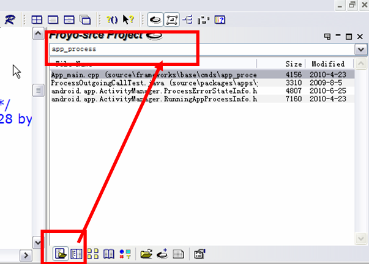 

图1-9  快速定位文件

使用方法是：
<ul><li>先选择图1-9中左下角的那个按钮。</li><li>然后在左上角那个输入框中输入源码文件名，例如app_process。然后结果栏中就会把对应文件列出。</li></ul>
                    
<h3>1.3.3   Busybox的使用</h3>
Busybox，号称Linux平台上的“瑞士军刀”，它提供了很多常用的工具，例如grep、find等。这些工具在标准Linux上都有，但Android系统却去掉了其中的大多数工具。这导致了我们在调试程序、研究Android系统时步履维艰，所以就需要在手机上安装Busybox。
<h4>1. 下载Busybox</h4>
我们可从下面这个网站中下载已编译好的Busybox，如图1-10所示：

<a>http://www.busybox.net/downloads/binaries/1.18.4/</a>

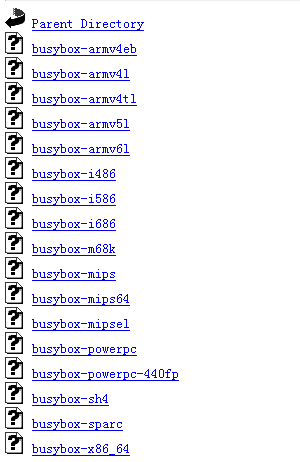 

图1-10  Busybox下载

注意该网站已经根据不同平台编译好了对应的Busybox，我们可根据自己手机的情况下载对应的文件。例如HTC G7的CPU支持armv7l，所以我下载了最接近的busybox-armv6l。

小知识：arm v7表示的是ARM指令集为v7，目前ARM Cortex-A8/A9系列的CPU支持该指令集。

<h4>2. 安装和使用Busybox</h4>
下载完busybox后，需将它push到手机上。如：

adb push busybox /system/xbin #为了避免冲突，我push到了/system/xbin目录下了。

cd /system/xbin     #进入对应目录

chmod 755 busybox  #更改busybox权限为可执行

busybox –-install  #安装busybox

grep  #执行busybox提供的grep命令，或者busybox xxx执行xxx命令也行

Busybox安装完了，如执行busybox命令，就会打印如图1-11的输出。

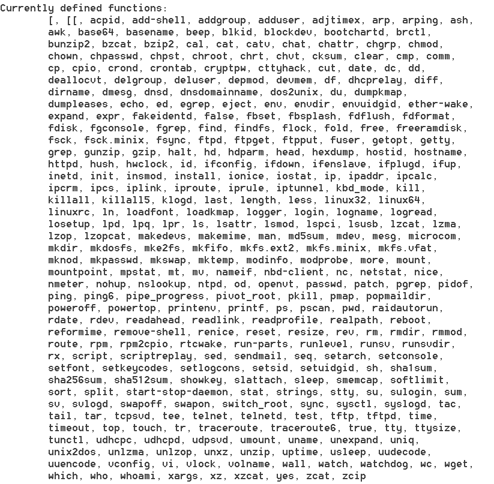 

图1-11  busybox提供的工具

从上图中可看出，busybox提供了不少的工具，这样，我们在研究Android系统时就如虎添翼了。

给手机安装busybox须有root权限，为学好Android，大家最好还是购买那种能被破解的手机吧。

<h2>1.4  本章小结</h2>
本章对Android系统、源码搭建、研究工具等做了部分介绍，相信读者现在已是迫不及待，跃跃欲试了吧？马上开始我们的源码征程！

 

<a>①</a> 如果你对Git不熟或者是对此很感兴趣，建议阅读《Git权威指南》（机械工业出版社，2011.7月出版，蒋鑫 著），这是目前最全面、最深入的一本Git著作。

 
 
版权声明：本文为博主原创文章，未经博主允许不得转载。
 
 
