<h1>第7章  深入理解Audio系统</h1>
本章主要内容

·  详细分析AudioTrack。

·  详细分析AudioFlinger。

·  详细分析AudioPolicyService。

本章涉及的源代码文件名及位置

下面是本章分析的源码文件名及其位置。

·  AudioTrack.java

framework/base/media/java/com/android/media/AudioTrack.java

·  android_media_track.cpp

framework/base/core/jni/android_media_track.cpp

·  MemoryHeapBase

framework/base/libs/binder/MemoryHeapBase.cpp

·  MemoryBase.h

framework/base/include/binder/MemoryBase.h

·  AudioTrack.cpp

framework/base/libmedia/AudioTrack.cpp

·  audio_track_cblk_t声明 

framework/base/include/private/media/AudioTrackShared.h

·  audio_track_cblk_t定义 

framework/base/media/libmedia/AudioTrack.cpp

·  Main_MediaServer.cpp

framework/base/media/mediaserver/Main_MediaServer.cpp

·  AudioFlinger.cpp

framework/base/libs/audioFlinger/AudioFlinger.cpp

·  AudioHardwareInterface.h

hardware/libhardware_legacy/include/hardware_legacy/AudioHardwareInterface.h

·  AudioMixer.cpp

framework/base/libs/audioflinger/AudioMixer.cpp

·  AudioSystem.h

framework/base/include/media/AudioSystem.h

·  AudioSystem.cpp

framework/base/media/libmedia/AudioSystem.cpp

·  AudioPolicyInterface.h

hardware/libhardware_legacy/include/hardware_legacy

·  AudioPolicyManagerBase.cpp

framework/base/libs/audioflinger/AudioPolicyManagerBase.cpp

·  AudioService.java

framework/base/media/java/com/android/media/AudioService.java

·  Android_media_AudioSystem.cpp

framework/base/core/Jni/Android_media_AudioSystem.cpp
<h2><a>7.1  </a>综述</h2>
Audio系统是Android平台的重要组成部分，它主要包括三方面的内容：

·  AudioRcorder和AudioTrack：这两个类属于Audio系统对外提供的API类，通过它们可以完成Android平台上音频数据的采集和输出任务。

·  AudioFlinger：它是Audio系统的工作引擎，管理着系统中的输入输出音频流，并承担音频数据的混音，以及读写Audio硬件以实现数据的输入输出等工作。

·  AudioPolicyService，它是Audio系统的策略控制中心，具有掌管系统中声音设备的选择和切换、音量控制等功能。

Android的Audio系统是我们分析的第一个具有相当难度的复杂系统。对于这种系统，我采取的学习方法是，以一个常见用例为核心，沿着重要函数调用的步骤逐步进行深入分析。中途若出现所需但并不熟悉的知识，则以此为契机，及时学习、思考、研究，当不熟悉的知识逐渐被自己了解掌握时，该系统的真面目也随之清晰了。

下面是破解Audio系统的战略步骤：

·  首先，从API类的AudioTrack开始，从Java层到Native层一步步了解其工作原理。其中AudioTrack和AudioFlinger有较多的交互工作，但在这一步中，我们暂时只集中关注AudioTrack的流程。

·  提炼上一步中AudioTrack和AudioFlinger的交互流程，以这个交互流程作为分析AudioFlinger的突破口。

·  在前面两个步骤中还会有一些剩余的“抵抗分子”，我们将在AudioPolicyService的破解过程中把它们彻底消灭掉。另外，在分析AudioPolicyService时，还会通过一个耳机插入事件的处理实例来帮助分析AudioPolicyService的工作流程。

·  最后，在本章的拓展部分，我们会介绍一下AudioFlinger中DuplicatingThread的工作原理。

说明：在下文中AudioTrack被简写为AT，AudioFlinger被简写为AF，AudioPolicyService被简写为AP。

让我们整装上阵，开始代码的征程吧！

 
<h2><a>7.2  AudioTrack</a>的破解</h2>
AudioTrack属于Audio系统对外提供的API类，所以它在Java层和Native层均有对应类，先从Java层的用例开始。
<h3><a>7.2.1 </a>用例介绍</h3>
这个用例很简单，但其中会有一些重要概念，应注意理解。

注意：要了解AudioTrack Java API的具体信息，需要仔细阅读Android API中的相关文档。阅读API文档，是一个能快速掌握相关知识的好方法。

[--&gt;AudioTrackAPI使用例子（Java层）]

//① 根据音频数据的特性来确定所要分配的缓冲区的最小size

int bufsize = 

          AudioTrack.getMinBufferSize(8000,//采样率：每秒8K个点                      

　　      AudioFormat.CHANNEL_CONFIGURATION_<a>STEREO</a>,//声道数：双声道            

        AudioFormat.ENCODING_PCM_16BIT//采样精度：一个采样点16比特，相当于2个字节

); 

 

//② 创建AudioTrack

AudioTrack trackplayer = new AudioTrack(

                 AudioManager.STREAM_MUSIC,//音频流类型

                 8000,AudioFormat.CHANNEL_CONFIGURATION_ STEREO,

　　                 AudioFormat.ENCODING_PCM_16BIT, bufsize,

                 AudioTrack.MODE_STREAM//数据加载模式); 

  //③ 开始播放

trackplayer.play() ; 

 

......

//④ 调用write写数据

trackplayer.write(bytes_pkg, 0,bytes_pkg.length) ;//往track中写数据

......

 //⑤ 停止播放和释放资源

trackplayer.stop();//停止播放

trackplayer.release();//释放底层资源

上面的用例引入了两个新的概念，一个是数据加载模式，另一个是音频流类型。下面进行详细介绍。
<h4>1. AudioTrack的数据加载模式</h4>
AudioTrack有两种数据加载模式：MODE_STREAM和MODE_STATIC，它们对应着两种完全不同的使用场景。

·  MODE_STREAM：在这种模式下，通过write一次次把音频数据写到AudioTrack中。这和平时通过write系统调用往文件中写数据类似，但这种工作方式每次都需要把数据从用户提供的Buffer中拷贝到AudioTrack内部的Buffer中，这在一定程度上会使引入延时。为解决这一问题，AudioTrack就引入了第二种模式。

·  MODE_STATIC：这种模式下，在play之前只需要把所有数据通过一次write调用传递到AudioTrack中的内部缓冲区，后续就不必再传递数据了。这种模式适用于像铃声这种内存占用量较小，延时要求较高的文件。但它也有一个缺点，就是一次write的数据不能太多，否则系统无法分配足够的内存来存储全部数据。

这两种模式中以MODE_STREAM模式相对常见和复杂，我们的分析将以它为主。

注意：如果采用STATIC模式，须先调用write写数据，然后再调用play。

<h4>2. 音频流的类型</h4>
在AudioTrack构造函数中，会接触到AudioManager.STREAM_MUSIC这个参数。它的含义与Android系统对音频流的管理和分类有关。

Android将系统的声音分为好几种流类型，下面是几个常见的：

·  STREAM_ALARM：警告声

·  STREAM_MUSIC：音乐声，例如music等

·  STREAM_RING：铃声

·  STREAM_SYSTEM：系统声音，例如低电提示音，锁屏音等

·  STREAM_VOCIE_CALL：通话声

注意：上面这些类型的划分和音频数据本身并没有关系。例如MUSIC和RING类型都可以是某首MP3歌曲。另外，声音流类型的选择没有固定的标准，例如，铃声预览中的铃声可以设置为MUSIC类型。

音频流类型的划分和Audio系统对音频的管理策略有关。其具体作用，在以后的分析中再做详细介绍。在目前的用例中，把它当做一个普通数值即可。
<h4>3. Buffer分配和Frame的概念</h4>
在用例中碰到的第一个重要函数就是getMinBufferSize。这个函数对于确定应用层分配多大的数据Buffer具有重要指导意义。先回顾一下它的调用方式：

[--&gt;AudioTrackAPI使用例子（Java层）]

//注意这些参数的值。想象我们正在一步步的Trace，这些参数都会派上用场

AudioTrack.getMinBufferSize(8000,//每秒8K个点                               

　　      AudioFormat.CHANNEL_CONFIGURATION_STEREO,//双声道                   

        AudioFormat.ENCODING_PCM_16BIT);

 

来看这个函数的实现：

[--&gt;AudioTrack.java]

static public int getMinBufferSize(intsampleRateInHz, int channelConfig,   

                                  intaudioFormat) {

       int channelCount = 0;

       switch(channelConfig) {

       case AudioFormat.CHANNEL_OUT_MONO:

        caseAudioFormat.CHANNEL_CONFIGURATION_MONO:

           channelCount = 1;

           break;

       case AudioFormat.CHANNEL_OUT_STEREO:

       case AudioFormat.CHANNEL_CONFIGURATION_STEREO:

           channelCount = 2;//目前最多支持双声道 

           break;

        default:

           return AudioTrack.ERROR_BAD_VALUE;

        }

        //目前只支持PCM8和PCM16精度的音频数据    

        if((audioFormat != AudioFormat.ENCODING_PCM_16BIT) 

           &amp;&amp; (audioFormat != AudioFormat.ENCODING_PCM_8BIT)) {

           return AudioTrack.ERROR_BAD_VALUE;

        }

      //对采样频率也有要求，太低或太高都不行。

        if( (sampleRateInHz &lt; 4000) || (sampleRateInHz &gt; 48000) ) 

            return AudioTrack.ERROR_BAD_VALUE;

       

       /*

        调用Native函数，先想想为什么，如果是简单计算，那么Java层做不到吗？

        原来，还需要确认硬件是否支持这些参数，当然得进入Native层查询了

        */ 

       int size = native_get_min_buff_size(sampleRateInHz,          

                 channelCount,audioFormat);                        

        if((size == -1) || (size == 0)) {

             return AudioTrack.ERROR;

        }

       else {

           return size;

        }

}

Native的函数将查询Audio系统中音频输出硬件HAL对象的一些信息，并确认它们是否支持这些采样率和采样精度。

说明：HAL对象的具体实现和硬件厂商有关系，如果没有特殊说明，我们则把硬件和HAL作为一种东西讨论。

来看Native的native_get_min_buff_size函数。它在android_media_track.cpp中。

[--&gt;android_media_track.cpp]

/*

注意我们传入的参数是：

sampleRateInHertz = 8000，nbChannels = 2

audioFormat = AudioFormat.ENCODING_PCM_16BIT

*/

static jintandroid_media_AudioTrack_get_min_buff_size(                     

                 JNIEnv*env,  jobject thiz,

                 jintsampleRateInHertz, jint nbChannels, jint audioFormat) 

{

    intafSamplingRate;

    intafFrameCount;

    uint32_t afLatency;

     /*

        下面这些调用涉及了AudioSystem，这个和AudioPolicy有关系。这里仅把它们看成是

信息查询即可 

    */

   //查询采样率，一般返回的是所支持的最高采样率，例如44100

    if(AudioSystem::getOutputSamplingRate(&amp;afSamplingRate) != NO_ERROR) {

       return -1;

}

     //① 查询硬件内部缓冲的大小，以Frame为单位。什么是Frame？

    if(AudioSystem::getOutputFrameCount(&amp;afFrameCount) != NO_ERROR) {

       return -1;

    }

    //查询硬件的延时时间

    if(AudioSystem::getOutputLatency(&amp;afLatency) != NO_ERROR) {

       return -1;

}

......

这里有必要插入内容，因为代码中出现了音频系统中的一个重要概念：Frame（帧）。

说明：Frame是一个单位，经多方查寻，最终在ALSA的wiki中找到了对它的解释。Frame直观上用来描述数据量的多少，例如，一帧等于多少字节。1单位的Frame等于1个采样点的字节数×声道数（比如PCM16，双声道的1个Frame等于2×2=4字节）。

我们知道，1个采样点只针对一个声道，而实际上可能会有一或多个声道。由于不能用一个独立的单位来表示全部声道一次采样的数据量，也就引出了Frame的概念。Frame的大小，就是一个采样点的字节数×声道数。另外，在目前的声卡驱动程序中，其内部缓冲区也是采用Frame作为单位来分配和管理的。

  OK，继续native_get_min_buff_size函数。

   ......

   // minBufCount表示缓冲区的最少个数，它以Frame作为单位

   uint32_t minBufCount = afLatency / ((1000 *afFrameCount)/afSamplingRate);

    if(minBufCount &lt; 2) minBufCount = 2;//至少要两个缓冲

 

   //计算最小帧个数

   uint32_tminFrameCount =                

         (afFrameCount*sampleRateInHertz*minBufCount)/afSamplingRate;

  //下面根据最小的FrameCount计算最小的缓冲大小    

   intminBuffSize = minFrameCount //计算方法完全符合我们前面关于Frame的介绍

           * (audioFormat == javaAudioTrackFields.PCM16 ? 2 : 1)

           * nbChannels;

 

    returnminBuffSize; 

}

getMinBufSize会综合考虑硬件的情况（诸如是否支持采样率，硬件本身的延迟情况等）后，得出一个最小缓冲区的大小。一般我们分配的缓冲大小会是它的整数倍。

好了，介绍完一些基本概念后，开始要分析AudioTrack了。
<h3><a>7.2.2  AudioTrack</a>（Java空间）的分析</h3>

注意：Java空间的分析包括JNI这一层，因为它们二者的关系最为紧密。

<h4>1. AudioTrack的构造</h4>
回顾一下用例中调用AudioTrack构造函数的代码：

AudioTrack trackplayer = new AudioTrack(

                 AudioManager.STREAM_MUSIC,

                 8000,AudioFormat.CHANNEL_CONFIGURATION_ STEREO,

　　                 AudioFormat.ENCODING_PCM_16BIT,bufsize,

                 AudioTrack.MODE_STREAM);

AudioTrack构造函数的实现在AudioTrack.java中。来看这个函数：

[--&gt;AudioTrack.java]

public AudioTrack(int streamType, intsampleRateInHz, int channelConfig, 

                 intaudioFormat,int bufferSizeInBytes, int mode)

                  throws IllegalArgumentException {

        

        mState= STATE_UNINITIALIZED;

        //检查参数是否合法

       audioParamCheck(streamType, sampleRateInHz, channelConfig, 

                         audioFormat,mode);

       //bufferSizeInBytes是通过getMinBufferSize得到的，所以下面的检查肯定能通过

       audioBuffSizeCheck(bufferSizeInBytes);

 

        /*

           调用native层的native_setup，构造一个WeakReference传进去。

           不了解Java WeakReference读者可以上网查一下，很简单

       */

       int initResult = native_setup(new WeakReference&lt;AudioTrack&gt;(this),

         mStreamType,//这个值是AudioManager.STREAM_MUSIC    

         mSampleRate, //这个值是8000        

        mChannels,   //这个值是2 

        mAudioFormat,//这个值是AudioFormat.ENCODING_PCM_16BIT       

         mNativeBufferSizeInBytes,//这个值等于bufferSizeInBytes               

        mDataLoadMode);//DataLoadMode是MODE_STREAM        

         ....

}

OK，native_setup对应的JNI层函数是android_media_AudioTrack_native_setup。一起来看：

[--&gt;android_media_AudioTrack.cpp]

static int

android_media_AudioTrack_native_setup(JNIEnv*env, jobject thiz,    

                         jobjectweak_this,jint streamType,         

                         jintsampleRateInHertz, jint channels,    

                         jintaudioFormat, jint buffSizeInBytes,   

                         jintmemoryMode)                  

{

    intafSampleRate;

    intafFrameCount;

    //进行一些信息查询

  AudioSystem::getOutputFrameCount(&amp;afFrameCount, streamType)；

  AudioSystem::getOutputSamplingRate(&amp;afSampleRate, streamType)；

  AudioSystem::isOutputChannel(channels)；

   //popCount用于统计一个整数中有多少位为1，有很多经典的算法

int nbChannels = AudioSystem::popCount(channels);

    //Java层的值和JNI层的值转换

    if(streamType == javaAudioTrackFields.STREAM_MUSIC) 

         atStreamType = AudioSystem::MUSIC;

    

   intbytesPerSample = audioFormat == javaAudioTrackFields.PCM16 ? 2 : 1;

   intformat = audioFormat == javaAudioTrackFields.PCM16 ? 

                  AudioSystem::PCM_16_BIT : AudioSystem::PCM_8_BIT;

    

    //计算以帧为单位的缓冲大小

    intframeCount = buffSizeInBytes / (nbChannels * bytesPerSample);

 

     //① AudioTrackJniStorage对象，它保存了一些信息，后面将详细分析

   AudioTrackJniStorage* lpJniStorage = new AudioTrackJniStorage();

      ......

     //②创建Native层的AudioTrack对象

   AudioTrack* lpTrack = new AudioTrack();

       if(memoryMode == javaAudioTrackFields.MODE_STREAM) {

       //③STREAM模式

      lpTrack-&gt;set(

           atStreamType,//指定流类型

           sampleRateInHertz,

           format,// 采样点的精度，一般为PCM16或者PCM8

           channels,

           frameCount,

           0,// flags

           audioCallback, //该回调函数定义在android_media_AudioTrack.cpp中    

        &amp;(lpJniStorage-&gt;mCallbackData),

           0,

           0,// 共享内存,STREAM模式下为空。实际使用的共享内存由AF创建 

           true);//内部线程可以调用JNI函数，还记得“zygote偷梁换柱”那一节吗？

         } else if (memoryMode == javaAudioTrackFields.MODE_STATIC) {

          //如果是static模式，需要先创建共享内存

         lpJniStorage-&gt;allocSharedMem(buffSizeInBytes);

         lpTrack-&gt;set(

           atStreamType,// stream type

           sampleRateInHertz,

           format,// word length, PCM

           channels,

           frameCount,

           0,// flags

           audioCallback, 

          &amp;(lpJniStorage-&gt;mCallbackData), 

           0, 

           lpJniStorage-&gt;mMemBase, //STATIC模式下，需要传递该共享内存

           true); 

    }

 

    ......

    /*

      把JNI层中new出来的AudioTrack对象指针保存到Java对象的一个变量中，

      这样就把JNI层的AudioTrack对象和Java层的AudioTrack对象关联起来了，

     这是Android的常用技法。                         

   */    

     env-&gt;SetIntField(thiz,javaAudioTrackFields.nativeTrackInJavaObj,

                     (int)lpTrack);

   // lpJniStorage对象指针也保存到Java对象中

   env-&gt;SetIntField(thiz, javaAudioTrackFields.jniData,(int)lpJniStorage);

  }

上边的代码列出了三个要点，这一节仅分析AudioTrackJniStorage这个类，其余的作为Native AudioTrack部分放在后面进行分析。
<h4>2. AudioTrackJniStorage分析</h4>
AudioTrackJniStorage是一个辅助类，其中有一些有关共享内存方面的较重要的知识，这里先简单介绍一下。
<h5>（1） 共享内存介绍</h5>
共享内存，作为进程间数据传递的一种手段，在AudioTrack和AudioFlinger中被大量使用。先简单了解一下有关共享内存的知识：

·  每个进程的内存空间是4GB，这个4GB是由指针长度决定的，如果指针长度为32位，那么地址的最大编号就是0xFFFFFFFF，为4GB。

·  上面说的内存空间是进程的虚拟地址空间。换言之，在应用程序中使用的指针其实是指向虚拟空间地址的。那么，如何通过这个虚地址找到存储在真实物理内存中的数据呢？

上面的问题，引出了内存映射的概念。内存映射让虚拟空间中的内存地址和真实物理内存地址之间建立了一种对应关系。也就是说，进程中操作的0x12345678这块内存的地址，在经过OS内存管理机制的转换后，它实际对应的物理地址可能会是0x87654321。当然，这一切对进程来说都是透明的，这些活都由操作系统悄悄地完成了。这和我们的共享内存会有什么关系吗？

当然有，共享内存和内存映射有着重要关系。来看图7-1“共享内存示意图”：

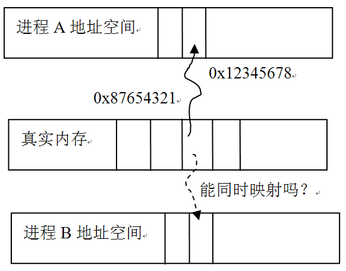 

图7-1  共享内存示意图

图7-1提出了一个关键性问题，即真实内存中0x87654321标志的这块内存页（OS的内存管理机制将物理内存分成了一个个的内存页，一块内存页的大小一般是4KB）现在已经映射到了进程A中。可它能同时映射到进程B中吗？如果能，那么在进程A中，对这块内存页所写的数据在进程B中就能看见了，这岂不就做到了内存在两个进程间共享吗？

事实确实如此，否则我们的生活就不会像现在这么美好了。这个机制是由操作系统提供和实现的，原理很简单，实现起来却很复杂，这里就不深究了。

如何创建和共享内存呢？不同系统会有不同的方法。Linux平台的一般做法是：

·  进程A创建并打开一个文件，得到一个文件描述符fd。

·  通过mmap调用将fd映射成内存映射文件。在mmap调用中指定特定参数表示要创建进程间共享内存。

·  进程B打开同一个文件，也得到一个文件描述符，这样A和B就打开了同一个文件。

·  进程B也要用mmap调用指定参数表示想使用共享内存，并传递打开的fd。这样A和B就通过打开同一个文件并构造内存映射，实现了进程间内存共享。

注意，这个文件也可以是设备文件。一般来说，mmap函数的具体工作由参数中的那个文件描述符所对应的驱动或内核模块来完成。

除上述一般方法外，Linux还有System V的共享内存创建方法，这里就不再介绍了。总之，AT和AF之间的数据传递，就是通过共享内存方式来完成的。这种方式对于跨进程的大数据量传输来说，是非常高效的。
<h5>（2） MemoryHeapBase和MemoryBase类介绍</h5>
AudioTrackJniStorage用到了Android对共享内存机制的封装类。所以我们有必要先看看AudioTrackJniStorage的内容。

[--&gt;android_media_AudioTrack.cpp::AudioTrackJniStorage相关]

//下面这个结构就是保存一些变量，没有什么特别的作用

struct audiotrack_callback_cookie {

   jclass      audioTrack_class;

   jobject     audioTrack_ref;

 }; 

class AudioTrackJniStorage {

   public:

       sp&lt;MemoryHeapBase&gt;    mMemHeap;//这两个Memory很重要

       sp&lt;MemoryBase&gt;         mMemBase;

 

       audiotrack_callback_cookie mCallbackData;

       int                       mStreamType;

 

      boolallocSharedMem(int sizeInBytes) {

     /*  

      注意关于MemoryHeapBase和MemoryBase的用法。    

      先new一个MemoryHeapBase，再以它为参数new一个MemoryBase         

    */   

   //① MemoryHeapBase

    mMemHeap = new MemoryHeapBase(sizeInBytes, 0,"AudioTrack Heap Base");

   //②MemoryBase

    mMemBase= new MemoryBase(mMemHeap, 0, sizeInBytes);

   

    return true;

   }

};

注意代码中所标识的地方，它们很好地展示了这两个Memory类的用法。在介绍它们之前，先来看图7-2中与这两个Memory有关的家谱。

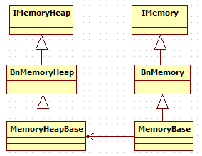 

图7-2  MemoryHeapBase和MemoryBase的家谱

MemoryHeapBase是一个基于Binder通信的类，根据前面的Binder知识，BpMemoryHeapBase由客户端使用，而MemoryHeapBase完成BnMemoryHeapBase的业务工作。

从MemoryHeapBase开始分析。它的使用方法是：

mMemHeap = new MemoryHeapBase(sizeInBytes, 0,"AudioTrack Heap Base");

它的代码在MemoryHeapBase.cpp中。

[--&gt;MemoryHeapBase.cpp]

/*

   MemoryHeapBase有两个构造函数，我们用的是第一个。

  size表示共享内存大小，flags为0，name为"AudioTrackHeap Base"

*/

MemoryHeapBase::MemoryHeapBase(size_t size,uint32_t flags,char const * name)

    :mFD(-1), mSize(0), mBase(MAP_FAILED), mFlags(flags),

     mDevice(0), mNeedUnmap(false)

{

    constsize_t pagesize = getpagesize();//获取系统中的内存页大小，一般为4KB

    size =((size + pagesize-1) &amp; ~(pagesize-1));

   /*    

     创建共享内存，ashmem_create_region函数由libcutils提供。 

     在真实设备上将打开/dev/ashmem设备得到一个文件描述符,在模拟器上则创建一个tmp文件     

  */

   int fd= ashmem_create_region(name == NULL ? "MemoryHeapBase" : name, size);

  //下面这个函数将通过mmap方式得到内存地址，这是Linux的标准做法，有兴趣的读者可以看看

   mapfd(fd,size); 

}

MemoryHeapBase构造完后，得到了以下结果：

·  mBase变量指向共享内存的起始位置。

·  mSize是所要求分配的内存大小。

·  mFd是ashmem_create_region返回的文件描述符。

另外，MemoryHeapBase提供了以下几个函数，可以获取共享内存的大小和位置。由于这些函数都很简单，仅把它们的作用描述一下即可。

MemoryHeapBase::getBaseID() //返回mFd，如果为负数，表明刚才创建共享内存失败了

MemoryHeapBase::getBase()  //共享内存起始地址

MemoryHeapBase::getSize() //返回mSize，表示内存大小

MemoryHeapBase确实比较简单，它通过ashmem_create_region得到一个文件描述符。

说明：Android系统通过ashmem创建共享内存的原理，和Linux系统中通过打开文件创建共享内存的原理类似，但ashmem设备驱动在这方面做了较大的改进，例如增加了引用计数、延时分配物理内存的机制（即真正使用的时候才去分配内存）等。这些内容，感兴趣的读者还可以自行对其研究。

那么，MemoryBase是何物？它又有什么作用？

MemoryBase也是一个基于Binder通信的类，它比起MemoryHeapBase就更显简单了，看起来更像是一个辅助类。它的声明在MemoryBase.h中。一起来看：

[--&gt;MemoryBase.h::MemoryBase声明]

class MemoryBase : public BnMemory 

{

public:

   MemoryBase(const sp&lt;IMemoryHeap&gt;&amp; heap,ssize_t offset, size_tsize);

   virtual sp&lt;IMemoryHeap&gt; getMemory(ssize_t* offset, size_t* size)const;

 

protected:

    size_tgetSize() const { return mSize; }//返回大小

    ssize_tgetOffset() const { return mOffset;}//返回偏移量

    //返回MemoryHeapBase对象      

    constsp&lt;IMemoryHeap&gt;&amp; getHeap() const { return mHeap;}

};

//MemoryBase的构造函数

MemoryBase::MemoryBase(constsp&lt;IMemoryHeap&gt;&amp; heap,ssize_t offset, size_t size)

    :mSize(size), mOffset(offset), mHeap(heap)

{

}

MemoryHeapBase和MemoryBase都够简单吧？总结起来不过是：

·  分配了一块共享内存，这样两个进程可以共享这块内存。

·  基于Binder通信，这样使用这两个类的进程就可以交互了。

这两个类在后续的讲解中会频繁碰到，但不必对它们做深入分析，只需把它当成普通的共享内存看待即可。

提醒：这两个类没有提供同步对象来保护这块共享内存，所以后续在使用这块内存时，必然需要一个跨进程的同步对象来保护它。这一点，是我在AT中第一次见到它们时想到的，不知道你是否注意过这个问题。

 
<h4>3. play和write的分析</h4>
还记得用例中的③和④关键代码行吗？ 

//③ 开始播放

trackplayer.play() ; 

//④ 调用write写数据

trackplayer.write(bytes_pkg, 0,bytes_pkg.length) ;//往track中写数据

现在就来分析它们。我们要直接转向JNI层来进行分析。相信你，现在已有能力从Java层直接跳转至JNI层了。
<h5>（1） play的分析</h5>
先看看play函数对应的JNI层函数，它是android_media_AudioTrack_start。

[--&gt;android_media_AudioTrack.cpp]

static void

android_media_AudioTrack_start(JNIEnv *env,jobject thiz)

{

/*

  从Java的AudioTrack对象中获取对应Native层的AudioTrack对象指针。

 从int类型直接转换成指针，不过要是以后ARM平台支持64位指针了，代码就得大修改了。

*/

   AudioTrack *lpTrack = (AudioTrack *)env-&gt;GetIntField(

        thiz,javaAudioTrackFields.nativeTrackInJavaObj);

   lpTrack-&gt;start(); //很简单的调用

}

play函数太简单了，至于它调用的start，等到Native层进行AudioTrack分析时，我们再去观察。
<h5>（2） write的分析</h5>
Java层的write函数有两个：

·  一个是用来写PCM16数据的，它对应的一个采样点的数据量是两个字节。

·  另外一个用来写PCM8数据的，它对应的一个采样点的数据量是一个字节。

我们的用例中采用的是PCM16数据。它对应的JNI层函数是android_media_AudioTrack_native_write_short，一起来看：

[--&gt;android_media_AudioTrack.cpp]

static jint android_media_AudioTrack_native_write_short(

                 JNIEnv*env,  jobject thiz,

                 jshortArrayjavaAudioData,jint offsetInShorts, 

                 jintsizeInShorts,jint javaAudioFormat) {

 

        return(android_media_AudioTrack_native_write(

                 env,thiz,(jbyteArray)javaAudioData,offsetInShorts*2,

                 sizeInShorts*2,javaAudioFormat)/ 2);

}

无论PCM16还是PCM8数据，最终都会调用writeToTrack函数。

[--&gt;android_media_AudioTrack.cpp]

jint writeToTrack(AudioTrack* pTrack, jintaudioFormat, 

                 jbyte*data,jint offsetInBytes, jint sizeInBytes) {

     

   ssize_t written = 0;

  /*

     如果是STATIC模式，sharedBuffer()返回不为空

     如果是STREAM模式，sharedBuffer()返回空

  */

      if (pTrack-&gt;sharedBuffer() == 0) {

         //我们的用例是STREAM模式，调用write函数写数据

       written = pTrack-&gt;write(data + offsetInBytes, sizeInBytes);

    } else{

        if (audioFormat == javaAudioTrackFields.PCM16){

           if ((size_t)sizeInBytes &gt; pTrack-&gt;sharedBuffer()-&gt;size()) {

               sizeInBytes = pTrack-&gt;sharedBuffer()-&gt;size();

           }

        //在STATIC模式下，直接把数据memcpy到共享内存，记住在这种模式下要先调用write

        //后调用play

          memcpy(pTrack-&gt;sharedBuffer()-&gt;pointer(), 

                         data+ offsetInBytes, sizeInBytes);

           written = sizeInBytes;

        }else if (audioFormat == javaAudioTrackFields.PCM8) {

          //如果是PCM8数据，则先转换成PCM16数据再拷贝

           ......

    }

    returnwritten;

}

看上去，play和write这两个函数还真是比较简单，须知，大部分工作还都是由Native的AudioTrack来完成的。继续Java层的分析。
<h4>4. release的分析</h4>
当数据都write完后，需要调用stop停止播放，或者直接调用release来释放相关资源。由于release和stop有一定的相关性，这里只分析release调用。

[--&gt;android_media_AudioTrack.cpp]

static voidandroid_media_AudioTrack_native_release(JNIEnv *env,  jobject thiz) {

       

    //调用android_media_AudioTrack_native_finalize真正释放资源

   android_media_AudioTrack_native_finalize(env, thiz);

    //之前保存在Java对象中的指针变量此时都要设置为零

   env-&gt;SetIntField(thiz, javaAudioTrackFields.nativeTrackInJavaObj, 0);

   env-&gt;SetIntField(thiz, javaAudioTrackFields.jniData, 0);

}

[--&gt;android_media_AudioTrack.cpp]

static voidandroid_media_AudioTrack_native_finalize(JNIEnv *env, jobject thiz) {

   AudioTrack *lpTrack = (AudioTrack *)env-&gt;GetIntField(

                           thiz, javaAudioTrackFields.nativeTrackInJavaObj);

    if(lpTrack) {

       lpTrack-&gt;stop();//调用stop

       delete lpTrack; //调用AudioTrack的析构函数

}

......

}

扫尾工作也很简单，没什么需要特别注意的。

至此，在Java空间的分析工作就完成了。但在进入Native空间的分析之前，要总结一下Java空间使用Native的AudioTrack的流程，只有这样，在进行Native空间分析时才能有章可循。
<h4>5. AudioTrack（Java空间）的分析总结</h4>
AudioTrack在JNI层使用了Native的AudioTrack对象，总结一下调用Native对象的流程： 

·  new一个AudioTrack，使用无参的构造函数。

·  调用set函数，把Java层的参数传进去，另外还设置了一个audiocallback回调函数。

·  调用了AudioTrack的start函数。

·  调用AudioTrack的write函数。

·  工作完毕后，调用stop。

·  最后就是Native对象的delete。

说明：为什么要总结流程呢？

第一：控制了流程，就把握了系统工作的命脉，这一点至关重要。

第二：有些功能的实现纵跨Java/Native层，横跨两个进程，这中间有很多封装、很多的特殊处理，但是其基本流程是不变的。通过精简流程，我们才能把注意力集中在关键点上。

 
<h3><a>7.2.3  AudioTrack</a>（Native空间）的分析</h3><h4>1. new AudioTrack和set分析</h4>
Native的AudioTrack代码在AudioTrack.cpp中。这一节，分析它的构造函数和set调用。

[--&gt;AudioTrack.cpp]

AudioTrack::AudioTrack()//我们使用无参构造函数

    :mStatus(NO_INIT) 

{

  //把状态初始化成NO_INIT。Android的很多类都采用了这种状态控制

}

再看看set调用，这个函数有很多内容。

[--&gt;AudioTrack.cpp]

/*  

   还记得我们传入的参数吗？

 streamType=STREAM_MUSIC,sampleRate=8000,format=PCM_16

 channels=2，frameCount由计算得来，可以假设一个值，例如1024，不影响分析。

  flags=0,cbf=audiocallback, user为cbf的参数，notificationFrames=0

  因为是流模式，所以sharedBuffer=0。threadCanCallJava 为true

*/

status_t AudioTrack::set(int streamType,uint32_t sampleRate,int format,

       int channels,int frameCount,uint32_t flags,callback_t cbf,void* user,

       int notificationFrames,const sp&lt;IMemory&gt;&amp; sharedBuffer,

        boolthreadCanCallJava)

{

    //前面有一些判断，都是和AudioSystem有关的，以后再分析

    ......

  /*

     audio_io_handle_t是一个int类型，通过typedef定义，这个值的来历非常复杂，

涉及AudioFlinger和AudioPolicyService， 后边的分析试将其解释清楚。

这个值主要被AudioFlinger使用，用来表示内部的工作线程索引号。AudioFlinger会根据

情况创建几个工作线程，下面的AudioSystem::getOutput会根据流类型等其他参数最终选

取一个合适的工作线程，并返回它在AF中的索引号。

而AudioTrack一般使用混音线程（Mixer Thread）

 */

    audio_io_handle_toutput = AudioSystem::getOutput(

                         (AudioSystem::stream_type)streamType,

                          sampleRate,format, channels, 

                         (AudioSystem::output_flags)flags);

   //调用creatTrack

   status_t status = createTrack(streamType, sampleRate, format,channelCount,

                                  frameCount,flags, sharedBuffer, output);

    

 

//cbf是JNI层传入的回调函数audioCallback，如果用户设置了回调函数，则启动一个线程

  if (cbf!= 0) { 

       mAudioTrackThread = new AudioTrackThread(*this, threadCanCallJava);

   }

   returnNO_ERROR;

}

再看createTrack函数：

[--&gt;AudioTrack.cpp]

status_t AudioTrack::createTrack(intstreamType,uint32_t sampleRate,

       int format,int channelCount,int frameCount, uint32_t flags,

       const sp&lt;IMemory&gt;&amp; sharedBuffer, audio_io_handle_t output)

{

   status_tstatus;

 

  /*

    得到AudioFlinger的Binder代理端BpAudioFlinger。

    关于这部分内容，我们已经很熟悉了，以后的讲解会跨过Binder，直接分析Bn端的实现

  */

  constsp&lt;IAudioFlinger&gt;&amp; audioFlinger = AudioSystem::get_audio_flinger();

   

 /*

向AudioFinger发送createTrack请求。注意其中的几个参数，

在STREAM模式下sharedBuffer为空

    output为AudioSystem::getOutput得到一个值，代表AF中的线程索引号

该函数返回IAudioTrack（实际类型是BpAudioTrack）对象，后续AF和AT的交互就是

围绕IAudioTrack进行的

*/

   sp&lt;IAudioTrack&gt; track = audioFlinger-&gt;createTrack(getpid(),

        streamType,sampleRate,format,channelCount,frameCount,

        ((uint16_t)flags) &lt;&lt; 16,sharedBuffer,output,&amp;status);

 

   /*

     在STREAM模式下，没有在AT端创建共享内存，但前面提到了AT和AF的数据交互是

通过共享内存完成的，这块共享内存最终由AF的createTrack创建。我们以后分析AF时

再做介绍。下面这个调用会取出AF创建的共享内存

*/

   sp&lt;IMemory&gt; cblk = track-&gt;getCblk();

   mAudioTrack.clear();//sp的clear

    mAudioTrack= track;

   mCblkMemory.clear();

    mCblkMemory= cblk;//cblk是control block的简写

  /*

    IMemory的pointer在此处将返回共享内存的首地址，类型为void*，

    static_cast直接把这个void*类型转成audio_track_cblk_t，表明这块内存的首部中存在

     audio_track_cblk_t这个对象

  */

    mCblk= static_cast&lt;audio_track_cblk_t*&gt;(cblk-&gt;pointer());

   mCblk-&gt;out = 1;//out为1表示输出，out为0表示输入

   mFrameCount = mCblk-&gt;frameCount;

    if(sharedBuffer == 0) {

       //buffers指向数据空间，它的起始位置是共享内存的首部加上audio_track_cblk_t的大小 

       mCblk-&gt;buffers= (char*)mCblk + sizeof(audio_track_cblk_t);

  } else {

       //STATIC模式下的处理

        mCblk-&gt;buffers =sharedBuffer-&gt;pointer();

        mCblk-&gt;stepUser(mFrameCount);//更新数据位置，后面要分析stepUser的作用

    }

    returnNO_ERROR;

}

<h5>（1）IAudioTrack和AT、AF的关系</h5>
上面的createTrack函数中突然冒出来一个新面孔，叫IAudioTrack。关于它和AT及AF的关系，我们用图7-3来表示：

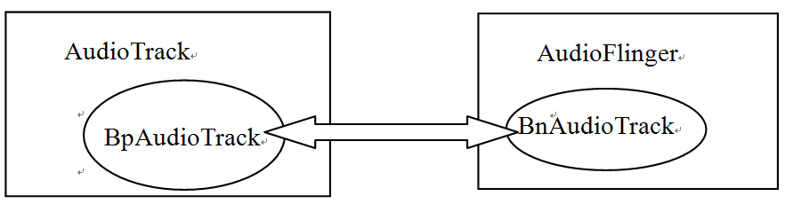 

图7-3  IAudioTrack和AT、AF的关系

从图7-3中可以发现：

·  IAudioTrack是联系AT和AF的关键纽带。

至于IAudioTrack在AF端到底是什么，在分析AF时会有详细解释。
<h5>（2）共享内存及其Control Block</h5>
通过前面的代码分析，我们发现IAudioTrack中有一块共享内存，其头部是一个audio_track_cblk_t（简称CB）对象，在该对象之后才是数据缓冲。这个CB对象有什么作用呢？

还记得前面提到的那个深层次思考的问题吗？即MemoryHeapBase和MemoryBase都没有提供同步对象，那么，AT和AF作为典型的数据生产者和消费者，如何正确协调二者生产和消费的步调呢？

Android为顺应民意，便创造出了这个CB对象，其主要目的就是协调和管理AT和AF二者数据生产和消费的步伐。先来看CB都管理些什么内容。它的声明在AudioTrackShared.h中，而定义却在AudioTrack.cpp中。

[--&gt;AudioTrackShared.h::audio_track_cblk_t声明]

struct audio_track_cblk_t

{

 

       Mutex       lock;

       Condition   cv;//这是两个同步变量，初始化的时候会设置为支持跨进程共享

  /*

   一块数据缓冲同时被生产者和消费者使用，最重要的就是维护它的读写位置了。

   下面定义的这些变量就和读写的位置有关，虽然它们的名字并不是那么直观。

   另外，这里提一个扩展问题，读者可以思考一下：

  volatile支持跨进程吗？要回答这个问题需要理解volatile、CPU Cache机制和共享内存的本质

 */

   volatile    uint32_t    user;   //当前写位置（即生产者已经写到什么位置了）

    volatile    uint32_t   server;  //当前读位置

 /*

    userBase和serverBase要和user及server结合起来用。

    CB巧妙地通过上面几个变量把一块线性缓冲当做环形缓冲来使用，以后将单独分析这个问题

  */

               uint32_t    userBase;  //

               uint32_t    serverBase;

   void*       buffers; //指向数据缓冲的首地址

   uint32_t    frameCount;//数据缓冲的总大小，以Frame为单位

    

   uint32_t    loopStart; //设置打点播放（即设置播放的起点和终点）

   uint32_t    loopEnd;

     int         loopCount;//循环播放的次数

 

   volatile    union {

                    uint16_t    volume[2];

                    uint32_t    volumeLR;

                }; //和音量有关系，可以不管它

     uint32_t    sampleRate;//采样率

    uint32_t    frameSize;//一单位Frame的数据大小

    uint8_t     channels;//声道数

     uint8_t     flowControlFlag;//控制标志，见下文分析

    uint8_t     out; // AudioTrack为1，AudioRecord为0 

    uint8_t     forceReady;

    uint16_t    bufferTimeoutMs; 

     uint16_t    waitTimeMs;

      //下面这几个函数很重要，后续会详细介绍它们

    uint32_t    stepUser(uint32_tframeCount);//更新写位置

    bool        stepServer(uint32_tframeCount);//更新读位置

    void*       buffer(uint32_toffset) const;//返回可写空间起始位置

    uint32_t    framesAvailable();//还剩多少空间可写

    uint32_t    framesAvailable_l();

    uint32_t    framesReady();//是否有可读数据

}

关于CB对象，这里要专门讲解一下其中flowControlFlag的意思：

·  对于音频输出来说，flowControlFlag对应着underrun状态，underrun状态是指生产者提供数据的速度跟不上消费者使用数据的速度。这里的消费者指的是音频输出设备。由于音频输出设备采用环形缓冲方式管理，当生产者没有及时提供新数据时，输出设备就会循环使用缓冲中的数据，这样就会听到一段重复的声音。这种现象一般被称作“machinegun”。对于这种情况，一般的处理方法是暂停输出，等数据准备好后再恢复输出。

·  对于音频输入来说，flowControlFlag对于着overrun状态，它的意思和underrun一样，只是这里的生产者变成了音频输入设备，而消费者变成了Audio系统的AudioRecord。

说明：目前这个参数并不直接和音频输入输出设备的状态有关系。它在AT和AF中的作用必须结合具体情况，才能分析。

图7-4表示CB对象和它所驻留的共享内存间的关系：

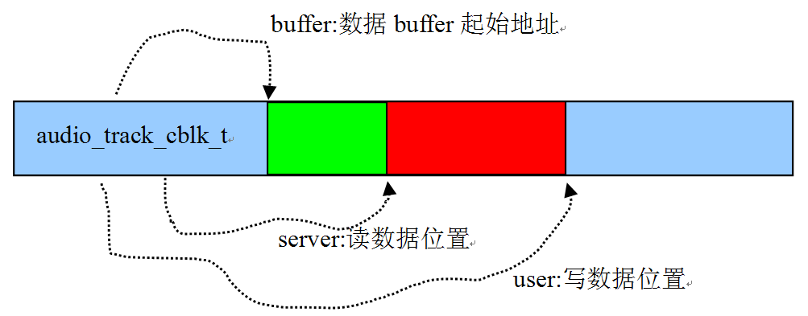 

图7-4  共享内存和CB的关系

注意：CB实际是按照环形缓冲来处理数据读写的，所以user和server的真实作用还需要结合userBase和serverBase。图7-4只是一个示意图。

另外，关于CB，还有一个神秘的问题。先看下面这行代码：

mCblk =static_cast&lt;audio_track_cblk_t*&gt;(cblk-&gt;pointer());

这看起来很简单，但仔细琢磨会发现其中有一个很难解释的问题：

·  cblk-&gt;pointer返回的是共享内存的首地址，怎么把audio_track_cblk_t对象塞到这块内存中呢？

这个问题将通过对AudioFlinger的分析，得到答案。

 说明：关于audio_track_cblk_t的使用方式，后文会有详细分析。

<h5>（3）数据的Push or Pull</h5>
在JNI层的代码中可以发现，在构造AudioTrack时，传入了一个回调函数audioCallback。由于它的存在，导致了Native的AudioTrack还将创建另一个线程AudioTrackThread。它有什么用呢？

这个线程与外界数据的输入方式有关系，AudioTrack支持两种数据输入方式：

·  Push方式：用户主动调用write写数据，这相当于数据被push到AudioTrack。MediaPlayerService一般使用这种这方式提供数据。

·  Pull方式：AudioTrackThread将利用这个回调函数，以EVENT_MORE_DATA为参数主动从用户那pull数据。ToneGenerator使用这种方式为AudioTrack提供数据。

这两种方式都可以使用，不过回调函数除了EVENT_MORE_DATA外，还能表达其他许多意图，这是通过回调函数的第一个参数来表明的。一起来看：

[--&gt;AudioTrack.h::event_type]

enum event_type {

       EVENT_MORE_DATA = 0, //表示AudioTrack需要更多数据

        EVENT_UNDERRUN = 1,//这是Audio的一个术语，表示Audio硬件处于低负荷状态

       //AT可以设置打点播放，即设置播放的起点和终点,LOOP_END表示已经到达播放终点

        EVENT_LOOP_END= 2, 

   /*

     数据使用警戒通知。该值可通过setMarkerPosition ()设置。

     当数据使用超过这个值时，AT会且仅通知一次，有点像WaterMarker。

      这里所说的数据使用，是针对消费者AF消费的数据量而言的

   */

       EVENT_MARKER = 3, 

    /*

      数据使用进度通知。进度通知值由setPositionUpdatePeriod()设置，

      例如每使用500帧通知一次

    */

       EVENT_NEW_POS = 4,

       EVENT_BUFFER_END = 5   //数据全部被消耗

    }; 

请看AudioTrackThread的线程函数threadLoop。

[--&gt;AudioTrack.cpp]

bool AudioTrack::AudioTrackThread::threadLoop()

{

  //mReceiver就是创建该线程的AudioTrack 

  returnmReceiver.processAudioBuffer(this);

}

[--&gt;AudioTrack.cpp]

bool AudioTrack::processAudioBuffer(constsp&lt;AudioTrackThread&gt;&amp; thread)

{

    BufferaudioBuffer;

   uint32_t frames;

    size_twrittenSize;

 

    //处理underun的情况

    if(mActive &amp;&amp; (mCblk-&gt;framesReady() == 0)) {

        if(mCblk-&gt;flowControlFlag == 0) {

           mCbf(EVENT_UNDERRUN, mUserData, 0);//under run 通知

           if (mCblk-&gt;server == mCblk-&gt;frameCount) {

        /*

             server是读位置，frameCount是buffer中的数据总和

             当读位置等于数据总和时，表示数据都已经使用完了

          */

               mCbf(EVENT_BUFFER_END, mUserData, 0); 

           }

           mCblk-&gt;flowControlFlag = 1;

           if (mSharedBuffer != 0) return false;

        }

    }

 

    // 循环播放通知

    while(mLoopCount &gt; mCblk-&gt;loopCount) {

       int loopCount = -1;

       mLoopCount--;

        if(mLoopCount &gt;= 0) loopCount = mLoopCount;

        //一次循环播放完毕，loopCount表示还剩多少次

       mCbf(EVENT_LOOP_END, mUserData, (void *)&amp;loopCount);

    }

 

     if(!mMarkerReached &amp;&amp; (mMarkerPosition &gt; 0)) {

        if(mCblk-&gt;server &gt;= mMarkerPosition) {

         //如果数据使用超过警戒值，则通知用户

           mCbf(EVENT_MARKER, mUserData, (void *)&amp;mMarkerPosition);

           //只通知一次，因为该值被设为true

           mMarkerReached = true;

        }

    }

 

    if(mUpdatePeriod &gt; 0) {

       while (mCblk-&gt;server &gt;= mNewPosition) {

       /*

          进度通知，但它不是以时间为基准，而是以帧数为基准的。

          例如设置每500帧通知一次，假设消费者一次就读了1500帧，那么这个循环会连续通知3次

       */

           mCbf(EVENT_NEW_POS, mUserData, (void *)&amp;mNewPosition);

           mNewPosition += mUpdatePeriod;

        }

    }

 

    if(mSharedBuffer != 0) {

       frames = 0;

    } else{

       frames = mRemainingFrames;

    }

 

    do {

 

       audioBuffer.frameCount = frames;

       //得到一块可写的缓冲

       status_t err = obtainBuffer(&amp;audioBuffer, 1);

        ......

        

       //从用户那pull数据

       mCbf(EVENT_MORE_DATA, mUserData, &amp;audioBuffer);

       writtenSize = audioBuffer.size;

 

        ......

        if(writtenSize &gt; reqSize) writtenSize = reqSize;

       //PCM8数据转PCM16

        .......

 

       audioBuffer.size = writtenSize;

       audioBuffer.frameCount = writtenSize/mCblk-&gt;frameSize;

 

       frames -= audioBuffer.frameCount;

 

       releaseBuffer(&amp;audioBuffer);//写完毕，释放这块缓冲

    }

    while(frames);

   　......

    returntrue;

}

关于obtainBuffer和releaseBuffer，后面再分析。这里有一个问题值得思考：

·  用例会调用write函数写数据，AudioTrackThread的回调函数也让我们提供数据。难道我们同时在使用Push和Pull模式？

这太奇怪了！来查看这个回调函数的实现，了解一下究竟是怎么回事。该回调函数是通过set调用传入的，对应的函数是audioCallback。

[--&gt;android_media_AudioTrack.cpp]

static void audioCallback(int event, void* user,void *info) {

    if(event == AudioTrack::EVENT_MORE_DATA) {

         //很好，没有提供数据，也就是说，虽然AudioTrackThread通知了EVENT_MORE_DATA，

        //但是我们并没有提供数据给它

       AudioTrack::Buffer* pBuff = (AudioTrack::Buffer*)info;

       pBuff-&gt;size = 0;  

     }

    ......

悬着的心终于放下来了，还是老老实实地看Push模式下的数据输入吧。
<h4>2. write输入数据</h4>
write函数涉及Audio系统中最重要的关于数据如何传输的问题，在分析它的时候，不妨先思考一下它会怎么做。回顾一下我们已了解的信息：

·  有一块共享内存。

·  有一个控制结构，里边有一些支持跨进程的同步变量。

有了这些东西，write的工作方式就非常简单了：

·  通过共享内存传递数据。

·  通过控制结构协调生产者和消费者的步调。

重点强调：带着问题和思考来分析代码相当于“智取”，它比一上来就直接扎入源码的“强攻”要高明得多。希望我们能掌握这种思路和方法。

好了，现在开始分析write，看看它的实现是不是如所想的那样。

[--&gt;AudioTrack.cpp]

ssize_t AudioTrack::write(const void* buffer,size_t userSize)

{

  if(mSharedBuffer != 0) return INVALID_OPERATION;

 

    if(ssize_t(userSize) &lt; 0) {

       returnBAD_VALUE;

    }

   ssize_t written = 0;

    constint8_t *src = (const int8_t *)buffer;

    BufferaudioBuffer; // Buffer是一个辅助性的结构

 

 do {

        //以帧为单位 

       audioBuffer.frameCount = userSize/frameSize();

        //obtainBuffer从共享内存中得到一块空闲的数据块

        status_terr = obtainBuffer(&amp;audioBuffer, -1);

        ......

 

       size_t toWrite;

 

        if(mFormat == AudioSystem::PCM_8_BIT &amp;&amp; 

                          !(mFlags &amp;AudioSystem::OUTPUT_FLAG_DIRECT)) {

             //PCM8数据转PCM16

        }else {

           //空闲数据缓冲的大小是audioBuffer.size。

         //地址在audioBuffer.i8中，数据传递通过memcpy完成

           toWrite = audioBuffer.size;

           memcpy(audioBuffer.i8, src, toWrite);

           src += toWrite;

        }

       userSize -= toWrite;

       written += toWrite;

       //releaseBuffer更新写位置，同时会触发消费者

       releaseBuffer(&amp;audioBuffer);

    }while (userSize);

 

    returnwritten;

}

通过write函数，会发现数据的传递其实是很简单的memcpy，但消费者和生产者的协调，则是通过obtainBuffer与releaseBuffer来完成的。现在来看这两个函数。
<h4>3. obtainBuffer和releaseBuffer</h4>
这两个函数展示了做为生产者的AT和CB对象的交互方法。先简单看看，然后把它们之间交互的流程记录下来，以后在CB对象的单独分析部分，我们再来做详细介绍。

[--&gt;AudioTrack.cpp]

status_t AudioTrack::obtainBuffer(Buffer*audioBuffer, int32_t waitCount)

{

    intactive;

   status_t result;

   audio_track_cblk_t* cblk = mCblk;

    ......

   //①调用framesAvailable，得到当前可写的空间大小

   uint32_t framesAvail = cblk-&gt;framesAvailable();

 

    if(framesAvail == 0) {

        ......

        //如果没有可写空间，则要等待一段时间

        result= cblk-&gt;cv.waitRelative(cblk-&gt;lock,milliseconds(waitTimeMs));

          ......

    }

 

   cblk-&gt;waitTimeMs = 0;

   

    if(framesReq &gt; framesAvail) {

       framesReq = framesAvail;

    }

   

    //user为可写空间起始地址

   uint32_t u = cblk-&gt;user;

   uint32_tbufferEnd = cblk-&gt;userBase + cblk-&gt;frameCount;

 

    if (u+ framesReq &gt; bufferEnd) {

       framesReq = bufferEnd - u;

    }

 

     ......

    //②调用buffer，得到可写空间的首地址

   audioBuffer-&gt;raw = (int8_t *)cblk-&gt;buffer(u);

    active= mActive;

    returnactive ? status_t(NO_ERROR) : status_t(STOPPED);

}

obtainBuffer的功能，就是从CB管理的数据缓冲中得到一块可写空间，而releaseBuffer，则是在使用完这块空间后更新写指针的位置。

[--&gt;AudioTrack.cpp]

void AudioTrack::releaseBuffer(Buffer*audioBuffer)

{

   audio_track_cblk_t* cblk = mCblk;

   cblk-&gt;stepUser(audioBuffer-&gt;frameCount);// ③调用stepUser更新写位置

}

obtainBuffer和releaseBuffer与CB交互，一共会有三个函数调用，如下所示：

·  framesAvailable判断是否有可写空间。

·  buffer得到写空间起始地址。

·  stepUser更新写位置。

请记住这些流程，以后在分析CB时会发现它们有重要作用。
<h4>4. delete AudioTrack</h4>
到这里，AudioTrack的使命就进入倒计时阶段了。来看在它生命的最后还会做一些什么工作。

[--&gt;AudioTrack.cpp]

AudioTrack::~AudioTrack()

{

    if(mStatus == NO_ERROR) {

       stop();//调用stop

        if(mAudioTrackThread != 0) {

           //通知AudioTrackThread退出

           mAudioTrackThread-&gt;requestExitAndWait();

           mAudioTrackThread.clear();

        }

       mAudioTrack.clear();

     //将残留在IPCThreadState 发送缓冲区的信息发送出去

        IPCThreadState::self()-&gt;flushCommands();

    }

}

如果不调用stop，析构函数也会先调用stop，这个做法很周到。

[--&gt;AudioTrack.cpp]

void AudioTrack::stop()

{

   sp&lt;AudioTrackThread&gt; t = mAudioTrackThread;

    if (t!= 0) {

       t-&gt;mLock.lock();

    }

 

    if(android_atomic_and(~1, &amp;mActive) == 1) {

       mCblk-&gt;cv.signal();

     /*

        mAudioTrack是IAudioTrack类型，其stop的最终处理在AudioFlinger端

      */

       mAudioTrack-&gt;stop();

       //清空循环播放设置

        setLoop(0, 0, 0);

         mMarkerReached = false;

        

        if (mSharedBuffer != 0) {

           flush();

        }

        if(t != 0) {

           t-&gt;requestExit();//请求退出AudioTrackThread

        }else {

           setpriority(PRIO_PROCESS, 0, ANDROID_PRIORITY_NORMAL);

        }

    }

 

    if (t!= 0) {

        t-&gt;mLock.unlock();

    }

}

stop的工作比较简单，就是调用IAudioTrack的stop，并且还要求退出回调线程。要重点关注IAudioTrack的stop函数，这个将做为AT和AF交互流程中的一个步骤来分析。
<h3><a>7.2.4  AudioTrack</a>的总结</h3>
AudioTrack就这样完了吗？它似乎也不是很复杂。其实，在进行AT分析时，对于一些难度比较大的地方暂时没做介绍。不过，在将AudioFlinger分析完之后，肯定不会怕它们的。

OK，在完成对AudioTrack的分析之前，应把它和AudioFlinger交互的流程总结下，如图7-5所示。这些流程是以后攻克AudioFlinger的重要武器。

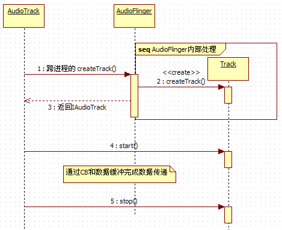 

图7-5  AT和AF的交互流程图

 
<h2><a>7.3  AudioFlinger</a>的破解</h2>
AudioFlinger是Audio系统的核心，来自AudioTrack的数据，最终在这里得到处理并被写入Audio HAL层。虽然AudioFlinger难度比较大，但既然已经攻破了桥头堡AudioTrack，并掌握了重要的突破口，那么对AudioFlinger的破解也就能手到擒来了。接下来，就是一步步地破解它了。
<h3><a>7.3.1  AudioFlinger</a>的诞生</h3>
AudioFlinger驻留于MediaServer进程中。回顾一下它的代码，如下所示：

[--&gt;Main_MediaServer.cpp]

int main(int argc, char** argv)

{

  sp&lt;ProcessState&gt; proc(ProcessState::self());

   sp&lt;IServiceManager&gt;sm = defaultServiceManager();

    ....

   //很好，AF和APS都驻留在这个进程

    AudioFlinger::instantiate();

    AudioPolicyService::instantiate();

     ....

   ProcessState::self()-&gt;startThreadPool();

   IPCThreadState::self()-&gt;joinThreadPool();

}

<h4>1. AudioFlinger的构造</h4>
[--&gt;AudioFlinger.cpp]

void AudioFlinger::instantiate() {

   defaultServiceManager()-&gt;addService( //把AF添加到ServiceManager中

           String16("media.audio_flinger"), new AudioFlinger());

}

再来看它的构造函数：

[--&gt;AudioFlinger.cpp]

AudioFlinger::AudioFlinger(): BnAudioFlinger(),

       mAudioHardware(0), //代表Audio硬件的HAL对象

       mMasterVolume(1.0f),mMasterMute(false), mNextThreadId(0)

{

   mHardwareStatus= AUDIO_HW_IDLE;

   //创建代表Audio硬件的HAL对象

   mAudioHardware = AudioHardwareInterface::create();

 

   mHardwareStatus = AUDIO_HW_INIT;

    if(mAudioHardware-&gt;initCheck() == NO_ERROR) {

     //设置系统初始化的一些值，有一部分通过Audio HAL设置到硬件中

       setMode(AudioSystem::MODE_NORMAL);

       setMasterVolume(1.0f);

       setMasterMute(false);

    }

}

AudioHardwareInterface是Android对代表Audio硬件的封装，属于HAL层。HAL层的具体功能，由各个硬件厂商根据所选硬件的情况来实现，多以动态库的形式提供。这里，简单分析一下Audio HAL的接口，至于其具体实现就不做过多的探讨了。
<h4>2. AudioHardwareInterface介绍</h4>
AudioHardwareInterface接口的定义在AudioHardwareInterface.h中。先看看它。

[--&gt;AudioHardwareInterface.h::AudioHardwareInterface声明]

class AudioHardwareInterface

{

public:

   virtual ~AudioHardwareInterface() {}

 

     //用于检查硬件是否初始化成功，返回的错误码定义在include/utils/Errors.h

   virtual status_t    initCheck() =0;

 

    //设置通话音量，范围从0到1.0

   virtual status_t   setVoiceVolume(float volume) = 0;

 

    /*

       设置除通话音量外的其他所有音频流类型的音量，范围从0到1.0，如果硬件不支持的话，

       这个功能会由软件层的混音器完成

     */

   virtual status_t   setMasterVolume(float volume) = 0;

 

    /*

       设置模式，NORMAL的状态为普通模式，RINGTONE表示来电模式（这时听到的声音是来电铃声）

      IN_CALL表示通话模式（这时听到的声音是手机通话过程中的语音）

     */

   virtual status_t    setMode(intmode) = 0;

 

    // 和麦克相关

   virtual status_t   setMicMute(bool state) = 0;

   virtual status_t   getMicMute(bool* state) = 0;

 

    // 设置/获取配置参数，采用key/value的组织方式

   virtual status_t   setParameters(const String8&amp; keyValuePairs) = 0;

   virtual String8    getParameters(const String8&amp; keys) = 0;

 

    // 根据传入的参数得到输入缓冲的大小，返回0表示其中某个参数的值Audio HAL不支持

     virtualsize_t    getInputBufferSize(uint32_tsampleRate, int format, 

                                                int channelCount) = 0;

 

        /*下面这几个函数非常重要 */

     /*

         openOutputStream：创建音频输出流对象（相当于打开音频输出设备）

         AF可以往其中write数据，指针型参数将返回该音频输出流支持的类型、声道数、采样率等

    */

   virtual AudioStreamOut* openOutputStream(

                                uint32_tdevices,

                                int *format=0,

                                uint32_t*channels=0,

                                uint32_t*sampleRate=0,

                                status_t*status=0) = 0;

   //关闭音频输出流

    virtual    void       closeOutputStream(AudioStreamOut* out) = 0;

 

    /* 创建音频输入流对象（相当于打开音频输入设备），AF可以read数据*/

   virtual AudioStreamIn* openInputStream(

                                uint32_tdevices,

                                int *format,

                                uint32_t*channels,

                                uint32_t *sampleRate,

                                status_t*status,

                               AudioSystem::audio_in_acoustics acoustics) = 0;

    

   virtual    void        closeInputStream(AudioStreamIn* in) =0;

    //关闭音频输入流

   virtual status_t dumpState(int fd, const Vector&lt;String16&gt;&amp;args) = 0;

    //静态create函数，使用设计模式中的工厂模式，具体返回的对象由厂商根据硬件的情况决定

    staticAudioHardwareInterface* create();

    ......

};

根据上面的代码，可以得出以下结论：

·  AudioHardwareInterface管理音频输出设备对象（AudioStreamOut）和音频输入设备对象（AudioStreamIn）的创建。

·  通过AudioHardwareInterface可设置音频系统的一些参数。

图7-6表示AudioHardwareInterface和音频输入输出对象之间的关系以及它们的派生关系：

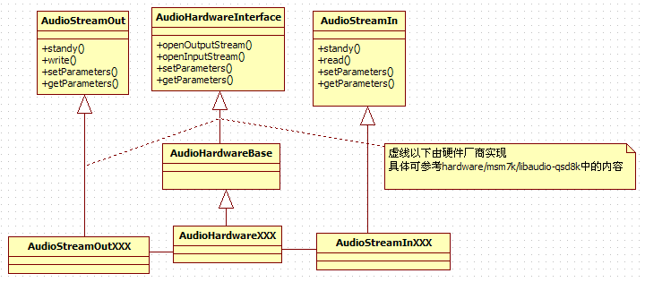 

图7-6  AudioHardwareInterface关系图

从图7-6中还可看出：

·  音频输出/输入对象均支持设置参数（由setParameters完成）。

说明：AudioHardwareInterface最重要的功能是创建AudioStreamOut 和AudioStreamIn，它们分别代表音频输出设备和音频输入设备。从这个角度说，是AudioHardwareInterface管理着系统中所有的音频设备。Android引入的HAL层，大大简化了应用层的工作，否则不管是使用libasound（AlSA提供的用户空间库）还是ioctl来控制音频设备，都会非常麻烦。

<h3><a>7.3.2 </a>通过流程分析AudioFlinger</h3>
图7-5中说明的AT和AF交互的流程，对于分析AF来说非常重要。先来回顾一下图7-5的流程：

·  AT调用createTrack，得到一个IAudioTrack对象。

·  AT调用IAudioTrack对象的start，表示准备写数据了。

·  AT通过write写数据，这个过程和audio_track_cblk_t有着密切关系。

·  最后AT调用IAudioTrack的stop或delete IAudioTrack结束工作。

至此，上面的每一步都很清楚了。根据Binder知识，AT调用的这些函数最终都会在AF端得到实现，所以可直接从AF端开始。
<h4>1. createTrack的分析</h4>
按照前面的流程步骤，第一个被调用的函数会是createTrack，请注意在用例中传的参数。

[--&gt;AudioFlinger.cpp]

sp&lt;IAudioTrack&gt; AudioFlinger::createTrack(

       pid_t pid,//AT的pid号

       int streamType,//流类型，用例中是MUSIC类型

       uint32_t sampleRate,//8000 采样率

       int format,//PCM_16类型

       int channelCount,//2，双声道

       int frameCount,//需要创建缓冲的大小，以帧为单位

       uint32_t flags,

       const sp&lt;IMemory&gt;&amp; sharedBuffer,//AT传入的共享buffer，这里为空

       int output,//这个值前面提到过，是AF中的工作线程索引号

       status_t *status)

{

   sp&lt;PlaybackThread::Track&gt; track;

   sp&lt;TrackHandle&gt; trackHandle;

   sp&lt;Client&gt; client;

    wp&lt;Client&gt;wclient;

   status_t lStatus;

 

   {

       Mutex::Autolock _l(mLock);

        //output代表索引号，这里根据索引号找到一个工作线程，它是一个PlaybackThread

       PlaybackThread *thread = checkPlaybackThread_l(output);

       //看看这个进程是否已经是AF的Client,AF根据进程pid来标识不同的Client

         wclient = mClients.valueFor(pid);

        if(wclient != NULL) {

       }else {

        //如果还没有这个Client信息，则创建一个，并加入到mClients中去

           client = new Client(this, pid);

           mClients.add(pid, client);

        }

 

      //在找到的工作线程对象中创建一个Track,注意它的类型是Track

       track = thread-&gt;createTrack_l(client, streamType, sampleRate, format,

               channelCount, frameCount, sharedBuffer, &amp;lStatus);

    }

   /*

    TrackHandle是Track对象的Proxy，它支持Binder通信，而Track不支持Binder

    TrackHandle所接收的请求最终会由Track处理，这是典型的Proxy模式

   */

   trackHandle= new TrackHandle(track);

   returntrackHandle;

}

这个函数相当复杂，主要原因之一，是其中出现了几个我们没接触过的类。我刚接触这个函数的时候，大脑也曾因看到这些眼生的东西而“死机”！不过暂时先不用去理会它们，等了解了这个函数后，再回过头来收拾它们。先进入checkPlaybackThread_l看看。
<h5>（1） 选择工作线程</h5>
checkPlaybackThread_l的代码如下所示：

[--&gt;AudioFlinger.cpp]

AudioFlinger::PlaybackThread *

                 AudioFlinger::checkPlaybackThread_l(intoutput) const

{

  PlaybackThread*thread = NULL;

  //根据output的值找到对应的thread

    if(mPlaybackThreads.indexOfKey(output) &gt;= 0) {

       thread = (PlaybackThread *)mPlaybackThreads.valueFor(output).get();

    }

    returnthread;

}

上面函数中传入的output，就是之前在分析AT时提到的工作线程索引号。看到这里，是否感觉有点困惑？困惑的原因可能有二：

·  目前的流程中尚没有见到创建线程的地方，但在这里确实能找到一个线程。

·  Output含义到底是什么？为什么会把它作为index来找线程呢？

关于这两个问题，待会儿再做解释。现在只需知道AudioFlinger会创建几个工作线程，AT会找到对应的工作线程即可。
<h5>（2） createTrack_l的分析</h5>
找到工作线程后，会执行createTrack_l函数，请看这个函数的作用：

[--&gt;AudioFlinger.cpp]

// Android的很多代码都采用了内部类的方式进行封装，看习惯就好了

sp&lt;AudioFlinger::PlaybackThread::Track&gt; 

     AudioFlinger::PlaybackThread::createTrack_l(

       const sp&lt;AudioFlinger::Client&gt;&amp; client,int streamType,

        uint32_tsampleRate,int format,int channelCount,int frameCount,

       const sp&lt;IMemory&gt;&amp; sharedBuffer,//注意这个参数，从AT中传入，为0

       status_t *status)

{

   sp&lt;Track&gt; track;

   status_t lStatus;

    {

       Mutex::Autolock _l(mLock);

      //创建Track对象

     track= new Track(this, client, streamType, sampleRate, format,

                      channelCount, frameCount,sharedBuffer);

      //将新创建的Track加入到内部数组mTracks中

      mTracks.add(track); 

}

   lStatus= NO_ERROR;

   returntrack;

}

上面的函数调用传入的sharedBuffer为空，那共享内存又是在哪里创建的呢？可以注意到Track构造函数关于sharedBuffer这个参数的类型是一个引用，莫非是构造函数创建的？
<h5>（3） Track创建共享内存和TrackHandle</h5>
在createTrack_l中，会new出来一个Track，请看它的代码：

[--&gt;AudioFlinger.cpp]

AudioFlinger::PlaybackThread::Track::Track(const wp&lt;ThreadBase&gt;&amp; thread,

           const sp&lt;Client&gt;&amp; client,int streamType,uint32_t sampleRate,

           int format,int channelCount,int frameCount,

            const sp&lt;IMemory&gt;&amp; sharedBuffer)

:  TrackBase(thread, client, sampleRate, format, channelCount, 

    frameCount,0, sharedBuffer),//sharedBuffer仍然为空

   mMute(false), mSharedBuffer(sharedBuffer), mName(-1)

{

   // mCblk!=NULL? 什么时候创建的呢？只能看基类TrackBase的构造函数了

   if(mCblk != NULL) {

      mVolume[0] = 1.0f;

      mVolume[1] = 1.0f;

      mStreamType = streamType;

      mCblk-&gt;frameSize = AudioSystem::isLinearPCM(format) ? 

                              channelCount * sizeof(int16_t): sizeof(int8_t);

    }

}

对于这种重重继承，我们只能步步深入分析，一定要找到共享内存创建的地方，继续看代码：

[--&gt;AudioFlinger.cpp]

AudioFlinger::ThreadBase::TrackBase::TrackBase(

           const wp&lt;ThreadBase&gt;&amp; thread,const sp&lt;Client&gt;&amp;client,

           uint32_t sampleRate,int format,int channelCount,int frameCount,

           uint32_t flags,const sp&lt;IMemory&gt;&amp; sharedBuffer)

    :   RefBase(), mThread(thread),mClient(client),mCblk(0),

        mFrameCount(0),mState(IDLE),mClientTid(-1),mFormat(format),

       mFlags(flags &amp; ~SYSTEM_FLAGS_MASK)

{

    size_tsize = sizeof(audio_track_cblk_t);//得到CB对象大小

   //计算数据缓冲大小

   size_tbufferSize = frameCount*channelCount*sizeof(int16_t); 

   if(sharedBuffer == 0) {

    //还记得图7-4吗？共享内存最前面一部分是audio_track_cblk_t，后面才是数据空间

      size+= bufferSize;

   }

   //根据size创建一块共享内存。 

   mCblkMemory = client-&gt;heap()-&gt;allocate(size);

   /*

      pointer()返回共享内存的首地址， 并强制转换void*类型为audio_track_cblk_t*类型。

      其实把它强制转换成任何类型都可以，但是这块内存中会有CB对象吗？ 

   */

     mCblk= static_cast&lt;audio_track_cblk_t *&gt;(mCblkMemory-&gt;pointer());

    //①下面这句代码看起来很独特。什么意思？？？

     new(mCblk)audio_track_cblk_t();

     

     mCblk-&gt;frameCount = frameCount;

     mCblk-&gt;sampleRate = sampleRate;

     mCblk-&gt;channels = (uint8_t)channelCount;

     if (sharedBuffer == 0) {

       //清空数据区

      mBuffer = (char*)mCblk + sizeof(audio_track_cblk_t);

      memset(mBuffer, 0, frameCount*channelCount*sizeof(int16_t));

      // flowControlFlag初始值为1

      mCblk-&gt;flowControlFlag = 1;

     }

      ......

}

这里需要重点讲解下面这句话的意思。

new(mCblk) audio_track_cblk_t();

注意它的用法，new后面的括号里是内存，紧接其后的是一个类的构造函数。

重点说明：这个语句就是C++语言中的placement new。其含义是在括号里指定的内存中创建一个对象。我们知道，普通的new只能在堆上创建对象，堆的地址由系统分配。这里采用placementnew将使得audio_track_cblk_t创建在共享内存上，它就自然而然地能被多个进程看见并使用了。关于placementnew较详细的知识，还请读者自己搜索一下。

通过上面的分析，可以知道：

·  Track创建了共享内存。

·  CB对象通过placement new方法创建于这块共享内存中。

AF的createTrack函数返回的是一个IAudioTrack类型的对象，可现在碰到的Track对象是IAudioTrack类型吗？来看代码：

[--&gt;AudioFlinger.cpp]

sp&lt;IAudioTrack&gt; AudioFlinger::createTrack（......）

{

    sp&lt;TrackHandle&gt;trackHandle;

    ......

    track= thread-&gt;createTrack_l(client, streamType, sampleRate, 

                    format,channelCount,frameCount, sharedBuffer, &amp;lStatus);

   

   trackHandle= new TrackHandle(track);

   return trackHandle;//① 这个trackHandle对象竟然没有在AF中保存！

 }

原来，createTrack返回的是TrackHandle对象，它以Track为参数构造。这二者之间又是什么关系呢？

Android在这里使用了Proxy模式，即TrackHandle是Track的代理，TrackHandle代理的内容是什么呢？分析TrackHandle的定义可以知道：

·  Track没有基于Binder通信，它不能接收来自远端进程的请求。

·  TrackHandle能基于Binder通信，它可以接收来自远端进程的请求，并且能调用Track对应的函数。这就是Proxy模式的意思。

讨论：Android为什么不直接让Track从IBinder派生，直接支持Binder通信呢？关于这个问题，在看到后面的Track家族图谱后，我们或许就明白了。

另外，注意代码中的注释①：

·  trackHandle被new出来后直接返回，而AF中并没有保存它，这岂不是成了令人闻之色变的野指针？

拓展思考：关于这个问题的答案，请读者自己思考并回答。提示，可从Binder和RefBase入手。

分析完createTrack后，估计有些人会晕头转向的。确实，这个createTrack比较复杂。仅对象类型就层出不穷。到底它有多少种对象，它们之间又有怎样的关系呢？下面就来解决这几个问题。
<h4>2. 到底有多少种对象？</h4>
不妨把AudioFlinger中出现的对象总结一下，以了解它们的作用和相互之间的关系。
<h5>（1） AudioFlinger对象</h5>
作为Audio系统的核心引擎，首先要介绍AudioFlinger。它的继承关系很简单：

class AudioFlinger : public BnAudioFlinger,public IBinder::DeathRecipient

AudioFlinger的主要工作由其定义的许多内部类来完成，我们用图7-7来表示。图中大括号所指向的类为外部类，大括号所包含的为该外部类所定义的内部类。例如，DuplicatingThread、RecordThread和DirectOutputThread都包括在一个大括号中，这个大括号指向AudioFlinger，所以它们三个都是AudioFlinger的内部类，而AudioFlinger则是它们三个的外部类：

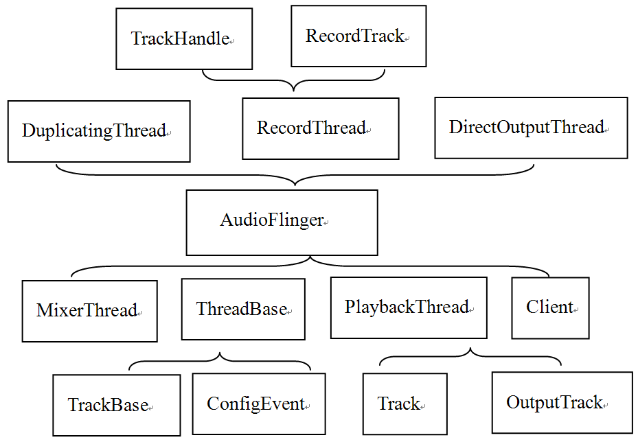 

图7-7  AF中的所有类

看，AF够复杂吧？要不是使用了VisualStudio的代码段折叠功能，我画这个图，也会破费周折的。
<h5>（2） Client对象</h5>
Client是AudioFlinger对客户端的封装，凡是使用了AudioTrack和AudioRecord的进程，都被会当做是AF的Client，并且Client用它的进程pid作为标识。代码如下所示：

class Client : public RefBase {

   public:

       Client(const sp&lt;AudioFlinger&gt;&amp; audioFlinger, pid_t pid);

       virtual             ~Client();

       const sp&lt;MemoryDealer&gt;&amp;    heap() const;

       pid_t               pid() const 

        sp&lt;AudioFlinger&gt;    audioFlinger() { return mAudioFlinger; }

 

   private:

                            Client(constClient&amp;);

                            Client&amp;operator = (const Client&amp;);

       sp&lt;AudioFlinger&gt;   mAudioFlinger;

       sp&lt;MemoryDealer&gt;   mMemoryDealer;//内存分配器

       pid_t                  mPid;

    };

Client对象比较简单，因此就不做过多的分析了。

注意：一个Client进程可以创建多个AudioTrack，这些AudioTrack都属于一个Client。 

<h5>（3） 工作线程介绍</h5>
AudioFlinger中有几种不同类型的工作线程，它们之间的关系如图7-8所示：

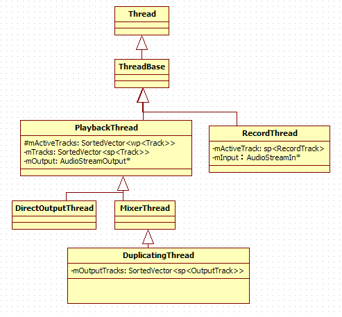 

图7-8  AF中的工作线程家谱

下面来解释图7-8中各种类型工作线程的作用：

·  PlaybackThread：回放线程，用于音频输出。它有一个成员变量mOutput，为AudioStreamOutput*类型，这表明PlaybackThread直接和Audio音频输出设备建立了联系。

·  RecordThread：录音线程，用于音频输入，它的关系比较单纯。它有一个成员变量mInput为AudioStreamInput*类型，这表明RecordThread直接和Audio音频输入设备建立了联系。

从PlaybackThread的派生关系上可看出，手机上的音频回放应该比较复杂，否则也不会派生出三个子类了。其中：

·  MixerThread：混音线程，它将来自多个源的音频数据混音后再输出。

·  DirectOutputThread：直接输出线程，它会选择一路音频流后将数据直接输出，由于没有混音的操作，这样可以减少很多延时。

·  DuplicatingThread：多路输出线程，它从MixerThread派生，意味着它也能够混音。它最终会把混音后的数据写到多个输出中，也就是一份数据会有多个接收者。这就是Duplicate的含义。目前在蓝牙A2DP设备输出中使用。

另外从图7-8中还可以看出：

·  PlaybackThread维护两个Track数组，一个是mActiveTracks，表示当前活跃的Track，一个是mTracks，表示这个线程创建的所有Track。

·  DuplicatingThread还维护了一个mOutputTracks，表示多路输出的目的端。后面分析DuplicatingThread时再对此进行讲解。

说明：大部分常见音频输出使用的是MixerThread，后文会对此进行详细分析。另外，在拓展内容中，也将深入分析DuplicatingThread的实现。

<h5>（4） PlaybackThread和AudioStreamOutput</h5>
从图7-8中，可以发现一个PlaybackThread有一个AudioStreamOutput类型的对象，这个对象提供了音频数据输出功能。可以用图7-9来表示音频数据的流动轨迹。该图以PlaybackThread最常用的子类MixerThread作为代表。

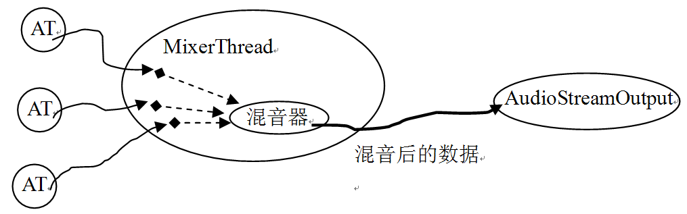 

图7-9  音频数据的流动轨迹

根据图7-9，就能明白MixerThread的大致工作流程：

·  接收来自AT的数据。

·  对这些数据进行混音。

·  把混音的结果写到AudioStreamOut，这样就完成了音频数据的输出。
<h5>（5） Track对象</h5>
前面所说的工作线程，其工作就是围绕Track展开的，图7-10展示了Track的家族：

注意：这里把RecordTrack也统称为Track。

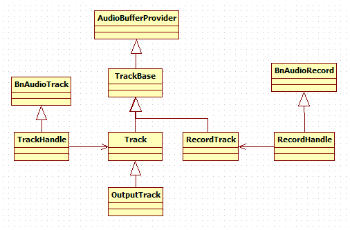 

图7-10  Track家族 

从图7-10中可看出，TrackHandle和RecordHandle是基于Binder通信的，它作为Proxy，用于接收请求并派发给对应的Track和RecordTrack。

说明：从图7-10也能看出，之所以不让Track继承Binder框架，是因为Track本身的继承关系和所承担的工作已经很复杂了，如再让它掺合Binder，只会乱上添乱。

Track类作为工作线程的内部类来实现，其中： 

·  TrackBase定义于ThreadBase中。

·  Track定义于PlaybackThread中，RecordTrack定义于RecordThread中。

·  OutputTrack定义于DuplicatingThread中。

根据前面的介绍可知，音频输出数据最后由Playback线程来处理，用例所对应的Playback线程，实际上是一个MixerThread，那么它是如何工作的呢？一起来分析。
<h4>3. MixerThread分析</h4>
MixerThread是Audio系统中负担最重的一个工作线程。先来了解一下它的来历。
<h5>（1） MixerThread的来历</h5>
前面，在checkplaybackThread_l中，有一个地方一直没来得及解释。回顾一下它的代码：

[--&gt;AudioFlinger.cpp]

AudioFlinger::PlaybackThread *

        AudioFlinger::checkPlaybackThread_l(intoutput) const

{

  PlaybackThread*thread = NULL;

  //根据output的值找到对应的thread

    if(mPlaybackThreads.indexOfKey(output) &gt;= 0) {

       thread = (PlaybackThread *)mPlaybackThreads.valueFor(output).get();

  }

    returnthread;

}

上面这个函数的意思很明确：就是根据output值找到对应的回放线程。

但在前面的流程分析中，并没有见到创建线程的地方，那这个线程又是如何得来的？它又是何时、怎样创建的呢？

答案在AudioPolicyService中。提前看看AudioPolicyService，分析一下，它为什么和这个线程有关系。

AudioPolicyService和AudioFlinger一样，都驻留在MediaServer中，直接看它的构造函数：

[--&gt;AudioPolicyService.cpp]

AudioPolicyService::AudioPolicyService()

    :BnAudioPolicyService() , mpPolicyManager(NULL)

{

    charvalue[PROPERTY_VALUE_MAX];

 

    // Tone音播放线程

   mTonePlaybackThread = new AudioCommandThread(String8(""));

    // 命令处理线程

   mAudioCommandThread = newAudioCommandThread(String8("ApmCommandThread"));

 

#if (defined GENERIC_AUDIO) || (defined AUDIO_POLICY_TEST)

    //这里属于Generic的情况，所以构造AudioPolicyManagerBase，注意构造函数的参数

   mpPolicyManager = new AudioPolicyManagerBase(this);

#else

......

    //创建和硬件厂商相关的AudioPolicyManager

#endif

    ......

}

看AudioPolicyManagerBase的构造函数，注意传给它的参数是this，即把AudioPolicyService对象传进去了。

[--&gt;AudioPolicyManagerBase.cpp]

AudioPolicyManagerBase::AudioPolicyManagerBase(

           AudioPolicyClientInterface*clientInterface)

        :mPhoneState(AudioSystem::MODE_NORMAL), mRingerMode(0), 

           mMusicStopTime(0),mLimitRingtoneVolume(false)

{

    mpClientInterface = clientInterface;

 

    // 先把不相关的内容去掉

    ......

  /*

     返回来调用mpClientInterface的openOutput，实际就是AudioPolicyService。

      注意openOutput函数是在AP的创建过程中调用的

  */

   mHardwareOutput =mpClientInterface-&gt;openOutput(&amp;outputDesc-&gt;mDevice,

                                    &amp;outputDesc-&gt;mSamplingRate,

                                   &amp;outputDesc-&gt;mFormat,

                                   &amp;outputDesc-&gt;mChannels,

                                   &amp;outputDesc-&gt;mLatency,

                                    outputDesc-&gt;mFlags);

    ......

}

真是山不转水转！咱们还得回到AudioPolicyService中去看看：

[--&gt;AudioPolicyService.cpp]

audio_io_handle_tAudioPolicyService::openOutput(uint32_t *pDevices,

                                uint32_t*pSamplingRate,

                                uint32_t*pFormat,

                               uint32_t*pChannels,

                                uint32_t*pLatencyMs,

                               AudioSystem::output_flags flags)

{

  sp&lt;IAudioFlinger&gt;af = AudioSystem::get_audio_flinger();

  //下面会调用AudioFlinger的openOutput，这个时候AF已经启动了

   returnaf-&gt;openOutput(pDevices, pSamplingRate, (uint32_t *)pFormat,

                          pChannels, pLatencyMs,flags);

}

真是曲折啊，又得到AF去看看：

[--&gt;AudioFlinger.cpp]

int AudioFlinger::openOutput(

uint32_t *pDevices,uint32_t*pSamplingRate,uint32_t *pFormat,

       uint32_t*pChannels,uint32_t *pLatencyMs,uint32_t flags)

{

   ......

  Mutex::Autolock _l(mLock);

   //创建Audio HAL的音频输出对象，和音频输出扯上了关系

   AudioStreamOut *output = mAudioHardware-&gt;openOutputStream(*pDevices,

                                                            (int *)&amp;format,

                                                            &amp;channels,

                                                            &amp;samplingRate,

                                                            &amp;status);

   mHardwareStatus = AUDIO_HW_IDLE;

    if(output != 0) {

        if((flags &amp; AudioSystem::OUTPUT_FLAG_DIRECT) ||

           (format != AudioSystem::PCM_16_BIT) ||

           (channels != AudioSystem::CHANNEL_OUT_STEREO)) {

           //如果标志为OUTPUT_FLAG_DIRECT,则创建DirectOutputThread

           thread = new DirectOutputThread(this, output, ++mNextThreadId);

          } else {

         //一般创建的都是MixerThread，注意代表AudioStreamOut对象的output也传进去了

          thread= new MixerThread(this, output, ++mNextThreadId);

        }

        //把新创建的线程加入线程组mPlaybackThreads中保存, mNextThreadId是它的索引号

       mPlaybackThreads.add(mNextThreadId, thread);

       ......

     return mNextThreadId;//返回该线程的索引号

    }

    return0;

}

明白了吗？是否感觉有点绕？可用一个简单的示意图来观察三者的交互流程，如图7-11所示：

 

图7-11  MixerThread的曲折来历示意图

图7-11表明：

·  AF中的工作线程的创建，受到了AudioPolicyService的控制。从AudioPolicyService的角度出发，这也是应该的，因为APS控制着整个音频系统，而AF只是管理音频的输入和输出。

·  另外，注意这个线程是在AP的创建过程中产生的。也就是说，AP一旦创建完Audio系统，就已经准备好工作了。

关于AF和AP的恩恩怨怨，在后面APS的分析过程中再去探讨。目前，读者只需了解系统中第一个MixerThread的来历即可。下面来分析这个来之不易的MixerThread。
<h5>（2） MixerThread的构造和线程启动</h5>
[--&gt;AudioFlinger.cpp]

AudioFlinger::MixerThread::MixerThread(

        constsp&lt;AudioFlinger&gt;&amp; audioFlinger, 

        AudioStreamOut*output, // AudioStreamOut为音频输出设备的HAL抽象

        intid)

     :  PlaybackThread(audioFlinger, output, id),mAudioMixer(0)

{

   mType = PlaybackThread::MIXER;

  //混音器对象，这个对象比较复杂，它完成多路音频数据的混合工作

  mAudioMixer = new AudioMixer(mFrameCount, mSampleRate);

}

再来看MixerThread的基类PlaybackThread的构造函数：

[--&gt;AudioFlinger.cpp]

AudioFlinger::PlaybackThread::PlaybackThread(constsp&lt;AudioFlinger&gt;&amp;

            audioFlinger, AudioStreamOut* output, int id)

        :   ThreadBase(audioFlinger, id),

          mMixBuffer(0),mSuspended(0), mBytesWritten(0),

         mOutput(output), mLastWriteTime(0),mNumWrites(0),

          mNumDelayedWrites(0), mInWrite(false)

{

    //获取音频输出HAL对象的一些信息，包括硬件中音频缓冲区的大小（以帧为单位）

    readOutputParameters();

    mMasterVolume= mAudioFlinger-&gt;masterVolume();

    mMasterMute= mAudioFlinger-&gt;masterMute();

  //设置不同类型音频流的音量及静音情况

    for(int stream = 0; stream &lt; AudioSystem::NUM_STREAM_TYPES; stream++) 

    {

        mStreamTypes[stream].volume= 

                     mAudioFlinger-&gt;streamVolumeInternal(stream);

        mStreamTypes[stream].mute= mAudioFlinger-&gt;streamMute(stream);

    }

  //发送一个通知消息给监听者，这部分内容较简单，读者可自行研究

  sendConfigEvent(AudioSystem::OUTPUT_OPENED);

 }

此时，线程对象已经创建完毕。根据对Thread的分析，应该调用它的run函数才能真正创建新线程。在首次创建sp时调用了run，这里利用了RefBase的onFirstRef函数。根据MixerThread的派生关系，该函数最终由父类PlaybackThread的onFirstRef实现：

[--&gt;AudioFlinger.cpp]

void AudioFlinger::PlaybackThread::onFirstRef()

{

    constsize_t SIZE = 256;

    charbuffer[SIZE];

 

   snprintf(buffer, SIZE, "Playback Thread %p", this);

   //下面的run就真正创建了线程并开始执行threadLoop 

   run(buffer, ANDROID_PRIORITY_URGENT_AUDIO);

}

好，线程已经run起来了。继续按流程分析，下一个轮到的调用函数是start。
<h4>4. start的分析</h4>
AT调用的是IAudioTrack的start函数，由于TrackHandle的代理作用，这个函数的实际处理会由Track对象来完成。

[--&gt;AudioFlinger.cpp]

status_tAudioFlinger::PlaybackThread::Track::start()

{

   status_t status = NO_ERROR;

    sp&lt;ThreadBase&gt;thread = mThread.promote();

  //该Thread是用例中的MixerThread

    if(thread != 0) {

        Mutex::Autolock _l(thread-&gt;mLock);

       int state = mState;

        if (mState == PAUSED) {

           mState = TrackBase::RESUMING;

          } else {

           mState = TrackBase::ACTIVE;//设置Track的状态

        }

        PlaybackThread *playbackThread =(PlaybackThread *)thread.get();

        //addTrack_l把这个track加入到mActiveTracks数组中

       playbackThread-&gt;addTrack_l(this);

    returnstatus;

}

看看这个addTrack_l函数，代码如下所示：

[--&gt;AudioFlinger.cpp]

status_tAudioFlinger::PlaybackThread::addTrack_l(const sp&lt;Track&gt;&amp; track)

{

   status_t status = ALREADY_EXISTS;

 

    //①mRetryCount：设置重试次数，kMaxTrackStartupRetries值为50

   track-&gt;mRetryCount = kMaxTrackStartupRetries;

   if(mActiveTracks.indexOf(track) &lt; 0) {

      //②mFillingUpStatus：缓冲状态

      track-&gt;mFillingUpStatus= Track::FS_FILLING;

      //原来是把调用start的这个track加入到活跃的Track数组中了

     mActiveTracks.add(track); 

     status = NO_ERROR;

   }

  //广播一个事件，一定会触发MixerThread线程，通知它有活跃数组加入，需要开工干活

   mWaitWorkCV.broadcast();

    return status;

}

start函数把这个Track加入到活跃数组后，将触发一个同步事件，这个事件会让工作线程动起来。虽然这个函数很简单，但有两个关键点必须指出，这两个关键点其实指出了两个问题的处理办法：

·  mRetryCount表示重试次数，它针对的是这样一个问题：如果一个Track调用了start却没有write数据，该怎么办？如果MixerThread尝试了mRetryCount次后还没有可读数据，工作线程就会把该Track从激活队列中去掉了。

·  mFillingUpStatus能解决这样的问题：假设分配了1MB的数据缓冲，那么至少需要写多少数据的工作线程才会让Track觉得AT是真的需要它工作呢？难道AT写一个字节就需要工作线程兴师动众吗？其实，这个状态最初为Track::FS_FILLING，表示正在填充数据缓冲。在这种状态下，除非AT设置了强制读数据标志（CB对象中的forceReady变量），否则工作线程是不会读取该Track的数据的。该状态还有其他的值，读者可以自行研究。

说明：我们在介绍大流程的同时也把一些细节问题指出来，希望这些细节问题能激发读者深入研究的欲望。

Track加入了工作线程的活跃数组后，又触发了一个同步事件，MixerThread是否真的动起来了呢？一起来看：
<h5>（1） MixerThread动起来</h5>
Thread类的线程工作都是在threadLoop中完成的，那么MixerThread的线程又会做什么呢？

[--&gt;AudioFlinger.cpp]

bool AudioFlinger::MixerThread::threadLoop()

{

   int16_t* curBuf = mMixBuffer;

   Vector&lt; sp&lt;Track&gt; &gt; tracksToRemove;

   uint32_t mixerStatus = MIXER_IDLE;

    nsecs_tstandbyTime = systemTime();

    ......

    uint32_t sleepTime = idleSleepTime;

 

    while(!exitPending())

    { 

     //① 处理一些请求和通知消息，如之前在构造函数中发出的OUTPUT_OPEN消息等

      processConfigEvents();

 

       mixerStatus = MIXER_IDLE;

        {// scope for mLock

 

           Mutex::Autolock _l(mLock);

          //检查配置参数，如有需要则重新设置内部参数值

           if (checkForNewParameters_l()) {

               mixBufferSize = mFrameCount * mFrameSize;

               maxPeriod = seconds(mFrameCount) / mSampleRate * 3;

               ......

           }

          //获得当前的已激活track数组

           const SortedVector&lt; wp&lt;Track&gt; &gt;&amp; activeTracks =mActiveTracks;

             ......

           /*

            ②prepareTracks_l将检查mActiveTracks数组，判断是否有AT的数据需要处理。

               例如有些AudioTrack虽然调用了start，但是没有及时write数据，这时就无须

进行混音工作。我们待会再分析prepareTracks_l函数

          */

           mixerStatus = prepareTracks_l(activeTracks, &amp;tracksToRemove);

       }

        //MIXER_TRACKS_READY表示AT已经把数据准备好了

        if(LIKELY(mixerStatus == MIXER_TRACKS_READY)) {

           //③ 由混音对象进行混音工作，混音的结果放在curBuf中

           mAudioMixer-&gt;process(curBuf);

           sleepTime = 0;//等待时间设置为零，表示需要马上输出到Audio HAL

           standbyTime = systemTime() + kStandbyTimeInNsecs;

        } 

          .......

 

        if(sleepTime == 0) {

           ......

          //④ 往Audio HAL的OutputStream中write混音后的数据，这是音频数据的最终归宿

           int bytesWritten = (int)mOutput-&gt;write(curBuf, mixBufferSize);

 

           if (bytesWritten &lt; 0) mBytesWritten -= mixBufferSize;

             ......

           mStandby = false;

        }else {

           usleep(sleepTime);

        }

       tracksToRemove.clear();

    }

 

    if(!mStandby) {

       mOutput-&gt;standby();

    }

    returnfalse;

}

从上面的分析可以看出，MixerThread的线程函数大致工作流程是：

·  如果有通知信息或配置请求，则先完成这些工作。比如向监听者通知AF的一些信息，或者根据配置请求进行音量控制，声音设备切换等。

·  调用prepareTracks _l函数，检查活跃Tracks是否有数据准备好。

·  调用混音器对象mAudioMixer的process，并且传入一个存储结果数据的缓冲，混音后的结果就存储在这个缓冲中。

·  调用代表音频输出设备的AudioOutputStream对象的write，把结果数据写入设备。

其中，配置请求处理的工作将在AudioPolicyService的分析中，以一个耳机插入处理实例进行讲解。这里主要分析代码中②③两个步骤。
<h5>（2） prepareTracks_l和process分析</h5>
prepareTracks_l函数检查激活Track数组，看看其中是否有数据等待使用，代码如下所示：

[--&gt;AudioFlinger.cpp]

uint32_tAudioFlinger::MixerThread::prepareTracks_l(

                         constSortedVector&lt;wp&lt;Track&gt;&gt;&amp; activeTracks, 

                         Vector&lt;sp&lt;Track&gt;&gt;*tracksToRemove)

{

 

   uint32_t mixerStatus = MIXER_IDLE;

    //激活Track的个数

    size_tcount = activeTracks.size();

 

    floatmasterVolume = mMasterVolume;

   bool  masterMute = mMasterMute;

 

  //依次查询这些Track的情况

   for(size_t i=0 ; i&lt;count ; i++) {

       sp&lt;Track&gt; t = activeTracks[i].promote();

        if(t == 0) continue;

 

       Track* const track = t.get();

     //怎么查？通过audio_track_cblk_t对象

       audio_track_cblk_t* cblk = track-&gt;cblk();

   /*

      一个混音器可支持32个Track，它内部有一个32元素的数组，name函数返回的就是Track在

      这个数组中的索引。混音器每次通过setActiveTrack设置一个活跃Track，

      后续所有操作都会针对当前设置的这个活跃Track

    */

       mAudioMixer-&gt;setActiveTrack(track-&gt;name());         

      //下面这个判断语句决定了什么情况下Track数据可用

     if (cblk-&gt;framesReady() &amp;&amp;(track-&gt;isReady() || track-&gt;isStopped())

             &amp;&amp; !track-&gt;isPaused()&amp;&amp; !track-&gt;isTerminated())

        {

            ......

           /*

            设置活跃Track的数据提供者为Track本身，因为Track从AudioBufferProvider

            派生。混音器工作时，需从Track得到待混音的数据，也就是AT写入的数据由混音

            器取出并消费

         */

          mAudioMixer-&gt;setBufferProvider(track);

          //设置对应Track的混音标志

           mAudioMixer-&gt;enable(AudioMixer::MIXING);

          ......

           //设置该Track的音量等信息，这在以后的混音操作中会使用

           mAudioMixer-&gt;setParameter(param, AudioMixer::VOLUME0, left);

            mAudioMixer-&gt;setParameter(param,AudioMixer::VOLUME1, right);

           mAudioMixer-&gt;setParameter(

               AudioMixer::TRACK,

               AudioMixer::FORMAT, track-&gt;format());

 

            ......

            mixerStatus = MIXER_TRACKS_READY;

        }else {//如果不满足上面的条件，则走else分支

           if (track-&gt;isStopped()) {

               track-&gt;reset();//reset会清零读写位置，表示没有可读数据

           }

           //如果处于这三种状态之一，则加入移除队列

           if (track-&gt;isTerminated() || track-&gt;isStopped() 

                    || track-&gt;isPaused()) {

               tracksToRemove-&gt;add(track);

               mAudioMixer-&gt;disable(AudioMixer::MIXING);

           } else {

             //不处于上面三种状态时，表示暂时没有可读数据，则重试mRetryCount次

            if (--(track-&gt;mRetryCount) &lt;= 0) {

                 tracksToRemove-&gt;add(track);

               } else if (mixerStatus != MIXER_TRACKS_READY) {

                    mixerStatus =MIXER_TRACKS_ENABLED;

               }

             //禁止这个Track的混音

               mAudioMixer-&gt;disable(AudioMixer::MIXING);

            ...... 

         }

        }

    }

    //对那些被移除的Track做最后的处理

   ......

    returnmixerStatus;

}

当所有Track准备就绪后，最重要的工作就是混音。混音对象的process就派上了用场。来看这个process函数，代码如下所示：

[--&gt;AudioMixer.cpp]

void AudioMixer::process(void* output)

{

   mState.hook(&amp;mState, output);//hook？这是一个函数指针

}

hook是函数指针，它根据Track的个数和它的音频数据格式（采样率等）等情况，使用不同的处理函数。为进一步了解混音器是如何工作的，需要先分析AudioMixer对象。 
<h5>（3） AudioMixer对象的分析</h5>
AudioMixer实现AudioMixer.cpp中，先看构造函数：

[--&gt;AudioMixer.cpp]

AudioMixer::AudioMixer(size_t frameCount,uint32_t sampleRate)

    :   mActiveTrack(0), mTrackNames(0),mSampleRate(sampleRate)

{

   mState.enabledTracks= 0;

   mState.needsChanged = 0;

   mState.frameCount   = frameCount;//这个值等于音频输出对象的缓冲大小

   mState.outputTemp   = 0;

    mState.resampleTemp= 0;

    //hook初始化的时候为process__nop，这个函数什么都不会做

    mState.hook = process__nop; 

    track_t*t = mState.tracks;//track_t是和Track相对应的一个结构

    //最大支持32路混音，也很不错了

    for(int i=0 ; i&lt;32 ; i++) {

        ......

       t-&gt;channelCount = 2;

       t-&gt;enabled = 0;

       t-&gt;format = 16;

        t-&gt;buffer.raw = 0;

       t-&gt;bufferProvider = 0; // bufferProvider为这一路Track的数据提供者

       t-&gt;hook = 0;//每一个Track也有一个hook函数

        ......

    }

   int             mActiveTrack;

   uint32_t        mTrackNames; 

    constuint32_t  mSampleRate;

    state_t         mState

 

}

其中，mState是在AudioMixer类中定义的一个数据结构。

struct state_t {

       uint32_t        enabledTracks;

       uint32_t        needsChanged;

       size_t          frameCount;

       mix_t           hook;

       int32_t         *outputTemp;

       int32_t         *resampleTemp;

       int32_t         reserved[2];

  /*

    aligned表示32字节对齐，由于source insight不认识这个标志，导致

    state_t不能被解析。在看代码时，可以注释掉后面的attribute，这样source insight

     就可以识别state_t结构了

 */    

         track_t         tracks[32]; __attribute__((aligned(32)));

    };

AudioMixer为hook准备了多个实现函数，来看：

·  process__validate：根据Track的格式、数量等信息选择其他的处理函数。

·  process__nop：什么都不做。

·  process__genericNoResampling：普通无需重采样。

·  process__genericResampling：普通需重采样。

·  process__OneTrack16BitsStereoNoResampling：一路音频流，双声道，PCM16格式，无需重采样。

·  process__TwoTracks16BitsStereoNoResampling：两路音频流，双声道，PCM16格式，无需重采样。

hook最初的值为process__nop，这一定不会是混音中最终使用的处理函数，难道有动态赋值的地方？是的。一起来看：
<h5>（4） 杀鸡不用宰牛刀</h5>
在AF的prepare_l中，会为每一个准备好的Track使能混音标志：

mAudioMixer-&gt;setBufferProvider(track);

mAudioMixer-&gt;enable(AudioMixer::MIXING);//使能混音

请看enable的实现：

[--&gt;AudioMixer.cpp]

status_t AudioMixer::enable(int name)

{

    switch(name) {

       case MIXING: {

           if (mState.tracks[ mActiveTrack ].enabled != 1) {

               mState.tracks[ mActiveTrack ].enabled = 1;

               //注意这个invalidateState调用

               invalidateState(1&lt;&lt;mActiveTrack);

           }

        }break;

       default:

           return NAME_NOT_FOUND;

    }

    returnNO_ERROR;

}

[--&gt;AudioMixer.cpp]

void AudioMixer::invalidateState(uint32_t mask)

 {

    if(mask) {

       mState.needsChanged |= mask;

       mState.hook = process__validate;//将hook设置为process_validate

    }

 }

process_validate会根据当前Track的情况选择不同的处理函数，所以不会出现杀鸡却用灾牛刀的情况。

[--&gt;AudioMixer.cpp]

void AudioMixer::process__validate(state_t*state, void* output)

{

   uint32_t changed = state-&gt;needsChanged;

   state-&gt;needsChanged = 0;

 

  uint32_t enabled = 0;

   uint32_t disabled = 0;

    ......

    if(countActiveTracks) {

        if(resampling) {

           ......

         //如果需要重采样，则选择process__genericResampling

           state-&gt;hook = process__genericResampling;

        }else {

           ......

           state-&gt;hook = process__genericNoResampling;

          

           if (all16BitsStereoNoResample &amp;&amp; !volumeRamp) {

               if (countActiveTracks == 1) {

             //如果只有一个Track，则使用process__OneTrack16BitsStereoNoResampling

                    state-&gt;hook =process__OneTrack16BitsStereoNoResampling;

               }

           }

        }

    }

  state-&gt;hook(state, output);

  ......

}

假设用例运行时，系统只有这么一个Track，那么hook函数使用的就是process__OneTrack16BitsStereoNoResampling处理。process_XXX函数会涉及很多数字音频处理的专业知识，先不用去讨论它。数据缓冲的消费工作是在这个函数中完成的，因此应重点关注它是如何通过CB对象使用数据缓冲的。

说明：在这个数据消费和之前破解AT的过程中所讲的数据生产是对应的，先来提炼AT和AF在生产和消费这两个环节上与CB交互的流程。

<h5>（5） 怎么消费数据</h5>
在AudioTrack中，曾讲到数据的生产流程：

·  ObtainBuffer，得到一块数据缓冲。

·  memcpy数据到该缓冲。

·  releaseBuffer，释放这个缓冲。

那么做为消费者，AudioFlinger是怎么获得这些数据的呢？

[--&gt;AudioMixer.cpp]

voidAudioMixer::process__OneTrack16BitsStereoNoResampling(

        state_t*state, void* output)

{

   //找到被激活的Track，此时只能有一个Track，否则就不会选择这个process函数了

    constint i = 31 - __builtin_clz(state-&gt;enabledTracks);

    consttrack_t&amp; t = state-&gt;tracks[i];

 

   AudioBufferProvider::Buffer&amp; b(t.buffer);

   

    ......

    while(numFrames) {

       b.frameCount = numFrames;

       //BufferProvider就是Track对象，调用它的getNextBuffer获得可读数据缓冲

       t.bufferProvider-&gt;getNextBuffer(&amp;b);

       int16_t const *in = b.i16;

 

       ......

       size_t outFrames = b.frameCount;

       

         do {//数据处理，也即是混音

               uint32_t rl = *reinterpret_cast&lt;uint32_t const *&gt;(in);

               in += 2;

               int32_t l = mulRL(1, rl, vrl) &gt;&gt; 12;

               int32_t r = mulRL(0, rl, vrl) &gt;&gt; 12;

              //把数据复制给out缓冲

               *out++ = (r&lt;&lt;16) | (l &amp; 0xFFFF);

           } while (--outFrames);

        }

       numFrames -= b.frameCount;

       //调用Track的releaseBuffer释放缓冲

       t.bufferProvider-&gt;releaseBuffer(&amp;b);

    }

}

bufferProvider就是Track对象，总结一下它使用数据缓冲的调用流程：

·  调用Track的getNextBuffer，得到可读数据缓冲。

·  调用Track的releaseBuffer，释放数据缓冲。

现在来分析上面这两个函数：getNextBuffer和releaseBuffer。
<h5>（6） getNextBuffer和releaseBuffer的分析</h5>
先看getNextBuffer。它从数据缓冲中得到一块可读空间：

[--&gt;AudioFlinger.cpp]

status_tAudioFlinger::PlaybackThread::Track::getNextBuffer(

                         AudioBufferProvider::Buffer*buffer)

{

     audio_track_cblk_t*cblk = this-&gt;cblk();//通过CB对象完成

    uint32_t framesReady;

    //frameCount为AudioOutput音频输出对象的缓冲区大小

    uint32_t framesReq = buffer-&gt;frameCount;

 

     ......

     //根据CB的读写指针计算有多少帧数据可读

    framesReady = cblk-&gt;framesReady();

 

     if (LIKELY(framesReady)){

       uint32_t s = cblk-&gt;server; //当前读位置

        //可读的最大位置，为当前读位置加上frameCount

         uint32_tbufferEnd = cblk-&gt;serverBase + cblk-&gt;frameCount;

        //AT可以通过setLooping设置播放的起点和终点，如果有终点的话，需要以loopEnd

       //作为数据缓冲的末尾

       bufferEnd = (cblk-&gt;loopEnd &lt; bufferEnd) ? cblk-&gt;loopEnd :bufferEnd;

        if(framesReq &gt; framesReady) {

         //如果要求的读取帧数大于可读帧数，则只能选择实际可读的帧数

           framesReq = framesReady; 

        }

       //如果可读帧数的最后位置超过了AT设置的末端点，则需要重新计算可读帧数

        if(s + framesReq &gt; bufferEnd) {

           framesReq = bufferEnd - s;

        }

        //根据读起始位置得到数据缓冲的起始地址，framesReq参数用来做内部检查，防止出错

        buffer-&gt;raw = getBuffer(s, framesReq);

        if (buffer-&gt;raw == 0) goto getNextBuffer_exit;

 

        buffer-&gt;frameCount = framesReq;

       return NO_ERROR;

     }

 

getNextBuffer_exit:

    buffer-&gt;raw = 0;

    buffer-&gt;frameCount = 0;

    return NOT_ENOUGH_DATA;

}

getNextBuffer非常简单，不过就是根据CB记录的读写位置等计算可读的缓冲位置。下面来看releaseBuffer的操作。

[--&gt;AudioFlinger.cpp]

void AudioFlinger::ThreadBase::TrackBase::releaseBuffer(

                 AudioBufferProvider::Buffer*buffer)

{

   buffer-&gt;raw = 0;

   mFrameCount = buffer-&gt;frameCount;//frameCount为getNextBuffer中分配的可读帧数

   step();//调用step函数

   buffer-&gt;frameCount = 0;

}

[--&gt;AudioFlinger.cpp]

bool AudioFlinger::ThreadBase::TrackBase::step(){

    boolresult;

   audio_track_cblk_t* cblk = this-&gt;cblk();

  //调用stepServer更新读位置

    result= cblk-&gt;stepServer(mFrameCount);

    if(!result) {

       mFlags |= STEPSERVER_FAILED;

    }

    returnresult;

}

getNextBuffer和releaseBuffer这两个函数相对比较简单。把它和CB交互的流程总结一下，为后面进行CB对象的分析做铺垫：

·  getNextBuffer通过frameReady得到可读帧数。

·  getBuffer函数将根据可读帧数等信息得到可读空间的首地址。

·  releaseBuffer通过stepServer更新读位置。
<h4>5. stop的分析</h4><h5>（1） TrackHandle和Track的回收</h5>
来自AT的stop请求最终会通过TrackHandle这个Proxy交给Track的stop处理。请直接看Track的stop：

[--&gt;AudioFlinger.cpp]

void AudioFlinger::PlaybackThread::Track::stop()

{

   sp&lt;ThreadBase&gt; thread = mThread.promote();

    if(thread != 0) {

       Mutex::Autolock _l(thread-&gt;mLock);

       int state = mState;//保存旧的状态

        if(mState &gt; STOPPED) {

           mState = STOPPED;//设置新状态为STOPPED

           PlaybackThread *playbackThread = (PlaybackThread *)thread.get();

           if (playbackThread-&gt;mActiveTracks.indexOf(this) &lt; 0) {

               reset();//如果该线程的活跃数组中没有Track，则重置读写位置

            }

       }

       //和APS相关，我们不在这里讨论，它不直接影响AudioFlinger

        if(!isOutputTrack() &amp;&amp; (state == ACTIVE || state == RESUMING)) {

           thread-&gt;mLock.unlock();

           AudioSystem::stopOutput(thread-&gt;id(),

               (AudioSystem::stream_type)mStreamType);

           thread-&gt;mLock.lock();

        }

    }

}

如果Track最初处于活跃数组，那么这个stop函数无非是把mState设置为STOPPED了，但播放该怎么停止呢？请再回头看prepareTrack_l中的那个判断：

if (cblk-&gt;framesReady() &amp;&amp;(track-&gt;isReady() || track-&gt;isStopped())

 &amp;&amp; !track-&gt;isPaused() &amp;&amp;!track-&gt;isTerminated())

假设AT写数据快，而AF消耗数据慢，那么上面这个判断语句在一定时间内是成立的，换言之，如果仅仅调用了stop，还是会听到声音，该怎么办？在一般情况下，AT端stop后会很快被delete，这将导致AF端的TrackHandle也被delete。

说明：在介绍Track和TrackHandle一节中，曾在最后提到了那个野指针问题。相信读者这时候会知道那个问题的答案了，是吗？

看TrackHandle的析构函数：

[--&gt;AudioFlinger.cpp]

AudioFlinger::TrackHandle::~TrackHandle() {

   mTrack-&gt;destroy();

}

[--&gt;AudioFlinger.cpp]

voidAudioFlinger::PlaybackThread::Track::destroy()

{

   sp&lt;Track&gt; keep(this);

    { 

       sp&lt;ThreadBase&gt; thread = mThread.promote();

        if(thread != 0) {

            if (!isOutputTrack()) {

              //和AudioSystem相关，以后再分析

               if (mState == ACTIVE || mState == RESUMING) {

                   AudioSystem::stopOutput(thread-&gt;id(),

                          (AudioSystem::stream_type)mStreamType);

               }

                AudioSystem::releaseOutput(thread-&gt;id());

           }

           Mutex::Autolock _l(thread-&gt;mLock);

           PlaybackThread *playbackThread = (PlaybackThread *)thread.get();

          //调用回放线程对象的destroyTrack_l

           playbackThread-&gt;destroyTrack_l(this);

        }

    }

}

[--&gt;AudioFlinger.cpp]

voidAudioFlinger::PlaybackThread::destroyTrack_l(const sp&lt;Track&gt;&amp; track)

{

   track-&gt;mState = TrackBase::TERMINATED;//设置状态为TERMINATED

    if(mActiveTracks.indexOf(track) &lt; 0) {

       mTracks.remove(track);//如果不在mActiveTracks数组中，则把它从mTracks中去掉。

       //由PlaybackThread的子类实现，一般就是回收一些资源等工作

       deleteTrackName_l(track-&gt;name());

    }

}

TrackHandle的delete最后会导致它所代理的Track对象也被删除，那么Client对象什么时候被回收呢？
<h5>（2） Client的回收</h5>
直接看TrackBase的析构，因为Track的析构会导致它的基类TrackBase析构函数被调用，代码如下所示：

[--&gt;AudioFlinger.cpp]

AudioFlinger::ThreadBase::TrackBase::~TrackBase()

{

if (mCblk) {

      //placementnew出来的对象需要显示调用的析构函数

       mCblk-&gt;~audio_track_cblk_t();

        if(mClient == NULL) {

           delete mCblk;//先调用析构，再释放内存，这是placement new的用法

        }

    }

   mCblkMemory.clear(); 

    if(mClient != NULL) {

       Mutex::Autolock _l(mClient-&gt;audioFlinger()-&gt;mLock);

       mClient.clear();//如果mClient的强弱引用计数都为0，则会导致该Client被delete

    }

}

资源回收的工作相对比较简单，这里就不做过多的讨论了，读者可自行分析研究。

说明：其实，要找到TrackHandle是什么时候被delete，会更有难度。

 
<h3><a>7.3.3  audio_track_cblk_t</a>的分析</h3>
前面讲解了AudioFlinger的工作方式，但AT和AF以及那个神秘的CB对象的工作原理，一直都还没能讲解。对于Audio系统来说，如果最终也解决不了这个，真会有当年岳飞在朱仙镇被十二道金牌召回时一样的悲愤心情。幸好我们没遇到秦桧，那就奋力穷追猛打，去解决这个CB对象吧。

解决问题要有好的对策。还是从AT和AF两端关于CB对象的调用流程开始分析，这一招可是屡试不爽啊！
<h4>1. AT端的流程</h4>
AT端作为数据的生产者，可称它为写者，它在CB对象中用user表示。它的调用流程是：

·  调用framesAvailable，看看是否有空余的可写空间。

·  调用buffer，获得写空间起始地址。

·  调用stepUser，更新user的位置。

一起来分析一下，由于这几个函数都相当简单，力争一气呵成。

先调用framesAvailable，看看当前剩余多少可写空间。假设是第一次进来，读者还在那等待数据，这样就不用考虑竞争等问题了，代码如下所示：

[--&gt;AudioTrack.cpp::audio_track_cblk_t的framesAvailable()及相关]

uint32_t audio_track_cblk_t::framesAvailable()

{

   Mutex::Autolock _l(lock);

    returnframesAvailable_l();//调用framesAvailable_l

}

int32_t audio_track_cblk_t::framesAvailable_l()

{

   uint32_t u = this-&gt;user; //当前写者位置，此时也为0

   uint32_t s = this-&gt;server; //当前读者位置，此时为0

    if(out) { //对于音频输出，out为1

       uint32_t limit = (s &lt; loopStart) ? s : loopStart;

      //由于不设置播放端点，所以loopStart是初始值INT_MAX， limit=0

       return limit + frameCount - u;

        //返回0+frameCount-0，也就是数据缓冲的全部大小。假设frameCount=1024帧

    } 

}

然后，调用buffer获得起始位置，buffer返回一个地址。

[--&gt;AudioTrack.cpp]

void* audio_track_cblk_t::buffer(uint32_toffset) const

{

   //buffers是数据缓冲的起始位置，offset是计算出来的基于userBase的偏移。

  //通过这种方式巧妙地把数据缓冲当做环形缓冲来处理

   return(int8_t *)this-&gt;buffers + (offset - userBase) * this-&gt;frameSize;

}

当把数据写到缓冲后，调用stepUser。

[--&gt;AudioTrack.cpp]

uint32_t audio_track_cblk_t::stepUser(uint32_tframeCount)

{

 /*

   framecount，表示写了多少帧，前面分配了1024帧，但写的数据可以比这个少

    假设这一次写了512帧

  */

   uint32_t u = this-&gt;user;//user位置还没更新，此时u=0；

  

    u +=frameCount;//u更新了，u=512

    ......

/*

   userBase还是初始值0。可惜只写了1024的一半,所以userBase加不了。

   但这句话很重要，还记得前面的buffer调用吗？取数据地址的时候用offset-userBase，

   一旦user位置到达缓冲的尾部，则userBase也会更新，这样offset-userBase的位置就会

   回到缓冲的头部，从头到尾这么反复循环，不就是一个环形缓冲了吗？非常巧妙！

 */

   if (u&gt;= userBase + this-&gt;frameCount) {

       userBase += this-&gt;frameCount;

    }

   this-&gt;user = u;//喔，user位置也更新为512了，但是useBase还是0

    returnu;

}

假设写者这时因某种原因停止了写数据，而读者却会被唤醒。
<h4>2  AF端的流程</h4>
AF端作为数据的消费者，它在CB中的表示是server，可称它为读者。读者的使用流程是：

·  调用framesReady看是否有可读数据。

·  获得可读数据的起始位置，这个和上面的buffer调用基本一样，都是根据offset和serverBase来获得可读数据块的首地址。

·  调用stepServer更新读位置。

现在来分析framesReady和stepServer这两个函数，framesReady的代码如下所示：

[--&gt;AudioTrack.cpp]

uint32_t audio_track_cblk_t::framesReady()

{

   uint32_t u = this-&gt;user; //u为512

    uint32_ts = this-&gt;server;//还没读呢，s为零

 

    if(out) {

        if(u &lt; loopEnd) {

           return u - s;//loopEnd也是INT_MAX，所以这里返回512，表示有512帧可读了

        }else {

           Mutex::Autolock _l(lock);

           if (loopCount &gt;= 0) {

               return (loopEnd - loopStart)*loopCount + u - s;

           } else {

               return UINT_MAX;

           }

        }

    } else{

       return s - u;

    }

}

可读数据地址的计算方法和前面的buffer调用一样，都是通过server和serverBase来计算的。接着看stepServer，代码如下所示：

[--&gt;AudioTrack.cpp]

bool audio_track_cblk_t::stepServer(uint32_tframeCount)

{

   status_t err;

     err = lock.tryLock();

   uint32_t s = this-&gt;server;

 

    s +=frameCount; //读了512帧了，所以s=512

     ......

   //没有设置循环播放，所以不走这个

    if (s&gt;= loopEnd) {

       s =loopStart;

        if (--loopCount == 0) {

           loopEnd = UINT_MAX;

           loopStart = UINT_MAX;

        }

}

     //和userBase一样的处理

    if (s&gt;= serverBase + this-&gt;frameCount) {

       serverBase += this-&gt;frameCount;

    }

   this-&gt;server = s; //server为512了

   cv.signal(); //读者读完了，触发一个同步信号，因为读者可能在等待可写的数据缓冲

   lock.unlock();

    returntrue;

}

<h4>3. 真的是环形缓冲？</h4>
满足下面场景的缓冲可称为环形缓冲（假设数据缓冲最大为1024帧）：

·  写者先写1024帧，此后便无剩余空间可写。

·  读者读了前面的512帧，那么这512帧的数据空间就空余出来了。

·  所以，写者就可以重新利用这空余512帧的空间了。

关键是第三步，写者是否跟踪了读者的位置，并充分利用了读者已使用过的数据空间。所以得回头看看写者AT是否把这512帧利用了。

先看写者写完1024帧后的情况，stepUser中会有下面几句话：

if (u &gt;= userBase + this-&gt;frameCount) {

    //u为1024，userBase为0，frameCount为1024

   userBase += this-&gt;frameCount;//好，userBase也为1024了

}

此时userBase更新为1024帧。再看写者获取可写空间的framesAvailable_l函数，按照以前的假设，应该返回512帧可写空间，代码如下所示：

[--&gt;AudioTrack.cpp]

uint32_t audio_track_cblk_t::framesAvailable_l()

{

   uint32_t u = this-&gt;user; //1024，写者上一次写完了整个1024帧空间

   uint32_t s = this-&gt;server;//512，读者当前读到的位置

 

    if(out) {

       uint32_t limit = (s &lt; loopStart) ? s : loopStart;

       return limit + frameCount - u;//返回512

    }

}

framesAvailable返回了512帧，但可写空间的地址是否是从头开始的呢？要是从其他地方开始的，情况就惨了。来看buffer中最后返回的可写空间地址：

return (int8_t *)this-&gt;buffers + (offset -userBase) * this-&gt;frameSize;

//offset是外界传入的基于userBase的一个偏移量，它的值是userBase+512，所以

//offset-userBase将得到从头开始的那段数据空间。真的是一个环形缓冲。

从上面的分析中看出，CB对象通过userBase和user等几个变量，将一段有限长度的线性缓冲变成了一段无限长的缓冲，这不正是环形缓冲的精髓吗！
<h3><a>7.3.4  AudioFlinger</a>总结</h3>
总体来说，AF比较复杂，再加上其他一些辅助类，cpp文件中的代码有近7000行。其中AudioFlinger.cpp就有4000多行。这仅是从代码量来看，而使AF复杂的另外一个重要因素是它定义的内部类和它们之间的关系。

不过，从生产者和消费者的角度来看，AF的工作还是比较简单明了：

·  MixerThread获取Track的数据，混音后写入音频输出设备。

 关于AudioFlinger的学习和理解，有几个建议供大家参考：

·  首先要搞清数据传输的流程。虽然这只涉及AT和AF两个进程，但可以只在一端使用流程进行分析，例如AF的start、stop等。AT和AF的工作流程也是它们的工作步骤，流程分析在AT和AF的破解过程中起到了重要作用，希望大家能掌握这个方法。

·  搞清AF中各个类的作用和派生关系。这样，在分析时就能准确定位到具体的实现函数。

·  搞清CB对象的工作原理和方式。如自己觉得只理解AF工作流程即可，CB对象就不必过于深究。
<h2><a>7.4  AudioPolicyService</a>的破解</h2>
前面，关于AudioTrack和AudioFlinger的分析，主要是针对Audio系统中数据传输方面的，它们是Audio系统中不可或缺的部分。但Audio系统仅限于此吗？如果是这样，那么AudioPolicyService又是怎么一回事？另外，还要问几个实际问题：插入耳机后，声音是怎么从最开始的听筒输出变成从耳机输出的呢？音量又是怎么控制的？MixerThread的来历和AudioPolicy有怎样的关系？这些都与后面要分析的AudioPolicyService有关。

顾名思义，AudioPolicyService，是和Audio策略有关的，依本人对AudioPolicy的理解，策略比流程更要复杂和难懂，对APS与对AT及AF的分析不同，因此对其不宜采用固定流程分析法，而应从下面三个步骤入手：

·  在分析AudioPolicyService的创建过程中，会讲解一些重要的概念和定义。

·  重新回到AudioTrack的分析流程，介绍其中和AudioPolicy有关的内容。

·  以一个耳机插入事件为实例，讲解AudioPolicy的处理。

 
<h3><a>7.4.1  AudioPolicyService</a>的创建</h3>
AudioPolicyService和AudioFlinger都驻留于一个进程，之前在MixerThread来历一节中，曾简单介绍过APS的创建，现在需要仔细观察其中的内容。
<h4>1. 创建 AudioPolicyService</h4>
AudioPolicyService的代码如下所示：

[--&gt;AudioPolicyService.cpp]

AudioPolicyService::AudioPolicyService()

        :BnAudioPolicyService() , 

//mpPolicyManager是Audio系统中的另一种HAL对象，它的类型是AudioPolicyInterface

        mpPolicyManager(NULL)

{

     char value[PROPERTY_VALUE_MAX];

    //TonePlayback用于播放Tone音，Tone包括按键音等

   mTonePlaybackThread = new AudioCommandThread(String8(""));

   //用于处理控制命令，例如路由切换、音量调节等

   mAudioCommandThread = newAudioCommandThread(String8("ApmCommandThread"));

 

#if (defined GENERIC_AUDIO) || (definedAUDIO_POLICY_TEST)

    //注意AudioPolicyManagerBase的构造函数，把this传进去了。

     mpPolicyManager = new AudioPolicyManagerBase(this);

    

#else

...

   //使用硬件厂商实现的AudioPolicyInterface

    mpPolicyManager= createAudioPolicyManager(this);

#endif

  //根据系统属性来判断照相机拍照时是否强制发声。为了防止偷拍，强制按快门的时候必须发出声音。

    property_get("ro.camera.sound.forced",value, "0");

    mpPolicyManager-&gt;setSystemProperty("ro.camera.sound.forced",value);

}

和AudioFlinger中的AudioHardwareInterface一样，在APS中可以见到另外一个HAL层对象AudioPolicyInterface，为什么在APS中也会存在HAL对象呢？

如前所述，APS主要是用来控制Audio系统的，由于各个硬件厂商的控制策略不可能完全一致，所以Android把这些内容抽象成一个HAL对象。下面来看这个AudioPolicyInterface。
<h4>2. 对AudioPolicyInterface的分析</h4>
AudioPolicyInterface比AudioHardwareInterface简单直接。这里，只需看几个重点函数即可，代码如下所示：

[--&gt;AudioPolicyInterface.h]

class AudioPolicyInterface

{

 

public:

...... 

     //设置设备的连接状态，这些设备有耳机、蓝牙等

    virtualstatus_t setDeviceConnectionState(

                         AudioSystem::audio_devicesdevice,

                        AudioSystem::device_connection_state state,

                         const char *device_address) = 0;

    //设置系统Phone状态，这些状态包括通话状态、来电状态等

   virtual void setPhoneState(int state) = 0;

    //设置force_use的config策略，例如通话中强制使用扬声器

   virtualvoid setForceUse(AudioSystem::force_use usage,

                             AudioSystem::forced_config config) = 0;

 

     /*

        audio_io_handle_t是int类型。这个函数的目的是根据传入的参数类型

       找到合适的输出句柄。这个句柄，在目前的Audio系统代表AF中的某个工作线程。

       还记得创建AudioTrack的时候传入的那个output值吗？它就是通过这个函数得来的。

       关于这个问题，马上会分析到

    */

   virtualaudio_io_handle_t getOutput(

                 AudioSystem::stream_typestream,

                     uint32_t samplingRate = 0,

                     uint32_t format = AudioSystem::FORMAT_DEFAULT,

                     uint32_t channels = 0,

                     AudioSystem::output_flagsflags = 

                 AudioSystem::OUTPUT_FLAG_INDIRECT)= 0;

    

   //在下面这两个函数后会介绍。它们的第二个参数表示使用的音频流类型，

  virtualstatus_t startOutput(audio_io_handle_t output,

                               AudioSystem::stream_type stream) = 0;

    

  virtual status_t stopOutput(audio_io_handle_toutput, 

                            AudioSystem::stream_type stream) = 0;

    ......

 

    //音量控制：设置不同音频流的音量级别范围，例如MUSIC有15个级别的音量

   virtual void initStreamVolume(AudioSystem::stream_type stream,

                                      intindexMin,

                                      intindexMax) = 0;

 

    //设置某个音频流类型的音量级，例如觉得music声音太小时，可以调用这个函数提高音量级

   virtualstatus_t setStreamVolumeIndex(AudioSystem::stream_type stream, 

                                          int index) = 0;

 }

从上面的分析中可知，AudioPolicyInterface主要提供了一些设备切换管理和音量控制的接口。每个厂商都有各自的实现方式。目前，Audio系统提供了一个通用的实现类AudioPolicyManagerBase，以前这个类是放在hardware目录下的，现在是放到framework目录中了。图7-12展示了AP和HAL类之间的关系：

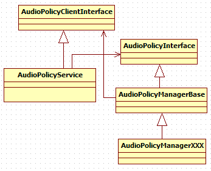 

图7-12  AudioPolicy和AudioPolicyInterface的关系

其中：

·  AudioPolicyService有一个AudioPolicyInterface类型的对象。

·  AudioPolicyManagerBase有一个AudioPolicyClientInterace的对象。

AudioPolicyInterface中的一些函数后面会分析到，这些函数中有很多参数都是以AudioSystem::xxx方式出现的，那么AudioSystem又是什么呢？
<h4>3. AudioSystem的介绍</h4>
AudioSystem是一个Native类，这个类在Java层有对应的Java类，其中定义了一些重要的类型，比如音频流流程、音频设备等，这些都在AudioSystem.h中。下面来看其中的一些定义。
<h5>（1）stream type（音频流类型）</h5>
音频流类型，我们已在AudioTrack中见识过了，其完整定义如下：

enum stream_type {

       DEFAULT          =-1,//默认

       VOICE_CALL       = 0,//通话声

       SYSTEM           = 1,//系统声，例如开关机提示

       RING             = 2,//来电铃声

       MUSIC            = 3,//媒体播放声

       ALARM            = 4,//闹钟等的警告声

       NOTIFICATION     = 5,//短信等的提示声

       BLUETOOTH_SCO    = 6,//蓝牙SCO

       ENFORCED_AUDIBLE = 7,//强制发声，照相机的快门声就属于这个类型

       DTMF             = 8,//DTMF,拨号盘的按键声

       TTS              = 9,//文本转语音，Text to Speech

       NUM_STREAM_TYPES

    };

音频流类型有什么用呢？为什么要做这种区分呢？它主要与两项内容有关：

·  设备选择：例如，之前在创建AudioTrack时，传入的音频流类型是MUSIC，当插上耳机时，这种类型的声音只会从耳机中出来，但如果音频流类型是RING，则会从耳机和扬声器中同时出来。

·  音量控制：不同流类型音量级的个数不同，例如，MUSIC类型有15个级别可供用户调节，而有些类型只有7个级别的音量。
<h5>（2）audio mode（声音模式）</h5>
audio mode和电话的状态有直接关系。先看它的定义：

enum audio_mode {

       MODE_INVALID = -2,

       MODE_CURRENT = -1,

       MODE_NORMAL = 0, //正常，既不打电话，也没有来电

       MODE_RINGTONE,//有来电

       MODE_IN_CALL,//通话状态

       NUM_MODES 

};

为什么Audio需要特别强调Phone的状态呢？这必须和智能手机的硬件架构联系上。先看智能手机的硬件架构，如图7-13所示：

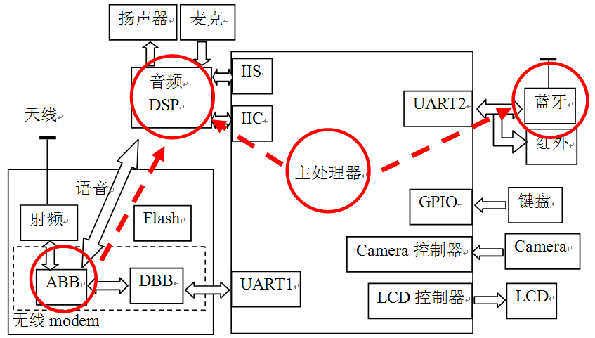 

图7-13  智能手机的硬件架构图

从图7-13中看出了什么？

·  系统有一个音频DSP，声音的输入输出都要经过它（不考虑蓝牙的情况）。但它处理完的数字信号，需通过D/A（数/模）转换后输出到最终的设备上，这些设备包括扬声器、听筒、耳机等。

注意：所谓的设备切换，是指诸如扬声器切换到听筒的情况，而前面常提到的音频输出设备，应该指的是DSP。

·  系统有两个核心处理器，一个是应用处理的核心，叫AP（Application Processor），可把它当做台式机上的CPU，在这上面可以运行操作系统。另一个和手机通信相关，一般叫BP（Baseband Processor 基带处理器），可把它当做台式机上的“猫”。

·  从图7-13中可看出，AP和BP都能向音频DSP发送数据，它们在硬件上通路上互不干扰。于是就出现了一个问题，即如果两个P同时往DSP发送数据，而互相之间没有协调，就可能出现通话声和音乐声混杂的情况。谁还会用这样的手机？所以打电话时，将由AP上的Phone程序主动设置Audio系统的mode，在这种mode下，Audio系统会做一些处理，例如把music音量调小等。

·  注意图中的蓝牙了吗？它没有像AP那样直接和音频DSP的相连，所以音频数据需要单独发给蓝牙设备。如果某种声音要同时从蓝牙和扬声器发出，亦即一份数据要往两个地方发送，便满足了AudioFlinger中DuplicatingThread出现的现实要求。

注意：蓝牙设备实际上会建立两条数据通路：SCO和A2DP。A2DP和高质量立体声有关，且必须由AudioFlinger向它发送数据。所以“音频数据需要单独发送给蓝牙设备”，这个设备实际上是指蓝牙的A2DP设备。蓝牙技术很复杂，有兴趣的读者可以自行研究。

<h5>（3）force use和config（强制使用及配置）</h5>
大家知道，手机通话时可以选择扬声器输出，这就是强制使用的案例。Audio系统对此有很好的支持。它涉及到两个方面：

·  强制使用何种设备，例如使用扬声器、听筒、耳机等。它由forced_config控制，代码如下所示：

enum forced_config {

       FORCE_NONE,

       FORCE_SPEAKER,  //强制使用扬声器

       FORCE_HEADPHONES,

       FORCE_BT_SCO,

       FORCE_BT_A2DP,

       FORCE_WIRED_ACCESSORY,

       FORCE_BT_CAR_DOCK,

       FORCE_BT_DESK_DOCK,

       NUM_FORCE_CONFIG,

       FORCE_DEFAULT = FORCE_NONE

}

·  在什么情况下需要强制使用，是通话的强制使用，还是听音乐的强制使用？这须由force_use控制，代码如下所示：

    enumforce_use {

       FOR_COMMUNICATION,//通话情况，注意前缀，是FOR_XXX

       FOR_MEDIA,//听音乐等媒体相关的情况

       FOR_RECORD,

       FOR_DOCK,

       NUM_FORCE_USE

}

所以，AudioPolicyInterface的setForceUse函数，就是设置在什么情况下强制使用什么设备：

virtual void setForceUse(AudioSystem::force_useusage,//什么情况

                          AudioSystem::forced_configconfig //什么设备

                         )= 0;

<h5>（4）输出设备的定义</h5>
前面曾反复提到输出设备。这些设备在软件中是怎么表示的呢？Audio定义了很多输出设备，来看其中几个：

enum audio_devices {

        //output devices

       DEVICE_OUT_EARPIECE = 0x1,  //听筒

        DEVICE_OUT_SPEAKER = 0x2,   //扬声器

       DEVICE_OUT_WIRED_HEADSET = 0x4,  //耳机

       DEVICE_OUT_WIRED_HEADPHONE = 0x8, //另外一种耳机

       DEVICE_OUT_BLUETOOTH_SCO = 0x10, //蓝牙相关，SCO用于通话的语音传输

       DEVICE_OUT_BLUETOOTH_SCO_HEADSET = 0x20,

        DEVICE_OUT_BLUETOOTH_SCO_CARKIT= 0x40,

       DEVICE_OUT_BLUETOOTH_A2DP = 0x80, //蓝牙相关，A2DP用于立体声传输

       DEVICE_OUT_BLUETOOTH_A2DP_HEADPHONES = 0x100,

       DEVICE_OUT_BLUETOOTH_A2DP_SPEAKER = 0x200,

       DEVICE_OUT_AUX_DIGITAL = 0x400,

        DEVICE_OUT_DEFAULT= 0x8000,

       ......

}

至此，AudioSystem中常用的定义都已见过了，现在要回到APS的创建上了。对这个例子，将使用Generic的设备，所以会直接创建AudioPolicyManagerBase对象，这个对象实现了AudioPolicyInterface的所有功能。一起来看。

说明：实际上很多硬件厂商实现的AudioPolicyInterface，基本上是直接使用这个AudioPolicyManagerBase。

 
<h4>4. AudioPolicyManagerBase的分析</h4>
AudioPolicyManagerBase类在AudioPolicyManagerBase.cpp中实现，先来看它的构造函数：

[--&gt;AudioPolicyManagerBase.cpp]

AudioPolicyManagerBase::AudioPolicyManagerBase(

                          AudioPolicyClientInterface*clientInterface)

                         :mPhoneState(AudioSystem::MODE_NORMAL),mRingerMode(0),

                          mMusicStopTime(0),mLimitRingtoneVolume(false)

{

   //APS实现了AudioPolicyClientInterface接口

   mpClientInterface= clientInterface;//这个clientInterface就是APS对象

    

    //清空强制使用配置

    for(int i = 0; i &lt; AudioSystem::NUM_FORCE_USE; i++) {

       mForceUse[i] = AudioSystem::FORCE_NONE;

    }

 

    //输出设备有听筒和扬声器

   mAvailableOutputDevices = AudioSystem::DEVICE_OUT_EARPIECE |

                       AudioSystem::DEVICE_OUT_SPEAKER;

   //输入设备是内置的麦克（学名叫传声器）

   mAvailableInputDevices = AudioSystem::DEVICE_IN_BUILTIN_MIC;

 

#ifdef WITH_A2DP //和蓝牙立体声有关。

   mA2dpOutput = 0;

   mDuplicatedOutput = 0;

   mA2dpDeviceAddress = String8("");

#endif

   mScoDeviceAddress = String8(""); //SCO主要用于通话

  /*

    ①创建一个AudioOutputDescriptor对象，这个对象用来记录并维护与

    输出设备（相当于硬件的音频DSP）相关的信息，例如使用该设备的流个数、各个流的音量、

    该设备所支持的采样率、采样精度等。其中，有一个成员mDevice用来表示目前使用的输出设备，

    例如耳机、听筒、扬声器等

 */

   AudioOutputDescriptor *outputDesc = new AudioOutputDescriptor();

    outputDesc-&gt;mDevice= (uint32_t)AudioSystem::DEVICE_OUT_SPEAKER;

 

  /*

    ②还记得MixerThread的来历吗？openOutput导致AF创建了一个工作线程。

    该函数返回的是一个工作线程索引号

  */

   mHardwareOutput =mpClientInterface-&gt;openOutput(&amp;outputDesc-&gt;mDevice,

                                    &amp;outputDesc-&gt;mSamplingRate,

                                   &amp;outputDesc-&gt;mFormat,

                                   &amp;outputDesc-&gt;mChannels,

                                   &amp;outputDesc-&gt;mLatency,

                                   outputDesc-&gt;mFlags);

 

     ......

    //AMB维护了一个与设备相关的key/value集合，下面将对应信息加到该集合中。

    addOutput(mHardwareOutput,outputDesc);

    //③设置输出设备，就是设置DSP的数据流到底从什么设备出去，这里设置的是从扬声器出去

     setOutputDevice(mHardwareOutput,

                       (uint32_t)AudioSystem::DEVICE_OUT_SPEAKER,true);

    }

   //④更新不同策略使用的设备

   updateDeviceForStrategy();

}

关于AMB这个小小的构造函数，有几个重要点需要介绍：
<h5>（1）AudioOutputDescriptor和openOutput</h5>
AudioOutputDescriptor对象，是AMB用来控制和管理音频输出设备的，从硬件上看，它代表的是DSP设备。关于这一点已在注释中做出说明，这里就不再赘述。

另一个重要点是openOutput函数。该函数的实现由APS来完成。之前曾分析过，它最终会在AF中创建一个混音线程（不考虑DirectOutput的情况），该函数返回的是该线程在AF中的索引号，亦即

mHardwareOutput =mpClientInterface-&gt;openOutput(......)

mHardwareOutput表示的是AF中一个混音线程的索引号。这里涉及到一个非常重要的设计问题：AudioFlinger到底会创建多少个MixerThread？有两种设计方案：

·  一种是一个MixerThread对应一个Track。如果这样，AMB仅使用一个mHardwareOutput恐怕还不够用。

·  另一种是用一个MixerThread支持32路的Track数据，多路数据通过AudioMixer混音对象在软件层面进行混音。

这里用的是第二种，当初设计时为何不用一个MixerThread支持一路Track，然后把混音的工作交给硬件来完成呢？我觉得，原因之一是如采用一个线程一个Track的方式，就非常难于管理和控制，另一个原因是多线程比较浪费资源。

 如采用第二种方法（也就是现有的方案），就极大简化了AMB的工作量。图7-14展示了AMB和AF及MixerThread之间的关系：

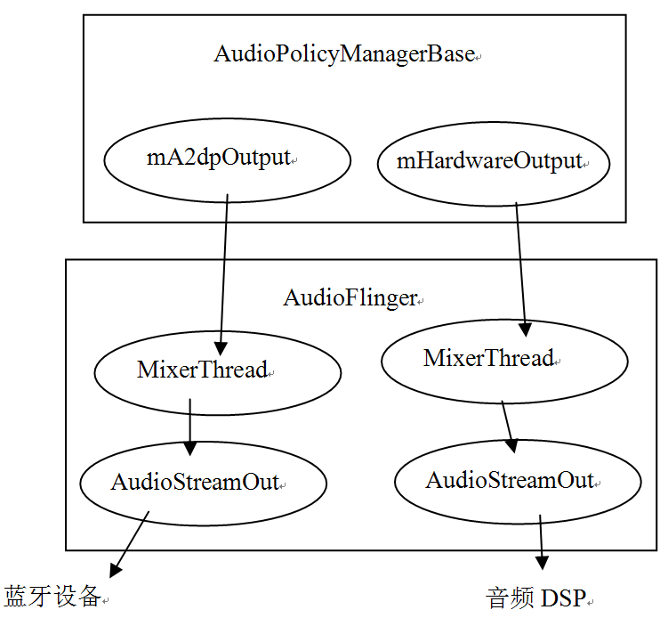 

图7-14  AF、AMB及MixerThread之间的关系

图7-14表明：

·  AMB中除了mHardwareOutput外，还有一个mA2dpOutput，它对应的MixerThread，专往代表蓝牙A2DP设备的AudioStreamOut上发送数据。关于这个问题，在后面分析DuplicatingThread时可以见到。

注意：使用mA2dpOutput需要蓝牙设备连接上才会有意义。

·  除了蓝牙外，系统中一般也就只有图7-14右边这么一个MixerThread了，所以AMB通过mHardwareOutput就能控制整个系统的声音，这真是一劳永逸。

说明：关于这一点，现在通过setOutputDevice来分析。

<h5>（2）setOutputDevice</h5>
现在要分析的调用是setOutputDevice，目的是为DSP选择一个合适的输出设备。注意它的第一个参数是传入的mHardwareOutput，它最终会找到代表DSP的AudioStreamOut对象，第二个参数是一个设备号。

[--&gt;AudioPolicyManagerBase.cpp]

void AudioPolicyManagerBase::setOutputDevice(audio_io_handle_toutput,

                                   uint32_tdevice, bool force, int delayMs)

{

    AudioOutputDescriptor*outputDesc = mOutputs.valueFor(output);

    //判断是否是Duplicate输出，和蓝牙A2DP有关，后面再做分析

    if(outputDesc-&gt;isDuplicated()) {

       setOutputDevice(outputDesc-&gt;mOutput1-&gt;mId, device, force,delayMs);

       setOutputDevice(outputDesc-&gt;mOutput2-&gt;mId, device, force,delayMs);

       return;

  }

 // 初始设置的输出设备为听筒和扬声器

   uint32_tprevDevice = (uint32_t)outputDesc-&gt;device();

   if ((device == 0 || device == prevDevice)&amp;&amp; !force) {

       return;

    }

  //现在设置新的输出设备为扬声器，注意这是软件层面上的设置

  outputDesc-&gt;mDevice = device;

     ......

  /*

    还需要硬件也做相应设置，主要是告诉DSP把它的输出切换到某个设备上，根据之前的分析，

   这个请求要发送到AF中的MixerThread上，因为只有它拥有代表输出设备的AudioStreamOut

对象

 */

   AudioParameter param = AudioParameter();

    param.addInt(String8(AudioParameter::keyRouting),(int)device);

 /*

  上面的配置参数将投递到APS的消息队列，而APS中创建的AudioCommandThread

  会取出这个配置参数，再投递给AF中对应的MixerThread，最终由MixerThread处理。

  这个流程，将在耳机插拔事件处理中进行分析

*/

   mpClientInterface-&gt;setParameters(mHardwareOutput,

                                           param.toString(),delayMs);

   ......

}

setOutputDevice要实现的目的已很明确，只是实现的过程比较繁琐而已。其间没有太多复杂之处，读者可自行研究，以加深对Audio系统的了解。
<h5>（3）Audio Strategy</h5>
现调用的函数是updateDeviceForStrategy，这里会引出一个strategy的概念。先看updataDeviceForStrategy函数：

[--&gt;AudioPolicyManagerBase.cpp]

voidAudioPolicyManagerBase::updateDeviceForStrategy()

{

    for(int i = 0; i &lt; NUM_STRATEGIES; i++) {

       mDeviceForStrategy[i] = 

                            getDeviceForStrategy((routing_strategy)i,false);

    }

}

关于getDeviceForStrategy，在耳机插拔事件中再做分析，现在先看routing_stratgy的定义，代码如下所示：

[--&gt;getDeviceForStrategy.h::routing_strategy]

//routing_strategy:路由策略

enum routing_strategy {

           STRATEGY_MEDIA,  

           STRATEGY_PHONE,

           STRATEGY_SONIFICATION,

           STRATEGY_DTMF,

           NUM_STRATEGIES

        }

它是在AudioPolicyManagerBase.h中定义的，一般的应用程序不会使用这个头文件。这个routing_strategy有什么用处呢？从名字上看，似乎和路由的选择有关系，但AudioSystem定义的是stream type，这两者之间会有什么关系吗？有，而且还很紧密。这个关系通过AMB的getStrategy就可以看出来。它会从指定的流类型得到对应的路由策略，代码如下所示：

[--&gt;AudioPolicyManagerBase.cpp]

AudioPolicyManagerBase::getStrategy(AudioSystem::stream_typestream)

{

    switch(stream) {

    caseAudioSystem::VOICE_CALL:

    caseAudioSystem::BLUETOOTH_SCO:

        return STRATEGY_PHONE; //PHONE路由策略

    caseAudioSystem::RING:

    caseAudioSystem::NOTIFICATION:

    caseAudioSystem::ALARM:

    caseAudioSystem::ENFORCED_AUDIBLE:

       return STRATEGY_SONIFICATION; //SONIFICATION路由策略

    caseAudioSystem::DTMF:

       return STRATEGY_DTMF;  //DTMF路由策略

   default:

       LOGE("unknown stream type");

    caseAudioSystem::SYSTEM:

    caseAudioSystem::TTS:

    caseAudioSystem::MUSIC:

       return STRATEGY_MEDIA;//media 路由策略

    }

}

从这个函数中可看出，AudioSystem使用的流类型并不是和路由直接相关的，AMB或AudioPolicy内部，是使用routing_strategy来控制路由策略的。
<h4>5. 小结</h4>
这一节涉及到不少新东西，但本人觉得，最重要的还是图7-13和图7-14。其中：

·  图7-13展示了智能手机的硬件架构，通过和Audio相关的架构设计，我们能理解Audio系统设计的缘由。

·  图7-14展示了APS和AF内部联系的纽带，后续APS的控制无非就是找到对应的MixerThread，给它发送控制消息，最终由MixerThread将控制信息传给对应的代表音频输出设备的HAL对象。

 
<h3><a>7.4.2 </a>重回AudioTrack</h3>
按照前文所介绍的内容可知，AudioTrack在调用createTrack时，会传入一个audio_handle_t，这个值表示AF中某个工作线程的索引号，而它又是从APS中得到的。那么，这中间又有哪些曲折的经历呢？

先回顾一下AudioTrack的set函数。
<h4>1. 重回set</h4>
先来看相应的代码，如下所示：

 [---&gt;AudioTrack.cpp]

status_t AudioTrack::set(int streamType,uint32_tsampleRate,int format,

                          int channels,intframeCount,uint32_t flags,

                          callback_t cbf,void*user,int notificationFrames,

                          constsp&lt;IMemory&gt;&amp; sharedBuffer, bool threadCanCallJava)

{

 

......

   //得到AF中一个工作线程的索引号

     audio_io_handle_toutput = AudioSystem::getOutput(

                                   (AudioSystem::stream_type)streamType,

                                   sampleRate,format, channels, 

                                    (AudioSystem::output_flags)flags);

   ......

//创建Track，最终会调到AF的createTrack

status_t status = createTrack(streamType,sampleRate, format, channelCount,

                                  frameCount,flags, sharedBuffer, output);

再看AudioSystem是如何实现getOutput的，代码如下所示：

[--&gt;AudioSystem.cpp]

audio_io_handle_tAudioSystem::getOutput(stream_type stream,

                                    uint32_tsamplingRate,

                                    uint32_tformat,

                                    uint32_tchannels,

                                    output_flagsflags)

{

   audio_io_handle_t output = 0;

    ......

    if(output == 0) {

       const sp&lt;IAudioPolicyService&gt;&amp; aps =

                                     AudioSystem::get_audio_policy_service();

        if(aps == 0) return 0;

     //调用AP的getOutput函数

       output = aps-&gt;getOutput(stream, samplingRate, format, channels,flags);

        if((flags &amp; AudioSystem::OUTPUT_FLAG_DIRECT) == 0) {

           Mutex::Autolock _l(gLock);

         //把这个stream和output的对应关系保存到map中

           AudioSystem::gStreamOutputMap.add(stream, output);

        }

    }

    returnoutput;

}

这里调用了AP的getOutput，来看：

[--&gt;AudioPolicyService.cpp]

audio_io_handle_t AudioPolicyService::getOutput(

                          AudioSystem::stream_typestream, uint32_t samplingRate,

                          uint32_tformat,uint32_t channels,

                          AudioSystem::output_flagsflags)

{

   //和硬件厂商的实现相关，所以交给AudioPolicyInterface处理

   //这里将由AudioPolicyManagerBase处理

    Mutex::Autolock _l(mLock);

    returnmpPolicyManager-&gt;getOutput(stream, samplingRate, format, channels,

                                             flags);

}

[-&gt;AudioPolicyManagerBase.cpp]

audio_io_handle_tAudioPolicyManagerBase::getOutput(

                     AudioSystem::stream_typestream, uint32_t samplingRate,

                     uint32_t format,uint32_tchannels,

                     AudioSystem::output_flagsflags)

{

   audio_io_handle_t output = 0;

    uint32_tlatency = 0;

   //根据流类型得到对应的路由策略，这个我们已经见过了，MUSIC类型返回MUSIC策略

   routing_strategystrategy = getStrategy((AudioSystem::stream_type)stream);

  //根据策略得到使用这个策略的输出设备（指扬声器之类的），以后再看这个函数

    uint32_tdevice = getDeviceForStrategy(strategy);

......

   //看这个设备是不是与蓝牙的A2DP相关

   uint32_ta2dpDevice = device &amp; AudioSystem::DEVICE_OUT_ALL_A2DP;

   if(AudioSystem::popCount((AudioSystem::audio_devices)device) == 2) {

#ifdef WITH_A2DP

     //对于有A2DP支持，a2dpUsedForSonification函数直接返回true

  if (a2dpUsedForSonification() &amp;&amp;a2dpDevice != 0) {

      //和DuplicatingThread相关，以后再看

        output = mDuplicatedOutput; 

 } else

#endif

       {

        output = mHardwareOutput; //使用非蓝牙的混音输出线程

        }

    } else{

#ifdef WITH_A2DP

        if(a2dpDevice != 0) {

           //使用蓝牙的混音输出线程

           output = mA2dpOutput;

        }else

#endif

        {

          output = mHardwareOutput;

        }

    }

  returnoutput;

}

终于明白了！原来，AudioSystem的getOutput就是想找到AF中的一个工作线程。为什么这个线程号会由AP返回呢？是因为Audio系统需要：

·  根据流类型找到对应的路由策略。

·  根据该策略找到合适的输出device（指扬声器、听筒之类的）。

·  根据device选择AF中合适的工作线程，例如是蓝牙的MixerThread，还是DSP的MixerThread，或者是DuplicatingThread。 

·  AT根据得到的工作线程索引号，最终将在对应的工作线程中创建一个Track。之后，AT的数据将由该线程负责处理。

下面用图7-15来回顾一下上面AT、AF、AP之间的交互关系。

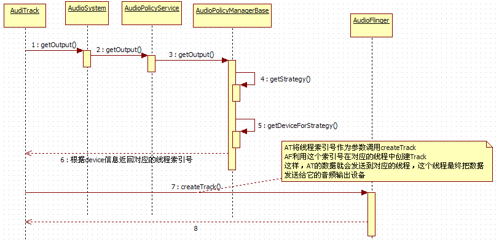 

图7-15  Audio三巨头的交互关系

图7-15充分展示了AT、AF和AP之间复杂微妙的关系。关系虽复杂，但目的却单纯。读者在分析时一定要明确目的。下面从目的开始，反推该流程：

·  AT的目的是把数据发送给对应的设备，例如是蓝牙、DSP等。

·  代表输出设备的HAL对象由MixerThread线程持有，所以要找到对应的MixerThread。

·  AP维护流类型和输出设备（耳机、蓝牙耳机、听筒等）之间的关系，不同的输出设备使用不同的混音线程。

·  AT根据自己的流类型，向AudioSystem查询，希望得到对应的混音线程号。

这样，三者精妙配合，便达到了预期目的。
<h4>2. 重回start</h4>
现在要分析的就是start函数。AT的start虽没有直接与AP交互，但在AF的start中却和AP有着交互关系。其代码如下所示：

[--&gt;AudioFlinger.cpp]

status_tAudioFlinger::PlaybackThread::Track::start()

{

   status_t status = NO_ERROR;

    sp&lt;ThreadBase&gt; thread = mThread.promote();

     ......

        if(!isOutputTrack() &amp;&amp; state != ACTIVE &amp;&amp; state != RESUMING) {

           thread-&gt;mLock.unlock();

          //调用AudioSystem的startOutput

           status = AudioSystem::startOutput(thread-&gt;id(), 

                                  (AudioSystem::stream_type)mStreamType);

            thread-&gt;mLock.lock();

        }

      PlaybackThread *playbackThread = (PlaybackThread *)thread.get();

      playbackThread-&gt;addTrack_l(this);//把这个Track加入到活跃Track数组中

    returnstatus;

}

下面来看AudioSystem的startOutput，代码如下所示：

[--&gt;AudioSystem.cpp]

status_tAudioSystem::startOutput(audio_io_handle_t output, 

                                         AudioSystem::stream_typestream)

{

   constsp&lt;IAudioPolicyService&gt;&amp; aps = 

                                       AudioSystem::get_audio_policy_service();

  if (aps== 0) return PERMISSION_DENIED;

    //调用AP的startOutput，最终由AMB完成实际功能

    returnaps-&gt;startOutput(output, stream); 

}

[--&gt;AudioPolicyManagerBase.cpp]

status_tAudioPolicyManagerBase::startOutput(audio_io_handle_t output, 

                                         AudioSystem::stream_typestream)

{

    //根据output找到对应的AudioOutputDescriptor

   ssize_t index = mOutputs.indexOfKey(output);

    AudioOutputDescriptor*outputDesc = mOutputs.valueAt(index);

 

   //找到对应流使用的路由策略

   routing_strategy strategy =getStrategy((AudioSystem::stream_type)stream);

 

   //增加outputDesc中该流的使用计数，1表示增加1

    outputDesc-&gt;changeRefCount(stream, 1);

//getNewDevice将得到一个设备，setOutputDevice将使用这个设备进行路由切换。

//至于setOutputDevice，我们在分析耳机插入事件时再来讲解

   setOutputDevice(output, getNewDevice(output));

    //设置音量，读者可自行分析

    checkAndSetVolume(stream,mStreams[stream].mIndexCur, output,

                         outputDesc-&gt;device());

 

  returnNO_ERROR;

}

再看getNewDevice，它和音频流的使用计数有关系：

[--&gt;AudioPolicyManagerBase.cpp]

uint32_tAudioPolicyManagerBase::getNewDevice(audio_io_handle_t output, 

                                                        bool fromCache)

{

   uint32_t device = 0;

 

   AudioOutputDescriptor*outputDesc = mOutputs.valueFor(output);

  /*

    isUsedByStrategy判断某个策略是否正在被使用，之前曾通过changeRefCount为

    MUSIC流使用计数增加了1，所以使用MUSIC策略的个数至少为1，这表明，此设备正在使用该策略。

    一旦得到当前outputDesc使用的策略，便可根据该策略找到对应的设备。

    注意if和else的顺序，它代表了系统优先使用的策略,以第一个判断为例，

    假设系统已经插上耳机，并且处于通话状态时，而且强制使用了扬声器，那么声音都从扬声器出。

    这时，如果想听音乐的话，则应首先使用STRATEGY_PHONE的对应设备，此时就是扬声器。

    所以音乐将从扬声器出来，而不是耳机。上面仅是举例，具体的情况还要综合考虑Audio

    系统中的其他信息。另外如果fromCache为true，将直接从内部保存的旧信息中得到设备，

    关于这个问题，在后面的耳机插入事件处理中再做分析

   */

    if(mPhoneState == AudioSystem::MODE_IN_CALL ||

       outputDesc-&gt;isUsedByStrategy(STRATEGY_PHONE)) {

       device = getDeviceForStrategy(STRATEGY_PHONE, fromCache);

    } elseif (outputDesc-&gt;isUsedByStrategy(STRATEGY_SONIFICATION)) {

       device = getDeviceForStrategy(STRATEGY_SONIFICATION, fromCache);

    } elseif (outputDesc-&gt;isUsedByStrategy(STRATEGY_MEDIA)) {

       device = getDeviceForStrategy(STRATEGY_MEDIA, fromCache);

    } elseif (outputDesc-&gt;isUsedByStrategy(STRATEGY_DTMF)) {

       device = getDeviceForStrategy(STRATEGY_DTMF, fromCache);

    }

    returndevice;

}

这里，有一个问题需要关注：

·  为什么startOutput函数会和设备切换有关系呢？

仅举一个例子，帮助理解这一问题。AudioTrack创建时可设置音频流类型，假设第一个AT创建时使用的是MUSIC类型，那么它将使用耳机出声（假设耳机已经连接上）。这时第二个AT创建了，它使用的是RING类型，它对应的策略应是SONIFACATION，这个策略的优先级比MUSIC要高（因为getNewDevice的判断语句首先会判断isUsedByStrategy(STRATEGY_SONIFICATION)），所以这时需要把设备切换为耳机加扬声器（假设这种类型的声音需要从耳机和扬声器同时输出）。startOutput的最终结果，是这两路的Track声音都将从耳机和扬声器中听到。当第二路AT调用stop时，对应音频流类型使用计数会减一，这会导致新的路由切换，并重新回到只有耳机的情况，这时第一路AT的声音会恢复为只从耳机输出。

提醒：读者可自行分析stop的处理方式，基本上是start的逆向处理过程。

<h4>3. 本节小结</h4>
这一节主要讲解了AudioTrack和AP之间的交互，总结为以下两点：

·  AT通过AP获取AF中的工作线程索引号，这决定了数据传输的最终目标是谁，比如是音频DSP或是蓝牙。

·  AT的start和stop会影响Audio系统的路由切换。

读完这一节，读者可能只会对与工作线程索引有关的内容印象较深刻，毕竟这个决定了数据传输的目的地。至于与路由切换有关的知识，可能就还不太了解了。下面，通过分析一个应用场景来启发、加深对它的理解。
<h3><a>7.4.3 </a>声音路由切换实例分析</h3>
路由这个词听上去很专业，其实它的目的很简单，就是为DSP选择数据出口，例如是从耳机、听筒还是扬声器传出。下面分析这样一个场景：

·  假设我们在用扬声器听歌，这时把耳机插上，会发生什么呢？
<h4>1. 耳机插拔事件处理</h4>
耳机插上后，系统会发一个广播，Java层的AudioService会接收这个广播，其中的内部类AudioServiceBroadcastReceiver会处理该事件，处理函数是onReceive。

这段代码在AudioSystem.java中。一起来看：
<h5>（1）耳机插拔事件接收</h5>
看这段代码，如下所示：

[--&gt;AudioSystem.java::AudioServiceBroadcastReceiver的onReceive()]

private class AudioServiceBroadcastReceiverextends BroadcastReceiver{

@Override

       public void onReceive(Context context, Intent intent) {

           String action = intent.getAction();

       ......

                  //如果该事件是耳机插拔事件

        elseif (action.equals(Intent.ACTION_HEADSET_PLUG)) {

                //取得耳机的状态

               int state = intent.getIntExtra("state", 0);

               int microphone =intent.getIntExtra("microphone", 0);

               if (microphone != 0) {

                 //察看已连接设备是不是已经有了耳机，耳机的设备号为0x4，

                //这个和AudioSystem.h定义的设备号是一致的

                    boolean isConnected =mConnectedDevices.containsKey(

                              AudioSystem.DEVICE_OUT_WIRED_HEADSET);

                    //如果之前有耳机而现在没有，则认为是耳机拔出事件

                    if (state == 0 &amp;&amp;isConnected) {

                        //设置Audio系统的设备连接状态，耳机为Unavailable

                        AudioSystem.setDeviceConnectionState(

                                AudioSystem.DEVICE_OUT_WIRED_HEADSET,

                               AudioSystem.DEVICE_STATE_UNAVAILABLE,

                                "");

               //从已连接设备中去掉耳机设备

               mConnectedDevices.remove(AudioSystem.DEVICE_OUT_WIRED_HEADSET);

         } //如果state为1，并且之前没有耳机连接,则处理这个耳机插入事件

          else if (state == 1 &amp;&amp; !isConnected){

             //设置Audio系统的设备连接状态，耳机为Available

                    AudioSystem.setDeviceConnectionState(

                        AudioSystem.DEVICE_OUT_WIRED_HEADSET,

                        AudioSystem.DEVICE_STATE_AVAILABLE,

                        "");

             //已连接设备中增加耳机   

             mConnectedDevices.put( 

                         new Integer(AudioSystem.DEVICE_OUT_WIRED_HEADSET),

                         "");

                    }

               } 

......

从上面的代码中可看出，不论耳机插入还是拔出，都会调用AudioSystem的setDeviceConnectionState函数。
<h5>（2）setDeviceConnectionState：设置设备连接状态</h5>
这个函数被定义为Native函数。下面是它的定义：

[--&gt;AudioSystem.java]

  publicstatic native int setDeviceConnectionState(int device, int state,

                                                             String device_address);

//注意我们传入的参数，device为0X4表示耳机，state为1，device_address为””

该函数的Native实现，在android_media_AudioSystem.cpp中，对应函数是：

[-&gt;android_media_AudioSystem.cpp]

static int android_media_AudioSystem_setDeviceConnectionState(

                                      JNIEnv*env, jobject thiz, jint 

                                      device,jint state, jstring device_address)

{

    constchar *c_address = env-&gt;GetStringUTFChars(device_address, NULL);

    intstatus = check_AudioSystem_Command(

    //调用Native AudioSystem的setDeviceConnectionState

    AudioSystem::setDeviceConnectionState(

                 static_cast&lt;AudioSystem::audio_devices&gt;(device),

                 static_cast&lt;AudioSystem::device_connection_state&gt;(state),

                c_address));

   env-&gt;ReleaseStringUTFChars(device_address, c_address);

    returnstatus;

}

从AudioSystem.java转入到AudioSystem.cpp，现在来看Native的对应函数：

[--&gt;AudioSystem.cpp]

status_tAudioSystem::setDeviceConnectionState(audio_devices device, 

                                                       device_connection_state state,

                                                       const char *device_address)

{

    constsp&lt;IAudioPolicyService&gt;&amp; aps =

                                       AudioSystem::get_audio_policy_service();

    if(aps == 0) return PERMISSION_DENIED;

    //转到AP去，最终由AMB处理

    returnaps-&gt;setDeviceConnectionState(device, state, device_address);

} 

Audio代码不厌其烦地把函数调用从这一类转移到另外一类，请直接看AMB的实现：

[--&gt;AudioPolicyManagerBase.cpp]

status_tAudioPolicyManagerBase::setDeviceConnectionState(

                  AudioSystem::audio_devicesdevice,

                  AudioSystem::device_connection_statestate,

                  const char *device_address)

{

 

    //一次只能设置一个设备

    if(AudioSystem::popCount(device) != 1) return BAD_VALUE;

     ......

     //根据设备号判断是不是输出设备，耳机肯定属于输出设备

   if(AudioSystem::isOutputDevice(device)) {

      switch (state)

        {

       case AudioSystem::DEVICE_STATE_AVAILABLE:

          //处理耳机插入事件，mAvailableOutputDevices保存已连接的设备

           //这个耳机是刚连上的，所以不走下面if分支

           if (mAvailableOutputDevices &amp; device) {

               //启用过了，就不再启用了。

               return INVALID_OPERATION;

           }

 

           //现在已连接设备中多了一个耳机

           mAvailableOutputDevices |= device;

             ....

         }

        //① getNewDevice之前已分析过了，这次再看

         uint32_t newDevice =getNewDevice(mHardwareOutput, false);

         //②更新各种策略使用的设备

          updateDeviceForStrategy();

         //③设置新的输出设备

          setOutputDevice(mHardwareOutput,newDevice);

 

     ......

}

这里面有三个比较重要的函数，前面也已提过，现将其再进行一次较深入的分析，旨在加深读者对它的理解。
<h5>（3）getNewDevice</h5>
来看代码，如下所示：

[-&gt;AudioPolicyManagerBase.cpp]

uint32_tAudioPolicyManagerBase::getNewDevice(audio_io_handle_t output, 

                                                       bool fromCache)

{  //注意我们传入的参数，output为mHardwardOutput,fromCache为false

    uint32_tdevice = 0;

    //根据output找到对应的AudioOutputDescriptor，这个对象保存了一些信息

   AudioOutputDescriptor *outputDesc = mOutputs.valueFor(output);

 

    if(mPhoneState == AudioSystem::MODE_IN_CALL ||

         outputDesc-&gt;isUsedByStrategy(STRATEGY_PHONE))

    {

       device = getDeviceForStrategy(STRATEGY_PHONE, fromCache);

    } 

     elseif (outputDesc-&gt;isUsedByStrategy(STRATEGY_SONIFICATION)) 

    {

       device = getDeviceForStrategy(STRATEGY_SONIFICATION, fromCache);

     } 

     elseif (outputDesc-&gt;isUsedByStrategy(STRATEGY_MEDIA)) 

    {

         //应用场景是正在听歌，所以会走这个分支

        device= getDeviceForStrategy(STRATEGY_MEDIA, fromCache);

     } 

    elseif (outputDesc-&gt;isUsedByStrategy(STRATEGY_DTMF)) 

    {

       device = getDeviceForStrategy(STRATEGY_DTMF, fromCache);

     }

    return device;

}

策略是怎么和设备联系起来的呢？秘密就在getDeviceForStrategy中，来看：

[--&gt;AudioPolicyManagerBase.cpp]

uint32_tAudioPolicyManagerBase::getDeviceForStrategy(

                                       routing_strategystrategy, bool fromCache)

{

   uint32_t device = 0;

 

    if (fromCache){//如果为true，则直接取之前的旧值

      return mDeviceForStrategy[strategy];

    }

  //如果fromCache为false，则需要重新计算策略所对应的设备

    switch(strategy) {

    caseSTRATEGY_DTMF://先处理DTMF策略的情况

        if(mPhoneState != AudioSystem::MODE_IN_CALL) {

          //如果不处于电话状态，则DTMF的策略和MEDIA策略对应同一个设备

           device = getDeviceForStrategy(STRATEGY_MEDIA, false);

           break;

        }

         //如果处于电话状态，则DTMF策略和PHONE策略用同一个设备

    caseSTRATEGY_PHONE:

         //是PHONE策略的时候，先要考虑是不是用户强制使用了某个设备，例如强制使用扬声器

       switch (mForceUse[AudioSystem::FOR_COMMUNICATION]) {

         ......

       case AudioSystem::FORCE_SPEAKER:

        ...... //如果没有蓝牙，则选择扬声器

           device = mAvailableOutputDevices &amp; 

                                           AudioSystem::DEVICE_OUT_SPEAKER;

           break;

        }

    break;

    caseSTRATEGY_SONIFICATION://SONIFICATION策略

        if(mPhoneState == AudioSystem::MODE_IN_CALL) {

           /*

             如果处于来电状态，则和PHONE策略用同一个设备。例如通话过程中我们强制使用

             扬声器，那么这个时候按拨号键，则按键声也会从扬声器出来

           */

           device = getDeviceForStrategy(STRATEGY_PHONE, false);

           break;

        }

       device = mAvailableOutputDevices &amp; AudioSystem::DEVICE_OUT_SPEAKER;

        //如果不处于电话状态，则SONIFICATION和MEDIA策略用同一个设备

case STRATEGY_MEDIA: {

       //AUX_DIGITAL值为0x400，耳机不满足该条件

       uint32_t device2 = mAvailableOutputDevices &amp;

                                   AudioSystem::DEVICE_OUT_AUX_DIGITAL;

        if(device2 == 0) {

          //也不满足WIRED_HEADPHONE条件

           device2 = mAvailableOutputDevices &amp;

                                   AudioSystem::DEVICE_OUT_WIRED_HEADPHONE;

        }

        if(device2 == 0) {

           //满足这个条件，所以device2为0x4，WIRED_HEADSET

           device2 = mAvailableOutputDevices &amp;

                                      AudioSystem::DEVICE_OUT_WIRED_HEADSET;

        }

       if(device2 == 0) {

           device2 = mAvailableOutputDevices &amp; 

                                      AudioSystem::DEVICE_OUT_SPEAKER;

        }

      device |= device2; //最终device为0x4，WIRED_HEADSET

     }break;

   default:

      break;

    }

    returndevice;

}

getDeviceForStrategy是一个比较复杂的函数。它的复杂，在于选取设备时，需考虑很多情况。简单的分析仅能和读者一起领略一下它的风采，在实际工作中反复琢磨，或许才能掌握其中的奥妙。

好，getNewDevice将返回耳机的设备号0x4。下一个函数是updateDeviceForStrategy。这个函数和getNewDevice没有什么关系，因为它没用到getNewDevice的返回值。
<h5>（4）updateDeviceForStrategy</h5>
同样是来看相应的代码，如下所示：

[--&gt;AudioPolicyManagerBase.cpp]

voidAudioPolicyManagerBase::updateDeviceForStrategy()

{

    for(int i = 0; i &lt; NUM_STRATEGIES; i++) {

  //重新计算每种策略使用的设备，并保存到mDeviceForStrategy中，起到了cache的作用

 mDeviceForStrategy[i] = 

                              getDeviceForStrategy((routing_strategy)i,false);

    }

}

updateDeviceForStrategy会重新计算每种策略对应的设备。

另外，如果updateDeviceForStrategy和getNewDevice互换位置，就会节省很多不必要的调用。如：

updateDevicdForStrategy();//先更新策略

//使用cache中的设备，节省一次重新计算                         

uint32_t newDevice =getNewDevice(mHardwareOutput, true);

OK，不必讨论这位码农的功过了，现在看最后一个函数setOutputDevice。它会对新选出来的设备做如何处理呢？
<h5>（5）setOutputDevice</h5>
继续看setOutputDevice的代码，如下所示：

[--&gt;AudioPolicyManagerBase.cpp]

void AudioPolicyManagerBase::setOutputDevice(audio_io_handle_toutput,

                                       uint32_t device,bool force, int delayMs)

{

    ......

   //把这个请求要发送到output对应的AF工作线程中

     AudioParameterparam = AudioParameter();

   //参数是key/vlaue键值对的格式

    param.addInt(String8(AudioParameter::keyRouting),(int)device);

   //mpClientInterface是AP对象，由它处理

    mpClientInterface-&gt;setParameters(mHardwareOutput,

                                            param.toString(),delayMs);

    

   //设置音量，不做讨论，读者可自行分析

   applyStreamVolumes(output, device, delayMs);

 }

setParameters最终会调用APS的setParameters，代码如下所示：

[--&gt;AudioPolicyService.cpp]

voidAudioPolicyService::setParameters(audio_io_handle_t ioHandle, 

                              constString8&amp; keyValuePairs, int delayMs)

{

    //把这个请求加入到AudioCommandThread处理

    mAudioCommandThread-&gt;parametersCommand((int)ioHandle,

                                                 keyValuePairs, delayMs);

}

AudioPolicyService创建时会同时创建两个线程，其中一个用于处理各种请求。现在看看它是怎么做的。
<h4>2. AudioCommandThread</h4>
AudioCommandThread有一个请求处理队列，AP负责往该队列中提交请求，而AudioCommandThread在它的线程函数threadLoop中处理这些命令。请直接看命令是如何处理的。

说明：这种通过一个队列来协调两个线程的方法，在多线程编程中非常常见，它也属于生产者/消费者模型。

<h5>（1）AudioCommandThread中的处理</h5>
[--&gt;AudioPolicyService.cpp]

boolAudioPolicyService::AudioCommandThread::threadLoop()

{

    nsecs_twaitTime = INT64_MAX;

 

   mLock.lock();

    while(!exitPending())

    {

       while(!mAudioCommands.isEmpty()) {

           nsecs_t curTime = systemTime();

           if (mAudioCommands[0]-&gt;mTime &lt;= curTime) {

               AudioCommand *command = mAudioCommands[0];

               mAudioCommands.removeAt(0);

               mLastCommand = *command;

 

               switch (command-&gt;mCommand) {

               case START_TONE: 

                   ......

               case STOP_TONE: 

                   ......  //TONE处理

                    mLock.lock();

                    }break;

               case SET_VOLUME: {

                    //设置音量

                    delete data;

                    }break;

               case SET_PARAMETERS: {

                    //处理路由设置请求

                     ParametersData *data =(ParametersData *)command-&gt;mParam;

                    //转到AudioSystem处理，mIO的值为mHardwareOutput

                     command-&gt;mStatus =AudioSystem::setParameters(

                                          data-&gt;mIO,

                                         data-&gt;mKeyValuePairs);

                     if(command-&gt;mWaitStatus) {

                        command-&gt;mCond.signal();

                        mWaitWorkCV.wait(mLock);

                     }

                     delete data;

                     }break;

               ......

               default:

               }

}

Audio系统真是非常绕！先看AudioSystem的setParameters。
<h5>（2）AudioSystem的setParameters</h5>
AudioSystem将设置请求转移给AudioFlinger处理，代码如下所示：

[--&gt;AudioSystem.cpp]

status_tAudioSystem::setParameters(audio_io_handle_t ioHandle, 

                                           constString8&amp; keyValuePairs) 

{

     constsp&lt;IAudioFlinger&gt;&amp; af = AudioSystem::get_audio_flinger();

    //果然是交给AF处理，ioHandle看来一定就是工作线程索引号了

    returnaf-&gt;setParameters(ioHandle, keyValuePairs);

}

离真相越来越近了，接着看代码，如下所示：

[--&gt;AudioFlinger.cpp]

status_t AudioFlinger::setParameters(intioHandle, 

                                   constString8&amp; keyValuePairs)

{

   status_t result;

    // ioHandle == 0 表示和混音线程无关，需要直接设置到HAL对象中。

    if(ioHandle == 0) {

       AutoMutex lock(mHardwareLock);

       mHardwareStatus = AUDIO_SET_PARAMETER;

       //调用AudioHardwareInterface的参数设置接口

       result = mAudioHardware-&gt;setParameters(keyValuePairs);

       mHardwareStatus = AUDIO_HW_IDLE;

       return result;

    }

 

    sp&lt;ThreadBase&gt; thread;

    {

       Mutex::Autolock _l(mLock);

       //根据索引号找到对应混音线程。

       thread = checkPlaybackThread_l(ioHandle);

      }

      //我们只有一个MixerThread,交给它处理，这又是一个命令处理队列

     result = thread-&gt;setParameters(keyValuePairs);

      returnresult;

    }

    returnBAD_VALUE;

}

好了，最终的请求处理在MixerThread的线程函数中，来看：
<h5>（3）MixerThread最终处理</h5>
代码如下所示：

[--&gt;AudioFlinger.cpp]

bool AudioFlinger::MixerThread::threadLoop()

{

    ....

    while(!exitPending())

    {

       processConfigEvents();

       mixerStatus = MIXER_IDLE;

        {// scope for mLock

           Mutex::Autolock _l(mLock);

          // checkForNewParameters_l最有嫌疑

           if (checkForNewParameters_l()) {

                ... 

           }

      ......//其他处理

}

[--&gt;AudioFlinger.cpp]

boolAudioFlinger::MixerThread::checkForNewParameters_l()

{

    boolreconfig = false;

 

    while(!mNewParameters.isEmpty()) {

       status_t status = NO_ERROR;

       String8 keyValuePair = mNewParameters[0];

       AudioParameter param = AudioParameter(keyValuePair);

       int value;

       ......

      //路由设置需要硬件参与，所以直接交给代表音频输出设备的HAL对象处理

      status = mOutput-&gt;setParameters(keyValuePair);

       

      return reconfig;

}

至此，路由设置所经历的一切轨迹，我们都已清晰地看到了，可总还有点意犹未尽的感觉，HAL的setParameters到底是怎么工作的呢？不妨再来看一个实际的HAL对象处理例子。
<h5>（4）真实设备的处理</h5>
这个实际的Hardware，位于hardware/msm7k/libaudio-qsd8k的Hardware.cpp中，它提供了一个实际的音频处理例子，这个Hardware针对的是高通公司的硬件。直接看它是怎么处理音频输出对象setParameters的，代码如下所示：

[--&gt;AudioHardware.cppAudioStreamOutMSM72xx::setParameters()]

status_tAudioHardware::AudioStreamOutMSM72xx::setParameters(

const String8&amp; keyValuePairs)

{

   AudioParameter param = AudioParameter(keyValuePairs);

   String8 key = String8(AudioParameter::keyRouting);

    status_tstatus = NO_ERROR;

    intdevice;

   

    if(param.getInt(key, device) == NO_ERROR) {

       mDevices = device;

        //调用doRouting，mHardware就是AudioHardware对象

       status = mHardware-&gt;doRouting();

       param.remove(key);

    }

......

    returnstatus;

}

[--&gt;AudioHardware.cpp]

status_t AudioHardware::doRouting()

{

   Mutex::Autolock lock(mLock);

   uint32_t outputDevices = mOutput-&gt;devices();

   status_t ret = NO_ERROR;

    intsndDevice = -1;

      ......

      //做一些判断，最终由doAudioRouteOrMute处理

     if((vr_mode_change) || (sndDevice != -1 &amp;&amp; sndDevice != mCurSndDevice)) {

       ret = doAudioRouteOrMute(sndDevice); 

       mCurSndDevice = sndDevice;

      }

 

    returnret;

}

[--&gt;AudioHardware.cpp]

status_t AudioHardware::doAudioRouteOrMute(uint32_tdevice)

{

   uint32_t rx_acdb_id = 0;

   uint32_t tx_acdb_id = 0;

   //只看看就行，对应硬件相关的代码，咱们就是打打酱油

   returndo_route_audio_dev_ctrl(device, 

   mMode== AudioSystem::MODE_IN_CALL, rx_acdb_id, tx_acdb_id);

}

[--&gt;AudioHardware.cpp]

static status_t do_route_audio_dev_ctrl(uint32_tdevice, bool inCall, 

uint32_t rx_acdb_id, uint32_t tx_acdb_id)

{

   uint32_t out_device = 0, mic_device = 0;

   uint32_t path[2];

    int fd= 0;

  //打开音频控制设备

   fd =open("/dev/msm_audio_ctl", O_RDWR);

   path[0]= out_device;

   path[1]= rx_acdb_id;

    //通过ioctl切换设备，一般系统调用都是返回-1表示出错，这里返回0表示出错

    if(ioctl(fd, AUDIO_SWITCH_DEVICE, &amp;path)) {

      close(fd);

      return -1;

    }

......

}

 
<h3><a>7.4.4  AudioPolicy</a>总结</h3>
AudioPolicy是Audio系统中最难懂的内容，重要原因之一是，它不像AT和AF那样有比较固定的工作流程，所以对它的把握和理解，一定要结合具体的使用场景，尤其是路由切换这一块，涉及很多方面的知识，如音频流类型、当前可用设备等。本人希望读者至少要理解以下两点：

·  AP和AF的关系，关于这一部分的内容，读者应彻底弄懂图7-13。

·  关于设备连接导致的路由切换处理，读者要理解这期间的处理流程。

 
<h2><a>7.5  </a>拓展思考</h2><h3>7.5.1 DuplicatingThread破解</h3>
DuplicatingThread需要与蓝牙结合起来使用，它的存在与Audio硬件结构息息相关。读者可参考图7-12“智能手机硬件架构图”来理解。当一份数据同时需要发送给DSP和蓝牙A2DP设备时，DuplicatingThread就派上用场了。在分析DuplicatingThread前，还是应该了解一下它的来龙去脉。
<h4>1. DuplicatingThread的来历</h4>
DuplicatingThread和蓝牙的A2DP设备有关系。可先假设有一个蓝牙立体声耳机已经连接上了，接着从setDeviceConnectionState开始分析，代码如下所示：

[--&gt;AudioPolicyManagerBase.cpp]

status_t AudioPolicyManagerBase::setDeviceConnectionState(

                     AudioSystem::audio_devicesdevice,

                    AudioSystem::device_connection_state state,

                     const char *device_address)

{

       ......

        switch (state)

        {

         case AudioSystem::DEVICE_STATE_AVAILABLE:

          

           mAvailableOutputDevices |= device;

 

#ifdef WITH_A2DP

           if (AudioSystem::isA2dpDevice(device)) {

                //专门处理A2DP设备的连接

               status_t status = handleA2dpConnection(device, device_address);

         } 

#endif

          ......

对于A2DP设备，有专门的函数handleA2dpConnection处理，代码如下所示：

[--&gt;AudioPolicyManagerBase.cpp]

status_tAudioPolicyManagerBase::handleA2dpConnection(

                                        AudioSystem::audio_devicesdevice,

                                       const char*device_address)

{

   AudioOutputDescriptor *outputDesc = new AudioOutputDescriptor();

    outputDesc-&gt;mDevice= device;

    //先为mA2dpOutput创建一个MixerThread，这个和mHardwareOutput一样

   mA2dpOutput =mpClientInterface-&gt;openOutput(&amp;outputDesc-&gt;mDevice,

                                           &amp;outputDesc-&gt;mSamplingRate,

                                           &amp;outputDesc-&gt;mFormat,

                                            &amp;outputDesc-&gt;mChannels,

                                           &amp;outputDesc-&gt;mLatency,

                                           outputDesc-&gt;mFlags);

if (mA2dpOutput) {

 /*

   a2dpUsedForSonification永远返回true，表示属于SONIFCATION策略的音频流声音需要

同时从蓝牙和DSP中传出。属于SONIFCATION策略的音频流类型可查看前面关于getStrategy的

分析，来电铃声、短信通知等属于这一类

  */

        if(a2dpUsedForSonification()) {

          /*

           创建一个DuplicateOutput，注意它的参数,第一个是蓝牙MixerThread

           第二个是DSPMixerThread

         */

           mDuplicatedOutput = mpClientInterface-&gt;openDuplicateOutput(

                                                       mA2dpOutput, mHardwareOutput);

        }

        if(mDuplicatedOutput != 0 ||

           !a2dpUsedForSonification()) {

           if (a2dpUsedForSonification()) {

                //创建一个AudioOutputDescriptor对象

                AudioOutputDescriptor *dupOutputDesc = new

                                                   AudioOutputDescriptor();

               dupOutputDesc-&gt;mOutput1 = mOutputs.valueFor(mHardwareOutput);

               dupOutputDesc-&gt;mOutput2 = mOutputs.valueFor(mA2dpOutput);

               ......

               //保存mDuplicatedOutput和dupOutputDesc键值对

               addOutput(mDuplicatedOutput, dupOutputDesc);

               ......

           }

        } 

} 

......

这里，最重要的函数是openDuplicateOutput。它和openOutput一样，最终的处理都是在AF中。去那里看看，代码如下所示：

[--&gt;AudioFlinger.cpp]

int AudioFlinger::openDuplicateOutput(intoutput1, int output2)

{

    Mutex::Autolock_l(mLock);

    //output1对应蓝牙的MixerThread

    MixerThread*thread1 = checkMixerThread_l(output1);

   //output2对应DSP的MixerThread

   MixerThread *thread2 = checkMixerThread_l(output2);

   

    //①创建DuplicatingThread，注意它第二个参数使用的，是代表蓝牙的MixerThread

    DuplicatingThread *thread = new DuplicatingThread(this, 

                                                     thread1,++mNextThreadId);

    //②加入代表DSP的MixerThread

   thread-&gt;addOutputTrack(thread2);

   mPlaybackThreads.add(mNextThreadId, thread);

    returnmNextThreadId;//返回DuplicatingThread的索引

}

从现在起，MixerThread要简写为MT，而DuplicatingThread则简写为DT。

OK，这里面有两个重要的函数调用，一起来看。
<h4>2. DuplicatingThread和OutputTrack</h4>
先看DT的构造函数，代码如下所示：

[--&gt;AudioFlinger.cpp]

AudioFlinger::DuplicatingThread::DuplicatingThread(constsp&lt;AudioFlinger&gt;&amp;

                audioFlinger, AudioFlinger::MixerThread*mainThread,int id)

               :   MixerThread(audioFlinger,mainThread-&gt;getOutput(), id),

                    mWaitTimeMs(UINT_MAX)

{

//DT是MT的派生类，所以先要完成基类的构造，还记得MT的构造吗？它会创建一个AudioMixer对象

  mType =PlaybackThread::DUPLICATING;

//把代表DSP的MT加入进来，咱们看看

   addOutputTrack(mainThread);

}

[--&gt;AudioFlinger.cpp]

voidAudioFlinger::DuplicatingThread::addOutputTrack(MixerThread *thread)

{

   intframeCount = (3 * mFrameCount * mSampleRate) / thread-&gt;sampleRate();

   //构造一个OutputTrack，它的第一个参数是MT

   OutputTrack *outputTrack = new OutputTrack((ThreadBase *)thread,

                                           this, mSampleRate, mFormat,

                                           mChannelCount,frameCount);

    if(outputTrack-&gt;cblk() != NULL) {

       thread-&gt;setStreamVolume(AudioSystem::NUM_STREAM_TYPES, 1.0f);

        //把这个outputTrack加入到mOutputTracks数组保存

       mOutputTracks.add(outputTrack);

       updateWaitTime();

    }

}

此时，当下面两句代码执行完：

DuplicatingThread *thread = newDuplicatingThread(this, 

                                                           thread1,++mNextThreadId);

thread-&gt;addOutputTrack(thread2);

DT分别构造了两个OutputTrack，一个对应蓝牙的MT，一个对应DSP的MT。现在来看OutputTrack为何方神圣，代码如下所示：

[--&gt;AudioFlinger.cpp]

AudioFlinger::PlaybackThread::OutputTrack::OutputTrack(

        const wp&lt;ThreadBase&gt;&amp; thread, DuplicatingThread*sourceThread,

       uint32_t sampleRate, int format,int channelCount,int frameCount)

        :Track(thread,NULL, AudioSystem::NUM_STREAM_TYPES, sampleRate, 

              format, channelCount, frameCount, NULL),//最后这个参数为NULL

         mActive(false),mSourceThread(sourceThread)

{

     /*

      OutputTrack从Track派生，所以需要先调用基类的构造，还记得Track构造函数

       中的事情吗？它会创建一块内存，至于是不是共享内存，由Track构造函数的最后一个参数决定。

        如果该值为NULL，表示没有客户端参与，则会在本进程内创建一块内存，这块内存的结构如

        图7-4所示，前边为CB对象，后边为数据缓冲 

     */

    //下面的这个thread对象为MT

   PlaybackThread *playbackThread = (PlaybackThread *)thread.unsafe_get();

    if(mCblk != NULL) {

       mCblk-&gt;out = 1;//表示DT将往MT中写数据

       //和前面所分析的AT、AF中的处理何其相似！

       mCblk-&gt;buffers = (char*)mCblk + sizeof(audio_track_cblk_t);

       mCblk-&gt;volume[0] = mCblk-&gt;volume[1] = 0x1000;

       mOutBuffer.frameCount = 0;

       //把这个Track加到MT的Track中

       playbackThread-&gt;mTracks.add(this);

        

}

明白了吗？图7-16表示的是openDuplicateOutput的结果：

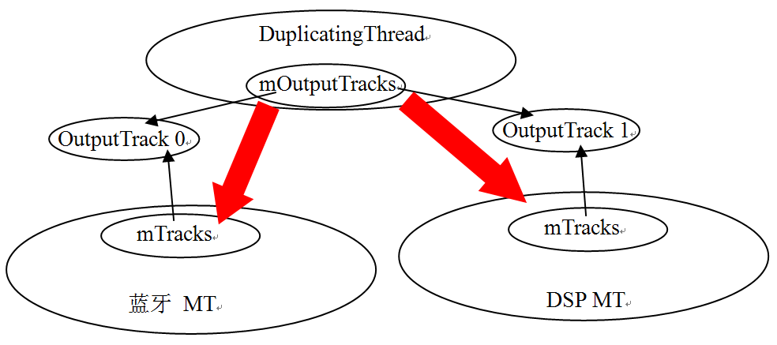 

图7-16  openDuplicateOutput的结果示意图

图7-16说明（以蓝牙MT为例）：

·  蓝牙MT的Track中有一个成员为OutputTrack0。

·  DT的mOutputTracks也有一个成员指向OutputTrack0。这就好像DT是MT的客户端一样，它和前面分析的AT是AF的客户端类似。

·  红色部分代表数据传递用的缓冲。
<h4>3. DT的客户端AT</h4>
DT是从MT中派生的，根据AP和AT的交互流程，当AT创建的流类型对应策略为SONIFACATION时，它会从AP中得到代表DT的线程索引号。由于DT没有重载createTrack_l，所以这个过程也会创建一个Track对象（和MT创建Track对象一样）。此时的结果，将导致图7-16变成图7-17。

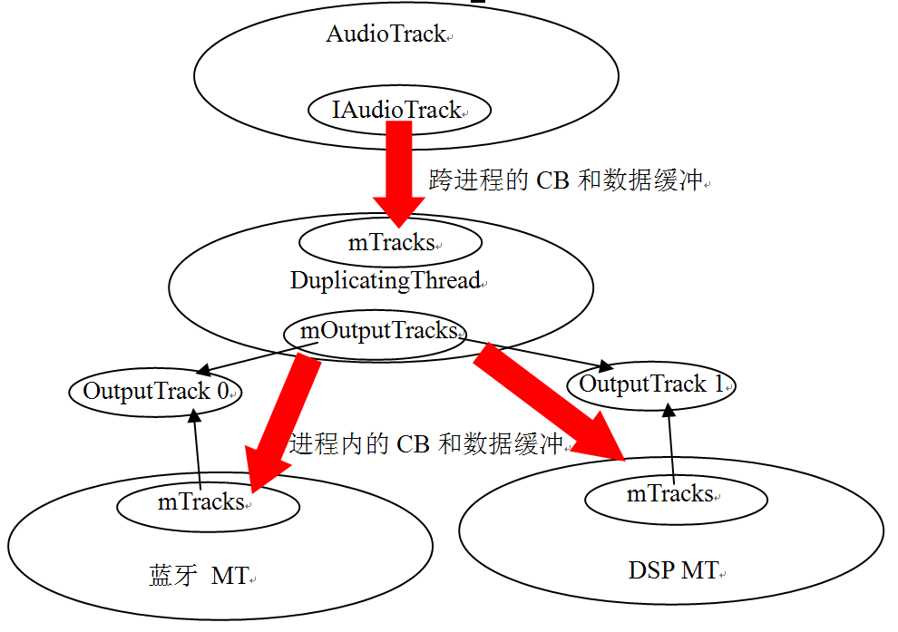 

图7-17  有AT的DT全景图

图7-17把DT的工作方式表达得非常清晰了。一个DT配合两个OutputTrack中的进程内缓冲，把来自AT的数据原封不动地发给蓝牙MT和DSP MT，这简直就是个数据中继器！。不过俗话说得好，道理虽简单，实现却复杂。来看DT是如何完成这一复杂而艰巨的任务的吧。
<h4>4. DT的线程函数</h4>
DT的线程函数代码如下所示：

[--&gt;AudioFlinger.cpp]

boolAudioFlinger::DuplicatingThread::threadLoop()

{

   int16_t* curBuf = mMixBuffer;

   Vector&lt; sp&lt;Track&gt; &gt; tracksToRemove;

   uint32_t mixerStatus = MIXER_IDLE;

   nsecs_t standbyTime = systemTime();

    size_tmixBufferSize = mFrameCount*mFrameSize;

   SortedVector&lt; sp&lt;OutputTrack&gt; &gt; outputTracks;

    while(!exitPending())

    {

       processConfigEvents();

 

       mixerStatus = MIXER_IDLE;

        { 

              ......

           //处理配置请求，和MT处理一样

           const SortedVector&lt; wp&lt;Track&gt; &gt;&amp; activeTracks =mActiveTracks;

 

           for (size_t i = 0; i &lt; mOutputTracks.size(); i++) {

               outputTracks.add(mOutputTracks[i]);

           }

         //如果AT的Track停止了，则需要停止和MT共享的OutputTrack

        ifUNLIKELY((!activeTracks.size() &amp;&amp; systemTime() &gt; standbyTime) 

               || mSuspended) {

               if (!mStandby) {

                    for (size_t i = 0; i &lt;outputTracks.size(); i++) {

                       outputTracks[i]-&gt;stop();

                    }

                   mStandby = true;

                    mBytesWritten = 0;

               }

             ......

           //DT从MT派生，天然具有混音的功能，所以这部分功能和MT一致

           mixerStatus = prepareTracks_l(activeTracks, &amp;tracksToRemove);

        }

 

        if(LIKELY(mixerStatus == MIXER_TRACKS_READY)) {

            //outputsReady将检查OutputTracks对应的MT状态

           if (outputsReady(outputTracks)) {

               mAudioMixer-&gt;process(curBuf);//使用AudioMixer对象混音

           } else {

               memset(curBuf, 0, mixBufferSize);

           }

           sleepTime = 0;

           writeFrames = mFrameCount;

        } 

              ......

           if (sleepTime == 0) {

               standbyTime = systemTime() +kStandbyTimeInNsecs;

           for (size_t i = 0; i &lt; outputTracks.size(); i++) {

               //将混音后的数据写到outputTrack中

               outputTracks[i]-&gt;write(curBuf, writeFrames);

           }

           mStandby = false;

           mBytesWritten += mixBufferSize;

        }else {

           usleep(sleepTime);

        }

       tracksToRemove.clear();

       outputTracks.clear();

    }

 

    returnfalse;

}

现在，来自远端进程AT的数据已得到了混音，这一份混音后的数据还将通过调用OutputTrack的write完成DT到其他两个MT的传输。注意，这里除了AT使用的Track外，还有DT和两个MT共享的OutputTrack。AT调用的start，将导致DT的Track加入到活跃数组中，但另外两个OutputTrack还没调用start。这些操作又是在哪里做的呢？来看write函数：

[--&gt;AudioFlinger.cpp]

boolAudioFlinger::PlaybackThread::OutputTrack::write(int16_t* data, 

                                                                uint32_t frames)

{

   //注意，此处的OutputTrack是DT和MT共享的

    Buffer *pInBuffer;

    BufferinBuffer;

   uint32_t channels = mCblk-&gt;channels;

    booloutputBufferFull = false;

   inBuffer.frameCount = frames;

   inBuffer.i16 = data;

 

   uint32_t waitTimeLeftMs = mSourceThread-&gt;waitTimeMs();

 

  if(!mActive &amp;&amp; frames != 0) {

      //如果此Track没有活跃，则调用start激活

       start();

        ......

    }

     /*

       现在，AF中的数据传递有三个线程：一个DT，两个MT。MT作为DT的二级消费者，

       可能由于某种原因来不及消费数据，所以DT中提供了一个缓冲队列mBufferQueue，

       把MT来不及消费的数据保存在这个缓冲队列中。注意这个缓冲队列容纳的临时缓冲

       个数是有限制的，其限制值由kMaxOverFlowBuffers控制，初始化为10个

   */

    while(waitTimeLeftMs) {

        //先消耗保存在缓冲队列的数据

        if(mBufferQueue.size()) {

           pInBuffer = mBufferQueue.itemAt(0);

        }else {

           pInBuffer = &amp;inBuffer;

        }

        ......

       //获取可写缓冲，下面这句代码是否和AT中对应的代码很相似？

       if(obtainBuffer(&amp;mOutBuffer, waitTimeLeftMs) ==

                              (status_t)AudioTrack::NO_MORE_BUFFERS){

              ......

               break;

         }

      

        uint32_toutFrames = pInBuffer-&gt;frameCount &gt; mOutBuffer.frameCount ?

                                     mOutBuffer.frameCount: pInBuffer-&gt;frameCount;

        //将数据拷贝到DT和MT共享的那块缓冲中去

       memcpy(mOutBuffer.raw, pInBuffer-&gt;raw, 

                outFrames * channels * sizeof(int16_t));

        //更新写位置

       mCblk-&gt;stepUser(outFrames);

        pInBuffer-&gt;frameCount-= outFrames;

       pInBuffer-&gt;i16 += outFrames * channels;

       mOutBuffer.frameCount -= outFrames;

       mOutBuffer.i16 += outFrames * channels;

        ......

     }//while 结束

  

       if(inBuffer.frameCount) {

       sp&lt;ThreadBase&gt; thread = mThread.promote();

        if(thread != 0 &amp;&amp; !thread-&gt;standby()) {

           if (mBufferQueue.size() &lt; kMaxOverFlowBuffers) {

               pInBuffer = new Buffer;

               pInBuffer-&gt;mBuffer = new int16_t[inBuffer.frameCount * channels];

               pInBuffer-&gt;frameCount = inBuffer.frameCount;

               pInBuffer-&gt;i16 = pInBuffer-&gt;mBuffer;

              //拷贝旧数据到新的临时缓冲

               memcpy(pInBuffer-&gt;raw, inBuffer.raw, 

                        inBuffer.frameCount *channels * sizeof(int16_t));

              //保存这个临时缓冲

               mBufferQueue.add(pInBuffer);

          } 

        }

}

    //如果数据全部写完

        if(pInBuffer-&gt;frameCount == 0) {

            if (mBufferQueue.size()) {

               mBufferQueue.removeAt(0);

               delete [] pInBuffer-&gt;mBuffer;

               delete pInBuffer;//释放缓冲队列对应的数据缓冲

          } else {

               break;

           }

        }

}

   ......

    return outputBufferFull;

}

数据就这样从AT通过DT的帮助，传输到蓝牙的MT和DSP的MT中了。这种方式继数据传输比直接使用MT传输要缓慢。

到这里，对DT的讲解就告一段落了。本人觉得，DT的实现是AF代码中最美妙的地方，多学习这些优秀代码，有助于提高学习者的水平。

说明：DT还有别的一些细节本书中没有涉及，读者可以结合自己的情况进行分析和理解。

 
<h3>7.5.2 题外话</h3>
下面，说一点题外话，希望借此和读者一起探讨交流，共同进步。开源世界，开放平台，关键就是能做到兼容并包。 
<h4>1. CTS和单元测试</h4>
了解一点驱动开发的人可能都会知道，芯片的类型太多了，操作起来也不一样。这必然导致，一个东西就得写一套代码，非常繁琐，并可能反复创造低价值。

做为一个应用层开发者，我非常不希望的是，下层驱动的变动影响上层的应用（在工作中经常发现问题像病毒一样随意扩散）。当然，Android已经提供了HAL层，任何硬件厂商都需要实现这些接口。硬件厂商的这些代码是需要编译成程序来进行验证的，可我不想拿应用层程序来做测试程序。因为应用层程序有自己的复杂逻辑，可能触发一个声音的bug，需要满足很多预期的条件，否则会非常影响HAL的测试。有没有办法解决这一问题呢？像Google这样的公司，面临着很多硬件厂商，它又是怎么解决的呢？

我从CTS上看到了希望。CTS是Google为Android搞的一个兼容性测试，即不管是怎么实现硬件驱动的，反正得通过我的CTS测试。当然，CTS并不是用来测试硬件的，但是它的这种思想可以参考和借鉴。

我很羡慕iOS的应用开发者，他们面临的由于硬件变化导致的问题要少得多。

其实，如果做驱动移植的同仁们能以测试驱动开发的态度来严格测试，可能我们这些上层开发人员就不会总怀疑是驱动的问题了。
<h4>2. ALSA——Advanced Linux Sound Architecture</h4>
ALSA是什么，大伙儿可以网上google之。现在在大力推广ALSA，但在Android这块，我个人感觉它还不是很好用。“不好用”，是从上层用户的角度说的，ALSA提供了一个用户空间的libasound库，而这个库的确比较难用。不过有了Audio HAL的帮助，应用层就不用做改动了，但是实现HAL层的厂商要做的改动就比较大了。相比较而言，我觉得现在的源码中使用的open/ioctl方法更为方便。

说明：这可能和我做过的应用太简单有一定关系（就是ffmpeg编解码MP3，然后播出来即可）。而libasound提供的API较多，在权衡各种情况后，我觉得它不适合快速简单应用的开发。 

<h4>3. Desktop Check</h4>
Desktop Check虽然是一种行为，但我更觉得它的产生是基于了一种态度。DesktopCheck本意是桌面检查。起因是在计算机技术刚兴起时，程序员调试代码非常费劲，因为那时机器配置很差，调试工具也不像现在这么发达，有时要跑到机房，预约机器然后启动调试器，所需时间远远多于坐在电脑前修改一个bug的时间。对于这种情况怎么办？为什么不像考试那样对自己的代码多检查几遍呢？自己虚拟一些应用场景，结合参数代入程序，在大脑中Trace岂不更好？这正是DesktopCheck行为的本意。

今天，很多开发人员不厌其烦得添加log，然后运行看输出。当然，这是解决问题的一种比较好的办法，但是在时间充裕的情况下，我还是希望开发人员能像我们前辈那样，用Desktop Check的这种方式先反复阅读和检查程序，争取在大脑中模拟程序的运行，最后才用打印log的方法来验证自己的想法。

另外，Desktop check对提升阅读代码的能力有重要帮助。

说明：已记不得第一次接触Desktop Check一词是什么时候了，或许当时还不叫Desktop Check，但我觉得它所蕴含的思想是正确的，是颇有价值的。

<h2><a>7.6</a>  本章小结</h2>
Audio是本书碰到的第一个复杂系统，这个系统整体示意图如图7-18所示：      

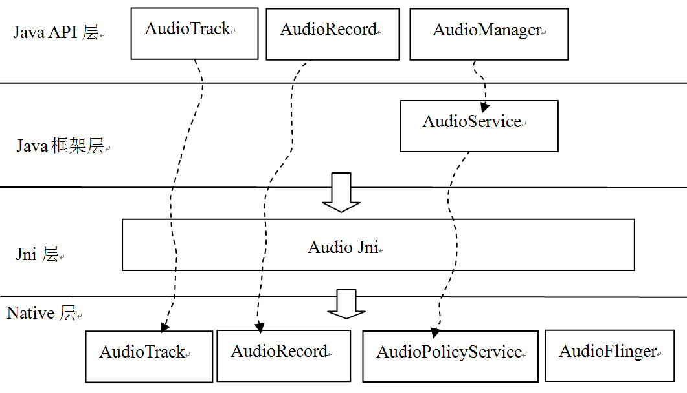 

图7-18  Audio系统大家族

从图7-18中可以看出：

·  音频数据的输入输出不论是Java层和Native层，都是通过AudioTrack和AudioRecord类完成的。事实上，Audio系统提供的I/O接口就是AudioTrack和AudioRecord类。音频I/O是Audio系统最重要的部分。建议读者反复阅读，加深理解。

·  AudioManager用来做音量调节、audio模式的选择、设备连接控制等。这些都会和Native的AP交互。从我个人博客和其他技术论坛的统计来看，较少有人关注AudioPolicy，毕竟在这一块Android已提供了一个足够好用的AudioPolicyManagerBase类。不过作为Audio系统不可或缺的一部分，AudioPolicy的重要性是不言而喻的。

建议：无论怎么说，数据I/O毕竟是Audio系统中关键之关键，所以请读者一定要仔细阅读，体会其中精妙所在。

Audio系统中还有其他部分（例如AudioRecord、Java层的AudioSystem，AudioService等），本书没有涉及。读者可结合个人需要自行分析。在现有的基础上，要学习，掌握这些内容都不会太难。
 
 
版权声明：本文为博主原创文章，未经博主允许不得转载。
 
 
