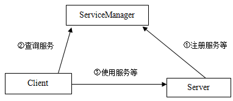
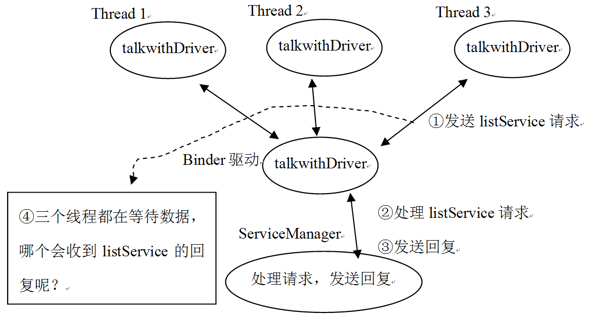

<h1>第6章 深入理解Binder</h1>

本章主要内容

·  以MediaServer为切入点，对Binder的工作机制进行分析。

·  剖析ServiceManager的原理。 

·  以MediaPlayerService为切入点对Client和Service的交互进行分析。

·  学以致用，探讨如何写自己的Service。

本章涉及的源代码文件名及位置

下面是我们本章分析的源码文件名及其位置。

·  Main_mediaserver.cpp

framework/base/Media/MediaServer/Main_mediaserver.cpp

·  Static.cpp

framework/base/libs/binder/Static.cpp

·  ProcessState.cpp

framework/base/libs/binder/ProcessState.cpp

·  IServiceManager.cpp

framework/base/libs/binder/IServiceManager.cpp

·  BpBinder.cpp

framework/base/libs/binder/BpBinder.cpp

·  IInterface.h

framework/base/include/binder/IInterface.h

·  IServiceManager.h

framework/base/include/binder/IServiceManager.h

·  IServiceManager.cpp

framework/base/libs/binder/IServiceManager.cpp

·  binder.cpp

framework/base/libs/binder/binder.cpp

·  MediaPlayerService.cpp

framework/base/media/libmediaplayerservice/MediaPlayerService.cpp

·  IPCThreadState.cpp

framework/base/libs/binder/ IPCThreadState.cpp

·  binder_module.h

framework/base/include/private/binder.h

·  Service_manager.c

framework/base/cmds/ServiceManager/Service_manager.c

·  Binder.c

framework/base/cmds/ServiceManager/Binder.c

·   IMediaDeathNotifier

framework/base/media/libmedia/ IMediaDeathNotifier.cpp

·  MediaMetadataRetriever

framework/base/media/libmedia/ MediaMetadataRetriever.cpp

<h2>6.1  概述</h2>

Binder是Android系统提供的一种IPC（进程间通信）机制。由于Android是基于Linux内核的，因此，除了Binder外，还存在其他的IPC机制，例如管道和socket等。Binder相对于其他IPC机制来说，就更加灵活和方便了。对于初学Android的朋友而言，最难却又最想掌握的恐怕就是Binder机制了，因为Android系统基本上可以看作是一个基于Binder通信的C/S架构。Binder就像网络一样，把系统各个部分连接在了一起，因此它是非常重要的。

在基于Binder通信的C/S架构体系中，除了C/S架构所包括的Client端和Server端外，Android还有一个全局的ServiceManager端，它的作用是管理系统中的各种服务（Service）。Client、Server和ServiceManager这三者之间的交互关系，如图6-1所示 ：

图6-1 Client、Server和ServiceManager三者之间的交互关系

    
注意：一个Server进程可以注册多个Service，就像即将讲解的MediaServer一样。

根据图6-1，可以得出如下结论：

·  Server进程要先注册一些Service到ServiceManager中，所以Server是ServiceManager的客户端，而ServiceManager就是服务端了。

·  如果某个Client进程要使用某个Service，必须先到ServiceManager中获取该Service的相关信息，所以Client是ServiceManager的客户端。

·  Client根据得到的Service信息建立与Service所在的Server进程通信的通路，然后就可以直接与Service交互了，所以Client也是Server的客户端。

·  最重要的一点是，三者的交互都是基于Binder通信的，所以通过任意两者之间的关系，都可以揭示Binder的奥秘。

这里，要重点强调的是Binder通信与C/S架构之间的关系。Binder只是为C/S架构提供了一种通信的方式，我们完全可以采用其他IPC方式进行通信，例如，系统中有很多其他的程序采用的就是Socket或Pipe的方法进行进程间通信。很多初学者可能觉得Binder较复杂，尤其是看到诸如BpXXX、BnXXX之类的定义便感到头晕，这很有可能是把Binder通信层结构和应用的业务层结构搞混了。如果能搞清楚这二者的关系，完全可以自己实现一个不使用BpXXX和BnXXX的Service。须知，ServiceManager可并没有使用它们。

<h2>6.2  庖丁解MediaServer</h2>

为了能像“庖丁”那样解析Binder，我们必须得找一头“牛”来做解剖，而MediaServer（简称MS）正是一头比较好的“牛”。它是一个可执行程序，虽然Android的SDK提供Java层的API，但Android系统本身还是一个完整的基于Linux内核的操作系统，所以不会是所有程序都用Java编写，这里的MS就是一个用C++编写的可执行程序。

之所以选择MediaServer作为切入点，是因为这个Server是系统诸多重要Service的栖息地，它们包括：

·  AudioFlinger：音频系统中的重要核心服务。

·  AudioPolicyService：音频系统中关于音频策略的重要服务。

·  MediaPlayerService：多媒体系统中的重要服务。

·  CameraService：有关摄像/照相的重要服务。

可以看到，MS除了不涉及Surface系统外，其他重要的服务基本上都涉及到了，它不愧是“庖丁”所要的好“牛”。

本章将以其中的MediaPlayerService为主切入点进行分析。先来分析MediaServer本身。

<h3>6.2.1  MediaServer的入口函数</h3>

MS是一个可执行程序，入口函数是main，代码如下所示：

[--&gt;Main_MediaServer.cpp]

    
int main(int argc, char** argv)

    
{

    
  //①获得一个ProcessState实例

    
 sp&lt;ProcessState&gt;proc(ProcessState::self());

    
 

    
 //②MS作为ServiceManager的客户端，需要向ServiceManger注册服务

    
 //调用defaultServiceManager，得到一个IServiceManager。

    
 sp&lt;IServiceManager&gt;sm = defaultServiceManager();

    
 

    
 //初始化音频系统的AudioFlinger服务

    
 AudioFlinger::instantiate();

    
 //③多媒体系统的MediaPlayer服务，我们将以它作为主切入点

    
 MediaPlayerService::instantiate();

    
 //CameraService服务

    
 CameraService::instantiate();

    
 //音频系统的AudioPolicy服务

    
 AudioPolicyService::instantiate();

    
 

    
 //④根据名称来推断，难道是要创建一个线程池吗？

    
 ProcessState::self()-&gt;startThreadPool();

    
 //⑤下面的操作是要将自己加入到刚才的线程池中吗？

    
 IPCThreadState::self()-&gt;joinThreadPool();

    
}

上面的代码中，确定了5个关键点，让我们通过对这5个关键点逐一进行深入分析，来认识和理解Binder。

<h3>6.2.2  独一无二的ProcessState</h3>

我们在main函数的开始处便碰见了ProcessState。由于每个进程只有一个ProcessState，所以它是独一无二的。它的调用方式如下面的代码所示：

[--&gt;Main_MediaServer.cpp]

    
//①获得一个ProcessState实例

    
sp&lt;ProcessState&gt; proc(ProcessState::self());

下面，来进一步分析这个独一无二的ProcessState。

<h4>1. 单例的ProcessState</h4>

ProcessState的代码如下所示：

[--&gt;ProcessState.cpp]

    
sp&lt;ProcessState&gt; ProcessState::self()

    
{

    
   //gProcess是在Static.cpp中定义的一个全局变量

    
   //程序刚开始执行，gProcess一定为空

    
    if(gProcess != NULL) return gProcess; 

    
        AutoMutex_l(gProcessMutex); 

    
     //创建一个ProcessState对象，并赋值给gProcess

    
    if(gProcess == NULL) gProcess = new ProcessState; 

    
 

    
     returngProcess; 

    
}

self函数采用了单例模式，这很明确地告诉了我们一个信息：每个进程只有一个ProcessState对象。这一点，从它的命名中也可看出些端倪。

<h4>2. ProcessState的构造</h4>

再来看ProcessState的构造函数。这个函数非常重要，它悄悄地打开了Binder设备。代码如下所示：

[--&gt;ProcessState.cpp]

    
ProcessState::ProcessState()

    
   // Android的中有很多代码都是这么写的,稍不留神就容易忽略这里调用了一个很重要的函数

    
    :mDriverFD(open_driver())

    
    ,mVMStart(MAP_FAILED)//映射内存的起始地址

    
    ,mManagesContexts(false)

    
    ,mBinderContextCheckFunc(NULL)

    
    , mBinderContextUserData(NULL)

    
    ,mThreadPoolStarted(false)

    
    ,mThreadPoolSeq(1)

    
{

    
  if(mDriverFD &gt;= 0) {

    
  /*

    
BIDNER_VM_SIZE定义为(1*1024*1024) - (4096 *2) = 1M-8K

    
   mmap的用法希望读者man一下，不过这个函数真正的实现和驱动有关系，而Binder驱动会分配一块

    
内存用来接收数据。

    
*/

    
  mVMStart = mmap(0, BINDER_VM_SIZE, PROT_READ,MAP_PRIVATE | MAP_NORESERVE,

    
                     mDriverFD, 0); 

    
    }

    
    ......

    
}

<h4>3. 打开binder设备</h4>

open_driver的作用就是打开/dev/binder这个设备，它是android在内核中专门用于完成进程间通信而设置的一个虚拟设备，具体实现如下所示：

[--&gt;ProcessState.cpp]

    
static int open_driver()

    
{

    
    int fd =open("/dev/binder", O_RDWR);//打开/dev/binder设备

    
    if (fd&gt;= 0) {

    
         ......

    
       size_t maxThreads = 15;

    
       //通过ioctl方式告诉binder驱动，这个fd支持的最大线程数是15个

    
       result = ioctl(fd, BINDER_SET_MAX_THREADS, &amp;maxThreads);   

    
   } 

    
return fd;

    
......

    
}

至此，Process::self函数就分析完了。它到底干了什么呢？通过前面的分析，总结如下：

·  打开/dev/binder设备，这就相当于与内核的Binder驱动有了交互的通道。

·  对返回的fd使用mmap，这样Binder驱动就会分配一块内存来接收数据。

·  由于ProcessState的惟一性，因此一个进程只打开设备一次。

分析完ProcessState，接下来将要分析第二个关键函数defaultServiceManager。

<h3>6.2.3  时空穿越魔术——defaultServiceManager</h3>

defaultServiceManager函数的实现在IServiceManager.cpp中完成。它会返回一个IServiceManager对象，通过这个对象，我们可以神奇地与另一个进程ServiceManager进行交互。是不是有一种观看时空穿越魔术表演的感觉？

<h4>1. 魔术前的准备工作</h4>

先来看看defaultServiceManager都调用了哪些函数？返回的这个IServiceManager到底是什么？具体实现代码如下所示：

[--&gt;IServiceManager.cpp]

    
sp&lt;IServiceManager&gt; defaultServiceManager()

    
{

    
    //看样子又是一个单例，英文名叫 Singleton，Android是一个优秀的源码库，大量使用了

    
   //设计模式，建议读者以此为契机学习设计模式，首推GOF的《设计模式：可复用面向对象软件的基础》

    
    if(gDefaultServiceManager != NULL) return gDefaultServiceManager;

    
     {

    
       AutoMutex _l(gDefaultServiceManagerLock);

    
        if(gDefaultServiceManager == NULL) {

    
          //真正的gDefaultServiceManager是在这里创建的。

    
           gDefaultServiceManager = interface_cast&lt;IServiceManager&gt;(

    
                                   ProcessState::self()-&gt;getContextObject(NULL));

    
        }

    
    }

    
   returngDefaultServiceManager;

    
}

哦，是调用了ProcessState的getContextObject函数！注意：传给它的参数是NULL，即0。既然是“庖丁解牛”，就还要一层一层往下切。下面再看getContextObject函数，如下所示：

[--&gt;ProcessState.cpp]

    
sp&lt;IBinder&gt;ProcessState::getContextObject(const sp&lt;IBinder&gt;&amp; caller)

    
{

    
   /*

    
caller的值为0！注意，该函数返回的是IBinder。它是什么？我们后面再说。

    
    supportsProcesses函数根据openDriver函数打开设备是否成功来判断是否支持process

    
真实设备肯定支持process。

    
   */

    
  if(supportsProcesses()) {

    
   //真实设备上肯定是支持进程的，所以会调用下面这个函数

    
       return getStrongProxyForHandle(0);

    
    } else {

    
       return getContextObject(String16("default"), caller);

    
    }

    
}

getStrongProxyForHandle这个函数名怪怪的，可能会让人感到些许困惑。请注意，它的调用参数的名字叫handle，Windows编程中经常使用这个名称，它是对资源的一种标识。说白了，其实就是有一个资源项，保存在一个资源数组（也可以是别的组织结构）中，handle的值正是该资源项在数组中的索引。

[--&gt;ProcessState.cpp]

    
sp&lt;IBinder&gt;ProcessState::getStrongProxyForHandle(int32_t handle)

    
{

    
   sp&lt;IBinder&gt; result;

    
 AutoMutex_l(mLock);

    
/*

    
根据索引查找对应资源。如果lookupHandleLocked发现没有对应的资源项，则会创建一个新的项并返回。

    
这个新项的内容需要填充。

    
    */

    
   handle_entry* e = lookupHandleLocked(handle);

    
    if (e !=NULL) {

    
       IBinder* b = e-&gt;binder;

    
        if (b== NULL || !e-&gt;refs-&gt;attemptIncWeak(this)) {

    
           //对于新创建的资源项，它的binder为空，所以走这个分支。注意，handle的值为0

    
            b= new BpBinder(handle); //创建一个BpBinder

    
           e-&gt;binder = b; //填充entry的内容

    
           if (b) e-&gt;refs = b-&gt;getWeakRefs();

    
           result = b;

    
        }else {

    
           result.force_set(b);

    
           e-&gt;refs-&gt;decWeak(this);

    
        }

    
    }

    
    returnresult; //返回BpBinder(handle)，注意，handle的值为0

    
}

<h4>2. 魔术表演的道具——BpBinder</h4>

众所周知，玩魔术是必须有道具的。这个穿越魔术的道具就是BpBinder。BpBinder是什么呢？有必要先来介绍它的孪生兄弟BBinder。

BpBinder和BBinder都是Android中与Binder通信相关的代表，它们都从IBinder类中派生而来，如图6-2所示：

图6-2 Binder家族图谱

从上图中可以看出：

·  BpBinder是客户端用来与Server交互的代理类，p即Proxy的意思。

·  BBinder则是proxy相对的一端，它是proxy交互的目的端。如果说Proxy代表客户端，那么BBinder则代表服务端。这里的BpBinder和BBinder是一一对应的，即某个BpBinder只能和对应的BBinder交互。我们当然不希望通过BpBinderA发送的请求，却由BBinderB来处理。

刚才我们在defaultServiceManager()函数中创建了这个BpBinder。这里有两个问题：

·  为什么创建的不是BBinder？

因为我们是ServiceManager的客户端，当然得使用代理端以与ServiceManager交互了。

·  前面说了，BpBinder和BBinder是一一对应的，那么BpBinder如何标识它所对应的BBinder端呢？

答案是Binder系统通过handler来对应BBinder。以后我们会确认这个Handle值的作用。

    
注意：我们给BpBinder构造函数传的参数handle的值是0。这个0在整个Binder系统中有重要含义—因为0代表的就是ServiceManager所对应的BBinder。

BpBinder是如此重要，必须对它进行深入分析，其代码如下所示:

[--&gt;BpBinder.cpp]

    
BpBinder::BpBinder(int32_t handle)

    
    :mHandle(handle)//handle是0

    
    ,mAlive(1)

    
    ,mObitsSent(0)

    
    ,mObituaries(NULL)

    
{

    
   extendObjectLifetime(OBJECT_LIFETIME_WEAK);

    
   //另一个重要对象是IPCThreadState，我们稍后会详细讲解。

    
   IPCThreadState::self()-&gt;incWeakHandle(handle);

    
}

看上面的代码，会觉得BpBinder确实简单，不过再仔细查看，你或许会发现，BpBinder、BBinder这两个类没有任何地方操作ProcessState打开的那个/dev/binder设备，换言之，这两个Binder类没有和binder设备直接交互。那为什么说BpBinder会与通信相关呢？注意本小节的标题，BpBinder只是道具嘛！所以它后面一定还另有机关。不必急着揭秘，还是先回顾一下道具出场的历程。

我们是从下面这个函数开始分析的：

    
gDefaultServiceManager =interface_cast&lt;IServiceManager&gt;(

    
                                           ProcessState::self()-&gt;getContextObject(NULL));

现在这个函数调用将变成如下所示：

    
gDefaultServiceManager =interface_cast&lt;IServiceManager&gt;(new BpBinder(0));

这里出现了一个interface_cast。它是什么？其实是一个障眼法！下面就来具体分析它。

<h4>3. 障眼法——interface_cast</h4>

interface_cast、dynamic_cast和static_cast看起来是否非常眼熟？它们是指针类型转换的意思吗？如果是，那又是如何将BpBinder*类型强制转化成IServiceManager*类型的？BpBinder的家谱我们刚才也看了，它的“爸爸的爸爸的爸爸”这条线上没有任何一个与IServiceManager有任何关系。

问题谈到这里，我们得去看看interface_cast的具体实现，其代码如下所示：

[--&gt;IInterface.h]

    
template&lt;typename INTERFACE&gt;

    
inline sp&lt;INTERFACE&gt; interface_cast(constsp&lt;IBinder&gt;&amp; obj)

    
{

    
    returnINTERFACE::asInterface(obj);

    
}

哦，仅仅是一个模板函数，所以interface_cast&lt;IServiceManager&gt;()等价于：

    
inline sp&lt;IServiceManager&gt;interface_cast(const sp&lt;IBinder&gt;&amp; obj)

    
{

    
    return IServiceManager::asInterface(obj);

    
}

又转移到IServiceManager对象中去了，这难道不是障眼法吗？既然找到了“真身”，不妨就来见识见识它吧。

<h4>4. 拨开浮云见月明——IServiceManager</h4>

刚才提到，IBinder家族的BpBinder和BBinder是与通信业务相关的，那么业务层的逻辑又是如何巧妙地架构在Binder机制上的呢？关于这些问题，可以用一个绝好的例子来解释，它就是IServiceManager。

<h5>（1）定义业务逻辑</h5>

先回答第一个问题：如何表述应用的业务层逻辑。可以先分析一下IServiceManager是怎么做的。IServiceManager定义了ServiceManager所提供的服务，看它的定义可知，其中有很多有趣的内容。IServiceManager定义在IServiceManager.h中，代码如下所示：

[--&gt;IServiceManager.h]

    
class IServiceManager : public IInterface

    
{

    
 public:

    
   //关键无比的宏！

    
   DECLARE_META_INTERFACE(ServiceManager);

    
 

    
    //下面是ServiceManager所提供的业务函数

    
    virtualsp&lt;IBinder&gt;    getService( constString16&amp; name) const = 0;

    
    virtualsp&lt;IBinder&gt;    checkService( constString16&amp; name) const = 0;

    
    virtualstatus_t        addService( const String16&amp; name,

    
                                               const sp&lt;IBinder&gt;&amp;service) = 0;

    
    virtual Vector&lt;String16&gt;    listServices() = 0;

    
    ......

    
};

<h5>（2）业务与通信的挂钩</h5>

Android巧妙地通过DECLARE_META_INTERFACE和IMPLENT宏，将业务和通信牢牢地钩在了一起。DECLARE_META_INTERFACE和IMPLEMENT_META_INTERFACE这两个宏都定义在刚才的IInterface.h中。先看DECLARE_META_INTERFACE这个宏，如下所示：

[--&gt;IInterface.h::DECLARE_META_INTERFACE]

    
#define DECLARE_META_INTERFACE(INTERFACE)                               \

    
    staticconst android::String16 descriptor;                          \

    
    staticandroid::sp&lt;I##INTERFACE&gt; asInterface(                       \

    
           const android::sp&lt;android::IBinder&gt;&amp; obj);                  \

    
    virtualconst android::String16&amp; getInterfaceDescriptor() const;    \

    
   I##INTERFACE();                                                    \

    
    virtual~I##INTERFACE();     

将IServiceManager的DELCARE宏进行相应的替换后得到的代码如下所示：

[---&gt;DECLARE_META_INTERFACE(IServiceManager)]

    
//定义一个描述字符串

    
static const android::String16 descriptor;

    
  

    
//定义一个asInterface函数

    
static android::sp&lt; IServiceManager &gt; 

    
asInterface(constandroid::sp&lt;android::IBinder&gt;&amp; obj) 

    
 

    
//定义一个getInterfaceDescriptor函数，估计就是返回descriptor字符串

    
virtual const android::String16&amp;getInterfaceDescriptor() const; 

    
 

    
//定义IServiceManager的构造函数和析构函数

    
IServiceManager ();                                                   

    
virtual ~IServiceManager();

DECLARE宏声明了一些函数和一个变量，那么，IMPLEMENT宏的作用肯定就是定义它们了。IMPLEMENT的定义在IInterface.h中，IServiceManager是如何使用了这个宏呢？只有一行代码，在IServiceManager.cpp中，如下所示：

    
IMPLEMENT_META_INTERFACE(ServiceManager,"android.os.IServiceManager");

很简单，可直接将IServiceManager中的IMPLEMENT宏的定义展开，如下所示：

    
const android::String16

    
IServiceManager::descriptor(“android.os.IServiceManager”);

    
//实现getInterfaceDescriptor函数

    
const android::String16&amp; IServiceManager::getInterfaceDescriptor()const

    
 {  

    
    //返回字符串descriptor，值是“android.os.IServiceManager” 

    
      return IServiceManager::descriptor;

    
  }     

    
//实现asInterface函数

    
 android::sp&lt;IServiceManager&gt; 

    
             IServiceManager::asInterface(constandroid::sp&lt;android::IBinder&gt;&amp; obj)

    
{ 

    
       android::sp&lt;IServiceManager&gt; intr;

    
        if(obj != NULL) {                                              

    
           intr = static_cast&lt;IServiceManager *&gt;(                          

    
               obj-&gt;queryLocalInterface(IServiceManager::descriptor).get());   

    
           if (intr == NULL) { 

    
             //obj是我们刚才创建的那个BpBinder(0) 

    
               intr = new BpServiceManager(obj); 

    
            }

    
        } 

    
       return intr; 

    
} 

    
//实现构造函数和析构函数 

    
IServiceManager::IServiceManager () { } 

    
IServiceManager::~ IServiceManager() { }

我们曾提出过疑问：interface_cast是如何把BpBinder指针转换成一个IServiceManager指针的呢？答案就在asInterface函数的一行代码中，如下所示：

    
intr = new BpServiceManager(obj);

明白了！interface_cast不是指针的转换，而是利用BpBinder对象作为参数新建了一个BpServiceManager对象。我们已经知道BpBinder和BBinder与通信有关系，这里怎么突然冒出来一个BpServiceManager？它们之间又有什么关系呢？

<h5>（3）IServiceManager家族</h5>

要搞清这个问题，必须先了解IServiceManager家族之间的关系，先来看图6-3，它展示了IServiceManager的家族图谱。

图6-3 IServiceManager的家族图谱

根据图6-3和相关的代码可知，这里有以下几个重要的点值得注意：

·  IServiceManager、BpServiceManager和BnServiceManager都与业务逻辑相关。

·  BnServiceManager同时从BBinder派生，表示它可以直接参与Binder通信。

·  BpServiceManager虽然从BpInterface中派生，但是这条分支似乎与BpBinder没有关系。

·  BnServiceManager是一个虚类，它的业务函数最终需要子类来实现。

    
重要说明：以上这些关系很复杂，但ServiceManager并没有使用错综复杂的派生关系，它直接打开Binder设备并与之交互。后文，还会详细分析它的实现代码。

图6-3中的BpServiceManager，既然不像它的兄弟BnServiceManager那样直接与Binder有血缘关系，那么它又是如何与Binder交互的呢？简言之，BpRefBase中的mRemote的值就是BpBinder。如果你不相信，仔细看BpServiceManager左边的派生分支树上的一系列代码，它们都在IServiceManager.cpp中，如下所示：

[--&gt;IServiceManager.cpp::BpServiceManager类]

    
//通过它的参数可得知，impl是IBinder类型，看来与Binder有间接关系,它实际上是BpBinder对象

    
BpServiceManager(const sp&lt;IBinder&gt;&amp; impl)

    
   //调用基类BpInterface的构造函数

    
   : BpInterface&lt;IServiceManager&gt;(impl)

    
{

    
}

BpInterface的实现代码如下所示：

[--&gt;IInterface.h::BpInterface类]

    
template&lt;typename INTERFACE&gt;

    
inlineBpInterface&lt;INTERFACE&gt;::BpInterface(const sp&lt;IBinder&gt;&amp; remote)

    
    :BpRefBase(remote)//基类构造函数

    
{

    
}

BpRefBase()的实现代码如下所示：

[--&gt;Binder.cpp::BpRefBase类]

    
BpRefBase::BpRefBase(const sp&lt;IBinder&gt;&amp;o)

    
  //mRemote最终等于那个new 出来的BpBinder(0)

    
    :mRemote(o.get()), mRefs(NULL), mState(0)

    
{

    
   extendObjectLifetime(OBJECT_LIFETIME_WEAK);

    
 

    
    if(mRemote) {

    
       mRemote-&gt;incStrong(this);          

    
        mRefs= mRemote-&gt;createWeak(this); 

    
    }

    
}

原来，BpServiceManager的一个变量mRemote是指向了BpBinder。至此，我们的魔术表演完了，回想一下defaultServiceManager函数，可以得到以下两个关键对象：

·  有一个BpBinder对象，它的handle值是0。

·  有一个BpServiceManager对象，它的mRemote值是BpBinder。

BpServiceManager对象实现了IServiceManager的业务函数，现在又有BpBinder作为通信的代表，接下来的工作就简单了。下面，要通过分析MediaPlayerService的注册过程，进一步分析业务函数的内部是如何工作的。

<h3>6.2.4  注册MediaPlayerService</h3>
<h4>1. 业务层的工作</h4>

再回到MS的main函数，下一个要分析的是MediaPlayerService，它的代码如下所示：

[--&gt;MediaPlayerService.cpp]

    
void MediaPlayerService::instantiate() {

    
    defaultServiceManager()-&gt;addService(

    
           String16("media.player"), new MediaPlayerService());

    
}

根据前面的分析，defaultServiceManager()实际返回的对象是BpServiceManager，它是IServiceManager的后代，代码如下所示：

[--&gt;IServiceManager.cpp::BpServiceManager的addService()函数]

    
virtual status_t addService(const String16&amp;name, const sp&lt;IBinder&gt;&amp; service)

    
{

    
    //Parcel:就把它当作是一个数据包。

    
    Parceldata, reply;

    
    data.writeInterfaceToken(IServiceManager::getInterfaceDescriptor());

    
    data.writeString16(name);

    
    data.writeStrongBinder(service);

    
    //remote返回的是mRemote，也就是BpBinder对象

    
    status_terr = remote()-&gt;transact(ADD_SERVICE_TRANSACTION, data, &amp;reply);

    
    returnerr == NO_ERROR ? reply.readInt32() : err;

    
}

别急着往下走，应先思考以下两个问题：

·  调用BpServiceManager的addService是不是一个业务层的函数？

·  addService函数中把请求数据打包成data后，传给了BpBinder的transact函数，这是不是把通信的工作交给了BpBinder？

两个问题的答案都是肯定的。至此，业务层的工作原理应该是很清晰了，它的作用就是将请求信息打包后，再交给通信层去处理。

<h4>2. 通信层的工作</h4>

下面分析BpBinder的transact函数。前面说过，在BpBinder中确实找不到任何与Binder设备交互的地方吗？那它是如何参与通信的呢？原来，秘密就在这个transact函数中，它的实现代码如下所示：

[--&gt;BpBinder.cpp]

    
status_t BpBinder::transact(uint32_t code, constParcel&amp; data, Parcel* reply, 

    
                                 uint32_tflags)

    
{

    
    if(mAlive) {

    
     //BpBinder果然是道具，它把transact工作交给了IPCThreadState

    
       status_t status = IPCThreadState::self()-&gt;transact(

    
                           mHandle,code, data, reply, flags);//mHandle也是参数

    
        if(status == DEAD_OBJECT) mAlive = 0;

    
       return status;

    
    }

    
 

    
    returnDEAD_OBJECT;

    
}

这里又遇见了IPCThreadState，之前也见过一次。看来，它确实与Binder通信有关，所以必须对其进行深入分析！

<h5>（1）“劳者一份”的IPCThreadState</h5>

谁是“劳者”？线程，是进程中真正干活的伙计，所以它正是劳者。而“劳者一份”，就是每个伙计一份的意思。IPCThreadState的实现代码在IPCThreadState.cpp中，如下所示：

[--&gt;IPCThreadState.cpp]

    
IPCThreadState* IPCThreadState::self()

    
{

    
    if(gHaveTLS) {//第一次进来为false

    
restart:

    
        constpthread_key_t k = gTLS;

    
 /*

    
   TLS是Thread Local Storage（线程本地存储空间）的简称。

    
   这里只需知晓：这种空间每个线程都有，而且线程间不共享这些空间。

    
   通过pthread_getspecific/pthread_setspecific函数可以获取/设置这些空间中的内容。

    
   从线程本地存储空间中获得保存在其中的IPCThreadState对象。

    
   有调用pthread_getspecific的地方，肯定也有调用pthread_setspecific的地方

    
 */

    
       IPCThreadState* st = (IPCThreadState*)pthread_getspecific(k);

    
        if(st) return st;

    
// new一个对象，构造函数中会调用pthread_setspecific

    
       return new IPCThreadState;

    
    }

    
    

    
    if(gShutdown) return NULL;

    
    pthread_mutex_lock(&amp;gTLSMutex);

    
    if(!gHaveTLS) {

    
        if(pthread_key_create(&amp;gTLS, threadDestructor) != 0) {

    
           pthread_mutex_unlock(&amp;gTLSMutex);

    
           return NULL;

    
        }

    
       gHaveTLS = true;

    
    }

    
  pthread_mutex_unlock(&amp;gTLSMutex);

    
//其实goto没有我们说的那么不好，汇编代码也有很多跳转语句（没办法，太低级的语言了），关键是要用好

    
  goto restart;

    
}

接下来，有必要转向分析它的构造函数IPCThreadState()，如下所示：

[--&gt;IPCThreadState.cpp]

    
IPCThreadState::IPCThreadState()

    
    :mProcess(ProcessState::self()), mMyThreadId(androidGetTid())

    
{

    
  //在构造函数中，把自己设置到线程本地存储中去。

    
   pthread_setspecific(gTLS, this);

    
    clearCaller();

    
   //mIn和mOut是两个Parcel。把它看成是发送和接收命令的缓冲区即可。

    
mIn.setDataCapacity(256);

    
     mOut.setDataCapacity(256);

    
}

每个线程都有一个IPCThreadState，每个IPCThreadState中都有一个mIn、一个mOut，其中mIn是用来接收来自Binder设备的数据的，而mOut则是用来存储发往Binder设备的数据的。

<h5>（2）勤劳的transact</h5>

传输工作是很辛苦的。我们刚才看到BpBinder的transact调用了IPCThreadState的transact函数，这个函数实际完成了与Binder通信的工作，如下面的代码所示：

[--&gt;IPCThreadState.cpp]

    
//注意，handle的值为0，代表了通信的目的端

    
status_t IPCThreadState::transact(int32_t handle,

    
                                  uint32_tcode, const Parcel&amp; data,

    
                                  Parcel* reply, uint32_t flags)

    
{

    
    status_terr = data.errorCheck();

    
  

    
    flags |=TF_ACCEPT_FDS;

    
 

    
    ......

    
/*

    
 注意这里的第一个参数BC_TRANSACTION，它是应用程序向binder设备发送消息的消息码，

    
而binder设备向应用程序回复消息的消息码以BR_开头。消息码的定义在binder_module.h中，

    
 请求消息码和回应消息码的对应关系，需要查看Binder驱动的实现才能将其理清楚，我们这里暂时用不上。

    
*/

    
     err =writeTransactionData(BC_TRANSACTION, flags, handle, code, data, NULL);

    
     ......

    
     err = waitForResponse(reply);

    
     ......

    
    

    
    returnerr;

    
}

多熟悉的流程：先发数据，然后等结果。再简单不过了！不过，我们有必要确认一下handle这个参数到底起了什么作用。先来看writeTransactionData函数，它的实现如下所示：

[--&gt;IPCThreadState.cpp]

    
status_tIPCThreadState::writeTransactionData(int32_t cmd, uint32_t binderFlags,

    
    int32_thandle, uint32_t code, const Parcel&amp; data, status_t* statusBuffer)

    
{

    
   //binder_transaction_data 是和binder设备通信的数据结构。    

    
   binder_transaction_data tr;

    
 

    
   //果然，handle的值传递给了target，用来标识目的端，其中0是ServiceManager的标志。

    
   tr.target.handle= handle;

    
   //code是消息码，用来switch/case的！

    
    tr.code =code;

    
    tr.flags= binderFlags;

    
    

    
    conststatus_t err = data.errorCheck();

    
    if (err== NO_ERROR) {

    
       tr.data_size = data.ipcDataSize();

    
       tr.data.ptr.buffer = data.ipcData();

    
       tr.offsets_size = data.ipcObjectsCount()*sizeof(size_t);

    
       tr.data.ptr.offsets = data.ipcObjects();

    
    } else if(statusBuffer) {

    
       tr.flags |= TF_STATUS_CODE;

    
       *statusBuffer = err;

    
       tr.data_size = sizeof(status_t);

    
       tr.data.ptr.buffer = statusBuffer;

    
       tr.offsets_size = 0;

    
       tr.data.ptr.offsets = NULL;

    
    } else {

    
       return (mLastError = err);

    
    }

    
   //把命令写到mOut中， 而不是直接发出去，可见这个函数有点名不副实。

    
   mOut.writeInt32(cmd);

    
   mOut.write(&amp;tr, sizeof(tr));

    
    returnNO_ERROR;

    
}

现在，已经把addService的请求信息写到mOut中了。接下来再看发送请求和接收回复部分的实现，代码在waitForResponse函数中，如下所示：

[--&gt;IPCThreadState.cpp]

    
status_t IPCThreadState::waitForResponse(Parcel*reply, status_t *acquireResult)

    
{

    
    int32_tcmd;

    
    int32_terr;

    
 

    
while (1) {

    
        //好家伙，talkWithDriver！

    
        if((err=talkWithDriver()) &lt; NO_ERROR) break;

    
        err =mIn.errorCheck();

    
        if(err &lt; NO_ERROR) break;

    
        if(mIn.dataAvail() == 0) continue;

    
        

    
        cmd =mIn.readInt32();

    
       switch(cmd) {

    
        caseBR_TRANSACTION_COMPLETE:

    
           if (!reply &amp;&amp; !acquireResult) goto finish;

    
           break;

    
        ......

    
        default:

    
           err = executeCommand(cmd);//看这个！

    
           if (err != NO_ERROR) goto finish;

    
           break;

    
        }

    
    }

    
 

    
finish:

    
    if (err!= NO_ERROR) {

    
        if(acquireResult) *acquireResult = err;

    
        if(reply) reply-&gt;setError(err);

    
       mLastError = err;

    
    }

    
    

    
    returnerr;

    
}

OK，我们已发送了请求数据，假设马上就收到了回复，后续该怎么处理呢？来看executeCommand函数，如下所示：

[--&gt;IPCThreadState.cpp]

    
status_t IPCThreadState::executeCommand(int32_tcmd)

    
{

    
    BBinder*obj;

    
   RefBase::weakref_type* refs;

    
    status_tresult = NO_ERROR;

    
    

    
    switch(cmd) {

    
    caseBR_ERROR:

    
       result = mIn.readInt32();

    
       break;

    
        ......

    
     caseBR_TRANSACTION:

    
        {

    
           binder_transaction_data tr;

    
           result = mIn.read(&amp;tr, sizeof(tr));

    
           if (result != NO_ERROR) break;

    
            Parcel buffer;

    
           Parcel reply;

    
           if (tr.target.ptr) {

    
           /*

    
             看到了BBinder，想起图6-3了吗？BnServiceXXX从BBinder派生，

    
             这里的b实际上就是实现BnServiceXXX的那个对象，关于它的作用，我们要在6.5节中讲解。

    
            */

    
                sp&lt;BBinder&gt; b((BBinder*)tr.cookie);

    
               const status_t error = b-&gt;transact(tr.code, buffer, &amp;reply, 0);

    
                if (error &lt; NO_ERROR)reply.setError(error);

    
             } else {

    
          /*

    
           the_context_object是IPCThreadState.cpp中定义的一个全局变量，

    
         可通过setTheContextObject函数设置

    
           */

    
               const status_t error = 

    
                             the_context_object-&gt;transact(tr.code,buffer, &amp;reply, 0);

    
               if (error &lt; NO_ERROR) reply.setError(error);

    
         }

    
       break;

    
    ......

    
    caseBR_DEAD_BINDER:

    
        {

    
         /*

    
           收到binder驱动发来的service死掉的消息，看来只有Bp端能收到了，

    
           后面，我们将会对此进行分析。

    
*/

    
           BpBinder *proxy = (BpBinder*)mIn.readInt32();

    
           proxy-&gt;sendObituary();

    
           mOut.writeInt32(BC_DEAD_BINDER_DONE);

    
           mOut.writeInt32((int32_t)proxy);

    
        }break;

    
        ......

    
case BR_SPAWN_LOOPER:

    
  //特别注意，这里将收到来自驱动的指示以创建一个新线程，用于和Binder通信。

    
       mProcess-&gt;spawnPooledThread(false);

    
       break;

    
      default:

    
        result = UNKNOWN_ERROR;

    
       break;

    
    }

    
   ......

    
    if(result != NO_ERROR) {

    
       mLastError = result;

    
    }

    
    returnresult;

    
}

<h5>（3）打破砂锅问到底</h5>

你一定想知道如何和Binder设备交互的吧？是通过write和read函数来发送和接收请求的吗？来看talkwithDriver函数，如下所示：

[--&gt;IPCThreadState.cpp]

    
status_t IPCThreadState::talkWithDriver(booldoReceive)

    
{

    
  // binder_write_read是用来与Binder设备交换数据的结构

    
    binder_write_read bwr;

    
    constbool needRead = mIn.dataPosition() &gt;= mIn.dataSize();

    
    constsize_t outAvail = (!doReceive || needRead) ? mOut.dataSize() : 0;

    
    

    
    //请求命令的填充

    
   bwr.write_size = outAvail;

    
   bwr.write_buffer = (long unsigned int)mOut.data();

    
 

    
  if(doReceive &amp;&amp; needRead) {

    
       //接收数据缓冲区信息的填充。如果以后收到数据，就直接填在mIn中了。

    
       bwr.read_size = mIn.dataCapacity();

    
       bwr.read_buffer = (long unsigned int)mIn.data();

    
    } else {

    
       bwr.read_size = 0;

    
    }

    
    

    
    if((bwr.write_size == 0) &amp;&amp; (bwr.read_size == 0)) return NO_ERROR;

    
    

    
   bwr.write_consumed = 0;

    
   bwr.read_consumed = 0;

    
    status_terr;

    
    do {

    
  #ifdefined(HAVE_ANDROID_OS)

    
        //看来不是read/write调用，而是ioctl方式。

    
        if(ioctl(mProcess-&gt;mDriverFD, BINDER_WRITE_READ, &amp;bwr) &gt;= 0)

    
           err = NO_ERROR;

    
        else

    
           err = -errno;

    
#else

    
        err =INVALID_OPERATION;

    
#endif

    
       }while (err == -EINTR);

    
    

    
     if (err&gt;= NO_ERROR) {

    
        if(bwr.write_consumed &gt; 0) {

    
           if (bwr.write_consumed &lt; (ssize_t)mOut.dataSize())

    
               mOut.remove(0, bwr.write_consumed);

    
           else

    
               mOut.setDataSize(0);

    
        }

    
        if(bwr.read_consumed &gt; 0) {

    
           mIn.setDataSize(bwr.read_consumed);

    
           mIn.setDataPosition(0);

    
        }

    
       return NO_ERROR;

    
    }

    
    returnerr;

    
}

较为深入地分析了MediaPlayerService的注册过程后，下面还剩最后两个函数了，就让我们向它们发起进攻吧！

<h3>6.2.5  秋风扫落叶</h3>

重要的内容都已讲过了，现在就剩下最后两个函数startThreadPool()和joinThreadPool没有分析了。它们就太简单了不是？

<h4>1. 创造劳动力——startThreadPool()</h4>

startThreadPool()的实现，如下面的代码所示：

[--&gt;ProcessState.cpp]

    
//太简单，没什么好说的

    
void ProcessState::startThreadPool()

    
{

    
AutoMutex _l(mLock);

    
//如果要是已经startThreadPool的话，这个函数就没有什么实质作用了

    
    if(!mThreadPoolStarted) { 

    
       mThreadPoolStarted = true;

    
       spawnPooledThread(true); //注意，传进去的参数是true

    
    }

    
}

上面的spawnPooledThread()函数的实现，如下所示：

[--&gt;ProcessState.cpp]

    
void ProcessState::spawnPooledThread(bool isMain)

    
{

    
  //注意，isMain参数是true。

    
    if(mThreadPoolStarted) {

    
       int32_t s = android_atomic_add(1, &amp;mThreadPoolSeq);

    
        char buf[32];

    
       sprintf(buf, "Binder Thread #%d", s);

    
        sp&lt;Thread&gt; t = new PoolThread(isMain);

    
       t-&gt;run(buf);

    
    }

    
}

PoolThread是在IPCThreadState中定义的一个Thread子类，它的实现，如下所示：

[--&gt;IPCThreadState.h::PoolThread类]

    
class PoolThread : public Thread

    
{

    
public:

    
   PoolThread(bool isMain)

    
        :mIsMain(isMain){}

    
   protected:

    
    virtualbool threadLoop()

    
    {

    
       //线程函数如此简单，不过是在这个新线程中又创建了一个IPCThreadState。

    
      // 你还记得它是每个伙计都有一个的吗？

    
        IPCThreadState::self()-&gt;joinThreadPool(mIsMain);

    
        return false;

    
    }

    
   const boolmIsMain;

    
};

 

<h4>2. 万众归一——joinThreadPool</h4>

还需要看看IPCThreadState的joinThreadPool的实现，因为新创建的线程也会调用这个函数，具体代码如下所示：

[--&gt;IPCThreadState.cpp]

    
void IPCThreadState::joinThreadPool(bool isMain)

    
{

    
   //注意，如果isMain为true，我们需要循环处理。把请求信息写到mOut中，待会儿一起发出去

    
   mOut.writeInt32(isMain ? BC_ENTER_LOOPER : BC_REGISTER_LOOPER);

    
    

    
  androidSetThreadSchedulingGroup(mMyThreadId, ANDROID_TGROUP_DEFAULT);

    
        

    
    status_tresult;

    
    do {

    
       int32_t cmd;

    
        

    
        if(mIn.dataPosition() &gt;= mIn.dataSize()) {

    
           size_t numPending = mPendingWeakDerefs.size();

    
           if (numPending &gt; 0) {

    
               for (size_t i = 0; i &lt; numPending; i++) {

    
                   RefBase::weakref_type* refs = mPendingWeakDerefs[i];

    
                    refs-&gt;decWeak(mProcess.get());

    
               }

    
               mPendingWeakDerefs.clear();

    
            }

    
           //处理已经死亡的BBinder对象

    
           numPending = mPendingStrongDerefs.size();

    
           if (numPending &gt; 0) {

    
               for (size_t i = 0; i &lt; numPending; i++) {

    
                   BBinder* obj = mPendingStrongDerefs[i];

    
                   obj-&gt;decStrong(mProcess.get());

    
               }

    
               mPendingStrongDerefs.clear();

    
            }

    
        }

    
        // 发送命令，读取请求

    
       result = talkWithDriver();

    
        if(result &gt;= NO_ERROR) {

    
           size_t IN = mIn.dataAvail();

    
            if (IN &lt; sizeof(int32_t)) continue;

    
           cmd = mIn.readInt32();

    
            result= executeCommand(cmd); //处理消息

    
        }

    
        

    
        ......

    
    } while(result != -ECONNREFUSED &amp;&amp; result != -EBADF);

    
 

    
   mOut.writeInt32(BC_EXIT_LOOPER);

    
   talkWithDriver(false);

    
}

原来，我们的两个伙计在talkWithDriver，它们希望能从Binder设备那里找到点可做的事情。

<h4>3. 有几个线程在服务</h4>

到底有多少个线程在为Service服务呢？目前看来是两个：

·  startThreadPool中新启动的线程通过joinThreadPool读取Binder设备，查看是否有请求。

·  主线程也调用joinThreadPool读取Binder设备，查看是否有请求。看来，binder设备是支持多线程操作的，其中一定是做了同步方面的工作。

mediaserver这个进程一共注册了4个服务，繁忙的时候，两个线程会不会显得有点少呢？另外，如果实现的服务负担不是很重，完全可以不调用startThreadPool创建新的线程，使用主线程即可胜任。

<h3>6.2.6  你彻底明白了吗？</h3>

我们以MediaServer为例，分析了Binder的机制，这里还是有必要再次强调一下Binder通信和基于Binder通信的业务之间的关系。

·  Binder是通信机制。

·  业务可以基于Binder通信，当然也可以使用别的IPC方式通信。

Binder之所以复杂，重要原因之一在于Android通过层层封装，巧妙地把通信和业务融合在了一起。如果透彻地理解了这一点，Binder对我们来说就较为简单了。它们之间的交互关系可通过图6-4来表示：

图6-4 binder通信层和业务层的关系图

 

<h2>6.3  服务总管ServiceManager</h2>
<h3>6.3.1  ServiceManager的原理</h3>

前面说过，defaultServiceManager返回的是一个BpServiceManager，通过它可以把命令请求发送给handle值为0的目的端。按照图6-3所示的IServiceManager“家谱”，无论如何也应该有一个类从BnServiceManager派生出来并处理这些来自远方的请求吧？

很可惜，源码中竟然没有这样的一个类存在！但确实又有这么一个程序完成了BnServiceManager未尽的工作，这个程序就是servicemanager，它的代码在Service_manager.c中，如下所示：

    
注意：通过这件事情是否能感悟到什么？嗯，我们确实可以抛开前面所有的那些封装，直接与Binder设备打交道。

下面来看ServiceManager是怎么放弃华丽的封装去做Manager的。

<h4>1. ServiceManager的入口函数</h4>

ServiceManager的入口函数如下所示。

[--&gt;ServiceManager.c]

    
int main(int argc, char **argv)

    
{

    
   structbinder_state *bs;

    
   //BINDER_SERVICE_MANAGER的值为NULL，是一个magic number。

    
   void*svcmgr = BINDER_SERVICE_MANAGER;

    
   //①应该是打开binder设备吧？

    
   bs = binder_open(128*1024);

    
   //②成为manager，是不是把自己的handle置为0？

    
   binder_become_context_manager(bs) 

    
   svcmgr_handle= svcmgr;

    
   //③处理客户端发过来的请求。

    
   binder_loop(bs, svcmgr_handler); 

    
}

这里，一共有三个重要关键点。必须对其逐一地进行分析。

    
 注意：有一些函数是在Binder.c中实现的，此Binder.c不是前面碰到的那个Binder.cpp。

<h4>2. 打开Binder设备</h4>

binder_open函数用于打开Binder设备，它的实现如下所示：

[--&gt;Binder.c]

    
/*

    
  这里的binder_open应该与我们之前在ProcessState中看到的一样：

    
  1）打开Binder设备

    
  2）内存映射

    
*/

    
struct binder_state *binder_open(unsigned mapsize)

    
{

    
    structbinder_state *bs;

    
    bs =malloc(sizeof(*bs));

    
    ....

    
    bs-&gt;fd= open("/dev/binder", O_RDWR); 

    
    ....

    
   bs-&gt;mapsize = mapsize;

    
   bs-&gt;mapped = mmap(NULL, mapsize, PROT_READ, MAP_PRIVATE, bs-&gt;fd,0);

    
  }

果然如此，有了之前所学习掌握的知识，这里真的就不难理解了。

<h4>3. 成为老大</h4>

怎么才成为系统中独一无二的manager了呢？manger的实现，如下面的代码所示：

[--&gt;Binder.c]

    
int binder_become_context_manager(structbinder_state *bs)

    
{

    
   //实现太简单了！这个0是否就是设置自己的handle呢？

    
    returnioctl(bs-&gt;fd, BINDER_SET_CONTEXT_MGR, 0);

    
}

<h4>4. 死磕Binder</h4>

binder_loop是一个很尽责的函数。为什么这么说呢？因为它老是围绕着Binder设备转悠，实现代码如下所示：

[--&gt;Binder.c]

    
/*

    
  注意binder_handler参数，它是一个函数指针，binder_loop读取请求后将解析

    
  这些请求，最后调用binder_handler完成最终的处理。

    
*/

    
void binder_loop(struct binder_state *bs,binder_handler func)

    
{

    
    int res;

    
    structbinder_write_read bwr;

    
   readbuf[0] = BC_ENTER_LOOPER;

    
   binder_write(bs, readbuf, sizeof(unsigned));

    
    for (;;){//果然是循环

    
       bwr.read_size = sizeof(readbuf);

    
       bwr.read_consumed = 0;

    
       bwr.read_buffer = (unsigned) readbuf;

    
 

    
        res =ioctl(bs-&gt;fd, BINDER_WRITE_READ, &amp;bwr);

    
        //接收到请求，交给binder_parse，最终会调用func来处理这些请求。

    
        res = binder_parse(bs, 0, readbuf,bwr.read_consumed, func);

    
  }

<h4>5. 集中处理</h4>

往binder_loop中传的那个函数指针是svcmgr_handler，它的代码如下所示：

[--&gt;Service_manager.c]

    
int svcmgr_handler(struct binder_state *bs,structbinder_txn *txn,

    
                      struct binder_io *msg,structbinder_io *reply)

    
{

    
    structsvcinfo *si;

    
    uint16_t*s;

    
    unsignedlen;

    
    void*ptr;

    
    // svcmgr_handle就是前面说的那个magic number，值为NULL。

    
   //这里要比较target是不是自己。

    
    if(txn-&gt;target != svcmgr_handle)

    
       return -1;

    
    s =bio_get_string16(msg, &amp;len);

    
 

    
    if ((len!= (sizeof(svcmgr_id) / 2)) ||

    
       memcmp(svcmgr_id, s, sizeof(svcmgr_id))) {

    
       return-1;

    
    }

    
 

    
   switch(txn-&gt;code) {

    
    caseSVC_MGR_GET_SERVICE://得到某个service的信息，service用字符串表示。

    
    caseSVC_MGR_CHECK_SERVICE:

    
        s = bio_get_string16(msg, &amp;len);//s是字符串表示的service名称。

    
        ptr =do_find_service(bs, s, len);

    
        if(!ptr)

    
           break;

    
       bio_put_ref(reply, ptr);

    
       return 0;

    
    caseSVC_MGR_ADD_SERVICE://对应addService请求

    
        s =bio_get_string16(msg, &amp;len);

    
        ptr =bio_get_ref(msg);

    
        if(do_add_service(bs, s, len, ptr, txn-&gt;sender_euid))

    
           return -1;

    
       break;

    
    //得到当前系统已经注册的所有service的名字。

    
    caseSVC_MGR_LIST_SERVICES: {

    
       unsigned n = bio_get_uint32(msg);

    
        si =svclist;

    
        while((n-- &gt; 0) &amp;&amp; si)

    
           si = si-&gt;next;

    
        if(si) {

    
           bio_put_string16(reply, si-&gt;name);

    
           return 0;

    
        }

    
       return -1;

    
    }

    
    default:

    
       return-1;

    
    }

    
    bio_put_uint32(reply,0);

    
    return 0;

    
}

<h3>6.3.2  服务的注册</h3>

上面提到的switch/case语句，将实现IServiceManager中定义的各个业务函数，我们重点看do_add_service这个函数，它最终完成了对addService请求的处理实现，代码如下所示：

[--&gt;Service_manager.c]

    
int do_add_service(struct binder_state *bs,uint16_t*s, unsigned len,

    
                       void*ptr, unsigned uid)

    
{

    
    structsvcinfo *si;

    
    if (!ptr|| (len == 0) || (len &gt; 127))

    
       return -1;

    
     //svc_can_register函数比较注册进程的uid和名字。

    
    if(!svc_can_register(uid, s)) {

    
       return -1;

    
    ......

将上面的函数暂时放一下，先介绍svc_can_register函数。

<h4>1. 不是什么都可以注册的</h4>

do_add_service函数中的svc_can_register，是用来判断注册服务的进程是否有权限的，代码如下所示：

[--&gt;Service_manager.c]

    
int svc_can_register(unsigned uid, uint16_t *name)

    
{

    
    unsignedn;

    
    //如果用户组是root用户或者system用户，则权限够高，允许注册

    
    if ((uid== 0) || (uid == AID_SYSTEM))

    
       return 1;

    
 

    
    for (n =0; n &lt; sizeof(allowed) / sizeof(allowed[0]); n++)

    
        if((uid == allowed[n].uid) &amp;&amp; str16eq(name, allowed[n].name))

    
           return 1;

    
 

    
    return 0;

    
}

allowed结构数组，控制那些权限达不到root和system的进程，它的定义如下所示：

    
static struct {

    
    unsigneduid;

    
    constchar *name;

    
} allowed[] = {

    
#ifdef LVMX

    
    ,

    
#endif

    
    ,

    
    ,

    
    ,

    
    ,

    
    ,

    
    ,

    
    ,

    
    ,

    
    ,

    
    ,

    
    ,

    
    ,

    
};

所以，如果Server进程权限不够root和system，那么请记住要在allowed中添加相应的项。

<h4>2. 添加服务项</h4>

再回到我们的do_add_service，如下所示：

[--&gt;Service_manager.c]

    
int do_add_service(struct binder_state *bs,uint16_t*s, unsigned len,

    
                      void *ptr, unsigned uid){

    
  

    
...... //接前面的代码

    
    si =find_svc(s, len);

    
    if (si) {

    
        if(si-&gt;ptr) {

    
           return -1;

    
        }

    
       si-&gt;ptr = ptr;

    
    } else {

    
        si =malloc(sizeof(*si) + (len + 1) * sizeof(uint16_t));

    
        if(!si) {

    
            return -1;

    
        }

    
        //ptr是关键数据，可惜为void*类型。只有分析驱动的实现才能知道它的真实含义了。

    
       si-&gt;ptr = ptr;

    
       si-&gt;len = len;

    
       memcpy(si-&gt;name, s, (len + 1) * sizeof(uint16_t));

    
       si-&gt;name[len] = '\0';

    
       si-&gt;death.func = svcinfo_death;//service退出的通知函数

    
       si-&gt;death.ptr = si;

    
        //这个svclist是一个list，保存了当前注册到ServiceManager中的信息。

    
       si-&gt;next = svclist;

    
       svclist = si;

    
    }

    
 

    
   binder_acquire(bs,ptr);

    
  /*

    
我们希望当服务进程退出后，ServiceManager能有机会做一些清理工作，例如释放前面malloc出来的si。

    
binder_link_to_death完成这项工作，每当有服务进程退出时，ServiceManager都会得到来自

    
Binder设备的通知。

    
  */

    
   binder_link_to_death(bs, ptr, &amp;si-&gt;death);

    
    return 0;

    
}

至此，服务注册分析完毕。可以知道，ServiceManager不过就是保存了一些服务的信息。那么，这样做又有什么意义呢？

<h3>6.3.3  ServiceManager存在的意义</h3>

为何需要一个ServiceManager，其重要作用何在？

·  ServiceManger能集中管理系统内的所有服务，它能施加权限控制，并不是任何进程都能注册服务。

·  ServiceManager支持通过字符串名称来查找对应的Service。这个功能很像DNS。

·  由于各种原因，Server进程可能生死无常。如果让每个Client都去检测，压力实在太大。现在有了统一的管理机构，Client只需要查询ServiceManager，就能把握动向，得到最新信息。这可能正是ServiceManager存在的最大意义吧。

<h2>6.4  MediaPlayerService和它的Client</h2>

前面，一直在讨论ServiceManager和它的Client，现在我们以MediaPlayerService的Client换换口味吧。由于ServiceManager不是从BnServiceManager中派生的，所以之前没有讲述请求数据是如何从通讯层传递到业务层来处理的过程。本节，我们以MediaPlayerService和它的Client做为分析对象，试解决这些遗留问题。

<h3>6.4.1  查询ServiceManager</h3>

前文曾分析过ServiceManager的作用，一个Client想要得到某个Service的信息，就必须先和ServiceManager打交道，通过调用getService函数来获取对应Service的信息。请看来源于IMediaDeathNotifier.cpp中的例子getMediaPlayerService()，它的代码如下所示：

[--&gt;IMediaDeathNotifier.cpp]

    
/*

    
  这个函数通过与ServiceManager通信，获得一个能够与MediaPlayerService通信的BpBinder，

    
  然后再通过障眼法interface_cast，转换成一个BpMediaPlayerService。

    
*/

    
IMediaDeathNotifier::getMediaPlayerService()

    
{

    
       sp&lt;IServiceManager&gt; sm = defaultServiceManager();

    
       sp&lt;IBinder&gt; binder;

    
        do {

    
       //向ServiceManager查询对应服务的信息，返回BpBinder。

    
               binder = sm-&gt;getService(String16("media.player"));

    
                if(binder != 0) {

    
               break;

    
            }

    
        //如果ServiceManager上还没有注册对应的服务，则需要等待，直到对应服务注册

    
//到ServiceManager中为止。

    
            usleep(500000); 

    
        }while(true);

    
 

    
    /*

    
     通过interface_cast，将这个binder转化成BpMediaPlayerService，

    
     binder中的handle标识的一定是目的端MediaPlayerService。

    
   */

    
   sMediaPlayerService = interface_cast&lt;IMediaPlayerService&gt;(binder);

    
    }

    
    returnsMediaPlayerService;

    
}

有了BpMediaPlayerService，就能够使用任何IMediaPlayerService提供的业务逻辑函数了。例如createMediaRecorder和createMetadataRetriever等。

显而易见的是，调用的这些函数都将把请求数据打包发送给Binder驱动，由BpBinder中的handle值找到对应端的处理者来处理。这中间经历过如下的过程：

（1）通讯层接收到请求。

（2）递交给业务层处理。

想了解这中间的过程吗？下面就对此做详细分析。

<h3>6.4.2  子承父业</h3>

根据前面的分析可知，MediaPlayerService驻留在MediaServer进程中，这个进程有两个线程在talkWithDriver。假设其中有一个线程收到了请求，它最终会通过executeCommand调用来处理这个请求，实现代码如下所示：

[--&gt;IPCThreadState.cpp]

    
status_t IPCThreadState::executeCommand(int32_tcmd)

    
{

    
    BBinder*obj;

    
   RefBase::weakref_type* refs;

    
    status_tresult = NO_ERROR;

    
    

    
    switch(cmd) {

    
    case BR_ERROR:

    
       result = mIn.readInt32();

    
       break;

    
        ......

    
     caseBR_TRANSACTION:

    
        {

    
           binder_transaction_data tr;

    
           result = mIn.read(&amp;tr, sizeof(tr));

    
           if (result != NO_ERROR) break;

    
           Parcel buffer;

    
           Parcel reply;

    
           if (tr.target.ptr) {

    
              /*

    
                 看到BBinder，想起图6-3了吗？ BnServiceXXX从BBinder派生，

    
                 这里的b实际就是实现BnServiceXXX的那个对象，这样就直接定位到了业务层的对象。

    
               */

    
               sp&lt;BBinder&gt; b((BBinder*)tr.cookie);

    
               const status_t error = b-&gt;transact(tr.code, buffer, &amp;reply, 0);

    
               if (error &lt; NO_ERROR) reply.setError(error);

    
             } else {

    
            /*

    
             the_context_object是IPCThreadState.cpp中定义的一个全局变量。可通过

    
             setTheContextObject函数设置。

    
             */

    
               const status_t error = 

    
                             the_context_object-&gt;transact(tr.code,buffer, &amp;reply, 0);

    
               if (error &lt; NO_ERROR) reply.setError(error);

    
         }

    
       break;

    
    ......

BBinder和业务层有什么关系？还记得图6-3吗？我们以MediaPlayerService为例，来梳理一下其派生关系，如图6-5所示：

图6-5 MediaPlayerService家谱

BnMediaPlayerService实现了onTransact函数，它将根据消息码调用对应的业务逻辑函数，这些业务逻辑函数由MediaPlayerService来实现。这一路的历程，如下面的代码所示：

[--&gt;Binder.cpp]

    
status_t BBinder::transact(

    
    uint32_tcode, const Parcel&amp; data, Parcel* reply, uint32_t flags)

    
{

    
   data.setDataPosition(0);

    
    status_terr = NO_ERROR;

    
    switch(code) {

    
        casePING_TRANSACTION:

    
           reply-&gt;writeInt32(pingBinder());

    
            break;

    
       default:

    
         //调用子类的onTransact，这是一个虚函数。

    
           err = onTransact(code, data, reply, flags);

    
           break;

    
    }

    
    if (reply!= NULL) {

    
       reply-&gt;setDataPosition(0);

    
    }

    
    returnerr;

    
}

[--&gt;IMediaPlayerService.cpp]

    
status_t BnMediaPlayerService::onTransact(uint32_tcode, const Parcel&amp; data, 

    
                                                  Parcel* reply, uint32_t flags)

    
{

    
   switch(code) {

    
        ......

    
        caseCREATE_MEDIA_RECORDER: {

    
           CHECK_INTERFACE(IMediaPlayerService, data, reply);

    
           //从请求数据中解析对应的参数

    
           pid_t pid = data.readInt32();

    
            //子类要实现createMediaRecorder函数。

    
           sp&lt;IMediaRecorder&gt; recorder = createMediaRecorder(pid);

    
           reply-&gt;writeStrongBinder(recorder-&gt;asBinder());

    
           return NO_ERROR;

    
        }break;

    
        caseCREATE_METADATA_RETRIEVER: {

    
           CHECK_INTERFACE(IMediaPlayerService, data, reply);

    
           pid_t pid = data.readInt32();

    
   //子类要实现createMetadataRetriever函数

    
           sp&lt;IMediaMetadataRetriever&gt; retriever =createMetadataRetriever(pid);

    
           reply-&gt;writeStrongBinder(retriever-&gt;asBinder());

    
           return NO_ERROR;

    
        }break;

    
      default:

    
           return BBinder::onTransact(code, data, reply, flags);

    
    }

    
}

通过上面的分析，我们是否能更清晰地理解了图6-3、图6-4和图6-5所表达的意义了呢？

<h2>6.5  拓展思考</h2>

这一节，让我们进一步讨论和思考几个与Binder有关的问题。这几个问题和Binder的实现有关系。先简单介绍一下Binder驱动相关的内容：

·  Binder的驱动代码在kernel/drivers/staing/android/binder.c中，另外该目录下还有一个binder.h头文件。Binder是一个虚拟设备，所以它的代码相比而言还算简单，读者只要有基本的Linux驱动开发方面的知识就能读懂它。

·  /proc/binder目录下的内容可用来查看Binder设备的运行状况。

<h3>6.5.1  Binder和线程的关系</h3>

以MS为例，现在程序运行正常。此时MS：

（1）通过startThreadPool启动了一个线程，这个线程在talkWithDriver。

（2）主线程通过joinThreadPool，也在talkWithDriver。

至此我们已知道，有两个线程在和Binder设备打交道。这时在业务逻辑上需要与ServiceManager交互，比如要调用listServices打印所有服务的名字，假设这是MS中的第三个线程。按照之前的分析，它最终会调用IPCThreadState的transact函数，这个函数会talkWithDriver并把请求发到ServiceManager进程，然后等待来自Binder设备的回复。那么现在一共有三个线程（不论是在等待来自其他Client的请求，还是在等待listService的回复）都在talkWithDriver。

ServiceManager处理完了listServices，把回复结果写回Binder驱动，那么，MS中哪个线程会收到回复呢？此问题如图6-6表示：

图6-6 本问题的示意图

显而易见，当然是调用listServices的那个线程会得到结果。为什么？因为如果不这么做，则会导致下面情况的发生：

·  如果是没有调用listServices的线程1或者线程2得到回复，那么它们应该唤醒调用listServices的线程3。因为这时已经有了结果，线程3应该从listServices函数调用中返回。

·  这其中的线程等待、唤醒、切换会浪费不少宝贵的时间片，而且代码逻辑会极其复杂。

看来，Binder设备把发起请求的线程牢牢地拴住了，必须收到回复才能放它离开。这种一一对应的方式极大简化了代码层的处理逻辑。

    
说明：想想socket编程吧，同一时刻不能有多个线程操作socket的读/写，否则数据会乱套。

    
另外，我们再分析executeCommand的时候，特别提到BR_SPAWN_LOOPER这个case的处理，它用于建立新的线程来和Binder通信。什么会收到这个消息呢？请读者研究binder的驱动。如果有新发现，请告诉我，大家再一起学习。

<h3>6.5.2  有人情味的讣告</h3>

在socket编程中，当一个socket 关闭后，我们无比希望另一端的select/poll/epoll/WaitForXXX有相应返回，以示通知。

    
说明：在广域网中，我们常常会因为收不到或者延时收到socket的close消息而烦恼。

在Binder系统中，要是明确表示对BnXXX的生死非常关心，那么在它离世后你会收到一份讣告。你可以嚎啕大哭，或者什么也不做。

关于这个问题，请直接看源码中的例子吧。

<h4>1. 表达你的关心</h4>

要想收到讣告，必须先要表达你的关心：做下面两件事：

·  从IBinder::DeathRecipient派生一个类，并实现其中的通知函数binderDied。这个函数一旦被调用，就相当于你收到了讣告。

·  把这个类注册到系统，告诉你关心哪一个BnXXX的生死。

看示例代码，它在MediaMetadataRetriever.cpp中，如下所示：

[--&gt;MediaMetadataRetriever.cpp]

    
const sp&lt;IMediaPlayerService&gt;&amp;MediaMetadataRetriever::getService()

    
{

    
   Mutex::Autolock lock(sServiceLock);

    
    if(sService.get() == 0) {

    
       sp&lt;IServiceManager&gt; sm = defaultServiceManager();

    
       sp&lt;IBinder&gt; binder;

    
        do {

    
           binder = sm-&gt;getService(String16("media.player"));

    
           if (binder != 0) {

    
               break;

    
            }

    
            usleep(500000); // 0.5 s

    
        }while(true);

    
        if(sDeathNotifier == NULL) {

    
           sDeathNotifier = new DeathNotifier();

    
        }

    
       //调用下面这个函数，告诉系统我们对这个binder的生死有兴趣

    
      //这个binder是一个BpBinder，它关心的是对端BBinder，也即是BnXXX的父类。

    
        binder-&gt;linkToDeath(sDeathNotifier);

    
       sService = interface_cast&lt;IMediaPlayerService&gt;(binder);

    
    }

    
    returnsService;

    
}

<h4>2. 讣告是怎么收到的？</h4>

那么，这份讣告是怎么收到的呢？答案也在executeCommand中，代码如下所示：

[--&gt;IPCThreadState.cpp]

    
status_t IPCThreadState::executeCommand(int32_t cmd)

    
{

    
    BBinder*obj;

    
   RefBase::weakref_type* refs;

    
    status_tresult = NO_ERROR;

    
    

    
    switch(cmd) {

    
    caseBR_ERROR:

    
       result = mIn.readInt32();

    
       break;

    
        ......

    
      caseBR_DEAD_BINDER:

    
        {

    
           //Binder驱动会通知死亡消息。下面的proxy对应着已经死亡的远端BBinder。

    
           BpBinder *proxy =(BpBinder*)mIn.readInt32();

    
            //发送讣告，Obituary是讣告的意思。最终会传递到你的DeathNotifier中。

    
           proxy-&gt;sendObituary();

    
           mOut.writeInt32(BC_DEAD_BINDER_DONE);

    
           mOut.writeInt32((int32_t)proxy);

    
        }break;

    
      default:

    
        result = UNKNOWN_ERROR;

    
       break;

    
    }

<h4>3. 你死了，我怎么办？</h4>

收到讣告后该怎么办呢？有一些代码看起来非常薄情寡义，如下所示：

[--&gt;MediaMetadataRetriever.cpp]

    
/*

    
  DeathNotifier是MediaMetadataRetriever的内部类，前面在getService函数中

    
  我们注册了它对BnMediaPlayerService的关心。

    
*/

    
voidMediaMetadataRetriever::DeathNotifier::binderDied(const wp&lt;IBinder&gt;&amp;who) {

    
   Mutex::Autolock lock(MediaMetadataRetriever::sServiceLock);

    
  //把自己保存的BpMediaPlayerService对象干掉！

    
MediaMetadataRetriever::sService.clear();

    
  LOGW("MediaMetadataRetriever serverdied!");//打印一下LOG，这样就完事大吉了。

    
}

<h4>4. 承受不住的诺言</h4>

我答应收到讣告后给你送终，可是如果我要是死在你前面或者中途我不想接收讣告，又该怎么办呢？先来看下面的代码：

[--&gt;MediaMetadataRetriever.cpp]

    
MediaMetadataRetriever::DeathNotifier::~DeathNotifier()

    
{

    
   Mutex::Autolocklock(sServiceLock);

    
// DeathNotifier对象不想活了，但是BnMediaPlayerService还活着，

    
// 或者DeathNotifier中途变卦。怎么办？

    
//unlinkToDeath调用可以取消对BnMediaPlayerService的关心。

    
    if(sService != 0) {

    
       sService-&gt;asBinder()-&gt;unlinkToDeath(this);

    
    }

    
}

Binder的这个讣告是不是很有人情味呢？想知道它是怎么做到的吗？还是先去看看驱动的实现吧。

<h3>6.5.3 匿名Service</h3>

匿名Service就是没有注册的Service，这句话是什么意思？

·  没有注册意味着这个Service没有在ServiceManager上注册。

·  它是一个Service又表示它确实是一个基于Binder通讯的C/S结构。

再看下面的代码，或许就会明白是什么意思了。

[--&gt;IMediaPlayerService.cpp]

    
status_t BnMediaPlayerService::onTransact(uint32_tcode, const Parcel&amp; data, 

    
                                                  Parcel* reply, uint32_t flags)

    
{

    
   switch(code) {

    
        caseCREATE_URL: {

    
           CHECK_INTERFACE(IMediaPlayerService, data, reply);

    
             ...

    
            //player是一个IMediaPlayer类型的对象

    
            sp&lt;IMediaPlayer&gt; player =create(

    
                   pid, client, url, numHeaders &gt; 0 ? &amp;headers : NULL);

    
            //下面这句话也很重要

    
           reply-&gt;writeStrongBinder(player-&gt;asBinder());

    
           return NO_ERROR;

    
        }break;

当MediaPlayerClient调用create函数时，MediaPlayerService会返回一个IMediaPlayer对象，此后，MediaPlayerClient即可直接使用这个IMediaPlayer来进行跨进程的函数调用了。

请看，这里确实也存在C/S的两端：

·  BpMediaPlayer，由MediaPlayerClient使用，它用来调用IMediaPlayer提供的业务服务

·  BnMediaPlayer，由MediaPlayerService使用，用来处理来自Client端的业务请求。

上面明显是一个C/S结构，但在ServiceManager中，肯定没有IMediaPlayer的信息，那么BpMediaPlayer是如何得到BnMediaPlayer的handle值的呢？

    
注意：handle事关通信的目的端，因此它非常重要。

答案可能就在下面这句话中：

    
reply-&gt;writeStrongBinder(player-&gt;asBinder());//将Binder类型作为一种特殊数据类型处理

当这个reply写到Binder驱动中时，驱动可能会特殊处理这种IBinder类型的数据，例如为这个BBinder建立一个独一无二的handle，这其实相当于在Binder驱动中注册了一项服务。

通过这种方式，MS输出了大量的Service，例如IMediaPlayer和IMediaRecorder等。

    
说明：关于这个问题，也可以查看驱动的实现来验证这一想法。

<h2>6.6 学以致用</h2>

全书可能惟有Binder系统有如此大的魅力，让我们用单独一节来介绍如何使用它。

<h3>6.6.1  纯Native的Service</h3>

纯Native的Service表示我们的代码都在Native层。Native层有很多service，前面的MS不就是一个重量级的吗？

假设service叫Test，我们该如何实现呢？完全可以模仿MS！具体实现过程，如代码所示：

[--&gt;Test.cpp::范例]

    
int main()

    
{

    
   sp&lt;ProcessState&gt;proc(ProcessState::self());

    
  sp&lt;IServiceManager&gt; sm =defaultServiceManager();

    
  //记住注册你的服务，否则谁也找不着你！

    
  sm-&gt;addService(“service.name”,newTest());

    
  //如果压力不大，可以不用单独搞一个线程。

    
  ProcessState::self()-&gt;startThreadPool();

    
  //这个是必需的，否则主线程退出了，你也完了。

    
  IPCThreadState::self()-&gt;joinThreadPool();

    
}

Test是怎么定义的呢？我们是跨进程的C/S，所以本地需要一个BnTest，对端需要提供一个代理BpTest。为了不暴露Bp的身份，Bp的定义和实现都放在BnTest.cpp中好了。

    
注意：你虽可以暴露Bp的身份（输出它的头文件），但也没有必要，因为客户端用的是基类ITest指针。

<h4>1. 我能干什么</h4>

ITest接口表明它所提供的服务，例如getTest和setTest等，这个与业务逻辑相关，代码如下所示：

    
说明：getTest也可以返回一个ITestService类型的Service！

    
[--&gt;ITest.h::声明ITest]

    
//需要从IInterface派生

    
class ITest: public IInterface

    
{

    
public:

    
  //神奇的宏 DECLARE_META_INTERFACE

    
  DECLARE_META_INTERFACE(Test);

    
  virtualvoid getTest() = 0;

    
  virtual voidsetTest() = 0;

    
}//ITest是一个接口类。

<h4>2. 定义BnTest和BpTest</h4>

为了把ITest融入到Binder系统，需要定义BnTest和对客户端透明的BpTest。BnTest定义既可以与上面的Test定义放在一块，也可以分开，如下所示：

[--&gt;ITest.h::声明BnTest]

    
class BnTest: public BnInterface&lt;ITest&gt;

    
{

    
public:

    
   //由于ITest是个纯虚类，而BnTest只实现了onTransact函数，所以BnTest依然是一个纯虚类

    
    virtualstatus_t    onTransact( uint32_t code,

    
                                    constParcel&amp; data,

    
                                    Parcel*reply,

    
                                    uint32_t flags = 0);

    
 

    
};

另外，我们还要使用IMPLEMNT宏。参考BnMediaPlayerService的方法，把BnTest和BpTest的实现都放在ITest.cpp中，如下所示：

[--&gt;ITest.cpp::BnTest的实现]

    
IMPLEMENT_META_INTERFACE(Test, "android.Test.ITest");//IMPLEMENT宏

    
 

    
status_t BnTest::onTransact(

    
    uint32_tcode, const Parcel&amp; data, Parcel* reply, uint32_t flags)

    
{

    
   switch(code) {

    
        case GET_Test:{

    
          CHECK_INTERFACE(ITest, data, reply);

    
            getTest();//子承父业，由Test完成。

    
           return NO_ERROR;

    
        }break; //SET_XXX类似

BpTest也在这里实现吧，如下所示：

[--&gt;ITest.cpp::BpTest的实现]

    
class BpTest: public BpInterface&lt;ITest&gt;

    
{

    
public:

    
    BpXXX(const sp&lt;IBinder&gt;&amp; impl)

    
        :BpInterface&lt; ITest &gt;(impl)

    
    {

    
}

    
vitural getTest()

    
{

    
Parcel data, reply;

    
 data.writeInterfaceToken(ITest::getInterfaceDescriptor());

    
  data.writeInt32(pid);

    
  //打包请求数据，然后交给BpBinder通讯层处理。

    
  remote()-&gt;transact(GET_Test, data, &amp;reply);

    
   return;

    
}

    
//setTest类似

纯Native的Service写起来量大一些，上面的代码还只是把C/S的框架写好了，真实的业务处理尚未开始，不过感觉却很踏实，很厚重。那么，Java层的Service该怎么写呢？

<h3>6.6.2  扶得起的阿斗</h3>

阿斗（aidl谐音）本来是扶不起的，可是我们有了AIDL工具，就有可能将他扶起！

<h4>1. 我能干什么</h4>

在Java层中，如果想要利用Binder进行跨进程的通信，也得定义一个类似ITest的接口，不过这是一个aidl文件。现假设，服务端程序都在com.test.service包中。

ITest.aidl文件内容如下：

[--&gt;ITest.aidl]

    
package com.test.service;

    
import com.test.complicatedDataStructure

    
interface ITest{

    
  // complicatedDataStructure类是自己定义的复杂数据结构,in表示输入参数，out表示输出参数

    
//in和out的表示一定要准确。切记！

    
  int getTest(outcomplicatedDataStructure);

    
  int setTest(inString name,in boolean reStartServer);

    
}

定义完后，如果用Eclipse进行编译，会在gen目录下生成一个com.test.ITest.java文件（也会生成对应包结构的目录）。内容就不具体罗列了，只关注其是如何实现服务端的。

    
说明：Eclipse用的也是aidl工具，可以手动使用这个工具编译aidl文件。

<h4>2. 实现服务端</h4>

com.test.ITest.java只是实现了一个类似BnTest的东西，具体的业务实现还需从ITest.Stub派生，实现代码如下所示：

[--&gt;ITestImpl.java]

    
/*

    
  ITest.Stub是在aidl生成的那个java文件中定义的，非常类似Native层的BnTest,。

    
  ITestImpl必须从ITest.Stub中派生，用来实现具体的业务函数。

    
*/

    
package com.test.service

    
class ITestImpl extends ITest.Stub{

    
 public void getTest(complicatedDataStructurecds)  throws RemoteException {

    
         //在这里实现具体的getTest

    
 }

    
  public voidsetTest(in String name,in boolean reStartServer) 

    
        throwsRemoteException

    
  {

    
        //在这里实现具体的setTest

    
  }

    
}

这时，你的Eclipse下会有如下两个目录：

·  src下有一个com.test.service包结构目录。

·  gen下也有一个com.test.service包结构目录，其中的内容是由aidl工具生成的。

<h4>3. 实现代理端</h4>

代理端往往在另外一个程序中使用。假设是com.test.client包，把刚才com.test.service工程的gen下com.test.service目录全部复制到com.test.client中。这样，client工程也有两个包结构目录：

·  com.test.client。

·  com.test.service。不过这个目录仅仅只有aidl生成的Java文件。

服务端一般驻留于Service进程，所以可以在Client端的onServiceConnected函数中获得代理对象，实现代码如下所示：

[--&gt;Client端示例代码]

    
//不一定是在onServiceConnected中，但它是比较合适的。

    
private ServiceConnection serviceConnection = newServiceConnection() {

    
        //@Override

    
       public void onServiceConnected(ComponentName name, IBinder service) {

    
           if(ITestProxy== null)

    
               ITestProxy = ITest.Stub.asInterface(service);//这样你就得到BpTest了

    
}

<h4>4. 传递复杂的数据结构</h4>

AIDL支持简单数据结构与Java 中String类型的数据进行跨进程传递，如果想做到跨进程传递复杂的数据结构，还须另做一些工作。

以ITest.aidl文件中使用的complicatedDataStructure为例：

·  它必须实现implements Parcelable接口。

·  内部必须有一个静态的CREATOR类。

·  定义一个complicatedDataStructure.aidl文件

    
说明：可参考Android API文档的parcelable类，里边有一个很简单的例子。

来看这个Java文件的实现：

[--&gt;complicatedDataStructure.java]

    
package com.test.service;

    
import android.os.Parcel;

    
import android.os.Parcelable;

    
public class complicatedDataStructure implementsParcelable {

    
 

    
    publicstatic final int foo1 = 0;

    
    publicstatic final int foo2 = 1;

    
    publicString fooString1 = null;

    
    publicString fooString2 = null;

    
    //静态Creator类

    
public static final Parcelable.Creator&lt; complicatedDataStructure&gt; CREATOR = 

    
      newParcelable.Creator&lt; complicatedDataStructure &gt;() {

    
       public complicatedDataStructure createFromParcel(Parcel in)

    
        {

    
           return new complicatedDataStructure (in);

    
        }

    
       public complicatedDataStructure [] newArray(int size)

    
        {

    
          return new complicatedDataStructure [size];//用于传递数组

    
        }

    
    };

    
    public complicatedDataStructure(complicatedDataStructureother) {

    
        fooString1= other. fooString1;

    
        fooString2= other. fooString2;

    
        foo1= other. foo1;

    
        foo2 =other. foo2;

    
   }

    
    private complicatedDataStructure(Parcel in) {

    
       readFromParcel(in);

    
    }

    
    /*@Override */

    
    publicint describeContents() {

    
       return 0;

    
    }

    
    publicvoid readFromParcel(Parcel in) {

    
        foo1= in. readInt ();

    
        foo2= in. readInt ();

    
        fooString1= in.readString();

    
        fooString2= in.readString();

    
     }

    
    /*@Override */

    
    publicvoid writeToParcel(Parcel dest, int flags) {

    
      dest.writeInt(foo1);

    
       dest.writeInt(foo2);

    
dest.writeString(fooString1);

    
       dest.writeString(fooString2);

    
   }

    
}

complicatedDataStructure.aidl该怎么写呢？如下所示：

[--&gt;complicatedDataStructure.aidl]

    
package com.test.service;

    
parcelable complicatedDataStructure;

然后，在使用它的aidl文件中添加下行代码即可：

    
import com.test.complicatedDataStructure

有了AIDL，再看我们的阿斗是不是能扶得起了呢？当然，想让上面的程序正确工作，还得再努把力，把未尽的业务层事业完成。另外，还要经得起残酷环境的考验（即通过测试来检验自己的程序）。

<h2>6.7  本章小结</h2>

本章对Android平台中最为重要的IPC通信机制Binder进行了较为全面、详细的分析。我们首先以MediaServer为切入点，讲述了Android是如何通过层层封装将Binder机制集成到应用程序中的，然后对服务总管ServiceManager进行了介绍，最后分析了MediaPlayerService是如何通过Binder处理来自客户端的请求的。

在拓展思考部分，我们重点讨论了和Binder有关的三个问题。要弄清这三个问题，都需要从Binder驱动的实现中寻找答案。

由于Binder的重要性，本章还专门增加了“学以致用”一节，旨在研讨怎么写纯Native的Service，如何通过编写AIDL文件来实现Java中的Service。

    
版权声明：本文为博主原创文章，未经博主允许不得转载。

