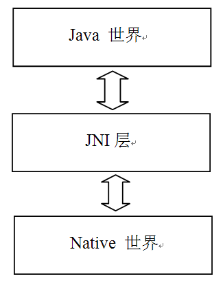
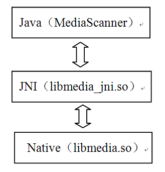
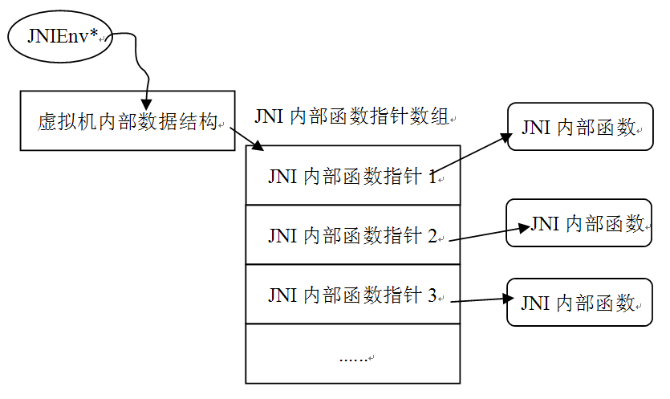

<h1>第2章  深入理解JNI</h1>

本章主要内容

·  通过一个实例，介绍JNI技术和在使用中应注意的问题。

本章涉及的源代码文件名及位置

下面是本章分析的源码文件名及其位置。

·  MediaScanner.java 

framework/base/media/java/src/android/media/MediaScanner.java

·  android_media_MediaScanner.cpp

framework/base/media/jni/MediaScanner.cpp

·  android_media_MediaPlayer.cpp

framework/base/media/jni/android_media_MediaPlayer.cpp

·  AndroidRunTime.cpp

framework/base/core/jni/AndroidRunTime.cpp

·  JNIHelp.c

dalvik/libnativehelper/JNIHelp.c

<h2>2.1  概述</h2>

JNI，是Java Native Interface的缩写，中文为Java本地调用。通俗地说，JNI是一种技术，通过这种技术可以做到以下两点：

·  Java程序中的函数可以调用Native语言写的函数，Native一般指的是C/C++编写的函数。

·  Native程序中的函数可以调用Java层的函数，也就是在C/C++程序中可以调用Java的函数。

在平台无关的Java中，为什么要创建一个和Native相关的JNI技术呢？这岂不是破坏了Java的平台无关特性吗？本人觉得，JNI技术的推出可能是出于以下几个方面的考虑：

·  承载Java世界的虚拟机是用Native语言写的，而虚拟机又运行在具体平台上，所以虚拟机本身无法做到平台无关。然而，有了JNI技术，就可以对Java层屏蔽具体的虚拟机实现上的差异了。这样，就能实现Java本身的平台无关特性。其实Java一直在使用JNI技术，只是我们平时较少用到罢了。

·  早在Java语言诞生前，很多程序都是用Native语言写的，它们遍布在软件世界的各个角落。Java出世后，它受到了追捧，并迅速得到发展，但仍无法对软件世界彻底改朝换代，于是才有了折中的办法。既然已经有Native模块实现了相关功能，那么在Java中通过JNI技术直接使用它们就行了，免得落下重复制造轮子的坏名声。另外，在一些要求效率和速度的场合还是需要Native语言参与的。

在Android平台上，JNI就是一座将Native世界和Java世界间的天堑变成通途的桥，来看图2-1，它展示了Android平台上JNI所处的位置：

图2-1  Android平台中JNI示意图

由上图可知，JNI将Java世界和Native世界紧密地联系在一起了。在Android平台上尽情使用Java开发的程序员们不要忘了，如果没有JNI的支持，我们将寸步难行！

    
注意，虽然JNI层的代码是用Native语言写的，但本书还是把和JNI相关的模块单独归类到JNI层。

俗话说，百闻不如一见，就来见识一下JNI技术吧。

 

2.2  通过实例学习JNI

初次接触JNI，感觉最神奇的就是，Java竟然能够调用Native的函数，可它是怎么做到的呢？网上有很多介绍JNI的资料。由于Android大量使用了JNI技术，本节就将通过源码中的一处实例，来学习相关的知识，并了解它是如何调用Native的函数的。

这个例子，是和MediaScanner相关的。在本书的最后一章，会详细分析它的工作原理，这里先看和JNI相关的部分，如图2-2所示：

图2-2  MediaScanner和它的JNI

将图2-2与图2-1结合来看，可以知道：

·  Java世界对应的是MediaScanner，而这个MediaScanner类有一些函数是需要由Native层实现的。

·  JNI层对应的是libmedia_jni.so。media_jni是JNI库的名字，其中，下划线前的“media”是Native层库的名字，这里就是libmedia库。下划线后的”jni“表示它是一个JNI库。注意，JNI库的名字可以随便取，不过Android平台基本上都采用“lib模块名_jni.so”的命名方式。

·  Native层对应的是libmedia.so，这个库完成了实际的功能。

·  MediaScanner将通过JNI库libmedia_jni.so和Native的libmedia.so交互。

从上面的分析中还可知道：

·  JNI层必须实现为动态库的形式，这样Java虚拟机才能加载它并调用它的函数。

下面来看MediaScanner。

    
MediaScanner是Android平台中多媒体系统的重要组成部分，它的功能是扫描媒体文件，得到诸如歌曲时长、歌曲作者等媒体信息，并将它们存入到媒体数据库中，供其他应用程序使用。

<h3>2.2.1  Java层的MediaScanner分析</h3>

来看MediaScanner（简称MS）的源码，这里将提取出和JNI有关的部分，其代码如下所示：

[--&gt;MediaScanner.java]

    
public class MediaScanner

    
{

    
static{ static语句

    
    /*

    
①加载对应的JNI库，media_jni是JNI库的名字。实际加载动态库的时候会拓展成

    
libmedia_jni.so，在Windows平台上将拓展为media_jni.dll。

    
*/

    
       System.loadLibrary("media_jni");

    
       native_init();//调用native_init函数

    
    }

    
.......

    
//非native函数

    
publicvoid scanDirectories(String[] directories, String volumeName){

    
  ......

    
}

    
 

    
//②声明一个native函数。native为Java的关键字，表示它将由JNI层完成。

    
privatestatic native final void native_init();

    
    ......

    
privatenative void processFile(String path, String mimeType,

    
 MediaScannerClient client);

    
    ......

    
}

·  上面代码中列出了两个比较重要的要点：

<h4>1. 加载JNI库</h4>

前面说过，如Java要调用Native函数，就必须通过一个位于JNI层的动态库才能做到。顾名思义，动态库就是运行时加载的库，那么是什么时候，在什么地方加载这个库呢？

这个问题没有标准答案，原则上是在调用native函数前，任何时候、任何地方加载都可以。通行的做法是，在类的static语句中加载，通过调用System.loadLibrary方法就可以了。这一点，在上面的代码中也见到了，我们以后就按这种方法编写代码即可。另外，System.loadLibrary函数的参数是动态库的名字，即media_jni。系统会自动根据不同的平台拓展成真实的动态库文件名，例如在Linux系统上会拓展成libmedia_jni.so，而在Windows平台上则会拓展成media_jni.dll。

解决了JNI库加载的问题，再来来看第二个关键点。

<h4>2.  Java的native函数和总结</h4>

从上面代码中可以发现，native_init和processFile函数前都有Java的关键字native，它表示这两个函数将由JNI层来实现。

Java层的分析到此结束。JNI技术也很照顾Java程序员，只要完成下面两项工作就可以使用JNI了，它们是：

·  加载对应的JNI库。

·  声明由关键字native修饰的函数。

所以对于Java程序员来说，使用JNI技术真的是太容易了。不过JNI层可没这么轻松，下面来看MS的JNI层分析。

<h3>2.2.2  JNI层的MediaScanner分析</h3>

MS的JNI层代码在android_media_MediaScanner.cpp中，如下所示：

[--&gt;android_media_MediaScanner.cpp]

    
//①这个函数是native_init的JNI层实现。

    
static void android_media_MediaScanner_native_init(JNIEnv *env)

    
{

    
    jclass clazz;

    
 

    
    clazz= env-&gt;FindClass("android/media/MediaScanner");

    
    ......

    
   fields.context = env-&gt;GetFieldID(clazz, "mNativeContext","I");

    
......

    
return;

    
}

    
 

    
//这个函数是processFile的JNI层实现。

    
static void android_media_MediaScanner_processFile(JNIEnv*env, jobject thiz, 

    
jstring path, jstring mimeType, jobject client)

    
{

    
    MediaScanner*mp = (MediaScanner *)env-&gt;GetIntField(thiz, fields.context);

    
    ......

    
    constchar *pathStr = env-&gt;GetStringUTFChars(path, NULL);

    
    ......

    
    if(mimeType) {

    
       env-&gt;ReleaseStringUTFChars(mimeType, mimeTypeStr);

    
    }

    
}

上面是MS的JNI层代码，不知道读者看了以后是否会产生些疑惑？

我想，最大的疑惑可能是，怎么会知道Java层的native_init函数对应的是JNI层的android_media_MediaScanner_native_init函数呢？下面就来回答这个问题。

<h4>1.   注册JNI函数</h4>

正如代码中注释的那样，native_init函数对应的JNI函数是android_media_MediaScanner_native_init，可是细心的读者可能要问了，你怎么知道native_init函数对应的是这个android_media_MediaScanner_native_init，而不是其他的呢？莫非是根据函数的名字？

大家知道，native_init函数位于android.media这个包中，它的全路径名应该是android.media.MediaScanner.native_init，而JNI层函数的名字是android_media_MediaScanner_native_init。因为在Native语言中，符号“.”有着特殊的意义，所以JNI层需要把“.”换成“_”。也就是通过这种方式，native_init找到了自己JNI层的本家兄弟android.media.MediaScanner.native_init。

上面的问题其实讨论的是JNI函数的注册问题，“注册”之意就是将Java层的native函数和JNI层对应的实现函数关联起来，有了这种关联，调用Java层的native函数时，就能顺利转到JNI层对应的函数执行了。而JNI函数的注册实际上有两种方法，下面分别做介绍。

<h5>（1）静态方法</h5>

我们从网上找到的与JNI有的关资料，一般都会介绍如何使用这种方法完成JNI函数的注册，这种方法就是根据函数名来找对应的JNI函数。这种方法需要Java的工具程序javah参与，整体流程如下：

·  先编写Java代码，然后编译生成.class文件。

·  使用Java的工具程序javah，如javah–o output packagename.classname ，这样它会生成一个叫output.h的JNI层头文件。其中packagename.classname是Java代码编译后的class文件，而在生成的output.h文件里，声明了对应的JNI层函数，只要实现里面的函数即可。

这个头文件的名字一般都会使用packagename_class.h的样式，例如MediaScanner对应的JNI层头文件就是android_media_MediaScanner.h。下面，来看这种方式生成的头文件：

[--&gt;android_media_MediaScanner.h::样例文件]

    
/* DO NOT EDIT THIS FILE - it is machinegenerated */

    
#include &lt;jni.h&gt;  //必须包含这个头文件，否则编译通不过

    
/* Header for class android_media_MediaScanner*/

    
 

    
#ifndef _Included_android_media_MediaScanner

    
#define _Included_android_media_MediaScanner

    
#ifdef __cplusplus

    
extern "C" {

    
#endif

    
...... 略去一部分注释内容

    
//processFile的JNI函数

    
JNIEXPORT void JNICALLJava_android_media_MediaScanner_processFile

    
                   (JNIEnv *, jobject, jstring,jstring, jobject);

    
 

    
......//略去一部分注释内容

    
//native_init对应的JNI函数

    
JNIEXPORT void JNICALLJava_android_media_MediaScanner_native_1init

    
  (JNIEnv*, jclass);

    
 

    
#ifdef __cplusplus

    
}

    
#endif

    
#endif

从上面代码中可以发现，native_init和processFile的JNI层函数被声明成：

    
//Java层函数名中如果有一个”_”的话，转换成JNI后就变成了”_l”。

    
JNIEXPORT void JNICALLJava_android_media_MediaScanner_native_1init

    
JNIEXPORT void JNICALLJava_android_media_MediaScanner_processFile

需解释一下，静态方法中native函数是如何找到对应的JNI函数的。其实，过程非常简单：

·  当Java层调用native_init函数时，它会从对应的JNI库Java_android_media_MediaScanner_native_linit，如果没有，就会报错。如果找到，则会为这个native_init和Java_android_media_MediaScanner_native_linit建立一个关联关系，其实就是保存JNI层函数的函数指针。以后再调用native_init函数时，直接使用这个函数指针就可以了，当然这项工作是由虚拟机完成的。

从这里可以看出，静态方法就是根据函数名来建立Java函数和JNI函数之间的关联关系的，它要求JNI层函数的名字必须遵循特定的格式。这种方法也有几个弊端，它们是：

·  需要编译所有声明了native函数的Java类，每个生成的class文件都得用javah生成一个头文件。

·  javah生成的JNI层函数名特别长，书写起来很不方便。

·  初次调用native函数时要根据函数名字搜索对应的JNI层函数来建立关联关系，这样会影响运行效率。

有什么办法可以克服上面三种弊端吗？根据上面的介绍，Java native函数是通过函数指针来和JNI层函数建立关联关系的。如果直接让native函数知道JNI层对应函数的函数指针，不就万事大吉了吗？这就是下面要介绍的第二种方法：动态注册法。

<h5>（2）动态注册</h5>

既然Java native函数数和JNI函数是一一对应的，那么是不是会有一个结构来保存这种关联关系呢？答案是肯定的。在JNI技术中，用来记录这种一一对应关系的，是一个叫JNINativeMethod的结构，其定义如下：

    
typedef struct { 

    
   //Java中native函数的名字，不用携带包的路径。例如“native_init“。

    
constchar* name;    

    
//Java函数的签名信息，用字符串表示，是参数类型和返回值类型的组合。

    
    const char* signature;

    
   void*       fnPtr;  //JNI层对应函数的函数指针，注意它是void*类型。

    
} JNINativeMethod;

应该如何使用这个结构体呢？来看MediaScanner JNI层是如何做的，代码如下所示：

[--&gt;android_media_MediaScanner.cpp]

    
//定义一个JNINativeMethod数组，其成员就是MS中所有native函数的一一对应关系。

    
static JNINativeMethod gMethods[] = {

    
    ......

    
{

    
"processFile" //Java中native函数的函数名。

    
//processFile的签名信息，签名信息的知识，后面再做介绍。

    
"(Ljava/lang/String;Ljava/lang/String;Landroid/media/MediaScannerClient;)V",    

    
 (void*)android_media_MediaScanner_processFile //JNI层对应函数指针。

    
},

    
 ......

    
 

    
{

    
"native_init",        

    
"()V",                      

    
(void *)android_media_MediaScanner_native_init

    
},

    
  ......

    
};

    
//注册JNINativeMethod数组

    
int register_android_media_MediaScanner(JNIEnv*env)

    
{

    
   //调用AndroidRuntime的registerNativeMethods函数，第二个参数表明是Java中的哪个类

    
    returnAndroidRuntime::registerNativeMethods(env,

    
               "android/media/MediaScanner", gMethods, NELEM(gMethods));

    
}

AndroidRunTime类提供了一个registerNativeMethods函数来完成注册工作，下面看registerNativeMethods的实现，代码如下：

[--&gt;AndroidRunTime.cpp]

    
int AndroidRuntime::registerNativeMethods(JNIEnv*env,

    
    constchar* className, const JNINativeMethod* gMethods, int numMethods)

    
{

    
    //调用jniRegisterNativeMethods函数完成注册

    
    returnjniRegisterNativeMethods(env, className, gMethods, numMethods);

    
}

其中jniRegisterNativeMethods是Android平台中，为了方便JNI使用而提供的一个帮助函数，其代码如下所示：

[--&gt;JNIHelp.c]

    
int jniRegisterNativeMethods(JNIEnv* env, constchar* className,

    
                                  constJNINativeMethod* gMethods, int numMethods)

    
{

    
    jclassclazz;

    
    clazz= (*env)-&gt;FindClass(env, className);

    
......

    
//实际上是调用JNIEnv的RegisterNatives函数完成注册的

    
    if((*env)-&gt;RegisterNatives(env, clazz, gMethods, numMethods) &lt; 0) {

    
       return -1;

    
    }

    
    return0;

    
}

wow，好像很麻烦啊！其实动态注册的工作，只用两个函数就能完成。总结如下：

    
/*

    
env指向一个JNIEnv结构体，它非常重要，后面会讨论它。classname为对应的Java类名，由于

    
JNINativeMethod中使用的函数名并非全路径名，所以要指明是哪个类。

    
*/

    
jclass clazz =  (*env)-&gt;FindClass(env, className);

    
//调用JNIEnv的RegisterNatives函数，注册关联关系。

    
(*env)-&gt;RegisterNatives(env, clazz, gMethods,numMethods);

所以，在自己的JNI层代码中使用这种方法，就可以完成动态注册了。这里还有一个很棘手的问题：这些动态注册的函数在什么时候、什么地方被谁调用呢？好了，不卖关子了，直接给出该问题的答案：

·  当Java层通过System.loadLibrary加载完JNI动态库后，紧接着会查找该库中一个叫JNI_OnLoad的函数，如果有，就调用它，而动态注册的工作就是在这里完成的。

所以，如果想使用动态注册方法，就必须要实现JNI_OnLoad函数，只有在这个函数中，才有机会完成动态注册的工作。静态注册则没有这个要求，可我建议读者也实现这个JNI_OnLoad函数，因为有一些初始化工作是可以在这里做的。

那么，libmedia_jni.so的JNI_OnLoad函数是在哪里实现的呢？由于多媒体系统很多地方都使用了JNI，所以码农把它放到android_media_MediaPlayer.cpp中了，代码如下所示：

[--&gt;android_media_MediaPlayer.cpp]

    
jint JNI_OnLoad(JavaVM* vm, void* reserved)

    
{

    
   //该函数的第一个参数类型为JavaVM,这可是虚拟机在JNI层的代表喔，每个Java进程只有一个

    
  //这样的JavaVM

    
   JNIEnv* env = NULL;

    
    jintresult = -1;

    
 

    
    if(vm-&gt;GetEnv((void**) &amp;env, JNI_VERSION_1_4) != JNI_OK) {

    
         gotobail;

    
    }

    
    ...... //动态注册MediaScanner的JNI函数。

    
    if(register_android_media_MediaScanner(env) &lt; 0) {

    
        goto bail;

    
}

    
......

    
returnJNI_VERSION_1_4;//必须返回这个值，否则会报错。

    
}

JNI函数注册的内容介绍完了。下面来关注JNI技术中其他的几个重要部分。

    
JNI层代码中一般要包含jni.h这个头文件。Android源码中提供了一个帮助头文件JNIHelp.h，它内部其实就包含了jni.h，所以我们在自己的代码中直接包含这个JNIHelp.h即可。

<h4>2. 数据类型转换</h4>

通过前面的分析，解决了JNI函数的注册问题。下面来研究数据类型转换的问题。

在Java中调用native函数传递的参数是Java数据类型，那么这些参数类型到了JNI层会变成什么呢？

Java数据类型分为基本数据类型和引用数据类型两种，JNI层也是区别对待这二者的。先来看基本数据类型的转换。

<h5>（1）基本类型的转换</h5>

基本类型的转换很简单，可用表2-1表示：

表2-1  基本数据类型转换关系表

<table>
    <tbody>
        <tr>
            <td>
                
Java

            </td>
            <td>
                
Native类型

            </td>
            <td>
                
符号属性

            </td>
            <td>
                
字长

            </td>
        </tr>
        <tr>
            <td>
                
boolean

            </td>
            <td>
                
jboolean

            </td>
            <td>
                
无符号

            </td>
            <td>
                
8位

            </td>
        </tr>
        <tr>
            <td>
                
byte

            </td>
            <td>
                
jbyte

            </td>
            <td>
                
无符号

            </td>
            <td>
                
8位

            </td>
        </tr>
        <tr>
            <td>
                
char

            </td>
            <td>
                
jchar

            </td>
            <td>
                
无符号

            </td>
            <td>
                
16位

            </td>
        </tr>
        <tr>
            <td>
                
short

            </td>
            <td>
                
jshort

            </td>
            <td>
                
有符号

            </td>
            <td>
                
16位

            </td>
        </tr>
        <tr>
            <td>
                
int

            </td>
            <td>
                
jint

            </td>
            <td>
                
有符号

            </td>
            <td>
                
32位

            </td>
        </tr>
        <tr>
            <td>
                
long

            </td>
            <td>
                
jlong

            </td>
            <td>
                
有符号

            </td>
            <td>
                
64位

            </td>
        </tr>
        <tr>
            <td>
                
float

            </td>
            <td>
                
jfloat

            </td>
            <td>
                
有符号

            </td>
            <td>
                
32位

            </td>
        </tr>
        <tr>
            <td>
                
double

            </td>
            <td>
                
jdouble

            </td>
            <td>
                
有符号

            </td>
            <td>
                
64位

            </td>
        </tr>
    </tbody>
</table>

上面列出了Java基本数据类型和JNI层数据类型对应的转换关系，非常简单。不过，应务必注意，转换成Native类型后对应数据类型的字长，例如jchar在Native语言中是16位，占两个字节，这和普通的char占一个字节的情况完全不一样。

接下来看Java引用数据类型的转换。

<h5>（2）引用数据类型的转换</h5>

引用数据类型的转换如表2-2所示：

表2-2  Java引用数据类型转换关系表

<table>
    <tbody>
        <tr>
            <td>
                
Java引用类型

            </td>
            <td>
                
Native类型

            </td>
            <td>
                
Java引用类型

            </td>
            <td>
                
Native类型

            </td>
        </tr>
        <tr>
            <td>
                
All objects

            </td>
            <td>
                
jobject

            </td>
            <td>
                
char[]

            </td>
            <td>
                
jcharArray

            </td>
        </tr>
        <tr>
            <td>
                
java.lang.Class实例

            </td>
            <td>
                
jclass

            </td>
            <td>
                
short[]

            </td>
            <td>
                
jshortArray

            </td>
        </tr>
        <tr>
            <td>
                
java.lang.String实例

            </td>
            <td>
                
jstring

            </td>
            <td>
                
int[]

            </td>
            <td>
                
jintArray

            </td>
        </tr>
        <tr>
            <td>
                
Object[]

            </td>
            <td>
                
jobjectArray

            </td>
            <td>
                
long[]

            </td>
            <td>
                
jlongArray

            </td>
        </tr>
        <tr>
            <td>
                
boolean[]

            </td>
            <td>
                
jbooleanArray

            </td>
            <td>
                
float[]

            </td>
            <td>
                
floatArray

            </td>
        </tr>
        <tr>
            <td>
                
byte[]

            </td>
            <td>
                
jbyteArray

            </td>
            <td>
                
double[]

            </td>
            <td>
                
jdoubleArray

            </td>
        </tr>
        <tr>
            <td>
                
java.lang.Throwable实例

            </td>
            <td>
                
jthrowable

            </td>
            <td>
                
 

            </td>
            <td>
                
 

            </td>
        </tr>
    </tbody>
</table>

由上表可知：

·  除了Java中基本数据类型的数组、Class、String和Throwable外，其余所有Java对象的数据类型在JNI中都用jobject表示。

这一点太让人惊讶了！看processFile这个函数：

    
//Java层processFile有三个参数。

    
processFile(String path, StringmimeType,MediaScannerClient client);

    
//JNI层对应的函数，最后三个参数和processFile的参数对应。

    
android_media_MediaScanner_processFile(JNIEnv*env, jobject thiz, 

    
jstring path, jstring mimeType, jobject client)

从上面这段代码中可以发现：

·  Java的String类型在JNI层对应为jstring。

·  Java的MediaScannerClient类型在JNI层对应为jobject。

如果对象类型都用jobject表示，就好比是Native层的void*类型一样，对码农来说，是完全透明的。既然是透明的，那该如何使用和操作它们呢？在回答这个问题之前，再来仔细看看上面那个android_media_MediaScanner_processFile函数，代码如下：

    
/*

    
Java中的processFile只有三个参数，为什么JNI层对应的函数会有五个参数呢？第一个参数中的JNIEnv是什么？稍后介绍。第二个参数jobject代表Java层的MediaScanner对象，它表示

    
是在哪个MediaScanner对象上调用的processFile。如果Java层是static函数的话，那么

    
这个参数将是jclass，表示是在调用哪个Java Class的静态函数。

    
*/

    
android_media_MediaScanner_processFile(JNIEnv*env, 

    
jobject thiz, 

    
jstring path, jstring mimeType, jobject client)

上面的代码，引出了下面几节的主角JNIEnv。

<h4>3. JNIEnv介绍</h4>

JNIEnv是一个和线程相关的，代表JNI环境的结构体，图2-3展示了JNIEnv的内部结构：

图2-3  JNIEnv内部结构简图

从上图可知，JNIEnv实际上就是提供了一些JNI系统函数。通过这些函数可以做到：

·  调用Java的函数。

·  操作jobject对象等很多事情。

后面小节中将具体介绍怎么使用JNIEnv中的函数。这里，先介绍一个关于JNIEnv的重要知识点。

上面提到说JNIEnv，是一个和线程有关的变量。也就是说，线程A有一个JNIEnv，线程B有一个JNIEnv。由于线程相关，所以不能在线程B中使用线程A的JNIEnv结构体。读者可能会问，JNIEnv不都是native函数转换成JNI层函数后由虚拟机传进来的吗？使用传进来的这个JNIEnv总不会错吧？是的，在这种情况下使用当然不会出错。不过当后台线程收到一个网络消息，而又需要由Native层函数主动回调Java层函数时，JNIEnv是从何而来呢？根据前面的介绍可知，我们不能保存另外一个线程的JNIEnv结构体，然后把它放到后台线程中来用。这该如何是好？

还记得前面介绍的那个JNI_OnLoad函数吗？它的第一个参数是JavaVM，它是虚拟机在JNI层的代表，代码如下所示：

    
//全进程只有一个JavaVM对象，所以可以保存，任何地方使用都没有问题。

    
jint JNI_OnLoad(JavaVM* vm, void* reserved)

正如上面代码所说，不论进程中有多少个线程，JavaVM却是独此一份，所以在任何地方都可以使用它。那么，JavaVM和JNIEnv又有什么关系呢？答案如下：

·  调用JavaVM的AttachCurrentThread函数，就可得到这个线程的JNIEnv结构体。这样就可以在后台线程中回调Java函数了。

·  另外，后台线程退出前，需要调用JavaVM的DetachCurrentThread函数来释放对应的资源。

再来看JNIEnv的作用。

<h4>4. 通过JNIEnv操作jobject</h4>

前面提到过一个问题，即Java的引用类型除了少数几个外，最终在JNI层都用jobject来表示对象的数据类型，那么该如何操作这个jobject呢？

从另外一个角度来解释这个问题。一个Java对象是由什么组成的？当然是它的成员变量和成员函数了。那么，操作jobject的本质就应当是操作这些对象的成员变量和成员函数。所以应先来看与成员变量及成员函数有关的内容。

<h5>（1）jfieldID 和jmethodID的介绍</h5>

我们知道，成员变量和成员函数是由类定义的，它是类的属性，所以在JNI规则中，用jfieldID 和jmethodID 来表示Java类的成员变量和成员函数，它们通过JNIEnv的下面两个函数可以得到：

    
jfieldID GetFieldID(jclass clazz,const char*name, const char *sig);

    
jmethodID GetMethodID(jclass clazz, const char*name,const char *sig);

其中，jclass代表Java类，name表示成员函数或成员变量的名字，sig为这个函数和变量的签名信息。如前所示，成员函数和成员变量都是类的信息，这两个函数的第一个参数都是jclass。

MS中是怎么使用它们的呢？来看代码，如下所示：

[--&gt;android_media_MediaScanner.cpp::MyMediaScannerClient构造函数]

    
 MyMediaScannerClient(JNIEnv *env, jobjectclient)......

    
{

    
 //先找到android.media.MediaScannerClient类在JNI层中对应的jclass实例。

    
jclass mediaScannerClientInterface = 

    
env-&gt;FindClass("android/media/MediaScannerClient");

    
 //取出MediaScannerClient类中函数scanFile的jMethodID。

    
mScanFileMethodID = env-&gt;GetMethodID(

    
mediaScannerClientInterface, "scanFile",

    
                           "(Ljava/lang/String;JJ)V");

    
 //取出MediaScannerClient类中函数handleStringTag的jMethodID。

    
 mHandleStringTagMethodID = env-&gt;GetMethodID(

    
mediaScannerClientInterface,"handleStringTag",

    
                             "(Ljava/lang/String;Ljava/lang/String;)V");

    
  ......

    
}

在上面代码中，将scanFile和handleStringTag函数的jmethodID保存为MyMediaScannerClient的成员变量。为什么这里要把它们保存起来呢？这个问题涉及一个事关程序运行效率的知识点：

·  如果每次操作jobject前都去查询jmethoID或jfieldID的话将会影响程序运行的效率。所以我们在初始化的时候，就可以取出这些ID并保存起来以供后续使用。

取出jmethodID后，又该怎么用它呢？

<h5>（2）使用jfieldID和jmethodID</h5>

下面再看一个例子，其代码如下所示：

[--&gt;android_media_MediaScanner.cpp::MyMediaScannerClient的scanFile]

    
 virtualbool scanFile(const char* path, long long lastModified, 

    
long long fileSize)

    
    {

    
       jstring pathStr;

    
        if((pathStr = mEnv-&gt;NewStringUTF(path)) == NULL) return false;

    
        

    
/*

    
调用JNIEnv的CallVoidMethod函数，注意CallVoidMethod的参数：

    
第一个是代表MediaScannerClient的jobject对象，

    
第二个参数是函数scanFile的jmethodID，后面是Java中scanFile的参数。

    
*/

    
       mEnv-&gt;CallVoidMethod(mClient, mScanFileMethodID, pathStr, 

    
lastModified, fileSize);

    
 

    
       mEnv-&gt;DeleteLocalRef(pathStr);

    
       return (!mEnv-&gt;ExceptionCheck());

    
}

明白了，通过JNIEnv输出的CallVoidMethod，再把jobject、jMethodID和对应参数传进去，JNI层就能够调用Java对象的函数了！

实际上JNIEnv输出了一系列类似CallVoidMethod的函数，形式如下：

    
NativeType Call&lt;type&gt;Method(JNIEnv *env,jobject obj,jmethodID methodID, ...)。

其中type是对应Java函数的返回值类型，例如CallIntMethod、CallVoidMethod等。

上面是针对非static函数的，如果想调用Java中的static函数，则用JNIEnv输出的CallStatic&lt;Type&gt;Method系列函数。

现在，我们已了解了如何通过JNIEnv操作jobject的成员函数，那么怎么通过jfieldID操作jobject的成员变量呢？这里，直接给出整体解决方案，如下所示：

    
//获得fieldID后，可调用Get&lt;type&gt;Field系列函数获取jobject对应成员变量的值。

    
NativeType Get&lt;type&gt;Field(JNIEnv *env,jobject obj,jfieldID fieldID)

    
//或者调用Set&lt;type&gt;Field系列函数来设置jobject对应成员变量的值。

    
void Set&lt;type&gt;Field(JNIEnv *env,jobject obj,jfieldID fieldID,NativeType value)

    
//下面我们列出一些参加的Get/Set函数。

    
GetObjectField()         SetObjectField()

    
GetBooleanField()         SetBooleanField()

    
GetByteField()           SetByteField() 

    
GetCharField()           SetCharField()

    
GetShortField()          SetShortField() 

    
GetIntField()            SetIntField()

    
GetLongField()           SetLongField()

    
GetFloatField()          SetFloatField()

    
GetDoubleField()                  SetDoubleField()

通过本节的介绍，相信读者已了解jfieldID和jmethodID的作用，也知道如何通过JNIEnv的函数来操作jobject了。虽然jobject是透明的，但有了JNIEnv的帮助，还是能轻松操作jobject背后的实际对象了。

<h4>5. jstring介绍</h4>

Java中的String也是引用类型，不过由于它的使用非常频繁，所以在JNI规范中单独创建了一个jstring类型来表示Java中的String类型。虽然jstring是一种独立的数据类型，但是它并没有提供成员函数供操作。相比而言，C++中的string类就有自己的成员函数了。那么该怎么操作jstring呢？还是得依靠JNIEnv提供的帮助。这里看几个有关jstring的函数：

·  调用JNIEnv的NewString(JNIEnv *env, const jchar*unicodeChars,jsize len)，可以从Native的字符串得到一个jstring对象。其实，可以把一个jstring对象看成是Java中String对象在JNI层的代表，也就是说，jstring就是一个Java String。但由于Java String存储的是Unicode字符串，所以NewString函数的参数也必须是Unicode字符串。

·  调用JNIEnv的NewStringUTF将根据Native的一个UTF-8字符串得到一个jstring对象。在实际工作中，这个函数用得最多。

·  上面两个函数将本地字符串转换成了Java的String对象，JNIEnv还提供了GetStringChars和GetStringUTFChars函数，它们可以将Java String对象转换成本地字符串。其中GetStringChars得到一个Unicode字符串，而GetStringUTFChars得到一个UTF-8字符串。

·  另外，如果在代码中调用了上面几个函数，在做完相关工作后，就都需要调用ReleaseStringChars或ReleaseStringUTFChars函数对应地释放资源，否则会导致JVM内存泄露。这一点和jstring的内部实现有关系，读者写代码时务必注意这个问题。

为了加深印象，来看processFile是怎么做的：

[--&gt;android_media_MediaScanner.cpp]

    
static void

    
android_media_MediaScanner_processFile(JNIEnv*env, jobject thiz, jstring path, jstring mimeType, jobject client)

    
{

    
   MediaScanner *mp = (MediaScanner *)env-&gt;GetIntField(thiz,fields.context);

    
......

    
//调用JNIEnv的GetStringUTFChars得到本地字符串pathStr

    
    constchar *pathStr = env-&gt;GetStringUTFChars(path, NULL);

    
......

    
//使用完后，必须调用ReleaseStringUTFChars释放资源

    
   env-&gt;ReleaseStringUTFChars(path, pathStr);

    
    ......

    
}

<h4>6. JNI类型签名的介绍</h4>

先来看动态注册中的一段代码：

    
tatic JNINativeMethod gMethods[] = {

    
    ......

    
{

    
"processFile" 

    
//processFile的签名信息，这么长的字符串，是什么意思？

    
"(Ljava/lang/String;Ljava/lang/String;Landroid/media/MediaScannerClient;)V",    

    
 (void*)android_media_MediaScanner_processFile

    
},

    
  ......

    
}

上面代码中的JNINativeMethod已经见过了，不过其中那个很长的字符串"(Ljava/lang/String;Ljava/lang/String;Landroid/media/MediaScannerClient;)V"是什么意思呢？

根据前面的介绍可知，它是Java中对应函数的签名信息，由参数类型和返回值类型共同组成。不过为什么需要这个签名信息呢？

·  这个问题的答案比较简单。因为Java支持函数重载，也就是说，可以定义同名但不同参数的函数。但仅仅根据函数名，是没法找到具体函数的。为了解决这个问题，JNI技术中就使用了参数类型和返回值类型的组合，作为一个函数的签名信息，有了签名信息和函数名，就能很顺利地找到Java中的函数了。

JNI规范定义的函数签名信息看起来很别扭，不过习惯就好了。它的格式是：

(参数1类型标示参数2类型标示...参数n类型标示)返回值类型标示。

来看processFile的例子：

    
Java中函数定义为void processFile(String path, String mimeType)

    
对应的JNI函数签名就是

    
(Ljava/lang/String;Ljava/lang/String;Landroid/media/MediaScannerClient;)V

    
 其中，括号内是参数类型的标示，最右边是返回值类型的标示，void类型对应的标示是V。

    
 当参数的类型是引用类型时，其格式是”L包名;”，其中包名中的”.”换成”/”。上面例子中的

    
Ljava/lang/String;表示是一个Java String类型。

函数签名不仅看起来麻烦，写起来更麻烦，稍微写错一个标点就会导致注册失败。所以，在具体编码时，读者可以定义字符串宏，这样改起来也方便。

表2-3是常见的类型标示：

表2-3  类型标示示意表

<table>
    <tbody>
        <tr>
            <td>
                
类型标示

            </td>
            <td>
                
Java类型

            </td>
            <td>
                
类型标示

            </td>
            <td>
                
Java类型

            </td>
        </tr>
        <tr>
            <td>
                
Z

            </td>
            <td>
                
boolean

            </td>
            <td>
                
F

            </td>
            <td>
                
float

            </td>
        </tr>
        <tr>
            <td>
                
B

            </td>
            <td>
                
byte

            </td>
            <td>
                
D

            </td>
            <td>
                
double

            </td>
        </tr>
        <tr>
            <td>
                
C

            </td>
            <td>
                
char

            </td>
            <td>
                
L/java/langaugeString;

            </td>
            <td>
                
String

            </td>
        </tr>
        <tr>
            <td>
                
S

            </td>
            <td>
                
short

            </td>
            <td>
                
[I

            </td>
            <td>
                
int[]

            </td>
        </tr>
        <tr>
            <td>
                
I

            </td>
            <td>
                
int

            </td>
            <td>
                
[L/java/lang/object;

            </td>
            <td>
                
Object[]

            </td>
        </tr>
        <tr>
            <td>
                
J

            </td>
            <td>
                
long

            </td>
            <td>
                
 

            </td>
            <td>
                
 

            </td>
        </tr>
    </tbody>
</table>

上面列出了一些常用的类型标示。请读者注意，如果Java类型是数组，则标示中会有一个“[”，另外，引用类型（除基本类型的数组外）的标示最后都有一个“;”。

再来看一个小例子，如表2-4所示：

表2-4  函数签名小例子

<table>
    <tbody>
        <tr>
            <td>
                
函数签名

            </td>
            <td>
                
Java函数

            </td>
        </tr>
        <tr>
            <td>
                
“()Ljava/lang/String;”

            </td>
            <td>
                
String f()

            </td>
        </tr>
        <tr>
            <td>
                
“(ILjava/lang/Class;)J”

            </td>
            <td>
                
long f(int i, Class c)

            </td>
        </tr>
        <tr>
            <td>
                
“([B)V”

            </td>
            <td>
                
void f(byte[] bytes)

            </td>
        </tr>
    </tbody>
</table>

请读者结合表2-3和表2-4左栏的内容写出对应的Java函数。

虽然函数签名信息很容易写错，但Java提供一个叫javap的工具能帮助生成函数或变量的签名信息，它的用法如下：

javap –s -p xxx。其中xxx为编译后的class文件，s表示输出内部数据类型的签名信息，p表示打印所有函数和成员的签名信息，而默认只会打印public成员和函数的签名信息。

有了javap，就不用死记硬背上面的类型标示了。

<h4>7. 垃圾回收</h4>

我们知道，Java中创建的对象最后是由垃圾回收器来回收和释放内存的，可它对JNI有什么影响呢？下面看一个例子：

[--&gt;垃圾回收例子]

    
static jobject save_thiz = NULL; //定义一个全局的jobject

    
static void

    
android_media_MediaScanner_processFile(JNIEnv*env, jobject thiz, jstring path,

    
 jstringmimeType, jobject client)

    
{

    
  ......

    
  //保存Java层传入的jobject对象，代表MediaScanner对象

    
save_thiz = thiz;

    
......

    
return;

    
}

    
//假设在某个时间，有地方调用callMediaScanner函数

    
void callMediaScanner()

    
{

    
  //在这个函数中操作save_thiz，会有问题吗？

    
}

上面的做法肯定会有问题，因为和save_thiz对应的Java层中的MediaScanner很有可能已经被垃圾回收了，也就是说，save_thiz保存的这个jobject可能是一个野指针，如使用它，后果会很严重。

可能有人要问，将一个引用类型进行赋值操作，它的引用计数不会增加吗？而垃圾回收机制只会保证那些没有被引用的对象才会被清理。问得对，但如果在JNI层使用下面这样的语句，是不会增加引用计数的。

    
save_thiz = thiz; //这种赋值不会增加jobject的引用计数。

那该怎么办？不必担心，JNI规范已很好地解决了这一问题，JNI技术一共提供了三种类型的引用，它们分别是：

·  Local Reference：本地引用。在JNI层函数中使用的非全局引用对象都是Local Reference。它包括函数调用时传入的jobject、在JNI层函数中创建的jobject。LocalReference最大的特点就是，一旦JNI层函数返回，这些jobject就可能被垃圾回收。

·  Global Reference：全局引用，这种对象如不主动释放，就永远不会被垃圾回收。

·  Weak Global Reference：弱全局引用，一种特殊的GlobalReference，在运行过程中可能会被垃圾回收。所以在程序中使用它之前，需要调用JNIEnv的IsSameObject判断它是不是被回收了。

平时用得最多的是Local Reference和Global Reference，下面看一个实例，代码如下所示：

[--&gt;android_media_MediaScanner.cpp::MyMediaScannerClient构造函数]

    
 MyMediaScannerClient(JNIEnv *env, jobjectclient)

    
       :   mEnv(env),

    
        //调用NewGlobalRef创建一个GlobalReference,这样mClient就不用担心被回收了。

    
           mClient(env-&gt;NewGlobalRef(client)),

    
           mScanFileMethodID(0),

    
           mHandleStringTagMethodID(0),

    
           mSetMimeTypeMethodID(0)

    
{

    
  ......

    
}

    
//析构函数

    
virtual ~MyMediaScannerClient()

    
{

    
  mEnv-&gt;DeleteGlobalRef(mClient);//调用DeleteGlobalRef释放这个全局引用。

    
 }

每当JNI层想要保存Java层中的某个对象时，就可以使用Global Reference，使用完后记住释放它就可以了。这一点很容易理解。下面要讲有关LocalReference的一个问题，还是先看实例，代码如下所示：

[--&gt;android_media_MediaScanner.cpp::MyMediaScannerClient的scanFile]

    
 virtualbool scanFile(const char* path, long long lastModified,

    
long long fileSize)

    
{

    
   jstringpathStr;

    
   //调用NewStringUTF创建一个jstring对象，它是Local Reference类型。

    
   if((pathStr = mEnv-&gt;NewStringUTF(path)) == NULL) return false;

    
        //调用Java的scanFile函数，把这个jstring传进去

    
       mEnv-&gt;CallVoidMethod(mClient, mScanFileMethodID, pathStr, 

    
lastModified, fileSize);

    
     /*

    
      根据LocalReference的说明，这个函数返回后，pathStr对象就会被回收。所以

    
      下面这个DeleteLocalRef调用看起来是多余的，其实不然，这里解释一下原因：

    
1）如果不调用DeleteLocalRef，pathStr将在函数返回后被回收。

    
2）如果调用DeleteLocalRef的话，pathStr会立即被回收。这两者看起来没什么区别，

    
不过代码要是像下面这样的话，虚拟机的内存就会被很快被耗尽：

    
      for(inti = 0; i &lt; 100; i++)

    
      {

    
           jstring pathStr = mEnv-&gt;NewStringUTF(path);

    
           ......//做一些操作

    
          //mEnv-&gt;DeleteLocalRef(pathStr); //不立即释放Local Reference

    
}

    
如果在上面代码的循环中不调用DeleteLocalRef的话，则会创建100个jstring，

    
那么内存的耗费就非常可观了！

    
     */

    
   mEnv-&gt;DeleteLocalRef(pathStr);

    
   return(!mEnv-&gt;ExceptionCheck());

    
}

所以，没有及时回收的Local Reference或许是进程占用过多的一个原因，请务必注意这一点。

<h4>8. JNI中的异常处理</h4>

JNI中也有异常，不过它和C++、Java的异常不太一样。当调用JNIEnv的某些函数出错后，会产生一个异常，但这个异常不会中断本地函数的执行，直到从JNI层返回到Java层后，虚拟机才会抛出这个异常。虽然在JNI层中产生的异常不会中断本地函数的运行，但一旦产生异常后，就只能做一些资源清理工作了（例如释放全局引用，或者ReleaseStringChars）。如果这时调用除上面所说函数之外的其他JNIEnv函数，则会导致程序死掉。

来看一个和异常处理有关的例子，代码如下所示：

[--&gt;android_media_MediaScanner.cpp::MyMediaScannerClient的scanFile函数]

    
 virtualbool scanFile(const char* path, long long lastModified, 

    
long long fileSize)

    
 {

    
       jstring pathStr;

    
       //NewStringUTF调用失败后，直接返回，不能再干别的事情了。

    
        if((pathStr = mEnv-&gt;NewStringUTF(path)) == NULL) return false;

    
       ......

    
}

JNI层函数可以在代码中截获和修改这些异常，JNIEnv提供了三个函数进行帮助：

·  ExceptionOccured函数，用来判断是否发生异常。

·  ExceptionClear函数，用来清理当前JNI层中发生的异常。

·  ThrowNew函数，用来向Java层抛出异常。

异常处理是JNI层代码必须关注的事情，读者在编写代码时务小心对待。

<h2>2.3  本章小结</h2>

本章通过一个实例介绍了JNI技术中的几个重要方面，包括：

·  JNI函数注册的方法。

·  Java和JNI层数据类型的转换。

·  JNIEnv和jstring的使用方法，以及JNI中的类型签名。

·  最后介绍了垃圾回收在JNI层中的使用，以及异常处理方面的知识。

相信掌握了上面的知识后，我们会对JNI技术有一个比较清晰的认识。这里，还要建议读者再认真阅读一下JDK文档中的《Java Native Interface Specification》，它完整和细致地阐述了JNI技术的各个方面，堪称深入学习JNI的权威指南。

    
版权声明：本文为博主原创文章，未经博主允许不得转载。

