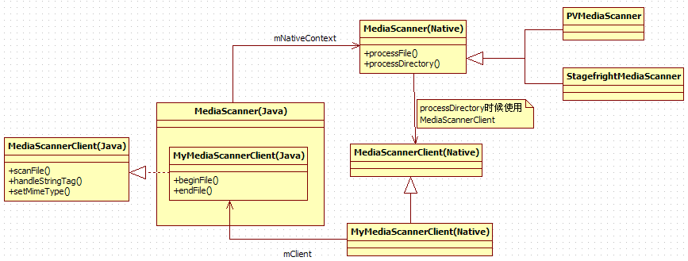
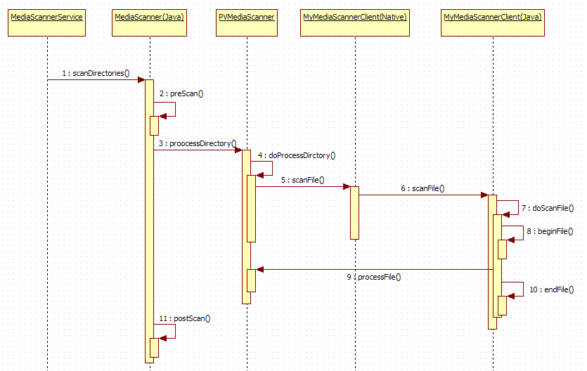

<h1>第10章 深入理解MediaScanner</h1>
本章主要内容

·  介绍多媒体系统中媒体文件扫描的工作原理。

本章涉及的源代码文件名及位置

下面是本章分析的源码文件名及其位置。

·  MediaProvider.java

packages/providers/MediaProvider/MediaProvider.java

·  MediaScannerReceiver.java

packages/providers/MediaProvider/MediaScannerReceiver.java

·  MediaScannerService.java

packages/providers/MediaProvider/MediaScannerService.java

·  MediaScanner.java

framework/base/media/java/com/android/media/MediaScanner.java

·  MediaThumbRequest.java

packages/providers/MediaProvider/MediaThumbRequest.java

·  android_media_MediaScanner.cpp

framework/base/media/jni/android_media_MediaScanner.cpp

·  MediaScanner.cpp

framework/base/media/libmedia/MediaScanner.cpp

·  PVMediasScanner.cpp

external/opencore/android/PVMediasScanner.cpp
<h2>10.1  概述</h2>
多媒体系统，是Android平台中非常庞大的一个系统。不过由于篇幅所限，本章只介绍多媒体系统中的重要一员MediaScanner。MediaScanner有什么用呢？可能有些读者还不是很清楚。MediaScanner和媒体文件扫描有关，例如，在Music应用程序中见到的歌曲专辑名、歌曲时长等信息，都是通过它扫描对应的歌曲而得到的。另外，通过MediaStore接口查询媒体数据库，从而得到系统中所有媒体文件的相关信息也和MediaScanner有关，因为数据库的内容就是由MediaScanner添加的。所以MediaScanner是多媒体系统中很重要的一部分。

伴随着Android的成长，多媒体系统也发生了非常大的变化。这对开发者来说，一个非常好的消息，就是从Android 2.3开始那个令人极度郁闷的OpenCore，终于有被干掉的可能了。从此，也迎来了Stagefright时代。但Android 2.2在很长一段时间内还会存在，所以希望以后能有机会深入地剖析这个OpenCore。

下面，就来分析媒体文件扫描的工作原理。
<h2>10.2  android.process.media的分析</h2>
多媒体系统的媒体扫描功能，是通过一个APK应用程序提供的，它位于package/providers/MediaProvider目录下。通过分析APK的Android.mk文件可知，该APK运行时指定了一个进程名，如下所示：

application android:process=android.process.media

原来，通过ps命令经常看到的进程就是它啊！另外，从这个APK程序所处的package\providers目录也可知道，它还是一个ContentProvider。事实上从Android应用程序的四大组件来看，它使用了其中的三个组件：

·  MediaScannerService（从Service派生）模块负责扫描媒体文件，然后将扫描得到的信息插入到媒体数据库中。

·  MediaProvider（从ContentProvider派生）模块负责处理针对这些媒体文件的数据库操作请求，例如查询、删除、更新等。

·  MediaScannerReceiver（从BroadcastReceiver派生）模块负责接收外界发来的扫描请求。也就是MS对外提供的接口。

除了支持通过广播发送扫描请求外，MediaScannerService也支持利用Binder机制跨进程调用扫描函数。这部分内容，将在本章的拓展部分中介绍。

本章仅关注android.process.media进程中的MediaScannerService和MediaScannerReceiver模块，为书写方便起见，将这两个模块简称为MSS和MSR，另外将MediaScanner简称MS，将MediaProvider简称MP。

下面，开始分析android.process.media中和媒体文件扫描相关的工作流程。
<h3>10.2.1  MSR模块的分析</h3>
MSR模块的核心类MediaScannerReceiver从BroadcastReceiver派生，它是专门用来接收广播的，那么它感兴趣的广播有哪几种呢？其代码如下所示：

[--&gt;MediaScannerReceiver.java]

public class MediaScannerReceiver extendsBroadcastReceiver

{

private final static String TAG ="MediaScannerReceiver";

   @Override  //MSR在onReceive函数中处理广播

    publicvoid onReceive(Context context, Intent intent) {

       String action = intent.getAction();

       Uri uri = intent.getData();

        //一般手机外部存储的路径是/mnt/sdcard

       String externalStoragePath =

                      Environment.getExternalStorageDirectory().getPath();

         

        //为了简化书写，所有Intent的ACTION_XXX_YYY字串都会简写为XXX_YYY。

        if(action.equals(Intent.ACTION_BOOT_COMPLETED)) {

            //如果收到BOOT_COMPLETED广播，则启动内部存储区的扫描工作，内部存储区

           //实际上扫描的是/system/media目录，这里存储了系统自带的铃声等媒体文件。

            scan(context, MediaProvider.INTERNAL_VOLUME);

        }else {

           if (uri.getScheme().equals("file")) {

                String path = uri.getPath();

             /*

注意下面这个判断，如果收到MEDIA_MOUNTED消息，并且外部存储挂载的路径

               和“/mnt/sdcard“一样，则启动外部存储也就是SD卡的扫描工作

               */

               if (action.equals(Intent.ACTION_MEDIA_MOUNTED) &amp;&amp; 

                       externalStoragePath.equals(path)) {

                    scan(context,MediaProvider.EXTERNAL_VOLUME);

                } else if(action.equals(Intent.ACTION_MEDIA_SCANNER_SCAN_FILE) 

&amp;&amp; path != null 

&amp;&amp; path.startsWith(externalStoragePath +"/")) {

                    /*

外部应用可以发送MEDIA_SCANNER_SCAN_FILE广播让MSR启动单个文件

的扫描工作。注意这个文件必须位于SD卡上。

*/

                    scanFile(context, path);

               }

           }

        }

    }

从上面代码中发现MSR接收的三种请求，也就是说，它对外提供三个接口函数：

·  接收BOOT_COMPLETED请求，这样MSR会启动内部存储区的扫描工作，注意这个内部存储区实际上是/system/media这个目录。

·  接收MEDIA_MOUNTED请求，并且该请求携带的外部存储挂载点路径必须是/mnt/sdcard，通过这种方式MSR会启动外部存储区也就是SD卡的扫描工作，扫描目标是文件夹/mnt/sdcard。

·  接收MEDIA_SCANNER_SCAN_FILE请求，并且该请求必须是SD卡上的一个文件，即文件路径须以/mnt/sdcard开头，这样，MSR会启动针对这个文件的扫描工作。

读者是否注意到，MSR和跨Binder调用的接口（在本章拓展内容中将介绍）都不支持对目录的扫描（除了SD卡的根目录外）。实现这个功能并不复杂，有兴趣的读者可自行完成该功能，如果方便，请将自己实现的代码与大家共享。

大部分的媒体文件都已放在SD卡上了，那么来看收到MEDIA_MOUNTED请求后MSR的工作。还记得第9章中对Vold的分析吗？这个MEDIA_MOUNTED广播就是由MountService发送的，一旦有SD卡被挂载，MSR就会被这个广播唤醒，接着SD卡的媒体文件就会被扫描了。真是一气呵成！

SD卡根目录扫描时调用的函数scan的代码如下：

[--&gt;MediaScannerReceiver.java]

private void scan(Context context, Stringvolume) {

       //volume的值为/mnt/sdcard

        Bundleargs = new Bundle();

       args.putString("volume", volume);

        //启动MSS。

       context.startService(

               new Intent(context, MediaScannerService.class).putExtras(args));

    }  

scan将启动MSS服务。下面来看MSS的工作。
<h3>10.2.2  MSS模块的分析</h3>
MSS从Service派生，并且实现了Runnable接口。下面是它的定义：

[--&gt;MediaScannerService.java]

MediaScannerService extends Service implementsRunnable

//MSS实现了Runnable接口，这表明它可能会创建工作线程

根据SDK中对Service生命周期的描述，Service刚创建时会调用onCreate函数，接着就是onStartCommand函数，之后外界每调用一次startService都会触发onStartCommand函数。接下来去了解一下onCreate函数及onStartCommand函数。
<h4>1. onCreate的分析</h4>
onCreate函数的代码如下所示：（这是MSS被系统创建时调用的，在它的整个生命周期内仅调用一次。）

[--&gt;MediaScannerService.java]

public void onCreate(){

   //获得电源锁，防止在扫描过程中休眠

  PowerManager pm = (PowerManager)getSystemService(Context.POWER_SERVICE);

  mWakeLock = pm.newWakeLock(PowerManager.PARTIAL_WAKE_LOCK, TAG);

//扫描工作是一个漫长的工程，所以这里单独创建一个工作线程，线程函数就是

//MSS实现的Run函数

    Threadthr = new Thread(null, this, "MediaScannerService");

   thr.start();

|

onCreate将创建一个工作线程：

 publicvoid run()

    {

        /*

设置本线程的优先级，这个函数的调用有很重要的作用，因为媒体扫描可能会耗费很长

          时间，如果不调低优先级的话，CPU将一直被MSS占用，导致用户感觉系统变得很慢

        */

       Process.setThreadPriority(Process.THREAD_PRIORITY_BACKGROUND +

                                Process.THREAD_PRIORITY_LESS_FAVORABLE);

        Looper.prepare();

 

       mServiceLooper = Looper.myLooper();

        /*

创建一个Handler，以后发送给这个Handler的消息都会由工作线程处理。

这一部分内容，已在第5章Handler中分析过了。

*/

       mServiceHandler = new ServiceHandler(); 

 

       Looper.loop();

}

onCreate后，MSS将会创建一个带消息处理机制的工作线程，那么消息是怎么投递到这个线程中的呢？
<h4>2. onStartCommand的分析</h4>
还记得MSR的scan函数吗？如下所示：

[--&gt;MediaScannerReceiver.java::scan函数]

context.startService(

               new Intent(context, MediaScannerService.class).putExtras(args));

其中Intent包含了目录扫描请求的目标/mnt/sdcard。这个Intent发出后，最终由MSS的onStartCommand收到并处理，其代码如下所示：

[--&gt;MediaScannerService.java]

@Override

 publicint onStartCommand(Intent intent, int flags, int startId)

 { 

     /*

等待mServiceHandler被创建。耕耘这段代码的码农难道不知道

HandlerThread这个类吗？不熟悉它的读者请再阅读第5章的5.4节。

     */

     while(mServiceHandler == null) {

           synchronized (this) {

               try {

                    wait(100);

               } catch (InterruptedException e) {

               }

           }

        }

       ......

       Message msg = mServiceHandler.obtainMessage();

       msg.arg1 = startId;

       msg.obj = intent.getExtras();

//往这个Handler投递消息，最终由工作线程处理。

       mServiceHandler.sendMessage(msg);

         ......

}

onStartCommand将把扫描请求信息投递到工作线程去处理。
<h4>3. 处理扫描请求</h4>
扫描请求由ServiceHandler的handleMessage函数处理，其代码如下所示：

[--&gt;MediaScannerService.java]

private final class ServiceHandler extendsHandler

{

     @Override

    public void handleMessage(Message msg)

        {

           Bundle arguments = (Bundle) msg.obj;

           String filePath = arguments.getString("filepath");

           

           try {

                 ......

               } else {

                    String volume =arguments.getString("volume");

                    String[] directories =null;

                    if(MediaProvider.INTERNAL_VOLUME.equals(volume)) {

                     //如果是扫描内部存储的话，实际上扫描的目录是/system/media   

                      directories = newString[] {

                               Environment.getRootDirectory() + "/media",

                        };

                    }

                    else if (MediaProvider.EXTERNAL_VOLUME.equals(volume)){

                      //扫描外部存储，设置扫描目标位/mnt/sdcard  

                       directories = new String[]{

 Environment.getExternalStorageDirectory().getPath()};

                    }

                    if (directories != null) {

/*

调用scan函数开展文件夹扫描工作，可以一次为这个函数设置多个目标文件夹，

不过这里只有/mnt/sdcard一个目录

*/

                    scan(directories, volume);

                     ......

                    stopSelf(msg.arg1);

               }

}

下面，单独用一小节来分析这个scan函数。
<h4>4. MSS的scan函数分析</h4>
scan的代码如下所示：

[--&gt;MediaScannerService.java]

private void scan(String[] directories, StringvolumeName) {

    mWakeLock.acquire();

 

  ContentValuesvalues = new ContentValues();

  values.put(MediaStore.MEDIA_SCANNER_VOLUME, volumeName);

   //MSS通过insert特殊Uri让MediaProvider做一些准备工作

   UriscanUri = getContentResolver().insert(

MediaStore.getMediaScannerUri(), values);

 

   Uri uri= Uri.parse("file://" + directories[0]);

   //向系统发送一个MEDIA_SCANNER_STARTED广播。

  sendBroadcast(new Intent(Intent.ACTION_MEDIA_SCANNER_STARTED, uri));

       try {

          //openDatabase函数也是通过insert特殊Uri让MediaProvider打开数据库

           if (volumeName.equals(MediaProvider.EXTERNAL_VOLUME)) {

                openDatabase(volumeName);    

           }

        //创建媒体扫描器，并调用它的scanDirectories函数扫描目标文件夹

       MediaScanner scanner = createMediaScanner();

          scanner.scanDirectories(directories,volumeName);

        } 

         ......

//通过特殊Uri让MediaProvider做一些清理工作

       getContentResolver().delete(scanUri, null, null);

//向系统发送MEDIA_SCANNER_FINISHED广播

       sendBroadcast(new Intent(Intent.ACTION_MEDIA_SCANNER_FINISHED, uri));

 

       mWakeLock.release();

}

上面代码中，比较复杂的是MSS和MP的交互。除了后文中即将看到的正常数据库操作外，MSS还经常会使用一些特殊的Uri来做数据库操作，而MP针对这些Uri会做一些特殊处理，例如打开数据库文件等。

本章不拟对MediaProvider做过多的讨论，这部分知识对那些读完前9章的读者来说，应该不是什么难题。如有可能，请读者自己整理MediaProvider的工作流程，然后提供给大家一起学习，探讨。

看MSS中创建媒体扫描器的函数createMediaScanner：

private MediaScanner createMediaScanner() {

//下面这个MediaScanner是在framework/base/中，稍后再分析

       MediaScanner scanner = new MediaScanner(this);

//获取当前系统使用的区域信息，扫描的时候将把媒体文件中的信息转换成当前系统使用的语言

       Locale locale = getResources().getConfiguration().locale;

        if(locale != null) {

           String language = locale.getLanguage();

           String country = locale.getCountry();

           String localeString = null;

           if (language != null) {

               if (country != null) {

//为扫描器设置当前系统使用的国家和语言。

                    scanner.setLocale(language+ "_" + country);

               } else {

                   scanner.setLocale(language);

               }

           }    

        }

       return scanner;

}

MSS模块扫描的工作就到此为止了，下面轮到主角MediaScanner登场了。在介绍主角之前，不妨先总结一下本节的内容。
<h3>10.2.3  android.process.media媒体扫描工作的流程总结</h3>
媒体扫描工作流程涉及MSR和MSS的交互，来总结一下相关的流程：

·  MSR接收外部发来的扫描请求，并通过startService方式启动MSS处理。

·  MSS的主线程接收MSR所收到的请求，然后投递给工作线程去处理。

·  工作线程做一些前期处理工作后（例如向系统广播扫描开始的消息），就创建媒体扫描器MediaScanner来处理扫描目标。

·  MS扫描完成后，工作线程再做一些后期处理，然后向系统发送扫描完毕的广播。

 
<h2>10.3  MediaScanner的分析</h2>
现在分析媒体扫描器MediaScanner的工作原理，它将纵跨Java层、JNI层，以及Native层。先看它在Java层中的内容。
<h3>10.3.1  Java层的分析</h3><h4>1. 创建MediaScanner</h4>
认识一下MediaScanner，它的代码如下所示：

[--&gt;MediaScanner.java]

public class MediaScanner

{

static {

       /*

加载libmedia_jni.so，这么重要的库竟然放在如此不起眼的MediaScanner类中加载。

个人觉得，可能是因为开机后多媒体系统中最先启动的就是媒体扫描工作吧。

       */

       System.loadLibrary("media_jni");

       native_init();

}

//创建媒体扫描器

public MediaScanner(Context c) {

       native_setup();//调用JNI层的函数做一些初始化工作

       ......

}

在上面的MS中，比较重要的几个调用函数是：

·  native_init和native_setup，关于它们的故事，在分析JNI层时再做介绍。

MS创建好后，MSS将调用它的scanDirectories开展扫描工作，下面来看这个函数。
<h4>2. scanDirectories的分析</h4>
scanDirectories的代码如下所示：

[--&gt;MediaScanner.java]

public void scanDirectories(String[]directories, String volumeName) {

  try {

       long start = System.currentTimeMillis();

        initialize(volumeName);//①初始化

          prescan(null);//②扫描前的预处理

        long prescan = System.currentTimeMillis();

 

         for(int i = 0; i &lt; directories.length; i++) {

/*

③ processDirectory是一个native函数，调用它来对目标文件夹进行扫描，

  其中MediaFile.sFileExtensions是一个字符串，包含了当前多媒体系统所支持的

媒体文件的后缀名，例如.MP3、.MP4等。mClient为MyMediaScannerClient类型，

它是从MediaScannerClient类派生的。它的作用我们后面再做分析。

  

*/

           processDirectory(directories[i], MediaFile.sFileExtensions,

 mClient);

           }

           long scan = System.currentTimeMillis();

           postscan(directories);//④扫描后处理

           long end = System.currentTimeMillis();

          ......//统计扫描时间等

 }

上面一共列出了四个关键点，下面逐一对其分析。
<h5>（1）initialize的分析</h5>
initialize主要是初始化一些Uri，因为扫描时需把文件的信息插入媒体数据库中，而媒体数据库针对Video、Audio、Image文件等都有对应的表，这些表的地址则由Uri表示。下面是initialize的代码：

[--&gt;MediaScanner.java]

private void initialize(String volumeName) {

//得到IMediaProvider对象，通过这个对象可以对媒体数据库进行操作。

  mMediaProvider=

 mContext.getContentResolver().acquireProvider("media");

//初始化Uri，下面分别介绍一下。

//音频表的地址，也就是数据库中的audio_meta表。

      mAudioUri =Audio.Media.getContentUri(volumeName);

      //视频表地址，也就是数据库中的video表。

     mVideoUri = Video.Media.getContentUri(volumeName);

      //图片表地址，也就是数据库中的images表。

     mImagesUri = Images.Media.getContentUri(volumeName);

      //缩略图表地址，也就是数据库中的thumbs表。

     mThumbsUri = Images.Thumbnails.getContentUri(volumeName);

      //如果扫描的是外部存储，则支持播放列表、音乐的流派等内容。

       if(!volumeName.equals("internal")) {

           mProcessPlaylists = true;

           mProcessGenres = true;

           mGenreCache = new HashMap&lt;String, Uri&gt;();

           mGenresUri = Genres.getContentUri(volumeName);

           mPlaylistsUri = Playlists.getContentUri(volumeName);

           if ( Process.supportsProcesses()) {

               //SD卡存储区域一般使用FAT文件系统，所以文件名与大小写无关

               mCaseInsensitivePaths = true; 

           }

        }

}

下面看第二个关键函数prescan。
<h5>（2）prescan的分析</h5>
在媒体扫描过程中，有个令人头疼的问题，来举个例子，这个例子会贯穿在对这个问题整体分析的过程中。例子：假设某次扫描之前SD卡中有100个媒体文件，数据库中有100条关于这些文件的记录，现因某种原因删除了其中的50个媒体文件，那么媒体数据库什么时候会被更新呢？

读者别小瞧这个问题。现在有很多文件管理器支持删除文件和文件夹，它们用起来很方便，却没有对应地更新数据库，这导致了查询数据库时还能得到这些媒体文件信息，但这个文件实际上已不存在了，而且后面所有和此文件有关的操作都会因此而失败。

其实，MS已经考虑到这一点了，prescan函数的主要作用是在扫描之前把数据库中和文件相关的信息取出并保存起来，这些信息主要是媒体文件的路径，所属表的Uri。就上面这个例子来说，它会从数据库中取出100个文件的文件信息。

prescan的代码如下所示：

[--&gt;MediaScanner.java]

 privatevoid prescan(String filePath) throws RemoteException {

       Cursor c = null;

       String where = null;

       String[] selectionArgs = null;

        //mFileCache保存从数据库中获取的文件信息。

        if(mFileCache == null) {

           mFileCache = new HashMap&lt;String, FileCacheEntry&gt;();

        }else {

           mFileCache.clear();

        }

        ......

       try {

           //从Audio表中查询其中和音频文件相关的文件信息。

           if (filePath != null) {

               where = MediaStore.Audio.Media.DATA + "=?";

               selectionArgs = new String[] { filePath };

           }

           //查询数据库的Audio表，获取对应的音频文件信息。

           c = mMediaProvider.query(mAudioUri, AUDIO_PROJECTION, where,

 selectionArgs,null);

            if (c != null) {

               try {

                    while (c.moveToNext()) {

                        long rowId =c.getLong(ID_AUDIO_COLUMN_INDEX);

                        //音频文件的路径

                        String path =c.getString(PATH_AUDIO_COLUMN_INDEX);

                        long lastModified =

 c.getLong(DATE_MODIFIED_AUDIO_COLUMN_INDEX);

 

                         if(path.startsWith("/")) {

                            String key = path;

                            if(mCaseInsensitivePaths) {

                                key =path.toLowerCase();

                            }

                           //把文件信息存到mFileCache中

                            mFileCache.put(key,

new FileCacheEntry(mAudioUri, rowId, path,

                                 lastModified));

                        }

                    }

               } finally {

                    c.close();

                    c = null;

               }

           }

         ......//查询其他表，取出数据中关于视频，图像等文件的信息并存入到mFileCache中。

       finally {

           if (c != null) {

               c.close();

           }

        }

    }

懂了前面的例子，在阅读prescan函数时可能就比较轻松了。prescan函数执行完后，mFileCache保存了扫描前所有媒体文件的信息，这些信息是从数据库中查询得来的，也就是旧有的信息。

接下来，看最后两个关键函数。
<h5>（3）processDirectory和postscan的分析</h5>
processDirectory是一个native函数，其具体功能放到JNI层再分析，这里先简单介绍，它在解决上一节那个例子中提出的问题时，所做的工作。答案是：

processDirectory将扫描SD卡，每扫描一个文件，都会设置mFileCache中对应文件的一个叫mSeenInFileSystem的变量为true。这个值表示这个文件目前还存在于SD卡上。这样，待整个SD卡扫描完后，mFileCache的那100个文件中就会有50个文件的mSeenInFileSystem为true，而剩下的另50个文件则为初始值false。

看到上面的内容，可以知道postscan的作用了吧？就是它把不存在于SD卡的文件信息从数据库中删除，而使数据库得以彻底更新的。来看postscan函数是否是这样处理的：

[--&gt;MediaScanner.java]

private void postscan(String[] directories)throws RemoteException {

 

Iterator&lt;FileCacheEntry&gt; iterator =mFileCache.values().iterator();

  while(iterator.hasNext()) {

           FileCacheEntry entry = iterator.next();

           String path = entry.mPath;

 

           boolean fileMissing = false;

           if (!entry.mSeenInFileSystem) {

               if (inScanDirectory(path, directories)) {

                    fileMissing = true; //这个文件确实丢失了

               } else {

                    File testFile = newFile(path);

                    if (!testFile.exists()) {

                        fileMissing = true;

                    }

               }

           }

        //如果文件确实丢失，则需要把数据库中和它相关的信息删除。

        if(fileMissing) {

          MediaFile.MediaFileType mediaFileType = MediaFile.getFileType(path);

          int fileType = (mediaFileType == null ? 0 : mediaFileType.fileType);

          if(MediaFile.isPlayListFileType(fileType)) {

                     ......//处理丢失文件是播放列表的情况

            } else {

              /*

由于文件信息中还携带了它在数据库中的相关信息，所以从数据库中删除对应的信息会

非常快。

              */

              mMediaProvider.delete(ContentUris.withAppendedId(

entry.mTableUri, entry.mRowId), null, null);

            iterator.remove();

            }

          }

     }

    ......//删除缩略图文件等工作

}

Java层中的四个关键点，至此已介绍了三个，另外一个processDirectory是媒体扫描的关键函数，由于它是一个native函数，所以下面将转战到JNI层来进行分析。

 
<h3>10.3.2  JNI层的分析</h3>
现在分析MS的JNI层。在Java层中，有三个函数涉及JNI层，它们是：

·  native_init，这个函数由MediaScanner类的static块调用。

·  native_setup，这个函数由MediaScanner的构造函数调用。

·  processDirectory，这个函数由MS扫描文件夹时调用。

分别来分析它们。
<h4>1. native_init函数的分析</h4>
下面是native_init对应的JNI函数，其代码如下所示：

[--&gt;android_media_MediaScanner.cpp]

static void

android_media_MediaScanner_native_init(JNIEnv*env)

{

    jclass clazz;

clazz =env-&gt;FindClass("android/media/MediaScanner");

//取得Java中MS类的mNativeContext信息。待会创建Native对象的指针会保存

//到JavaMS对象的mNativeContext变量中。

     fields.context = env-&gt;GetFieldID(clazz,"mNativeContext", "I");

     ...... 

}

native_init函数没什么新意，这种把Native对象的指针保存到Java对象中的做法，已经屡见不鲜。下面看第二个函数native_setup。
<h4>2. native_setup函数的分析</h4>
native_setup对应的JNI函数如下所示：

[--&gt;android_media_MediaScanner.cpp]

android_media_MediaScanner_native_setup(JNIEnv*env, jobject thiz)

{

//创建Native层的MediaScanner对象

MediaScanner*mp = createMediaScanner();

......

//把mp的指针保存到Java MS对象的mNativeContext中去

env-&gt;SetIntField(thiz,fields.context, (int)mp);

}

//下面的createMediaScanner这个函数将创建一个Native的MS对象

static MediaScanner *createMediaScanner() {

#if BUILD_WITH_FULL_STAGEFRIGHT

    charvalue[PROPERTY_VALUE_MAX];

    if(property_get("media.stagefright.enable-scan", value, NULL)

       &amp;&amp; (!strcmp(value, "1") || !strcasecmp(value,"true"))) {

       return new StagefrightMediaScanner; //使用Stagefright的MS

    }

#endif

#ifndef NO_OPENCORE

    returnnew PVMediaScanner(); //使用Opencore的MS，我们会分析这个

#endif

    returnNULL;

}

native_setup函数将创建一个Native层的MS对象，不过可惜的是，它使用的还是Opencore提供的PVMediaScanner，所以后面还不可避免地会和Opencore“正面交锋”。
<h4>4. processDirectory函数的分析</h4>
看processDirectories函数，它对应的JNI函数代码如下所示：

[--&gt;android_media_MediaScanner.cpp]

android_media_MediaScanner_processDirectory(JNIEnv*env, jobject thiz, 

jstring path, jstring extensions, jobject client)

{

   /*

注意上面传入的参数,path为目标文件夹的路径，extensions为MS支持的媒体文件后缀名集合，

client为Java中的MediaScannerClient对象。

*/

 

MediaScanner *mp = (MediaScanner*)env-&gt;GetIntField(thiz, fields.context);

 

    constchar *pathStr = env-&gt;GetStringUTFChars(path, NULL);

constchar *extensionsStr = env-&gt;GetStringUTFChars(extensions, NULL);

......

   

   //构造一个Native层的MyMediaScannerClient，并使用Java那个Client对象做参数。

   //这个Native层的Client简称为MyMSC。

MyMediaScannerClient myClient(env, client);

//调用Native的MS扫描文件夹，并且把Native的MyMSC传进去。

mp-&gt;processDirectory(pathStr,extensionsStr, myClient, 

ExceptionCheck, env);

    ......

   env-&gt;ReleaseStringUTFChars(path, pathStr);

env-&gt;ReleaseStringUTFChars(extensions,extensionsStr);

......

}

processDirectory函数本身倒不难，但又冒出了几个我们之前没有接触过的类型，下面先来认识一下它们。
<h4>5. 到底有多少种对象？</h4>
图10-1展示了MediaScanner所涉及的相关类和它们之间的关系：

 

图10-1  MS相关类示意图

为了便于理解，便将Java和Native层的对象都画于图中。从上图可知：

·  Java MS对象通过mNativeContext指向Native的MS对象。

·  Native的MyMSC对象通过mClient保存Java层的MyMSC对象。

·  Native的MS对象调用processDirectory函数的时候会使用Native的MyMSC对象。

·  另外，图中Native MS类的processFile是一个虚函数，需要派生类来实现。

其中比较费解的是MyMSC对象。它们有什么用呢？这个问题真是一言难尽。下面通过processDirectory来探寻其中原因，这回得进入PVMediaScanner的领地了。
<h3>10.3.3  PVMediaScanner的分析</h3><h4>1. PVMS的processDirectory分析</h4>
来看PVMediaScanner（以后简称为PVMS，它就是Native层的MS）的processDirectory函数。这个函数是由它的基类MS实现的。注意，源码中有两个MediaScanner.cpp，它们的位置分别是：

·  framework/base/media/libmedia

·  external/opencore/android/

看libmedia下的那个MediaScanner.cpp，其中processDirectory函数的代码如下所示：

[--&gt;MediaScanner.cpp]

status_t MediaScanner::processDirectory(constchar *path, 

const char *extensions, MediaScannerClient&amp;client,

                          ExceptionCheckexceptionCheck, void *exceptionEnv) {

     

   ......//做一些准备工作

   client.setLocale(locale()); //给Native的MyMSC设置locale信息

   //调用doProcessDirectory函数扫描文件夹

status_tresult =  doProcessDirectory(pathBuffer,pathRemaining, 

extensions, client,exceptionCheck, exceptionEnv);

 

   free(pathBuffer);

 

    returnresult;

}

//下面直接看这个doProcessDirectory函数

status_t MediaScanner::doProcessDirectory(char*path, int pathRemaining, 

const char *extensions,MediaScannerClient&amp;client, 

ExceptionCheck exceptionCheck,void *exceptionEnv) {

    

   ......//忽略.nomedia文件夹

 

    DIR*dir = opendir(path);

    ......

 

while((entry = readdir(dir))) {

    //枚举目录中的文件和子文件夹信息

       const char* name = entry-&gt;d_name;

        ......

       int type = entry-&gt;d_type;

         ......

        if(type == DT_REG || type == DT_DIR) {

           int nameLength = strlen(name);

           bool isDirectory = (type == DT_DIR);

          ......

           strcpy(fileSpot, name);

           if (isDirectory) {

               ......

                //如果是子文件夹，则递归调用doProcessDirectory

               int err = doProcessDirectory(path, pathRemaining - nameLength - 1, 

extensions, client, exceptionCheck, exceptionEnv);

               ......

           } else if (fileMatchesExtension(path, extensions)) {

               //如果该文件是MS支持的类型（根据文件的后缀名来判断）

                struct stat statbuf;

               stat(path, &amp;statbuf); //取出文件的修改时间和文件的大小

               if (statbuf.st_size &gt; 0) {

                    //如果该文件大小非零，则调用MyMSC的scanFile函数！！？

                    client.scanFile(path,statbuf.st_mtime, statbuf.st_size);

               }

               if (exceptionCheck &amp;&amp; exceptionCheck(exceptionEnv)) gotofailure;

           }

        }

    }

......

}

假设正在扫描的媒体文件的类型是属于MS支持的，那么，上面代码中最不可思议的是，它竟然调用了MSC的scanFile来处理这个文件，也就是说，MediaScanner调用MediaScannerClient的scanFile函数。这是为什么呢？还是来看看这个MSC的scanFile吧。
<h4>2. MyMSC的scanFile分析</h4><h5>（1）JNI层的scanFile</h5>
其实，在调用processDirectory时，所传入的MSC对象的真实类型是MyMediaScannerClient，下面来看它的scanFile函数，代码如下所示：

[--&gt;android_media_MediaScanner.cpp]

virtual bool scanFile(const char* path, longlong lastModified, 

long long fileSize)

    {

       jstring pathStr;

        if((pathStr = mEnv-&gt;NewStringUTF(path)) == NULL) return false;

       //mClient是Java层的那个MyMSC对象，这里调用它的scanFile函数

       mEnv-&gt;CallVoidMethod(mClient, mScanFileMethodID, pathStr, 

lastModified, fileSize);

 

       mEnv-&gt;DeleteLocalRef(pathStr);

       return (!mEnv-&gt;ExceptionCheck());

}

太没有天理了！Native的MyMSCscanFile主要的工作就是调用Java层MyMSC的scanFile函数。这又是为什么呢？
<h5>（2）Java层的scanFile</h5>
现在只能来看Java层的这个MyMSC对象了，它的scanFile代码如下所示：

[--&gt;MediaScanner.java]

public void scanFile(String path, longlastModified, long fileSize) {

           ...... 

           //调用doScanFile函数

           doScanFile(path, null, lastModified, fileSize, false);

        }

//直接来看doScanFile函数

 publicUri doScanFile(String path, String mimeType, long lastModified, 

long fileSize, boolean scanAlways) {

  /*

上面参数中的scanAlways用于控制是否强制扫描，有时候一些文件在前后两次扫描过程中没有

发生变化，这时候MS可以不处理这些文件。如果scanAlways为true，则这些没有变化

的文件也要扫描。

  */

   Uriresult = null;

long t1 = System.currentTimeMillis();

try{

     /*

      beginFile的主要工作，就是将保存在mFileCache中的对应文件信息的

mSeenInFileSystem设为true。如果这个文件之前没有在mFileCache中保存，

则会创建一个新项添加到mFileCache中。另外它还会根据传入的lastModified值

做一些处理，以判断这个文件是否在前后两次扫描的这个时间段内被修改，如果有修改，则

需要重新扫描

*/

          FileCacheEntryentry = beginFile(path, mimeType, 

lastModified, fileSize);

         if(entry != null &amp;&amp; (entry.mLastModifiedChanged || scanAlways)) {

             String lowpath = path.toLowerCase();

             ......

 

             if (!MediaFile.isImageFileType(mFileType)) {

//如果不是图片，则调用processFile进行扫描，而图片不需要扫描就可以处理

//注意在调用processFile时把这个Java的MyMSC对象又传了进去。

               processFile(path, mimeType, this);

             }

//扫描完后，需要把新的信息插入数据库，或者要将原有的信息更新，而endFile就是做这项工作的。

            result = endFile(entry, ringtones, notifications, 

alarms, music, podcasts);

                }

           } ......

           return result;

        }

下面看这个processFile，这又是一个native的函数。

上面代码中的beginFile和endFile函数比较简单，读者可以自行研究。

<h5>（3）JNI层的processFile分析</h5>
MediaScanner的代码有点绕，是不是？总感觉我们像追兵一样，追着MS在赤水来回地绕，现在应该是二渡赤水了。来看这个processFile函数，代码如下所示：

[--&gt;android_media_MediaScanner.cpp]

android_media_MediaScanner_processFile(JNIEnv*env, jobject thiz, 

jstring path, jstring mimeType, jobject client)

{

   //Native的MS还是那个MS，其真实类型是PVMS。

   MediaScanner *mp = (MediaScanner *)env-&gt;GetIntField(thiz,fields.context);

  //又构造了一个新的Native的MyMSC，不过它指向的Java层的MyMSC没有变化。

MyMediaScannerClient myClient(env, client);

//调用PVMS的processFile处理这个文件。

mp-&gt;processFile(pathStr,mimeTypeStr, myClient);

}

看来，现在得去看看PVMS的processFile函数了。
<h4>3. PVMS的processFile分析</h4><h5>（1）扫描文件</h5>
这是我们第一次进入到PVMS的代码中进行分析：

[--&gt;PVMediaScanner.cpp]

status_t PVMediaScanner::processFile(const char*path, const char* mimeType,

 MediaScannerClient&amp; client)

{

   status_t result;

   InitializeForThread();

   

    //调用Native MyMSC对象的函数做一些处理

client.setLocale(locale());

/*

beginFile由基类MSC实现，这个函数将构造两个字符串数组，一个叫mNames，另一个叫mValues。

这两个变量的作用和字符编码有关，后面会碰到。

   */

   client.beginFile();

    ......

    constchar* extension = strrchr(path, '.');

    //根据文件后缀名来做不同的扫描处理

    if(extension &amp;&amp; strcasecmp(extension, ".mp3") == 0) {

       result = parseMP3(path, client);//client又传进去了,我们看看对MP3文件的处理

    ......

} 

  /*

endFile会根据client设置的区域信息来对mValues中的字符串做语言转换，例如一首MP3

   中的媒体信息是韩文，而手机设置的语言为简体中文，endFile会尽量对这些韩文进行转换。

   不过语言转换向来是个大难题，不能保证所有语言的文字都能相互转换。转换后的每一个value都

会调用handleStringTag做后续处理。

*/

client.endFile();

......

}

下面再到parseMP3这个函数中去看看，它的代码如下所示：

[--&gt;PVMediaScanner.cpp]

static PVMFStatus parseMP3(const char *filename,MediaScannerClient&amp; client)

{

  //对MP3文件进行解析，得到诸如duration、流派、标题的TAG（标签）信息。在Windows平台上

//可通过千千静听软件查看MP3文件的所有TAG信息

   ...... 

//MP3文件已经扫描完了，下面将这些TAG信息添加到MyMSC中，一起看看

   if(!client.addStringTag("duration", buffer)) 

       ......

}

<h5>（2）添加TAG信息</h5>
文件扫描完了，现在需要把文件中的信息通过addStringTag函数告诉给MyMSC。下面来看addStringTag的工作。这个函数由MyMSC的基类MSC处理。

[--&gt;MediaScannerClient.cpp]

bool MediaScannerClient::addStringTag(constchar* name, const char* value)

{

    if(mLocaleEncoding != kEncodingNone) {

       bool nonAscii = false;

       const char* chp = value;

       char ch;

       while ((ch = *chp++)) {

           if (ch &amp; 0x80) {

               nonAscii = true;

               break;

           }

        }

      /*

判断name和value的编码是不是ASCII，如果不是的话则保存到

mNames和mValues中，等到endFile函数的时候再集中做字符集转换。

     */   

        if(nonAscii) {

           mNames-&gt;push_back(name);

           mValues-&gt;push_back(value);

            return true;

        }

}

//如果字符编码是ASCII的话，则调用handleStringTag函数，这个函数由子类MyMSC实现。

    returnhandleStringTag(name, value);

}

[--&gt;android_media_MediaScanner.cpp::MyMediaScannerClient类]

virtual bool handleStringTag(const char* name,const char* value)

{

......

//调用Java层MyMSC对象的handleStringTag进行处理

  mEnv-&gt;CallVoidMethod(mClient, mHandleStringTagMethodID, nameStr,valueStr);

}

[--&gt;MediaScanner.java]

  publicvoid handleStringTag(String name, String value) {

           //保存这些TAG信息到MyMSC对应的成员变量中去。

           if (name.equalsIgnoreCase("title") ||name.startsWith("title;")) {

               mTitle = value;

           } else if (name.equalsIgnoreCase("artist") ||

 name.startsWith("artist;")) {

               mArtist = value.trim();

           } else if (name.equalsIgnoreCase("albumartist") ||

 name.startsWith("albumartist;")) {

               mAlbumArtist = value.trim();

           } 

......

  }

到这里，一个文件的扫描就算做完了。不过，读者还记得是什么时候把这些信息保存到数据库的吗？

是在Java层MyMSC对象的endFile中，这时它会把文件信息组织起来，然后存入媒体数据库。
<h3>10.3.4  MediaScanner的总结</h3>
下面总结一下媒体扫描的工作流程，它并不复杂，就是有些绕，如图10-2所示：

 

图10-2  MediaScanner扫描流程图

通过上图可以发现，MS扫描的流程还是比较清晰的，就是四渡赤水这一招，让很多初学者摸不着头脑。不过读者千万不要像我当初那样，觉得这是垃圾代码的代表。实际上这是码农有意而为之，在MediaScanner.java中通过一段比较详细的注释，对整个流程做了文字总结，这段总结非常简单，这里就不翻译了。

[--&gt;MediaScanner.java]

//前面还有一段话，读者可自行阅读。下面是流程的文件总结。

* In summary:

 * JavaMediaScannerService calls

 * JavaMediaScanner scanDirectories, which calls

 * JavaMediaScanner processDirectory (native method), which calls

 * nativeMediaScanner processDirectory, which calls

 * nativeMyMediaScannerClient scanFile, which calls

 * JavaMyMediaScannerClient scanFile, which calls

 * JavaMediaScannerClient doScanFile, which calls

 * JavaMediaScanner processFile (native method), which calls

 * nativeMediaScanner processFile, which calls

 * nativeparseMP3, parseMP4, parseMidi, parseOgg or parseWMA, which calls

 * nativeMyMediaScanner handleStringTag, which calls

 * JavaMyMediaScanner handleStringTag.

 * OnceMediaScanner processFile returns, an entry is inserted in to the database.

看完这么详细的注释，想必你也会认为，码农真是故意这么做的。但他们为什么要设计成这样呢？以后会不会改呢？注释中也说明了目前设计的流程是这样，估计以后有可能改。
<h2>10.4  拓展思考</h2><h3>10.4.1  MediaScannerConnection介绍</h3>
通过前面的介绍，我们知道MSS支持以广播方式发送扫描请求。除了这种方式外，多媒体系统还提供了一个MediaScannerConnection类，通过这个类可以直接跨进程调用MSS的scanFile，并且MSS扫描完一个文件后会通过回调来通知扫描完毕。MediaScannerConnection类的使用场景包括浏览器下载了一个媒体文件，彩信接收到一个媒体文件等，这时都可以用它来执行媒体文件的扫描工作。

下面来看这个类输出的几个重要API，由于它非常简单，所以这里就不再进行流程的分析了。

[--&gt;MediaScannerConnection.java]

public class MediaScannerConnection implementsServiceConnection {

 

 //定义OnScanCompletedListener接口，当媒体文件扫描完后，MSS调用这个接口进行通知。

 publicinterface OnScanCompletedListener {

       public void onScanCompleted(String path, Uri uri);

    }

//定义MediaScannerConnectionClient接口，派生自OnScanCompletedListener，

//它增加了MediaScannerConnection connect上MSS的通知。

public interface MediaScannerConnectionClient extends

 OnScanCompletedListener {

       public void onMediaScannerConnected();//连接MSS的回调通知。

       public void onScanCompleted(String path, Uri uri);

    }

  //构造函数。

  publicMediaScannerConnection(Context context, 

MediaScannerConnectionClient client);

  //封装了和MSS连接及断开连接的操作。

  publicvoid connect();

  publicvoid disconnect() 

  //扫描单个文件。

  publicvoid scanFile(String path, String mimeType);

  //我更喜欢下面这个静态函数，它支持多个文件的扫描，实际上间接提供了文件夹的扫描功能。

  publicstatic void scanFile(Context context, String[] paths, 

String[] mimeTypes,OnScanCompletedListener callback);

  

  ......

}

从使用者的角度来看，本人更喜欢静态的scanFile函数，一方面它封装了和MSS连接等相关的工作，另一方面它还支持多个文件的扫描，所以如没什么特殊要求，建议读者还是使用这个静态函数。
<h3>10.4.2  我问你答</h3>
本节是本书的最后一小节，相信一路走来读者对Android的认识和理解或许已有提高。下面将提几个和媒体扫描相关的问题请读者思考，或者说是提供给读者自行钻研。在解答或研究过程中，读者如有什么心得，不妨也记录并与我们共享。那些对Android有深刻见地的读者，说不定会收到我们公司HR MM的电话哦！

下面是我在研究MS过程中，觉得读者可以进行拓展研究的内容：

·  本书还没有介绍android.process.media中的MediaProvider模块，读者不妨分别把扫描一个图片、MP3歌曲、视频文件的流程走一遍，不过这个流程分析的重点是MediaProvider。

·  MP中最复杂的是缩略图的生成，读者在完成上一步的基础上，可集中精力解决缩略图生成的流程。对于视频文件缩略图的生成还会涉及MediaPlayerService。

·  到这一步，相信读者对MP已有了较全面的认识。作为深入学习的跳板，我建议有兴趣的读者可以对Android平台上和数据库有关的模块，以及ContentProvider进行深入研究。这里还会涉及很多问题，例如query返回的Cursor，是怎么把数据从MediaProvider进程传递到客户端进程的？为什么一个ContentProvider死掉后，它的客户端也会跟着被kill掉？
<h2>10.5  本章小结</h2>
本章是全书最后一章，也是最轻松的一章。这一章重点介绍了多媒体系统中和媒体文件扫描相关的知识，相信读者对媒体扫描流程中“四渡赤水”的过程印象会深刻一些。

本章拓展部分介绍了API类MediaScannerConnection的使用方法，另外，提出了几个和媒体扫描相关的问题请读者与我们共同思考。

 
 
 
版权声明：本文为博主原创文章，未经博主允许不得转载。
 
 
