<h1>第8章  深入理解Surface系统</h1>
本章主要内容

·  详细分析一个Activity的显示过程。

·  详细分析Surface。

·  详细分析SurfaceFlinger。

本章涉及的源代码文件名及位置：

· ActivityThread.java

framework/base/core/java/android/app/ActivityThread.java

·  Activity.java

framework/base/core/java/android/app/Activity.java

·  Instrumentation.java

framework/base/core/java/android/app/Instrumentation.java

·  PolicyManager.java

frameworks/policies/base/phone/com/android/internal/policy/impl/PolicyManager.java

·  Policy.java

frameworks/policies/base/phone/com/android/internal/policy/impl/Policy.java

·  PhoneWindow.java

frameworks/policies/base/phone/com/android/internal/policy/impl/PhoneWindow.java

·  Window.java

framework/base/core/java/android/view/Window.java

·  WindowManagerImpl

framework/ base/core/java/android/view/WindowManagerImpl.java

·  ViewRoot.java

framework/base/core/java/android/view/ViewRoot.java

·  Surface.java

framework/base/core/java/android/view/Surface.java

·  WindowManagerService.java

framework/base/services/java/com/android/server/WindowManagerService.java

·  IWindowSession.aidl

framework/base/core/java/android/view/IWindowSession.aidl

·  IWindow.aidl

framework/base/core/java/android/view/IWindow.aidl

·  SurfaceSession.java

framework/base/core/java/android/view/SurfaceSession.java

·  android_view_Surface.cpp

framework/base/core/jni/android_view_Surface.cpp

·  framebuffer_service.c

system/core/adb/framebuffer_service.c

·  SurfaceComposerClient.cpp

framework/base/libs/surfaceflinger_client/SurfaceComposerClient.cpp

·  SurfaceFlinger.cpp

framework/base/libs/surfaceflinger/SurfaceFlinger.cpp

·  ISurfaceComposer.h

framework/base/include/surfaceflinger/ISurfaceComposer.h

·  Layer.h

framework/base/include/surfaceflinger/Layer.h

·  Layer.cpp

framework/base/libs/surfaceflinger/Layer.cpp

·  LayerBase.cpp

framework/base/libs/surfaceflinger/LayerBase.cpp

·  Surface.cpp

framework/base/libs/surfaceflinger_client/Surface.cpp

·  SharedBufferStack.cpp

framework/base/libs/surfaceflinger_client/SharedBufferStack.cpp

·  GraphicBuffer.h

framework/base/include/ui/GraphicBuffer.h

·  GraphicBuffer.cpp

framework/base/libs/ui/GraphicBuffer.cpp

·  GraphicBufferAllocator.h

framework/base/include/ui/GraphicBufferAllocator.h

·  GraphicBufferAllocator.cpp

framework/base/libs/ui/GraphicBufferAllocator.cpp

·  GraphicBufferMapper.cpp

framework/base/libs/ui/GraphicBufferMapper.cpp

·  Android_natives.h

framework/base/include/ui/egl/Android_natives.h

·  android_native_buffer.h

framework/base/include/ui/android_native_buffer.h

·  native_handle.h

system/core/include/cutils/native_handle.h

·  gralloc.h

hardware/libhardware/include/hardware/gralloc.h

·  ISurface.cpp

framework/base/libs/surfaceflinger_client/ISurface.cpp

·  DisplayHardware.cpp

framework/base/libs/surfaceflinger/DisplayHardware.cpp
<h2><a>8.1  </a>概述</h2>
Surface是继Audio系统后要破解第二个复杂的系统。它的难度和复杂度远远超过了Audio。基于这种情况，本章将集中精力打通Surface系统的“任督二脉”，这任督二脉分别是：

·  任脉：应用程序和Surface的关系。

·  督脉：Surface和SurfaceFlinger之间的关系。

当这二脉打通后，我们就可以自行修炼更高层次的功夫了。图8-1显示了这二脉的关系：

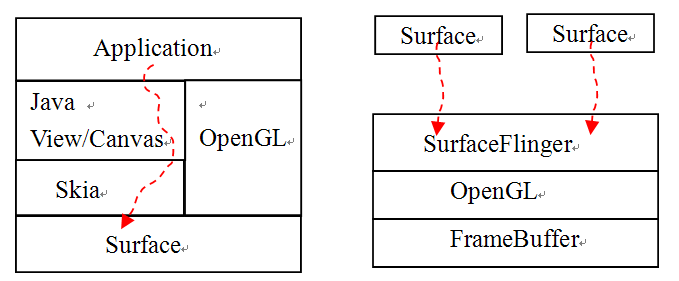 

图8-1  Surface系统的任督二脉

其中，左图是任脉，右图是督脉。

·  先看左图。可以发现，不论是使用Skia绘制二维图像，还是用OpenGL绘制三维图像，最终Application都要和Surface交互。Surface就像是UI的画布，而App则像是在Surface上作画。所以要想打通任脉，就须破解App和Surface之间的关系。

·  再看右图。Surface和SurfaceFlinger的关系，很像Audio系统中AudioTrack和AudioFlinger的关系。Surface向SurfaceFlinger提供数据，而SurfaceFlinger则混合数据。所谓打通督脉的关键，就是破解Surface和SurfaceFlinger之间的关系。

目标已清楚，让我们开始“运功”破解代码吧！

说明：为书写方便起见，后文将SurfaceFlinger简写为SF。

<h2><a>8.2  </a>一个Activity的显示</h2>
一般来说，应用程序的外表是通过Activity来展示的。那么，Activity是如何完成界面绘制工作的呢？根据前面所讲的知识，应用程序的显示和Surface有关，那么具体到Activity上，它和Surface又是什么关系呢？

本节就来讨论这些问题。首先从Activity的创建说起。
<h3><a>8.2.1  Activity</a>的创建</h3>
我们已经知道了Activity的生命周期，如onCreate、onDestroy等，但大家是否考虑过这样一个问题：

·  如果没有创建Activity，那么onCreate和onDestroy就没有任何意义，可这个Activity究竟是在哪里创建的？。 

第4章中的“Zygote分裂”一节已讲过，Zygote在响应请求后会fork一个子进程，这个子进程是App对应的进程，它的入口函数是ActivityThread类的main函数。ActivityThread类中有一个handleLaunchActivity函数，它就是创建Activity的地方。一起来看这个函数，代码如下所示：

[--&gt;ActivityThread.java]

private final voidhandleLaunchActivity(ActivityRecord r, Intent customIntent) {

       //①performLaunchActivity返回一个Activity

       Activitya = performLaunchActivity(r, customIntent);

 

        if(a != null) {

           r.createdConfig = new Configuration(mConfiguration);

           Bundle oldState = r.state;

          //②调用handleResumeActivity

           handleResumeActivity(r.token, false, r.isForward);

   }

      ......

}

handleLaunchActivity函数中列出了两个关键点，下面对其分别介绍。
<h4>1. 创建Activity</h4>
第一个关键函数performLaunchActivity返回一个Activity，这个Activity就是App中的那个Activity（仅考虑App中只有一个Activity的情况），它是怎么创建的呢？其代码如下所示：

[--&gt;ActivityThread.java]

private final ActivityperformLaunchActivity(ActivityRecord r, 

Intent customIntent) {

        

       ActivityInfo aInfo = r.activityInfo;

        ......//完成一些准备工作

      //Activity定义在Activity.java中

       Activity activity = null;

       try {

           java.lang.ClassLoader cl = r.packageInfo.getClassLoader();

     /*

     mInstrumentation为Instrumentation类型，源文件为Instrumentation.java。

     它在newActivity函数中根据Activity的类名通过Java反射机制来创建对应的Activity，

     这个函数比较复杂，待会我们再分析它。

     */

           activity = mInstrumentation.newActivity(

                    cl,component.getClassName(), r.intent);

            r.intent.setExtrasClassLoader(cl);

           if (r.state != null) {

               r.state.setClassLoader(cl);

           }

        }catch (Exception e) {

            ......

        }

 

       try {

           Application app = 

             r.packageInfo.makeApplication(false,mInstrumentation);

 

            if (activity != null) {

               //在Activity中getContext函数返回的就是这个ContextImpl类型的对象

               ContextImpl appContext = new ContextImpl();

               ......

              //下面这个函数会调用Activity的onCreate函数

               mInstrumentation.callActivityOnCreate(activity, r.state);

                ......

       return activity;

 }

好了，performLaunchActivity函数的作用明白了吧？

·  根据类名以Java反射的方法创建一个Activity。

·  调用Activity的onCreate函数，开始SDK中大书特书Activity的生命周期。

那么，在onCreate函数中，我们一般会做什么呢？在这个函数中，和UI相关的重要工作就是调用setContentView来设置UI的外观。接下去，需要看handleLaunchActivity中第二个关键函数handleResumeActivity。
<h4>2. 分析handleResumeActivity</h4>
上面已创建好了一个Activity，再来看handleResumeActivity。它的代码如下所示：

[--&gt;ActivityThread.java]

final void handleResumeActivity(IBinder token,boolean clearHide, 

boolean isForward) {

boolean willBeVisible = !a.mStartedActivity;

          

if (r.window == null &amp;&amp; !a.mFinished&amp;&amp; willBeVisible) {

      r.window= r.activity.getWindow();

      //①获得一个View对象

      Viewdecor = r.window.getDecorView();

     decor.setVisibility(View.INVISIBLE);

      //②获得ViewManager对象

      ViewManagerwm = a.getWindowManager();

      ......

      //③把刚才的decor对象加入到ViewManager中

       wm.addView(decor,l); 

   }

         ......//其他处理

}

上面有三个关键点。这些关键点似乎已经和UI部分（如View、Window）有联系了。那么这些联系是在什么时候建立的呢？在分析上面代码中的三个关键点之前，请大家想想在前面的过程中，哪些地方会和UI挂上钩呢？

·  答案就在onCreate函数中，Activity一般都在这个函数中通过setContentView设置UI界面。

看来，必须先分析setContentView，才能继续后面的征程。
<h4>3. 分析setContentView</h4>
setContentView有好几个同名函数，现在只看其中的一个就可以了。代码如下所示：

[--&gt;Activity.java]

public void setContentView(View view) {

//getWindow返回的是什么呢？一起来看看。

 getWindow().setContentView(view);

}

 

public Window getWindow() {

  returnmWindow; //返回一个类型为Window的mWindow，它是什么？

}

上面出现了两个和UI有关系的类：View和Window<a>[①]</a>。来看SDK文档是怎么描述这两个类的。这里先给出原文描述，然后进行对应翻译：

·  Window：abstract base class for a top-levelwindow look and behavior policy. An instance of this class should be used asthe top-level view added to the window manager. It provides standard UIpolicies such as a background, title area, default key processing, etc. 

中文的意思是：Window是一个抽象基类，用于控制顶层窗口的外观和行为。做为顶层窗口它有什么特殊的职能呢？即绘制背景和标题栏、默认的按键处理等。

这里面有一句比较关键的话：它将做为一个顶层的view加入到Window Manager中。

·  View：This class represents the basicbuilding block for user interface components. A View occupies a rectangulararea on the screen and is responsible for drawing and event handling. 

View的概念就比较简单了，它是一个基本的UI单元，占据屏幕的一块矩形区域，可用于绘制，并能处理事件。

从上面的View和Window的描述，再加上setContentView的代码，我们能想象一下这三者的关系，如图8-2所示：

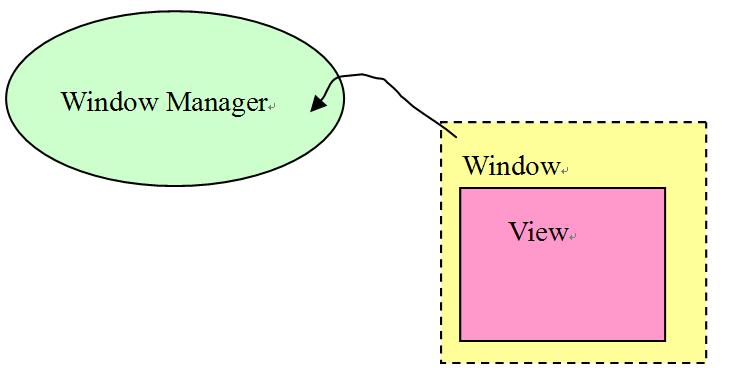 

图8-2  Window/View的假想关系图

根据上面的介绍，大家可能会产生两个疑问：

·  Window是一个抽象类，它实际的对象到底是什么类型？

·  Window Manager究竟是什么？

如果能有这样的疑问，就说明我们非常细心了。下面试来解决这两个问题。
<h5>（1）Activity的Window</h5>
据上文讲解可知，Window是一个抽象类。它实际的对象到底属于什么类型？先回到Activity创建的地方去看看。下面正是创建Activity时的代码，可当时没有深入地分析。

activity = mInstrumentation.newActivity(

                    cl,component.getClassName(), r.intent);

代码中调用了Instrumentation的newActivity，再去那里看看。

[--&gt;Instrumentation.java]

public Activity newActivity(Class&lt;?&gt;clazz, Context context, 

           IBinder token, Application application, Intent intent,

            ActivityInfo info, CharSequencetitle, Activity parent, 

String id,Object lastNonConfigurationInstance) 

throws InstantiationException, IllegalAccessException{

        

Activity activity = (Activity)clazz.newInstance();

       ActivityThread aThread = null;

        //关键函数attach!!

       activity.attach(context, aThread, this, token, application, intent, 

info, title,parent, id, lastNonConfigurationInstance,

new Configuration());

       return activity;

    }

看到关键函数attach了吧？Window的真相马上就要揭晓了，让我们用咆哮体<a>②</a>来表达内心的激动之情吧！！！！

[--&gt;Activity.java]

final void attach(Context context,ActivityThread aThread,

           Instrumentation instr, IBinder token, int ident,

           Application application, Intent intent, ActivityInfo info,

           CharSequence title, Activity parent, String id,

           Object lastNonConfigurationInstance,

           HashMap&lt;String,Object&gt; lastNonConfigurationChildInstances,

           Configuration config) {

        ......

        //利用PolicyManager来创建Window对象

       mWindow = PolicyManager.makeNewWindow(this);

       mWindow.setCallback(this);

        ......

        //创建WindowManager对象

       mWindow.setWindowManager(null, mToken, mComponent.flattenToString());

        if(mParent != null) {

           mWindow.setContainer(mParent.getWindow());

        }

       //保存这个WindowManager对象

       mWindowManager = mWindow.getWindowManager();

       mCurrentConfig = config;

}

此刻又有一点失望吧？这里冒出了个PolicyManager类，Window是由它的makeNewWindow函数所创建，因此还必须再去看看这个PolicyManager。
<h5>（2）水面下的冰山——PolicyManager</h5>
PolicyManager定义于PolicyManager.java文件，该文件在一个非常独立的目录下，现将其单独列出来：

·  frameworks/policies/base/<strong>phone</strong>/com/android/internal/policy/impl

注意，上面路径中的灰色目录phone是针对智能手机这种小屏幕的；另外还有一个平级的目录叫mid，是针对Mid设备的。mid目录的代码比较少，可能目前还没有开发完毕。

下面来看这个PolicyManager，它比较简单。

[--&gt;PolicyManager.java]

public final class PolicyManager {

   private static final String POLICY_IMPL_CLASS_NAME =

       "com.android.internal.policy.impl.Policy";

 

   private static final IPolicy sPolicy;

 

    static{

        //

       try {

           Class policyClass = Class.forName(POLICY_IMPL_CLASS_NAME);

           //创建Policy对象

           sPolicy = (IPolicy)policyClass.newInstance();

        }catch (ClassNotFoundException ex) {

            ......

       }

 

    private PolicyManager() {}

 

    //通过Policy对象的makeNewWindow创建一个Window

    publicstatic Window makeNewWindow(Context context) {

       return sPolicy.makeNewWindow(context);

    }

   ......

}

这里有一个单例的sPolicy对象，它是Policy类型，请看它的定义。
<h5>（3）真正的Window</h5>
Policy类型的定义代码如下所示：

[--&gt;Policy.java]

public class Policy implements IPolicy {

   private static final String TAG = "PhonePolicy";

 

   private static final String[] preload_classes = {

       "com.android.internal.policy.impl.PhoneLayoutInflater",

       "com.android.internal.policy.impl.PhoneWindow",

       "com.android.internal.policy.impl.PhoneWindow$1",

       "com.android.internal.policy.impl.PhoneWindow$ContextMenuCallback",

       "com.android.internal.policy.impl.PhoneWindow$DecorView",

       "com.android.internal.policy.impl.PhoneWindow$PanelFeatureState",

"com.android.internal.policy.impl.PhoneWindow$PanelFeatureState$SavedState",

    };

 

    static{

        //加载所有的类

       for (String s : preload_classes) {

           try {

               Class.forName(s);

           } catch (ClassNotFoundException ex) {

               ......

           }

        }

    }

 

public PhoneWindow makeNewWindow(Contextcontext) {

        //makeNewWindow返回的是PhoneWindow对象

       return new PhoneWindow(context);

    }

 

    ......

}

至此，终于知道了代码：

mWindow = PolicyManager.makeNewWindow(this);

返回的Window，原来是一个PhoneWindow对象。它的定义在PhoneWindow.java中。

mWindow的真实身份搞清楚了，还剩下个WindowManager。现在就来揭示其真面目。
<h5>（4）真正的WindowManager</h5>
先看WindowManager创建的代码，如下所示：

[--&gt;Activity.java]

  ......//创建mWindow对象

   //调用mWindow的setWindowManager函数

mWindow.setWindowManager(null, mToken,mComponent.flattenToString());

   .....

上面的函数设置了PhoneWindow的WindowManager，不过第一个参数是null，这是什么意思？在回答此问题之前，先来看PhoneWindow的定义，它是从Window类派生。

[--&gt;PhoneWindow.java::PhoneWindow定义]

public class PhoneWindow extends Windowimplements MenuBuilder.Callback

前面调用的setWindowManager函数，其实是由PhoneWindow的父类Window类来实现的，来看其代码，如下所示：

[--&gt;Window.java]

public void setWindowManager(WindowManagerwm,IBinder appToken, String appName) {     //注意，传入的wm值为null

       mAppToken = appToken;

       mAppName = appName;

        if(wm == null) {

          //如果wm为空的话，则创建WindowManagerImpl对象

           wm = WindowManagerImpl.getDefault();

        }

       //mWindowManager是一个LocalWindowManager

       mWindowManager = new LocalWindowManager(wm);

    }

LocalWindowManager是在Window中定义的内部类，请看它的构造函数，其定义如下所示：

[--&gt;Window.java::LocalWindowManager定义]

private class LocalWindowManager implementsWindowManager {

       LocalWindowManager(WindowManager wm) {

           mWindowManager = wm;//还好，只是简单地保存了传入的wm参数

           mDefaultDisplay = mContext.getResources().getDefaultDisplay(

                   mWindowManager.getDefaultDisplay());

        }

    ......

如上面代码所示，LocalWindowManager将保存一个WindowManager类型的对象，这个对象的实际类型是WindowManagerImpl。而WindowManagerImpl又是什么呢？来看它的代码，如下所示：

[--&gt;WindowManagerImpl.java]

public class WindowManagerImpl implementsWindowManager {

......

 

public static WindowManagerImpl getDefault()

{

     return mWindowManager; //返回的就是WindowManagerImpl对象

}

private static WindowManagerImpl mWindowManager= new WindowManagerImpl();

}

看到这里，是否有点头晕眼花？很多朋友读我的一篇与此内容相关的博文后，普遍也有如此反应。对此，试配制了一剂治晕药方，如图8-3所示：

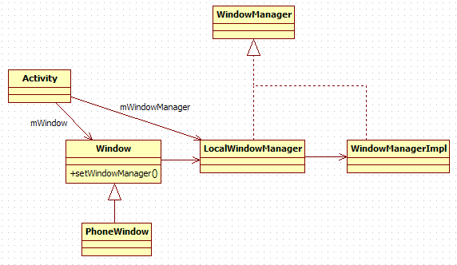 

图8-3  Window和WindowManger的家族图谱

根据上图，可得出以下结论：

·  Activity的mWindow成员变量其真实类型是PhoneWindow，而mWindowManager成员变量的真实类型是LocalWindowManager。

·  LocalWindowManager和WindowManagerImpl都实现了WindowManager接口。这里采用的是Proxy模式，表明LocalWindowManager将把它的工作委托WindowManagerImpl来完成。
<h5>（5）setContentView的总结</h5>
了解了上述知识后，重新回到setContentView函数。这次希望能分析得更深入些。

[--&gt;Activity.java]

public void setContentView(View view) {

       getWindow().setContentView(view);//getWindow返回的是PhoneWindow

}

一起来看PhoneWindow的setContentView函数，代码如下所示：

[--&gt;PhoneWindow]

public void setContentView(View view) {

   //调用另一个setContentView

   setContentView(view,

new ViewGroup.LayoutParams(MATCH_PARENT,MATCH_PARENT));

}

 

public void setContentView(View view,ViewGroup.LayoutParams params) {

   //mContentParent为ViewGroup类型，它的初值为null

     if(mContentParent == null) {

           installDecor();

     }else {

           mContentParent.removeAllViews();

     }

    //把view加入到ViewGroup中

    mContentParent.addView(view, params);

     ......

}

mContentParent是一个ViewGroup类型，它从View中派生，所以也是一个UI单元。从它名字中“Group”所表达的意思分析，它还可以包含其他的View元素。这又是什么意思呢？

·  也就是说，在绘制一个ViewGroup时，它不仅需要把自己的样子画出来，还需要把它包含的View元素的样子也画出来。读者可将它想象成一个容器，容器中的元素就是View。

这里采用的是23种设计模式中的Composite模式，它是UI编程中常用的模式之一。

再来看installDecor函数，其代码如下所示：

[--&gt;PhoneWindow.java]

private void installDecor() {

    if (mDecor == null) {

     //创建mDecor，它为DecorView类型，从FrameLayout派生

     mDecor= generateDecor();

            ...... 

   }

  if(mContentParent == null) {

     //得到这个mContentParent

mContentParent = generateLayout(mDecor);

//创建标题栏

    mTitleView= (TextView)findViewById(com.android.internal.R.id.title);

......

}

generateLayout函数的输入参数为mDecor，输出为mContentParent，代码如下所示：

[--&gt;PhoneWindow]

protected ViewGroup generateLayout(DecorViewdecor){

  ......

  intlayoutResource;

  intfeatures = getLocalFeatures();

  if((features &amp; ((1 &lt;&lt; FEATURE_LEFT_ICON) |(1 &lt;&lt;FEATURE_RIGHT_ICON))) != 0) {

      if(mIsFloating) {

      //根据情况取得对应标题栏的资源id

     layoutResource =  com.android.internal.R.layout.dialog_title_icons;

     } 

       ......

}

 

  mDecor.startChanging();

 

 View in =mLayoutInflater.inflate(layoutResource, null);

 //加入标题栏

 decor.addView(in,new ViewGroup.LayoutParams(MATCH_PARENT, MATCH_PARENT));

   /*

ID_ANDROID_CONTENT的值为”com.android.internal.R.id.content”

     这个contentParent由findViewById返回，实际上就是mDecorView的一部分。

   */

   ViewGroupcontentParent = (ViewGroup)findViewById(ID_ANDROID_CONTENT);

   ......

   mDecor.finishChanging();

   returncontentParent;

}

下面看findViewById是如何实现的。它定义在Window.java中，代码如下所示：

[--&gt;Window.java]

public View findViewById(int id) {

  //getDecorView将返回mDecorView,所以contentParent确实是DecorView的一部分

   returngetDecorView().findViewById(id);

 }

大家还记得图8-2吗？介绍完上面的知识后，根据图8-2，可绘制更细致的图8-4：

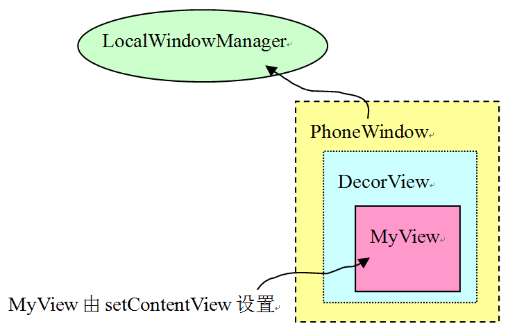 

图8-4  一个Activity中的UI组件

可从上图中看出，在Activity的onCreate函数中，通过setContentView设置的View，其实只是DecorView的子View。DecorView还处理了标题栏显示等一系列的工作。

注意，这里使用了设计模式中的Decorator（装饰）模式，它也是UI编程中常用的模式之一。

 
<h4>4. 重回handleResumeActivity</h4>
看完setContentView的分析后，不知大家是否还记得这样一个问题：为什么要分析这个setContentView函数？在继续前行之前，先来回顾一下被setContentView打断的流程。

当时，我们正在分析handleResumeActivity，代码如下所示：

[--&gt;ActivityThread.java]

final void handleResumeActivity(IBinder token,boolean clearHide, 

boolean isForward) {

 booleanwillBeVisible = !a.mStartedActivity;

......

if (r.window == null &amp;&amp; !a.mFinished&amp;&amp; willBeVisible) {

     r.window= r.activity.getWindow();

    //①获得一个View对象。现在知道这个view就是DecorView

   Viewdecor = r.window.getDecorView();

   decor.setVisibility(View.INVISIBLE);

  //②获得ViewManager对象,这个wm就是LocalWindowManager

  ViewManagerwm = a.getWindowManager();

  WindowManager.LayoutParamsl = r.window.getAttributes();

  a.mDecor= decor;

  l.type =WindowManager.LayoutParams.TYPE_BASE_APPLICATION;

  if(a.mVisibleFromClient) {

       a.mWindowAdded= true;

       //③把刚才的decor对象加入到ViewManager中

      wm.addView(decor,l); 

   }

......//其他处理

}

在上面的代码中，由于出现了多个之前不熟悉的东西，如View、ViewManager等，而这些东西的来源又和setContentView有关，所以我们才转而去分析setContentView了。想起来了吧？

由于代码比较长，跳转关系也很多，在分析代码时，请读者把握流程，在大脑中建立一个代码分析的堆栈。

下面就从addView的分析开始。如前面所介绍的，它的调用方法是：

wm.addView(decor, l);//wm类型实际是LocalWindowManager

来看这个addView函数，它的代码如下所示：

[--&gt;Window.javaLocalWindowManager]

public final void addView(View view,ViewGroup.LayoutParams params) {

   

 WindowManager.LayoutParams wp =(WindowManager.LayoutParams)params;

 CharSequence curTitle = wp.getTitle();

 ...... //做一些操作，可以不管它

//还记得前面提到过的Proxy模式吗？mWindowManager对象实际上是WindowManagerImpl类型

mWindowManager.addView(view, params);

}

看来，要搞清楚这个addView函数还是比较麻烦的，因为现在必须到WindowManagerImpl中去看看。它的代码如下所示：

[--&gt;WindowManagerImpl.java]

private void addView(View view,ViewGroup.LayoutParams params, boolean nest)

{

  ViewRootroot; //ViewRoot，幕后的主角终于登场了！

  synchronized(this) {

  //①创建ViewRoot

  root =new ViewRoot(view.getContext());

  root.mAddNesting = 1;

  view.setLayoutParams(wparams);

           

  if(mViews == null) {

      index = 1;

      mViews = new View[1];

      mRoots= new ViewRoot[1];

     mParams = new WindowManager.LayoutParams[1];

   } else{

     ......

    }

   index--;

   mViews[index]= view;

   mRoots[index]= root;//保存这个root

   mParams[index]= wparams;

 

//②setView,其中view是刚才我们介绍的DecorView

  root.setView(view,wparams, panelParentView);// 

}

“ViewRoot，ViewRoot ....”，主角终于出场了！即使没介绍它的真实身份，不禁也想欢呼几声。可为避免高兴得过早，还是应该先冷静地分析一下它。这里，列出了ViewRoot的两个重要关键点。
<h5>（1）ViewRoot是什么？</h5>
ViewRoot是什么？看起来好像和View有些许关系，至少名字非常像。事实上，它的确和View有关系，因为它实现了ViewParent接口。SDK的文档中有关于ViewParent的介绍。但它和Android基本绘图单元中的View却不太一样，比如：ViewParent不处理绘画，因为它没有onDraw函数。

如上所述，ViewParent和绘画没有关系，那么，它的作用是什么？先来看它的代码，如下所示：

[--&gt;ViewRoot.java::ViewRoot定义]

public final class ViewRoot extends Handlerimplements ViewParent,

       View.AttachInfo.Callbacks //从Handler类派生

{

private final Surface mSurface = new Surface();//这里创建了一个Surface对象

final W mWindow; //这个是什么？

View mView;

}

上面这段代码传达出了一些重要信息：

·  ViewRoot继承了Handler类，看来它能处理消息。ViewRoot果真重写了handleMessage函数。稍侯再来看它。

·  ViewRoot有一个成员变量叫mSurface，它是Surface类型。

·  ViewRoot还有一个W类型的mWindow和一个View类型的mView变量。

其中，W是ViewRoot定义的一个静态内部类：

static class W extends IWindow.Stub

这个类将参与Binder的通信，以后对此再做讲解，先来介绍Surface类。
<h5>（2）神笔马良乎？</h5>
这里冒出来一个Surface类。它是什么？在回答此问题之前，先来考虑这样一个问题：

·  前文介绍的View、DecorView等都是UI单元，这些UI单元的绘画工作都在onDraw函数中完成。如果把onDraw想象成画图过程，那么画布是什么？

Android肯定不是“马良”，它也没有那支可以在任何物体上作画的“神笔”，所以我们需要一块实实在在的画布，这块画布就是Surface。SDK文档对Surface类的说明是：Handle on to a raw buffer thatis being managed by the screen compositor。这句话的意思是：

·  有一块Raw buffer，至于是内存还是显存，不必管它。

·  Surface操作这块Raw buffer。

·  Screen compositor（其实就是SurfaceFlinger）管理这块Raw buffer。

Surface和SF、ViewRoot有什么关系呢？相信，聪明的你此时已经明白些了，这里用图8-5描绘一下心中的想法：

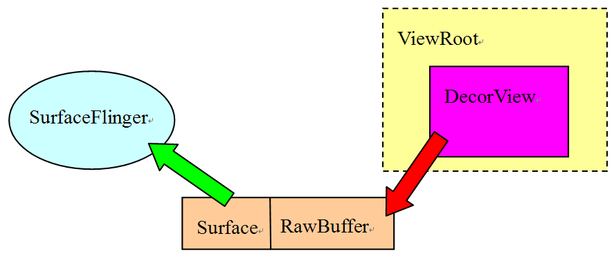 

图8-5  马良的神笔工作原理

结合之前所讲的知识，图8-5清晰地传达了如下几条信息：

·  ViewRoot有一个成员变量mSurface，它是Surface类型，它和一块Raw Buffer有关联。

·  ViewRoot是一个ViewParent，它的子View的绘画操作，是在画布Surface上展开的。

·  Surface和SurfaceFlinger有交互，这非常类似AudioTrack和AudioFlinger之间的交互。

既然本章题目为“深入理解Surface系统”，那么就需要重点关注Surface和SurfaceFlinger间的关系。建立这个关系需ViewRoot的参与，所以应先来分析ViewRoot的创建和它的setView函数。
<h5>（3）ViewRoot的创建和对setView的分析</h5>
来分析ViewRoot的构造。关于它所包含内容，代码如下所示：

[--&gt;ViewRoot.java]

public ViewRoot(Context context) {

       super();

      ....

       // getWindowSession？我们进去看看

      getWindowSession(context.getMainLooper());

     ......//ViewRoot的mWindow是一个W类型，注意它不是Window类型，而是IWindow类型

       mWindow= new W(this, context);

}

getWindowsession函数，将建立Activity的ViewRoot和WindowManagerService的关系。代码如下所示：

[--&gt;ViewRoot.java]

ublic static IWindowSessiongetWindowSession(Looper mainLooper) {

synchronized (mStaticInit) {

  if(!mInitialized) {

   try {

      InputMethodManagerimm =

         InputMethodManager.getInstance(mainLooper);

      //下面这个函数先得到WindowManagerService的Binder代理，然后调用它的openSession

sWindowSession = IWindowManager.Stub.asInterface(

                   ServiceManager.getService("window"))

                 .openSession(imm.getClient(), imm.getInputContext());

                    mInitialized = true;

               } catch (RemoteException e) {

               }

           }

           return sWindowSession;

        }

    }

WindowSession？WindowManagerService？第一次看到这些东西时，我快疯了。复杂，太复杂，无比复杂！要攻克这些难题，应先来回顾一下与Zygote相关的知识：

·  WindowManagerService（以后简称WMS）由System_Server进程启动，SurfaceFlinger服务也在这个进程中。

看来，Activity的显示还不单纯是它自己的事，还需要和WMS建立联系才行。继续看。先看setView的处理。这个函数很复杂，注意其中关键的几句。

openSession的操作是一个使用Binder通信的跨进程调用，暂且记住这个函数，在精简流程之后再来分析。

代码如下所示：

[--&gt;ViewRoot.java]

public void setView(View view, WindowManager.LayoutParamsattrs,

                        View panelParentView){//第一个参数view是DecorView

      ......

       mView= view;//保存这个view

       synchronized (this) {

           requestLayout(); //待会先看看这个。

               try {

                    //调用IWindowSession的add函数，第一个参数是mWindow 

                    res =sWindowSession.add(mWindow, mWindowAttributes,

                           getHostVisibility(), mAttachInfo.mContentInsets);

               } 

          ......

}

ViewRoot的setView函数做了三件事：

·  保存传入的view参数为mView，这个mView指向PhoneWindow的DecorView。

·  调用requestLayout。

·  调用IWindowSession的add函数，这是一个跨进程的Binder通信，第一个参数是mWindow，它是W类型，从IWindow.stub派生。

先来看这个requestLayout函数，它非常简单，就是往handler中发送了一个消息。注意，ViewRoot是从Handler派生的，所以这个消息最后会由ViewRoot自己处理，代码如下所示：

[--&gt;ViewRoot.java]

public void requestLayout() {

       checkThread();

       mLayoutRequested = true;

       scheduleTraversals();

} 

public void scheduleTraversals() {

        if(!mTraversalScheduled) {

           mTraversalScheduled = true;

           sendEmptyMessage(DO_TRAVERSAL); //发送DO_TRAVERSAL消息

        }

}

好，requestLayout分析完毕。

从上面的代码中可发现，ViewRoot和远端进程SystemServer的WMS有交互，先来总结一下它和WMS的交互流程：

·  ViewRoot调用openSession，得到一个IWindowSession对象。

·  调用WindowSession对象的add函数，把一个W类型的mWindow对象做为参数传入。
<h4>5. ViewRoot和WMS的关系</h4>
上面总结了ViewRoot和WMS的交互流程，其中一共有两个跨进程的调用。一起去看。
<h5>（1）调用流程分析</h5>
WMS的代码在WindowManagerService.java中：

[--&gt;WindowManagerService.java]

public IWindowSessionopenSession(IInputMethodClient client,

                                        IInputContextinputContext) {

       ......

return new Session(client, inputContext);

}

Session是WMS定义的内部类。它支持Binder通信，并且属于Bn端，即响应请求的服务端。

再来看它的add函数。代码如下所示：

[--&gt;WindowManagerService.java::Session]

public int add(IWindow window,WindowManager.LayoutParams attrs,

               int viewVisibility, Rect outContentInsets) {

    //调用外部类对象的addWindow,也就是WMS的addWindow

    returnaddWindow(this, window, attrs, viewVisibility,

                                outContentInsets);

}

[--&gt;WindowManagerService.java]

public int addWindow(Session session, IWindowclient,

           WindowManager.LayoutParams attrs, int viewVisibility,

           Rect outContentInsets) {

           ......

          //创建一个WindowState

          win = new WindowState(session, client, token,

                    attachedWindow, attrs,viewVisibility);

          ......

         //调用attach函数

          win.attach();

          ......

          return res;

}

WindowState类也是在WMS中定义的内部类，直接看它的attach函数，代码如下所示：

[--&gt;WMS.java::WindowState]

void attach() {

      //mSession就是Session对象，调用它的windowAddedLocked函数

     mSession.windowAddedLocked();

}

[--&gt;WMS.java::Session]

void windowAddedLocked() {

  if(mSurfaceSession == null) {

        ......

       //创建一个SurfaceSession对象

       mSurfaceSession= new SurfaceSession();

       ......

     }

      mNumWindow++;

}

这里出现了另外一个重要的对象SurfaceSession。在讲解它之前，急需理清一下现有的知识点，否则可能会头晕。
<h5>（2）ViewRoot和WMS的关系梳理</h5>
ViewRoot和WMS之间的关系，可用图8-6来表示：

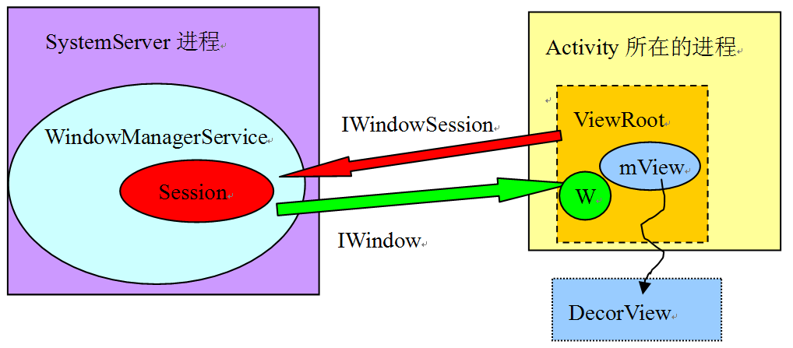 

图8-6  ViewRoot和WMS的关系

总结一下图8-6中的知识点：

·  ViewRoot通过IWindowSession和WMS进程进行跨进程通信。IWindowSession定义在IWindowSession.aidl文件中。这个文件在编译时由aidl工具处理，最后会生成类似于Native Binder中Bn端和Bp端的代码，后文会介绍它。

·  ViewRoot内部有一个W类型的对象，它也是一个基于Binder通信的类，W是IWindow的Bn端，用于响应请求。IWindow定义在另一个aidl文件IWindow.aidl中。

为什么需要这两个特殊的类呢？简单介绍一下：

首先，来看IWindowSession.aidl对自己的描述：

·  System private per-application interface to the window manager：也就是说每个App进程都会和WMS建立一个IWindowSession会话。这个会话被App进程用于和WMS通信。后面会介绍它的requestLayout函数。 

再看对IWindow.adil的描述：

·  API back to a client window that the Window Manager uses to informit of interesting things happening：这句话的大意是IWindow是WMS用来做事件通知的。每当发生一些事情时，WMS就会把这些事告诉某个IWindow。可以把IWindow想象成一个回调函数。

IWindow的描述表达了什么意思呢？不妨看看它的内容，代码如下所示：

[--&gt;IWindow.aidl定义]

void dispatchKey(in KeyEvent event);

void dispatchPointer(in MotionEvent event, longeventTime, 

boolean callWhenDone);

void dispatchTrackball(in MotionEvent event,long eventTime, 

boolean callWhenDone);

明白了？这里的事件指的就是按键、触屏等事件。那么，一个按键事件是如何被分发的呢？下面是它大致的流程：

·  WMS所在的SystemServer进程接收到按键事件。

·  WMS找到UI位于屏幕顶端的进程所对应的IWindow对象，这是一个Bp端对象。

·  调用这个IWindow对象的dispatchKey。IWindow对象的Bn端位于ViewRoot中，ViewRoot再根据内部View的位置信息找到真正处理这个事件的View，最后调用dispatchKey函数完成按键的处理。

其实这些按键事件的分发机制可以拿Windows的UI编程来做类比，在Windows中应用程序的按键处理流程是：

·  每一个按键事件都会转化成一个消息，这个消息将由系统加入到对应进程的消息队列中。该进程的消息在派发处理时，会根据消息的句柄找到对应的Window（窗口），继而该消息就由这个Window处理了。

注意：上面的描述实际上大大简化了真实的处理流程，读者可在了解大体知识后进行更深入的研究。

上面介绍的是ViewRoot和WMS的交互，但是我们最关心的Surface还没有正式介绍，在此之前，还是先介绍Activity的流程。
<h3><a>8.2.2  Activity</a>的UI绘制</h3>
ViewRoot的setView函数中，会有一个requestLayout。根据前面的分析可知，它会向ViewRoot发送一个DO_TRAVERSAL消息，来看它的handleMessage函数，代码如下所示：

[--&gt;ViewRoot.java]

public void handleMessage(Message msg) {

       switch (msg.what) {

        ......

       case DO_TRAVERSAL:

            ......

           performTraversals();//调用performTraversals函数

......

           break;

       ......

}

}

再去看performTraversals函数，这个函数比较复杂，先只看它的关键部分，代码如下所示：

[--&gt;ViewRoot.java]

private void performTraversals() {

 finalView host = mView;//还记得这mView吗？它就是DecorView喔

 

  booleaninitialized = false;

  booleancontentInsetsChanged = false;

  booleanvisibleInsetsChanged;

  try {

    relayoutResult= //①关键函数relayoutWindow

relayoutWindow(params, viewVisibility,insetsPending);

   }

......

draw(fullRedrawNeeded);// ②开始绘制

......

}

<h4>1. relayoutWindow的分析</h4>
performTraversals函数比较复杂，暂时只关注其中的两个函数relayoutWindow和draw即可。先看第一个relayoutWindow，代码如下所示：

[--&gt;ViewRoot.java]

private intrelayoutWindow(WindowManager.LayoutParams params, 

int viewVisibility, boolean insetsPending)throws RemoteException {

       

       //原来是调用IWindowSession的relayOut，暂且记住这个调用

       int relayoutResult = sWindowSession.relayout(

               mWindow, params,

               (int) (mView.mMeasuredWidth * appScale + 0.5f),

               (int) (mView.mMeasuredHeight * appScale + 0.5f),

               viewVisibility, insetsPending, mWinFrame,

               mPendingContentInsets, mPendingVisibleInsets,

               mPendingConfiguration, mSurface); mSurface做为参数传进去了。

       }

   ......

}

relayoutWindow中会调用IWindowSession的relayout函数，暂且记住这个调用，在精简流程后再进行分析。
<h4>2. draw的分析</h4>
再来看draw函数。这个函数非常重要，它可是Acitivity漂亮脸蛋的塑造大师啊，代码如下所示：

[--&gt;ViewRoot.java]

private void draw(boolean fullRedrawNeeded) {

       Surface surface = mSurface;//mSurface是ViewRoot的成员变量

       ......

        Canvascanvas;

       try {

           int left = dirty.left;

           int top = dirty.top;

           int right = dirty.right;

           int bottom = dirty.bottom;

           //从mSurface中lock一块Canvas

           canvas = surface.lockCanvas(dirty);

           ......

           mView.draw(canvas);//调用DecorView的draw函数，canvas就是画布的意思啦！

           ......

           //unlock画布，屏幕上马上就会见到漂亮宝贝的长相了。

           surface.unlockCanvasAndPost(canvas);

        }

          ......

    }

UI的显示好像很简单嘛！真的是这样的吗？在揭露这个“惊天秘密”之前我们先总结一下Activity的显示流程。
<h3><a>8.2.3  Activity</a>总结</h3>
不得不承认的是前面几节的内容很多也很繁杂，为了让后面分析的过程更流畅轻松一些，所以我们必须要总结一下。关于Activity的创建和显示，前面几节的信息可提炼成如下几条：

·  Activity的顶层View是DecorView，而我们在onCreate函数中通过setContentView设置的View只不过是这个DecorView中的一部分罢了。DecorView是一个FrameLayout类型的ViewGroup。

·  Activity和UI有关，它包含一个Window（真实类型是PhoneWindow）和一个WindowManager（真实类型是LocalWindowManager）对象。这两个对象将控制整个Activity的显示。

·  LocalWindowManager使用了WindowManagerImpl做为最终的处理对象（Proxy模式），这个WindowManagerImpl中有一个ViewRoot对象。

·  ViewRoot实现了ViewParent接口，它有两个重要的成员变量，一个是mView，它指向Activity顶层UI单元的DecorView，另外有一个mSurface，这个Surface包含了一个Canvas（画布）。除此之外，ViewRoot还通过Binder系统和WindowManagerService进行了跨进程交互。

·  ViewRoot能处理Handler的消息，Activity的显示就是由ViewRoot在它的performTraversals函数中完成的。

·  整个Activity的绘图流程就是从mSurface中lock一块Canvas，然后交给mView去自由发挥画画的才能，最后unlockCanvasAndPost释放这块Canvas。

这里和显示有关的就是最后三条了，其中最重要的内容都和Surface相关，既然mSurface是ViewRoot的本地变量，那就直接去看Surface。上面的代码分析一路走下来，真是比较流畅，波澜不惊，可事实果真如此吗？
<h2><a>8.3  </a>初识Surface</h2>
本节将介绍Surface对象。它可是纵跨Java/JNI层的对象，想必读者朋友已经摩拳擦掌，跃跃欲试了。
<h3><a>8.3.1  </a>和Surface有关的流程总结</h3>
这里，先总结一下前面讲解中和Surface有关的流程：

·  在ViewRoot构造时，会创建一个Surface，它使用无参构造函数，代码如下所示：

private final Surface mSurface = new Surface();

·  ViewRoot通过IWindowSession和WMS交互，而WMS中会调用的一个attach函数，会构造一个SurfaceSession，代码如下所示：

void windowAddedLocked() {

   if(mSurfaceSession == null) {

        mSurfaceSession = new SurfaceSession();

        mNumWindow++;

} 

}

·  ViewRoot在performTransval的处理过程中会调用IWindowSession的relayout函数。这个函数还没有分析。

·  ViewRoot调用Surface的lockCanvas，得到一块画布。

·  ViewRoot调用Surface的unlockCanvasAndPost释放这块画布。

这里从relayout函数开始分析，来看。
<h3><a>8.3.2  Surface</a>之乾坤大挪移</h3><h4>1. 乾坤大挪移的表象</h4>
relayout的函数是一个跨进程的调用，由WMS完成实际处理。先到ViewRoot中看看调用方的用法，代码如下所示：

[--&gt;ViewRoot.java]

private intrelayoutWindow(WindowManager.LayoutParams params, 

int viewVisibility, boolean insetsPending)

throws RemoteException {

       int relayoutResult = sWindowSession.relayout(

                mWindow, params,

               (int) (mView.mMeasuredWidth * appScale + 0.5f),

               (int) (mView.mMeasuredHeight * appScale + 0.5f),

               viewVisibility, insetsPending, mWinFrame,

               mPendingContentInsets, mPendingVisibleInsets,

               mPendingConfiguration, mSurface);//mSurface传了进去

        ......

       return relayoutResult;

    }

再看接收方的处理。它在WMS的Session中，代码如下所示：

[--&gt;WindowManagerService.java::Session]

public int relayout(IWindow window,WindowManager.LayoutParams attrs,

               int requestedWidth, int requestedHeight, int viewFlags,

               boolean insetsPending, Rect outFrame, Rect outContentInsets,

               Rect outVisibleInsets, Configuration outConfig, 

Surface outSurface) {

//注意最后这个参数的名字，叫outSurface 

//调用外部类对象的relayoutWindow

   returnrelayoutWindow(this, window, attrs,

                    requestedWidth,requestedHeight, viewFlags, insetsPending,

                    outFrame, outContentInsets,outVisibleInsets, outConfig,

outSurface);

}

[--&gt;WindowManagerService.java]

public int relayoutWindow(Session session,IWindow client,

           WindowManager.LayoutParams attrs, int requestedWidth,

           int requestedHeight, int viewVisibility, boolean insetsPending,

           Rect outFrame, Rect outContentInsets, Rect outVisibleInsets,

            Configuration outConfig, SurfaceoutSurface){

        .....

 try {

         //win就是WinState，这里将创建一个本地的Surface对象

         Surfacesurface = win.createSurfaceLocked();

          if(surface != null) {

            //先创建一个本地surface，然后在outSurface的对象上调用copyFrom

           //将本地Surface的信息拷贝到outSurface中，为什么要这么麻烦呢？

           outSurface.copyFrom(surface);

        ......

}

[--&gt;WindowManagerService.java::WindowState]

Surface createSurfaceLocked() {

     ......

   try {

     //mSurfaceSession就是在Session上创建的SurfaceSession对象

     //这里，以它为参数，构造一个新的Surface对象

        mSurface = new Surface(

                mSession.mSurfaceSession, mSession.mPid,

                 mAttrs.getTitle().toString(),

                 0, w, h, mAttrs.format, flags);

      } 

         Surface.openTransaction();//打开一个事务处理

        ......

         Surface.closeTransaction();//关闭一个事务处理。关于事务处理以后再分析

         ......

}

上面的代码段好像有点混乱。用图8-7来表示一下这个流程：

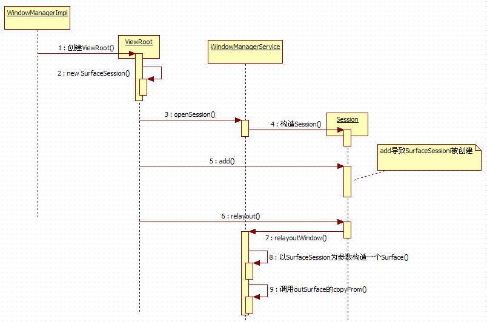 

图8-7  复杂的Surface创建流程

根据图8-7可知：

·  WMS中的Surface是乾坤中的乾，它的构造使用了带SurfaceSession参数的构造函数。

·  ViewRoot中的Surface是乾坤中的坤，它的构造使用了无参构造函数。

·  copyFrom就是挪移，它将乾中的Surface信息，拷贝到坤中的Surface即outSurface里。

要是觉得乾坤大挪移就是这两三下，未免就太小看它了。为彻底揭示这期间的复杂过程，我们将使用必杀技——aidl工具。
<h4>2. 揭秘Surface的乾坤大挪移</h4>
aidl可以把XXX.aidl文件转换成对应的Java文件。刚才所说的乾坤大挪移发生在ViewRoot调用IWindowSession的relayout函数中，它在IWindowSession.adil中的定义如下：

[--&gt;IWindowSesson.aidl]

interface IWindowSession {

    ......

 intrelayout(IWindow window, in WindowManager.LayoutParams attrs,

           int requestedWidth, int requestedHeight, int viewVisibility,

           boolean insetsPending, out Rect outFrame, out Rect outContentInsets,

           out Rect outVisibleInsets, out Configuration outConfig,

           out Surface outSurface);

下面，拿必杀技aidl来编译一下这个aidl文件，其使用方法如下：

在命令行下可以输入：

aidl –Ie:\froyo\source\frameworks\base\core\java\ -Ie:\froyo\source\frameworks\base\Graphics\java e:\froyo\source\frameworks\base\core\java\android\view\IWindowSession.aidltest.java

新生成的Java文件叫test.java。其中，-I参数指定include目录，例如aidl文件中使用了别的Java文件中的类，所以需要指定这些Java文件所在的目录。

先看ViewRoot这个客户端生成的代码，如下所示：

[--&gt;test.java::Bp端::relayout]

public int relayout(android.view.IWindow window,

                 android.view.WindowManager.LayoutParams attrs,

                  int requestedWidth, intrequestedHeight, 

                 int viewVisibility, boolean insetsPending, 

                 android.graphics.Rect outFrame, 

                 android.graphics.Rect outContentInsets,

                 android.graphics.Rect outVisibleInsets, 

                 android.content.res.Configuration outConfig, 

                 android.view.Surface outSurface)//outSurface是第11个参数

                                    throwsandroid.os.RemoteException

{

   android.os.Parcel_data = android.os.Parcel.obtain();

   android.os.Parcel_reply = android.os.Parcel.obtain();

   int_result;

   try {

      _data.writeInterfaceToken(DESCRIPTOR);

     _data.writeStrongBinder((((window!=null))?(window.asBinder()):(null)));

     if((attrs!=null)) {

       _data.writeInt(1);

       attrs.writeToParcel(_data,0);

     }

    else {

    _data.writeInt(0);

   }

  _data.writeInt(requestedWidth);

  _data.writeInt(requestedHeight);

  _data.writeInt(viewVisibility);

  _data.writeInt(((insetsPending)?(1):(0)));

 //奇怪，outSurface的信息没有写到请求包_data中，就直接发送请求消息了

  mRemote.transact(Stub.TRANSACTION_relayout,_data, _reply, 0);

  _reply.readException();

  _result= _reply.readInt();

  if((0!=_reply.readInt())) {

   outFrame.readFromParcel(_reply);

  }

  ....

  if((0!=_reply.readInt())) { 

     outSurface.readFromParcel(_reply);//从Parcel中读取信息来填充outSurface

    }

  }

  ......

  return_result;

}

奇怪！ViewRoot调用requestlayout竟然没有把outSurface信息传进去，这么说，服务端收到的Surface对象应该就是空吧？那怎么能调用copyFrom呢？还是来看服务端的处理，先看首先收到消息的onTransact函数，代码如下所示：

[--&gt;test.java::Bn端::onTransact]

public boolean onTransact(int code,android.os.Parcel data,

                               android.os.Parcelreply, int flags) 

                    throwsandroid.os.RemoteException

{

  switch(code)

  {

    caseTRANSACTION_relayout:

    {

      data.enforceInterface(DESCRIPTOR);

      android.view.IWindow_arg0;

      android.view.Surface_arg10;

      //刚才讲了，Surface信息并没有传过来，那么在relayOut中看到的outSurface是怎么

      //出来的呢？看下面这句可知，原来在服务端这边竟然new了一个新的Surface!!!

      _arg10= new android.view.Surface();

      int_result = this.relayout(_arg0, _arg1, _arg2, _arg3, _arg4, 

      _arg5,_arg6, _arg7, _arg8, _arg9, _arg10);

      reply.writeNoException();

      reply.writeInt(_result);

      //_arg10就是调用copyFrom的那个outSurface，那怎么传到客户端呢？

      if((_arg10!=null)) {

           reply.writeInt(1);

           //调用Surface的writeToParcel，把信息写到reply包中。

           //注意最后一个参数为PARCELABLE_WRITE_RETURN_VALUE

           _arg10.writeToParcel(reply, 

                 android.os.Parcelable.PARCELABLE_WRITE_RETURN_VALUE);

        }

    }

    ......

   returntrue;

}

看完这个，会让人有点毛骨悚然。我最开始一直在JNI文件中寻找大挪移的踪迹，但有几个关键点始终不能明白，万不得已就使用了这个aidl必杀技，于是终于揭露出其真相了。
<h4>3. 乾坤大挪移的真相</h4>
这里，总结一下乾坤大挪移的整个过程，如图8-8表示：

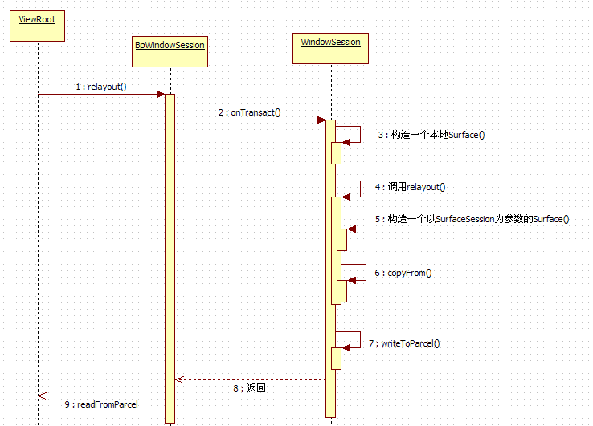 

图8-8  乾坤大挪移的真面目

上图非常清晰地列出了乾坤大挪移的过程，我们可结合代码来加深理解。

注意，这里，将BpWindowSession作为了IWindowSessionBinder在客户端的代表。

 
<h3><a>8.3.3  </a>分析乾坤大挪移的JNI层</h3>
前文讲述的内容都集中在Java层，下面要按照流程顺序分析JNI层的内容。
<h4>1. Surface的无参构造分析</h4>
在JNI层，第一个被调用的是Surface的无参构造函数，其代码如下所示：

[--&gt;Surface.java]

public Surface() {

        ......

       //CompatibleCanvas从Canvas类派生

       mCanvas = new CompatibleCanvas();

    }

Canvas是什么？根据SDK文档的介绍可知，画图需要“四大金刚”相互合作，这四大金刚是：

·  Bitmap：用于存储像素，也就是画布。可把它当做一块数据存储区域。

·  Canvas：用于记载画图的动作，比如画一个圆，画一个矩形等。Canvas类提供了这些基本的绘图函数。

·  Drawing primitive：绘图基元，例如矩形、圆、弧线、文本、图片等。

·  Paint：它用来描述绘画时使用的颜色、风格（如实线、虚线等）等。

在一般情况下，Canvas会封装一块Bitmap，而作图就是基于这块Bitmap的。前面说的画布，其实指的就是Canvas中的这块Bitmap。

这些知识稍了解即可，不必去深究。Surface的无参构造函数没有什么有价值的内容，接着看下面的内容。
<h4>2. SurfaceSession的构造</h4>
现在要分析的是SurfaceSession，其构造函数如下所示：

[--&gt;SurfaceSession.java]

public SurfaceSession() {

       init();//这是一个native函数

}

init是一个native函数。去看看它的JNI实现，它在android_view_Surface.cpp中，代码如下所示：

[--&gt;android_view_Surface.cpp]

static void SurfaceSession_init(JNIEnv* env,jobject clazz)

{

     //创建一个SurfaceComposerClient对象

   sp&lt;SurfaceComposerClient&gt; client = new SurfaceComposerClient;

client-&gt;incStrong(clazz);

//在Java对象中保存这个client对象的指针，类型为SurfaceComposerClient

   env-&gt;SetIntField(clazz, sso.client, (int)client.get());

}

这里先不讨论SurfaceComposerClient的内容，拟继续把乾坤大挪移的流程走完。
<h4>3. Surface的有参构造</h4>
下一个调用的是Surface的有参构造，其参数中有一个SurfaceSession。先看Java层的代码，如下所示：

[--&gt;Surface.java]

    publicSurface(SurfaceSession s,//传入一个SurfaceSession对象

           int pid, String name, int display, int w, int h, int format, int flags)

       throws OutOfResourcesException {

        ......

       mCanvas = new CompatibleCanvas();

      //又一个native函数，注意传递的参数：display以后再说，w,h代表绘图区域的宽高值

       init(s,pid,name,display,w,h,format,flags);

       mName = name;

    }

Surface的native init函数的JNI实现，也在android_view_Surface.cpp中，一起来看：

[--&gt;android_view_Surface.cpp]

static void Surface_init(

        JNIEnv*env, jobject clazz, 

       jobject session,

       jint pid, jstring jname, jint dpy, jint w, jint h, jint format, jintflags)

{

   //从SurfaceSession对象中取出之前创建的那个SurfaceComposerClient对象

SurfaceComposerClient* client =

           (SurfaceComposerClient*)env-&gt;GetIntField(session, sso.client);

 

   sp&lt;SurfaceControl&gt; surface;//注意它的类型是SurfaceControl

if (jname == NULL) {

    /*

调用SurfaceComposerClient的createSurface函数，返回的surface是一个

SurfaceControl类型。

*/

       surface = client-&gt;createSurface(pid, dpy, w, h, format, flags);

    } else{

        ......

}

   //把这个surfaceControl对象设置到Java层的Surface对象中，对这个函数就不再分析了

   setSurfaceControl(env, clazz, surface);

}

<h4>4. copyFrom的分析</h4>
现在要分析的就是copyFrom了。它就是一个native函数。看它的JNI层代码：

[--&gt;android_view_Surface.cpp]

static void Surface_copyFrom(JNIEnv* env,jobject clazz, jobject other)

{

   //根据JNI函数的规则，clazz是copyFrom的调用对象，而other是copyFrom的参数。

   //目标对象此时还没有设置SurfaceControl，而源对象在前面已经创建了SurfaceControl

   constsp&lt;SurfaceControl&gt;&amp; surface = getSurfaceControl(env, clazz);

   constsp&lt;SurfaceControl&gt;&amp; rhs = getSurfaceControl(env, other);

if (!SurfaceControl::isSameSurface(surface, rhs)) {

        //把源SurfaceControl对象设置到目标Surface中。

       setSurfaceControl(env, clazz, rhs);

    }

}

这一步还是比较简单的，下面看第五步writeToParcel函数的调用。
<h4>5. writeToParcel的分析</h4>
多亏了必杀技aidl工具的帮忙，才挖出这个隐藏的writeToParcel函数调用，下面就来看看它，代码如下所示：

[--&gt;android_view_Surface.cpp]

static void Surface_writeToParcel(JNIEnv* env,jobject clazz, 

jobject argParcel, jint flags)

{

   Parcel* parcel = (Parcel*)env-&gt;GetIntField(argParcel, no.native_parcel);

//clazz就是Surface对象，从这个Surface对象中取出保存的SurfaceControl对象

const sp&lt;SurfaceControl&gt;&amp;control(getSurfaceControl(env, clazz));

/*

把SurfaceControl中的信息写到Parcel包中，然后利用Binder通信传递到对端，

对端通过readFromParcel来处理Parcel包。 

*/

   SurfaceControl::writeSurfaceToParcel(control, parcel);

if (flags &amp; PARCELABLE_WRITE_RETURN_VALUE) {

       //还记得PARCELABLE_WRITE_RETURN_VALUE吗？flags的值就等于它

       //所以本地Surface对象的SurfaceControl值被置空了

       setSurfaceControl(env, clazz, 0);

    }

}

 
<h4>6. readFromParcel的分析</h4>
再看作为客户端的ViewRoot所调用的readFromParcel函数。它也是一个native函数，JNI层的代码如下所示：

[--&gt;android_view_Surface.cpp]

static void Surface_readFromParcel(

       JNIEnv* env, jobject clazz, jobject argParcel)

{

   Parcel* parcel = (Parcel*)env-&gt;GetIntField( argParcel,no.native_parcel);

   

   //注意下面定义的变量类型是Surface，而不是SurfaceControl

   const sp&lt;Surface&gt;&amp;control(getSurface(env, clazz));

   //根据服务端传递的Parcel包来构造一个新的surface。

   sp&lt;Surface&gt; rhs = new Surface(*parcel);

if (!Surface::isSameSurface(control, rhs)) {

//把这个新surface赋给ViewRoot中的mSurface对象。

      setSurface(env,clazz, rhs); 

    }

}

<h4>7. Surface乾坤大挪移的小结</h4>
可能有人会问，乾坤大挪移怎么这么复杂？这期间出现了多少对象？来总结一下，在此期间一共有三个关键对象（注意我们这里只考虑JNI层的Native对象），它们分别是：

·  SurfaceComposerClient。

·  SurfaceControl。

·  Surface，这个Surface对象属于Native层，和Java层的Surface相对应。

其中转移到ViewRoot成员变量mSurface中的，就是最后这个Surface对象了。这一路走来，真是异常坎坷。来回顾并概括总结一下这段历程。至于它的作用应该是很清楚了。以后要破解SurfaceFlinger，靠的就是这个精简的流程。

·  创建一个SurfaceComposerClient。

·  调用SurfaceComposerClient的createSurface得到一个SurfaceControl对象。

·  调用SurfaceControl的writeToParcel把一些信息写到Parcel包中。

·  根据Parcel包的信息构造一个Surface对象。这个Surface对象保存到Java层的mSurface对象中。这样，大挪移的结果是ViewRoot得到一个Native的Surface对象。

精简流程后，寥寥数语就可把过程说清楚。以后我们在研究代码时，也可以采取这种方式。

这个Surface对象非常重要，可它到底有什么用呢？这正是下一节要讲的内容。
<h3><a>8.3.4  Surface</a>和画图</h3>
下面，来看最后两个和Surface相关的函数调用：一个是lockCanvas；另外一个是unlockCanvasAndPost。
<h4>1. lockCanvas的分析</h4>
要对lockCanvas进行分析，须先来看Java层的函数，代码如下所示：

[--&gt;Surface.java::lockCanvas()]

public Canvas lockCanvas(Rect dirty) 

throws OutOfResourcesException,IllegalArgumentException

 {

       return lockCanvasNative(dirty);//调用native的lockCanvasNative函数。

}

[--&gt;android_view_Surface.cpp::Surface_lockCanvas()]

static jobject Surface_lockCanvas(JNIEnv* env,jobject clazz, jobject dirtyRect)

{

    //从Java中的Surface对象中，取出费尽千辛万苦得到的Native的Surface对象

    constsp&lt;Surface&gt;&amp; surface(getSurface(env, clazz));

    ......

 

// dirtyRect表示需要重绘的矩形块，下面根据这个dirtyRect设置dirtyRegion

    RegiondirtyRegion;

    if(dirtyRect) {

       Rect dirty;

       dirty.left  =env-&gt;GetIntField(dirtyRect, ro.l);

       dirty.top   =env-&gt;GetIntField(dirtyRect, ro.t);

       dirty.right = env-&gt;GetIntField(dirtyRect, ro.r);

        dirty.bottom=env-&gt;GetIntField(dirtyRect, ro.b);

        if(!dirty.isEmpty()) {

           dirtyRegion.set(dirty);    

        }

    } else{

       dirtyRegion.set(Rect(0x3FFF,0x3FFF));

    }

    

//调用NativeSurface对象的lock函数，

//传入了一个参数Surface::SurfaceInfo info和一块表示脏区域的dirtyRegion

   Surface::SurfaceInfo info;

   status_t err = surface-&gt;lock(&amp;info, &amp;dirtyRegion);

    ......

//Java的Surface对象构造的时候会创建一个CompatibleCanvas。

//这里就取出这个CompatibleCanvas对象

   jobject canvas = env-&gt;GetObjectField(clazz, so.canvas);

   env-&gt;SetIntField(canvas, co.surfaceFormat, info.format);

    //从Canvas对象中取出SkCanvas对象

SkCanvas* nativeCanvas =(SkCanvas*)env-&gt;GetIntField(

canvas, no.native_canvas);

                         SkBitmap bitmap;

                         ssize_t bpr = info.s *bytesPerPixel(info.format);

   bitmap.setConfig(convertPixelFormat(info.format), info.w, info.h, bpr);

   ......

if (info.w &gt; 0 &amp;&amp; info.h &gt; 0) {

//info.bits指向一块存储区域。

       bitmap.setPixels(info.bits);

    } else{

        bitmap.setPixels(NULL);

}

//给这个SkCanvas设置一个Bitmap，还记得前面说的，画图需要的四大金刚吗？

//这里将Bitmap设置到这个Canvas中，这样进UI绘画时就有画布了。

   nativeCanvas-&gt;setBitmapDevice(bitmap);

    ......

    

    returncanvas;

}

lockCanvas还算比较简单：

·  先获得一块存储区域，然后将它和Canvas绑定到一起，这样，UI绘画的结果就记录在这块存储区域里了。

注意，本书不拟讨论Android系统上Skia和OpenGL方面的知识，有兴趣的读者可自行研究。

接下来看unlockCanvasAndPost函数，它也是一个native函数：
<h4>2. unlockCanvasAndPost的分析</h4>
来看unlockCanvasAndPost的代码，如下所示：

[--&gt;android_view_Surface.cpp]

static void Surface_unlockCanvasAndPost(JNIEnv*env, jobject clazz, 

jobject argCanvas)

{

    jobjectcanvas = env-&gt;GetObjectField(clazz, so.canvas);

    //取出Native的Surface对象

const sp&lt;Surface&gt;&amp; surface(getSurface(env,clazz));

//下面这些内容，不拟讨论，读者若有兴趣，可结合Skia库，自行研究。

SkCanvas* nativeCanvas =(SkCanvas*)env-&gt;GetIntField(canvas,

                                                 no.native_canvas);

    intsaveCount = env-&gt;GetIntField(clazz, so.saveCount);

   nativeCanvas-&gt;restoreToCount(saveCount);

   nativeCanvas-&gt;setBitmapDevice(SkBitmap());

   env-&gt;SetIntField(clazz, so.saveCount, 0);

 

    //调用Surface对象的unlockAndPost函数。

   status_t err = surface-&gt;unlockAndPost();

    ......

}

unlockCanvasAndPost也很简单，这里就不再多说了。
<h3><a>8.3.5  </a>初识Surface总结</h3>
在本节的最后，我们来概括总结一下这一节所涉及到和Surface相关的调用流程，以备攻克下一个难关，如图8-9所示 ：

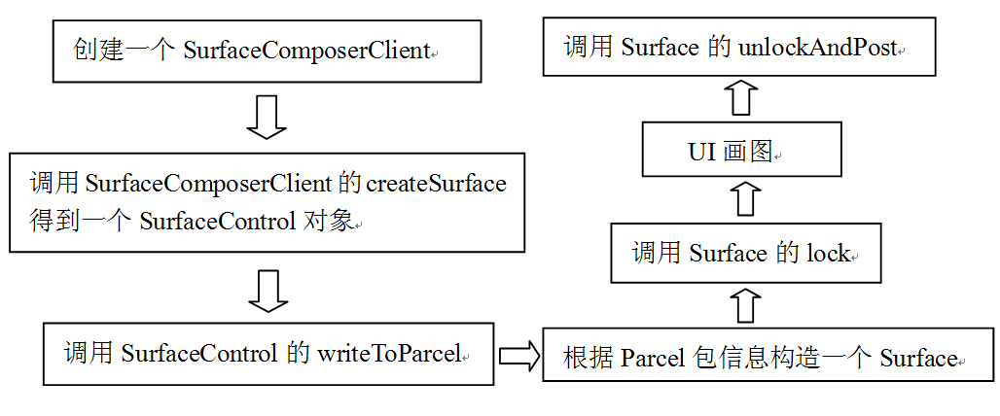 

图8-9  Surface的精简流程图
<h2><a>8.4  </a>深入分析Surface</h2>
这一节，拟基于图8-9中的流程，对Surface进行深入分析。在分析之前，还需要介绍一些Android平台上图形/图像显示方面的知识，这里统称之为与Surface相关的基础知识。
<h3><a>8.4.1  </a>与Surface相关的基础知识介绍</h3><h4>1. 显示层（Layer）和屏幕组成</h4>
你了解屏幕显示的漂亮界面是如何组织的吗？来看图8-10所展示的屏幕组成示意图：

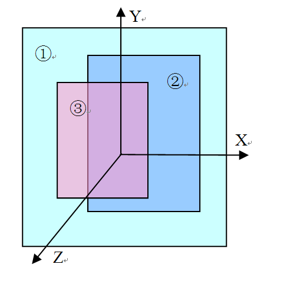 

图8-10  屏幕组成示意图

从图8-10中可以看出：

·  屏幕位于一个三维坐标系中，其中Z轴从屏幕内指向屏幕外。

·  编号为①②③的矩形块叫显示层（Layer）。每一层有自己的属性，例如颜色、透明度、所处屏幕的位置、宽、高等。除了属性之外，每一层还有自己对应的显示内容，也就是需要显示的图像。

在Android中，Surface系统工作时，会由SurfaceFlinger对这些按照Z轴排好序的显示层进行图像混合，混合后的图像就是在屏幕上看到的美妙画面了。这种按Z轴排序的方式符合我们在日常生活中的体验，例如前面的物体会遮挡住后面的物体。

注意，Surface系统中定义了一个名为Layer类型的类，为了区分广义概念上的Layer和代码中的Layer，这里称广义层的Layer为显示层，以免混淆。

Surface系统提供了三种属性，一共四种不同的显示层。简单介绍一下：

·  第一种属性是eFXSurfaceNormal属性，大多数的UI界面使用的就是这种属性。它有两种模式：

       1）Normal模式，这种模式的数据，是通过前面的mView.draw(canvas)画上去的。这也是绝大多数UI所采用的方式。

       2）PushBuffer模式，这种模式对应于视频播放、摄像机摄录/预览等应用场景。以摄像机为例，当摄像机运行时，来自Camera的预览数据直接push到Buffer中，无须应用层自己再去draw了。

·  第二种属性是eFXSurfaceBlur属性，这种属性的UI有点朦胧美，看起来很像隔着一层毛玻璃。

·  第三种属性是eFXSurfaceDim属性，这种属性的UI看起来有点暗，好像隔了一层深色玻璃。从视觉上讲，虽然它的UI看起来有点暗，但并不模糊。而eFXSurfaceBlur不仅暗，还有些模糊。

图8-11展示了最后两种类型的视觉效果图，其中左边的是Blur模式，右边的是Dim模式。

           

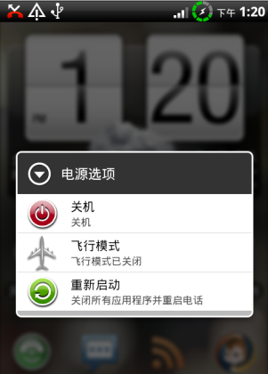 

图8-11  Blur和Dim效果图

注意，关于Surface系统的显示层属性定义，读者可参考ISurfaceComposer.h。

本章将重点分析第一种属性的两类显示层的工作原理。
<h4>2. FrameBuffer和PageFlipping</h4>
我们知道，在Audio系统中，音频数据传输的过程是：

·  由客户端把数据写到共享内存中。

·  然后由AudioFlinger从共享内存中取出数据再往Audio HAL中发送。

根据以上介绍可知，在音频数据传输的过程中，共享内存起到了数据承载的重要作用。                                                                                     无独有偶，Surface系统中的数据传输也存在同样的过程，但承载图像数据的是鼎鼎大名的FrameBuffer（简称FB）。下面先来介绍FrameBuffer，然后再介绍Surface的数据传输过程。
<h5>（1）FrameBuffer的介绍</h5>
FrameBuffer的中文名叫帧缓冲，它实际上包括两个不同的方面：

·  Frame：帧，就是指一幅图像。在屏幕上看到的那幅图像就是一帧。

·  Buffer：缓冲，就是一段存储区域，可这个区域存储的是帧。

FrameBuffer的概念很清晰，它就是一个存储图形/图像帧数据的缓冲。这个缓冲来自哪里？理解这个问题，需要简单介绍一下Linux平台的虚拟显示设备FrameBuffer Device（简称FBD）。FBD是Linux系统中的一个虚拟设备，设备文件对应为/dev/fb%d（比如/dev/fb0）。这个虚拟设备将不同硬件厂商实现的真实设备统一在一个框架下，这样应用层就可以通过标准的接口进行图形/图像的输入和输出了。图8-12展示了FBD示意图：

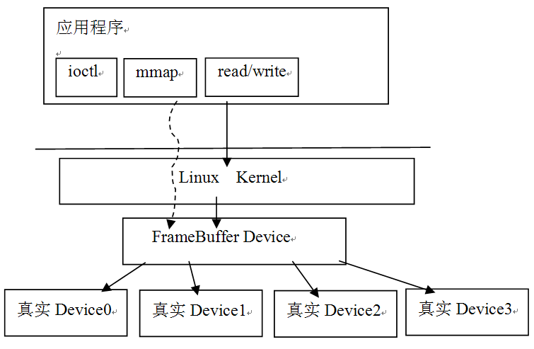 

图8-12  Linux系统中的FBD示意图

从上图中可以看出，应用层通过标准的ioctl或mmap等系统调用，就可以操作显示设备，用起来非常方便。这里，把mmap的调用列出来，相信大部分读者都知道它的作用了。

FrameBuffer中的Buffer，就是通过mmap把设备中的显存映射到用户空间的，在这块缓冲上写数据，就相当于在屏幕上绘画。

注意：上面所说的框架将引出另外一个概念Linux FrameBuffer（简称LFB）。LFB是Linux平台提供的一种可直接操作FB的机制，依托这个机制，应用层通过标准的系统调用，就可以操作显示设备了。从使用的角度来看，它和Linux Audio中的OSS有些类似。

为加深读者对此节内容的理解，这里给出一个小例子，就是在DDMS工具中实现屏幕截图功能，其代码在framebuffer_service.c中，如下所示：

[--&gt;framebuffer_service.c]

struct fbinfo {//定义一个结构体

   unsigned int version;

   unsigned int bpp;

   unsigned int size;

   unsigned int width;

   unsigned int height;

   unsigned int red_offset;

   unsigned int red_length;

   unsigned int blue_offset;

   unsigned int blue_length;

   unsigned int green_offset;

   unsigned int green_length;

   unsigned int alpha_offset;

   unsigned int alpha_length;

} __attribute__((packed));

//fd是一个文件的描述符，这个函数的目的，是把当前屏幕的内容写到一个文件中

void framebuffer_service(int fd, void *cookie)

{

    structfb_var_screeninfo vinfo;

    intfb, offset;

    charx[256];

 

    structfbinfo fbinfo;

   unsigned i, bytespp;

   //Android系统上的fb设备路径在/dev/graphics目录下

    fb =open("/dev/graphics/fb0", O_RDONLY);

    if(fb&lt; 0) goto done;

    //取出屏幕的属性

   if(ioctl(fb, FBIOGET_VSCREENINFO, &amp;vinfo) &lt; 0) goto done;

   fcntl(fb, F_SETFD, FD_CLOEXEC);

 

   bytespp = vinfo.bits_per_pixel / 8;

    //根据屏幕的属性填充fbinfo结构，这个结构要写到输出文件的头部

    fbinfo.version = DDMS_RAWIMAGE_VERSION;

   fbinfo.bpp = vinfo.bits_per_pixel;

   fbinfo.size = vinfo.xres * vinfo.yres * bytespp;

   fbinfo.width = vinfo.xres;

fbinfo.height = vinfo.yres;

/*

下面几个变量和颜色格式有关，以RGB565为例，简单介绍一下。

RGB565表示一个像素点中R分量为5位，G分量为6位，B分量为5位，并且没有Alpha分量。

这样一个像素点的大小为16位，占两个字节，比RGB888格式的一个像素少一个字节（它一个像素是三个字节）。

x_length的值为x分量的位数，例如，RGB565中R分量就是5位。

x_offset的值代表x分量在内存中的位置。如RGB565一个像素占两个字节，那么x_offeset

表示x分量在这两个字节内存区域中的起始位置，但这个顺序是反的，也就是B分量在前，

R在最后。所以red_offset的值就是11，而blue_offset的值是0,green_offset的值是6。

这些信息在做格式转换时（例如从RGB565转到RGB888的时候）有用。

*/

   fbinfo.red_offset = vinfo.red.offset;

   fbinfo.red_length = vinfo.red.length;

   fbinfo.green_offset = vinfo.green.offset;

   fbinfo.green_length = vinfo.green.length;

   fbinfo.blue_offset = vinfo.blue.offset;

   fbinfo.blue_length = vinfo.blue.length;

   fbinfo.alpha_offset = vinfo.transp.offset;

   fbinfo.alpha_length = vinfo.transp.length;

 

    offset= vinfo.xoffset * bytespp;

 

    offset+= vinfo.xres * vinfo.yoffset * bytespp;

    //将fb信息写到文件头部

   if(writex(fd, &amp;fbinfo, sizeof(fbinfo))) goto done;

 

   lseek(fb, offset, SEEK_SET);

    for(i= 0; i &lt; fbinfo.size; i += 256) {

     if(readx(fb, &amp;x, 256)) goto done;//读取FBD中的数据

     if(writex(fd, &amp;x, 256)) goto done;//将数据写到文件

    }

 

   if(readx(fb, &amp;x, fbinfo.size % 256)) goto done;

   if(writex(fd, &amp;x, fbinfo.size % 256)) goto done;

 

done:

    if(fb&gt;= 0) close(fb);

   close(fd);

}

上面函数的目的就是截屏，这个例子可加深我们对FB的直观感受，相信读者下次再碰到FB时就不会犯怵了。

注意：我们可根据这段代码，写一个简单的Native可执行程序，然后adb push到设备上运行。注意上面写到文件中的是RGB565格式的原始数据，如想在台式机上看到这幅图片，可将它转换成BMP格式。我的个人博客上提供一个RGB565转BMP的程序，读者可以下载或自己另写一个，这样或许有助于更深入理解图形/图像方面的知识。

在继续分析前，先来问一个问题：

前面在Audio系统中讲过，CB对象通过读写指针来协调生产者/消费者的步调，那么Surface系统中的数据传输过程，是否也需通过读写指针来控制呢？

答案是肯定的，但不像Audio中的CB那样复杂。
<h5>（2）PageFlipping</h5>
图形/图像数据和音频数据不太一样，我们一般把音频数据叫音频流，它是没有边界的, 而图形/图像数据是一帧一帧的，是有边界的。这一点非常类似UDP和TCP之间的区别。所以在图形/图像数据的生产/消费过程中，人们使用了一种叫PageFlipping的技术。

PageFlipping的中文名叫画面交换，其操作过程如下所示：

·  分配一个能容纳两帧数据的缓冲，前面一个缓冲叫FrontBuffer，后面一个缓冲叫BackBuffer。

·  消费者使用FrontBuffer中的旧数据，而生产者用新数据填充BackBuffer，二者互不干扰。

·  当需要更新显示时，BackBuffer变成FrontBuffer，FrontBuffer变成BackBuffer。如此循环，这样就总能显示最新的内容了。这个过程很像我们平常的翻书动作，所以它被形象地称为PageFlipping。

说白了，PageFlipping其实就是使用了一个只有两个成员的帧缓冲队列，以后在分析数据传输的时候还会见到诸如dequeue和queue的操作。

<h4>3. 图像混合</h4>
我们知道，在AudioFlinger中有混音线程，它能将来自多个数据源的数据混合后输出，那么，SurfaceFlinger是不是也具有同样的功能呢？

答案是肯定的，否则它就不会叫Flinger了。Surface系统支持软硬两个层面的图像混合：

·  软件层面的混合：例如使用copyBlt进行源数据和目标数据的混合。

·  硬件层面的混合：使用Overlay系统提供的接口。

无论是硬件还是软件层面，都需将源数据和目标数据进行混合，混合需考虑很多内容，例如源的颜色和目标的颜色叠加后所产生的颜色。关于这方面的知识，读者可以学习计算机图形/图像学。这里只简单介绍一下copyBlt和Overlay。

·  copyBlt，从名字上看，是数据拷贝，它也可以由硬件实现，例如现在很多的2D图形加速就是将copyBlt改由硬件来实现，以提高速度的。但不必关心这些，我们只需关心如何调用copyBlt相关的函数进行数据混合即可。

·  Overlay方法必须有硬件支持才可以，它主要用于视频的输出，例如视频播放、摄像机摄像等，因为视频的内容往往变化很快，所以如改用硬件进行混合效率会更高。

总体来说，Surface是一个比较庞大的系统，由于篇幅和精力所限，本章后面的内容将重点关注Surface系统的框架和工作流程。在掌握框架和流程后，读者就可以在大的脉络中迅速定位到自己感兴趣的地方，然后展开更深入的研究了。

下面通过图8-9所示的精简流程，深入分析Android的Surface系统。
<h3><a>8.4.2  SurfaceComposerClient</a>的分析</h3>
SurfaceComposerClient的出现是因为：

Java层SurfaceSession对象的构造函数会调用Native的SurfaceSession_init函数，而该函数的主要目的就是创建SurfaceComposerClient。

先回顾一下SurfaceSession_init函数，代码如下所示：

[--&gt;android_view_Surface.cpp]

static void SurfaceSession_init(JNIEnv* env,jobject clazz)

{

  //new 一个SurfaceComposerClient对象

sp&lt;SurfaceComposerClient&gt; client = newSurfaceComposerClient;

//sp的使用也有让人烦恼的地方，有时需要显式地增加强弱引用计数，要是忘记，可就麻烦了

client-&gt;incStrong(clazz); 

 env-&gt;SetIntField(clazz, sso.client,(int)client.get());

}

上面代码中，显式地构造了一个SurfaceComposerClient对象。接下来看它是何方神圣。
<h4>1. 创建SurfaceComposerClient</h4>
SurfaceComposerClient这个名字隐含的意思是：

这个对象会和SurfaceFlinger进行交互，因为SurfaceFlinger派生于SurfaceComposer。

通过它的构造函数来看是否是这样的。代码如下所示：

[--&gt;SurfaceComposerClient.cpp]

SurfaceComposerClient::SurfaceComposerClient()

{

  //getComposerService()将返回SF的Binder代理端的BpSurfaceFlinger对象

sp&lt;ISurfaceComposer&gt; sm(getComposerService());

//先调用SF的createConnection，再调用_init

  _init(sm, sm-&gt;createConnection());

 

    if(mClient != 0) {

       Mutex::Autolock _l(gLock);

       //gActiveConnections是全局变量，把刚才创建的client保存到这个map中去

       gActiveConnections.add(mClient-&gt;asBinder(), this);

    }

}

果然如此，SurfaceComposerClient建立了和SF的交互通道，下面直接转到SF的createConnection函数去观察。
<h5>（1）createConnection的分析</h5>
直接看代码，如下所示：

[--&gt;SurfaceFlinger.cpp]

sp&lt;ISurfaceFlingerClient&gt;SurfaceFlinger::createConnection()

{

   Mutex::Autolock _l(mStateLock);

   uint32_t token = mTokens.acquire();

   //先创建一个Client。

   sp&lt;Client&gt; client = new Client(token, this);

    //把这个Client对象保存到mClientsMap中，token是它的标识。

   status_t err = mClientsMap.add(token, client);

/*

创建一个用于Binder通信的BClient，BClient派生于ISurfaceFlingerClient，

它的作用是接受客户端的请求，然后把处理提交给SF，注意，并不是提交给Client。

Client会创建一块共享内存，该内存由getControlBlockMemory函数返回

*/

   sp&lt;BClient&gt; bclient = 

        new BClient(this, token,client-&gt;getControlBlockMemory());

    returnbclient;

}

上面代码中提到，Client会创建一块共享内存。熟悉Audio的读者或许会认为，这可能是Surface的ControlBlock对象了！是的。CB对象在协调生产/消费步调时，起到了决定性的控制作用，所以非常重要，下面来看：

[--&gt;SurfaceFlinger.cpp]

Client::Client(ClientID clientID, constsp&lt;SurfaceFlinger&gt;&amp; flinger)

    :ctrlblk(0), cid(clientID), mPid(0), mBitmap(0), mFlinger(flinger)

{

const int pgsize = getpagesize();

//下面这个操作会使cblksize为页的大小，目前是4096字节。

    constint cblksize = ((sizeof(SharedClient)+(pgsize-1))&amp;~(pgsize-1));

    //MemoryHeapBase是我们的老朋友了，不熟悉的读者可以回顾Audio系统中所介绍的内容

   mCblkHeap = new MemoryHeapBase(cblksize, 0,

                "SurfaceFlinger Clientcontrol-block");

 

   ctrlblk = static_cast&lt;SharedClient *&gt;(mCblkHeap-&gt;getBase());

    if(ctrlblk) { 

       new(ctrlblk) SharedClient; //再一次觉得眼熟吧？使用了placement new

    }

}

原来，Surface的CB对象就是在共享内存中创建的这个SharedClient对象。先来认识一下这个SharedClient。
<h5>（2）SharedClient的分析</h5>
SharedClient定义了一些成员变量，代码如下所示：

class SharedClient

{

public:

   SharedClient();

   ~SharedClient();

   status_t validate(size_t token) const;

   uint32_t getIdentity(size_t token) const;//取出标识本Client的token

 

private:

    Mutexlock;

Condition cv; //支持跨进程的同步对象

//NUM_LAYERS_MAX为31，SharedBufferStack是什么？ 

   SharedBufferStack surfaces[ NUM_LAYERS_MAX ];

};

//SharedClient的构造函数，没什么新意，不如Audio的CB对象复杂

SharedClient::SharedClient()

    :lock(Mutex::SHARED), cv(Condition::SHARED)

{

}

SharedClient的定义似乎简单到极致了，不过不要高兴得过早，在这个SharedClient的定义中，没有发现和读写控制相关的变量，那怎么控制读写呢？

答案就在看起来很别扭的SharedBufferStack数组中，它有31个元素。关于它的作用就不必卖关子了，答案是：

一个Client最多支持31个显示层。每一个显示层的生产/消费步调都由会对应的SharedBufferStack来控制。而它内部就用了几个成员变量来控制读写位置。

认识一下SharedBufferStack的这几个控制变量，如下所示：

[--&gt;SharedBufferStack.h]

class  SharedBufferStack{

     ......

    //Buffer是按块使用的，每个Buffer都有自己的编号，其实就是数组中的索引号。

   volatile int32_t head;     //FrontBuffer的编号

   volatile int32_t available; //空闲Buffer的个数

   volatile int32_t queued;  //脏Buffer的个数，脏Buffer表示有新数据的Buffer

   volatile int32_t inUse; //SF当前正在使用的Buffer的编号    

    volatilestatus_t status; //状态码

     ......

  }

注意，上面定义的SharedBufferStack是一个通用的控制结构，而不仅是针对于只有两个Buffer的情况。根据前面介绍的PageFlipping知识，如果只有两个FB，那么，SharedBufferStack的控制就比较简单了：

要么SF读1号Buffer，客户端写0号Buffer，要么SF读0号Buffer，客户端写1号Buffer。

图8-13是展示了SharedClient的示意图：

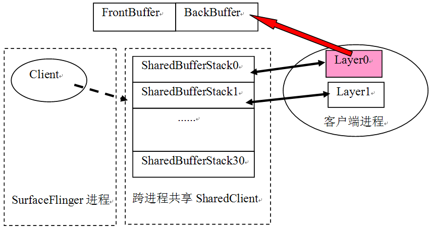 

图8-13  SharedClient的示意图

从上图可知：

·  SF的一个Client分配一个跨进程共享的SharedClient对象。这个对象有31个SharedBufferStack元素，每一个SharedBufferStack对应于一个显示层。

·  一个显示层将创建两个Buffer，后续的PageFlipping就是基于这两个Buffer展开的。

另外，每一个显示层中，其数据的生产和消费并不是直接使用SharedClient对象来进行具体控制的，而是基于SharedBufferServer和SharedBufferClient两个结构，由这两个结构来对该显示层使用的SharedBufferStack进行操作，这些内容在以后的分析中还会碰到。

注意，这里的显示层指的是Normal类型的显示层。

来接着分析后面的_init函数。
<h5>（3）_init函数的分析</h5>
先回顾一下之前的调用，代码如下所示：

[--&gt;SurfaceComposerClient.cpp]

SurfaceComposerClient::SurfaceComposerClient()

{

   ......

   _init(sm, sm-&gt;createConnection());

   ......

}

来看这个_init函数，代码如下所示：

[--&gt;SurfaceComposerClient.cpp]

void SurfaceComposerClient::_init(

       const sp&lt;ISurfaceComposer&gt;&amp; sm, constsp&lt;ISurfaceFlingerClient&gt;&amp; conn)

{

   mPrebuiltLayerState = 0;

   mTransactionOpen = 0;

   mStatus = NO_ERROR;

   mControl = 0;

 

   mClient = conn;//mClient就是BClient的客户端

    mControlMemory =mClient-&gt;getControlBlock();

mSignalServer = sm;// mSignalServer就是BpSurfaceFlinger

//mControl就是那个创建于共享内存之中的SharedClient

    mControl = static_cast&lt;SharedClient*&gt;(mControlMemory-&gt;getBase());

}

_init函数的作用，就是初始化SurfaceComposerClient中的一些成员变量。最重要的是得到了三个成员：

·  mSignalServer ，它其实是SurfaceFlinger在客户端的代理BpSurfaceFlinger，它的主要作用是，在客户端更新完BackBuffer后（也就是刷新了界面后），通知SF进行PageFlipping和输出等工作。

·  mControl，它是跨进程共享的SharedClient，是Surface系统的ControlBlock对象。

·  mClient，它是BClient在客户端的对应物。

 
<h4>2. 到底有多少种对象？</h4>
这一节，出现了好几种类型的对象，通过图8-14来看看它们：

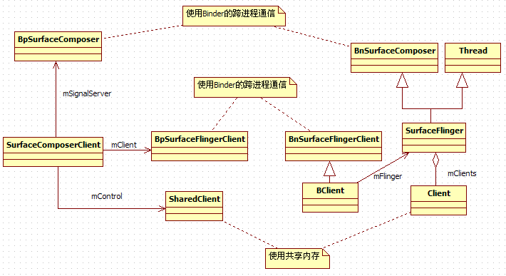 

图8-14  类之间关系展示图

从上图中可以看出：

·  SurfaceFlinger是从Thread派生的，所以它会有一个单独运行的工作线程。

·  BClient和SF之间采用了Proxy模式，BClient支持Binder通信，它接收客户端的请求，并派发给SF执行。

·  SharedClient构建于一块共享内存中，SurfaceComposerClient和Client对象均持有这块共享内存。

在精简流程中，关于SurfaceComposerClient就分析到这里，下面分析第二个步骤中的SurfaceControl对象。
<h3><a>8.4.3  SurfaceControl</a>的分析</h3><h4>1. SurfaceControl的来历</h4>
根据精简的流程可知，这一节要分析的是SurfaceControl对象。先回顾一下这个对象的创建过程，代码如下所示：

[--&gt;android_view_Surface.cpp]

static void Surface_init(JNIEnv* env, jobjectclazz, jobject session,

       jint pid, jstring jname, jint dpy, jint w, jint h, jint format, jintflags)

{

    SurfaceComposerClient* client =

           (SurfaceComposerClient*)env-&gt;GetIntField(session, sso.client);

    //注意这个变量，类型是SurfaceControl，名字却叫surface，稍不留神就出错了。

    sp&lt;SurfaceControl&gt;surface;

if (jname == NULL) {

    //调用Client的createSurface函数，得到一个SurfaceControl对象。

    surface= client-&gt;createSurface(pid, dpy, w, h, format, flags);

    }

......

   //将这个SurfaceControl对象设置到Java层的对象中保存。

   setSurfaceControl(env, clazz, surface);

}

通过上面的代码可知，SurfaceControl对象由createSurface得来，下面看看这个函数。

此时，读者或许会被代码中随意起的变量名搞糊涂，因为我的处理方法碰到了容易混淆的地方，尽量以对象类型来表示这个对象。

<h5>（1）分析createSurface的请求端</h5>
在createSurface内部会使用Binder通信将请求发给SF，所以它分为请求和响应两端，先看请求端，代码如下所示：

[--&gt;SurfaceComposerClient.cpp]

sp&lt;SurfaceControl&gt;SurfaceComposerClient::createSurface(

       int pid,

       DisplayID display,//DisplayID是什么意思？

       uint32_t w,

       uint32_t h,

       PixelFormat format,

       uint32_t flags)

{

   String8 name;

    constsize_t SIZE = 128;

    charbuffer[SIZE];

   snprintf(buffer, SIZE, "&lt;pid_%d&gt;", getpid());

   name.append(buffer);

   //调用另外一个createSurface，多一个name参数

    returnSurfaceComposerClient::createSurface(pid, name, display,

           w, h, format, flags);

 

}

在分析另外一个createSurface之前，应先介绍一下DisplayID的含义：

typedef int32_t    DisplayID;

DisplayID是一个int整型，它的意义是屏幕编号，例如双屏手机就有内屏和外屏两块屏幕。由于目前Android的Surface系统只支持一块屏幕，所以这个变量的取值都是0。

再分析另外一个createSurface函数，它的代码如下所示：

[--&gt;SurfaceComposerClient.cpp]

sp&lt;SurfaceControl&gt;SurfaceComposerClient::createSurface(

       int pid,const String8&amp; name,DisplayID display,uint32_t w,

       uint32_t h,PixelFormat format,uint32_t flags)

{

   sp&lt;SurfaceControl&gt; result;

    if(mStatus == NO_ERROR) {

       ISurfaceFlingerClient::surface_data_t data;

        //调用BpSurfaceFlingerClient的createSurface函数

       sp&lt;ISurface&gt; surface = mClient-&gt;createSurface(&amp;data, pid,name,

                                 display, w, h,format, flags);

        if(surface != 0) {

           if (uint32_t(data.token) &lt; NUM_LAYERS_MAX) {

               //以返回的ISurface对象创建一个SurfaceControl对象

               result = new SurfaceControl(this, surface, data, w, h,

format, flags);

           }

        }

}

    returnresult;//返回的是SurfaceControl对象

}

请求端的处理比较简单：

·  调用跨进程的createSurface函数，得到一个ISurface对象，根据Binder一章的知识可知，这个对象的真实类型是BpSurface。不过以后统称之为ISurface。

·  以这个ISurface对象为参数，构造一个SurfaceControl对象。

createSurface函数的响应端在SurfaceFlinger进程中，下面去看这个函数。

在Surface系统定义了很多类型，咱们也中途休息一下，不妨来看看和字符串“Surface”有关的有多少个类，权当其为小小的娱乐：

Native层有Surface、ISurface、SurfaceControl、SurfaceComposerClient。

Java层有Surface、SurfaceSession。

上面列出的还只是一部分，后面还有呢！*&amp;@&amp;*%￥*

<h5>（2）分析createSurface的响应端</h5>
前面讲过，可把BClient看作是SF的Proxy，它会把来自客户端的请求派发给SF处理，通过代码来看看，是不是这样的？如下所示：

[--&gt;SurfaceFlinger.cpp]

sp&lt;ISurface&gt; BClient::createSurface(

       ISurfaceFlingerClient::surface_data_t* params, int pid,

       const String8&amp; name,

       DisplayID display, uint32_t w, uint32_t h, PixelFormat format,

       uint32_t flags)

{

  //果然是交给SF处理，以后我们将跳过BClient这个代理。  

return mFlinger-&gt;createSurface(mId, pid,name, params, display, w, h,

           format, flags);

}

来看createSurface函数，它的目的就是创建一个ISurface对象，不过这中间的玄机还挺多，代码如下所示：

[--&gt;SurfaceFlinger.cpp]

sp&lt;ISurface&gt;SurfaceFlinger::createSurface(ClientID clientId, int pid,

       const String8&amp; name, ISurfaceFlingerClient::surface_data_t* params,

       DisplayID d, uint32_t w, uint32_t h, PixelFormat format,

       uint32_t flags)

{

sp&lt;LayerBaseClient&gt; layer;//LayerBaseClient是Layer家族的基类

//这里又冒出一个LayerBaseClient的内部类，它也叫Surface，是不是有点头晕了？

   sp&lt;LayerBaseClient::Surface&gt; surfaceHandle;

 

    

Mutex::Autolock _l(mStateLock);

//根据clientId找到createConnection时加入的那个Client对象

   sp&lt;Client&gt; client = mClientsMap.valueFor(clientId);

    ......

   //注意这个id，它的值表示Client创建的是第几个显示层，根据图8-14可以看出，这个id 

//同时也表示将使用SharedBufferStatck数组的第id个元素。

int32_t id = client-&gt;generateId(pid);

//一个Client不能创建多于NUM_LAYERS_MAX个的Layer。

    if(uint32_t(id) &gt;= NUM_LAYERS_MAX) {

       return surfaceHandle;

    }

   //根据flags参数来创建不同类型的显示层，我们在8.4.1节介绍过相关知识

    switch(flags &amp; eFXSurfaceMask) {

       case eFXSurfaceNormal:

           if (UNLIKELY(flags &amp; ePushBuffers)) {

             //创建PushBuffer类型的显示层，我们将在拓展思考部分分析它

            layer = createPushBuffersSurfaceLocked(client, d, id,

                        w, h, flags);

           } else {

               //①创建Normal类型的显示层，我们分析待会这个

               layer = createNormalSurfaceLocked(client, d, id,

                        w, h, flags, format);

           }

           break;

       case eFXSurfaceBlur:

            //创建Blur类型的显示层

           layer = createBlurSurfaceLocked(client, d, id, w, h, flags);

           break;

        case eFXSurfaceDim:

            //创建Dim类型的显示层

           layer = createDimSurfaceLocked(client, d, id, w, h, flags);

           break;

    }

 

    if(layer != 0) {

       layer-&gt;setName(name);

       setTransactionFlags(eTransactionNeeded);

//从显示层对象中取出一个ISurface对象赋值给SurfaceHandle

       surfaceHandle = layer-&gt;getSurface();

        if(surfaceHandle != 0) { 

           params-&gt;token = surfaceHandle-&gt;getToken();

           params-&gt;identity = surfaceHandle-&gt;getIdentity();

           params-&gt;width = w;

           params-&gt;height = h;

           params-&gt;format = format;

        }

    }

    returnsurfaceHandle;//ISurface的Bn端就是这个对象。

}

上面代码中的函数倒是很简单，知识代码里面冒出来的几个新类型和它们的名字却让人有点头晕。先用文字总结一下：

·  LayerBaseClient：前面提到的显示层在代码中的对应物，就是这个LayerBaseClient，不过这是一个大家族，不同类型的显示层将创建不同类型的LayerBaseClient。

·  LayerBaseClient中有一个内部类，名字叫Surface，这是一个支持Binder通信的类，它派生于ISurface。

关于Layer的故事，后面会有单独的章节来介绍。这里先继续分析createNormalSurfaceLocked函数。它的代码如下所示：

[--&gt;SurfaceFlinger.cpp]

sp&lt;LayerBaseClient&gt;SurfaceFlinger::createNormalSurfaceLocked(

       const sp&lt;Client&gt;&amp; client, DisplayID display,

       int32_t id, uint32_t w, uint32_t h, uint32_t flags,

       PixelFormat&amp; format)

{

    

    switch(format) { //一些图像方面的参数设置，可以不去管它。

    casePIXEL_FORMAT_TRANSPARENT:

    casePIXEL_FORMAT_TRANSLUCENT:

       format = PIXEL_FORMAT_RGBA_8888;

       break;

    casePIXEL_FORMAT_OPAQUE:

       format = PIXEL_FORMAT_RGB_565;

       break;

    }

    //①创建一个Layer类型的对象

sp&lt;Layer&gt; layer = new Layer(this, display,client, id);

//②设置Buffer

   status_t err = layer-&gt;setBuffers(w, h, format, flags);

if (LIKELY(err == NO_ERROR)) {

         //初始化这个新layer的一些状态

       layer-&gt;initStates(w, h, flags);

       //③ 还记得在图8-10中提到的Z轴吗？下面这个函数把这个layer加入到Z轴大军中。

       addLayer_l(layer);

}

......

    returnlayer;

}

createNormalSurfaceLocked函数有三个关键点，它们是：

·  构造一个Layer对象。

·  调用Layer对象的setBuffers函数。

·  调用SF的addLayer_l函数。

暂且记住这三个关键点，后文有单独章节分析它们。先继续分析SurfaceControl的流程。
<h5>（3）创建SurfaceControl对象</h5>
当跨进程的createSurface调用返回一个ISurface对象时，将通过下面的代码创建一个SurfaceControl对象：

result = new SurfaceControl(this, surface, data,w, h,format, flags);

下面来看这个SurfaceControl对象为何物。它的代码如下所示：

[--&gt;SurfaceControl.cpp]

SurfaceControl::SurfaceControl(

       const sp&lt;SurfaceComposerClient&gt;&amp; client, 

       const sp&lt;ISurface&gt;&amp; surface,

       const ISurfaceFlingerClient::surface_data_t&amp; data,

       uint32_t w, uint32_t h, PixelFormat format, uint32_t flags)

    //mClient为SurfaceComposerClient，而mSurface指向跨进程createSurface调用

//返回的ISurface对象。

    :mClient(client), mSurface(surface),

     mToken(data.token), mIdentity(data.identity),

     mWidth(data.width), mHeight(data.height), mFormat(data.format),

     mFlags(flags)

{

}

SurfaceControl类可以看作是一个wrapper类：

它封装了一些函数，通过这些函数可以方便地调用mClient或ISurface提供的函数。

在SurfaceControl的分析过程中，还遗留了和Layer相关的部分，下面就来解决它们。
<h4>2. Layer和它的家族</h4>
我们在createSurface中创建的是Normal的Layer，下面先看这个Layer的构造函数。
<h5>（1）Layer的构造</h5>
Layer是从LayerBaseClient派生的，其代码如下所示：

[--&gt;Layer.cpp]

Layer::Layer(SurfaceFlinger* flinger, DisplayIDdisplay, 

       const sp&lt;Client&gt;&amp; c, int32_t i)//这个i表示SharedBufferStack数组的索引

    :   LayerBaseClient(flinger, display, c, i),//先调用基类构造函数

       mSecure(false),

       mNoEGLImageForSwBuffers(false),

       mNeedsBlending(true),

       mNeedsDithering(false)

{

     //getFrontBuffer实际取出的是FrontBuffer的位置

   mFrontBufferIndex = lcblk-&gt;getFrontBuffer();

}

再来看基类LayerBaseClient的构造函数，代码如下所示：

[--&gt;LayerBaseClient.cpp]

LayerBaseClient::LayerBaseClient(SurfaceFlinger*flinger, DisplayID display,

       const sp&lt;Client&gt;&amp; client, int32_t i)

    :LayerBase(flinger, display), lcblk(NULL), client(client), mIndex(i),

      mIdentity(uint32_t(android_atomic_inc(&amp;sIdentity)))

{

   /*

    创建一个SharedBufferServer对象，注意它使用了SharedClient对象，

    并且传入了表示SharedBufferStack数组索引的i和一个常量NUM_BUFFERS

*/

lcblk = new SharedBufferServer(

           client-&gt;ctrlblk, i, NUM_BUFFERS,//该值为常量2，在Layer.h中定义

           mIdentity);

}

SharedBufferServer是什么？它和SharedClient有什么关系？

其实，之前在介绍SharedClient时曾提过与此相关的内容，这里再来认识一下，先看图8-15：

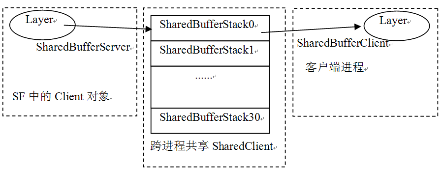 

图8-15  ShardBufferServer的示意图

根据上图并结合前面的介绍，可以得出以下结论：

·  在SF进程中，Client的一个Layer将使用SharedBufferStack数组中的一个成员，并通过SharedBufferServer结构来控制这个成员，我们知道SF是消费者，所以可由SharedBufferServer来控制数据的读取。

·  与之相对应，客户端的进程也会有一个对象来使用这个SharedBufferStatck，可它是通过另外一个叫SharedBufferClient的结构来控制的。客户端为SF提供数据，所以可由SharedBufferClient控制数据的写入。在后文的分析中还会碰到SharedBufferClient。

注意，在拓展思考部分，会有单独章节来分析生产/消费过程中的读写控制。

通过前面的代码可知，Layer对象被new出来后，传给了一个sp对象，读者还记得sp中的onFirstRef函数吗？Layer家族在这个函数中还有一些处理。一起去看看，但这个函数由基类LayerBaseClient实现。

[--&gt;LayerBase.cpp]

void LayerBaseClient::onFirstRef()

{    

   sp&lt;Client&gt; client(this-&gt;client.promote());

if (client != 0) {

//把自己加入client对象的mLayers数组中,这部分内容比较简单，读者可以自行研究

       client-&gt;bindLayer(this, mIndex);

    }

}

好，Layer创建完毕，下面来看第二个重要的函数setBuffers。
<h5>（2）setBuffers的分析</h5>
setBuffers，Layer类以及Layer的基类都有实现。由于创建的是Layer类型的对象，所以请读者直接到Layer.cpp中寻找setBuffers函数。这个函数的目的就是创建用于PageFlipping的FrontBuffer和BackBuffer。一起来看，代码如下所示：

[--&gt;Layer.cpp]

status_t Layer::setBuffers( uint32_t w, uint32_th,

                            PixelFormat format,uint32_t flags)

{

   PixelFormatInfo info;

   status_t err = getPixelFormatInfo(format, &amp;info);

    if(err) return err;

 

//DisplayHardware是代表显示设备的HAL对象，0代表第一块屏幕的显示设备。

//这里将从HAL中取出一些和显示相关的信息。

    constDisplayHardware&amp; hw(graphicPlane(0).displayHardware());

   uint32_t const maxSurfaceDims = min(

           hw.getMaxTextureSize(), hw.getMaxViewportDims());

 

   PixelFormatInfo displayInfo;

    getPixelFormatInfo(hw.getFormat(),&amp;displayInfo);

    constuint32_t hwFlags = hw.getFlags();

    

    ......

     

/*

创建Buffer，这里将创建两个GraphicBuffer。这两个GraphicBuffer就是我们前面

所说的FrontBuffer和BackBuffer。

    */

for (size_t i=0 ; i&lt;NUM_BUFFERS ; i++) {

//注意，这里调用的是GraphicBuffer的无参构造函数,mBuffers是一个二元数组。

       mBuffers[i] = new GraphicBuffer();

}

//又冒出来一个SurfaceLayer类型，#￥%……&amp;*！@

   mSurface = new SurfaceLayer(mFlinger, clientIndex(), this);

    returnNO_ERROR;

}

setBuffers函数的工作内容比较简单，就是：

·  创建一个GraphicBuffer缓冲数组，元素个数为2，即FrontBuffer和BackBuffer。

·  创建一个SurfaceLayer，关于它的身世我们后续再介绍。

GraphicBuffer是Android提供的显示内存管理类，关于它的故事，将在8.4.7节中介绍。我们暂把它当做普通的Buffer即可。

setBuffers中出现的SurfaceLayer类是什么？读者可能对此感觉有些晕乎。待把最后一个关键函数addLayer_l介绍完，或许就不太晕了。
<h5>（3）addLayer_l的分析</h5>
addLayer_l把这个新创建的layer加入自己的Z轴大军，下面来看：

[--&gt;SurfaceFlinger.cpp]

status_t SurfaceFlinger::addLayer_l(constsp&lt;LayerBase&gt;&amp; layer)

{

/*

mCurrentState是SurfaceFlinger定义的一个结构，它有一个成员变量叫

layersSortedByZ，其实就是一个排序数组。下面这个add函数将把这个新的layer按照

它在Z轴的位置加入到排序数组中。mCurrentState保存了所有的显示层。

*/

    ssize_t i = mCurrentState.layersSortedByZ.add(

                             layer,&amp;LayerBase::compareCurrentStateZ);

sp&lt;LayerBaseClient&gt; lbc = 

LayerBase::dynamicCast&lt; LayerBaseClient*&gt;(layer.get());

    if(lbc != 0) {

       mLayerMap.add(lbc-&gt;serverIndex(), lbc);

    }

    returnNO_ERROR;

}

对Layer的三个关键函数都已分析过了，下面正式介绍Layer家族。
<h5>（4）Layer家族的介绍</h5>
前面的内容确让人头晕眼花，现在应该帮大家恢复清晰的头脑。先来“一剂猛药”，见图8-16：

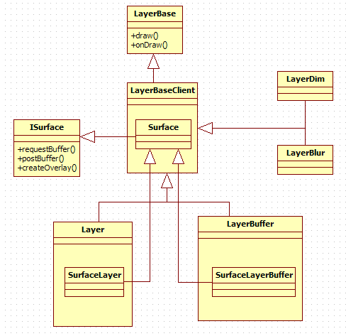 

图8-16  Layer家族

通过上图可知：

·  LayerBaseClient从LayerBase类派生。

·  LayerBaseClient还有四个派生类，分别是Layer、LayerBuffer、LayerDim和LayerBlur。

·  LayerBaseClient定义了一个内部类Surface，这个Surface从ISurface类派生，它支持Binder通信。

·  针对不同的类型，Layer和LayerBuffer分别有一个内部类SurfaceLayer和SurfaceLayerBuffer，它们继承了LayerBaseClient的Surface类。所以对于Normal类型的显示层来说，getSurface返回的ISurface对象的真正类型是SurfaceLayer。

·  LayerDim和LayerBlur类没有定义自己的内部类，所以对于这两种类型的显示层来说，它们直接使用了LayerBaseClient的Surface。

·  ISurface接口提供了非常简单的函数，如requestBuffer、postBuffer等。

这里大量使用了内部类。我们知道，内部类最终都会把请求派发给外部类对象来处理，既然如此，在以后分析中，如果没有特殊情况，就会直接跳到外部类的处理函数中。

强烈建议Google把Surface相关代码好好整理一下，至少让类型名取得更直观些，现在这样确实有点让人头晕。好，来小小娱乐一下。看之前介绍的和“Surface”有关的名字：

Native层有Surface、ISurface、SurfaceControl、SurfaceComposerClient。

Java层有Surface、SurfaceSession。

在介绍完Layer家族后，与它相关的名字又多了几个，它们是

LayerBaseClient::Surface、Layer::SurfaceLayer、LayerBuffer::SurfaceLayerBuffer。

<h4>3. SurfaceControl总结</h4>
SurfaceControl创建后得到了什么呢？可用图8-17来表示：

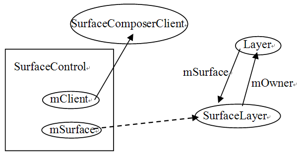 

图8-17  SurfaceControl创建后的结果图

通过上图可以知道：

·  mClient成员变量指向SurfaceComposerClient。

·  mSurface的Binder通信响应端为SurfaceLayer。

·  SurfaceLayer有一个变量mOwner指向它的外部类Layer，而Layer有一个成员变量mSurface指向SurfaceLayer。这个SurfaceLayer对象由getSurface函数返回。

注意，mOwner变量由SurfaceLayer的基类Surface（LayBaseClient的内部类）定义。

接下来就是writeToParcel分析和Native Surface对象的创建了。注意，这个Native的Surface可不是LayBaseClient的内部类Surface。

 
<h3><a>8.4.4  writeToParcel</a>和Surface对象的创建</h3>
从乾坤大挪移的知识可知，前面创建的所有对象都在WindowManagerService所在的进程system_server中，而writeToParcel则需要把一些信息打包到Parcel后，发送到Activity所在的进程。到底哪些内容需要回传给Activity所在的进程呢？

后文将Activity所在的进程简称为Activity端。

<h4>1. writeToParcel分析</h4>
writeToParcel比较简单，就是把一些信息写到Parcel中去。代码如下所示：

[--&gt;SurfaceControl.cpp]

status_t SurfaceControl::writeSurfaceToParcel(

       const sp&lt;SurfaceControl&gt;&amp; control, Parcel* parcel)

{

   uint32_t flags = 0;

   uint32_t format = 0;

   SurfaceID token = -1;

   uint32_t identity = 0;

   uint32_t width = 0;

   uint32_t height = 0;

   sp&lt;SurfaceComposerClient&gt; client;

   sp&lt;ISurface&gt; sur;

    if(SurfaceControl::isValid(control)) {

       token    = control-&gt;mToken;

        identity= control-&gt;mIdentity;

       client   = control-&gt;mClient;

       sur      = control-&gt;mSurface;

       width    = control-&gt;mWidth;

       height   = control-&gt;mHeight;

       format   = control-&gt;mFormat;

       flags    = control-&gt;mFlags;

}

//SurfaceComposerClient的信息需要传递到Activity端，这样客户端那边会构造一个

//SurfaceComposerClient对象

parcel-&gt;writeStrongBinder(client!=0  ? client-&gt;connection() : NULL);

 

//把ISurface对象信息也写到Parcel中，这样Activity端那边也会构造一个ISurface对象

    parcel-&gt;writeStrongBinder(sur!=0?sur-&gt;asBinder(): NULL);

   parcel-&gt;writeInt32(token);

   parcel-&gt;writeInt32(identity);

   parcel-&gt;writeInt32(width);

   parcel-&gt;writeInt32(height);

   parcel-&gt;writeInt32(format);

   parcel-&gt;writeInt32(flags);

    returnNO_ERROR;

}

Parce包发到Activity端后，readFromParcel将根据这个Parcel包构造一个Native的Surface对象，一起来看相关代码。
<h4>2. 分析Native的Surface创建过程</h4>
[--&gt;android_view_Surface.cpp]

static void Surface_readFromParcel(

       JNIEnv* env, jobject clazz, jobject argParcel)

{

   Parcel* parcel = (Parcel*)env-&gt;GetIntField( argParcel, no.native_parcel);

const sp&lt;Surface&gt;&amp; control(getSurface(env,clazz));

//根据服务端的parcel信息来构造客户端的Surface

   sp&lt;Surface&gt; rhs = new Surface(*parcel);

    if(!Surface::isSameSurface(control, rhs)) {

         setSurface(env, clazz, rhs);

    }

}

Native的Surface是怎么利用这个Parcel包的？代码如下所示：

[--&gt;Surface.cpp]

Surface::Surface(const Parcel&amp; parcel)

:mBufferMapper(GraphicBufferMapper::get()), 

mSharedBufferClient(NULL)

{

/*

Surface定义了一个mBuffers变量，它是一个sp&lt;GraphicBuffer&gt;的二元数组，也就是说Surface也存在二个GraphicBuffer，而之前在创建Layer的时候也有两个GraphicBuffer，难道一共有四个GraphicBuffer？这个问题，后面再解答。

 

*/

sp&lt;IBinder&gt; clientBinder =parcel.readStrongBinder();

//得到ISurface的Bp端BpSurface。

   mSurface    =interface_cast&lt;ISurface&gt;(parcel.readStrongBinder());

   mToken      = parcel.readInt32();

   mIdentity   = parcel.readInt32();

   mWidth      = parcel.readInt32();

   mHeight     = parcel.readInt32();

   mFormat     = parcel.readInt32();

   mFlags      = parcel.readInt32();

 

if (clientBinder != NULL) {

     /*

根据ISurfaceFlingerClient对象构造一个SurfaceComposerClient对象，注意我们

现在位于Activity端，这里还没有创建SurfaceComposerClient对象，所以需要创建一个

      */ 

       mClient = SurfaceComposerClient::clientForConnection(clientBinder);

       //SharedBuffer家族的最后一员ShardBufferClient终于出现了。

       mSharedBufferClient = new SharedBufferClient(

                             mClient-&gt;mControl, mToken, 2,mIdentity);

    }

 

   init();//做一些初始化工作。

}

在Surface创建完后，得到什么了呢？看图8-18就可知道：

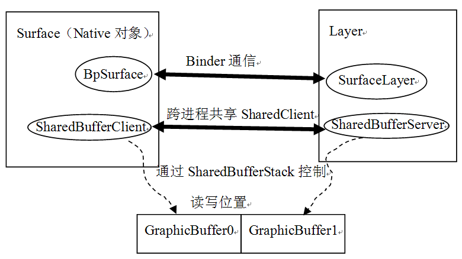 

图8-18  Native Surface的示意图

上图很清晰地说明：

·  ShardBuffer家族依托共享内存结构SharedClient与它共同组成了Surface系统生产/消费协调的中枢控制机构，它在SF端的代表是SharedBufferServer，在Activity端的代表是SharedBufferClient。

·  Native的Surface将和SF中的SurfaceLayer建立Binder联系。

另外，图中还特意画出了承载数据的GraphicBuffer数组，在代码的注释中也针对GraphicBuffer提出了一个问题：Surface中有两个GraphicBuffer，Layer也有两个，一共就有四个GraphicBuffer了，可是为什么这里只画出两个呢？

答案是，咱们不是有共享内存吗？这四个GraphicBuffer其实操纵的是同一段共享内存，所以为了简单，就只画了两个GraphicBuffer。在8.4.7节再介绍GraphicBuffer的故事。

下面，来看中枢控制机构的SharedBuffer家族。
<h4>3. SharedBuffer家族介绍</h4><h5>（1）SharedBuffer家族成员</h5>
SharedBuffer是一个家族名称，它包括多少成员呢？来看SharedBuffer的家族图谱，如图8-19所示：

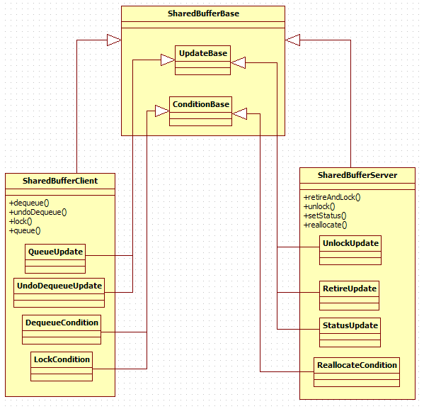 

图8-19  SharedBuffer家族介绍

从上图可以知道：

·  XXXCondition、XXXUpdate等都是内部类，它们主要是用来更新读写位置的。不过这些操作，为什么要通过类来封装呢？因为SharedBuffer的很多操作都使用了C++中的Function Object（函数对象），而这些内部类的实例就是函数对象。函数对象是什么？它怎么使用？对此，在以后的分析中会介绍。
<h5>（2）SharedBuffer家族和SharedClient的关系</h5>
前面介绍过，SharedBufferServer和SharedBufferClient控制的其实只是SharedBufferStack数组中的一个，下面通过SharedBufferBase的构造函数，来看是否如此。

[--&gt;SharedBufferStack.cpp]

SharedBufferBase::SharedBufferBase(SharedClient*sharedClient,

       int surface, int num, int32_t identity)

: mSharedClient(sharedClient),

  mSharedStack(sharedClient-&gt;surfaces+ surface),

 mNumBuffers(num), //根据前面PageFlipping的知识可知，num值为2

mIdentity(identity)

{

 /*

上面的赋值语句中最重要的是第二句：

   mSharedStack(sharedClient-&gt;surfaces +surface)

   这条语句使得这个SharedBufferXXX对象，和SharedClient中SharedBufferStack数组

的第surface个元素建立了关系

*/

}

<h4>4. Native Surface总结</h4>
至此，Activity端Java的Surface对象，终于和一个Native Surface对象挂上了钩，并且这个Native Surface还准备好了绘图所需的一切，其中包括：

·  两个GraphicBuffer，这就是PageFlipping所需要的FrontBuffer和BackBuffer。

·  SharedBufferServer和SharedBufferClient结构，这两个结构将用于生产/消费的过程控制。

·  一个ISurface对象，这个对象连接着SF中的一个SurfaceLayer对象。

·  一个SurfaceComposerClient对象，这个对象连接着SF中的一个BClient对象。

资源都已经准备好了，可以开始绘制UI了。下面，分析两个关键的函数lockCanvas和unlockCanvasAndPost。
<h3><a>8.4.5  lockCanvas</a>和unlockCanvasAndPost的分析</h3>
这一节，分析精简流程中的最后两个函数lockCanvas和unlockCanvasAndPost。
<h4>1. lockCanvas分析</h4>
据前文分析可知，UI在绘制前都需要通过lockCanvas得到一块存储空间，也就是所说的BackBuffer。这个过程中最终会调用Surface的lock函数。其代码如下所示：

[--&gt;Surface.cpp]

status_t Surface::lock(SurfaceInfo* other,Region* dirtyIn, bool blocking) 

{

    //传入的参数中，other用来接收一些返回信息，dirtyIn表示需要重绘的区域  

......

if (mApiLock.tryLock() != NO_ERROR) {//多线程的情况下要锁住

     ......

     returnWOULD_BLOCK;

}

    //设置usage标志，这个标志在GraphicBuffer分配缓冲时有指导作用

   setUsage(GRALLOC_USAGE_SW_READ_OFTEN | GRALLOC_USAGE_SW_WRITE_OFTEN);

    

    //定义一个GraphicBuffer，名字就叫backBuffer。

    sp&lt;GraphicBuffer&gt;backBuffer;

   //①还记得我们说的2个元素的缓冲队列吗？下面的dequeueBuffer将取出一个空闲缓冲

    status_terr = dequeueBuffer(&amp;backBuffer);

   if (err== NO_ERROR) {

        //② 锁住这块buffer

       err = lockBuffer(backBuffer.get());

        if(err == NO_ERROR) {

           const Rect bounds(backBuffer-&gt;width, backBuffer-&gt;height);

           Region scratch(bounds);

           Region&amp; newDirtyRegion(dirtyIn ? *dirtyIn : scratch);

 

          ......

         //mPostedBuffer是上一次绘画时使用的Buffer，也就是现在的frontBuffer

           const sp&lt;GraphicBuffer&gt;&amp; frontBuffer(mPostedBuffer);

           if (frontBuffer !=0 &amp;&amp;

               backBuffer-&gt;width  ==frontBuffer-&gt;width &amp;&amp; 

               backBuffer-&gt;height == frontBuffer-&gt;height &amp;&amp;

               !(mFlags &amp; ISurfaceComposer::eDestroyBackbuffer)) 

           {

               const Region copyback(mOldDirtyRegion.subtract(newDirtyRegion));

               if (!copyback.isEmpty() &amp;&amp; frontBuffer!=0) {

                    /③把frontBuffer中的数据拷贝到BackBuffer中，这是为什么？

                    copyBlt(backBuffer,frontBuffer, copyback);

               }

           }

 

            mDirtyRegion = newDirtyRegion;

           mOldDirtyRegion = newDirtyRegion;

            

 

           void* vaddr;

           //调用GraphicBuffer的lock得到一块内存，内存地址被赋值给了vaddr,

          //后续的作画将在这块内存上展开

           status_t res = backBuffer-&gt;lock(

                    GRALLOC_USAGE_SW_READ_OFTEN |GRALLOC_USAGE_SW_WRITE_OFTEN,

                    newDirtyRegion.bounds(),&amp;vaddr);

           

           mLockedBuffer = backBuffer;

           //other用来接收一些信息。

           other-&gt;w      =backBuffer-&gt;width;  //宽度信息

           other-&gt;h      =backBuffer-&gt;height;

           other-&gt;s      =backBuffer-&gt;stride;

           other-&gt;usage  =backBuffer-&gt;usage;

           other-&gt;format = backBuffer-&gt;format;

           other-&gt;bits   = vaddr; //最重要的是这个内存地址

        }

    }

   mApiLock.unlock();

    returnerr;

}

在上面的代码中，列出了三个关键点：

·  调用dequeueBuffer得到一个空闲缓冲，也可以叫空闲缓冲出队。

·  调用lockBuffer。

·  调用copyBlt函数，把frontBuffer数据拷贝到backBuffer中，这是为什么？

来分析这三个关键点。
<h5>（1）dequeueBuffer的分析</h5>
dequeueBuffer的目的很简单，就是选取一个空闲的GraphicBuffer，其代码如下所示：

[--&gt;Surface.cpp]

status_tSurface::dequeueBuffer(sp&lt;GraphicBuffer&gt;* buffer) {

   android_native_buffer_t* out;

   status_t err = dequeueBuffer(&amp;out);//调用另外一个dequeueBuffer

    if(err == NO_ERROR) {

       *buffer = GraphicBuffer::getSelf(out);

    }

    returnerr;

}

这其中又调用了另外一个dequeueBuffer函数。它的代码如下所示：

[--&gt;Surface.cpp]

intSurface::dequeueBuffer(android_native_buffer_t** buffer)

{

sp&lt;SurfaceComposerClient&gt; client(getClient());

//①调用SharedBufferClient的dequeue函数，它返回当前空闲的缓冲号

  ssize_tbufIdx = mSharedBufferClient-&gt;dequeue();

const uint32_t usage(getUsage());

/*

mBuffers就是我们前面在Surface创建中介绍的那个二元sp&lt;GraphicBuffer&gt;数组。

这里定义的backBuffer是一个引用类型，也就是说如果修改backBuffer的信息，

就相当于修改了mBuffers[bufIdx]

   */

const sp&lt;GraphicBuffer&gt;&amp;backBuffer(mBuffers[bufIdx]);

//mBuffers定义的GraphicBuffer使用的也是无参构造函数，所以此时还没有真实的存储被创建

   if(backBuffer == 0 || //第一次进来满足backBuffer为空这个条件

       ((uint32_t(backBuffer-&gt;usage) &amp; usage) != usage) ||

       mSharedBufferClient-&gt;needNewBuffer(bufIdx)) 

{

   //调用getBufferLocked，需要进去看看。

       err = getBufferLocked(bufIdx, usage);

        if(err == NO_ERROR) {

           mWidth  =uint32_t(backBuffer-&gt;width);

           mHeight = uint32_t(backBuffer-&gt;height);

        }

}

......

}

上面列出了一个关键点，就是SharedBufferClient的dequeue函数，暂且记住这个调用，后面会有单独章节分析生产/消费步调控制。先看getBufferLocked函数，其代码如下所示：

[--&gt;Surface.cpp]

tatus_t Surface::getBufferLocked(int index, intusage)

{

   sp&lt;ISurface&gt; s(mSurface);

   status_t err = NO_MEMORY;

//注意这个currentBuffer也被定义为引用类型

sp&lt;GraphicBuffer&gt;&amp;currentBuffer(mBuffers[index]);

//终于用上了ISurface对象,调用它的requestBuffer得到指定索引index的Buffer

    sp&lt;GraphicBuffer&gt; buffer =s-&gt;requestBuffer(index, usage);

    if (buffer != 0) {

       err = mSharedBufferClient-&gt;getStatus();

        if(!err &amp;&amp; buffer-&gt;handle != NULL) {

//getBufferMapper返回GraphicBufferMapper对象

//调用它的registerBuffer干什么？这个问题我们在8.4.7节回答

           err = getBufferMapper().registerBuffer(buffer-&gt;handle);

           if (err == NO_ERROR) {

         //把requestBuffer得到的值赋给currentBuffer，由于currentBuffer是引用类型，

         //实际上相当于mBuffers[index]=buffer

                currentBuffer = buffer;

               //设置currentBuffer的编号

               currentBuffer-&gt;setIndex(index);

               mNeedFullUpdate = true;

           }

        }else {

           err = err&lt;0 ? err : NO_MEMORY;

        }

        return err; 

}

至此，getBufferLocked的目的，已比较清晰了：

·  调用ISurface的requestBuffer得到一个GraphicBuffer对象，这个GraphicBuffer对象被设置到本地的mBuffers数组中。看来Surface定义的这两个GraphicBuffer和Layer定义的两个GraphicBuffer是有联系的，所以图8-18中只画了两个GraphicBuffer。

我们已经知道，ISurface的Bn端实际上是定义在Layer.类中的SurfaceLayer，下面来看它实现的requestBuffer。由于SurfaceLayer是Layer的内部类，它的工作最终都会交给Layer来处理，所以这里可直接看Layer的requestBuffer函数：

[--&gt;Layer.cpp]

sp&lt;GraphicBuffer&gt; Layer::requestBuffer(intindex, int usage)

{

   sp&lt;GraphicBuffer&gt; buffer;

 

   sp&lt;Client&gt; ourClient(client.promote());

  //lcblk就是那个SharedBufferServer对象，下面这个调用确保index号GraphicBuffer

  //没有被SF当做FrontBuffer使用。

   status_t err = lcblk-&gt;assertReallocate(index);

    ......

    if(err != NO_ERROR) {

        return buffer;

    }

 

   uint32_t w, h;

    { 

       Mutex::Autolock _l(mLock);

        w= mWidth;

        h= mHeight;

   /*

   mBuffers是SF端创建的一个二元数组，这里取出第index个元素，之前说过，

   mBuffers使用的也是GraphicBuffer的无参构造函数，所以此时也没有真实存储被创建。

   */

       buffer = mBuffers[index];

       mBuffers[index].clear();

    }

 

    constuint32_t effectiveUsage = getEffectiveUsage(usage);

   if(buffer!=0 &amp;&amp; buffer-&gt;getStrongCount() == 1) {

        //①分配物理存储，后面会分析这个。

       err = buffer-&gt;reallocate(w, h, mFormat, effectiveUsage);

    } else{

       buffer.clear();

       //使用GraphicBuffer的有参构造，这也使得物理存储被分配

       buffer = new GraphicBuffer(w, h, mFormat, effectiveUsage);

       err = buffer-&gt;initCheck();

    }

 

    ......

 

    if(err == NO_ERROR &amp;&amp; buffer-&gt;handle != 0) {

       Mutex::Autolock _l(mLock);

        if(mWidth &amp;&amp; mHeight) {

           mBuffers[index] = buffer;

           mTextures[index].dirty = true;

        }else {

            buffer.clear();

        }

    }

    returnbuffer;//返回

}

不管怎样，此时跨进程的这个requestBuffer返回的GraphicBuffer，已经和一块物理存储绑定到一起了。所以dequeueBuffer顺利返回了它所需的东西。接下来则需调用lockBuffer。
<h5>（2）lockBuffer的分析</h5>
lockBuffer的代码如下所示：

[--&gt;Surface.cpp]

int Surface::lockBuffer(android_native_buffer_t*buffer)

{

   sp&lt;SurfaceComposerClient&gt; client(getClient());

   status_t err = validate();

   int32_t bufIdx = GraphicBuffer::getSelf(buffer)-&gt;getIndex();

    err =mSharedBufferClient-&gt;lock(bufIdx); //调用SharedBufferClient的lock

    return err;

}

来看这个lock函数：

[--&gt;SharedBufferStack.cpp]

status_t SharedBufferClient::lock(int buf)

{

   LockCondition condition(this, buf);//这个buf是BackBuffer的索引号

   status_t err = waitForCondition(condition);

    returnerr;

}

注意，给waitForCondition函数传递的是一个LockCondition类型的对象，前面所说的函数对象的作用将在这里见识到，先看waitForCondition函数：

[--&gt;SharedBufferStack.h]

template &lt;typename T&gt; //这是一个模板函数

status_t SharedBufferBase::waitForCondition(Tcondition) 

{

    constSharedBufferStack&amp; stack( *mSharedStack );

   SharedClient&amp; client( *mSharedClient );

    constnsecs_t TIMEOUT = s2ns(1);

   Mutex::Autolock _l(client.lock);

    while((condition()==false) &amp;&amp; //注意这个condition()的用法

           (stack.identity == mIdentity) &amp;&amp;

           (stack.status == NO_ERROR))

    {

       status_t err = client.cv.waitRelative(client.lock, TIMEOUT);

        if(CC_UNLIKELY(err != NO_ERROR)) {

           if (err == TIMED_OUT) {

               if (condition()) {//注意这个：condition()，condition是一个对象

                   break;

               } else {

              }

           } else {

              return err;

           }

        }

    }

    return(stack.identity != mIdentity) ? status_t(BAD_INDEX) : stack.status;

}

waitForCondition函数比较简单，就是等待一个条件为真，这个条件是否满足由condition()这条语句来判断。但这个condition不是一个函数，而是一个对象，这又是怎么回事？

这就是Funcition Object（函数对象）的概念。函数对象的本质是一个对象，不过是重载了操作符()，这和重载操作符+、-等没什么区别。可以把它当作是一个函数来看待。

为什么需要函数对象呢？因为对象可以保存信息，所以调用这个对象的()函数就可以利用这个对象的信息了。

来看condition对象的()函数。刚才传进来的是LockCondition，它的()定义如下：

[--&gt;SharedBufferStack.cpp]

boolSharedBufferClient::LockCondition::operator()() {

   //stack、buf等都是这个对象的内部成员，这个对象的目的就是根据读写位置判断这个buffer是

//否空闲。

    return(buf != stack.head || 

           (stack.queued &gt; 0 &amp;&amp; stack.inUse != buf));

} 

SharedBufferStack的读写控制，比Audio中的环形缓冲看起来要简单，实际上它却比较复杂。本章会在扩展部分进行分析。这里给读者准备一个问题，也是我之前百思不得其解的问题：

既然已经调用dequeue得到了一个空闲缓冲，为什么这里还要lock呢？
<h5>（3）拷贝旧数据</h5>
在第三个关键点中，可看到这样的代码：

[--&gt;Surface.cpp]

status_t Surface::lock(SurfaceInfo* other,Region* dirtyIn, bool blocking) 

{

          ......

           const sp&lt;GraphicBuffer&gt;&amp; frontBuffer(mPostedBuffer);

           if (frontBuffer !=0 &amp;&amp;

               backBuffer-&gt;width  ==frontBuffer-&gt;width &amp;&amp; 

               backBuffer-&gt;height == frontBuffer-&gt;height &amp;&amp;

               !(mFlags &amp; ISurfaceComposer::eDestroyBackbuffer)) 

           {

               const Region copyback(mOldDirtyRegion.subtract(newDirtyRegion));

               if (!copyback.isEmpty() &amp;&amp; frontBuffer!=0) {

                    //③把frontBuffer中的数据拷贝到BackBuffer中，这是为什么？

                    copyBlt(backBuffer,frontBuffer, copyback);

               }

           }

    ......

 }

 

上面这段代码所解决的，其实是下面这个问题：

在大部分情况下，UI只有一小部分会发生变化（例如一个按钮被按下去，导致颜色发生变化），这一小部分UI只对应整个GraphicBuffer中的一小块存储（就是在前面代码中见到的dirtyRegion），如果整块存储都更新，则会极大地浪费资源。怎么办？

这就需要将变化的图像和没有发生变化的图像进行叠加。上一次绘制的信息保存在mPostedBuffer中，而这个mPostedBuffer则要在unLockAndPost函数中设置。这里将根据需要，把mPostedBuffer中的旧数据拷贝到BackBuffer中。后续的绘画只要更新脏区域就可以了，这会节约不少资源。

OK，lockCanvas返回后，应用层将在这块画布上尽情作画。假设现在已经在BackBuffer上绘制好了图像，下面就要通过unlockCanvasAndPost进行后续工作了。一起来看。
<h4>2. unlockCanvasAndPost的分析</h4>
进入精简流程的最后一步，就是unlockCanvasAndPost函数，它的代码如下所示：

[--&gt;Surface.cpp]

status_t Surface::unlockAndPost() 

{

    //调用GraphicBuffer的unlock函数

status_t err = mLockedBuffer-&gt;unlock();

//get返回这个GraphicBuffer的编号，queueBuffer将含有新数据的缓冲加入队中。

    err =queueBuffer(mLockedBuffer.get());

   mPostedBuffer = mLockedBuffer; //保存这个BackBuffer为mPostedBuffer

   mLockedBuffer = 0;

    returnerr;

}

来看queueBuffer调用，代码如下所示：

[--&gt;Surface.cpp]

intSurface::queueBuffer(android_native_buffer_t* buffer)

{   

   sp&lt;SurfaceComposerClient&gt; client(getClient());

   

int32_t bufIdx =GraphicBuffer::getSelf(buffer)-&gt;getIndex();

//设置脏Region

mSharedBufferClient-&gt;setDirtyRegion(bufIdx,mDirtyRegion);

//更新写位置。

    err =mSharedBufferClient-&gt;queue(bufIdx);

     if (err== NO_ERROR) {

     //client是BpSurfaceFlinger，调用它的signalServer，这样SF就知道新数据准备好了

       client-&gt;signalServer();

    }

    returnerr;

}

这里，与读写控制有关的是queue函数，其代码如下所示：

[--&gt;SharedBufferStack.cpp]

status_t SharedBufferClient::queue(int buf)

{

    //QueueUpdate也是一个函数对象

QueueUpdate update(this);

//调用updateCondition函数。

   status_t err = updateCondition( update );

   SharedBufferStack&amp; stack( *mSharedStack );

    constnsecs_t now = systemTime(SYSTEM_TIME_THREAD);

   stack.stats.totalTime = ns2us(now - mDequeueTime[buf]);

    returnerr;

}

这个updateCondition函数的代码如下所示：

[--&gt;SharedBufferStack.h]

template &lt;typename T&gt;

status_t SharedBufferBase::updateCondition(Tupdate) {

   SharedClient&amp; client( *mSharedClient );

   Mutex::Autolock _l(client.lock);

   ssize_t result = update();//调用update对象的()函数

   client.cv.broadcast(); //触发同步对象

    returnresult;

}

updateCondition函数和前面介绍的waitForCondition函数一样，都是使用的函数对象。queue操作使用的是QueueUpdate类，关于它的故事，将在拓展部分讨论。
<h4>3. lockCanvas和unlockCanvasAndPost的总结</h4>
总结一下lockCanvas和unlockCanvasAndPost这两个函数的工作流程，用图8-20表示：

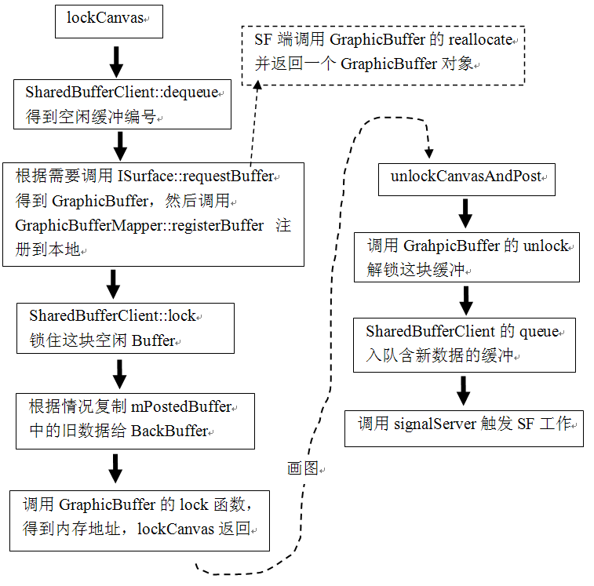 

图8-20  lockCanvas和unlockCanvasAndPost流程总结

 
<h3><a>8.4.6  GraphicBuffer</a>的介绍</h3>
GraphicBuffer是Surface系统中一个高层次的显示内存管理类，它封装了和硬件相关的一些细节，简化了应用层的处理逻辑。先来认识一下它。
<h4>1. 初识GraphicBuffer</h4>
GraphicBuffer的代码如下所示：

[--&gt;GraphicBuffer.h]

class GraphicBuffer

    :public EGLNativeBase&lt;android_native_buffer_t, 

               GraphicBuffer,LightRefBase&lt;GraphicBuffer&gt;&gt;, 

public Flattenable

 

其中，EGLNativeBase是一个模板类。它的定义，代码如下所示：

[--&gt;Android_natives.h]

template &lt;typename NATIVE_TYPE, typenameTYPE, typename REF&gt;

class EGLNativeBase : public NATIVE_TYPE, publicREF

通过替换，可得到GraphicBuffer的派生关系，如图8-21所示：

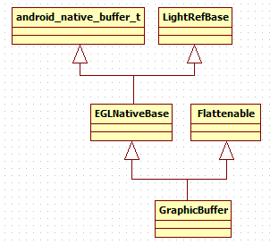 

图8-21  GraphicBuffer派生关系的示意图

从图中可以看出：

·  从LightRefBase派生使GraphicBuffer支持轻量级的引用计数控制。

·  从Flattenable派生使GraphicBuffer支持序列化，它的flatten和unflatten函数用于序列化和反序列化，这样，GraphicBuffer的信息就可以存储到Parcel包中并被Binder传输了。

另外，图中的android_native_buffer_t是GraphicBuffer的父类，它是一个struct结构体。可以将C++语言中的struct和class当作同一个东西，所以GraphicBuffer能从它派生。其代码如下所示：

[--&gt;android_native_buffer.h]

typedef struct android_native_buffer_t

{

#ifdef __cplusplus

   android_native_buffer_t() { 

       common.magic = ANDROID_NATIVE_BUFFER_MAGIC;

       common.version = sizeof(android_native_buffer_t);

       memset(common.reserved, 0, sizeof(common.reserved));

    }

#endif

   //这个android_native_base_t是struct的第一个成员，根据C/C++编译的特性，这个成员

  //在它的派生类对象所占有的内存中也是排第一个。

    structandroid_native_base_t common;

    intwidth;

    intheight;

    intstride;

    intformat;

    intusage;

void* reserved[2];

//这是一个关键成员，保存一些和显示内存分配/管理相关的内容

   buffer_handle_t handle;

 

    void*reserved_proc[8];

} android_native_buffer_t;

GraphicBuffer和显示内存分配相关的部分主要集中在buffer_handle_t这个变量上，它实际上是一个指针，定义如下：

[--&gt;gralloc.h]

typedef const native_handle* buffer_handle_t;

native_handle的定义如下：

[--&gt;native_handle.h]

typedef struct

{

    intversion;        /* version值为sizeof(native_handle_t) */

    intnumFds;        

    intnumInts;        

    intdata[0];        /* data是数据存储空间的首地址 */

} native_handle_t;

typedef native_handle_t native_handle;

读者可能要问，一个小小的GraphicBuffer为什么这么复杂？要回答这个问题，应先对GraphicBuffer有比较全面的了解。按照图8-20中的流程来看GraphicBuffer。
<h4>2. GraphicBuffer和存储的分配</h4>
GraphicBuffer的构造函数最有可能分配存储了。注意，流程中使用的是无参构造函数，所以应先看无参构造函数。
<h5>（1）无参构造函数的分析</h5>
代码如下所示：

[--&gt;GraphicBuffer.cpp]

GraphicBuffer::GraphicBuffer()

    :BASE(), mOwner(ownData), mBufferMapper(GraphicBufferMapper::get()),

     mInitCheck(NO_ERROR), mVStride(0), mIndex(-1)

{

   /*

其中mBufferMapper为GraphicBufferMapper类型，它的创建采用的是单例模式，也就是每个

进程只有一个GraphicBufferMapper对象，读者可以去看看get的实现。

*/

   width  = 

    height= 

    stride= 

    format= 

   usage  = 0;

    handle= NULL; //handle为空

}

在无参构造函数中没有发现和存储分配有关的操作。那么，根据流程，下一个有可能的地方就是reallocate函数了。
<h5>（2）reallocate的分析</h5>
Reallocate的代码如下所示：

[--&gt;GraphicBuffer.cpp]

status_t GraphicBuffer::reallocate(uint32_t w,uint32_t h, PixelFormat f,

       uint32_t reqUsage)

{

    if(mOwner != ownData)

       return INVALID_OPERATION;

 

    if(handle) {//handle值在无参构造函数中初始化为空，所以不满足if的条件

       GraphicBufferAllocator&amp; allocator(GraphicBufferAllocator::get());

       allocator.free(handle);

       handle = 0;

    }

    returninitSize(w, h, f, reqUsage);//调用initSize函数

}

InitSize函数的代码如下所示：

[--&gt;GraphicBuffer.cpp]

status_t GraphicBuffer::initSize(uint32_t w,uint32_t h, PixelFormat format,

       uint32_t reqUsage)

{

    if(format == PIXEL_FORMAT_RGBX_8888)

       format = PIXEL_FORMAT_RGBA_8888;

   /*

GraphicBufferAllocator才是真正的存储分配的管理类，它的创建也是采用的单例模式，

也就是每个进程只有一个GraphicBufferAllocator对象

*/

GraphicBufferAllocator&amp; allocator =GraphicBufferAllocator::get();

//调用GraphicBufferAllocator的alloc来分配存储，注意handle作为指针

//被传了进去，看来handle的值会被修改

   status_t err = allocator.alloc(w, h, format, reqUsage, &amp;handle,&amp;stride);

    if(err == NO_ERROR) {

       this-&gt;width  = w;

       this-&gt;height = h;

       this-&gt;format = format;

       this-&gt;usage  = reqUsage;

       mVStride = 0;

    }

    returnerr;

}

<h5>（3）GraphicBufferAllocator的介绍</h5>
从上面的代码中可以发现，GraphicBuffer的存储分配和GraphicBufferAllocator有关。一个小小的存储分配为什么需要经过这么多道工序呢？还是先来看GraphicBufferAllocator，代码如下所示：

[--&gt;GraphicBufferAllocator.cpp]

GraphicBufferAllocator::GraphicBufferAllocator()

    :mAllocDev(0)

{

hw_module_t const* module;

//调用hw_get_module，得到hw_module_t

    interr = hw_get_module(GRALLOC_HARDWARE_MODULE_ID, &amp;module);

if (err == 0) {

    //调用gralloc_open函数，注意我们把module参数传了进去。

       gralloc_open(module, &amp;mAllocDev);

    }

}

GraphicBufferAllocator在创建时，会首先调用hw_get_module取出一个hw_module_t类型的对象。从名字上看，它和硬件平台有关系。它会加载一个叫libgralloc.硬件平台名.so的动态库。比如，我的HTC G7手机上加载的库是/system/lib/hw/libgraolloc.qsd-8k.so。这个库的源代码在hardware/msm7k/libgralloc-qsd8k目录下。

这个库有什么用呢？简言之，就是为了分配一块用于显示的内存，但为什么需要这种层层封装呢？答案很简单：

封装的目的就是为了屏蔽不同硬件平台的差别。

读者可通过执行adb getprop ro.board.platform命令，得到具体手机上硬件平台的名字。图8-22总结了GraphicBufferAllocator分配内存的途径。这部分代码，读者可参考hardware/libhardware/hardware.c和hardware/msm7k/libgralloc-qsd8k/gralloc.cpp，后文将不再深入探讨和硬件平台有关的知识。

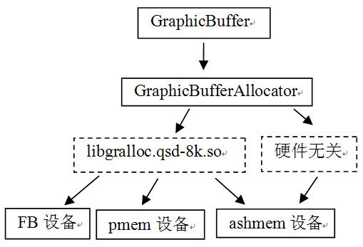 

图8-22  GraphicBufferAllocator内存的分配途径

注意，这里是以G7的libgralloc.qsk-8k.so为示例的。其中pmem设备用来创建一块连续的内存，因为有些硬件设备（例如Camera）工作时需要使用一块连续的内存，对于这种情况，一般就会使用pmem设备来分配内存。

这里，仅讨论图8-22中与硬件无关的分配方式。在这种情况下，将使用ashmem分配共享内存。下面看GraphicBufferAllocator的alloc函数，其代码如下所示：

[--&gt;GraphicBufferAllocator.cpp]

status_t GraphicBufferAllocator::alloc(uint32_tw, uint32_t h, PixelFormat format,int usage, buffer_handle_t* handle, int32_t*stride)

{

   //根据前面的定义可知buffer_handle_t为native_handle_t*类型

   status_t err; 

    

if (usage &amp; GRALLOC_USAGE_HW_MASK) {

    err =mAllocDev-&gt;alloc(mAllocDev, w, h, format, usage, handle, stride);

} else {

       //SW分配，可以做到和HW无关了。

       err = sw_gralloc_handle_t::alloc(w, h, format, usage, handle, stride);

    }

......

    returnerr;

}

下面，来看软件分配的方式：

[--&gt;GraphicBufferAllocator.cpp]

status_t sw_gralloc_handle_t::alloc(uint32_t w,uint32_t h, int format,

        int usage, buffer_handle_t* pHandle, int32_t*pStride)

{

    intalign = 4;

    intbpp = 0;

    ......//格式转换

    size_tbpr = (w*bpp + (align-1)) &amp; ~(align-1);

    size_tsize = bpr * h;

    size_tstride = bpr / bpp;

    size =(size + (PAGE_SIZE-1)) &amp; ~(PAGE_SIZE-1);

    //直接使用了ashmem创建共享内存

    int fd= ashmem_create_region("sw-gralloc-buffer", size);

    

   ......

    //进行内存映射，得到共享内存起始地址

    void*base = mmap(0, size, prot, MAP_SHARED, fd, 0);

    

sw_gralloc_handle_t* hnd = new sw_gralloc_handle_t();

   hnd-&gt;fd = fd;//保存文件描述符

   hnd-&gt;size = size;//保存共享内存的大小

   hnd-&gt;base = intptr_t(base);//intptr_t将void*类型转换成int*类型

   hnd-&gt;prot = prot;//保存属性

   *pStride = stride;

   *pHandle = hnd; //pHandle就是传入的那个handle变量的指针，这里对它进行赋值

    

    returnNO_ERROR;

}

我们知道，调用GraphicBuffer的reallocate函数后，会导致物理存储被分配。前面曾说过，Layer会创建两个GraphicBuffer，而Native Surface端也会创建两个GraphicBuffer，那么这两个GraphicBuffer是怎么建立联系的呢？为什么说native_handle_t是GraphicBuffer的精髓呢？
<h4>3. flatten和unflatten的分析</h4>
试想，Native Surface的GraphicBuffer是怎么和Layer的GraphicBuffer建立联系的：

先通过requestBuffer函数返回一个GraphicBuffer，然后这个GraphicBuffer被Native Surface保存。

这中间的过程其实是一个mini版的乾坤挪移，来看看，代码如下所示：

[--&gt;ISurface.cpp]

//requestBuffer的响应端

status_t BnSurface::onTransact(

   uint32_t code, const Parcel&amp; data, Parcel* reply, uint32_t flags)

{

   switch(code) {

       case REQUEST_BUFFER: {

           CHECK_INTERFACE(ISurface, data, reply);

           int bufferIdx = data.readInt32();

           int usage = data.readInt32();

           sp&lt;GraphicBuffer&gt; buffer(requestBuffer(bufferIdx, usage));

           ......

      /*

requestBuffer的返回值被写到Parcel包中，由于GraphicBuffer从

Flattenable类派生，这将导致它的flatten函数被调用

     */

           return reply-&gt;write(*buffer);

        }

      .......

}

//再来看请求端的处理，在BpSurface中

virtual sp&lt;GraphicBuffer&gt; requestBuffer(intbufferIdx, int usage)

{

    Parcel data, reply;

    data.writeInterfaceToken(ISurface::getInterfaceDescriptor());

    data.writeInt32(bufferIdx);

    data.writeInt32(usage);

    remote()-&gt;transact(REQUEST_BUFFER, data, &amp;reply);

    sp&lt;GraphicBuffer&gt; buffer = new GraphicBuffer();

    reply.read(*buffer);//Parcel调用unflatten函数把信息反序列化到这个buffer中。

    return buffer;//requestBuffer实际上返回的是本地new出来的这个GraphicBuffer

}

通过上面的代码可以发现，挪移的关键体现在flatten和unflatten函数上。请看：
<h5>（1）flatten的分析</h5>
flatten的代码如下所示：

[--&gt;GraphicBuffer.cpp]

status_t GraphicBuffer::flatten(void* buffer,size_t size,

       int fds[], size_t count) const

{

    //buffer是装载数据的缓冲区，由Parcel提供

     ......

 

    if(handle) {

       buf[6] = handle-&gt;numFds;

       buf[7] = handle-&gt;numInts;

       native_handle_t const* const h = handle;

       //把handle的信息也写到buffer中

       memcpy(fds,     h-&gt;data,             h-&gt;numFds*sizeof(int));

       memcpy(&amp;buf[8], h-&gt;data + h-&gt;numFds,h-&gt;numInts*sizeof(int));

    }

 

    returnNO_ERROR;

}

flatten的工作就是把GraphicBuffer的handle变量信息写到Parcel包中。那么接收端如何使用这个包呢？这就是unflatten的工作了。
<h5>（2）unflatten分析</h5>
unflatten的代码如下所示：

[--&gt;GraphicBuffer.cpp]

status_t GraphicBuffer::unflatten(void const*buffer, size_t size,

       int fds[], size_t count)

{

        ......

 

    if(numFds || numInts) {

       width  = buf[1];

       height = buf[2];

       stride = buf[3];

       format = buf[4];

       usage  = buf[5];

        native_handle* h =native_handle_create(numFds, numInts);

       memcpy(h-&gt;data,         fds,     numFds*sizeof(int));

        memcpy(h-&gt;data + numFds, &amp;buf[8],numInts*sizeof(int));

       handle = h;//根据Parcel包中的数据还原一个handle

    } else{

       width = height = stride = format = usage = 0;

       handle = NULL;

    }

    mOwner= ownHandle;

    returnNO_ERROR;

}

unflatten最重要的工作是，根据Parcel包中native_handle的信息，在Native Surface端构造一个对等的GraphicBuffer。这样，Native Surface端的GraphicBuffer实际上就和Layer端的GraphicBuffer管理着同一块共享内存。
<h4>3. registerBuffer的分析</h4>
registerBuffer有什么用呢？上一步调用unflatten后得到了代表共享内存的文件句柄，regiserBuffer的目的就是对它进行内存映射，代码如下所示：

[--&gt;GraphicBufferMapper.cpp]

status_tsw_gralloc_handle_t::registerBuffer(sw_gralloc_handle_t* hnd)

{

if (hnd-&gt;pid != getpid()) {

        //原来是做一次内存映射操作

       void* base = mmap(0, hnd-&gt;size, hnd-&gt;prot, MAP_SHARED, hnd-&gt;fd,0);

        ......

       //base保存着共享内存的起始地址

       hnd-&gt;base = intptr_t(base);

    }

    returnNO_ERROR;

}

<h4>4. lock和unlock的分析</h4>
GraphicBuffer在使用前需要通过lock来得到内存地址，使用完后又会通过unlock释放这块地址。在SW分配方案中，这两个函数实现却非常简单，如下所示：

[--&gt;GraphicBufferMapper.cpp]

//lock操作

int sw_gralloc_handle_t::lock(sw_gralloc_handle_t*hnd, int usage,

       int l, int t, int w, int h, void** vaddr)

{

    *vaddr= (void*)hnd-&gt;base;//得到共享内存的起始地址，后续作画就使用这块内存了。

    returnNO_ERROR;

}

//unlock操作

status_tsw_gralloc_handle_t::unlock(sw_gralloc_handle_t* hnd)

{

    returnNO_ERROR;//没有任何操作

}

对GraphicBuffer的介绍就到这里。虽然采用的是SW方式，但是相信读者也能通过树木领略到森林的风采。从应用层角度看，可以把GraphicBuffer当做一个构架在共享内存之上的数据缓冲。对想深入研究的读者，我建议可按图8-20中的流程来分析。因为流程体现了调用顺序，表达了调用者的意图和目的，只有把握了流程，分析时才不会迷失在茫茫的源码海洋中，才不会被不熟悉的知识阻拦前进的脚步。
<h3><a>8.4.7  </a>深入分析Surface总结</h3>
Surface系统最难的部分，是这个Native Surface的创建和使用，它包括三个方面：

·  Activity的UI和Surface的关系是怎样的？这是8.2节回答的问题。

·  Activity中所使用的Surface是怎么和SurfaceFlinger挂上关系的？这是8.3节回答的问题。

·  本节对第2个问题进行了较深入的研究，分析了Surface和SurfaceFlinger之间的关系，以及生产/消费步调的中枢控制机构SharedBuffer家族和数据的承载者GraphicBuffer。

从上面分析可看出，本章前四节均围绕着这个Surface讲解，一路下来确实遇到了不少曲折和坎坷，望读者跟着源码反复阅读，体会。

 
<h2><a>8.5  SurfaceFlinger</a>的分析</h2>
这一节要对SurfaceFlinger进行分析。相比较而言，SurfaceFlinger不如AudioFlinger复杂。
<h3><a>8.5.1  SurfaceFlinger</a>的诞生</h3>
SurfaceFlinger驻留于system_server进程，这一点和Audio系统的几个Service不太一样。它创建的位置在SystemServer的init1函数中（第4章4.3.2节的第3点）。虽然位于SystemServer这个重要进程中，但是SF创建的代码却略显波澜不惊，没有什么特别之处。SF的创建首先会调用instantiate函数，代码如下所示：

[--&gt;SurfaceFlinger.cpp]

void SurfaceFlinger::instantiate() {

   defaultServiceManager()-&gt;addService(

           String16("SurfaceFlinger"), new SurfaceFlinger());

}

前面在图8-14中指出了SF，同时从BnSurfaceComposer和Thread类中派生，相关代码如下所示：

class SurfaceFlinger : public BnSurfaceComposer,protected Thread

从Thread派生这件事给了我们一个很明确的提示：

·  SurfaceFlinger会单独启动一个工作线程。

我们知道，Thread类的工作线程要通过调用它的run函数来创建，那这个run函数是在什么地方调用的呢？当然，最有可能的就是在构造函数中：

[--&gt;SurfaceFlinger.cpp]

SurfaceFlinger::SurfaceFlinger()

    :   BnSurfaceComposer(), Thread(false),

       mTransactionFlags(0),

       mTransactionCount(0),

       mResizeTransationPending(false),

       mLayersRemoved(false),

       mBootTime(systemTime()),

       mHardwareTest("android.permission.HARDWARE_TEST"),

       mAccessSurfaceFlinger("android.permission.ACCESS_SURFACE_FLINGER"),

       mDump("android.permission.DUMP"),

       mVisibleRegionsDirty(false),

       mDeferReleaseConsole(false),

       mFreezeDisplay(false),

        mFreezeCount(0),

       mFreezeDisplayTime(0),

       mDebugRegion(0),

       mDebugBackground(0),

       mDebugInSwapBuffers(0),

       mLastSwapBufferTime(0),

       mDebugInTransaction(0),

       mLastTransactionTime(0),

       mBootFinished(false),

       mConsoleSignals(0),

       mSecureFrameBuffer(0)

{

   init();//上面没有调用run。必须到init去检查一番。

}

//init函数更简单了。

void SurfaceFlinger::init()

{

    charvalue[PROPERTY_VALUE_MAX];

   property_get("debug.sf.showupdates", value, "0");

   mDebugRegion = atoi(value);

   property_get("debug.sf.showbackground", value, "0");

   mDebugBackground = atoi(value);

}

嗯？上面的代码竟然没有创建工作线程？难道在其他地方？读者别急着在文件中搜索“run”，先猜测一下答案。

·  根据之前所学的知识，另外一个最有可能的地方就是onFirstRef函数了，这个函数在对象第一次被sp化后调用，很多初始化的工作也可以在这个函数中完成。

事实是这样吗？一起来看。
<h4>1. onFirstRef的分析</h4>
onFirstRef的代码如下所示：

[--&gt;SurfaceFlinger.cpp]

void SurfaceFlinger::onFirstRef()

{

//真是梦里寻他千百度，果然是在onFirstRef中创建了工作线程

run("SurfaceFlinger",PRIORITY_URGENT_DISPLAY);

/*

mReadyToRunBarrier类型为Barrier，这个类就是封装了一个Mutex对象和一个Condition

对象。如果读者还记得第5章有关同步类的介绍，理解这个Barrier就非常简单了。下面调用的

wait函数表示要等待一个同步条件的满足。

*/

    mReadyToRunBarrier.wait(); 

}

onFirstRef创建工作线程后，将等待一个同步条件，那么这个同步条件在哪里被触发呢？相信不用多说 大家也知道：

在工作线程中被触发，而且极有可能是在readyToRun函数中。

不清楚Thread类的读者可以复习一下与第5章有关的Thread类的知识。

<h4>2. readyToRun的分析</h4>
SF的readyToRun函数将完成一些初始化工作，代码如下所示：

[--&gt;SurfaceFlinger.cpp]

status_t SurfaceFlinger::readyToRun()

{

    intdpy = 0;

    {

        //①GraphicPlane是什么？

       GraphicPlane&amp; plane(graphicPlane(dpy));

        //②为这个GraphicPlane设置一个HAL对象——DisplayHardware

       DisplayHardware* const hw = new DisplayHardware(this, dpy);

       plane.setDisplayHardware(hw);

    }

 

 //创建Surface系统中的“CB”对象，按照老规矩，应该先创建一块共享内存，然后使用placment new

   mServerHeap = new MemoryHeapBase(4096,

                            MemoryHeapBase::READ_ONLY, 

                            "SurfaceFlingerread-only heap");

   /*

注意这个“CB“对象的类型是surface_flinger_cblk_t。为什么在CB上打引号呢？因为这个对象

谈不上什么控制，只不过被用来存储一些信息罢了。其控制作用完全达不到audio_track_cblk_t

的程度。基于这样的事实，我们把前面提到的SharedBuffer家族称之为CB对象。

*/

   mServerCblk=

      static_cast&lt;surface_flinger_cblk_t*&gt;(mServerHeap-&gt;getBase());

   //placementnew创建surface_flinger_cblk_t

   new(mServerCblk) surface_flinger_cblk_t;

 

    constGraphicPlane&amp; plane(graphicPlane(dpy));

    constDisplayHardware&amp; hw = plane.displayHardware();

    constuint32_t w = hw.getWidth();

    constuint32_t h = hw.getHeight();

    constuint32_t f = hw.getFormat();

   hw.makeCurrent();

 

    //当前只有一块屏

    mServerCblk-&gt;connected|= 1&lt;&lt;dpy;

    //屏幕在“CB”对象中的代表是display_cblk_t

   display_cblk_t* dcblk = mServerCblk-&gt;displays + dpy;

   memset(dcblk, 0, sizeof(display_cblk_t));

   dcblk-&gt;w            =plane.getWidth();

   dcblk-&gt;h            =plane.getHeight();

    ......//获取屏幕信息

 

   //还用上了内联汇编语句。

   asmvolatile ("":::"memory"); 

  /*

   下面是一些和OpenGL相关的函数调用。读者如感兴趣，可以研究一下，

   至少SurfaceFlinger.cpp中所涉及的相关代码还不算难懂

  */

   glActiveTexture(GL_TEXTURE0);

   glBindTexture(GL_TEXTURE_2D, 0);

   ......

   glOrthof(0, w, h, 0, 0, 1);

 

   //LayerDim是Dim类型的Layer

  LayerDim::initDimmer(this, w, h);

 

    //还记得在onFirstRef函数中的wait吗？下面的open将触发这个同步条件

    mReadyToRunBarrier.open();

    //资源准备好后，init将启动bootanim程序，这样就见到开机动画了。

   property_set("ctl.start", "bootanim");

    

    returnNO_ERROR;

}

在上面的代码中，列出了两个关键点，下面一一进行分析。
<h5>（1）GraphicPlane的介绍</h5>
GraphicPlane是屏幕在SF代码中的对应物，根据前面的介绍，目前Android只支持一块屏幕，所以SF定义了一个一元数组：

GraphicPlane     mGraphicPlanes[1];

GraphicPlane虽无什么特别之处，但它有一个重要的函数，叫setDisplayHardware，这个函数把代表显示设备的HAL对象和GraphicPlane关联起来。这也是下面要介绍的第二个关键点DisplayHardware。
<h5>（2）DisplayHardware的介绍</h5>
从代码上看，这个和显示相关的HAL对象是在工作线程中new出来的，先看它的构造函数，代码如下所示：

[--&gt;DisplayHardware.cpp]

DisplayHardware::DisplayHardware(

       const sp&lt;SurfaceFlinger&gt;&amp; flinger,

       uint32_t dpy)

    :DisplayHardwareBase(flinger, dpy)

{

   init(dpy); //最重要的是这个init函数。

}

init函数非常重要，应进去看看。下面先思考一个问题。

前面在介绍FrameBuffer时说过，显示这一块需要使用FrameBuffer，但在GraphicBuffer中用的却是ashmem创建的共享内存。也就是说，之前在共享内存中绘制的图像和FrameBuffer没有什么关系。那么FrameBuffer是在哪里创建的呢？

答案就在init函数中，代码如下所示：

[--&gt;DisplayHardware.cpp]

void DisplayHardware::init(uint32_t dpy)

{

//FrameBufferNativeWindow实现了对FrameBuffer的管理和操作，该类中创建了两个

//FrameBuffer，分别起到FrontBuffer和BackBuffer的作用。

mNativeWindow = new FramebufferNativeWindow();

 

   framebuffer_device_t const * fbDev = mNativeWindow-&gt;getDevice();

 

   mOverlayEngine = NULL;

   hw_module_t const* module;//Overlay相关

    if(hw_get_module(OVERLAY_HARDWARE_MODULE_ID, &amp;module) == 0) {

       overlay_control_open(module, &amp;mOverlayEngine);

    }

......

 

    EGLint w, h, dummy;

    EGLintnumConfigs=0;

   EGLSurface surface;

   EGLContext context;

    mFlags= CACHED_BUFFERS;

  //EGLDisplay在EGL中代表屏幕

   EGLDisplay display = eglGetDisplay(EGL_DEFAULT_DISPLAY);

    ......

   /*

    surface是EGLSurface类型，下面这个函数会将EGL和Android中的Display系统绑定起来，

    后续就可以利用OpenGL在这个Surface上绘画，然后通过eglSwappBuffers输出图像了。

    */

    surface= eglCreateWindowSurface(display, config, 

    mNativeWindow.get(),NULL);

   ......

   mDisplay = display;

   mConfig  = config;

   mSurface = surface;

   mContext = context;

   mFormat  = fbDev-&gt;format;

   mPageFlipCount = 0;

}

根据上面的代码，现在可以回答前面的问题了：

·  SF创建FrameBuffer，并将各个Surface传输的数据（通过GraphicBuffer）混合后，再由自己传输到FrameBuffer中进行显示。

本节的内容，实际上涉及另外一个比Surface更复杂的Display系统，出于篇幅和精力的原因，本书目前不打算讨论它。

<h3><a>8.5.2  SF</a>工作线程的分析</h3>
SF中的工作线程就是来做图像混合的，比起AudioFlinger来，它相当简单，下面是它的代码：

[--&gt;SurfaceFlinger.cpp]

bool SurfaceFlinger::threadLoop()

{

   waitForEvent();//① 等待什么事件呢？

 

   if (UNLIKELY(mConsoleSignals)) {

       handleConsoleEvents();

    }

    if(LIKELY(mTransactionCount == 0)) {

      const uint32_t mask = eTransactionNeeded | eTraversalNeeded;

       uint32_t transactionFlags = getTransactionFlags(mask);

        if(LIKELY(transactionFlags)) {

            //Transaction（事务）处理，放到本节最后来讨论

           handleTransaction(transactionFlags);

        }

    }

 

    //②处理PageFlipping工作

   handlePageFlip();

 

    constDisplayHardware&amp; hw(graphicPlane(0).displayHardware());

if (LIKELY(hw.canDraw() &amp;&amp; !isFrozen())) {

        //③处理重绘

        handleRepaint();

        hw.compositionComplete();

        //④投递BackBuffer

       unlockClients();

        postFramebuffer();

    } else{

       unlockClients();

       usleep(16667); 

    }

    returntrue;

}

ThreadLoop一共有四个关键点，这里，分析除Transaction外的三个关键点。
<h4>1. waitForEvent</h4>
SF工作线程一上来就等待事件，它会是什么事件呢？来看代码：

[--&gt;SurfaceFlinger.cpp]

void SurfaceFlinger::waitForEvent()

{

    while(true) {

       nsecs_t timeout = -1;

       const nsecs_t freezeDisplayTimeout = ms2ns(5000);

        ......

 

       MessageList::value_type msg = mEventQueue.waitMessage(timeout);

 

        ......//还有一些和冻屏相关的内容

        if(msg != 0) {

           switch (msg-&gt;what) {

//千辛万苦就等这一个重绘消息

               case MessageQueue::INVALIDATE:

                     return;

           }

        }

    }

}

SF收到重绘消息后，将退出等待。那么，是谁发送的这个重绘消息呢？还记得在unlockCanvasAndPost函数中调用的signal吗？它在SF端的实现代码如下：

[--&gt;SurfaceFlinger]

void SurfaceFlinger::signal() const {

    const_cast&lt;SurfaceFlinger*&gt;(this)-&gt;signalEvent();

}

void SurfaceFlinger::signalEvent() {

   mEventQueue.invalidate(); //往消息队列中加入INVALIDATE消息

}

<h4>2. 分析handlePageFlip</h4>
SF工作线程从waitForEvent中返回后，下一步要做的就是处理事务和handlePageFlip了。先看handlePageFlip，从名字上可知，它和PageFlipping工作有关。

注意：事务处理将在8.5.3节中介绍。

代码如下所示：

[--&gt;SurfaceFlinger.cpp]

void SurfaceFlinger::handlePageFlip()

{

bool visibleRegions = mVisibleRegionsDirty;

/*

还记得前面所说的mCurrentState吗？它保存了所有显示层的信息，而绘制的时候使用的

mDrawingState则保存了当前需要显示的显示层信息。

*/

LayerVector&amp; currentLayers =

                 const_cast&lt;LayerVector&amp;&gt;(mDrawingState.layersSortedByZ);

//①调用lockPageFlip

visibleRegions |= lockPageFlip(currentLayers);

const DisplayHardware&amp; hw =graphicPlane(0).displayHardware();

//取得屏幕的区域

const Region screenRegion(hw.bounds());

if (visibleRegions) {

     Region opaqueRegion;

     computeVisibleRegions(currentLayers, mDirtyRegion,opaqueRegion);

     mWormholeRegion = screenRegion.subtract(opaqueRegion);

     mVisibleRegionsDirty = false;

  }

//② 调用unlockPageFlip

unlockPageFlip(currentLayers);

mDirtyRegion.andSelf(screenRegion);

}

hanldePageFlip调用了两个看起来是一对的函数：lockPageFlip和unlockPageFlip。这两个函数会干些什么呢？
<h5>（1）lockPageFlip的分析</h5>
先看lockPageFlip函数，代码如下所示：

[--&gt;SurfaceFlinger.cpp]

bool SurfaceFlinger::lockPageFlip(constLayerVector&amp; currentLayers)

{

    boolrecomputeVisibleRegions = false;

    size_tcount = currentLayers.size();

   sp&lt;LayerBase&gt; const* layers = currentLayers.array();

    for(size_t i=0 ; i&lt;count ; i++) {

       const sp&lt;LayerBase&gt;&amp; layer = layers[i];

        //调用每个显示层的lockPageFlip

       layer-&gt;lockPageFlip(recomputeVisibleRegions);

    }

    returnrecomputeVisibleRegions;

}

假设当前的显示层是Layer类型，那么得转到Layer类去看它的lockPageFlip函数，代码如下所示：

[--&gt;Layer.cpp]

void Layer::lockPageFlip(bool&amp;recomputeVisibleRegions)

{

  //lcblk是SharedBufferServer类型，调用retireAndLock函数将返回FrontBuffer的

  //索引号

    ssize_tbuf = lcblk-&gt;retireAndLock();

    ......

 

   mFrontBufferIndex = buf;

 

    //得到FrontBuffer对应的GraphicBuffer

   sp&lt;GraphicBuffer&gt; newFrontBuffer(getBuffer(buf));

if (newFrontBuffer != NULL) {

        //取出脏区域

      const Region dirty(lcblk-&gt;getDirtyRegion(buf));

        //和GraphicBuffer所表示的区域进行裁剪，得到一个脏区域

       mPostedDirtyRegion = dirty.intersect( newFrontBuffer-&gt;getBounds() );

 

       const Layer::State&amp; front(drawingState());

        if(newFrontBuffer-&gt;getWidth()  ==front.requested_w &amp;&amp;

            newFrontBuffer-&gt;getHeight() ==front.requested_h)

        {

           if ((front.w != front.requested_w) ||

               (front.h != front.requested_h))

           {

               ...... //需要重新计算可见区域

               recomputeVisibleRegions = true;

           }

           mFreezeLock.clear();

        }

    } else{

       mPostedDirtyRegion.clear();

    }

    if(lcblk-&gt;getQueuedCount()) {

       mFlinger-&gt;signalEvent();

    }

/*

如果脏区域不为空，则需要绘制成纹理，reloadTexture将绘制一张纹理保存在

mTextures数组中，里边涉及很多OpenGL的操作，读者有兴趣可以自己研究。

*/

    if(!mPostedDirtyRegion.isEmpty()) {

       reloadTexture( mPostedDirtyRegion );

    }

}

 

我们知道，Layer的lockPageFlip将根据FrontBuffer的内容生成一张纹理。那么，unlockPageFlip会做些什么呢？
<h5>（2）unlockPageFlip的分析</h5>
unlockPageFlip的代码如下所示：

[--&gt;SurfaceFlinger.cpp]

void SurfaceFlinger::unlockPageFlip(constLayerVector&amp; currentLayers)

{

     constGraphicPlane&amp; plane(graphicPlane(0));

    constTransform&amp; planeTransform(plane.transform());

    size_tcount = currentLayers.size();

   sp&lt;LayerBase&gt; const* layers = currentLayers.array();

    for(size_t i=0 ; i&lt;count ; i++) {

       const sp&lt;LayerBase&gt;&amp; layer = layers[i];

        //调用每个显示层的unlockPageFlip，Layer的unlockPageFlip主要做一些

//区域的清理工作，读者可以自己看看。

       layer-&gt;unlockPageFlip(planeTransform, mDirtyRegion);

    }

}

<h5>（3）handlePageFlip的总结</h5>
handlePageFlip的工作其实很简单，以Layer类型为例来总结一下：

各个Layer需要从FrontBuffer中取得新数据，并生成一张OpenGL中的纹理。纹理可以看做是一个图片，这个图片的内容就是FrontBuffer中的图像。

现在每一个Layer都准备好了新数据，下一步的工作当然就是绘制了。来看handleRepaint函数。
<h4>3. 分析handleRepaint函数</h4>
handleRepaint函数的代码如下所示：

[--&gt;SurfaceFlinger.cpp]

void SurfaceFlinger::handleRepaint()

{

    mInvalidRegion.orSelf(mDirtyRegion);

    if(mInvalidRegion.isEmpty()) {

       return;

    }

 

    ......

 

    constDisplayHardware&amp; hw(graphicPlane(0).displayHardware());

   glMatrixMode(GL_MODELVIEW);

   glLoadIdentity();

 

   uint32_t flags = hw.getFlags();

    if((flags &amp; DisplayHardware::SWAP_RECTANGLE) || 

       (flags &amp; DisplayHardware::BUFFER_PRESERVED)) 

    {

        ......//计算mDirtyRegion

    }

 

    // 在脏区域上进行绘制

   composeSurfaces(mDirtyRegion);

   mDirtyRegion.clear();

}

其中，composeSurfaces将不同的显示层内容进行混合，其实就是按Z轴的顺序由里到外依次绘制。当然，最后绘制的数据有可能遮盖前面绘制的数据，代码如下所示：

[--&gt;SurfaceFlinger.cpp]

void SurfaceFlinger::composeSurfaces(constRegion&amp; dirty)

{

    constSurfaceFlinger&amp; flinger(*this);

    constLayerVector&amp; drawingLayers(mDrawingState.layersSortedByZ);

    constsize_t count = drawingLayers.size();

   sp&lt;LayerBase&gt; const* const layers = drawingLayers.array();

    for(size_t i=0 ; i&lt;count ; ++i) {

       const sp&lt;LayerBase&gt;&amp; layer = layers[i];

        const Region&amp;visibleRegion(layer-&gt;visibleRegionScreen);

        if(!visibleRegion.isEmpty())  {

           const Region clip(dirty.intersect(visibleRegion));

           if (!clip.isEmpty()) {

               layer-&gt;draw(clip); //调用各个显示层的layer函数

            }

        }

    }

}

draw函数在LayerBase类中实现，代码如下所示：

[--&gt;LayerBase.cpp]

void LayerBase::draw(const Region&amp; inClip)const

{  

    ......

    glEnable(GL_SCISSOR_TEST);

   onDraw(clip);//调用子类的onDraw函数

}

至于Layer是怎么实现这个onDraw函数的，代码如下所示：

[--&gt;Layer.cpp]

void Layer::onDraw(const Region&amp; clip) const

{

    intindex = mFrontBufferIndex;

    if(mTextures[index].image == EGL_NO_IMAGE_KHR)

       index = 0;

        GLuint textureName = mTextures[index].name;

        ....

       Region holes(clip.subtract(under));

        if(!holes.isEmpty()) {

           clearWithOpenGL(holes);

        }

       return;

}

//index是FrontBuffer对应生成的纹理，在lockPageFlip函数中就已经生成了。

 drawWithOpenGL(clip,mTextures[index]);//将纹理画上去，里面有很多和OpenGL相关内容

}

drawWithOpenGL函数由LayerBase实现，看它是不是使用了这张纹理，代码如下所示：

[--&gt;LayerBase.cpp]

void LayerBase::drawWithOpenGL(const Region&amp;clip, const Texture&amp; texture) const

{

    constDisplayHardware&amp; hw(graphicPlane(0).displayHardware());

    constuint32_t fbHeight = hw.getHeight();

    constState&amp; s(drawingState());

    

    //validateTexture函数内部将绑定指定的纹理

   validateTexture(texture.name);

    //下面就是OpenGL操作函数了

   glEnable(GL_TEXTURE_2D);

 

    ......

 

   glMatrixMode(GL_TEXTURE);

   glLoadIdentity();

 

    //坐标旋转

    switch(texture.transform) {

       case HAL_TRANSFORM_ROT_90:

           glTranslatef(0, 1, 0);

           glRotatef(-90, 0, 0, 1);

           break;

       case HAL_TRANSFORM_ROT_180:

           glTranslatef(1, 1, 0);

           glRotatef(-180, 0, 0, 1);

           break;

       case HAL_TRANSFORM_ROT_270:

           glTranslatef(1, 0, 0);

           glRotatef(-270, 0, 0, 1);

           break;

    }

 

if (texture.NPOTAdjust) {

        //缩放处理

       glScalef(texture.wScale, texture.hScale, 1.0f);

    }

   //使能纹理坐标

glEnableClientState(GL_TEXTURE_COORD_ARRAY);

//设置顶点坐标

glVertexPointer(2, GL_FIXED, 0, mVertices);

//设置纹理坐标

   glTexCoordPointer(2, GL_FIXED, 0, texCoords);

 

    while(it != end) {

       const Rect&amp; r = *it++;

       const GLint sy = fbHeight - (r.top + r.height());

        //裁剪

       glScissor(r.left, sy, r.width(), r.height());

        //画矩形

       glDrawArrays(GL_TRIANGLE_FAN, 0, 4);

}

//禁止纹理坐标

   glDisableClientState(GL_TEXTURE_COORD_ARRAY);

}

纹理绑定是OpenGL的常用函数，其代码如下所示。

[--&gt;LayerBase.cpp]

void LayerBase::validateTexture(GLinttextureName) const

{

    //下面这个函数将绑定纹理

   glBindTexture(GL_TEXTURE_2D, textureName);

    ......//其他一些设置

}

handleRepaint这个函数基本上就是按Z轴的顺序对每一层进行重绘，重绘的方法就是使用OpenGL。

我在Android平台上有几个月的OpenGL开发经历，还谈不上很深刻，其中的一些资料，希望能够给感兴趣的读者提供参考。

1）OpenGL的入门教材当选NeHe的资料，大略看前几章即可。

2） Android平台上关于OpenGL ES的开发，有一篇很详细的Word文档叫《OpenGL ESTutorial for Android》。该文详细描述了在Android平台上进行OpenGL开发的流程。大家可跟着这篇教材，在模拟器上做一些练习。那里面涉及到的一些基础知识，从前面介绍的入门教材中可以学到。

3）有了前面两点的基础后，就需要对整个OpenGL有比较完整深入的了解了。我在那时所看的书是《OpenGL Programming Guide (7th Edition)》。该书很厚，有1000多页。里面有一些内容可能与工作无涉，只要大概知道有那回事就行了，暂时不必深入学习，等需要时再进一步学习并运用。我在开发的项目中曾用到的光照、雾化等效果，都是之前先知道有这个东西，后来在项目中才逐渐学习运用的。

4）嵌入式平台上用的其实是OpenGL ES。这里，还有一本书叫《OpenGL ES 2.0 Programming Guide》，它介绍了OpenGL ES的开发，读者可认真修习。

5）在Android SDK文档中，对OpenGL API的描述只寥寥数语。怎么办？由于它使用了J2ME中的javax.microedition.khronos.opengles包，所以J2ME的SDK文档中对OpenGL的API有着非常详细的描述，读者手头应该要有一个J2ME的文档。

6）如果想做深入开发，就不得不学习计算机图形学了。我后来买了书，可惜没时间学了。

<h4>4. unlockClients和postFrameBuffer的分析</h4>
在绘制完图后，还有两项工作需要做，一个涉及unlockClients函数，另外一个涉及postFrameBuffer函数，这两个函数分别干了什么呢？unlockClients的代码如下所示：

[--&gt;SurfaceFlinger.cpp]

void SurfaceFlinger::unlockClients()

{

    constLayerVector&amp; drawingLayers(mDrawingState.layersSortedByZ);

    constsize_t count = drawingLayers.size();

   sp&lt;LayerBase&gt; const* const layers = drawingLayers.array();

    for (size_t i=0 ; i&lt;count ; ++i) {

       const sp&lt;LayerBase&gt;&amp; layer = layers[i];

       layer-&gt;finishPageFlip();

    }

}

再看Layer的finishPageFlip函数，代码如下所示：

[--&gt;Layer.cpp]

void Layer::finishPageFlip()

{

    //释放FrontBufferIndex

   status_t err = lcblk-&gt;unlock( mFrontBufferIndex );

}

原来，unlockClients会释放之前占着的FrontBuffer的索引号。下面看最后一个函数postFrameBuffer，代码如下所示：

[--&gt;SurfaceFlinger.cpp]

void SurfaceFlinger::postFramebuffer()

{

    if(!mInvalidRegion.isEmpty()) {

       const DisplayHardware&amp; hw(graphicPlane(0).displayHardware());

       const nsecs_t now = systemTime();

       mDebugInSwapBuffers = now;

//调用这个函数后，混合后的图像就会传递到屏幕中显示了

       hw.flip(mInvalidRegion);

       mLastSwapBufferTime = systemTime() - now;

       mDebugInSwapBuffers = 0;

       mInvalidRegion.clear();

    }

}

flip将调用在DisplayHardware一节中提到的eglSwapBuffer函数，来完成FrameBuffer的PageFlip操作，代码如下所示：

[--&gt;DisplayHardware.cpp]

void DisplayHardware::flip(const Region&amp;dirty) const

{

   checkGLErrors();

 

   EGLDisplay dpy = mDisplay;

   EGLSurface surface = mSurface;

 

......

    if(mFlags &amp; PARTIAL_UPDATES) {

       mNativeWindow-&gt;setUpdateRectangle(dirty.getBounds());

    }

    

   mPageFlipCount++;

   eglSwapBuffers(dpy, surface);//PageFlipping，此后图像终于显示在屏幕上了！

    

}

<h3><a>8.5.3  Transaction</a>的分析</h3>
Transaction是“事务”的意思。在我脑海中，关于事务的知识来自于数据库。在数据库操作中，事务意味着一次可以提交多个SQL语句，然后一个commit就可让它们集中执行，而且数据库中的事务还可以回滚，即恢复到事务提交前的状态。

SurfaceFlinger为什么需要事务呢？从上面对数据库事务的描述来看，是不是意味着一次执行多个请求呢？如直接盯着SF的源码来分析，可能不太容易搞清楚事务的前因后果，我想还是用老办法，从一个例子入手吧。

在WindowManagerService.java中，有一个函数之前分析过，现在再看看，代码如下所示：

[--&gt;WindowManagerService.java::WinState]

Surface createSurfaceLocked() {             

Surface.openTransaction(); //开始一次transaction

   try {

     try {

         mSurfaceX = mFrame.left + mXOffset;

          mSurfaceY = mFrame.top + mYOffset;

          //设置Surface的位置

         mSurface.setPosition(mSurfaceX, mSurfaceY);

          ......

        } 

       }finally {

             Surface.closeTransaction(); //关闭这次事务

     }

这个例子很好地展示了事务的调用流程，它会依次调用：

·  openTransaction

·  setPosition

·  closeTransaction

下面就来分析这几个函数的调用。
<h4>1. openTransaction的分析</h4>
看JNI对应的函数，代码如下所示：

[--&gt;android_View_Surface.cpp]

static void Surface_openTransaction(JNIEnv* env,jobject clazz)

{

    //调用SurfaceComposerClient的openGlobalTransaction函数

SurfaceComposerClient::openGlobalTransaction();

}

下面转到SurfaceComposerClient，代码如下所示：

[--&gt;SurfaceComposerClient.cpp]

voidSurfaceComposerClient::openGlobalTransaction()

{

   Mutex::Autolock _l(gLock);

    ......

 

    constsize_t N = gActiveConnections.size();

    for(size_t i=0; i&lt;N; i++) {

        sp&lt;SurfaceComposerClient&gt;client(gActiveConnections.valueAt(i).promote());

        //gOpenTransactions存储当前提交事务请求的Client

        if(client != 0 &amp;&amp; gOpenTransactions.indexOf(client) &lt; 0) {

           //Client是保存在全局变量gActiveConnections中的SurfaceComposerClient

            //对象，调用它的openTransaction。

           if (client-&gt;openTransaction() == NO_ERROR) {

               if (gOpenTransactions.add(client) &lt; 0) {

                   client-&gt;closeTransaction();

              }

           } 

           ......

        }

    }

}

上面是一个静态函数，内部调用了各个SurfaceComposerClient对象的openTranscation，代码如下所示：

[--&gt;SurfaceComposerClient.cpp]

status_tSurfaceComposerClient::openTransaction()

{

    if(mStatus != NO_ERROR)

       return mStatus;

   Mutex::Autolock _l(mLock);

    mTransactionOpen++; //一个计数值，用来控制事务的提交。

    if(mPrebuiltLayerState == 0) {

       mPrebuiltLayerState = new layer_state_t;

    }

    returnNO_ERROR;

}

layer_state_t是用来保存Surface的一些信息的，比如位置、宽、高等信息。实际上，调用的setPosition等函数，就是为了改变这个layer_state_t中的值。
<h4>2. setPosition的分析</h4>
上文说过，SFC中有一个layer_state_t对象用来保存Surface的各种信息。这里以setPosition为例，来看它的使用情况。这个函数是用来改变surface在屏幕上的位置的，代码如下所示：

[--&gt;android_View_Surface.cpp]

static void Surface_setPosition(JNIEnv* env,jobject clazz, jint x, jint y)

{

    constsp&lt;SurfaceControl&gt;&amp; surface(getSurfaceControl(env, clazz));

    if(surface == 0) return;

   status_t err = surface-&gt;setPosition(x, y);

}

[--&gt;Surface.cpp]

status_t SurfaceControl::setPosition(int32_t x,int32_t y) {

    constsp&lt;SurfaceComposerClient&gt;&amp; client(mClient);

   status_t err = validate();

if (err &lt; 0) return err;

//调用SurfaceComposerClient的setPosition函数

    returnclient-&gt;setPosition(mToken, x, y);

}

[--&gt;SurfaceComposerClient.cpp]

status_tSurfaceComposerClient::setPosition(SurfaceID id, int32_t x, int32_t y)

{

   layer_state_t* s = _lockLayerState(id); //找到对应的layer_state_t

    if(!s) return BAD_INDEX;

   s-&gt;what |= ISurfaceComposer::ePositionChanged;

   s-&gt;x = x;

   s-&gt;y = y;  //上面几句修改了这块layer的参数

   _unlockLayerState(); //该函数将unlock一个同步对象，其他没有做什么工作

    returnNO_ERROR;

}

setPosition就是修改了layer_state_t中的一些参数，那么，这个状态是什么时候传递到SurfaceFlinger中的呢？
<h4>3. 分析closeTransaction</h4>
相信读者此时已明白为什么叫“事务”了。原来，在openTransaction和closeTransaction中可以有很多操作，然后由closeTransaction一次性地把这些修改提交到SF上，来看代码：

[--&gt;android_View_Surface.cpp]

static void Surface_closeTransaction(JNIEnv*env, jobject clazz)

{

   SurfaceComposerClient::closeGlobalTransaction();

}

[--&gt;SurfaceComposerClient.cpp]

voidSurfaceComposerClient::closeGlobalTransaction()

{

......

 

const size_t N = clients.size();

sp&lt;ISurfaceComposer&gt;sm(getComposerService());

//①先调用SF的openGlobalTransaction

sm-&gt;openGlobalTransaction();

for (size_t i=0; i&lt;N; i++) {

   //②然后调用每个SurfaceComposerClient对象的closeTransaction

   clients[i]-&gt;closeTransaction();

}

//③最后调用SF的closeGlobalTransaction

sm-&gt;closeGlobalTransaction();

}

上面一共列出了三个函数，它们都是跨进程的调用，下面对其一一进行分析。
<h5>（1）SurfaceFlinger的openGlobalTransaction分析</h5>
这个函数其实很简单，略看就行了。

[--&gt;SurfaceFlinger.cpp]

void SurfaceFlinger::openGlobalTransaction()

{

   android_atomic_inc(&amp;mTransactionCount);//又是一个计数控制

}

<h5>（2）SurfaceComposerClient的closeTransaction分析</h5>
代码如下所示：

[--&gt;SurfaceComposerClient.cpp]

status_tSurfaceComposerClient::closeTransaction()

{

    if(mStatus != NO_ERROR)

       return mStatus;

 

   Mutex::Autolock _l(mLock);

   ......

    constssize_t count = mStates.size();

if (count) {

     //mStates是这个SurfaceComposerClient中保存的所有layer_state_t数组，也就是

    //每个Surface一个。然后调用跨进程的setState

       mClient-&gt;setState(count, mStates.array());

       mStates.clear();

    }

    returnNO_ERROR;

}

BClient的setState，最终会转到SF的setClientState上，代码如下所示：

[--&gt;SurfaceFlinger.cpp]

status_t SurfaceFlinger::setClientState(ClientIDcid, int32_t count,

                          const layer_state_t*states)

{

   Mutex::Autolock _l(mStateLock);

   uint32_t flags = 0;

    cid&lt;&lt;= 16;

    for(int i=0 ; i&lt;count ; i++) {

       const layer_state_t&amp; s = states[i];

       sp&lt;LayerBaseClient&gt; layer(getLayerUser_l(s.surface | cid));

        if(layer != 0) {

           const uint32_t what = s.what;

           if (what &amp; ePositionChanged) {

               if (layer-&gt;setPosition(s.x, s.y))

                    //eTraversalNeeded表示需要遍历所有显示层

                    flags |= eTraversalNeeded;

           }

            ....

    if(flags) {

       setTransactionFlags(flags);//这里将会触发threadLoop的事件。

    }

    returnNO_ERROR;

}

[--&gt;SurfaceFlinger.cpp]

uint32_tSurfaceFlinger::setTransactionFlags(uint32_t flags, nsecs_t delay)

{

   uint32_t old = android_atomic_or(flags, &amp;mTransactionFlags);

    if((old &amp; flags)==0) {

        if(delay &gt; 0) {

           signalDelayedEvent(delay);

        }else {

            signalEvent();  //设置完mTransactionFlags后，触发事件。

        }

    }

    returnold;

}

<h5>（3）SurfaceFlinger的closeGlobalTransaction分析</h5>
来看代码：

[--&gt;SurfaceFlinger.cpp]

void SurfaceFlinger::closeGlobalTransaction()

{

if (android_atomic_dec(&amp;mTransactionCount) ==1) {

//注意下面语句的执行条件，当mTransactionCount变为零时才执行，这意味着

//openGlobalTransaction两次的话，只有最后一个closeGlobalTransaction调用

//才会真正地提交事务

       signalEvent();

 

       Mutex::Autolock _l(mStateLock);

       //如果这次事务涉及尺寸调整，则需要等一段时间

       while (mResizeTransationPending) {

           status_t err = mTransactionCV.waitRelative(mStateLock, s2ns(5));

           if (CC_UNLIKELY(err != NO_ERROR)) {

               mResizeTransationPending = false;

               break;

           }

        }

    }

}

关于事务的目的，相信读者已经比较清楚了：

·  就是将一些控制操作（例如setPosition）的修改结果，一次性地传递给SF进行处理。

那么，哪些操作需要通过事务来传递呢？通过查看Surface.h可以知道，下面这些操作需要通过事务来传递（这里只列出了几个经常用的函数）：setPosition、setAlpha、show/hide、setSize、setFlag等。

由于这些修改不像重绘那么简单，有时它会涉及其他的显示层，例如在显示层A的位置调整后，之前被A遮住的显示层B，现在可能变得可见了。对于这种情况，所提交的事务会设置eTraversalNeeded标志，这个标志表示要遍历所有显示层进行处理。关于这一点，来看工作线程中的事务处理。
<h4>4. 工作线程中的事务处理</h4>
还是从代码入手分析，如下所示：

[--&gt;SurfaceFlinger.cpp]

bool SurfaceFlinger::threadLoop()

{

   waitForEvent();

    if(LIKELY(mTransactionCount == 0)) {

     const uint32_t mask = eTransactionNeeded | eTraversalNeeded;

      uint32_ttransactionFlags = getTransactionFlags(mask);

        if(LIKELY(transactionFlags)) {

           handleTransaction(transactionFlags);

        }

}

...

 }

getTransactionFlags函数的实现蛮有意思，不妨看看其代码，如下所示：

[--&gt;SurfaceFlinger.cpp]

uint32_t SurfaceFlinger::getTransactionFlags(uint32_tflags)

{

//先通过原子操作去掉mTransactionFlags中对应的位。

//而后原子操作返回的旧值和flags进行与操作

return android_atomic_and(~flags,&amp;mTransactionFlags) &amp; flags;

}

getTransactionFlags所做的工作不仅仅是get那么简单，它还设置了mTransactionFlags，从这个角度来看，getTransactionFlags这个名字有点名不副实。

接着来看最重要的handleTransaction函数，代码如下所示：

[--&gt;SurfaceFlinger.cpp]

void SurfaceFlinger::handleTransaction(uint32_ttransactionFlags)

{

   Vector&lt; sp&lt;LayerBase&gt; &gt; ditchedLayers;

 

    { 

       Mutex::Autolock _l(mStateLock);

        //调用handleTransactionLocked函数处理

       handleTransactionLocked(transactionFlags, ditchedLayers);

    }

 

    

    constsize_t count = ditchedLayers.size();

    for(size_t i=0 ; i&lt;count ; i++) {

        if(ditchedLayers[i] != 0) {

        //ditch是丢弃的意思，有些显示层可能被hide了，所以这里做些收尾的工作

          ditchedLayers[i]-&gt;ditch(); 

        }

    }

}

[--&gt;SurfaceFlinger.cpp]

void SurfaceFlinger::handleTransactionLocked(

       uint32_t transactionFlags, Vector&lt; sp&lt;LayerBase&gt; &gt;&amp;ditchedLayers)

{

    //这里使用了mCurrentState，它的layersSortedByZ数组存储了SF中所有的显示层

    constLayerVector&amp; currentLayers(mCurrentState.layersSortedByZ);

    constsize_t count = currentLayers.size();

 

     constbool layersNeedTransaction = transactionFlags &amp; eTraversalNeeded;

     //如果需要遍历所有显示的话。

    if(layersNeedTransaction) {

       for (size_t i=0 ; i&lt;count ; i++) {

           const sp&lt;LayerBase&gt;&amp; layer = currentLayers[i];

           uint32_t trFlags = layer-&gt;getTransactionFlags(eTransactionNeeded);

           if (!trFlags) continue;

           //调用各个显示层的doTransaction函数。

            constuint32_t flags = layer-&gt;doTransaction(0);

           if (flags &amp; Layer::eVisibleRegion)

               mVisibleRegionsDirty = true;

        }

    }

    if(transactionFlags &amp; eTransactionNeeded) {

        if(mCurrentState.orientation != mDrawingState.orientation) {

         //横竖屏如果发生切换，需要对应变换设置。

           const int dpy = 0;

           const int orientation = mCurrentState.orientation;

           const uint32_t type = mCurrentState.orientationType;

           GraphicPlane&amp; plane(graphicPlane(dpy));

           plane.setOrientation(orientation);

 

           ......

        }

     /*

      mLayersRemoved变量在显示层被移除的时候设置，例如removeLayer函数，这些函数

      也会触发handleTranscation函数的执行

     */

      if(mLayersRemoved) {

           mLayersRemoved = false;

           mVisibleRegionsDirty = true;

           const LayerVector&amp; previousLayers(mDrawingState.layersSortedByZ);

           const size_t count = previousLayers.size();

           for (size_t i=0 ; i&lt;count ; i++) {

               const sp&lt;LayerBase&gt;&amp; layer(previousLayers[i]);

               if (currentLayers.indexOf( layer ) &lt; 0) {

                  ditchedLayers.add(layer);

                   mDirtyRegionRemovedLayer.orSelf(layer-&gt;visibleRegionScreen);

               }

            }

        }

       free_resources_l();

    }

    //提交事务处理，有必要进去看看。

   commitTransaction();

}

每个显示层对事务的具体处理，都在它们的doTranscation函数中，读者若有兴趣，可进去看看。需要说明的是，每个显示层内部也有一个状态变量，doTransaction会更新这些状态变量。

回到上面的函数，最后它将调用commitTransaction提交事务，代码如下所示：

[--&gt;SurfaceFlinger.cpp]

void SurfaceFlinger::commitTransaction()

{

   //mDrawingState将使用更新后的mCurrentState

   mDrawingState = mCurrentState; 

mResizeTransationPending = false;

//触发一个条件变量，这样等待在closeGlobalTransaction函数中的线程可以放心地返回了。

   mTransactionCV.broadcast(); 

}

<h3><a>8.5.4  SurfaceFlinger</a>的总结</h3>
通过前面的分析，使我们感受了SurfaceFlinger的风采。从整体上看，SurfaceFlinger不如AudioFlinger复杂，它的工作集中在工作线程中，下面用图8-23来总线一下SF工作线程：

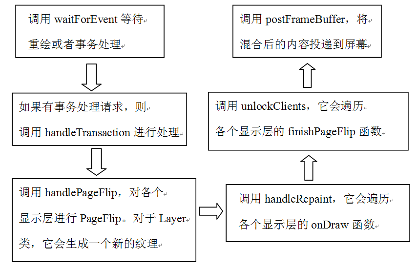 

图8-23  SF工作线程的流程总结

 
<h2><a>8.6  </a>拓展思考</h2>
本章的拓展思考分三个部分：

·  介绍SharedBufferServer和SharedBufferClient的工作流程。

·  关于ViewRoot一些问题的总结。

·  LayerBuffer的工作原理分析。
<h3><a>8.6.1  Surface</a>系统的CB对象分析</h3>
根据前文分析可知，Surface系统中的CB，其实是指SharedBuffer家族，它们是Surface系统中对生产者和消费者进行步调控制的中枢机构。先通过图8-24来观察整体的工作流程是怎样的。

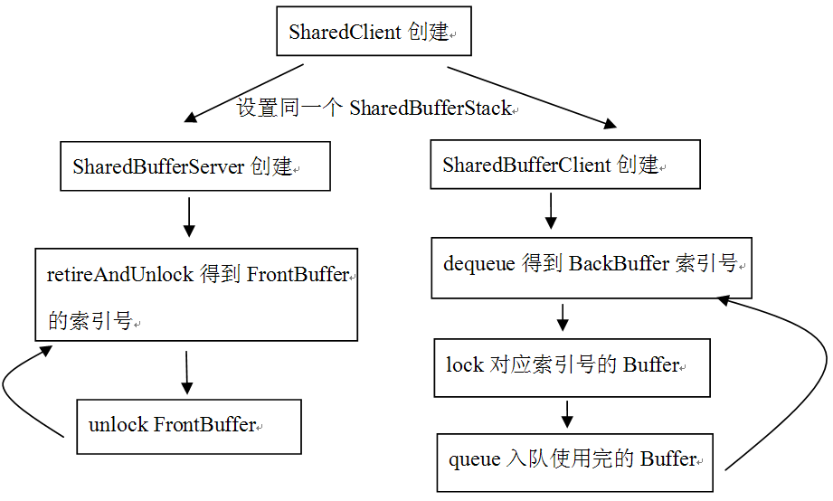 

图8-24  SharedBuffer家族使用流程

为书写方便起见，我们简称：

·  SharedBufferServer为SBS。

·  SharedBufferClient为SBC。

·  SharedBufferStack为SBT。

其中SBC和SBS都是建立在同一个SBT上的，所以应先看SBT，下面代码列出了其中几个与读写控制有关的成员变量：

[--&gt;SharedBufferStack.h]

class SharedBufferStack{

 ......

 /*

虽然PageFlipping使用Front和Back两个Buffer就可以了，但是SBT的结构和相关算法

是支持多个缓冲的。另外，缓冲是按照块来获取的，也就是一次获得一块缓冲，每块缓冲用

一个编号表示（这一点在之前的分析已经介绍过了）。

 */

int32_t head;      

 int32_tavailable; //当前可用的空闲缓冲个数

  int32_t queued;    //SBC投递的脏缓冲个数

  int32_tinUse;  //SBS当前正在使用的缓冲编号

  ......//上面这几个参数联合SBC中的tail，我称之为控制参数。

}

SBT创建好后，下面就是SBS和SBC的创建了，它们会做什么特殊工作吗？
<h4>1. SBS和SBC的创建</h4>
下面分别看SBS和SBC的创建，代码如下所示：

[--&gt;SharedBufferStack.cpp]

SharedBufferServer::SharedBufferServer(SharedClient*sharedClient,

       int surface, int num, int32_t identity)

    :SharedBufferBase(sharedClient, surface, num, identity)

{

mSharedStack-&gt;init(identity);//这个函数将设置inUse为-1

//下面设置SBT中的参数，我们关注前三个

   mSharedStack-&gt;head = num-1;

    mSharedStack-&gt;available = num;

mSharedStack-&gt;queued = 0;

//设置完后，head=2-1=1,available=2,queued=0，inUse=-1

   mSharedStack-&gt;reallocMask = 0;

   memset(mSharedStack-&gt;dirtyRegion, 0,sizeof(mSharedStack-&gt;dirtyRegion));

}

再看SBC的创建，代码如下所示：

[--&gt;SharedBufferStack.cpp]

SharedBufferClient::SharedBufferClient(SharedClient*sharedClient,

       int surface, int num, int32_t identity)

    :SharedBufferBase(sharedClient, surface, num, identity), tail(0)

{

    tail =computeTail(); //tail是SBC定义的变量，注意它不是SBT定义的。

}

看computeTail函数的代码：

[--&gt;SharedBufferStack.cpp]

int32_t SharedBufferClient::computeTail() const

{

   SharedBufferStack&amp; stack( *mSharedStack );

   int32_t newTail;

   int32_t avail;

   int32_t head;

    do {

       avail = stack.available; //available=2,head=1

       head = stack.head;

    }while (stack.available != avail);

   newTail = head - avail + 1;//newTail=1-2+1=0

    if(newTail &lt; 0) {

       newTail += mNumBuffers;

    } elseif (newTail &gt;= mNumBuffers) {

       newTail -= mNumBuffers;

    }

    return newTail;//计算得到newTail=0

}

来看在SBC和SBS创建后，控制参数的变化，如图8-25所示：

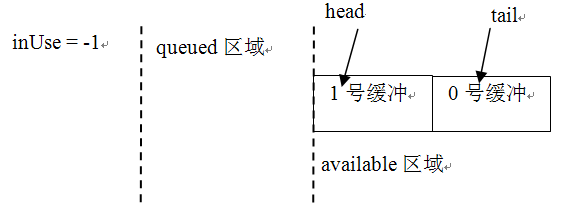 

图8-25  SBC/SBS创建后的示意图

 
<h4>2. SBC端流程的分析</h4>
下面看SBC端的工作流程。
<h5>（1）dequeue分析</h5>
先看SBC的dequeue函数：

[--&gt;SharedBufferStack.cpp]

ssize_t SharedBufferClient::dequeue()

{

   SharedBufferStack&amp; stack( *mSharedStack );

...... 

//DequeueCondition函数对象

   DequeueCondition condition(this);

status_t err = waitForCondition(condition);

//成功以后，available减1，表示当前可用的空闲buffer只有1个

if (android_atomic_dec(&amp;stack.available) == 0) {

    ......

    }

 

int dequeued = tail; //tail值为0，所以dequeued的值为0。

//tail加1。如果超过2，则重新置为0，这表明tail的值在0,1间循环。

    tail =((tail+1 &gt;= mNumBuffers) ? 0 : tail+1);

...... 

//返回的这个dequeued值为零，也就是tail加1操作前的旧值。这一点请读者务必注意。

    returndequeued;

}

其中DequeueCondition的操作函数很简单，代码如下所示：

bool SharedBufferClient::DequeueCondition::operator()(){

    returnstack.available &gt; 0;//只要available大于0就算满足条件，第一次进来肯定满足

}

用图8-26来表示dequeue的结果：

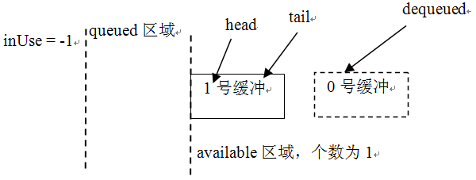 

图8-26  dequeue结果图

注意，在上图中，0号缓冲用虚线表示，SBC的dequeue函数的返回值用dequeued表示，它指向这个0号缓冲。正如代码中注释的那样，由于dequeued的值用的是tail的旧值，而tail是SBC定义的变量，不是SBT定义的变量，所以tail在SBS端是不可见的。这就带来了一个潜在危险，即0号缓冲不能保证当前是真正空闲的，因为SBS可能正在用它，怎么办？试看下面的lock。
<h5>（2）lock的分析</h5>
lock使用了LockCondition，其中传入的参数buf的值为0，也就是上图中的dequeue的值，代码如下所示：

[--&gt;SharedBufferStack.cpp]

status_t SharedBufferClient::lock(int buf)

{

   LockCondition condition(this, buf);

    status_terr = waitForCondition(condition);

    returnerr;

}

看LockCondition的()函数：

boolSharedBufferClient::LockCondition::operator()() {

   /*

这个条件其实就是判断编号为buf的Buffer是不是被使用了。

buf值为0，head值为1，queued为0，inUse为-1

   */

    return(buf != stack.head || 

            (stack.queued &gt; 0 &amp;&amp; stack.inUse!= buf));

}

现在可以知道为什么SBC需要调用dequeue和lock函数了吗？原来：

·  dequeue只是根据本地变量tail计算一个本次应当使用的Buffer编号，其实也就是在0,1之间循环。上次用0号缓冲，那么这次就用1号缓冲。

·  lock函数要确保这个编号的Buffer没有被SF当做FrontBuffer使用。
<h5>（3）queue的分析</h5>
Activity端在绘制完UI后，将把BackBuffer投递出去以显示。接着上面的流程，这个BackBuffer的编号是0。待Activity投递完后，才会调用signal函数触发SF消费，所以在此之前格局不会发生变化。试看投递用的queue函数，注意传入的buf参数为0，代码如下所示：

[--&gt;SharedBufferStack.cpp]

status_t SharedBufferClient::queue(int buf)

{

   QueueUpdate update(this);

   status_t err = updateCondition( update );

    ......

    returnerr;

}

//直接看这个QueueUpdate函数对象

ssize_tSharedBufferClient::QueueUpdate::operator()() {

   android_atomic_inc(&amp;stack.queued);//queued增加1，现在该值由零变为1

    returnNO_ERROR;

}

至此，SBC端走完一个流程了，结果是什么？如图8-27所示：

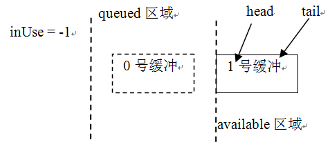 

图8-27  queue结果图

0号缓冲被移到queue的区域了，可目前还没有变量指向它。假设SBC端此后没有绘制UI的需求，那么它就会沉默一段时间。
<h4>3. SBS端的分析</h4>
SBS的第一个函数是retireAndLock，它使用了RetireUpdate函数对象，代码如下所示：

[--&gt;SharedBufferStack.cpp]

ssize_t SharedBufferServer::retireAndLock()

{

   RetireUpdate update(this, mNumBuffers);

   ssize_t buf = updateCondition( update );

    returnbuf;

}

这个RetireUpdate对象的代码如下所示：

ssize_tSharedBufferServer::RetireUpdate::operator()() {

    //先取得head值，为1

   int32_t head = stack.head;

 

    //inUse被设置为1。表明要使用1吗？目前的脏缓冲应该是0才对

   android_atomic_write(head, &amp;stack.inUse);

 

   int32_tqueued;

    do {

       queued = stack.queued; //queued目前为1

        if(queued == 0) {

           return NOT_ENOUGH_DATA;

        }

      //下面这个原子操作使得stack.queued减1.

    }while (android_atomic_cmpxchg(queued, queued-1, &amp;stack.queued));

    //while循环退出后，queued减1，又变为0。

    //head值也在0,1间循环，现在head值变为0了

    head =((head+1 &gt;= numBuffers) ? 0 : head+1);

 

    //inUse被设置为0

   android_atomic_write(head, &amp;stack.inUse);

 

    // head值被设为0

   android_atomic_write(head, &amp;stack.head);

    

    // available加1，变成2.

    android_atomic_inc(&amp;stack.available);

    returnhead;//返回0

}

retireAndLock的结果是什么呢？看看图8-28就知道了。

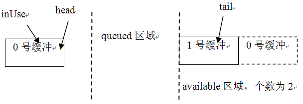 

图8-28  retireAndLock结果图

注意上面的available区域，1号缓冲右边的0号缓冲是用虚线表示的，这表示该0号缓冲实际上并不存在于available区域，但available的个数却变成2了。这样不会出错吗？当然不会，因为SBC的lock函数要确保这个缓冲没有被SBS使用。

我们来看SBS端最后一个函数，它调用了SBS的unlock，这个unlock使用了UnlockUpdate函数对象，就直接了解它好了，代码如下所示：

[--&gt;SharedBufferStack.cpp]

ssize_tSharedBufferServer::UnlockUpdate::operator()() {

    ......

   android_atomic_write(-1, &amp;stack.inUse);//inUse被设置为-1

    returnNO_ERROR;

}

unlock后最终的结果是什么呢？如图8-29所示：

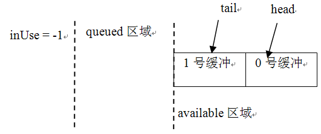 

图8-29  unlock结果图

比较一下图8-29和图8-25，可能会发现两图中tail和head刚好反了，这就是PageFlip。另外，上面的函数大量使用了原子操作。原子操作的目的就是为了避免锁的使用。值得指出的是，updateConditon函数和waitForCondition函数都使用了Mutex，也就是说，上面这些函数对象又都是在Mutex锁的保护下执行的，为什么会这样呢？先来看一段代码：

像下面这样的代码，如果有锁控制的话根本用不着一个while循环，因为有锁的保护，没有其他线程

能够修改stack.queued的值，所以用while来循环判断android_atomic_cmpxchg没有什么意义。

   int32_tqueued;

    do {

       queued = stack.queued;

        if(queued == 0) {

           return NOT_ENOUGH_DATA;

        }

    }while (android_atomic_cmpxchg(queued, queued-1, &amp;stack.queued));

    

对于上面这个问题，我目前还不知道答案，但对其也进行了修改，把函数对象放在锁外执行，结果在真机上运行没有出现任何异常现象。也许Google或哪位读者能给这个问题一个较好的解释。

为什么我对生产/消费的同步控制如此感兴趣呢？这和自己工作的经历有些关系。因为之前曾做过一个单写多读的跨进程缓冲类，也就是一个生产者，多个消费者。为了保证正确性和一定的效率，我们在算法上曾做了很多改进，但还是大量使用了锁，所以我很好奇Google是怎么做到的，这也体现了一个高手的内功修养。要是由读者自己来实现，结果会怎样呢？

<h3><a>8.6.2  ViewRoot</a>的你问我答</h3>
ViewRoot是Surfac系统甚至UI系统中一个非常关键的类，下面把网上一些关于ViewRoot的问题做个总结，希望这样能帮助读者对ViewRoot有更加清楚的认识。

·  ViewRoot和View类的关系是什么？

ViewRoot是View视图体系的根。每一个Window（注意是Window，比如PhoneWindow）有一个ViewRoot，它的作用是处理layout和View视图体系的绘制。那么视图体系又是什么呢？它包括Views和ViewGroups，也就是SDK中能看到的View类都属于视图体系。根据前面的分析可知，这些View是需要通过draw画出来的。而ViewRoot就是用来draw它们的，ViewRoot本身没有draw/onDraw函数。

·   ViewRoot和它所控制的View及其子View使用同一个Canvas吗？ 

这个问题的答案就很简单了，我们在ViewRoot的performTraversals中见过。ViewRoot提供Canvas给它所控制的View，所以它们使用同一个Canvas。但Canvas使用的内存却不是固定的，而是通过Surface的lockCanvas得到的。

·  View、Surface和Canvas之间的关系是怎样的？我认为，每一个view将和一个canvas，以及一个surface绑定到一起（这里的“我”表示提问人）。

这个问题的答案也很简单。一个Window将和一个Surface绑定在一起，绘制前ViewRoot会从Surface中lock出一个Canvas。

·  Canvas有一个bitmap，那么绘制UI时，数据是画在Canvas的这个bitmap中吗？

答案是肯定的，bitmap实际上包括了一块内存，绘制的数据最终都在这块内存上。  

·   同一个ViewRoot下，不同类型的View（不同类型指不同的UI单元，例如按钮、文本框等）使用同一个Surface吗？ 

是的，但是SurfaceView要除外。因为SurfaceView的绘制一般在单独的线程上，并且由应用层主动调用lockCanvas、draw和unlockCanvasAndPost来完成绘制流程。应用层相当于抛开了ViewRoot的控制，直接和屏幕打交道，这在camera、video方面用得最多。
<h3><a>8.6.3  LayerBuffer</a>的分析</h3>
前面介绍了Normal属性显示层中的第一类Layer，这里将介绍其中的第二类LayerBuffer。LayerBuffer会在视频播放和摄像机预览等场景中用到，就以Camera的preView（预览）为例，来分析LayerBuffer的工作原理。
<h4>1. LayerBuffer的创建</h4>
先看LayerBuffer的创建，它通过SF的createPushBuffersSurfaceLocked得到，代码如下所示：

[--&gt;SurfaceFlinger.cpp]

sp&lt;LayerBaseClient&gt; SurfaceFlinger::createPushBuffersSurfaceLocked(

       const sp&lt;Client&gt;&amp; client, DisplayID display,

       int32_t id, uint32_t w, uint32_t h, uint32_t flags)

{

   sp&lt;LayerBuffer&gt; layer = new LayerBuffer(this, display, client,id);

   layer-&gt;initStates(w, h, flags);

   addLayer_l(layer);

    returnlayer;

}

LayerBuffer的派生关系，如图8-30所示：

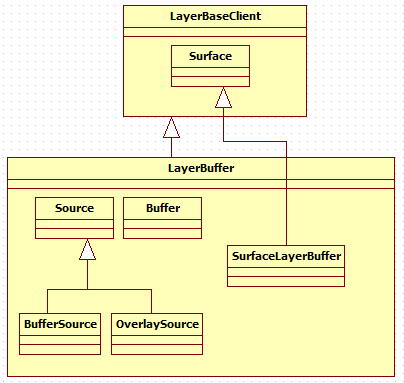 

图8-30  LayerBuffer的派生关系示意图

从上图中可以发现：

·  LayerBuffer定义了一个内部类Source类，它有两个派生类BufferSource和OverlaySource。根据它们的名字，可以猜测到Source代表数据的提供者。

·  LayerBuffer中的mSurface其真实类型是SurfaceLayerBuffer。

LayerBuffer创建好了，不过该怎么用呢？和它相关的调用流程是怎样的呢？下面来分析Camera。
<h4>2. Camera preView的分析</h4>
Camera是一个单独的Service，全称是CameraService，先看CameraService的registerPreviewBuffers函数。这个函数会做什么呢？代码如下所示：

[--&gt;CameraService.cpp]

status_tCameraService::Client::registerPreviewBuffers()

{

    int w, h;

   CameraParameters params(mHardware-&gt;getParameters());

   params.getPreviewSize(&amp;w, &amp;h);

 

   /*

    ①mHardware代表Camera设备的HAL对象。本书讨论CameraHardwareStub设备，它其实是

   一个虚拟的设备，不过其代码却具有参考价值。

   BufferHeap定义为ISurface的内部类，其实就是对IMemoryHeap的封装

   */

   ISurface::BufferHeapbuffers(w, h, w, h,

                                HAL_PIXEL_FORMAT_YCrCb_420_SP,

                                 mOrientation,

                                 0,

                                mHardware-&gt;getPreviewHeap());

    //②调用SurfaceLayerBuffer的registerBuffers函数。

   status_t ret = mSurface-&gt;registerBuffers(buffers);

    returnret;

}

上面代码中列出了两个关键点，逐一来分析它们。
<h5>（1）创建BufferHeap</h5>
BufferHeap是ISurface定义的一个内部类，它的声明如下所示：

[--&gt;ISurface.h]

 classBufferHeap {

   public:

       ......

        //使用这个构造函数

       BufferHeap(uint32_t w, uint32_t h,

               int32_t hor_stride, int32_t ver_stride, 

               PixelFormat format, const sp&lt;IMemoryHeap&gt;&amp; heap);

        

      ......

       ~BufferHeap(); 

        

       uint32_t w;

       uint32_t h;

       int32_t hor_stride;

       int32_t ver_stride;

       PixelFormat format;

       uint32_t transform;

       uint32_t flags;

       sp&lt;IMemoryHeap&gt; heap; //heap指向真实的存储对象

    };

从上面代码中可发现，BufferHeap基本上就是封装了一个IMemoryHeap对象，根据我们对IMemoryHeap的了解，它应该包含了真实的存储对象，这个值由CameraHardwareStub对象的getPreviewHeap得到，这个函数的代码如下所示：

[--&gt;CameraHardwareStub.cpp]

sp&lt;IMemoryHeap&gt;CameraHardwareStub::getPreviewHeap() const

{

    returnmPreviewHeap;//返回一个成员变量，它又是在哪创建的呢？

}

//上面的mPreivewHeap对象由initHeapLocked函数创建，该函数在HAL对象创建的时候被调用

void CameraHardwareStub::initHeapLocked()

{

  ......

 /*

创建一个MemoryHeapBase对象，大小是mPreviewFrameSize * kBufferCount,其中

 kBufferCount为4。注意这是一段连续的缓冲。

*/

 mPreviewHeap= new MemoryHeapBase(mPreviewFrameSize * kBufferCount);

 //mBuffer为MemoryBase数组，元素为4

 for (inti = 0; i &lt; kBufferCount; i++) {

       mBuffers[i] = new MemoryBase(mPreviewHeap, 

i * mPreviewFrameSize, mPreviewFrameSize);

    }

}

从上面这段代码中可以发现，CameraHardwareStub对象创建的用于preView的内存结构是按图8-31所示的方式来组织的：

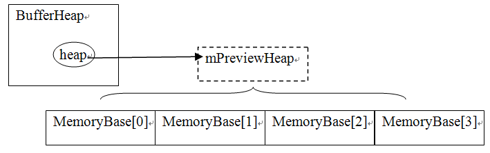 

图8-31  CameraHardwareStub用于preView的内存结构图

其中：

·  BufferHeap的heap变量指向一块MemoryHeap，这就是mPreviewHeap。

·  在这块MemoryHeap上构建了4个MemoryBase。
<h5>（2）registerBuffers的分析</h5>
BufferHeap准备好后，要调用ISurface的registerBuffers函数，ISurface在SF端的真实类型是SurfaceLayerBuffer，所以要直接看它的实现，代码如下所示：

[--&gt;LayerBuffer.cpp]

status_t LayerBuffer::SurfaceLayerBuffer::registerBuffers(

       const ISurface::BufferHeap&amp; buffers)

{

   sp&lt;LayerBuffer&gt; owner(getOwner());

if (owner != 0)

      //调用外部类对象的registerBuffers，所以SurfaceLayerBuffer也是一个Proxy哦。

       return owner-&gt;registerBuffers(buffers);

    returnNO_INIT;

}

//外部类是LayerBuffer，调用它的registerBuffers函数

status_t LayerBuffer::registerBuffers(constISurface::BufferHeap&amp; buffers)

{

Mutex::Autolock _l(mLock);

//创建数据的来源BufferSource，注意我们其实把MemoryHeap设置上去了

   sp&lt;BufferSource&gt; source = new BufferSource(*this, buffers);

   status_t result = source-&gt;getStatus();

    if(result == NO_ERROR) {

       mSource = source;//保存这个数据源为mSource。

    }

    returnresult;

}    

BufferSource，曾在图8-30中见识过，它内部有一个成员变量mBufferHeap指向传入的buffers参数，所以registerBuffers过后，就得到了图8-32：

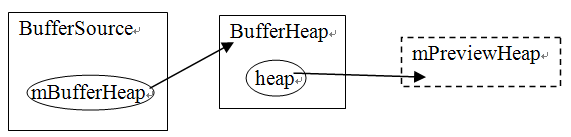 

图8-32  registerBuffers的结果示意图

请注意上图的箭头指向，不论中间有多少层封装，最终的数据存储区域还是mPreivewHeap。
<h4>2．数据的传输</h4>
至此，Buffer在SF和Camera两端都准备好了，那么数据是怎么从Camera传递到SF的呢？先来看数据源是怎么做的。
<h5>（1）数据传输的分析</h5>
CameraHardwareStub有一个preview线程，这个线程会做什么呢？代码如下所示：

[--&gt;CameraHardwareStub.cpp]

//preview线程从Thread类派生，下面这个函数在threadLoop中循环调用

int CameraHardwareStub::previewThread()

{

mLock.lock();

//每次进来mCurrentPreviewFrame都会加1

   ssize_t offset = mCurrentPreviewFrame * mPreviewFrameSize;

 

  sp&lt;MemoryHeapBase&gt; heap = mPreviewHeap;

 

  FakeCamera* fakeCamera = mFakeCamera;//虚拟的摄像机设备

   //从mBuffers中取一块内存，用于接收来自硬件的数据

   sp&lt;MemoryBase&gt;buffer = mBuffers[mCurrentPreviewFrame];

 

   mLock.unlock();

   if(buffer != 0) {

       intdelay = (int)(1000000.0f / float(previewFrameRate));

      void *base = heap-&gt;base();//base是mPreviewHeap的起始位置

 

        //下面这个frame代表buffer在mPreviewHeap中的起始位置，还记得图8-31吗？

       //四块MemoryBase的起始位置由下面这个代码计算得来

       uint8_t *frame = ((uint8_t *)base) + offset;

        //取出一帧数据，放到对应的MemoryBase中

       fakeCamera-&gt;getNextFrameAsYuv422(frame);

        //①把含有帧数据的buffer传递到上层

        if(mMsgEnabled &amp; CAMERA_MSG_PREVIEW_FRAME)

           mDataCb(CAMERA_MSG_PREVIEW_FRAME, buffer, mCallbackCookie);

 

       //mCurrentPreviewFrame 递增，在0到3之间循环

       mCurrentPreviewFrame = (mCurrentPreviewFrame + 1) % kBufferCount;

       usleep(delay);//模拟真实硬件的延时

    }

 

    returnNO_ERROR;

}

读者是否明白Camera preview的工作原理了？就是从四块内存中取一块出来接收数据，然后再把这块内存传递到上层去处理。从缓冲使用的角度来看，mBuffers数组构成了一个成员个数为四的缓冲队列。preview通过mData这个回调函数，把数据传递到上层，而CameraService实现了mData这个回调函数，这个回调函数最终会调用handlePreviewData，直接看handlePreviewData即可，代码如下所示：

[--&gt;CameraService.cpp]

voidCameraService::Client::handlePreviewData(const sp&lt;IMemory&gt;&amp; mem)

{  

   ssize_t offset;

size_t size;

//注意传入的mem参数，它实际上是Camera HAL创建的mBuffers数组中的一个

//offset返回的是这个数组在mPreviewHeap中的偏移量

   sp&lt;IMemoryHeap&gt; heap = mem-&gt;getMemory(&amp;offset, &amp;size);

    if (!mUseOverlay)

    {

       Mutex::Autolock surfaceLock(mSurfaceLock);

        if(mSurface != NULL) {

           //调用ISurface的postBuffer，注意我们传入的参数是offset。

           mSurface-&gt;postBuffer(offset);

        }

}

......

}

上面的代码是什么意思？我们到底给ISurface传什么了？答案很明显：

·  handlePreviewData就是传递了一个偏移量，这个偏移量是mBuffers数组成员的首地址。可用图8-33来表示：

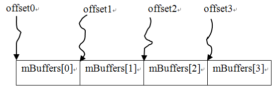 

图8-33  handlePreviewData示意图

有了图8-33，读者明白数据传递的工作原理了吗？

下面看SurfaceLayerBuffer的postBuffer函数，不过它只是一个小小的代理，真正的工作由外部类LayerBuffer完成，直接看它好了，代码如下所示：

[--&gt;LayerBuffer.cpp]

void LayerBuffer::postBuffer(ssize_t offset)

{

   sp&lt;Source&gt; source(getSource());//getSource返回mSource，为BufferSource类型

    if(source != 0)

       source-&gt;postBuffer(offset);//调用BufferSource的postBuffer函数。

}

[--&gt;LayerBuffer.cpp]

voidLayerBuffer::BufferSource::postBuffer(ssize_t offset)

{    

   ISurface::BufferHeap buffers;

    { 

       Mutex::Autolock _l(mBufferSourceLock);

       buffers = mBufferHeap;//还记得图8-32吗？

        if(buffers.heap != 0) {

           //BufferHeap的heap变量指向MemoryHeap,下面取出它的大小

           const size_t memorySize = buffers.heap-&gt;getSize();

          //做一下检查，判断这个offset是不是有问题

           if ((size_t(offset) + mBufferSize) &gt; memorySize) {

               LOGE("LayerBuffer::BufferSource::postBuffer() "

                     "invalid buffer(offset=%d, size=%d, heap-size=%d",

                     int(offset),int(mBufferSize), int(memorySize));

               return;

           }

        }

    }

 

   sp&lt;Buffer&gt; buffer;

if (buffers.heap != 0) {

    //创建一个LayerBuffer::Buffer

       buffer = new LayerBuffer::Buffer(buffers, offset, mBufferSize);

        if(buffer-&gt;getStatus() != NO_ERROR)

           buffer.clear();

       setBuffer(buffer);//setBuffer？我们要看看

//mLayer就是外部类LayerBuffer，调用它的invalidate函数将触发SF的重绘

       mLayer.invalidate();

    }

}

 

void LayerBuffer::BufferSource::setBuffer(

const sp&lt;LayerBuffer::Buffer&gt;&amp; buffer)

{

  //setBuffer函数就是简单地将new出来的Buffer设置给成员变量mBuffer，这么做会有问题吗？Mutex::Autolock_l(mBufferSourceLock);

   mBuffer = buffer; //将新的buffer设置为mBuffer，mBuffer原来指向的那个被delete

}

从数据生产者角度看，postBuffer函数将不断地new一个Buffer出来，然后将它赋值给成员变量mBuffer，也就是说，mBuffer会不断变化。现在从缓冲的角度来思考一下这种情况的结果：

·  数据生产者有一个含四个成员的缓冲队列，也就是mBuffers数组。

·  而数据消费者只有一个mBuffer。

这种情况会有什么后果呢？请记住这个问题，我们到最后再来揭示。下面先看mBuffer的类型Buffer是什么。
<h5>（2）数据使用的分析</h5>
Buffer被定义成LayerBuffer的内部类，代码如下所示：

[--&gt;LayerBuffer.cpp]

LayerBuffer::Buffer::Buffer(constISurface::BufferHeap&amp; buffers,

       ssize_t offset, size_t bufferSize)

    :mBufferHeap(buffers), mSupportsCopybit(false)

{

   //注意，这个src被定义为引用，所以修改src的信息相当于修改mNativeBuffer的信息

   NativeBuffer&amp; src(mNativeBuffer);

   src.crop.l = 0;

   src.crop.t = 0;

   src.crop.r = buffers.w;

   src.crop.b = buffers.h;

 

   src.img.w       =buffers.hor_stride ?: buffers.w;

   src.img.h       =buffers.ver_stride ?: buffers.h;

    src.img.format  = buffers.format;

    //这个base将指向对应的内存起始地址

   src.img.base    =(void*)(intptr_t(buffers.heap-&gt;base()) + offset);

    src.img.handle  = 0;

    gralloc_module_tconst * module = LayerBuffer::getGrallocModule();

    //做一些处理，有兴趣的读者可以去看看。

    if(module &amp;&amp; module-&gt;perform) {

       int err = module-&gt;perform(module,

               GRALLOC_MODULE_PERFORM_CREATE_HANDLE_FROM_BUFFER,

               buffers.heap-&gt;heapID(), bufferSize,

               offset, buffers.heap-&gt;base(),

                &amp;src.img.handle);

 

       mSupportsCopybit = (err == NO_ERROR);

    }

 }

上面是Buffer的定义，其中最重要的就是这个mNativeBuffer了，它实际上保存了mBuffers数组成员的首地址。

下面看绘图函数，也就是LayerBuffer的onDraw函数，这个函数由SF的工作线程调用，代码如下所示：

[--&gt;LayerBuffer.cpp]

void LayerBuffer::onDraw(const Region&amp; clip)const

{

   sp&lt;Source&gt; source(getSource());

    if(LIKELY(source != 0)) {

       source-&gt;onDraw(clip);//source实际类型是BufferSource，我们去看看。

    } else{

       clearWithOpenGL(clip);

    }

}

void LayerBuffer::BufferSource::onDraw(constRegion&amp; clip) const 

{

   sp&lt;Buffer&gt; ourBuffer(getBuffer());

    ......//使用这个Buffer，注意使用的时候没有锁控制

    mLayer.drawWithOpenGL(clip, mTexture);//生成一个贴图，然后绘制它

 }

其中getBuffer函数返回mBuffer，代码如下所示：

sp&lt;LayerBuffer::Buffer&gt;LayerBuffer::BufferSource::getBuffer() const

{

    Mutex::Autolock_l(mBufferSourceLock);

    returnmBuffer;

}

从上面的代码中能发现，mBuffer的使用并没有锁的控制，这会导致什么问题发生呢？请再次回到前面曾强调要记住的那个问题。此时生产者的队列有四个元素，而消费者的队列只有一个元素，它可用图8-34来表示：

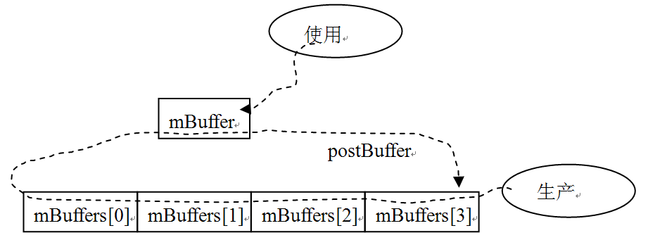 

图8-34  数据传递的问题示意图

从上图可以知道：

·  使用者使用mBuffer，这是在SF的工作线程中做到的。假设mBuffer实际指向的内存为mBuffers[0]。

·  数据生产者循环更新mBuffers数组各个成员的数据内容，这是在另外一个线程中完成的。由于这两个线程之间没有锁同步，这就造成了当使用者还在使用mBuffers[0]时，生产者又更新了mBuffers[0]。这会在屏幕上产生混杂的图像。

经过实际测试得知，如果给数据使用端加上一定延时，屏幕就会出现不连续的画面，即前一帧和后一帧的数据混杂在一起输出。

从代码的分析来看，这种方式确实有问题。我在真实设备上测试的结果，也在一定程度上验证了这一点。通过修改LayerBuffer来解决这问题的难度比较大，是否可在读写具体缓存时加上同步控制呢（例如使用mBuffers[0]的时候调用一下lock，用完后调用unlock）？这样就不用修改LayerBuffer了。读者可再深入研究这个问题。

<h2>8.7  本章小结</h2>
本章可能是全书难度最大的一章了。在这一章的讲解中，我们把打通任督二脉做为破解Surface系统的突破口：

·  应用程序和Surface的关系，这是任脉。

·  Surface和SurfaceFlinger的关系，这是督脉。

其中，打通任脉的过程是比较曲折的，从应用程序的Activity开始，一路追踪到ViewRoot、WindowManagerService。任脉被打通后，还只是解决了Java层的问题，而督脉则集中在Native层。在必杀技aidl工具的帮助下，我们首先成功找到了Surface乾坤大挪移的踪迹。此后在精简流程方法的帮助下，乘胜追击，对Surface以及SurfaceFlinger进行了深入分析。我希望读者在阅读过程中，也要把握流程，这样就不至于迷失在代码中了。

在拓展部分，对Surface系统中CB对象的工作流程、ViewRoot的一些问题、以及LayerBuffer进行了较为详细的介绍。

 

<a>[①]</a>说实话，笔者刚接触Android UI的时候也有点分不清楚View和Window的区别。

<a>②</a> 近期网络中流行的一种文体，其特点就是会用很多感叹号。

 
 
版权声明：本文为博主原创文章，未经博主允许不得转载。
 
 
