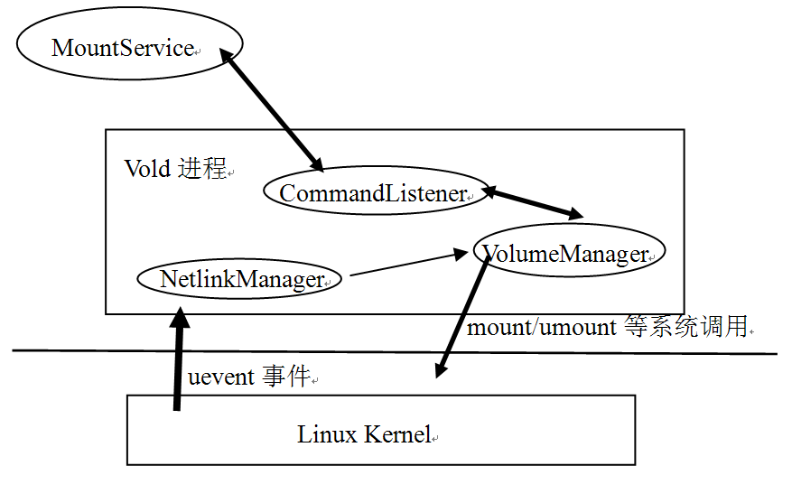
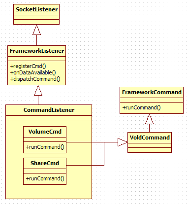
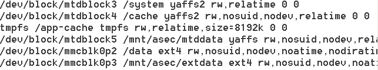

<h1>第9章  深入理解Vold和Rild</h1>
本章主要内容

·  介绍Vold。

·  介绍Rild。

本章涉及的源代码文件名称及位置

下面是本章分析的源码文件名及其位置。

·  Main.cpp

system/vold/Main.cpp

·  NetlinkManager.cpp

system/vold/NetlinkManager.cpp

·  NetlinkManager.h

system/vold/NetlinkManager.h

·  NetlinkHandler.cpp

system/vold/NetlinkHandler.cpp

·  NetlinkListener.cpp

system/core/libsysutils/src/NetlinkListener.cpp

·  SocketListener.cpp

system/core/libsysutils/src/SocketListener.cpp

·  VolumeManager.cpp

system/vold/VolumeManager.cpp

·  DirectVolume.cpp

system/vold/DirectVolume.cpp

·  FrameworkListener.cpp

system/core/libsysutils/src/FrameworkListener.cpp

·  MountService.java

framework/base/services/java/com/android/server/MountService.java

·  Rild.c

hardware/ril/rild/Rild.c

·  Ril.cpp

hardware/ril/libril/Ril.cpp

·  Ril_event.h

hardware/ril/lilbril/Ril_event.h

·  Reference_ril.c

hardware/ril/reference_ril/Reference_ril.c

·  Atchannle.c

hardware/ril/reference_ril/Atchannle.c

·  Ril.h

hardware/ril/include/telephony/Ril.h

·  PhoneApp.java

package/apps/Phone/src/com/android/phone/PhoneApp.java

·  PhoneFactory.java

framework/base/telephony/java/com/android/internal/telephony/PhoneFactory.java

·  RIL.java

framework/base/telephony/java/com/android/internal/telephony/RIL.java

·  PhoneUtils.java

package/apps/Phone/src/com/android/phone/PhoneUtils.java
<h2><a>9.1 </a> 概述</h2>
本章将分析Android系统中两个比较重要的程序，它们分别是：

·  Vold：Volume Daemon，用于管理和控制Android平台外部存储设备的后台进程，这些管理和控制，包括SD卡的插拔事件检测、SD卡挂载、卸载、格式化等。

·  Rild：Radio Interface Layer Daemon，用于智能手机的通讯管理和控制的后台进程，所有和手机通讯相关的功能，例如接打电话、收发短信/彩信、GPRS等都需要Rild的参与。

Vold和Rild都是Native的程序，另外Java世界还有和它们交互的模块，它们分别是：

·  MountService和Vold交互，一方面它可以接收来自Vold的消息，例如，在应用程序中经常监听到的ACTION_MEDIA_MOUNTED/ACTION_MEDIA_EJECT等广播，就是由MountService根据Vold的信息而触发的。另一方面，它可以向Vold发送控制命令，例如挂载SD卡为磁盘驱动器的操作，就是由MountService发送命令给Vold来执行的。

·  Phone和Rild交互，它是一个比较复杂的应用程序。简单来说，Phone拨打电话时需要发送对应的命令给Rild来执行。后面在Rild的实例分析中会做相关介绍。

这两个Daemon代码的结构都不算太复杂。本章将和大家一起来领略一下它们的风采。
<h2><a>9.2  Vold</a>的原理与机制分析</h2>
 Vold是Volume Daemon的缩写，它是Android平台中外部存储系统的管控中心，是一个比较重要的进程。虽然它的地位很重要，但其代码结构却远没有前面的Audio和Surface系统复杂。欣赏完Audio和Surface的大气磅礴后，再来感受一下Vold的小巧玲珑也会别有一番情趣。Vold的架构可用图9-1来表示：

 

图9-1  Vold架构图

从上图中可知：

·  Vold中的NetlinkManager模块（简称NM）接收来自Linux内核的uevent消息。例如SD卡的插拔等动作都会引起Kernel向NM发送uevent消息。

·  NM将这些消息转发给VolumeManager模块（简称VM）。VM会对应做一些操作，然后把相关信息通过CommandListener（简称CL）发送给MountService，MountService根据收到的消息会发送相关的处理命令给VM做进一步的处理。例如待SD卡插入后，VM会将来自NM的“Disk Insert”消息发送给MountService，而后MountService则发送“Mount”指令给Vold，指示它挂载这个SD卡。

·  CL模块内部封装了一个Socket用于跨进程通信。它在Vold进程中属于监听端（即是服务端），而它的连接端（即客户端）则是MountService。它一方面接收来自MountService的控制命令（例如卸载存储卡、格式化存储卡等），另一方面VM和NM模块又会通过它，将一些信息发送给MountService。

相比于Audio和Surface系统，Vold的架构确实比较简单，并且Vold和MountService所在的进程（这个进程其实就是system_server）在进行进程间通信时，也没有利用Binder机制，而是直接使用了Socket，这样，在代码量和程序中类的派生关系上也会简单不少。

 
<h3>9.2.1  Netlink和Uevent的介绍</h3>
在分析Vold的代码前，先介绍一下Linux系统中的Netlink和Uevent。
<h4>1. Netlink的介绍</h4>
Netlink是Linux系统中一种用户空间进程和Kernel进行通信的机制，通过这个机制，位于用户空间的进程，可接收来自Kernel的一些信息（例如Vold中用到的USB或SD的插拔消息），同时应用层也可通过Netlink向Kernel发送一些控制命令。

目前，Linux系统并没有为Netlink单独设计一套系统调用，而是复用了Socket的操作接口，只在创建Socket时会有一些特殊的地方。Netlink的具体使用方法，在进行代码分析时再来了解，读者目前只需知道，通过Netlink机制应用层，可接收来自Kernel的消息即可。
<h4>2. Uevent介绍</h4>
Uevent和Linux的Udev设备文件系统和设备模型有关系，它实际上就是一串字符串，字符串的内容可告知发生了什么事情。下面通过一个实例来直观感受Uevent：

在SD卡插入手机后（我们这里以SD卡为例），系统会检测到这个设备的插入，然后内核会通过Netlink发送一个消息给Vold，Vold将根据接收到的消息进行处理，例如挂载这个SD卡。内核发送的这个消息，就是Uevent，其中U代表User space（应用层空间）。下面看SD卡插入时Vold截获到的Uevent消息。在我的G7手机上，Uevent的内容如下，注意，其中//号或/**/号中的内容是为方便读者理解而加的注释：

[--&gt;SD卡插入的Uevent消息]

//mmc表示MultiMedia Card，这里统称为SD卡

add@/devices/platform/msm_sdcc.2/mmc_host/mmc1/mmc1:c9f2/block/mmcblk0

ACTION=add //add表示设备插入，另外还有remove和change等动作

//DEVPATH表示该设备位于/sys目录中的设备路径

DEVPATH=/devices/platform/msm_sdcc.2/mmc_host/mmc1/mmc1:c9f2/block/mmcblk0  

/*

SUBSYSTEM表示该设备属于哪一类设备，block为块设备，磁盘也属于这一类设备，另外还有

character(字符)设备等类型。

*/

SUBSYSTEM=block 

MAJOR=179//MAJOR和MINOR分别表示该设备的主次设备号，二者联合起来可以标识一个设备  

MINOR=0 

DEVNAME=mmcblk0  

DEVTYPE=disk//设备Type为disk     

NPARTS=3 //这个表示该SD卡上的分区，我的SD卡上有三块分区

SEQNUM=1357//序号

由于我的SD卡上还有分区，所以还会接收到和分区相关的Uevent。简单看一下：

[--&gt;SD卡插入后和分区相关的Uevent消息]

add@/devices/platform/msm_sdcc.2/mmc_host/mmc1/mmc1:c9f2/block/mmcblk0/mmcblk0p1   

ACTION=add

//比上面那个DEVPATH多了一个mmcblk0p1

DEVPATH=/devices/platform/msm_sdcc.2/mmc_host/mmc1/mmc1:c9f2/block/mmcblk0/mmcblk0p1        

SUBSYSTEM=block  

MAJOR=179        

MINOR=1 

DEVNAME=mmcblk0p1        

DEVTYPE=partition //设备类型变为partition，表示分区  

PARTN=1 

SEQNUM=1358

通过上面实例，我们和Uevent来了一次亲密接触，具体到Vold，也就是内核通过Uevent告知外部存储系统发生了哪些事情，那么Uevent在什么情况下会由Kernel发出呢？

·  当设备发生变化时，这会引起Kernel发送Uevent消息，例如设备的插入和拔出等。如果Vold在设备发生变化之前已经建立了Netlink IPC通信，那么Vold可以接收到这些Uevent消息。这种情况是由设备发生变化而触发的。

·  设备一般在/sys对应的目录下有一个叫uevent的文件，往该文件中写入指定的数据，也会触Kernel发送和该设备相关的Uevent消息，这是由应用层触发的。例如Vold启动时，会往这些uevent文件中写数据，通过这种方式促使内核发送Uevent消息，这样Vold就能得到这些设备的当前信息了。

根据上面介绍可知，Netlink和Uevent的目的，就是让Vold随时获悉外部存储系统的信息，这至关重要。我们总不会希望发生诸如SD卡都被拔了，而Vold却一无所知的情况吧？
<h3>9.2.2  初识Vold</h3>
下面来认识一下Vold，它的代码在main.cpp中，如下所示：

[--&gt;Main.cpp]

int main() {

 

   VolumeManager *vm;

   CommandListener *cl;

   NetlinkManager *nm;

   

   SLOGI("Vold 2.1 (the revenge) firing up");

    //创建文件夹/dev/block/vold

   mkdir("/dev/block/vold", 0755);

    

//①创建VolumeManager对象

    if(!(vm = VolumeManager::Instance())) {

       SLOGE("Unable to create VolumeManager");

       exit(1);

    };

   //②创建NetlinkManager对象

    if(!(nm = NetlinkManager::Instance())) {

       SLOGE("Unable to create NetlinkManager");

       exit(1);

    };

 

    //③创建CommandListener对象

cl = new CommandListener();

 

   vm-&gt;setBroadcaster((SocketListener *) cl);

   nm-&gt;setBroadcaster((SocketListener *) cl);

    //④启动VM

    if(vm-&gt;start()) {

        ......

       exit(1);

    }

   //⑤根据配置文件来初始化VM

    if(process_config(vm)) {

        ......

    }

   //⑥启动NM

    if(nm-&gt;start()) {

        ......

       exit(1);

    }

   

//通过往/sys/block目录下对应的uevent文件写”add\n”来触发内核发送Uevent消息

     coldboot("/sys/block");

    {

       FILE *fp;

       char state[255];

       /*

         Android支持将手机上的外部存储设备作为磁盘挂载到电脑上。下面的代码可查看是否打开了

         磁盘挂载功能。这里涉及UMS（Usb Mass Storage，USB大容量存储）方面的知识。

*/

        if((fp = fopen("/sys/devices/virtual/switch/usb_mass_storage/state",

                         "r"))) {

           if (fgets(state, sizeof(state), fp)) {

               if (!strncmp(state, "online", 6)) {

                   //⑧VM通过CL向感兴趣的模块（如MountService）通知UMS的状态

                    vm-&gt;notifyUmsConnected(true);

               } else {

                   vm-&gt;notifyUmsConnected(false);

               }

           } 

           ......

           fclose(fp);

        } 

......

    }

     ......

  //⑨启动CL

   if(cl-&gt;startListener()) {

        ......

       exit(1);

    }

   //无限循环

   while(1) {

       sleep(1000);

    }

 

   SLOGI("Vold exiting");

   exit(0);

}

上面代码中列出了九个关键点。由于Vold将其功能合理分配到了各个模块中，所以这九个关键点将放到图9-1所示Vold的三个模块中去讨论。

下面，看第一个模块NetlinkManager，简称NM。
<h3>9.2.3  NetlinkManager模块的分析</h3>
在Vold代码中，使用NM模块的流程是：

·  调用Instance创建一个NM对象。

·  调用setBroadcaster设置CL对象。

·  调用start启动NM。

接下来，按这三个步骤来分析NM模块。
<h4>1. 创建NM</h4>
Vold调用Instance函数创建了一个NM对象。看到Instance这个函数，读者应能想到，这里可能是采用了单例模式。来看是否如此，代码如下所示。

[--&gt;NetlinkManager.cpp]

NetlinkManager *NetlinkManager::Instance() {

    if(!sInstance)

       sInstance = new NetlinkManager();//果然是单例模式

    returnsInstance;

}

NM的创建真是非常简单。再看第二个被调用的函数setBroadcaster。
<h4>2. setBroadcaster的分析</h4>
setBroadcaster就更简单了，它的实现在NetlinkManger类的声明中，如下所示：

[--&gt;NetlinkManager.h]

void setBroadcaster(SocketListener *sl) 

setBroadcaster参数中的那个sl其实际类型为CommandListener。需要说明的是，虽然NM设置了CL对象，但Vold的NM并没有通过CL发送消息和接收命令，所以在图9-1中，NM模块和CL模块并没有连接线，这一点务请注意。

下面看最后一个函数start。
<h4>3. start的分析</h4>
前面说过，NM模块将使用Netlink和Kernel进行IPC通信，那么它是怎么做到的呢？来看代码，如下所示：

[--&gt;NetlinkManager.cpp]

int NetlinkManager::start() {

   //PF_NETLINK使用的socket地址结构是sockaddr_nl，而不是一般的sockaddr_in

    structsockaddr_nl nladdr;

    int sz= 64 * 1024;

 

   memset(&amp;nladdr, 0, sizeof(nladdr));

   nladdr.nl_family = AF_NETLINK;

   nladdr.nl_pid = getpid(); //设置自己的进程pid

   nladdr.nl_groups = 0xffffffff;

    

/*

创建PF_NETLINK地址簇的socket，目前只支持SOCK_DGRAM类型，第三个参数

NETLINK_KOBJECT_UEVENT表示要接收内核的Uevent事件。

   */

    if((mSock = socket(PF_NETLINK,

                       SOCK_DGRAM,NETLINK_KOBJECT_UEVENT)) &lt; 0) {

        ......

       return -1;

    }

    //设置Socket接收缓冲区大小

    if(setsockopt(mSock, SOL_SOCKET, SO_RCVBUFFORCE, &amp;sz, sizeof(sz)) &lt; 0) {

        ......

       return -1;

    }

    //必须对该socket执行bind操作

    if(bind(mSock, (struct sockaddr *) &amp;nladdr, sizeof(nladdr)) &lt; 0) {

        ......

       return -1;

    }

   //创建一个NetlinkHandler对象，并把创建好的Socket句柄传给它。

mHandler = new NetlinkHandler(mSock);

//调用NetlinkHandler对象的start

    if(mHandler-&gt;start()) {

       SLOGE("Unable to start NetlinkHandler: %s", strerror(errno));

       return -1;

    }

    return0;

}

从代码上看，NM的start函数分为两个步骤：

·  创建地址簇为PF_NETLINK类型的socket并做一些设置，这样NM就能和Kernel通信了。关于Netlink的使用技巧网上有很多资料，读者可在Linux系统上通过man netlink命令来查询相关信息。

·  创建NetlinkHandler对象，并调用它的start。看来，后续工作都是由NetlinkHandler来完成的。

据上文分析可看出，NetlinkHandler才是真正的主角，下面就来分析它。为书写方便起见，NetlinkHandler简称为NLH。
<h4>4. NetlinkHandler的分析</h4><h5>（1）创建NLH</h5>
代码结构简单的Vold程序中，NetlinkHandler却有一个相对不简单的派生关系，如图9-2所示：

 

图9-2  NLH的派生关系图

直接看代码，来认识这个NLH：

[--&gt;NetlinkHandler.cpp]

NetlinkHandler::NetlinkHandler(int listenerSocket):

               NetlinkListener(listenerSocket) {

 //调用基类NetlinkListener的构造函数。注意传入的参数是和Kernel通信的socket

//句柄。注意，文件描述符和句柄表示的是同一个东西，这里不再区分二者。

}

再看基类NetlinkListener的构造函数：

[--&gt;NetlinkListener.cpp]

NetlinkListener::NetlinkListener(int socket) :

                           SocketListener(socket, false) {

 //调用基类SocketListener的构造函数,第二个参数为false。

}

基类SocketListener的构造函数是：

[--&gt;SocketListener.cpp]

SocketListener::SocketListener(int socketFd,bool listen) {

   mListen = listen; //这个参数是false

   mSocketName = NULL;

mSock = socketFd;//保存和Kernel通信的socket描述符

//初始化一个mutex，看来会有多个线程存在

pthread_mutex_init(&amp;mClientsLock, NULL);

/*

SocketClientCollection的声明如下，它是一个列表容器。

typedef android::List&lt;SocketClient *&gt;SocketClientCollection

其中，SocketClient代表和Socket服务端通信的客户端。

*/

      mClients = new SocketClientCollection();

}

NLH的创建分析完了。此过程中没有什么新鲜内容。下面看它的start函数。

本章内容会大量涉及Socket，所以读者应先了解与Socket有关的知识，如果需要深入研究，建议阅读《Unix NetworkingProgramming Volume I》<a>①</a>一书。

<h5>（2）start的分析</h5>
在分析前面的代码时，曾看到NetlinkHandler会创建一个同步互斥对象，这表明NLH会在多线程环境中使用，那么这个线程会在哪里创建呢？来看start的代码，如下所示：

[--&gt;NetlinkHandler.cpp]

int NetlinkHandler::start() {

    returnthis-&gt;startListener();//startListener由SocketListener实现。

}

[--&gt;SocketListener.cpp]

int SocketListener::startListener() {

 

    if(!mSocketName &amp;&amp; mSock == -1) {

       errno = EINVAL;

       return -1;

    } elseif (mSocketName) {

        if((mSock = android_get_control_socket(mSocketName)) &lt; 0) {

          return -1;

        }

    }

/*

还记得构造NLH时的参数嘛？mListen为false，这表明NLH不是监听端（listen）。

这里为了代码和操作的统一，用mSock做参数构造了一个SocketClient对象，

并加入到mClients列表中，但这个SocketClient并不是真实客户端的代表。

*/

    if(mListen &amp;&amp; listen(mSock, 4) &lt; 0) {

        ......

       return -1;

} else if (!mListen)//以mSock为参数构造SocketClient对象，并加入到对应列表中

       mClients-&gt;push_back(new SocketClient(mSock));

/*

pipe系统调用将创建一个匿名管道，mCtrlPipe是一个int类型的二元数组。

其中mCtrlPipe[0]用于从管道读数据，mCtrlPipe[1]用于往管道写数据

*/

    if(pipe(mCtrlPipe)) {

        ......

       return -1;

    }

   //创建一个工作线程，线程函数是threadStart。

    if(pthread_create(&amp;mThread, NULL, SocketListener::threadStart, this)) {

        ......

       return -1;

    }

 

    return0;

}

如果熟悉Socket编程，理解上面的代码就非常容易了。下面来看NLH的工作线程。
<h5>（3）工作线程的分析</h5>
工作线程的线程函数threadStart的代码如下所示：

[--&gt;SocketListener.cpp]

void *SocketListener::threadStart(void *obj) {

   SocketListener *me = reinterpret_cast&lt;SocketListener *&gt;(obj);

 

   me-&gt;runListener();//调用runListener。

   pthread_exit(NULL);

    returnNULL;

}

//直接分析runListener

void SocketListener::runListener() {

 

   while(1) {

       SocketClientCollection::iterator it;

       fd_set read_fds;

       int rc = 0;

       int max = 0;

 

       FD_ZERO(&amp;read_fds);

 

        if(mListen) {//mListen为false，所以不走这个if分支

           max = mSock;

           FD_SET(mSock, &amp;read_fds);

        }

       /*

计算max，为什么要有这个操作？这是由select函数决定的，它的第一个参数的取值

必须为它所监视的文件描述符集合中最大的文件描述符加1。

      */

       FD_SET(mCtrlPipe[0], &amp;read_fds);

        if(mCtrlPipe[0] &gt; max)

           max = mCtrlPipe[0];

        //还是计算fd值最大的那个

       pthread_mutex_lock(&amp;mClientsLock);

       for (it = mClients-&gt;begin(); it != mClients-&gt;end(); ++it) {

            FD_SET((*it)-&gt;getSocket(), &amp;read_fds);

           if ((*it)-&gt;getSocket() &gt; max)

               max = (*it)-&gt;getSocket();

        }

       pthread_mutex_unlock(&amp;mClientsLock);

        /*

注意select函数的第一个参数，为max+1。读者可以通过man select来查询

          select的用法，注意，在Windows平台上的select对第一个参数没有要求。

        */

        if((rc = select(max + 1, &amp;read_fds, NULL, NULL, NULL)) &lt; 0) {

           sleep(1);

           continue;

        }else if (!rc)

           continue;

        //如果管道可读的话，表示需要退出工作线程。

        if(FD_ISSET(mCtrlPipe[0], &amp;read_fds))

           break;

        if(mListen &amp;&amp; FD_ISSET(mSock, &amp;read_fds)) {

           //如果是listen端的话，mSock可读表示有客户端connect上

           struct sockaddr addr;

           socklen_t alen = sizeof(addr);

           int c;

            //调用accept接受客户端的连接，返回用于和客户端通信的Socket描述符

           if ((c = accept(mSock, &amp;addr, &amp;alen)) &lt; 0) {

               SLOGE("accept failed (%s)", strerror(errno));

               sleep(1);

               continue;

           }

           pthread_mutex_lock(&amp;mClientsLock);

           //根据返回的客户端Socket描述符构造一个SocketClient对象，并加入到对应list

           mClients-&gt;push_back(new SocketClient(c));

           pthread_mutex_unlock(&amp;mClientsLock);

        }

 

        do{

           pthread_mutex_lock(&amp;mClientsLock);

            for (it = mClients-&gt;begin(); it !=mClients-&gt;end(); ++it) {

               int fd = (*it)-&gt;getSocket();

               if (FD_ISSET(fd, &amp;read_fds)) {

                   pthread_mutex_unlock(&amp;mClientsLock);

                /*

有数据通过Socket发送过来，所以调用onDataAvailable进行处理。

如果在onDataAvailable返回false，表示需要关闭该连接。

                */

                    if (!onDataAvailable(*it)){

                        close(fd);

                       pthread_mutex_lock(&amp;mClientsLock);

                        delete *it;

                        it =mClients-&gt;erase(it);

                       pthread_mutex_unlock(&amp;mClientsLock);

                    }

                    FD_CLR(fd, &amp;read_fds);

                    continue;

               }

           }

           pthread_mutex_unlock(&amp;mClientsLock);

        }while (0);

    }

}

从代码中可看到：

·  工作线程退出的条件是匿名管道可读，但在一般情况下不需要它退出，所以可以忽略此项内容。

·  不论是服务端还是客户端，收到数据后都会调用onDataAvailable进行处理。

下面就来看NLH的数据处理。
<h5>（4）数据处理</h5>
根据前面的分析，收到数据后首先调用onDataAvailable函数进行处理，这个函数由NLH的基类NetlinkListener实现。代码如下所示：

[--&gt;NetlinkListener]

bool NetlinkListener::onDataAvailable(SocketClient*cli)

{

    intsocket = cli-&gt;getSocket();

    intcount;

    

/*

调用recev接收数据，如果接收错误，则返回false，这样这个socket在

上面的工作线程中就会被close。

*/

    if((count = recv(socket, mBuffer, sizeof(mBuffer), 0)) &lt; 0) {

       SLOGE("recv failed (%s)", strerror(errno));

        return false;

    }

   //new一个NetlinkEvent，并调用decode来解析接收到的Uevent数据

   NetlinkEvent *evt = new NetlinkEvent();

    if(!evt-&gt;decode(mBuffer, count)) {

         goto out;

    }

    //调用onEvent，并传递NetlinkEvent对象。

   onEvent(evt);

out:

    deleteevt;

return true;

decode函数就是将收到的Uevent信息填充到一个NetlinkEvent对象中，例如Action是什么，SUBSYSTEM是什么等，以后处理Uevent时就不用再解析字符串了。

看onEvent函数，此函数是由NLH自己实现的，代码如下所示：

[--&gt;NetlinkHandler.cpp]

void NetlinkHandler::onEvent(NetlinkEvent *evt){

   VolumeManager *vm = VolumeManager::Instance();

    constchar *subsys = evt-&gt;getSubsystem();

 

    if(!subsys) {

       return;

    }

   

if (!strcmp(subsys, "block")) {

       vm-&gt;handleBlockEvent(evt); //调用VM的handleBlockEvent

    } elseif (!strcmp(subsys, "switch")) {

       vm-&gt;handleSwitchEvent(evt);//调用VM的handleSwitchEvent

} else if (!strcmp(subsys, "battery")){

      //这两个事件和外部存储系统没有关系，所以不处理

    } elseif (!strcmp(subsys, "power_supply")) {

    }

}

NLH的工作已介绍完，下面总结一下NM模块的工作。
<h4>5. NM模块的总结</h4>
NM模块的功能就是从Kernel接收Uevent消息，然后转换成一个NetlinkEvent对象，最后会调用VM的处理函数来处理这个NetlinkEvent对象。
<h3>9.2.4  VolumeManager模块的分析</h3>
Vold使用VM模块的流程是：

·  调用Instance创建一个VM对象。

·  调用setBroadcaster设置CL对象，这个函数和NM的setBroadcaster一样，所以本节不再介绍它。

·  调用start启动VM。

·  调用process_config配置VM。

现在来看除setBroadcaster之外的三个函数。
<h4>1. 创建VM和start的分析</h4>
VM的创建及start函数都非常简单，代码如下所示。

[--&gt;VolumeManager.cpp]

VolumeManager *VolumeManager::Instance() {

    if(!sInstance)

       sInstance = new VolumeManager();

    returnsInstance;

}

可以看到，VM也采用了单例的模式，所以全进程只会存在一个VM对象。

下面看VM的start：

[--&gt;VolumeManager.cpp]

int VolumeManager::start() {

    return 0;

}

start很简单，没有任何操作。
<h4>2. process_config的分析</h4>
process_config函数会根据配置文件配置VM对象，其代码如下所示：

[--&gt;Main.cpp]

static int process_config(VolumeManager *vm) {

    FILE*fp;

    int n= 0;

    charline[255];

   //读取/etc/vold.fstab文件

    if(!(fp = fopen("/etc/vold.fstab", "r"))) {

       return -1;

    }

 

   while(fgets(line, sizeof(line), fp)) {

       char *next = line;

       char *type, *label, *mount_point;

 

       n++;

       line[strlen(line)-1] = '\0';

 

        if(line[0] == '#' || line[0] == '\0')

           continue;

 

        if(!(type = strsep(&amp;next, " \t"))) {

           goto out_syntax;

        }

        if(!(label = strsep(&amp;next, " \t"))) {

           goto out_syntax;

        }

        if(!(mount_point = strsep(&amp;next, " \t"))) {

            goto out_syntax;

        }

 

        if(!strcmp(type, "dev_mount")) {

           DirectVolume *dv = NULL;

           char *part, *sysfs_path;

 

           if (!(part = strsep(&amp;next, " \t"))) {

               ......

               goto out_syntax;

            }

           if (strcmp(part, "auto") &amp;&amp; atoi(part) == 0) {

               goto out_syntax;

           }

 

           if (!strcmp(part, "auto")) {

              //①构造一个DirectVolume对象

               dv = new DirectVolume(vm, label, mount_point, -1);

           } else {

               dv = new DirectVolume(vm, label, mount_point, atoi(part));

           }

 

           while((sysfs_path = strsep(&amp;next, " \t"))) {

                //②添加设备路径

               if (dv-&gt;addPath(sysfs_path)) {

                    ......

                    goto out_fail;

               }

           }

          //为VolumeManager对象增加一个DirectVolume对象

           vm-&gt;addVolume(dv);

        } 

......

    }

  ......

    return-1;   

}

从上面代码中发现，process_config的主要功能就是解析/etc/vold.fstab。这个文件的作用和Linux系统中的fstab文件很类似，就是设置一些存储设备的挂载点，我的HTC G7手机上这个文件的内容如图9-3所示：

 

图9-3  我的手机上vold.fstab内容

从上图的红框中可知：

·  sdcard为volume的名字。

·  /mnt/sdcard表示mount的位置。

·  1表示使用存储卡上的第一个分区，auto表示没有分区。现在有很多定制的ROM要求SD卡上存在多个分区。

·  /devices/xxxx等内容表示MMC设备在sysfs中的位置。

根据G7的vold.fstab文件，可以构造一个DirectVolume对象。

注意，根据手机刷的ROM的不同，vold.fstab文件会有较大差异。

<h4>3. DirectVolume的分析</h4>
DirectVolume从Volume类派生，可把它看成是一个外部存储卡（例如一张SD卡）在代码中的代表物。它封装了对外部存储卡的操作，例如加载/卸载存储卡、格式化存储卡等。

下面是process_config函数中和DirectVolume相关的地方：

·  一个是创建DirectVolume。

·  另一个是调用DirectVolume的addpath函数。

它们的代码如下所示：

[--&gt;DirectVolume.cpp]

DirectVolume::DirectVolume(VolumeManager *vm,const char *label,

                           const char*mount_point, int partIdx) :

              Volume(vm, label, mount_point) {//初始化基类

   /*

      注意其中的参数：

     label为”sdcard”,mount_point为”/mnt/sdcard”,partIdx为1    

*/

   mPartIdx = partIdx;

//PathCollection定义为typedef android::List&lt;char *&gt; PathCollection

//其实就是一个字符串list

    mPaths= new PathCollection();

    for(int i = 0; i &lt; MAX_PARTITIONS; i++)

       mPartMinors[i] = -1;

   mPendingPartMap = 0;

   mDiskMajor = -1;  //存储设备的主设备号

   mDiskMinor = -1;  //存储设备的次设备号，一个存储设备将由主次两个设备号标识。

   mDiskNumParts = 0;

   //设置状态为NoMedia

   setState(Volume::State_NoMedia);

}

//再来看addPath函数，它主要目的是添加设备在sysfs中的路径，G7的vold.fstab上有两个路

//径，见图9-3中的最后一行。

int DirectVolume::addPath(const char *path) {

   mPaths-&gt;push_back(strdup(path));

    return0;

}

这里简单介绍一下addPath的作用。addPath把和某个存储卡接口相关的设备路径与这个DirectVolume绑定到一起，并且这个设备路径和Uevent中的DEVPATH是对应的，这样就可以根据Uevent的DEVPATH找到是哪个存储卡的DirectVolume发生了变动。当然手机上目前只有一个存储卡接口，所以Vold也只有一个DirectVolume。
<h4>4. NM和VM交互</h4>
在分析NM模块的数据处理时发现，NM模块接收到Uevent事件后，会调用VM模块进行处理，下面来看这块的内容。

先回顾一下NM调用VM模块的地方，代码如下所示：

[--&gt;NetlinkHandler.cpp]

void NetlinkHandler::onEvent(NetlinkEvent *evt){

   VolumeManager *vm = VolumeManager::Instance();

    constchar *subsys = evt-&gt;getSubsystem();

......

if (!strcmp(subsys, "block")) {

       vm-&gt;handleBlockEvent(evt); //调用VM的handleBlockEvent

    } elseif (!strcmp(subsys, "switch")) {

       vm-&gt;handleSwitchEvent(evt);//调用VM的handleSwitchEvent

} 

......

}

在上面代码中，如果Uevent是block子系统，则调用handleBlockEvent；如果是switch，则调用handleSwitchEvent。handleSwitchEvent主要处理SD卡挂载磁盘的通知，比较简单。这里只分析handleBlockEvent事件。

[--&gt;VolumeManager.cpp]

void VolumeManager::handleBlockEvent(NetlinkEvent*evt) {

    constchar *devpath = evt-&gt;findParam("DEVPATH");

 

/*

前面在process_config中构造的DirectVolume对象保存在了mVolumes中，它的定义如下：

typedef android::List&lt;Volume *&gt;VolumeCollection，也是一个列表。

  注意它保存的是Volume指针，而我们的DirectVolume是从Volume派生的

*/

   VolumeCollection::iterator it;

    boolhit = false;

for (it = mVolumes-&gt;begin(); it !=mVolumes-&gt;end(); ++it) {

        //调用每个Volume的handleBlockEvent事件，就我的G7手机而言，实际上将调用

        //DirectVolume的handleBlockEvent函数。

        if(!(*it)-&gt;handleBlockEvent(evt)) {

           hit = true;

           break;

        }

    }

}

NM收到Uevent消息后，DirectVolume也将应声而动，它的handleBlockEvent的处理是：

[--&gt;DirectVolume.cpp]

int DirectVolume::handleBlockEvent(NetlinkEvent*evt) {

    constchar *dp = evt-&gt;findParam("DEVPATH");

 

PathCollection::iterator  it;

//将Uevent的DEVPATH和addPath添加的路径进行对比，判断属不属于自己管理的范围。

    for(it = mPaths-&gt;begin(); it != mPaths-&gt;end(); ++it) {

        if(!strncmp(dp, *it, strlen(*it))) {

           int action = evt-&gt;getAction();

           const char *devtype = evt-&gt;findParam("DEVTYPE");

 

           if (action == NetlinkEvent::NlActionAdd) {

               int major = atoi(evt-&gt;findParam("MAJOR"));

               int minor = atoi(evt-&gt;findParam("MINOR"));

               char nodepath[255];

 

               snprintf(nodepath,

                         sizeof(nodepath),"/dev/block/vold/%d:%d",

                         major, minor);

                 //创建设备节点

               if (createDeviceNode(nodepath, major, minor)) {

                    ......

               }

               if (!strcmp(devtype, "disk")) {

                    handleDiskAdded(dp, evt);//添加一个磁盘

               } else {

                    /*

对于有分区的SD卡，先收到上面的“disk”消息，然后每个分区就会收到

                   一个分区添加消息。

                   */

                    handlePartitionAdded(dp,evt);

               }

           } else if (action == NetlinkEvent::NlActionRemove) {

                ......

           } else if (action == NetlinkEvent::NlActionChange) {

              ......

           } 

           ......

           return 0;

        }

    }

    errno= ENODEV;

    return-1;

}

关于DirectVolume针对不同Uevent的具体处理方式，后面将通过一个SD卡插入案例来分析。
<h4>5. VM模块的总结</h4>
从前面的代码分析中可知，VM模块的主要功能是管理Android系统中的外部存储设备。图9-4描述了VM模块的功能：

 

图9-4  VM模块的职责

通过对上图和前面代码的分析可知：

·  SD卡的变动（例如热插拔）将导致Kernel发送Uevent消息给NM模块。

·  NM模块调用VM模块处理这些Uevent消息。

·  VM模块遍历它所持有的Volume对象，Volume对象根据addPath添加的DEVPATH和Uevent消息中的DEVPATH来判断，自己是否可以处理这个消息。

至于Volume到底如何处理Uevent消息，将通过一个实例来分析。
<h3>9.2.5 关于 CommandListener模块的分析</h3>
Vold使用CL模块的流程是：

·  使用new创建一个CommandListener对象；

·  调用CL的startListener函数。

来看这两个函数。
<h4>1. 创建CommandListener的分析</h4>
和NetlinkerHandler一样，CommandListener也有一个相对不简单的派生关系，它的家族图谱如图9-5所示：

 

图9-5  CommandListener家族图谱

根据上图可以知道：

·  CL定义了一些和Command相关的内部类，这里采用了设计模式中的Command模式，每个命令的处理函数都是runCommand。注意，上图只列出了部分Command类。

·  CL也是从SocketListener派生的，不过它是Socket的监听（listen）端。

下面看它的代码：

[--&gt;CommandListener.cpp]

CommandListener::CommandListener() :

                FrameworkListener("vold") {

    //CL模块支持的命令

   registerCmd(new DumpCmd());

   registerCmd(new VolumeCmd()); 

   registerCmd(new AsecCmd());

   registerCmd(new ShareCmd());

   registerCmd(new StorageCmd());

   registerCmd(new XwarpCmd());

}

/*

registerCmd函数将Command保存到mCommands中，mCommands的定义为一个列表，如下：

typedef android::List&lt;FrameworkCommand *&gt;FrameworkCommandCollection;

*/

voidFrameworkListener::registerCmd(FrameworkCommand *cmd) {

   mCommands-&gt;push_back(cmd);

}

从上面的代码可知，CommandListener的基类是FrameworkListener，而FrameworkListener又从SocketListener类派生。之前在分析NM模块的NetLinkerHandler时，已介绍过SocketListener相关的知识了，所以此处不再赘述，只总结一下CL创建后的结果，它们是：

·  CL会创建一个监听端的socket，这样就可以接收客户端的链接。

·  客户端发送命令给CL，CL则从mCommands中找到对应的命令，并交给该命令的runCommand函数处理。

下面来关注第二个函数startListener，这个函数由SocketListener实现。
<h4>2. startListener的分析和数据处理</h4>
其实在分析NetlinkerHandler时，已经介绍了startListener函数，这里再简单回顾一下，有些具体内容和本章对NetlinkerHandler的分析有关。

[--&gt;SocketListener.cpp]

int SocketListener::startListener() {

 

    if(!mSocketName &amp;&amp; mSock == -1) {

        ......

       errno = EINVAL;

       return -1;

} else if (mSocketName) {

   //mSOcketName为字符串“vold”。android_get_control_socket函数返回

   //对应的socket句柄

        if((mSock = android_get_control_socket(mSocketName)) &lt; 0) {

           ......

           return -1;

        }

    }

    //CL模块是监听端

    if(mListen &amp;&amp; listen(mSock, 4) &lt; 0) {

        ......

       return -1;

    } elseif (!mListen)

       mClients-&gt;push_back(new SocketClient(mSock));

 

    if(pipe(mCtrlPipe)) {

        ......

       return -1;

    }

   //创建工作线程threadStart

    if(pthread_create(&amp;mThread, NULL, SocketListener::threadStart, this)) {

       return -1;

    }

 

    return0;

}

当CL收到数据时，会调用onDataAvailable函数，它由FrameworkListener实现。

[--&gt;FrameworkListener.cpp]

boolFrameworkListener::onDataAvailable(SocketClient *c) {

    charbuffer[255];

    intlen;

    //读取数据

    if((len = read(c-&gt;getSocket(), buffer, sizeof(buffer) -1)) &lt; 0) {

        ......

       return errno;

    } elseif (!len)

       return false;

 

    intoffset = 0;

    int i;

 

    for (i= 0; i &lt; len; i++) {

        if(buffer[i] == '\0') {

          //分发命令，最终会调用对应命令对象的runCommand进行函数处理。

           dispatchCommand(c, buffer + offset);

           offset = i + 1;

        }

    }

    returntrue;

}

dispatchCommand最终会根据收到的命令名（如“Volume”，“Share”等）来调用对应的命令对象（如VolumeCmd,ShareCmd）的runCommand函数以处理请求。这一块非常简单，这里就不再详述了。
<h4>3. CL模块的总结</h4>
CL模块的主要工作是：

·  建立一个监听端的socket。

·  接收客户端的连接和请求，并调用对应Command对象的runComand函数处理。

目前，CL模块唯一的客户端就是MountService。来看看它。

 
<h3>9.2.6  Vold实例的分析</h3>
这一节将分析一个实际案例，即插入一张SD卡引发的事件及其处理过程。在分析之前，还是应先介绍MountService。
<h4>1. MountService的介绍</h4>
有些应用程序需要检测外部存储卡的插入/拔出事件，这些事件是由MountService通过Intent广播发出的，例如外部存储卡插入后，MountService就会发送ACTION_MEDIA_MOUNTED消息。从某种意义上说，可把MountService看成是Java世界的Vold。来简单认识一下这个MountService，它的代码如下所示：

[--&gt;MountService.java]

class MountService extends IMountService.Stub

       implements INativeDaemonConnectorCallbacks { 

//MountService实现了INativeDaemonConnectorCallbacks接口

......

public MountService(Context context) {

   mContext = context;

 

    ......

   //创建一个HandlerThread，在第5章中曾介绍过。

   mHandlerThread = new HandlerThread("MountService");

mHandlerThread.start();

/*

创建一个Handler，这个Handler使用HandlerThread的Looper,也就是说，派发给该Handler

的消息将在另外一个线程中处理。可回顾第5章的内容，以加深印象。

*/

   mHandler = new MountServiceHandler(mHandlerThread.getLooper());

 

   ......

  /*

NativeDaemonConnector用于Socket通信，第二个参数“vold”表示将和Vold通信，也就是

和CL模块中的那个socket建立通信连接。第一个参数为INativeDaemonConnectorCallbacks

接口。它提供两个回调函数：

onDaemonConnected：当NativeDaemonConnector连接上Vold后回调。

onEvent：当NativeDaemonConnector收到来自Vold的数据后回调。

  */

  mConnector = new NativeDaemonConnector(this, "vold", 

10, "VoldConnector");

mReady= false;

//再启动一个线程用于和Vold通信。

    Threadthread = new Thread(mConnector,

                               NativeDaemonConnector.class.getName());

   thread.start();

}

  ......

}

MountService通过NativeDaemonConnector和Vold的CL模块建立通信连接，这部分内容比较简单，读者可自行研究。下面来分析SD卡插入后所引发的一连串处理。
<h4>2. 设备插入事件的处理</h4><h5>（1）Vold处理Uevent事件</h5>
在插入SD卡后，Vold的NM模块接收到Uevent消息，假设此消息的内容是前面介绍Uevent知识时使用的add消息，它的内容如下所示：

[--&gt;SD卡插入的Uevent消息]

add@/devices/platform/msm_sdcc.2/mmc_host/mmc1/mmc1:c9f2/block/mmcblk0

ACTION=add //add表示设备插入动作，另外还有remove和change等动作

//DEVPATH表示该设备位于/sys目录中的设备路径

DEVPATH=/devices/platform/msm_sdcc.2/mmc_host/mmc1/mmc1:c9f2/block/mmcblk0  

/*

SUBSYSTEM表示该设备属于哪一类设备，block为块设备,磁盘也属于这一类设备，另外还有

character(字符)设备等类型。

*/

SUBSYSTEM=block 

MAJOR=179//MAJOR和MINOR分别表示该设备的主次设备号，二者联合起来可以标识一个设备  

MINOR=0 

DEVNAME=mmcblk0  

DEVTYPE=disk//设备Type为disk     

NPARTS=3 //表示该SD卡上的分区，我的SD卡上有三块分区

SEQNUM=1357//序号

根据前文分析可知，NM模块中的NetlinkHandler会处理此消息，请回顾一下相关代码：

[--&gt;NetlinkHandler.cpp]

void NetlinkHandler::onEvent(NetlinkEvent *evt){

   VolumeManager *vm = VolumeManager::Instance();

    constchar *subsys = evt-&gt;getSubsystem();

  ......

 //根据上面Uevent消息的内容可知，它的subsystem对应为block，所以我们会走下面这个if分支

if (!strcmp(subsys, "block")) {

       vm-&gt;handleBlockEvent(evt); //调用VM的handleBlockEvent

} 

......

}

[--&gt;VolumeManager.cpp]

voidVolumeManager::handleBlockEvent(NetlinkEvent *evt) {

    constchar *devpath = evt-&gt;findParam("DEVPATH");

 

   VolumeCollection::iterator it;

    boolhit = false;

for(it = mVolumes-&gt;begin(); it != mVolumes-&gt;end(); ++it) {

      //调用各个Volume的handleBlockEvent

        if(!(*it)-&gt;handleBlockEvent(evt)) {

           hit = true;

           break;

        }

    }

   ......

}

我的G7手机只有一个Volume，其实际类型就是之前介绍过的DirectVolume。请看它是怎么对待这个Uevent消息的，代码如下所示：

[--&gt;DirectVolume.cpp]

int DirectVolume::handleBlockEvent(NetlinkEvent*evt) {

    constchar *dp = evt-&gt;findParam("DEVPATH");

 

   PathCollection::iterator  it;

    for(it = mPaths-&gt;begin(); it != mPaths-&gt;end(); ++it) {

        if(!strncmp(dp, *it, strlen(*it))) {

           int action = evt-&gt;getAction();

            const char *devtype =evt-&gt;findParam("DEVTYPE");

 

           if (action == NetlinkEvent::NlActionAdd) {

               int major = atoi(evt-&gt;findParam("MAJOR"));

               int minor = atoi(evt-&gt;findParam("MINOR"));

               char nodepath[255];

 

               snprintf(nodepath,

                         sizeof(nodepath),"/dev/block/vold/%d:%d",

                         major, minor);

               //内部调用mknod函数创建设备节点

               if (createDeviceNode(nodepath, major, minor)) {

                    SLOGE("Error makingdevice node '%s' (%s)", nodepath,

                                                              strerror(errno));

               }

               if (!strcmp(devtype, "disk")) {

                    //对应Uevent消息的DEVTYPE值为disk，所以走这个分支

                    handleDiskAdded(dp, evt);

               } else {

                   //处理DEVTYPE为Partition的情况

                    handlePartitionAdded(dp,evt);

               }

           } else if (action == NetlinkEvent::NlActionRemove) {

              //对应Uevent的ACTION值为remove

               ......

           } else if (action == NetlinkEvent::NlActionChange) {

              //对应Uevent的ACTION值为change

               ......

           } 

......

           return 0;

        }

    }

    errno= ENODEV;

    return-1;

}

插入SD卡，首先收到的Uevent消息中DEVTYPE的值是“disk”，这将导致DirectVolume的handleDiskInserted被调用。下面来看它的工作。

[--&gt;DirectVolume.cpp]

void DirectVolume::handleDiskAdded(const char*devpath, NetlinkEvent *evt) {

   mDiskMajor = atoi(evt-&gt;findParam("MAJOR"));

   mDiskMinor = atoi(evt-&gt;findParam("MINOR"));

 

    constchar *tmp = evt-&gt;findParam("NPARTS");

    if(tmp) {

       mDiskNumParts = atoi(tmp);//这个disk上的分区个数。

    } else{

       ......

       mDiskNumParts = 1;

    }

 

    charmsg[255];

 

    intpartmask = 0;

inti;

/*

Partmask会记录这个Disk上分区加载的情况，前面曾介绍过，如果一个Disk有多个分区，

它后续则会收到多个分区的Uevent消息。

   */

    for (i= 1; i &lt;= mDiskNumParts; i++) {

       partmask |= (1 &lt;&lt; i); 

    }

   mPendingPartMap = partmask;

 

    if(mDiskNumParts == 0) {

       ......//如果没有分区，则设置Volume的状态为Idle。

       setState(Volume::State_Idle);

}else {

    ......//如果还有分区未加载，则设置Volume状态为Pending

       setState(Volume::State_Pending);

    }

/*

设置通知内容，snprintf调用完毕后msg的值为：

 “Volume sdcard/mnt/sdcard disk inserted (179:0)”

*/

   snprintf(msg, sizeof(msg), "Volume %s %s disk inserted(%d:%d)",

            getLabel(), getMountpoint(), mDiskMajor, mDiskMinor);

   /*

getBroadcaster函数返回setBroadcaster函数设置的那个Broadcaster，也就是CL对象。

   然后调用CL对象的sendBroadcast给MountService发送消息，注意它的第一个参数是ResponseCode::VolumeDiskInserted。

  */

   mVm-&gt;getBroadcaster()-&gt;sendBroadcast(ResponseCode::VolumeDiskInserted,

                                            msg, false);

}

handleDiskAdded把Uevent消息做一些转换后发送给了MountService，实际上可认为CL模块和MountService通信使用的是另外一套协议。那么，MountService会做什么处理呢？
<h5>（2）MountService的处理</h5>
[--&gt;MountService.javaonEvent函数]

 publicboolean onEvent(int code, String raw, String[] cooked) {

       Intent in = null;

//关于onEvent函数，MountService的介绍中曾提过，当NativeDaemonConnector收到

//来自vold的数据后都会调用这个onEvent函数。

        ......

        if(code == VoldResponseCode.VolumeStateChange) {

          ......

        }else if (code == VoldResponseCode.ShareAvailabilityChange) {

           ......

        }else if ((code == VoldResponseCode.VolumeDiskInserted) ||

                   (code ==VoldResponseCode.VolumeDiskRemoved) ||

                   (code ==VoldResponseCode.VolumeBadRemoval)) {

           

           final String label = cooked[2]; //label值为”sdcard”

           final String path = cooked[3]; //path值为”/mnt/sdcard”

           int major = -1;

           int minor = -1;

 

           try {

               String devComp = cooked[6].substring(1, cooked[6].length() -1);

               String[] devTok = devComp.split(":");

               major = Integer.parseInt(devTok[0]);

               minor = Integer.parseInt(devTok[1]);

           } catch (Exception ex) {

               ......

           }

         if (code == VoldResponseCode.VolumeDiskInserted) {

              //收到handleDiskAdded发送的VolumeDiskInserted消息了

             //然后单独启动一个线程来处理这个消息。

               new Thread() {

                    public void run() {

                        try {

                            int rc;

                            //调用doMountVolume处理。

                           if ((rc =doMountVolume(path)) !=

 StorageResultCode.OperationSucceeded) {

                               }

                        } catch (Exception ex){

                            ......

                        }

                    }

                }.start();

           }

doMountVolume函数的代码如下所示：

[--&gt;MountService.java]

private int doMountVolume(String path) {

       int rc = StorageResultCode.OperationSucceeded;

       try {

           //通过NativeDaemonConnector给Vold发送请求，请求内容为：

          //volume mount /mnt/sdcard

           mConnector.doCommand(String.format("volume mount %s", path));

        }catch (NativeDaemonConnectorException e) {

          ......//异常处理 

       }

走了一大圈，最后又回到Vold了。CL模块将收到这个来自MountService的请求，请求的内容为字符串“volume mount/mnt/sdcard”，其中的volume表示命令的名字，CL会根据这个名字找到VolumeCmd对象，并交给它处理这个命令。
<h5>（3）Vold处理MountService的命令</h5>
Vold处理MountService命令的代码如下所示：

[--&gt;CommandListener.cppVolumeCmd类]

intCommandListener::VolumeCmd::runCommand(SocketClient *cli,

                                                     int argc, char **argv) {

    ......

   VolumeManager *vm = VolumeManager::Instance();

    int rc= 0;

 

    if(!strcmp(argv[1], "list")) {

       return vm-&gt;listVolumes(cli);

    } elseif (!strcmp(argv[1], "debug")) {

        ......

    } elseif (!strcmp(argv[1], "mount")) {

       ......//调用VM模块的mountVolume来处理mount命令，参数是“/mnt/sdcard”

        rc= vm-&gt;mountVolume(argv[2]);

    } elseif (!strcmp(argv[1], "unmount")) {

        ......

        rc= vm-&gt;unmountVolume(argv[2], force);

    } elseif (!strcmp(argv[1], "format")) {

       ......

        rc = vm-&gt;formatVolume(argv[2]);

    } elseif (!strcmp(argv[1], "share")) {

        ......

        rc= vm-&gt;shareVolume(argv[2], argv[3]);

    } elseif (!strcmp(argv[1], "unshare")) {

        ......

        rc= vm-&gt;unshareVolume(argv[2], argv[3]);

}

 ......

 

if(!rc) {

    //发送处理结果给MountService

       cli-&gt;sendMsg(ResponseCode::CommandOkay, "volume operationsucceeded", false);

} 

 ......

    return0;

}

看mountVolume函数：

[--&gt;VolumeManager.cpp]

int VolumeManager::mountVolume(const char*label) {

   /*

根据label找到对应的Volume。label这个参数的名字含义上有些歧义，根据loopupVolume

的实现来看，它其实比较的是Volume的挂载路径，也就是vold.fstab中指定的那个

/mnt/sdcard。而vold.fstab中指定的label叫sdcard。

*/

    Volume*v = lookupVolume(label);

    ......

    returnv-&gt;mountVol();//mountVol由Volume类实现。

}

找到对应的DirectVolume后，也就找到了代表真实存储卡的对象。它是如何处理这个命令的呢？代码如下所示：

[--&gt;Volume.cpp]

int Volume::mountVol() {

    dev_tdeviceNodes[4];

    int n,i, rc = 0;

    charerrmsg[255];

   ......

//getMountpoint返回挂载路径，即/mnt/sdcard

//isMountpointMounted判断这个路径是不是已经被mount了

if(isMountpointMounted(getMountpoint())) {

    setState(Volume::State_Mounted);//设置状态为State_Mounted

       return 0;//如果已经被mount了，则直接返回

    }

 

    n =getDeviceNodes((dev_t *) &amp;deviceNodes, 4);

    ......

    for (i= 0; i &lt; n; i++) {

       char devicePath[255];

 

       sprintf(devicePath, "/dev/block/vold/%d:%d",MAJOR(deviceNodes[i]),

               MINOR(deviceNodes[i]));

       ......

       errno = 0;

       setState(Volume::State_Checking);

       //默认SD卡为FAT分区，只有这样，当加载为磁盘的时候才能被Windows识别。

        if(Fat::check(devicePath)) {

            ......

           return -1;

        }

 

        /*

先把设备mount到/mnt/secure/staging，这样/mnt/secure/staging下的内容

          就是该设备的存储内容了

        */

       errno = 0;

        if(Fat::doMount(devicePath, "/mnt/secure/staging", false, false, 1000,

 1015, 0702,true)) {

          ......

           continue;

        }

        /*

下面这个函数会把存储卡中的autorun.inf文件找出来并删掉，这个文件就是“臭名昭著”的

          自动运行文件，在Windows系统上，把SD卡挂载为磁盘后，双击这个磁盘就会自动运行

这个文件，很多病毒和木马都是通过它传播的。为了安全起见，要把这个文件删掉。

       */

      protectFromAutorunStupidity();

        //①下面这个函数比较有意思，需要看看：

        if(createBindMounts()) {

           ......

           return -1;

        }

 

        //将存储卡mount路径从/mnt/secure/staging移到/mnt/sdcard

        if(doMoveMount("/mnt/secure/staging", getMountpoint(), false)) {

           ......

           return -1;

        }

        //②设置状态为State_Mounted，这个函数将发送状态信息给MountService

       setState(Volume::State_Mounted);

       mCurrentlyMountedKdev = deviceNodes[i];

       return 0;

    }

    ......

   setState(Volume::State_Idle);

 

    return-1;

}

上面代码中有个比较有意思的函数，就是createBindMounts，其代码如下所示：

[--&gt;Volume.cpp]

int Volume::createBindMounts() {

   unsigned long flags;

 

   /*‘

将/mnt/secure/staging/android_secure目录名改成

    /mnt/secure/staging/.android_secure，SEC_STG_SECIMGDIR的值就是

   /mnt/secure/staging/.android_secure，也就是把它变成Linux平台上的隐藏目录

  */

    if(!access("/mnt/secure/staging/android_secure", R_OK | X_OK)&amp;&amp;

        access(SEC_STG_SECIMGDIR, R_OK | X_OK)) {

        if(rename("/mnt/secure/staging/android_secure", SEC_STG_SECIMGDIR)) {

           SLOGE("Failed to rename legacy asec dir (%s)",strerror(errno));

        }

    }

 

    ......

 

/*

  使用mount命令的bind选项，可将/mnt/secure/staging/.android_secure这个目录

  挂载到/mnt/secure/asec目录下。/mnt/secure/asec目录是一个secure container，

 目前主要用来保存一些安装在SD卡上的APP信息。APP2SD是Android 2.2引入的新机制，它

 支持将APP安装在SD卡上，这样可以节约内部的存储空间。

mount的bind选项允许将文件系统的一个目录挂载到另外一个目录下。读者可以通过man mount

查询具体信息。

     */

    if(mount(SEC_STG_SECIMGDIR, SEC_ASECDIR, "", MS_BIND, NULL)) {

         ......

       return -1;

    }

 

......

/*

将tempfs设备挂载到/mnt/secure/staging/.android_secure目录，这样之前

.android_secure目录中的内容就只能通过/mnt/secure/asec访问了。由于那个目录只能

由root访问，所以可以起到安全和保护的作用。

*/

if(mount("tmpfs", SEC_STG_SECIMGDIR, "tmpfs", MS_RDONLY,

                        "size=0,mode=000,uid=0,gid=0")){

        ......

       umount("/mnt/asec_secure");

       return -1;

    }

 

    return0;

}

createBindMounts的作用就是将存储卡上的.android_secure目录挂载到/mnt/secure/asec目录下，同时对.android_secure进行一些特殊处理，这样，没有权限的用户就不能更改或破坏.android_secure目录中的内容了，因此它起到了一定的保护作用。

在手机上，受保护的目录内容，只能在用adb shell登录后，进入/mnt/secure/asec目录来查看。注意，这个asec目录的内容就是.android_secure未挂载tmpfs时的内容（亦即它保存着那些安装在存储卡上的应用程序的信息）。另外，可把SD卡拔出来，通过读卡器直接插到台式机上，此时，这些信息就能在.android_secure目录中被直接看到了。

<h5>（4）MountService处理状态通知</h5>
volume的mountVol完成相关工作后，就通过下面的函数，发送信息给MountService：

setState(Volume::State_Mounted); //感兴趣的读者可自行分析此函数的实现。

MountService依然会在onEvent函数中收到这个消息。

[--&gt;MountService.java]

public boolean onEvent(int code, String raw,String[] cooked) {

       Intent in = null;

 

        ......

        if(code == VoldResponseCode.VolumeStateChange) {

            /*

状态变化由notifyVolumeStateChange函数处理，由于Volume的状态

被置成Mounted，所以下面这个notifyVolumeStateChange会发送

 ACTION_MEDIA_MOUNTED这个广播。我们就不再分析这个函数了，读者

 可自行研究。

           */

           notifyVolumeStateChange(

                    cooked[2], cooked[3],Integer.parseInt(cooked[7]),

                           Integer.parseInt(cooked[10]));

        } 

实例分析就到这里。中间略去了一些处理内容，例如对分区的处理等，读者可自行研读，相信已没有太大难度了。另外，在上述处理过程中，稍微难懂的是mountVol这个函数在挂载方面的处理过程。用图9-6来总结一下这个处理过程：

 

图9-6  SD卡插入事件处理流程图

由上图可知，Vold在安全性上还是做了一定考虑的。如果没有特殊需要，读者了解上面这些知识也就够了。
<h3>9.2.7  Vold总结</h3>
Vold和MountService之间的通信使用了Socket。之前在第6章介绍Binder时也提到过它。除了Binder外，Socket是Android系统中最常用的IPC通信机制了。本章介绍的Vold和Rild都是使用Socket进行IPC通信的。

Vold及Java层的MountService都比较简单，所以我在工作中碰到这两位出问题的几率基本为零。虽然二者比较简单，这里还是要提个小小的问题，以帮助大家加深印象：

<strong>当SD卡拔出，或者挂载到磁盘上时，都会导致sd卡被卸载，在这个切换过程中，有一些应用程序会被系统kill掉，这是为什么？</strong>

请读者阅读相关代码寻找答案，这样或许能解释很多测试人员在做测试时提出这种Bug的原因了：为什么SD卡mount到电脑后，有些应用程序突然退出了？
<h2>9.3  Rild的的原理与机制分析</h2>
这里，先回顾一下智能手机的架构。目前，很多智能手机的硬件架构都是两个处理器：一个处理器用来运行操作系统，上面可以跑应用程序，这个处理器称作Application Processor，简称AP；另一个处理器负责和射频无线通信相关的工作，叫Baseband Processor，简称BP。AP和BP芯片之间采用串口进行通信，通信协议使用的是AT指令。

什么是AT指令呢？AT指令最早用在Modem上，后来几大手机厂商如摩托罗拉、爱立信、诺基亚等为GSM通信又设计了一整套AT指令。AT指令的格式比较简单，是一个以AT开头，后跟字母和数字表示具体功能的字符串。了解具体的AT指令，可参考相关的规范参考或手机厂商提供的手册，这里就不再多说了。

在Android系统中，Rild运行在AP上，它是AP和BP在软件层面上通信的中枢，也就是说，AP上的应用程序将通过Rild发送AT指令给BP，而BP的信息通过Rild传送给AP上的应用程序。

现介绍在Rild代码中常会碰到的两个词语：

·  第一个solicited Respose，即经过请求的回复。它代表的应用场景是AP发送一个AT请求指令给BP进行处理，处理后，BP会对应回复一个AT指令告知处理结果。这个回复指令是针对之前的那个请求指令的，此乃一问一答式，所以叫solicitedResponse。

·  第二个unsolicited Response，即未经请求的回复。很多时候，BP主动给AP发送AT指令，这种指令一般是BP通知AP当前发生的一些事情，例如一路电话打了过来，或者网络信号中断等。从AP的角度来看，这种指令并非由它发送的请求所引起的，所以称之为unsolicited Response。

上面这两个词语，实际指明了AP和BP两种交互类型：

·  AP发送请求BP，BP响应并回复AP。

·  BP发送通知给AP。

这两种类型对软件而言有什么意义呢？先来看Rild在软件架构方面遇到的挑战：

·  有很多把AP和BP集成在一块芯片上的智能手机，它们之间的通信可能就不是AT指令了。

·  另外，即使AP和BP通信使用的是AT指令，不同的手机厂商在AT指令上也会有很大的不同，而且这些都属于商业秘密，所以手机厂商不可能共享源码，它只能给出二进制的库。

Rild是怎么解决这个问题的呢？结合前面提到的AP/BP交互的两种类型，大体可以勾画出图9-7：

 

图9-7  Rild解决问题的方法

从上图中可以看出：

·  Rild会动态加载厂商相关的动态库，这个动态库加载在Linux平台上则使用dlopen系统调用。

·  Rild和动态库之间通过接口进行通信，也就是说Rild输出接口供动态库使用，而动态库也输出对应的接口供Rild使用。

·  AP和BP交互的工作由动态库去完成。

Rild和动态库运行在同一个进程上，为了方便理解，可把这两个东西分离开来。

根据上面的分析可知，对Rild的分析包括两部分：

·  对Rild本身的分析。

·  对动态库的分析。Android提供了一个用作参考的动态库叫libReference_ril.so，这个库实现了一些标准的AT指令。另外，它的代码结构也颇具参考价值，所以我们的动态库分析就以它为主。

分析Rild时，为书写方便起见，将这个动态库简称为RefRil库。
<h3>9.3.1 初识Rild</h3>
Rild的代码在Rild.c中，它是一个应用程序。从它的main开始分析，代码如下所示：

[--&gt;Rild.c]

int main(int argc, char **argv)

{

    //动态库的位置由rilLibPath决定

    constchar * rilLibPath = NULL;

    char**rilArgv;

void*dlHandle;

 

/*

  Rild规定动态库必须实现一个叫Ril_init函数，这个函数的第一个参数指向结构体

  RIL_Env，而它的返回值指向结构体RIL_ RadioFunctions。这两个结构体就是在

  图9-7中提到的接口。这两个接口的具体内容，后文再做分析。

*/

    constRIL_RadioFunctions *(*rilInit)(const struct RIL_Env *, int, char **);

    constRIL_RadioFunctions *funcs;

    charlibPath[PROPERTY_VALUE_MAX];

   unsigned char hasLibArgs = 0;

 

    int i;

   //Rild由init启动，没有对应的启动参数，所以这个for循环不会进来。

    for (i= 1; i &lt; argc ;) {

        if(0 == strcmp(argv[i], "-l") &amp;&amp; (argc - i &gt; 1)) {

           rilLibPath = argv[i + 1];

           i += 2;

        }else if (0 == strcmp(argv[i], "--")) {

           i++;

           hasLibArgs = 1;

           break;

        }else {

           usage(argv[0]);

        }

    }

 

if(rilLibPath == NULL) {

    /*

读取系统属性，LIB_PATH_PROPERTY的值为"rild.libpath“,模拟器上

和RIL相关的属性值有两个，分别是：

rild.libpath=/system/lib/libreference-ril.so

rild.libargs=-d /dev/ttyS0

上面这些值都定义在build/target/board/generic/system.prop文件中

不同厂商可以有自己对应的实现。

        */

        if( 0 == property_get(LIB_PATH_PROPERTY, libPath, NULL)) {

           goto done;

        }else {

          /*

  这里，使用参考的动态库进行分析，它的位置为

   /system/lib/libreference-ril.so。

           */

           rilLibPath = libPath;

        }

    }

 

    ......  //和模拟器相关的一些内容

   switchUser();//设置Rild的组用户为radio

   

   //通过dlopen系统加载动态库

   dlHandle = dlopen(rilLibPath, RTLD_NOW);

    ......

    //① 启动EventLoop，事件处理

   RIL_startEventLoop();

   

   //得到RefRil库中RIL_Init函数的地址

rilInit= (const RIL_RadioFunctions *(*)(const struct RIL_Env *, int, 

char **))dlsym(dlHandle, "RIL_Init");

 

    ......

 

    rilArgv[0]= argv[0];

//②调用RefRil库输出的RIL_Init函数，注意传入的第一个参数和它的返回值。

    funcs= rilInit(&amp;s_rilEnv, argc, rilArgv);

    //③注册上面rilInit函数的返回值（一个RIL_RadioFunctions类型的结构体）到Rild中。

   RIL_register(funcs);

 

done:

 

   while(1) {

        //主线程sleep，具体工作交给工作线程完成。

       sleep(0x00ffffff);

    }

}

将上面的代码和分析结合起来，就知道了Rild解决问题的方法，代码中列出了三个关键点。我们将逐一对其进行分析。
<h3>9.3.2  RIL_startEventLoop的分析</h3>
第一个关键点是RIL_startEventLoop函数，这个函数实际上是由libRil.so实现的，它的代码在Ril.cpp中，代码如下所示：

[--&gt;Ril.cpp]

extern "C" void RIL_startEventLoop(void){

    intret;

   pthread_attr_t attr;

    

    s_started= 0;

   pthread_mutex_lock(&amp;s_startupMutex);

 

   pthread_attr_init (&amp;attr);

pthread_attr_setdetachstate(&amp;attr,PTHREAD_CREATE_DETACHED);

//创建工作线程eventLoop

    ret =pthread_create(&amp;s_tid_dispatch, &amp;attr, eventLoop, NULL);

 

/*

  工作线程eventLoop运行后会设置s_started为1，并触发s_startupCond。

  这几个语句的目的是保证在RIL_startEventLoop返回前，工作线程一定是已经创建并运行了

*/

    while(s_started == 0) {

       pthread_cond_wait(&amp;s_startupCond, &amp;s_startupMutex);

    }

   pthread_mutex_unlock(&amp;s_startupMutex);

    if(ret &lt; 0) {

        

       return;

    }

}

从上面代码中可知，RIL_startEventLoop会等待工作线程创建并运行成功。这个线程为什么会如此重要呢？下面就来了解一下工作线程eventLoop。
<h4>1. 工作线程eventLoop</h4>
工作线程eventLoop的代码如下所示：

[--&gt;Ril.cpp]

static void * eventLoop(void *param) {

    intret;

    intfiledes[2];

 

 //①初始化请求队列

ril_event_init();

    

//下面这几个操作告诉RIL_startEventLoop函数本线程已经创建并成功运行了。

   pthread_mutex_lock(&amp;s_startupMutex);

 

   s_started = 1;

   pthread_cond_broadcast(&amp;s_startupCond);

 

   pthread_mutex_unlock(&amp;s_startupMutex);

    

   //创建匿名管道

    ret =pipe(filedes);

 

   ......

 

   s_fdWakeupRead = filedes[0];

   s_fdWakeupWrite = filedes[1];

    //设置管道读端口的属性为非阻塞

   fcntl(s_fdWakeupRead, F_SETFL, O_NONBLOCK);

    

   //②下面这两句话将匿名管道的读写端口加入到event队列中。

   ril_event_set (&amp;s_wakeupfd_event, s_fdWakeupRead, true,

               processWakeupCallback, NULL);

   rilEventAddWakeup (&amp;s_wakeupfd_event);

 

    //③进入事件等待循环中，等待外界触发事件并做对应的处理。

   ril_event_loop();

    returnNULL;

}

工作线程的工作并不复杂，主要有三个关键点。
<h5>（1）ril_event_init的分析</h5>
工作线程，顾名思义就是用来干活的。要让它干活，是否得有一些具体的任务呢？它是如何管理这些任务的呢？对这两问题的回答是：

·  工作线程使用了一个叫ril_event的结构体，来描述一个任务，并且它将多个任务按时间顺序组织起来，保存在任务队列中。这个时间顺序是指该任务的执行时间，由外界设定，可以是未来的某时间。

ril_event_init函数就是用来初始化相关队列和管理结构的，代码如下所示：

在代码中，“任务”也称为“事件”，如没有特殊说明必要，这两者以后不再做区分。

[--&gt;Ril.cpp]

void ril_event_init()

{

   MUTEX_INIT();//初始化一个mutex对象listMutex

 

FD_ZERO(&amp;readFds);//初始化readFds，看来Ril会使用select来做多路IO复用

 

//下面的timer_list和pending_list分别是两个队列

   init_list(&amp;timer_list);//初始化timer_list，任务插入的时候按时间排序

init_list(&amp;pending_list);//初始化pendling_list，保存每次需要执行的任务

/*

watch_table（监控表）定义如下：

static struct ril_event * watch_table[MAX_FD_EVENTS];

其中MAX_FD_EVENTS的值为8。监控表主要用来保存那些FD已经加入到readFDs中的

任务。

*/

   memset(watch_table, 0, sizeof(watch_table));

}

此ril_event_init函数没什么新鲜的内容。任务在代码中的对等物Ril_event结构的代码，如下所示：

[--&gt;Ril_event.h]

struct ril_event {

    structril_event *next;

    structril_event *prev;//next和prev将ril_event组织成了一个双向链表

 

    intfd;   //该任务对应的文件描述符，以后简称FD。

intindex;  //这个任务在监控表中的索引

/*

  是否永久保存在监控表中，一个任务处理完毕后将根据这个persist参数来判断

  是否需要从监控表中移除。

*/

    boolpersist;  

    structtimeval timeout; //该任务的执行时间

   ril_event_cb func;   //任务函数

    void*param;  //传给任务函数的参数

};

ril_event_init刚初始化完任务队列，下面就有地方添加任务了。
<h5>（2）任务加入队列</h5>
下面这两行代码初始化一个FD为s_wakeupfd_event的任务，并将其加入到监控表中：

/*

  s_wakeupfd_event定义为一个静态的ril_event，ril_event_set函数将初始化它的

  FD为管道的读端，任务函数ril_event_cb对应为processWakeupCallback，

  并设置persist为true

*/

ril_event_set (&amp;s_wakeupfd_event, s_fdWakeupRead,true,

               processWakeupCallback, NULL);

//来看这个函数：

rilEventAddWakeup (&amp;s_wakeupfd_event);

rilEventAddWakeup比较有意思，来看这个函数;

[--&gt;Ril.cpp]

static void rilEventAddWakeup(struct ril_event*ev) {

   ril_event_add(ev);//ev指向一条任务

   triggerEvLoop();

}

//直接看ril_event_add函数和triggerEvLoop函数。

void ril_event_add(struct ril_event * ev)

{

    ......

MUTEX_ACQUIRE();//锁保护

   for (int i =0; i &lt; MAX_FD_EVENTS; i++) {

   //从监控表中找到第一个空闲的索引，然后把这个任务加到监控表中，

   //index表示这个任务在监控中的索引

        if(watch_table[i] == NULL) {

           watch_table[i] = ev;

           ev-&gt;index = i;

            ......

           //将任务的FD加入到readFds中，这是select使用的标准方法

           FD_SET(ev-&gt;fd, &amp;readFds);

           if (ev-&gt;fd &gt;= nfds) nfds = ev-&gt;fd+1;

           ......

            break;

        }

    }

   MUTEX_RELEASE();

    ......

}

//再来看triggerEvLoop函数，这个更简单了:

static void triggerEvLoop() {

intret;

/*

s_tid_dispatch是工作线程eventLoop的线程ID，pthread_self返回调用线程的线程ID。

由于这里调用triggerEvLoop的就是eventLoop自己，所以不会走if 分支。但是可以看看

里面的内容。

*/

    if(!pthread_equal(pthread_self(), s_tid_dispatch)) {

        do{

           //s_fdWakeupWrite为匿名管道的写端口，看来触发eventLoop工作的条件就是

          //往这个端口写一点数据了。

           ret = write (s_fdWakeupWrite, " ", 1);

         }while (ret &lt; 0 &amp;&amp; errno == EINTR);

    }

}

一般的线程间通信使用同步对象来触发，而rild是通过往匿名管道写数据来触发工作线程工作的。
<h5>（3）ril_event_loop的分析</h5>
来看最后一个关键函数ril_event_loop，其代码如下所示：

[--&gt;Ril.cpp]

void ril_event_loop()

{

    int n;

    fd_setrfds;

    structtimeval tv;

    structtimeval * ptv;

 

    for(;;) {

         memcpy(&amp;rfds, &amp;readFds,sizeof(fd_set));

         /*

根据timer_list来计算select函数的等待时间，timer_list已经

按任务的执行时间排好序了。

        */

        if(-1 == calcNextTimeout(&amp;tv)) {

           ptv = NULL;

        }else {

           ptv = &amp;tv;

        }

        ......;

        //调用select进行多路IO复用

        n= select(nfds, &amp;rfds, NULL, NULL, ptv);

        ......

        //将timer_list中那些执行时间已到的任务移到pending_list队列。

       processTimeouts();

//从监控表中转移那些有数据要读的任务到pending_list队列，如果任务的persisit不为

//true，则同时从监控表中移除这些任务

       processReadReadies(&amp;rfds, n);

        //遍历pending_list，执行任务的任务函数。

       firePending();

    }

}

根据对ril_event_Loop函数的分析可知，Rild支持两种类型的任务：

·  定时任务。它的执行由执行时间决定，和监控表没有关系，在Ril.cpp中由ril_timer_add函数添加。

·  非定时任务，也叫Wakeup Event。这些任务的FD将加入到select的读集合（readFDs）中，并且在监控表中存放了对应的任务信息。它们触发的条件是这些FD可读。对于管道和Socket来说，FD可读意味着接收缓冲区中有数据，这时调用recv不会因为没有数据而阻塞。

对于处于listen端的socket来说，FD可读表示有客户端连接上了，此时需要调用accept接受连接。

<h4>2. RIL_startEventLoop小结</h4>
总结一下RIL_startEventLoop的工作。从代码中看，这个函数将启动一个比较重要的工作线程eventLoop，该线程主要用来完成一些任务处理，而目前还没有给它添加任务。
<h3>9.3.3  RIL_Init的分析</h3>
下面看第二个关键函数RIL_Init。这个函数必须由动态库实现，对于下面这个例子来说，它将由RefRil库实现，这个函数定义在Reference_ril.c中：

[--&gt;Reference_ril.c]

pthread_t s_tid_mainloop;//看来又会创建一个线程

 

//动态库必须实现的RIL_Init函数。

const RIL_RadioFunctions *RIL_Init(const structRIL_Env *env, 

int argc, char **argv)

{

    intret;

    int fd= -1;

    intopt;

   pthread_attr_t attr;

 

   s_rilenv = env; //将外部传入的env保存为s_rilenv。

 

     ......//一些参数处理，不必管它

 

   pthread_attr_init (&amp;attr);

pthread_attr_setdetachstate(&amp;attr,PTHREAD_CREATE_DETACHED);

//创建一个工作线程mainLoop

    ret =pthread_create(&amp;s_tid_mainloop, &amp;attr, mainLoop, NULL);

/*

  s_callbacks也为一个结构体

staticconst RIL_RadioFunctions s_callbacks = {

    RIL_VERSION,  //RIL的版本

    onRequest, //下面是一些函数指针

    currentState,

    onSupports,

    onCancel,

    getVersion

};

 

*/

    return&amp;s_callbacks;

}

RefRil的RIL_Init函数比较简单，主要有三项工作要做：

·  保存Rild传入的RIL_Env结构体。

·  创建一个叫mainLoop的工作线程。

·  返回一个RIL_RadioFunctions的结构体。

上面的RIL_Env和RIL_RadioFunctions结构体，就是Rild架构中用来隔离通用代码和厂商相关代码的接口。先来看RIL_RadioFunctions，这个结构体由厂商的动态库实现，它的代码如下：

//函数指针定义

typedef void (*RIL_RequestFunc) (int request,void *data,

                                    size_tdatalen, RIL_Token t);

typedef RIL_RadioState(*RIL_RadioStateRequest)();

typedef int (*RIL_Supports)(int requestCode);

typedef void (*RIL_Cancel)(RIL_Token t);

typedef void (*RIL_TimedCallback) (void *param);

typedef const char * (*RIL_GetVersion) (void);

 

typedef struct {

intversion;  //RIL的版本

//通过这个接口可向BP提交一个请求，注意这个函数的返回值为空，这是为什么？

   RIL_RequestFunc onRequest; 

   RIL_RadioStateRequest onStateRequest;//查询BP的状态

   RIL_Supports supports;

RIL_CancelonCancel;

//查询动态库的版本，RefRil库中该函数的实现将返回字符串”android reference-ril 1.0”

   RIL_GetVersion getVersion;

} RIL_RadioFunctions;

对于上面的结构体，应重点关注函数onRequest，它被Rild用来向动态库提交一个请求，也就是说，AP向BP发送请求的接口就是它，但是这个函数却没有返回值，那么该请求的执行结果是怎么得到的呢？

这里不卖关子，直接告诉大家。Rild架构中最大的特点就是采用了异步请求/处理的方式。这种方式和异步I/O有异曲同工之妙。那么什么是异步请求/处理呢？它的执行流程如下：

·  Rild通过onRequest向动态库提交一个请求，然后返回去做自己的事情。

·  动态库处理这个请求，请求的处理结果通过回调接口通知。

这种异步请求/处理的流程和酒店的MorningCall服务很类似，具体相似之处如下所示：

·  在前台预约了一个Morning Call，这好比向酒店提交了一个请求。预约完后，就可以放心地做自己的事情了。

·  酒店登记了这个请求，记录是哪个房间申请的服务，然后由酒店安排工作人员值班，这些都是酒店对这个请求的处理，作为房客则无须知道处理细节。

·  第二天早上，约好的时间一到，酒店给房客打电话，房客就知道这个请求被处理了。为了检查一下宾馆服务的效果，最好是拿表看看接到电话的时间是不是之前预约的时间。

这时，读者对异步请求/处理机制或许有了一些直观的感受。那么，动态库是如何通知请求的处理结果的呢？这里用到了另外一个接口RIL_Env结构，它的定义如下所示：

[--&gt;Ril.h]

struct RIL_Env {

//动态库完成一个请求后，通过下面这个函数通知处理结果，其中第一个参数标明是哪个请求

//的处理结果

    void(*OnRequestComplete)(RIL_Token t, RIL_Errno e,

                           void *response,size_t responselen);

    //动态库用于进行unsolicited Response通知的函数

    void(*OnUnsolicitedResponse)(int unsolResponse, const void *data,

                                    size_t datalen);

    

    //给Rild提交一个超时任务

    void*(*RequestTimedCallback) (RIL_TimedCallback callback,

                                   void *param,const struct timeval *relativeTime);

   //从Rild的超时任务队列中移除一个任务

    void(*RemoveTimedCallback) (void *callbackInfo);

};

结合图9-7和上面的分析可以发现，Rild在设计时将请求的应答接口和动态库的通知接口都放在了RIL_Env结构体中。

关于Rild和动态库的交互接口就分析到这里。相信读者已经明白其中的原理了。下面来看RefRil库创建的工作线程mainLoop。
<h4>1.   工作线程mainLoop的分析</h4>
RefRil库的RIL_Init函数会创建一个工作线程mainLoop，其代码如下所示：

[--&gt;Reference_Ril.c]

static void *

mainLoop(void *param)

{

    intfd;

    intret;

 

......

/*

为AT模块设置一些回调函数，AT模块用来和BP交互，对于RefRil库来说,AT模块就是对

串口设备通信的封装，这里统称为AT模块。

    */

   at_set_on_reader_closed(onATReaderClosed);

   at_set_on_timeout(onATTimeout);

 

    for(;;) {

        fd= -1;

        //下面这个while循环的目的是为了得到串口设备的文件描述符，我们省略其中的一些内容

       while  (fd &lt; 0) {

           if (s_port &gt; 0) {

               fd = socket_loopback_client(s_port, SOCK_STREAM);

           } else if (s_device_socket) {

               if (!strcmp(s_device_path, "/dev/socket/qemud")) {

                    ......

           } else if (s_device_path != NULL) {

               fd = open (s_device_path, O_RDWR);

               if ( fd &gt;= 0 &amp;&amp; !memcmp( s_device_path,"/dev/ttyS", 9 ) ) {

                    struct termios  ios;

                    tcgetattr( fd, &amp;ios );

                    ios.c_lflag = 0; 

                    tcsetattr( fd, TCSANOW,&amp;ios );

               }

           }

 

           ......

        }

 

       s_closed = 0;

        //①打开AT模块，传入一个回调函数onUnsolicited

       ret = at_open(fd, onUnsolicited);

 

        ......

        //②下面这个函数向Rild提交一个超时任务，该任务的处理函数是initializeCallback

        RIL_requestTimedCallback(initializeCallback,NULL, &amp;TIMEVAL_0);

       sleep(1);

       /*

         如果AT模块被关闭，则waitForClose返回，但是该线程并不会退出，而是从for循环那

         开始重新执行一次。所以这个mainLoop工作线程是用来监控AT模块的，一旦它被关闭，就

         需要重新打开。也就是说不允许AT模块被关闭。

*/

       waitForClose();

        ......

    }

}

可以看到，mainLoop的工作其实就是初始化AT模块，并监控AT模块，一旦AT模块被关闭，那么mainLoop就要重新打开并初始化它。这几项工作主要由at_open和超时任务的处理函数initializeCallback完成。
<h5>（1）at_open分析</h5>
来看at_open这个函数，其代码如下所示：

[--&gt;Atchannle.c]

int at_open(int fd, ATUnsolHandler h)

{

   //at_open的第一个参数是一个代表串口设备的文件描述符。

    intret;

   pthread_t tid;

   pthread_attr_t attr;

 

    s_fd =fd;

   s_unsolHandler = h;

   s_readerClosed = 0;

 

   s_responsePrefix = NULL;

   s_smsPDU = NULL;

   sp_response = NULL;

 

    ......//和电源管理相关的操作

 

   pthread_attr_init (&amp;attr);

   pthread_attr_setdetachstate(&amp;attr, PTHREAD_CREATE_DETACHED);

    //创建一个工作线程readerLoop，这个线程的目的就是从串口设备读取数据

    ret =pthread_create(&amp;s_tid_reader, &amp;attr, readerLoop, &amp;attr);

......

    return0;

}

at_open函数会另外创建一个工作线程readerLoop，从名字上看，它会读取串口设备。下面来看它的工作，代码如下所示：

[--&gt;Atchannle.c]

static void *readerLoop(void *arg)

{

    for(;;) {

       const char * line;

 

       line = readline(); //从串口设备读取数据

       ......

 

       if(isSMSUnsolicited(line)) {

           char *line1;

           const char *line2;

 

           line1 = strdup(line);

           line2 = readline();

 

           if (line2 == NULL) {

                break;

           }

 

           if (s_unsolHandler != NULL) {

               s_unsolHandler (line1, line2);//调用回调，处理SMS的通知

           }

           free(line1);

        }else {

         //处理接收到的数据，也就是根据line中的AT指令调用不同的回调

           processLine(line);

        }

 

     ......//电源管理相关

   //这个线程退出前会调用通过at_set_on_reader_closed设置的回调函数，以通知

   //AT模块关闭

   onReaderClosed(); 

 

    returnNULL;

}

readerLoop工作线程比较简单，就是从串口设备中读取数据，然后进行处理。这些数据有可能是solicited response，也有可能是unsolicited response，具体的处理函数我们在后续的实例分析中再来介绍，下面我们看第二个函数RIL_requestTimedCallback。
<h5>（2）initializeCallback的分析</h5>
在分析initializeCallback函数前，我们先看看RefRil向Rild提交超时任务的RIL_requestTimedCallback函数，它其实是一个宏，不过这个宏比较简单，就是封装了RIL_Env结构体中对RequestTimedCallback函数的调用，代码如下所示：

#define RIL_requestTimedCallback(a,b,c) \

s_rilenv-&gt;RequestTimedCallback(a,b,c)

//向Rild提交一个超时处理函数

下面我们看看Rild实现的这个RequestTimedCallback函数，代码如下所示。

[--&gt;Ril.cpp]

extern "C" void *

RIL_requestTimedCallback (RIL_TimedCallbackcallback, void *param,

                                const structtimeval *relativeTime) {

   returninternalRequestTimedCallback (callback, param, relativeTime);

}

/*

调用internalRequestTimedCallback，其实就是构造一个Ril_event事件然后加入到

timer_list，并触发event_loop工作线程执行

*/

static UserCallbackInfo * internalRequestTimedCallback(

RIL_TimedCallback callback, void *param,

                              const structtimeval *relativeTime)

{

    structtimeval myRelativeTime;

   UserCallbackInfo *p_info;

 

    p_info= (UserCallbackInfo *) malloc (sizeof(UserCallbackInfo));

 

   p_info-&gt;p_callback = callback;

   p_info-&gt;userParam = param;

    if(relativeTime == NULL) {

       memset (&amp;myRelativeTime, 0, sizeof(myRelativeTime));

    } else{

       memcpy (&amp;myRelativeTime, relativeTime, sizeof(myRelativeTime));

    }

 

   ril_event_set(&amp;(p_info-&gt;event), -1, false, userTimerCallback,p_info);

    //将该任务添加到timer_list中去

   ril_timer_add(&amp;(p_info-&gt;event), &amp;myRelativeTime);

 

   triggerEvLoop(); //触发eventLoop线程

    returnp_info;

}

从上面的代码可知，RIL_requestTimedCallback函数就是向eventLoop提交一个超时任务，这个任务的处理函数则为initialCallback，下面直接来看该函数的内容，如下所示。

[--&gt;Reference_ril.c]

static void initializeCallback(void *param)

{

   /*

这个函数就是通过发送一些AT指令来初始化BP中的无线通信Modem，不同的modem可能有

不同的AT指令。这里仅列出部分代码。

   */

   ATResponse *p_response = NULL;

    interr;

   setRadioState (RADIO_STATE_OFF);

   at_handshake();

    ......

    err =at_send_command("AT+CREG=2", &amp;p_response);

    ......

   at_response_free(p_response);

   at_send_command("AT+CGREG=1", NULL);

   at_send_command("AT+CCWA=1", NULL);

     ......

    if(isRadioOn() &gt; 0) {

        setRadioState (RADIO_STATE_SIM_NOT_READY);

}

......

}

<h4>2. RIL_Init的总结</h4>
RIL_Init函数由动态库提供，以上面RefRil库的代码为参考，这个函数执行完后，将完成RefRil库的几项重要工作，它们是：

·  创建一个mainLoop工作线程，mainLoop线程的任务是初始化AT模块，并监控AT模块，一旦AT模块被关闭，则会重新初始化AT模块。

·  AT模块内部会创建一个工作线程readerLoop，该线程的作用是从串口设备中读取信息，也就是直接和BP打交道。

·  mainLoop通过向Rild提交超时任务，完成了对Modem的初始化工作。

在Rild的main函数中还剩下最后一个关键函数RIL_register没有分析了，下面来看看它。
<h3>9.3.4  RIL_register的分析</h3><h4>1. 建立对外通信的链路</h4>
RIL_register函数将创建两个监听端socket，它们的名字分别是：

·  “rild”：这个socket用来和Java层的应用通信。这一点与Vold中的MountService类似。

·  “rild-debug”：这个socket用来接收测试程序的测试命令。

下面来看RIL_register函数的代码，如下所示：

[--&gt;Ril.cpp]

extern "C" void RIL_register (constRIL_RadioFunctions *callbacks) {

  //RIL_RadioFunctions结构体由RefRil库输出

    intret;

    intflags;

 

    ......//版本检测

 

    if(s_registerCalled &gt; 0) {

       return;

    }

    

    //拷贝这个结构体的内容到s_callbacks变量中。

   memcpy(&amp;s_callbacks, callbacks, sizeof (RIL_RadioFunctions));

 

   s_registerCalled = 1;

    

    //Rild定义了一些Command，这里做一个小小的检查

    for(int i = 0; i &lt; (int)NUM_ELEMS(s_commands); i++) {

       assert(i == s_commands[i].requestNumber);

    }

 

    for(int i = 0; i &lt; (int)NUM_ELEMS(s_unsolResponses); i++) {

       assert(i + RIL_UNSOL_RESPONSE_BASE

               == s_unsolResponses[i].requestNumber);

    }

 

    ......

 

    //start listen socket

 

#if 0

    ......

#else

   //SOCKET_NAME_RIL的值为“Ril”，这个socket由init进程根据init.rc的配置创建

   s_fdListen = android_get_control_socket(SOCKET_NAME_RIL);

    ......

   //监听

    ret =listen(s_fdListen, 4);

    ......

#endif

 

/*

构造一个非超时任务，处理函数是listenCallback。这个任务会保存在监控表中，一旦它的FD

可读就会导致eventLoop的select函数返回。根据前面的介绍可知，listen端的socket

可读表示有客户connect上。由于该任务的persist被设置为false，待listenCallback

处理完后，这个任务就会从监控表中移除。也就是说下一次select的readFDs中将不会有

这个监听socket了，这表明Rild只支持一个客户端的连接。

*/

   ril_event_set (&amp;s_listen_event, s_fdListen, false,

               listenCallback, NULL);

    //触发eventLoop工作

   rilEventAddWakeup (&amp;s_listen_event);

 

#if 1

/*

Rild为了支持调试，还增加了一个Ril_debug的socket，这个socket专门用于

测试程序发送测试命令

   */

   s_fdDebug = android_get_control_socket(SOCKET_NAME_RIL_DEBUG);

    ret =listen(s_fdDebug, 4);

 

     ......

   //添加一个非超时任务，该任务对应的处理函数是debugCallback，它是专门用来处理测试命令的。

   ril_event_set (&amp;s_debug_event, s_fdDebug, true,

               debugCallback, NULL);

   rilEventAddWakeup (&amp;s_debug_event);

#endif

}

根据上面的分析，如果有一个客户端connect上Rild，eventLoop就会被触发，并且对应的处理函数listenCallback会被调用，下面就去看看这个函数的实现。

[--&gt;Ril.cpp]

static void listenCallback (int fd, short flags,void *param) {

    intret;

    interr;

    intis_phone_socket;

   RecordStream *p_rs;

 

    structsockaddr_un peeraddr;

   socklen_t socklen = sizeof (peeraddr);

 

    structucred creds;

   socklen_t szCreds = sizeof(creds);

 

    structpasswd *pwd = NULL;

    

    //接收一个客户端的连接，并将返回的socket保存在s_fdCommand中

   s_fdCommand = accept(s_fdListen, (sockaddr *) &amp;peeraddr,&amp;socklen);

 

    ......

 

    errno= 0;

   is_phone_socket = 0;//权限控制，判断连接的客户端有没有对应的权限。

   ......//如果没有对应的权限则中止后面的流程

    //设置这个socket为非阻塞，所以后续的send/recv调用都不会阻塞

    ret =fcntl(s_fdCommand, F_SETFL, O_NONBLOCK);

    ......

   /*

p_rs为RecordStream类型，它内部会分配一个缓冲区来存储客户端发来的数据，

这些都是socket编程常用的做法。

*/

    p_rs =record_stream_new(s_fdCommand, MAX_COMMAND_BYTES);

/*

 构造一个新的非超时任务，这样在收到来自客户端的数据后就会由eventLoop调用对应的

处理函数processCommandsCallback了。

*/

   ril_event_set (&amp;s_commands_event, s_fdCommand, 1,

                        processCommandsCallback, p_rs);

    rilEventAddWakeup (&amp;s_commands_event);

   onNewCommandConnect();//作一些后续处理，有兴趣的读者可以看看。

}

<h4>2. RIL_register小结</h4>
RIL_register函数的主要功能是初始化了两个用来和外部进程通信的socket，并且向eventLoop添加了对应的任务。

至此，Rild的main函数就都分析完了。下面对main函数进行总结。
<h3>9.3.5  Rild main函数的总结</h3>
前面所有的内容都是在main函数中处理的，下面给出main函数执行后的结果，如图9-9所示：

 

图9-9  Rild main函数执行后的结果示意图

其中：

·  Rild和RefRil库的交互通过RIL_Env和RIL_RadioFunctions这两个结构体来完成。

·  Rild的eventLoop处理任务。对于来自客户端的任务，eventLoop调用的处理函数是processCommandsCallback。

·  RefRil库的readerLoop用来从串口设备中读取数据。

·  RefRil库中的mainLoop用来监视readerLoop。

上图画出的模块都是静态的，前面提到的异步请求/处理的工作方式不能体现出来。那么，来分析一个实例，看看这些模块之间是如何配合与联动的。
<h3>9.3.6  Rild实例的分析</h3>
其实，Rild没什么难度，相信见识过Audio和Surface系统的读者都会有同感。但Java层的Phone应用及相关的Telephony模块却相当复杂，这里不去讨论Phone的实现，而是通过实例来分析一个电话是如何拨打出去的。这个例子和Rild有关的东西比较简单，但在分析代码的路途上，读者可以领略到Java层Phone代码的复杂。
<h4>1. 创建Phone</h4>
Android支持GSM和CDMA两种Phone，到底创建哪种Phone呢？来看PhoneApp.java是怎么做的：

[--&gt;PhoneApp.java]

public void onCreate() {

        ......

  if(phone == null) {

      //创建一个Phone，这里使用了设计模式中的Factory（工厂）模式

     PhoneFactory.makeDefaultPhones(this);

     phone = PhoneFactory.getDefaultPhone();

     ......

}

工厂模式的好处在于，将Phone（例如代码中的GSMPhone或CDMAPhone）创建的具体复杂过程屏蔽起来了，因为用户只关心工厂的产出物Phone，而不关心创建过程。通过工厂模式可降低使用者和创建者代码之间的耦合性，即使以后增加TDPhone，使用者也不需要修改太多的代码。

下面来看这个Phone工厂：

[--&gt;PhoneFactory.java]

public static void makeDefaultPhones(Context context){

     makeDefaultPhone(context);//调用makeDefaultPhone函数，直接去看看

}

 

public static void makeDefaultPhone(Contextcontext) {

    synchronized(Phone.class) {

      ......

     //根据系统设置获取通信网络的模式

    intnetworkMode = Settings.Secure.getInt(context.getContentResolver(),

             Settings.Secure.PREFERRED_NETWORK_MODE,preferredNetworkMode);

     intcdmaSubscription =  

Settings.Secure.getInt(context.getContentResolver(),

               Settings.Secure.PREFERRED_CDMA_SUBSCRIPTION,                     

                preferredCdmaSubscription);

               

      //RIL这个对象就是rild socket的客户端，AT命令由它发送给Rild

 sCommandsInterface= new RIL(context, networkMode,cdmaSubscription);

 

       int phoneType =getPhoneType(networkMode);

       if(phoneType == Phone.PHONE_TYPE_GSM) {

        //先创建GSMPhone，然后创建PhoneProxy，这里使用了设计模式中的Proxy模式

           sProxyPhone = new PhoneProxy(newGSMPhone(context,

               sCommandsInterface,sPhoneNotifier));

         }else if (phoneType == Phone.PHONE_TYPE_CDMA) {

          //创建CDMAPhone

         sProxyPhone = new PhoneProxy(new CDMAPhone(context,

                       sCommandsInterface,sPhoneNotifier));

          }

           sMadeDefaults = true;

         }

      }

}

假设创建的是GSMPhone，makeDefaultPhones函数将返回PhoneProxy对象，不过这是一个代理Phone，具体工作还是会由GSMPhone完成。

Phone创建完后，就要拨号了。
<h4>2. Dial拨号</h4>
Phone应用提供了一个PhoneUtils类，最终的拨号是由它完成的：

[--&gt;PhoneUtils.java]

static int placeCall(Phone phone, String number,Uri contactRef) {

   int status = CALL_STATUS_DIALED;

   try {

   //调用Phone的dial函数，这个Phone的真实类型是PhoneProxy,number就是电话号码

      Connectioncn = phone.dial(number);

      ......

}

    ......

}

前面说过，PhoneProxy代理的对象是GSMPhone，直接去看它的dial函数：

[--&gt;GSMPhone.java]

public Connection

   dial(String dialString) throws CallStateException {

        returndial(dialString, null);//调用另外一个dial函数

    }

public Connection dial (String dialString,UUSInfo uusInfo) 

throws CallStateException {

   StringnewDialString = PhoneNumberUtils.stripSeparators(dialString);

   if (mmi== null) {

       //mCT是GsmCallTrack类型，调用它的dial函数。

      returnmCT.dial(newDialString, uusInfo);

    } elseif (mmi.isTemporaryModeCLIR()) {

      returnmCT.dial(mmi.dialingNumber, mmi.getCLIRMode(), uusInfo);

    } 

......

}

又调用GSMCallTrack的dial函数，它的代码如下所示：

[--&gt;GSMCallTrack.java]

Connection dial (String dialString, intclirMode, UUSInfo uusInfo) 

throws CallStateException {

     ......

//构造一个GsmConnection对象

pendingMO = newGsmConnection(phone.getContext(), dialString, 

this, foregroundCall);

hangupPendingMO = false;

/*

cm对象的真实类型就是我们前面提到的RIL类，它实现了CommandInterface。

下面将调用它的dial函数。

*/

 cm.dial(pendingMO.address, clirMode, uusInfo,

obtainCompleteMessage());

......

 returnpendingMO;

}

<h4>3. Java层RIL类的分析</h4>
Phone应用是不是很复杂？从创建Phone开始，颇费周折才来到了Java层的RIL类，RIL将是Rild中rild socket的唯一客户端。下面来认识一下RIL。
<h5>（1）RIL的架构</h5>
RIL的构造函数的代码如下所示。

[--&gt;RIL.java]

public RIL(Context context, int networkMode, intcdmaSubscription) {

       super(context);

       mCdmaSubscription  =cdmaSubscription;

       mNetworkMode = networkMode;

       

       //创建一个HandlerThread，从名字上看它是用来发送消息的

       mSenderThread = new HandlerThread("RILSender");

       mSenderThread.start();

 

       Looper looper = mSenderThread.getLooper();

       mSender = new RILSender(looper);

       

        mReceiver = new RILReceiver();

        //创建一个RILReceiver线程，从名字上看它是用来接收消息的

       mReceiverThread = new Thread(mReceiver, "RILReceiver");

       mReceiverThread.start();

       ......

}

那么和Rild中rild socket通信的socket是在哪创建的呢？答案是在接收线程中，其代码：

[--&gt;RIL.java]

class RILReceiver implements Runnable {

       byte[] buffer;

       ......

       public void

       run() {

           int retryCount = 0;

           try 

              mSocket = s;

              int length = 0;

               try {

                    InputStream is =mSocket.getInputStream();

                    for (;;) {

                        Parcel p;

                         //读数据

                        length = readRilMessage(is,buffer);

                       //解析数据

                        p = Parcel.obtain();

                        p.unmarshall(buffer, 0,length);

                        p.setDataPosition(0);

                        //处理请求，以后再看

                       processResponse(p);

                        p.recycle();

                    }

               } 

               ......

        }

    

从上面代码中可知，RIL封装了两个线程：

·  mSenderThread，用来向Rild发送消息。

·  mReceiverThread，用来从Rild中接收消息。

待RIL创建后，dail函数该干什么呢？
<h5>（2）发送dail请求</h5>
dial的处理过程，其代码如下所示：

[--&gt;RIL.java]

public void dial(String address, int clirMode,UUSInfo uusInfo, Message result) {

//创建一个Java层的RIL请求包

     RILRequest rr =RILRequest.obtain(RIL_REQUEST_DIAL, result);

rr.mp.writeString(address);

    rr.mp.writeInt(clirMode);

    rr.mp.writeInt(0); 

     if(uusInfo == null) {

         rr.mp.writeInt(0); // UUS information is absent

     }else {

         rr.mp.writeInt(1); // UUS information is present

         rr.mp.writeInt(uusInfo.getType());

         rr.mp.writeInt(uusInfo.getDcs());

         rr.mp.writeByteArray(uusInfo.getUserData());

     }

        //发送数据

        send(rr);

}

private void send(RILRequest rr) {

Messagemsg;

//发送EVENT_SEND消息，由mSender这个Handler处理

msg= mSender.obtainMessage(EVENT_SEND, rr);

acquireWakeLock();

msg.sendToTarget();//由发送线程处理

}

下面看handleMessage函数：

[--&gt;RIL.java]

public void  handleMessage(Message msg) {

RILRequest rr = (RILRequest)(msg.obj);//请求消息

RILRequestreq = null;

......

switch (msg.what) {

        caseEVENT_SEND:

        booleanalreadySubtracted = false;

        try{

              LocalSocket s;

              s = mSocket; //这个mSocket就是和Rild通信的socket

              /*

执行异步请求/处理时，请求方需要将请求包保存起来，待收到完成通知后再从请求队列

中找到对应的那个请求包并做后续处理。请求包一般会保存请求时的上下文信息。

以酒店的Morning Call服务为例。假设预约了7、8、9点的服务，那么当7点钟

接到电话时，一看表便知道是7点的那个请求完成了，而不是8点或9点的请求完成了。

这个7便是请求号的标示，而且完成通知必须回传这个请求号。至于上下文信息，则

保存在请求包中。例如酒店会在电话中通知说7点钟要开一个会，这个开会的信息是

预约服务的时候由你提供给酒店的。

保存请求包是异步请求/处理或异步I/O中常见的做法，不过这种做法有一个

很明显的缺点，就是当请求量比较大的时候，会占用很多内存来保存请求包信息。

              */

              synchronized (mRequestsList) {

                     mRequestsList.add(rr);

             }

 

           byte[] data;

           data = rr.mp.marshall();

          rr.mp.recycle();

          rr.mp = null;

......

         s.getOutputStream().write(dataLength);

          s.getOutputStream().write(data); //发送数据

   } 

      ......

}

 

至止，应用层已经通过RIL对象将请求数据发送了出去。由于是异步模式，请求数据发送出去后应用层就直接返回了，而且目前还不知道处理结果。那么Rild是如何处理这个请求的呢？
<h4>4. Rild处理请求的分析</h4>
根据前面对Rild的分析可知，当收到客户端的数据时会由eventLoop调用对应的任务处理函数进行处理，而这个函数就是processCommandsCallback。看它的代码：
<h5>（1）Rild接收请求</h5>
Rild接收请求的代码如下所示：

[--&gt;Ril.cpp]

static void processCommandsCallback(int fd,short flags, void *param) {

   RecordStream *p_rs;  

    void*p_record;

    size_trecordlen;

intret;

 

//RecordStream为processCommandsCallback的参数，里面维护了一个接收缓冲区并

//有对应的缓冲读写位置控制

    p_rs =(RecordStream *)param;

 

    for(;;) {

        

        /*

下面这个函数将从socket中read数据到缓冲区，并从缓冲区中解析命令。

注意，该缓冲区可能累积了多条命令，也就是说，客户端可能发送了多个命令，而

Rild通过一次read就全部接收到了。这个特性是由TCP的流属性决定的。

所以这里有一个for循环来接收和解析命令。

        */

       ret = record_stream_get_next(p_rs, &amp;p_record, &amp;recordlen);

 

        if(ret == 0 &amp;&amp; p_record == NULL) {

           /* end-of-stream */

           break;

        }else if (ret &lt; 0) {

           break;

        }else if (ret == 0) { 

           //处理一条命令

           processCommandBuffer(p_record, recordlen);

        }

    }

 

    if(ret == 0 || !(errno == EAGAIN || errno == EINTR)) {

        ......//出错处理，例如socket read出错

    }

}

每解析出一条命令，就调用processCommandBuffer函数进行处理，看这个函数：

[--&gt;Ril.cpp]

static int processCommandBuffer(void *buffer,size_t buflen) {

    Parcelp;

   status_t status;

   int32_t request;

   int32_t token;

   RequestInfo *pRI;

    intret;

 

   p.setData((uint8_t *) buffer, buflen);

    status= p.readInt32(&amp;request);

    status= p.readInt32 (&amp;token);

 

     ......

   //s_commands定义了Rild支持的所有命令及其对应的处理函数

    if(request &lt; 1 || request &gt;= (int32_t)NUM_ELEMS(s_commands)) {

        ......

       return 0;

    }

 

   //Rild内部处理也是采用的异步模式，所以它也会保存请求，又分配一次内存。

    pRI =(RequestInfo *)calloc(1, sizeof(RequestInfo));

pRI-&gt;token= token;

//s_commands是什么？

   pRI-&gt;pCI = &amp;(s_commands[request]);

    //请求信息保存在一个单向链表中。

    ret =pthread_mutex_lock(&amp;s_pendingRequestsMutex);

   pRI-&gt;p_next = s_pendingRequests;//p_next指向链表的后继结点

   s_pendingRequests = pRI;

    ret =pthread_mutex_unlock(&amp;s_pendingRequestsMutex);

    //调用对应的处理函数

pRI-&gt;pCI-&gt;dispatchFunction(p, pRI);

 

    return0;

}

上面的代码中，出现了一个s_commands数组，它保存了一些CommandInfo结构，这个结构封装了Rild对AT指令的处理函数。另外Rild还定义了一个s_unsolResponses数组，它封装了unsolicited Response对应的一些处理函数。这两个数组，如下所示：

[--&gt;Ril.cpp]

typedef struct {//先看看CommandInfo的定义

intrequestNumber; //请求号，一个请求对应一个请求号

//请求处理函数

void(*dispatchFunction) (Parcel &amp;p, struct RequestInfo *pRI);

//结果处理函数

   int(*responseFunction) (Parcel &amp;p, void *response, size_tresponselen);

} CommandInfo;

 

//下面是s_commands的定义

static CommandInfo s_commands[] = {

#include "ril_commands.h"

};

//下面是s_unsolResponses的定义

static UnsolResponseInfo s_unsolResponses[] = {

#include "ril_unsol_commands.h"  //这个头文件读者可以自己去看看

};

再来看ril_commands.h的定义：

[--&gt;ril_commands.h]

, //除了第一条外，一共定义了103条CommandInfo

,

 ......

,//打电话的处理

 ......

, //发短信的处理

 ......

根据上面的内容可知，在Rild中打电话的处理函数是dispatchDial，它的结果处理函数是responseVoid。
<h5>（2）Rild处理请求</h5>
Rild处理请求的代码如下所示：

[--&gt;Ril.c]

static void dispatchDial (Parcel &amp;p,RequestInfo *pRI) {

   RIL_Dial dial; //创建一个RIL_Dial对象，它存储打电话时所需要的一些参数。

   RIL_UUS_Info uusInfo;

   int32_t sizeOfDial;

    int32_tt;

   int32_t uusPresent;

   status_t status;

 

    memset(&amp;dial, 0, sizeof(dial));

 

   dial.address = strdupReadString(p);

 

    status= p.readInt32(&amp;t);

   dial.clir = (int)t;

 

   ...... //中间过程我们略去

   //调用RIL_RadioFunctions的onRequest函数，也就是向RefRil库发送一个请求。

   s_callbacks.onRequest(pRI-&gt;pCI-&gt;requestNumber, &amp;dial,sizeOfDial, pRI);

 ......

   return;

}

下面去RefRil库，看这个onRequest的处理：

[--&gt;Reference_Ril.c]

static void onRequest (int request, void *data,size_t datalen, RIL_Token t)

{

   ATResponse *p_response;

    interr;

 

    ......

 

    switch(request) {

        ......

       case RIL_REQUEST_DIAL: //打电话处理

           requestDial(data, datalen, t);

           break;

            ......

        caseRIL_REQUEST_SEND_SMS:  //发短信处理

           requestSendSMS(data, datalen, t);

           break;

       default:

           RIL_onRequestComplete(t, RIL_E_REQUEST_NOT_SUPPORTED, NULL, 0);

           break;

    }

}

//我们看看requestDial函数

static void requestDial(void *data, size_tdatalen, RIL_Token t)

{

    RIL_Dial*p_dial;

    char*cmd;

    constchar *clir;

    intret;

 

    p_dial= (RIL_Dial *)data;

 

    ......

   //at_send_command将往串口设备发送这条AT指令

    ret =at_send_command(cmd, NULL);

 

   free(cmd);

/*

  对于dail请求，把数据发送给串口就算完成了，所以dial发送完数据后直接调用

  RIL_onRequestComplete函数来通知请求处理的结果。而有一些请求需要先由

  AT模块的readLoop线程从串口中读取BP的处理结果后再行通知。

*/

   RIL_onRequestComplete(t, RIL_E_SUCCESS, NULL, 0);

}

看RIL_onRequestComplete函数，这个函数的实现由RIL_Env提供。

[--&gt;Ril.c]

extern "C" void

RIL_onRequestComplete(RIL_Token t, RIL_Errno e,void *response, 

size_t responselen) {

   RequestInfo *pRI;

    intret;

    size_terrorOffset;

 

pRI= (RequestInfo *)t;

//由于已经收到了请求的处理结果，这表明该请求已经完成，所以需要从请求队列中去掉这个请求。

if(!checkAndDequeueRequestInfo(pRI)) {

}

    ......

 

    if(pRI-&gt;cancelled == 0) {

        Parcel p;

 

       p.writeInt32 (RESPONSE_SOLICITED);

       p.writeInt32 (pRI-&gt;token);

       errorOffset = p.dataPosition();

 

       p.writeInt32 (e);

 

        if(response != NULL) {

           //dial请求的responseFunction函数是responseVoid，读者可以看这个函数

            ret =pRI-&gt;pCI-&gt;responseFunction(p, response, responselen);

           if (ret != 0) {

               p.setDataPosition(errorOffset);

               p.writeInt32 (ret);

           }

        }

 

       ......

       sendResponse(p);//将结果发送给Java的RIL

    }

 

done:

   free(pRI);

}

Rild内部也采用了异步请求/处理的结构，这样做有它的道理，因为有一些请求执行的时间较长，例如在信号不好的地方搜索网络信号往往会花费较长的时间。采用异步的方式，能避免工作线程阻塞在具体的请求函数中，从而腾出手来做一些别的工作。
<h5>（3）Java RIL处理完成的通知</h5>
Rild将dial请求的结果，通过socket发送给Java中的RIL对象。前面说过，RIL中有一个接收线程，它收到数据后会调用processResponse函数进行处理，看这个函数：

[--&gt;RIL.java]

private void  processResponse (Parcel p) {

       int type;

       type = p.readInt();

        if(type == RESPONSE_UNSOLICITED) {

           processUnsolicited (p);

        }else if (type == RESPONSE_SOLICITED) {

           processSolicited (p); //dial是应答式的，所以走这个分支

        }

       releaseWakeLockIfDone();

}

 

private void processSolicited (Parcel p) {

int serial, error;

boolean found = false;

 

serial= p.readInt();

error= p.readInt();

 

RILRequestrr;

//根据完成通知中的请求包编号从请求队列中去掉对应的请求，以释放内存

rr= findAndRemoveRequestFromList(serial);

Objectret = null;

 

if(error == 0 || p.dataAvail() &gt; 0) {

   try {

switch (rr.mRequest) {

                ......

 //调用responseVoid函数处理结果

 caseRIL_REQUEST_DIAL: ret =  responseVoid(p);break;

   ......

 if (rr.mResult != null) {

/*

RILReceiver线程将处理结果投递到一个Handler中，这个Handler属于

另外一个线程，也就是处理结果最终将交给另外一个线程做后续处理，例如切换界面显示等工作，

具体内容就不再详述了。为什么要投递到别的线程进行处理呢？因为RILReceiver

负责从Rild中接收数据，而这个工作是比较关键的，所以这个线程除了接收数据外，最好

不要再做其他的工作了。

   */

    AsyncResult.forMessage(rr.mResult, ret,null);

   rr.mResult.sendToTarget();

}

rr.release();

}

实例分析就到此为止。相信读者已经掌握了Rild的精髓。
<h3>9.3.7  Rild总结</h3>
从整体来说，Rild并不复杂，其程序框架非常清晰，它和其他系统惟一不同的是，Rild采用了异步请求/处理的工作方式，而异步方式对代码编写能力的要求是几种I/O模式中最高的。读者在阅读Rild这一节内容时，要牢记异步处理模式的流程。

另外，和Rild对应的Java中的Phone程序非常复杂，个人甚至觉得有些过于复杂了。读者如有兴趣，可以看看Phone的代码，写得很漂亮，其中也使用了很多设计模式方面的东西，但我觉得这个Phone应用在设计上，还有很多地方可以改进。这一点，在拓展思考部分再来讨论。
<h2>9.4  拓展思考</h2>
本章的拓展思考包括，嵌入式系统的存储知识介绍以及Phone应用改进探讨两部分。
<h3>9.4.1  嵌入式系统的存储知识介绍</h3>
用adb shell登录到我的G7手机上，然后用mount查看信息后，会得到如图9-10所示的结果：

 

图9-10  mount命令的执行结果

其中，可以发现系统的几个重要的分区，例如/system对应的设备是mtdblock3，那么mtdblock是什么呢？
<h4>1. MTD的介绍<a>②</a></h4>
Linux系统提供了MTD（Memory Technology Device，内存技术设备）系统来建立针对Flash设备的统一、抽象的接口，也就是说，有了MTD，就可以不用考虑不同Flash设备带来的差异了，这一点和FBD（FrameBuffer Device）的作用很类似。下面看Linux MTD的系统层次图，如图9-11所示。

 

图9-11  Linux MTD系统层次图

从上图中可以看出：

·  MTD将文件系统与底层的Flash存储器进行了隔离，这样应用层就无须考虑真实的硬件情况了。

·  图9-11中的mtdblock表示MTD块设备。

有了MTD后，就不用关心Flash是NOR还是NAND了。另外，我们从图9-10“mount命令的执行结果”中还可看见mount指定的文件系统中有一个yaffs2，它又是什么呢？
<h4>2. Flash文件系统<a>③</a></h4>
先来说说Flash的特性。常见的文件系统（例如FAT32、NTFS、Ext2等）是无法直接用在Flash设备上的，因为无法重复地在Flash的同一块存储位置上做写入操作（必须事先擦除该块后才能写入）。为了能够在Flash设备上使用这些文件系统，必须透过一层转换层（TranslationLayer），将逻辑块地址对应到Flash存储器的物理地址上，以便系统能把Flash当做普通的磁盘处理，可称这一层为FTL（Flash Translation Layer）。Flash转换层的示意图如图9-12所示：

 

图9-12  FTL和NFTL

从上图中可以看到：

·  如果想使用FAT32或NTFS文件系统，必须通过FTL或NTFL进行转换，其中FTL针对NORFlash，而NTFL针对NAND Flash。

·  尽管有了FTL，但毕竟多了一层处理，这样对I/O效率的影响较大，所以人们开发了专门针对Flash的文件系统，其中YAFFS就是应用比较广泛的一种。

YAFFS是Yet Another Flash File System的简称，目前有YAFFS和YAFFS2两个版本。这两个版本的主要区别是，YAFFS2可支持大容量的NADN Flash，而YAFFS只支持页的大小为512字节的NAND Flash。YAFFS使用OOB（Out Of Bind）来组织文件的结构信息，所以在Vold代码中，可以见到OOB相关的字样。

关于嵌入式存储方面的知识就介绍到这里。有兴趣深入了解的读者可阅读有关驱动开发方面的书籍。

<h4>3. Android mtd设备的介绍</h4>
这里以我的HTC G7手机为例，分析Android系统中MTD设备的使用情况。

通过adb cat /proc/mtd，得到图9-13所示的MTD设备的使用情况：

 

图9-13  G7 MTD设备使用情况

这几个设备对应存储空间的大小和作用如下：

·  MTD0，主要用于存储开机画面。此开机画面在Android系统启动前运行，由Bootloader调用，大小为1MB。

·  MTD1，存储恢复模式的镜像，大小为4.5MB。

·  MTD2，存储kernel镜像，大小为3.25MB。

·  MTD3，存储sytem镜像，该分区挂载在/system目录下，大小为250MB。

·  MTD4，缓冲临时文件，该分区挂载在/cache目录下，大小为40MB。

·  MTD5，存储用户安装的软件和一些数据，我的G7把这个设备挂载在/mnt/asec/mtddata目录下，大小为150.75MB。

注意，上面的设备和挂载点与具体的机器及所刷的ROM有关。

<h3>9.4.2  Rild和Phone改进探讨</h3>
在使用G7的时候，最不满意的就是，群发短信的速度太慢，而且有时会出现ANR的情况，就G7的硬件配置来说，按理不至于发生这种情况。原因究竟何在？通过对Rild和Phone的分析认为，原因和Rild以及Phone的设计有些许关系，下面来探讨一下这个问题。

以Rild和RefRil库为例，来分析Rild和Phone的设计上有哪些特点和问题。注意，这里，将短信程序和Phone程序统称为Phone。

·  Rild没有使用Binder通信机制和Phone进行交互，这一点，虽感觉较奇怪，不过也好理解，因为实现一个用Socket进行IPC通信的架构，比用Binder要简单，至少代码量要少一些。

·  Rild使用了异步请求/处理的模式，这种模式对于Rild来说是合适的。因为一个请求的处理可能耗时很长，另外一点就是Rild会收到来自BP的unsolicited Response。

·  Phone这个应用也使用了异步模式。其实，这也好理解，因为Phone和Rild采用了Socket进行通信，如把Phone中的Socket看做是Rild中的串口设备，就发现这个Phone竟然是Rild在Java层的翻版。这样设计有问题吗？其明显缺陷就是一个请求消息在Java层的Phone中要保存一个，传递到Rild中还要保存一个。另外，Phone和Rild交互的是AT命令。这种直接使用AT命令的方式，对以后的扩展和修改都会造成不少麻烦。

·  再来看群发短信问题。群发短信的实现，就是同一个信息发送到不同的号码。对于目前Phone的实现而言，就是一个for循环中调用一个发送函数，参数中仅有号码不同，而短信内容是一样的。这种方式是否太浪费资源了呢？假设群发目标人数为二百个，那么Java层要保存二百个请求信息，而Rild层也要保存二百个请求信息。并且Rild每处理一个命令就会来一个完成通知。对于群发短信功能来说，本人更关心的是，所有短信发送完后的统一结果，而非单条短信发送的结果。

以上是我关于Rild和Phone设计特点的一些总结。如果由我来实现Phone，该怎么做呢？这里，愿将自己的一些想法与读者分享。

·  在Phone和Rild的进程间通信上，将使用Binder机制。这样，需首先定义一个Phone和Rild通信的接口，这个接口的内容和Rild提供的服务有关，例如定义一个dial函数，定义一个sendSMS函数。除此之外，需要定义Rild向Phone回传Response的通知接口。也就是说，Rild直接利用Binder回调Phone进程中的函数，把结果传过去。采用Binder至少有三个好处。第一，Phone和Rild的交互基于接口函数，就不用在Phone中做AT命令的转换了，另外基于接口的交互使得程序的可扩展性也得到了提高。第二，可以定义自己的函数，例如提供一个函数用来实现群发短信，通过这个函数可将一条短信内容和多个群发目标打包传递给Rild，然后由Rild自己去解析成多条AT命令进行处理。第三，Phone代码将会被精简不少。

·  在内存使用方面，有可能Phone和Rild都需保存请求，这时可充分利用共享内存的优势，将请求信息保存在共享内存中。这样，可减少一部分内存使用。另外，这块内存中存储的信息可能需要使用一定的结构来组织，例如采用优先级队列。这样，那些优先级高的请求就能首先得到处理了。

以上是本人在研究Rild和Phone代码过程中一些不成熟的想法，希望能引起读者共同的思考。读者还可以参考网上名为《RIL设计思想解析》的一篇文章。
<h2>9.5  本章小结</h2>
本章对Vold和Rild两个重要的daemon程序进行了分析。其中：

·  Vold负责Android平台上存储系统的管理和控制。重点关注Vold的两方面的内容，一是它如何接收和处理来自内核的Uevent事件，一是如何处理来自Java层MountService的请求。

·  Rild是Android平台上的射频通信控制中枢，接打电话、收发短信等，都需要Rild的参与。对Rild的架构进行了重点分析，尤其对异步请求/响应的知识进行了较详细的介绍。另外，还分析了Phone中拨打电话的处理流程。

本章拓展部分，首先介绍了嵌入式系统中和存储，文件系统相关的知识。另外，还探讨了Phone和Rild设计的特点以及可以改进的某些地方。

 

 

<a>①</a> 该书中文版名为《UNIX网络编程第3版.第1卷,套接字联网API》，人民邮电出版社，2009年版

<a>②</a> 参考资料为《Linux设备驱动开发详解》，宋宝华，第530页-531页，人民邮电出版社，2008年。

<a>③</a> 参考资料为《Linux设备驱动开发详解》，宋宝华，第556页-560页，人民邮电出版社，2008年。

 
 
版权声明：本文为博主原创文章，未经博主允许不得转载。
 
 
