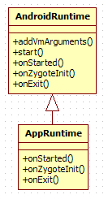
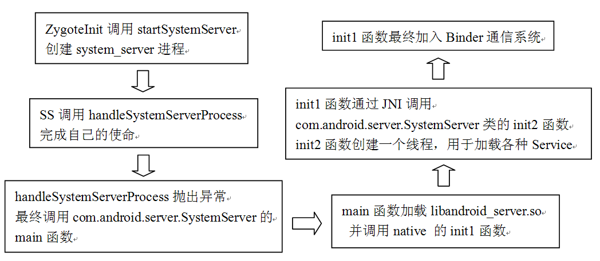
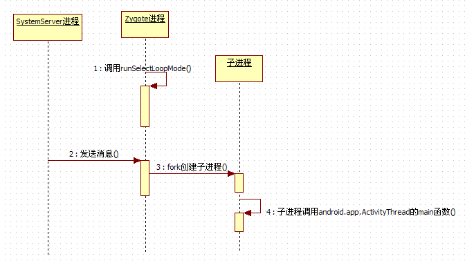

</h1>
本章主要内容

·  深入分析zygote，并介绍system_server进程的初始化工作。

本章涉及的源代码文件名及位置

下面是我们本章分析的源码文件名及其位置。

·  App_main.cpp

framework/base/cmds/app_process/App_main.cpp

·  AndroidRuntime.h

framework/base/include/android_runtime/AndroidRuntime.h

·  android_debug_JNITest.cpp

framework/base/core/jni/android_debug_JNITest.cpp

·  ZygoteInit.java

framework/base/core/java/com/android/internal/os/ZygoteInit.java

·  dalvik_system_Zygote.c

dalvik/vm/native/dalvik_system_Zygote.c

·  RuntimeInit.java

framework/base/core/java/com/android/internal/os/RuntimeInit.java

·  SystemServer.java

framework/base/services/java/com/android/server/SystemServer.java

·  com_android_server_SystemServer.cpp

framework/base/services/jni/com_android_server_SystemServer.cpp

·  system_init.cpp

framework/base/cmds/system_server/library/system_init.cpp

·  Watchdog.java

framework/base/services/java/com/android/server/Watchdog.java

·  ActivityManagerService.java

framework/base/services/java/com/android/server/am/ActivityManagerService.java

·  Process.java

framework/base/core/java/android/os/Process.java

·  ZygoteConnection.java

framework/base/core/java/com/android/internal/os/ZygoteConnection.java

 
<h2>4.1  综述</h2>
读者可能已经知道，Android系统存在着两个完全不同的世界：

·  Java世界，Google放出的SDK主要就是针对这个世界的。在这个世界中运行的程序都是基于Dalvik虚拟机的Java程序。

·  Native世界，也就是用Native语言C或C++开发的程序，它们组成了Native世界。

初次接触Android的人，可能会有几个疑问：

·  Android是基于Linux内核构建的，它最早存在的肯定是Native世界，那么Java世界是什么时候创建的呢？

·  我们都知道，程序运行时一定要有一个进程，但是我们在编写Activity、Service的时候却绝少接触到“进程”这一概念。当然这是Google有意为之，但这些Activity或Service却又不能脱离“进程”而存在。那么，这个“进程”是怎么创建和运行的呢？这是一个值得琢磨的问题。

·  在程序中，我们经常使用系统的Service，那么，这些Service在哪里呢？

这些问题的答案都和我们本章的两位主人公zygote和system_server有关。zygote这个词的中文意思是“受精卵”，它和Android系统中的Java世界有着重要关系。而system_server则“人如其名”，系统中重要的service都驻留于Java中。

zygote和system_server这两个进程分别是Java世界的半边天，任何一个进程的死亡，都会导致Java世界的崩溃，够厉害吧？下面我们就来见识见识这两个重量级人物。

 
<h2>4.2  Zygote分析</h2>
Zygote本身是一个Native的应用程序，和驱动、内核等均无关系。根据第3章对于init的介绍我们可以知道，Zygote是由init进程根据init.rc文件中的配置项而创建的。在分析它之前，我们有必要先简单介绍一下“zygote”这个名字的来历。zygote最初的名字叫“app_process”，这个名字是在Android.mk文件中被指定的，但app_process在运行过程中，通过Linux下的pctrl系统调用将自己的名字换成了“zygote”，所以我们通过ps命令看到的进程名是“zygote”。

zygote玩的这一套“换名把戏”并不影响我们的分析，它的原型app_process所对应的源文件是App_main.cpp，代码如下所示：

[--&gt;App_main.cpp]

int main(int argc, const char* const argv[])

{

  /*

   Zygote进程由init通过fork而来，我们回顾一下init.rc中设置的启动参数：

    -Xzygote/system/bin --zygote --start-system-server

  */

    mArgC= argc;

    mArgV= argv;

    

   mArgLen = 0;

    for(int i=0; i&lt;argc; i++) {

       mArgLen += strlen(argv[i]) + 1;

    }

   mArgLen--;

   AppRuntime runtime;

    // 调用Appruntime的addVmArguments，这个函数很简单，读者可以自行分析

    int i= runtime.addVmArguments(argc, argv);

    if (i&lt; argc) {

       //设置runtime的mParentDir为/system/bin

       runtime.mParentDir = argv[i++];

    }

 

    if (i&lt; argc) {

       arg = argv[i++];

        if(0 == strcmp("--zygote", arg)) {

          //我们传入的参数满足if的条件，而且下面的startSystemServer的值为true

           bool startSystemServer = (i &lt; argc) ? 

                    strcmp(argv[i],"--start-system-server") == 0 : false;

           setArgv0(argv0, "zygote");

//设置本进程名为zygote，这正是前文所讲的“换名把戏”。

            set_process_name("zygote");

                 //①调用runtime的start，注意第二个参数startSystemServer为true

           runtime.start("com.android.internal.os.ZygoteInit",

                              startSystemServer);

        }

        ......

    } 

         ......

}

Zygote的这个main函数虽很简单，但其重要功能却是由AppRuntime的start来完成的。下面，我们就来具体分析这个AppRuntime。
<h3>4.2.1  AppRuntime分析</h3>
AppRuntime类的声明和实现均在App_main.cpp中，它是从AndroidRuntime类派生出来的，图4-1显示了这两个类的关系和一些重要函数：

 

图4-1  AppRuntime和AndroidRuntime的关系

由上图我们可知：

·  AppRuntime重载了onStarted、onZygoteInit和onExit函数。

前面的代码中调用了AndroidRuntime的start函数，由图4-1可知，这个start函数使用的是基类AndroidRuntime的start，我们来分析一下它，注意它的调用参数。

[--&gt;AndroidRuntime.cpp]

void AndroidRuntime::start(const char*className, const bool startSystemServer)

{

    //className的值是"com.android.internal.os.ZygoteInit"

    //startSystemServer的值是true

    char*slashClassName = NULL;

    char*cp;

   JNIEnv* env;

    blockSigpipe();//处理SIGPIPE信号

     ......

 

    constchar* rootDir = getenv("ANDROID_ROOT");

if (rootDir == NULL) {

//如果环境变量中没有ANDROID_ROOT,则新增该变量，并设置值为“/system"

       rootDir = “/system";

        ......

       setenv("ANDROID_ROOT", rootDir, 1);

    }

 

    //① 创建虚拟机

    if(startVm(&amp;mJavaVM, &amp;env) != 0)

        goto bail;

 

     //②注册JNI函数

    if(startReg(env) &lt; 0) {

        goto bail;

      }

 

    jclassstringClass;

   jobjectArray strArray;

   jstring classNameStr;

   jstring startSystemServerStr;

 

   stringClass = env-&gt;FindClass("java/lang/String");

    //创建一个有两个元素的String数组，即Java代码 String strArray[] = new String[2]

   strArray = env-&gt;NewObjectArray(2, stringClass, NULL);

 

  classNameStr = env-&gt;NewStringUTF(className);

   //设置第一个元素为"com.android.internal.os.ZygoteInit"

   env-&gt;SetObjectArrayElement(strArray, 0, classNameStr);

   startSystemServerStr = env-&gt;NewStringUTF(startSystemServer ? 

                                                "true" : "false");

   //设置第二个元素为"true"，注意这两个元素都是String类型，即字符串。

   env-&gt;SetObjectArrayElement(strArray, 1, startSystemServerStr);

 

    jclassstartClass;

   jmethodID startMeth;

 

   slashClassName = strdup(className);

   /*

     将字符串“com.android.internal.os.ZygoteInit”中的“. ”换成“/”，

     这样就变成了“com/android/internal/os/ZygoteInit”,这个名字符合JNI规范，

     我们可将其简称为ZygoteInit类。

   */

    for(cp = slashClassName; *cp != '\0'; cp++)

        if(*cp == '.')

           *cp = '/';

 

   startClass = env-&gt;FindClass(slashClassName);

    ......

    //找到ZygoteInit类的static main函数的jMethodId。

   startMeth = env-&gt;GetStaticMethodID(startClass, "main",

                                             "([Ljava/lang/String;)V");

     ......

     /*

        ③通过JNI调用Java函数，注意调用的函数是main，所属的类是

          com.android.internal.os.ZygoteInit，传递的参数是

          “com.android.internal.os.ZygoteInit true”，

          调用ZygoteInit的main函数后，Zygote便进入了Java世界！

          也就是说，Zygote是开创Android系统中Java世界的盘古。

     */

      env-&gt;CallStaticVoidMethod(startClass,startMeth, strArray);

    //Zygote退出，在正常情况下，Zygote不需要退出。

    if(mJavaVM-&gt;DetachCurrentThread() != JNI_OK)

       LOGW("Warning: unable to detach main thread\n");

    if(mJavaVM-&gt;DestroyJavaVM() != 0)

       LOGW("Warning: VM did not shut down cleanly\n");

 

bail:

   free(slashClassName);

}

通过上面的分析，我们找到了三个关键点，它们共同组成了开创Android系统中Java世界的三部曲。现在让我们来具体地观察它们。
<h4>1. 创建虚拟机——startVm</h4>
我们先看三部曲中的第一部：startVm，这个函数没有特别之处，就是调用JNI的虚拟机创建函数，但是虚拟机创建时的一些参数却是在startVm中被确定的，其代码如下所示：

[--&gt;AndroidRuntime.cpp]

int AndroidRuntime::startVm(JavaVM** pJavaVM,JNIEnv** pEnv)

{

   //这个函数绝大部分代码都是设置虚拟机的参数，我们只分析其中的两个。

  /*

      下面的代码是用来设置JNI check选项的。JNIcheck 指的是Native层调用JNI函数时，

系统所做的一些检查工作。例如调用NewUTFString函数时，系统会检查传入的字符串是不是符合

     UTF-8的要求。JNI check还能检查资源是否正确释放。但这个选项也有其副作用，比如：

     1）因为检查工作比较耗时，所以会影响系统运行速度。

     2）有些检查过于严格，例如上面的字符串检查，一旦出错，则调用进程就会abort。

        所以，JNI check选项一般只在调试的eng版设置，而正式发布的user版则不设置该选项。

    下面这几句代码就控制着是否启用JNI check，这是由系统属性决定的，eng版如经过特殊配置，也可以去掉JNI check。

   */

    property_get("dalvik.vm.checkjni",propBuf, "");

    if(strcmp(propBuf, "true") == 0) {

       checkJni = true;

    } elseif (strcmp(propBuf, "false") != 0) {

       property_get("ro.kernel.android.checkjni",propBuf, "");

        if(propBuf[0] == '1') {

           checkJni = true;

        }

        }

    ......

   /*

设置虚拟机heapsize，默认为16MB。绝大多数厂商都会修改这个值，一般是32MB。

heapsize不能设置过小，否则在操作大尺寸的图片时无法分配所需内存。

     这里有一个问题，即heapsize既然是系统级的属性，那么能否根据不同应用程序的需求来进行动

         态调整？我开始也考虑过能否实现这一构想，不过希望很快就破灭了。对这一问题，我们将在拓展

         部分深入讨论。

    */

   strcpy(heapsizeOptsBuf, "-Xmx");

   property_get("dalvik.vm.heapsize", heapsizeOptsBuf+4, "16m");

   opt.optionString = heapsizeOptsBuf;

   mOptions.add(opt);

 

    if(checkJni) {

        opt.optionString ="-Xcheck:jni";

       mOptions.add(opt);

        //JNIcheck中的资源检查，系统中创建的Globalreference个数不能超过2000

       opt.optionString = "-Xjnigreflimit:2000";

       mOptions.add(opt);

   }

    // 调用JNI_CreateJavaVM创建虚拟机，pEnv返回当前线程的JNIEnv变量

   if(JNI_CreateJavaVM(pJavaVM, pEnv, &amp;initArgs) &lt; 0) {

       LOGE("JNI_CreateJavaVM failed\n");

       goto bail;

    }

 

    result= 0;

 

bail:

   free(stackTraceFile);

    returnresult;

}

关于dalvik虚拟机的详细参数，读者可以参见Dalvik/Docs/Dexopt.html中的说明。这个Docs目录下的内容，或许可帮助我们更深入地了解dalvik虚拟机。

 
<h4>2. 注册JNI函数——startReg</h4>
前面已经介绍了如何创建虚拟机，下一步则需要给这个虚拟机注册一些JNI函数。正是因为后续Java世界用到的一些函数是采用native方式来实现的，所以才必须提前注册这些函数。

下面我们来看看这个startReg函数，代码如下所示：

[--&gt;AndroidRuntime.cpp]

int AndroidRuntime::startReg(JNIEnv* env)

{

 //注意，设置Thread类的线程创建函数为javaCreateThreadEtc

 //它的作用，将在对Thread分析一部分（第5章）中做详细介绍。

 androidSetCreateThreadFunc((android_create_thread_fn)javaCreateThreadEtc);

  

  env-&gt;PushLocalFrame(200);

  //注册jni函数，gRegJNI是一个全局数组。

  if(register_jni_procs(gRegJNI, NELEM(gRegJNI), env) &lt; 0) {

       env-&gt;PopLocalFrame(NULL);

       return -1;

    }

   env-&gt;PopLocalFrame(NULL);

    //下面这句话应当是“码农”休闲时的小把戏。在日新月异的IT世界中，它现已绝对是“文物”了。

   //createJavaThread("fubar", quickTest, (void*)"hello");

    return0;

}

我们来看看register_jni_procs，代码如下所示：

[--&gt;AndroidRuntime.cpp]

static int register_jni_procs(const RegJNIRecarray[], size_t count, JNIEnv* env)

{

    for(size_t i = 0; i &lt; count; i++) {

        if(array[i].mProc(env) &lt; 0) {//仅仅是一个封装，调用数组元素的mProc函数 

       return -1;

        }

        }

        return 0;

}

上面的函数调用的不过是数组元素的mProc函数，再让我们直接看看这个全局数组的gRegJNI变量。

[--&gt;AndroidRuntime.cpp::gRegJNI声明]

static const RegJNIRec gRegJNI[] = {

   REG_JNI(register_android_debug_JNITest),

   REG_JNI(register_com_android_internal_os_RuntimeInit),

   REG_JNI(register_android_os_SystemClock),

   REG_JNI(register_android_util_EventLog),

   REG_JNI(register_android_util_Log),

     ...//共有100项

};

REG_JNI是一个宏，宏里边包括的就是那个mProc函数，这里，我们来分析一个例子。

[--&gt;android_debug_JNITest.cpp]

int register_android_debug_JNITest(JNIEnv* env)

{

   //为android.debug.JNITest类注册它所需要的JNI函数

   returnjniRegisterNativeMethods(env, "android/debug/JNITest",

                                          gMethods,NELEM(gMethods));

}

哦，原来mProc就是为Java类注册JNI函数！

至此，虚拟机已创建好，JNI函数也已注册，下一步就要分析CallStaticVoidMethod了。通过这个函数，我们将进入Android所精心打造的Java世界，而且最佳情况是，永远也不回到Native世界。
<h3>4.2.2  Welcome to Java World</h3>
这个Java世界的入口在哪里？根据前面的分析，CallStaticVoidMethod最终将调用com.android.internal.os.ZygoteInit的main函数，下面就来看看这个入口函数。代码如下所示：

[--&gt;ZygoteInit.java]

public static void main(String argv[]) {

  try {

        

       SamplingProfilerIntegration.start();

       //①注册Zygote用的socket

       registerZygoteSocket();

       //②预加载类和资源

       preloadClasses();

       preloadResources();

       ......

       // 强制一次垃圾收集

       gc();

       

      //我们传入的参数满足if分支

      if (argv[1].equals("true")) {

          startSystemServer();//③启动system_server进程

       }else if (!argv[1].equals("false")) {

          thrownew RuntimeException(argv[0] + USAGE_STRING);

        }

      // ZYGOTE_FORK_MODE被定义为false，所以满足else的条件

       if(ZYGOTE_FORK_MODE) {

            runForkMode();

       }else {

          runSelectLoopMode();//④zygote调用这个函数

       }

       closeServerSocket();//关闭socket

        }catch (MethodAndArgsCaller caller) {

           caller.run();//⑤很重要的caller run函数，以后分析

        }catch (RuntimeException ex) {

          closeServerSocket();

           throw ex;

        }

     ......

    }

在ZygoteInit的main函数中，我们列举出了5大关键点，下面对其一一进行分析。先看第一点：registerZygoteSocket。
<h4>1. 建立IPC通信服务端——registerZygoteSocket</h4>
Zygote以及系统中其他程序的通信没有使用Binder，而是采用了基于AF_UNIX类型的Socket。registerZygoteSocket函数的使命正是建立这个Socket。代码如下所示：

[--&gt;ZygoteInit.java]

private static void registerZygoteSocket() {

    if(sServerSocket == null) {

        intfileDesc;

        try{

           //从环境变量中获取Socket的fd，还记得第3章init中介绍的zygote是如何启动的吗？

//这个环境变量由execv传入。

          String env = System.getenv(ANDROID_SOCKET_ENV);

          fileDesc = Integer.parseInt(env);

       } 

       try{

         //创建服务端Socket，这个Socket将listen并accept Client

         sServerSocket= new LocalServerSocket(createFileDescriptor(fileDesc));

       } 

       }

}

registerZygoteSocket很简单，就是创建一个服务端的Socket。不过读者应该提前想到下面两个问题：

·  谁是客户端？

·  服务端会怎么处理客户端的消息？

建议：读者要好好学习与Socket相关的知识，这些知识对网络编程或简单的IPC使用，是会有帮助的。

<h4>2. 预加载类和资源</h4>
现在我们要分析的就是preloadClasses和preloadResources函数了。先来看看preloadClasses。

[--&gt;ZygoteInit.java]

private static void preloadClasses() {

     finalVMRuntime runtime = VMRuntime.getRuntime();

     //预加载类的信息存储在PRELOADED_CLASSES变量中，它的值为"preloaded-classes"

    InputStream is = ZygoteInit.class.getClassLoader().getResourceAsStream(

                           PRELOADED_CLASSES);

        if(is == null) {

           Log.e(TAG, "Couldn't find " + PRELOADED_CLASSES +".");

        }else {

              ...... //做一些统计和准备工作

 

            try {

               BufferedReader br

                    = new BufferedReader(newInputStreamReader(is), 256);

               //读取文件的每一行，忽略#开头的注释行

               int count = 0;

               String line;

               String missingClasses = null;

               while ((line = br.readLine()) != null) {

                      line = line.trim();

                    if(line.startsWith("#") || line.equals("")) {

                        continue;

                    }

 

                    try {

                        //通过Java反射来加载类，line中存储的是预加载的类名

                        Class.forName(line);

                       ......

                        count++;

                    } catch(ClassNotFoundException e) {

                       ......

                   } catch (Throwable t) {

                        ......

                    }

                   }

               ...... //扫尾工作

        }

        }

preloadClasses看起来是如此简单，但是你知道它有多少个类需要预先加载吗？

用coolfind在framework中搜索名为“preloaded-classes”的文件，最后会在framework/base目录下找到。它是一个文本文件，内容如下：

# Classes which are preloaded bycom.android.internal.os.ZygoteInit.

# Automatically generated by 

# frameworks/base/tools/preload/WritePreloadedClassFile.java.

# MIN_LOAD_TIME_MICROS=1250  //超时控制

android.R$styleable

android.accounts.AccountManager

android.accounts.AccountManager$4

android.accounts.AccountManager$6

android.accounts.AccountManager$AmsTask

android.accounts.AccountManager$BaseFutureTask

android.accounts.AccountManager$Future2Task

android.accounts.AuthenticatorDescription

android.accounts.IAccountAuthenticatorResponse$Stub

android.accounts.IAccountManager$Stub

android.accounts.IAccountManagerResponse$Stub

......//一共有1268行

这个preload-class一共有1268行，试想，加载这么多类得花多少时间！

说明：preload_class文件由framework/base/tools/preload工具生成，它需要判断每个类加载的时间是否大于1250微秒，超过这个时间的类就会被写到preload-classes文件中，最后由zygote预加载。这方面的内容，读者可参考有关preload工具中的说明，这里就不再赘述。

preloadClass函数的执行时间比较长，这是导致Android系统启动慢的原因之一。对这一块可以做一些优化，但优化是基于对整个系统有比较深入了解才能实现的。

注意：在拓展思考部分中，我们会讨论Android启动速度问题。

preloadResources和preloadClass类似，它主要是加载framework-res.apk中的资源。这里就不再介绍它了。

说明：在UI编程中常使用的com.android.R.XXX资源，是系统默认的资源，它们就是由Zygote加载的。

<h4>3. 启动system_server</h4>
我们现在要分析的是第三个关键点：startSystemServer。这个函数会创建Java世界中系统Service所驻留的进程system_server，该进程是framework的核心。如果它死了，就会导致zygote自杀。先来看看这个核心进程是如何启动的。

[--&gt;ZygoteInit.java]

private static boolean startSystemServer()

           throws MethodAndArgsCaller, RuntimeException {

        //设置参数

       String args[] = {

            "--setuid=1000",//uid和gid等设置

           "--setgid=1000",

            "--setgroups=1001,1002,1003,1004,1005,1006,1007,1008,1009,1010,

                            3001,3002,3003",

           "--capabilities=130104352,130104352",

           "--runtime-init",

           "--nice-name=system_server", //进程名，叫system_server

           "com.android.server.SystemServer", //启动的类名

        };

       ZygoteConnection.Arguments parsedArgs = null;

       int pid;

       try {

          //把上面字符串数组参数转换成Arguments对象。具体内容请读者自行分析。

           parsedArgs = new ZygoteConnection.Arguments(args);

           int debugFlags = parsedArgs.debugFlags;

          //fork一个子进程，看来，这个子进程就是system_server进程。 

           pid = Zygote.forkSystemServer(

                    parsedArgs.uid,parsedArgs.gid,

                    parsedArgs.gids,debugFlags, null);

        }catch (IllegalArgumentException ex) {

           throw new RuntimeException(ex);

        }

     /*

      关于fork的知识，请读者务花些时间去研究。如果对fork具体实现还感兴趣，可参考

     《Linux内核源代码情景分析》一书。（该书由浙江大学出版社出版，作者为毛德操、胡希明）

      下面代码中，如果pid为零，则表示处于子进程中，也就是处于system_server进程中。

     */

        if(pid == 0) {

         //① system_server进程的工作 

           handleSystemServerProcess(parsedArgs);

        }

       //zygote返回true

       return true;

    }

OK，这里出现了一个分水岭，即Zygote进行了一次无性繁殖，分裂出了一个system_server进程。关于它的故事，我们会在后文做专门分析，这里先说Zygote。
<h4>4. 有求必应之等待请求——runSelectLoopMode</h4>
当Zygote从startSystemServer返回后，将进入第四个关键函数：runSelectLoopMode。前面，在第一个关键点registerZygoteSocket中注册了一个用于IPC的Socket，不过那时还没有地方用到它。它的用途将在这个runSelectLoopMode中体现出来，请看下面的代码：

[--&gt;ZygoteInit.java]

private static void runSelectLoopMode() 

throws MethodAndArgsCaller {

       ArrayList&lt;FileDescriptor&gt; fds = new ArrayList();

       ArrayList&lt;ZygoteConnection&gt; peers = new ArrayList();

       FileDescriptor[] fdArray = new FileDescriptor[4];

      //sServerSocket是我们先前在registerZygoteSocket建立的Socket

       fds.add(sServerSocket.getFileDescriptor());

       peers.add(null);

 

       int loopCount = GC_LOOP_COUNT;

       while (true) {

           int index;

             try {

               fdArray = fds.toArray(fdArray);

        /*

          selectReadable内部调用select，使用多路复用I/O模型。

          当有客户端连接或有数据时，则selectReadable就会返回。

        */ 

              index = selectReadable(fdArray);

           } 

          else if (index == 0) {

             //如有一个客户端连接上，请注意客户端在Zygote的代表是ZygoteConnection

               ZygoteConnection newPeer = acceptCommandPeer();

               peers.add(newPeer);

               fds.add(newPeer.getFileDesciptor());

           } else {

               boolean done;

              //客户端发送了请求，peers.get返回的是ZygoteConnection

             //后续处理将交给ZygoteConnection的runOnce函数完成。

               done = peers.get(index).runOnce();

        }

    }

runSelectLoopMode比较简单，就是：

·  处理客户连接和客户请求。其中客户在Zygote中用ZygoteConnection对象来表示。

·  客户的请求由ZygoteConnection的runOnce来处理。

建议：runSelectLoopMode比较简单，但它使用的select的背后所代表的思想却并非简单。建议读者以此为契机，认真学习常用的I/O模型，包括阻塞式、非阻塞式、多路复用、异步I/O等，掌握这些知识，对于未来编写大型系统很有帮助。

关于Zygote是如何处理请求的，将单独用一节内容进行讨论。
<h3>4.2.3 关于 Zygote的总结</h3>
Zygote是创建Android系统中Java世界的盘古，它创建了第一个Java虚拟机，同时它又是女娲，它成功地繁殖了framework的核心system_server进程。做为Java语言的受益者，我们理应回顾一下Zygote创建Java世界的步骤：

·  第一天：创建AppRuntime对象，并调用它的start。此后的活动则由AppRuntime来控制。

·  第二天：调用startVm创建Java虚拟机，然后调用startReg来注册JNI函数。

·  第三天：通过JNI调用com.android.internal.os.ZygoteInit类的main函数，从此进入了Java世界。然而在这个世界刚开创的时候，什么东西都没有。

·  第四天：调用registerZygoteSocket。通过这个函数，它可以响应子孙后代的请求。同时Zygote调用preloadClasses和preloadResources，为Java世界添砖加瓦。

·  第五天：Zygote觉得自己工作压力太大，便通过调用startSystemServer分裂一个子进程system_server来为Java世界服务。

·  第六天：Zygote完成了Java世界的初创工作，它已经很满足了。下一步该做的就是调用runSelectLoopMode后，便沉沉地睡去了。

·  以后的日子：Zygote随时守护在我们的周围，当接收到子孙后代的请求时，它会随时醒来，为它们工作。

如果支持中文编码的话，我一定要为Zygote取名为盘古_女娲。

<h2>4.3  SystemServer分析</h2>
SystemServer的进程名实际上叫做“system_server”，这里我们可将其简称为SS。SS做为Zygote的嫡长子，其重要性不言而喻。关于这一点，通过代码分析便可马上知晓。
<h3>4.3.1  SystemServer的诞生</h3>
我们先回顾一下SS是怎么创建的。

String args[] = {

           "--setuid=1000",

           "--setgid=1000",

           "--setgroups=1001,1002,1003,1004,1005,1006,1007,1008,1009,1010,

                             3001,3002,3003",

           "--capabilities=130104352,130104352",

           "--runtime-init",

           "--nice-name=system_server",

           "com.android.server.SystemServer",

        };

       ZygoteConnection.Arguments parsedArgs = null;

 

       int pid;

      parsedArgs = new ZygoteConnection.Arguments(args);

       intdebugFlags = parsedArgs.debugFlags;

       pid = Zygote.forkSystemServer(  //调用forkSystemServer

                    parsedArgs.uid,parsedArgs.gid,

                    parsedArgs.gids,debugFlags, null);

 

从上面的代码中可以看出，SS是由Zygote通过Zygote.forkSystemServer函数fork诞生出来的。这里会有什么玄机吗？先来一起看看forkSystemServer的实现。它是一个native函数，实现在dalvik_system_Zygote.c中，如下所示：

[--&gt;dalvik_system_Zygote.c]

static voidDalvik_dalvik_system_Zygote_forkSystemServer(

                        const u4* args, JValue* pResult)

{

     pid_tpid;

    //根据参数，fork一个子进程

    pid =forkAndSpecializeCommon(args);

    if (pid &gt; 0) {

       int status;

       gDvm.systemServerPid = pid;//保存system_server的进程id

      //函数退出前须先检查刚创建的子进程是否退出了。

        if(waitpid(pid, &amp;status, WNOHANG) == pid) {

           //如果system_server退出了，Zygote直接干掉了自己

           //看来Zygote和SS的关系异常紧密，简直是生死与共！

            kill(getpid(), SIGKILL);

        }

    }

   RETURN_INT(pid);

}

下面，再看看forkAndSpecializeCommon，代码如下所示：

[--&gt;dalvik_system_Zygote.c]

static pid_t forkAndSpecializeCommon(const u4*args)

{

    pid_tpid;

    uid_tuid = (uid_t) args[0];

    gid_tgid = (gid_t) args[1];

   ArrayObject* gids = (ArrayObject *)args[2];

    u4debugFlags = args[3];

   ArrayObject *rlimits = (ArrayObject *)args[4];

   //设置信号处理，待会儿要看看这个函数。   

   setSignalHandler();      

    pid =fork(); //fork子进程

   if (pid== 0) {

     //对子进程要根据传入的参数做一些处理，例如设置进程名，设置各种id（用户id，组id等）

   }

......

}

最后看看setSignalHandler函数，它由Zygote在fork子进程前调用，代码如下所示：

[--&gt;dalvik_system_Zygote.c]

static void setSignalHandler() 

{

    interr;

    structsigaction sa;

   memset(&amp;sa, 0, sizeof(sa));

   sa.sa_handler = sigchldHandler;

    err =sigaction (SIGCHLD, &amp;sa, NULL);//设置信号处理函数，该信号是子进程死亡的信号

}

//我们直接看这个信号处理函数sigchldHandler

static void sigchldHandler(int s)

{

    pid_tpid;

    intstatus;

     

    while((pid = waitpid(-1, &amp;status, WNOHANG)) &gt; 0) {

             } else if (WIFSIGNALED(status)) {

          }

        }

        //如果死去的子进程是SS，则Zygote把自己也干掉了，这样就做到了生死与共！

        if(pid == gDvm.systemServerPid) {

           kill(getpid(), SIGKILL);

        }

   }

OK，做为Zygote的嫡长子，SS确实具有非常高的地位，竟然到了与Zygote生死与共的地步!它为什么这么重要呢？我们现在就从forkSystemServer来分析SS究竟承担了怎样的工作使命。

关于源代码定位的问题，不少人当面对浩瀚的代码时，常常不知道具体函数是在哪个文件中定义的。这里，就Source insight的使用提几点建议：

   1）加入工程的时候，不要把所有目录全部加进去，否则会导致解析速度异常缓慢。我们可以先加入framework目录，如以后另有需要时，再加入其他目录。

2）除了Sourceinsight的工具外，还需要有一个能搜索文件中特定字符串的工具，我用的是coolfind。forkSystemServer这个函数，就是通过它在源码中搜索到的，并且找到了实现文件dalvik_system_Zygote.c。在Linux下也有对应工具，但工作速度比coolfind缓慢。

3） 在Linux下，可通过wine（一个支持Linux平台安装Windows软件的工具）安装Source insight。

<h3>4.3.2  SystemServer的重要使命</h3>
SS诞生后，便和生父Zygote分道扬镳，它有了自己的历史使命。它的使命是什么呢？其代码如下所示：

    pid =Zygote.forkSystemServer();

     if(pid == 0) { //SS进程返回0，那么下面这句话就是SS的使命： 

           handleSystemServerProcess(parsedArgs);

    }

SS调用handleSystemServerProcess来承担自己的职责。

[--&gt;ZygoteInit.java]

private static void handleSystemServerProcess(

       ZygoteConnection.ArgumentsparsedArgs)

      throws ZygoteInit.MethodAndArgsCaller {

        //关闭从Zygote那里继承下来的Socket。 

        closeServerSocket();

      //设置SS进程的一些参数。

        setCapabilities(parsedArgs.permittedCapabilities,

                   parsedArgs.effectiveCapabilities);

        //调用ZygoteInit函数。

        RuntimeInit.zygoteInit(parsedArgs.remainingArgs);

  }

 好了，SS走到RuntimeInit了，它的代码在RuntimeInit.java中，如下所示：    

[--&gt;RuntimeInit.java]

public static final void zygoteInit(String[]argv)

           throws ZygoteInit.MethodAndArgsCaller {

     //做一些常规初始化

     commonInit();

     //①native层的初始化。

    zygoteInitNative();

     intcurArg = 0;

     for (/* curArg */ ; curArg &lt; argv.length; curArg++) {

           String arg = argv[curArg];

 

           if (arg.equals("--")) {

               curArg++;

               break;

           } else if (!arg.startsWith("--")) {

               break;

           } else if (arg.startsWith("--nice-name=")) {

               String niceName = arg.substring(arg.indexOf('=') + 1);

               //设置进程名为niceName，也就是"system_server"

               Process.setArgV0(niceName);

           }

        }

       //startClass名为"com.android.server.SystemServer"

       String startClass = argv[curArg++];

       String[] startArgs = new String[argv.length - curArg];

       System.arraycopy(argv, curArg, startArgs, 0, startArgs.length);

       //②调用startClass，也就是com.android.server.SystemServer类的main函数。

       invokeStaticMain(startClass, startArgs);

}

对于上面列举出的两个关键点，我们一个一个地分析。
<h4>1. zygoteInitNative分析</h4>
先看zygoteInitNative，它是一个native函数，实现在AndroidRuntime.cpp中。

[--&gt;AndroidRuntime.cpp]

static voidcom_android_internal_os_RuntimeInit_zygoteInit(

JNIEnv* env,jobject clazz)

{

   gCurRuntime-&gt;onZygoteInit();

}

//gCurRuntime是什么？还记得我们在本章开始说的app_process的main函数吗？

int main(int argc, const char* const argv[])

{

  AppRuntime runtime;// 就是这个。当时我们没顾及它的构造函数，现在回过头看看。

}

//AppRuntime的定义

class AppRuntime : public AndroidRuntime

static AndroidRuntime* gCurRuntime = NULL; // gCurRuntime为全局变量。

AndroidRuntime::AndroidRuntime()

{

   SkGraphics::Init();//Skia库初始化

   SkImageDecoder::SetDeviceConfig(SkBitmap::kRGB_565_Config);

   SkImageRef_GlobalPool::SetRAMBudget(512 * 1024);

    gCurRuntime= this; //gCurRuntime被设置为AndroidRuntime对象自己

}

由于SS是从Zygote fork出来的，所以它也拥有Zygote进程中定义的这个gCurRuntime，也就是AppRuntime对象。那么，它的onZygoteInit会干些什么呢？它的代码在App_main.cpp中，我们一起来看：

[--&gt;App_main.cpp]

   virtual void onZygoteInit()

    { 

        //下面这些东西和Binder有关系，但读者可以先不管它。

       sp&lt;ProcessState&gt; proc = ProcessState::self();

        if(proc-&gt;supportsProcesses()) {

            proc-&gt;startThreadPool();//启动一个线程，用于Binder通信。

       }       

}

一言以蔽之，SS调用zygoteInitNative后，将和Binder通信系统建立联系，这样SS就能够使用Binder了。关于Binder的知识，在第6章中将详细介绍，读者朋友现在不必关注。
<h4>2. invokeStaticMain分析</h4>
再来看第二个关键点invokeStaticMain。代码如下所示：

[--&gt;RuntimeInit.java]

private static void invokeStaticMain(StringclassName, String[] argv)

           throws ZygoteInit.MethodAndArgsCaller {

 

      ......//注意我们的参数，className为"com.android.server.SystemServer"

       Class&lt;?&gt; cl;

 

       try {

           cl = Class.forName(className);

        }catch (ClassNotFoundException ex) {

           throw new RuntimeException(

                    "Missing class wheninvoking static main " + className,

                    ex);

        }

 

       Method m;

       try {

           //找到com.android.server.SystemServer类的main函数，肯定有地方要调用它

           m = cl.getMethod("main", new Class[] { String[].class });

        }catch (NoSuchMethodException ex) {

           ......

        }catch (SecurityException ex) {

           ......

        }

 

       int modifiers = m.getModifiers();

        if(! (Modifier.isStatic(modifiers) &amp;&amp; Modifier.isPublic(modifiers))) {

           ......

        }

        //抛出一个异常，为什么不在这里直接调用上面的main函数呢？

       throw new ZygoteInit.MethodAndArgsCaller(m, argv);

    }

invokeStaticMain竟然抛出了一个异常，它是在哪里被截获呢？原来是在ZygoteInit的main函数中。请看这段代码：

注意：我们所在的进程是system_server。

[--&gt;ZygoteInit.java]

     ....

if (argv[1].equals("true")) {

     //SS进程中，抛出一个异常MethodAndArgsCaller

    startSystemServer();

     ......

    catch(MethodAndArgsCaller caller) {

     //被截获，调用caller的run函数

      caller.run();  

  }

再来看看MethodAndArgsCaller的run函数。

public void run() {

   try {

   //这个mMethod为com.android.server.SystemServer的main函数

  mMethod.invoke(null, new Object[] { mArgs });

  } catch(IllegalAccessException ex) {

     ......

  }        

}

抛出的这个异常最后会导致com.android.server.SystemServer类的main函数被调用。不过这里有一个疑问，为什么不在invokeStaticMain那里直接调用，而是采用这种抛异常的方式呢？我对这个问题的看法是：

·  这个调用是在ZygoteInit.main中，相当于Native的main函数，即入口函数，位于堆栈的顶层。如果不采用抛异常的方式，而是在invokeStaticMain那里调用，则会浪费之前函数调用所占用的一些调用堆栈。

关于这个问题的深层思考，读者可以利用fork和exec的知识。对这种抛异常的方式，我个人觉得是对exec的一种近似模拟，因为后续的工作将交给com.android.server.SystemServer类来处理。

<h4>3. SystemServer的真面目</h4>
ZygoteInit分裂产生的SS，其实就是为了调用com.android.server.SystemServer的main函数，这简直就是改头换面！下面就来看看这个真实的main函数，代码如下所示：

[--&gt;SystemServer.java]

public static void main(String[] args) {

   ......

    //加载libandroid_servers.so

   System.loadLibrary("android_servers");

  //调用native的init1函数。

  init1(args);

}

其中main函数将加载libandroid_server.so库，这个库所包含的源码文件在文件夹framework/base/services/jni下。
<h5>（1）init1分析</h5>
init1是native函数，在com_android_server_SystemServer.cpp中实现。来看看它，代码如下所示：

[--&gt;com_android_server_SystemServer.cpp]

extern "C" int system_init();

 

static voidandroid_server_SystemServer_init1(JNIEnv* env, jobject clazz)

{

   system_init();//调用另外一个函数。

}

system_init的实现在system_init.cpp中，它的代码如下所示：

[--&gt;system_init.cpp]

extern "C" status_t system_init()

{

   //下面这些调用和Binder有关，我们会在第6章中讲述，这里先不必管它。

   sp&lt;ProcessState&gt; proc(ProcessState::self());

   sp&lt;IServiceManager&gt; sm = defaultServiceManager();

   

    sp&lt;GrimReaper&gt;grim = new GrimReaper();

   sm-&gt;asBinder()-&gt;linkToDeath(grim, grim.get(), 0);

    charpropBuf[PROPERTY_VALUE_MAX];

   property_get("system_init.startsurfaceflinger", propBuf,"1");

    if(strcmp(propBuf, "1") == 0) {

        //SurfaceFlinger服务在system_server进程创建

       SurfaceFlinger::instantiate();

    }

 

     ......

 

    //调用com.android.server.SystemServer类的init2函数

   AndroidRuntime* runtime = AndroidRuntime::getRuntime();

   runtime-&gt;callStatic("com/android/server/SystemServer","init2");

    

//下面这几个函数调用和Binder通信有关，具体内容在第6章中介绍。

    if (proc-&gt;supportsProcesses()) {

        ProcessState::self()-&gt;startThreadPool();

       //调用joinThreadPool后，当前线程也加入到Binder通信的大潮中

       IPCThreadState::self()-&gt;joinThreadPool();

       }

    returnNO_ERROR;

}

init1函数创建了一些系统服务，然后把调用线程加入Binder通信中。不过其间还通过JNI调用了com.android.server.SystemServer类的init2函数，下面就来看看这个init2函数。
<h5>（2）init2分析</h5>
init2在Java层，代码在SystemServer.java中，如下所示：

[--&gt;SystemServer.java]

public static final void init2() {

   Threadthr = new ServerThread();

   thr.setName("android.server.ServerThread");

   thr.start();//启动一个ServerThread

}

启动了一个ServerThread线程。请直接看它的run函数。这个函数比较长，大概看看它干了什么即可。

[--&gt;SystemServer.java::ServerThread的run函数]

public void run(){

             ....

  //启动Entropy Service

  ServiceManager.addService("entropy",new EntropyService());

  //启动电源管理服务

  power =new PowerManagerService();

 ServiceManager.addService(Context.POWER_SERVICE, power);

  //启动电池管理服务。

  battery= new BatteryService(context);

 ServiceManager.addService("battery", battery);

 

   //初始化看门狗，在拓展部分将介绍关于看门狗的知识

   Watchdog.getInstance().init(context,battery, power, alarm,

                               ActivityManagerService.self());

            

  //启动WindowManager服务

  wm =WindowManagerService.main(context, power,

                    factoryTest !=SystemServer.FACTORY_TEST_LOW_LEVEL);

  ServiceManager.addService(Context.WINDOW_SERVICE,wm);

          

  //启动ActivityManager服务

  (ActivityManagerService)ServiceManager.getService("activity"))

                    .setWindowManager(wm);

 

  ......//总之，系统各种重要服务都在这里启动

   Looper.loop();  //进行消息循环，然后处理消息。关于这部分内容参见第5章。

}

init2函数比较简单，就是单独创建一个线程，用以启动系统各项服务，至此，读者或许能理解SS的重要性了吧？

·  Java世界的核心Service都在这里启动，所以它非常重要。

说明：本书不对这些Service做进一步分析，今后有机会再做做专门介绍。

<h3>4.3.3 关于 SystemServer的总结</h3>
SS曲折的调用流程真让人眼花缭乱，我们用图4-2来展示这一过程：

 

图4-2  SystemServer的调用流程

注意：init1函数最终导致进程的主线程加入到Binder通信的大潮中，关于Binder的知识，在第6章中介绍。

 
<h2>4.4  Zygote的分裂 </h2>
前文已经讲道，Zygote分裂出嫡长子system_server后，就通过runSelectLoopMode等待并处理来自客户的消息，那么，谁会向Zygote发送消息呢？这里，以一个Activity的启动为例，具体分析Zygote是如何分裂和繁殖的。
<h3>4.4.1  ActivityManagerService发送请求</h3>
ActivityManagerService也是由SystemServer创建的。假设通过startActivit来启动一个新的Activity，而这个Activity附属于一个还未启动的进程，那么这个进程该如何启动呢？先来看看ActivityManagerService中的startProcessLocked函数，代码如下所示：

[--&gt;ActivityManagerService.java]

private final void startProcessLocked(ProcessRecordapp,

           String hostingType, String hostingNameStr){   

      ......//这个ActivityManagerService类很复杂，有14657行！！！         

   if("1".equals(SystemProperties.get("debug.checkjni"))) {

               debugFlags |= Zygote.DEBUG_ENABLE_CHECKJNI;

           }

           if("1".equals(SystemProperties.get("debug.assert"))) {

               debugFlags |= Zygote.DEBUG_ENABLE_ASSERT;

           }

    //这个Process类是Android提供的，并非JDK中的Process类

    intpid = Process.start("android.app.ActivityThread",

                    mSimpleProcessManagement ?app.processName : null, uid, uid,

                    gids, debugFlags, null);

   ......

}

接着来看看Process的start函数，这个Process类是android.os.Process，它的代码在Process.java中，代码如下所示：

[--&gt;Process.java]

public static final int start(final StringprocessClass,final String niceName,

int uid, int gid, int[] gids,intdebugFlags,String[] zygoteArgs)

{

   //注意，processClass的值是"android.app.ActivityThread"。

   if(supportsProcesses()) {

       try {

            //调用startViaZygote。

            return startViaZygote(processClass, niceName, uid, gid, gids,

                        debugFlags,zygoteArgs);

          }

     } 

}

[--&gt;Process.java::startViaZygote()]

private static int startViaZygote(final StringprocessClass,

     final String niceName,final int uid, finalint gid,final int[] gids,

     intdebugFlags,String[] extraArgs) throws ZygoteStartFailedEx {

     int pid;

     ......//一些参数处理，最后调用zygoteSendArgsAndGetPid函数。

 argsForZygote.add("--runtime-init");//这个参数很重要

    argsForZygote.add("--setuid=" +uid);

   argsForZygote.add("--setgid=" + gid);

    pid =zygoteSendArgsAndGetPid(argsForZygote);

     return pid;

}

[--&gt;Process.java::zygoteSendArgsAndGetPid()]

private static intzygoteSendArgsAndGetPid(ArrayList&lt;String&gt; args)

                                           throwsZygoteStartFailedEx {

 

   intpid;

   // openZygoteSocketIfNeeded？是不是打开了和Zygote通信的Socket？

  openZygoteSocketIfNeeded();

   

   try {

          //把请求的参数发到Zygote。

           sZygoteWriter.write(Integer.toString(args.size()));

           sZygoteWriter.newLine();

           sZygoteWriter.write(arg);

           sZygoteWriter.newLine();

       }

       //读取Zygote处理完的结果，便得知是某个进程的pid！

       sZygoteWriter.flush();

       pid= sZygoteInputStream.readInt();

       return pid;

}

[--&gt;Process.java]

private static void openZygoteSocketIfNeeded()throws ZygoteStartFailedEx {

try {

         sZygoteSocket = new LocalSocket();//果真如此！！

        //连接Zygote

         sZygoteSocket.connect(new LocalSocketAddress(ZYGOTE_SOCKET, 

                               LocalSocketAddress.Namespace.RESERVED));

         sZygoteInputStream

                        = newDataInputStream(sZygoteSocket.getInputStream());

         sZygoteWriter = new BufferedWriter(

                                      new OutputStreamWriter(

                                   sZygoteSocket.getOutputStream()),256);

              }

          }

    }

}

好了，ActivityManagerService终于向Zygote发送请求了。请求的参数中有一个字符串，它的值是“android.app.ActivityThread”。现在该回到Zygote处理请求那块去看看了。

注意：由于ActivityManagerService驻留于SystemServer进程中，所以正是SS向Zygote发送了消息。

<h3>4.4.2  有求必应之响应请求</h3>
前面有一节，题目叫“有求必应之等待请求”，那么这一节“有求必应之响应请求”会回到ZygoteInit。下面就看看它是如何处理请求的。

[---&gt;ZygoteInit.java]

private static void runSelectLoopMode() throwsMethodAndArgsCaller{

    ......

   try {

          fdArray = fds.toArray(fdArray);

          ......

           else if (index == 0) {

               ZygoteConnection newPeer = acceptCommandPeer();

               peers.add(newPeer);

               fds.add(newPeer.getFileDesciptor());

           } else {

               boolean done;

               //调用ZygoteConnection的runOnce

               done = peers.get(index).runOnce();

        }

    ......

}

每当有请求数据发来时，Zygote都会调用ZygoteConnection的runOnce函数。ZygoteConnection代码在ZygoteConnection.java文件中，来看看它的runOnce函数：

[--&gt;ZygoteConnection.java]

boolean runOnce() throwsZygoteInit.MethodAndArgsCaller {

    try {

           args = readArgumentList();//读取SS发送过来的参数

           descriptors = mSocket.getAncillaryFileDescriptors();

        } 

          ......

         int pid;

     try {

           parsedArgs = new Arguments(args);

           applyUidSecurityPolicy(parsedArgs, peer);

            //根据函数名，可知Zygote又分裂出了一个子进程。 

           pid =Zygote.forkAndSpecialize(parsedArgs.uid, parsedArgs.gid,

                    parsedArgs.gids,parsedArgs.debugFlags, rlimits);

        }

        ......

        if(pid == 0) {

           //子进程处理，这个子进程是不是我们要创建的Activity对应的子进程呢？

           handleChildProc(parsedArgs, descriptors, newStderr);

           return true;

        }else { 

         //zygote进程

          return handleParentProc(pid, descriptors, parsedArgs);

        }

}

接下来，看看新创建的子进程在handleChildProc中做了些什么。

[--&gt;ZygoteConnection.java]

private void handleChildProc(ArgumentsparsedArgs,FileDescriptor[] descriptors,

                   PrintStream newStderr) throwsZygoteInit.MethodAndArgsCaller {

 

       ......//根据传入的参数设置新进程的一些属性

      //SS发来的参数中有“--runtime-init“，所以parsedArgs.runtimeInit为true。

      if(parsedArgs.runtimeInit) {

           RuntimeInit.zygoteInit(parsedArgs.remainingArgs);

        }else {

       ......

      }

}

[--&gt;RuntimeInit.java]

public static final void zygoteInit(String[]argv)

           throws ZygoteInit.MethodAndArgsCaller {

        //重定向标准输出和错误输出

       System.setOut(new AndroidPrintStream(Log.INFO, "System.out"));

       System.setErr(new AndroidPrintStream(Log.WARN, "System.err"));

 

       commonInit();

//下面这个函数为native函数，最终会调用AppRuntime的onZygoteInit，在那个函数中

//建立了和Binder的关系

       zygoteInitNative();

       int curArg = 0;

        ......

        String startClass = argv[curArg++];

       String[] startArgs = new String[argv.length - curArg];

       System.arraycopy(argv, curArg, startArgs, 0, startArgs.length);

        //最终还是调用invokeStaticMain函数，这个函数我们已经见识过了。

       invokeStaticMain(startClass, startArgs);

    }

Zygote分裂子进程后，自己将在handleParentProc中做一些扫尾工作，然后继续等待请求进行下一次分裂。

这个android.app.ActivityThread类，实际上是Android中apk程序所对应的进程，它的main函数就是apk程序的main函数。从这个类的命名（android.app）中也可以看出些端倪。

通过这一节的分析，读者可以想到，Android系统运行的那些apk程序，其父都是zygote。这一点，可以通过adb shell登录后，用ps命令查看进程和父进程号来确认。
<h3>4.4.3 关于 Zygote分裂的总结</h3>
Zygote的分裂由SS控制，这个过程我们用图4-3来表示：
<p 

图4-3  Zygote响应请求的过程

说明：这里借用了UML的时序图来表达Zygote响应请求的过程。

<h2>4.5  拓展思考</h2><h3>4.5.1  虚拟机heapsize的限制</h3>
在分析Zygote创建虚拟机的时候，我们说过系统默认设置的Java虚拟机堆栈最大为16MB，这个值对于需要使用较大内存的程序（例如图片处理程序）来说还远远不够。当然，可以修改这个默认值，例如我的HTC G7就将其修改为32MB了，但是这个改动是全局性的，也就是所有的Java程序都会是这个32MB。我们能动态配置这个值吗？例如：

·  设置一个配置文件，每个进程启动的时候根据配置文件的参数来设置堆大小。

不过正如前面所说，我的这一美好愿望最终破灭了，原因只有一个：

·  Zygote是通过fork来创建子进程的，Zygote本身设置的信息会被子进程全部继承，例如Zygote设置的堆栈为16MB，那么它的子进程也是用这个16MB。

关于这个问题，我目前想到了两个解决方案：

·  为Dalivk增加一个函数，这个函数允许动态调整最大堆的大小。

·  Zygote通过fork子进程后，调用exec家族的函数来加载另外一个映像，该映像对应的程序会重新创建虚拟机，重新注册JNI函数，也就是模拟Zygote创世界中前两天的工作，最后调用android.app.ActivityThread的main函数。这种方式应该是可行的，但难度较大，而且会影响运行速度。

关于本节所提出的问题，欢迎广大读者踊跃讨论。

<h3>4.5.2  开机速度优化</h3>
Android开机速度慢这一现象一直受人诟病，Google好像也没有要做这方面优化的意向，那么，在实际工作中又在哪些地方可以做一些优化呢？根据我目前所掌握的资料分析，有三个地方耗时比较长：

·  ZygoteInit的main函数中preloadClasses加载的那一千多个类。

·  开机启动时，会对系统内所有的apk文件扫描并收集信息，这个动作耗费的时间非常长。

·  SystemServer创建的那些Service，会占用不少时间。

我们这里讨论第一个问题，如何减少preloadClasses的时间呢？其实，这个函数是可以去掉的，因为系统最终还是会在使用这些类时去加载，但这样就破坏了Android采用fork机制来创建Java进程的本意，而fork机制的好处则是显而易见的：

·  Zygote预加载的这些class，在fork子进程时，仅需做一个复制即可。这样就节约了子进程的启动时间。

·  根据fork的copy-on-write机制，有些类如果不做改变，甚至连复制都不用，它们会直接和父进程共享数据。这样就会省去不少内存的占用。

开机速度优化是一项比较复杂的研究，目前有人使用Berkeley Lab Checkpoint/Restart（BLCR）技术来提升开机速度。这一技术的构想其实挺简单，就是对当前系统做一个快照，保存到一个文件中，当系统重启时，直接根据文件的快照信息来恢复重启之前的状态。当然想法很简单，实现却是很复杂的，这里，我们对此不做进一步的讨论了，读者可自行展开深入的思考和研究。

我在VMWare虚拟机上使用过类似的技术，它叫Snapshort。开机速度的问题我更希望Google自己能加以重视并推动它的解决。

 
<h3>4.5.3 Watchdog分析</h3>
本章我们没有对SystemServer做更进一步的分析，不过做为拓展内容，这里想介绍一下Watchdog。Watch Dog的中文意思是“看门狗”。我依稀记得，其最初存在的意义是因为早期嵌入式设备上的程序经常“跑飞”（比如说电磁干扰等），所以专门有个硬件看门狗，每隔一段时间，看门狗就去检查一下某个参数是不是被设置了，如果发现该参数没有被设置，则判断为系统出错，然后就会强制重启。

软件层面上Android对SystemServer对参数是否被设置也很谨慎，专门为它增加了一条看门狗，可它看的是哪个门呢？对了，就是看几个重要Service的门，一旦发现Service出了问题，就会杀掉system_server，这样就使zygote随其一起自杀，最后导致重启Java世界。

我们先把SystemServe使用Watchdog的调用流程总结一下，然后以这个为切入点来分析Watchdog。SS和Watchdog的交互流程可以总结为以下三个步骤：

·  Watchdog. getInstance().init() 

·  Watchdog.getInstance().start()

·  Watchdog. getInstance().addMonitor()

这三个步骤都非常简单。先看第一步：
<h5>1. 创建和初始化Watchdog</h5>
getInstance用于创建Watchdog，一起来看看，代码如下所示：

[--&gt;Watchdog.java]

public static Watchdog getInstance() {

 if(sWatchdog == null) {

      sWatchdog= new Watchdog(); //使用了单例模式。

  }

   returnsWatchdog;

}

public class Watchdog extends Thread  

//Watchdog从线程类派生，所以它会在单独的一个线程中执行

private Watchdog() {

       super("watchdog");

    //构造一个Handler,Handler的详细分析见第5章，读者可以简单地把它看做是消息处理的地方。

   //它在handleMessage函数中处理消息 

       mHandler = new HeartbeatHandler();

      //GlobalPssCollected和内存信息有关。

      mGlobalPssCollected= new GlobalPssCollected();

    }

 

这条看门狗诞生后，再来看看init函数，代码如下所示：

[--&gt;Watchdog.java]

public void init(Context context, BatteryServicebattery,

           PowerManagerService power, AlarmManagerService alarm,

           ActivityManagerService activity) {

 

        mResolver = context.getContentResolver();

       mBattery = battery;

       mPower = power;

       mAlarm = alarm;

       mActivity = activity;

        ......

 

       mBootTime = System.currentTimeMillis();//得到当前时间

        ......

}

至此，看门狗诞生的知识就介绍完了，下面我们就让它动起来。
<h5>2. 看门狗跑起来</h5>
SystemServer调用Watchdog的start函数，这将导致Watchdog的run在另外一个线程中被执行。代码如下所示：

[--&gt;Watchdog.java]

public void run() {

     booleanwaitedHalf = false;

     while(true) {//外层while循环

     mCompleted= false; //false表明各个服务的检查还没完成。

     /*

       mHandler的消息处理是在另外一个线程上,这里将给那个线程的消息队列发条消息

       请求Watchdog检查Service是否工作正常。

   */

    mHandler.sendEmptyMessage(MONITOR);

   synchronized (this) { 

          long timeout = TIME_TO_WAIT;

           long start = SystemClock.uptimeMillis();

           //注意这个小while循环的条件，mForceKillSystem为true也会导致退出循环

               while (timeout &gt; 0 &amp;&amp; !mForceKillSystem) {

                 try {

                        wait(timeout);  //等待检查的结果

                    } catch(InterruptedException e) {

                      }

                    timeout = TIME_TO_WAIT -(SystemClock.uptimeMillis() - start);

               }

             //mCompleted为true，表示service一切正常

              if (mCompleted &amp;&amp;!mForceKillSystem) {

                   waitedHalf = false;

                    continue;

               }

                //如果mCompleted不为true，看门狗会比较尽责，再检查一次

               if (!waitedHalf) {

                    ......

                    waitedHalf = true;

                    continue;//再检查一次

               }

           }

           //已经检查过两次了，还是有问题，这回是真有问题了。所以SS需要把自己干掉。

           if (!Debug.isDebuggerConnected()) {

                 Process.killProcess(Process.myPid());

                  System.exit(10); //干掉自己

           } 

           ......

           waitedHalf = false;

        }

}

OK，这个run函数还是比较简单的，就是：

·  隔一段时间给另外一个线程发送一条MONITOR消息，那个线程将检查各个Service的健康情况。而看门狗会等待检查结果，如果第二次还没有返回结果，那么它会杀掉SS。

好吧，来看看检查线程究竟是怎么检查Service的。
<h5>3. 列队检查</h5>
这么多Service，哪些是看门狗比较关注的呢？一共有三个Service是需要交给Watchdog检查的：

·  ActivityManagerService

·  PowerManagerService

·  WindowManagerService

要想支持看门狗的检查，就需要这些Service实现monitor接口，然后Watchdog就会调用它们的monitor函数进行检查了。检查的地方是在HeartbeatHandler类的handleMessage中，代码如下所示：

[--&gt;Watchdog.java::HeartbeatHandler]

final class HeartbeatHandler extends Handler {

       @Override

       public void handleMessage(Message msg) {

           switch (msg.what) {

               ......

               case MONITOR: {

                    ......

                   long now =SystemClock.uptimeMillis();

                  final int size =mMonitors.size();

                   //检查各个服务，并设置当前检查的对象为mCurrentMonitor

                    for (int i = 0 ; i &lt;size ; i++) {

                        mCurrentMonitor =mMonitors.get(i);

                       mCurrentMonitor.monitor();//检查这个对象

                    }

                    //如果没问题，则设置mCompleted为真。

                    synchronized (Watchdog.this){

                        mCompleted = true;

                        mCurrentMonitor = null;

                    }

               } break;

           }

        }

}

那么，Service的健康是怎么判断的呢？我们以PowerManagerService为例，先看看它是怎么把自己交给看门狗检查的。

[--&gt;PowerManagerService.java]

PowerManagerService()

{

   ......

   //在构造函数中把自己加入Watchdog的检查队列

   Watchdog.getInstance().addMonitor(this);

}

而Watchdog调用各个monitor函数到底检查了些什么呢？再看看它实现的monitor函数吧。

[--&gt;PowerManagerService.java]

public void monitor() {

 //monitor原来检查的就是这些Service是不是发生死锁了！

   synchronized (mLocks) { }

}

原来，Watchdog最怕系统服务死锁了，对于这种情况也只能采取杀系统的办法了。

这种情况，我只碰到过一次，原因是有一个函数占着锁，但长时间没有返回。没返回的原因是这个函数需要和硬件交互，而硬件又没有及时返回。

关于Watchdog，我们就介绍到这里。另外，它还能检查内存的使用情况，这一部分内容读者可以自行研究。
<h2>4.6  本章小结</h2>
本章对Zygote进程做了较为深入的分析，Zygote的主要工作是开创Java世界，本章介绍了它创世纪的七大步骤。另外，本章还分析了Zygote的“嫡长子”——System_server进程，这个进程是Java世界中的系统Service的驻留地，所以它非常重要。对于System_server进程，本章重点关注的是它的创建和初始化过程。此外，我们还分析了一个Activity所属进程的创建过程，原来这个进程是由ActivityManagerService发送请求给Zygote，最后由Zygote通过fork的方式创建的。

在本章拓展部分，我们讨论了Dalvik虚拟机对heap大小的设置及其可能的修改方法，另外还探讨了Android系统开机速度的问题。最后，本章还分析了System_server中Watchdog的工作流程。
 
 
版权声明：本文为博主原创文章，未经博主允许不得转载。
 
 
